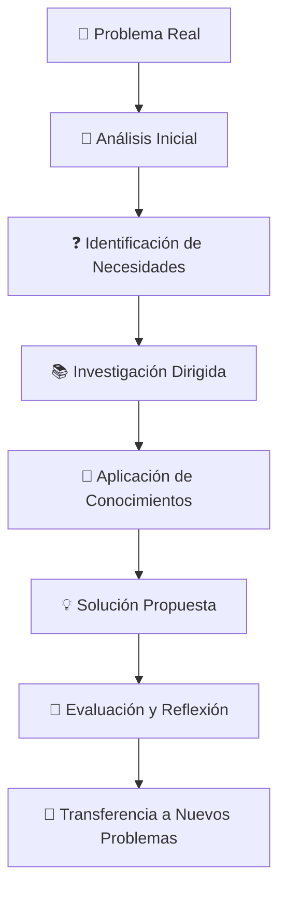
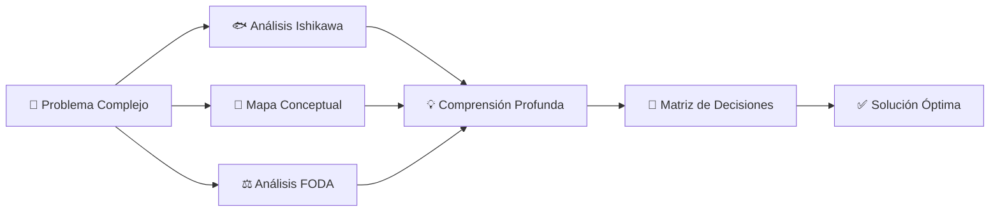

# 🔍 Aprendizaje Basado en Problemas (ABP)

> [!tip] 💡 **Concepto Clave** El Aprendizaje Basado en Problemas (ABP) es una metodología educativa que utiliza problemas del mundo real como punto de partida para el aprendizaje. Los estudiantes trabajan en grupos pequeños para analizar, investigar y resolver problemas complejos, desarrollando conocimientos y habilidades de forma integrada.

## 🏥 Historia y Origen

> [!info] 📜 **Desarrollo Histórico**
> 
> - **1960s**: Creado en la Escuela de Medicina de McMaster University (Canadá)
> - **Problema Original**: Estudiantes memorizaban pero no aplicaban conocimientos
> - **Solución**: Casos clínicos reales como base del aprendizaje
> - **Expansión**: Adoptado mundialmente en medicina, ingeniería, negocios y educación

## 🧠 Fundamentos Pedagógicos

> [!success] 🔬 **Base Teórica**
> 
> - **Constructivismo**: El conocimiento se construye activamente
> - **Aprendizaje Significativo**: Conexión con experiencias previas
> - **Metacognición**: Desarrollo de habilidades de pensamiento
> - **Aprendizaje Colaborativo**: Construcción social del conocimiento
> - **Transferencia**: Aplicación a situaciones nuevas

## 🏗️ Estructura del Método ABP

### 📋 Componentes Esenciales

> [!note] 🔧 **Elementos Fundamentales**
> 
> **🎯 Problema Auténtico**
> 
> - Basado en situaciones reales
> - Mal estructurado (sin solución única)
> - Relevante para el área de estudio
> - Apropiado para el nivel educativo
> 
> **👥 Grupos Pequeños**
> 
> - 5-8 integrantes idealmente
> - Roles rotativos definidos
> - Diversidad de perspectivas
> - Responsabilidad compartida
> 
> **🎓 Facilitador/Tutor**
> 
> - Guía el proceso (no enseña directamente)
> - Hace preguntas estratégicas
> - Fomenta el pensamiento crítico
> - Evalúa el progreso grupal

### 🔄 Proceso de 7 Pasos (Método Maastricht)

> [!example] 📝 **Secuencia Estructurada**
> 
> **1️⃣ Clarificar Términos**
> 
> - Definir conceptos desconocidos
> - Establecer vocabulario común
> - Asegurar comprensión básica
> 
> **2️⃣ Definir el Problema**
> 
> - Identificar el problema central
> - Reformular en términos precisos
> - Establecer el alcance del análisis
> 
> **3️⃣ Analizar el Problema**
> 
> - Lluvia de ideas inicial
> - Discutir conocimientos previos
> - Generar hipótesis preliminares
> 
> **4️⃣ Crear Explicaciones**
> 
> - Organizar ideas sistemáticamente
> - Desarrollar explicaciones coherentes
> - Identificar conexiones causales
> 
> **5️⃣ Formular Objetivos de Aprendizaje**
> 
> - Identificar vacíos de conocimiento
> - Establecer metas específicas
> - Asignar responsabilidades de investigación
> 
> **6️⃣ Recopilar Información**
> 
> - Investigación individual dirigida
> - Búsqueda de fuentes confiables
> - Análisis crítico de información
> 
> **7️⃣ Síntesis e Integración**
> 
> - Compartir hallazgos del grupo
> - Integrar nueva información
> - Formular solución final

## 🎭 Roles en el ABP

### 👑 Roles de Estudiantes

> [!tip] 👥 **Responsabilidades Rotativas**
> 
> **🎯 Coordinador/Líder**
> 
> - Facilita las discusiones grupales
> - Mantiene el foco en objetivos
> - Gestiona el tiempo de reuniones
> - Asegura participación equitativa
> 
> **📝 Secretario/Relator**
> 
> - Registra ideas y decisiones
> - Mantiene el seguimiento del progreso
> - Prepara resúmenes para el grupo
> - Documenta el proceso de aprendizaje
> 
> **🔍 Investigador Principal**
> 
> - Coordina la búsqueda de información
> - Evalúa calidad de fuentes
> - Sintetiza hallazgos clave
> - Presenta resultados al grupo
> 
> **🎨 Presentador**
> 
> - Comunica soluciones propuestas
> - Prepara materiales visuales
> - Representa al grupo ante otros
> - Facilita la retroalimentación externa

### 🎓 Rol del Facilitador

> [!success] 🎯 **Funciones del Tutor**
> 
> - **🤔 Interrogador Socrático**: Hace preguntas que estimulan el pensamiento
> - **🧭 Guía del Proceso**: Mantiene el grupo en el camino correcto
> - **🎭 Modelo de Pensamiento**: Demuestra habilidades metacognitivas
> - **📊 Evaluador Formativo**: Proporciona retroalimentación continua

## 📚 Aplicaciones por Disciplinas

### 🏥 Medicina y Ciencias de la Salud

> [!example] 🩺 **Casos Clínicos**
> 
> **Problema Tipo:** "Paciente de 45 años presenta dolor torácico, sudoración y náuseas. Historia familiar de cardiopatías. ¿Cuál es su diagnóstico y plan de tratamiento?"
> 
> **Proceso de Aprendizaje:**
> 
> - Análisis de síntomas y signos
> - Investigación de diagnósticos diferenciales
> - Revisión de exámenes complementarios
> - Desarrollo de plan terapéutico
> - Consideraciones éticas y comunicacionales

### 🔧 Ingeniería y Tecnología

> [!example] ⚙️ **Desafíos de Diseño**
> 
> **Problema Tipo:** "Una ciudad costera necesita un sistema de protección contra tsunamis que sea económicamente viable y ambientalmente sostenible."
> 
> **Proceso de Aprendizaje:**
> 
> - Análisis de riesgos geológicos
> - Investigación de tecnologías disponibles
> - Consideraciones económicas y sociales
> - Diseño de prototipo
> - Evaluación de impacto ambiental

### 💼 Administración y Negocios

> [!example] 📈 **Casos Empresariales**
> 
> **Problema Tipo:** "Una startup tecnológica está perdiendo participación de mercado frente a competidores. ¿Qué estrategia recomendarías para recuperar competitividad?"
> 
> **Proceso de Aprendizaje:**
> 
> - Análisis de mercado y competencia
> - Investigación de estrategias empresariales
> - Evaluación financiera
> - Desarrollo de plan estratégico
> - Consideración de riesgos y oportunidades

### 🎓 Ciencias Sociales y Educación

> [!example] 🌍 **Problemas Sociales**
> 
> **Problema Tipo:** "El índice de deserción escolar en una comunidad rural ha aumentado 40% en los últimos dos años. ¿Cuáles son las causas y qué soluciones propones?"
> 
> **Proceso de Aprendizaje:**
> 
> - Análisis de factores socioeconómicos
> - Investigación de políticas educativas
> - Estudio de casos similares
> - Desarrollo de intervenciones
> - Evaluación de impacto social

## 🛠️ Herramientas y Recursos

### 💻 Plataformas Digitales

> [!tip] 🔧 **Tecnología de Apoyo**
> 
> **Colaboración Online:**
> 
> - **Slack/Teams**: Comunicación grupal
> - **Miro/Mural**: Mapas mentales colaborativos
> - **Google Workspace**: Documentos compartidos
> - **Zoom/Meet**: Reuniones virtuales
> 
> **Gestión de Proyectos:**
> 
> - **Trello**: Organización de tareas
> - **Asana**: Seguimiento de progreso
> - **Notion**: Base de conocimientos
> - **Monday.com**: Coordinación de equipos

### 📊 Técnicas de Análisis

> [!success] 🎯 **Herramientas Analíticas**
> 
> **🐟 Diagrama de Ishikawa (Espina de Pescado)**
> 
> - Análisis de causas raíz
> - Categorización sistemática
> - Pensamiento estructurado
> 
> **🧠 Mapas Conceptuales**
> 
> - Visualización de relaciones
> - Organización del conocimiento
> - Identificación de conexiones
> 
> **⚖️ Análisis FODA**
> 
> - Evaluación de fortalezas/debilidades
> - Identificación de oportunidades/amenazas
> - Toma de decisiones estratégicas
> 
> **🎯 Matriz de Decisiones**
> 
> - Evaluación de alternativas
> - Criterios ponderados
> - Selección objetiva de soluciones

## 📈 Evaluación en ABP

### 🎯 Criterios de Evaluación

> [!note] 📊 **Dimensiones de Evaluación**
> 
> **💡 Conocimiento y Comprensión**
> 
> - Dominio de conceptos fundamentales
> - Aplicación de principios teóricos
> - Integración interdisciplinaria
> 
> **🔍 Habilidades de Pensamiento**
> 
> - Análisis crítico de información
> - Síntesis creativa de soluciones
> - Evaluación de alternativas
> 
> **👥 Trabajo Colaborativo**
> 
> - Participación constructiva

- - Comunicación efectiva

> - Liderazgo compartido
> 
> **🎯 Aplicación Práctica**
> 
> - Relevancia de soluciones
> - Viabilidad de implementación
> - Consideración de contexto

### 📋 Instrumentos de Evaluación

> [!success] 🔧 **Herramientas de Medición**
> 
> **📝 Rúbricas Específicas**
> 
> - Criterios detallados por competencia
> - Niveles de desempeño claramente definidos
> - Retroalimentación específica
> 
> **👥 Evaluación Peer-to-Peer**
> 
> - Autoevaluación reflexiva
> - Evaluación entre pares
> - Responsabilidad compartida
> 
> **📊 Portafolio de Evidencias**
> 
> - Documentación del proceso
> - Reflexiones metacognitivas
> - Productos intermedios y finales
> 
> **🎭 Presentaciones Orales**
> 
> - Comunicación de resultados
> - Defensa de soluciones
> - Manejo de preguntas críticas

## 🌟 Beneficios del ABP

### 🧠 Desarrollo Cognitivo

> [!success] 📈 **Habilidades Desarrolladas**
> 
> - **🎯 Pensamiento Crítico**: Análisis profundo de situaciones complejas
> - **💡 Creatividad**: Generación de soluciones innovadoras
> - **🔄 Metacognición**: Conciencia del propio proceso de aprendizaje
> - **🧩 Resolución de Problemas**: Enfoque sistemático y metodológico
> - **📚 Aprendizaje Autodirigido**: Autonomía en la búsqueda de conocimiento

### 👥 Habilidades Sociales

> [!tip] 🤝 **Competencias Interpersonales**
> 
> - **💬 Comunicación Efectiva**: Expresión clara de ideas complejas
> - **👂 Escucha Activa**: Comprensión de diferentes perspectivas
> - **🎭 Liderazgo**: Capacidad de guiar y motivar equipos
> - **🤝 Colaboración**: Trabajo efectivo en grupos diversos
> - **⚖️ Negociación**: Resolución constructiva de conflictos

### 🎯 Preparación Profesional

> [!example] 💼 **Conexión con el Mundo Laboral**
> 
> - **📊 Toma de Decisiones**: Bajo presión y con información limitada
> - **🔄 Adaptabilidad**: Flexibilidad ante cambios y desafíos
> - **🌐 Pensamiento Sistémico**: Comprensión de interconexiones complejas
> - **⏰ Gestión del Tiempo**: Priorización y organización efectiva
> - **📈 Mejora Continua**: Reflexión y optimización de procesos

## ⚠️ Desafíos y Limitaciones

### 🚧 Obstáculos Comunes

> [!warning] ❌ **Dificultades Frecuentes**
> 
> **👨‍🎓 Resistencia de Estudiantes**
> 
> - Preferencia por métodos tradicionales
> - Ansiedad ante la incertidumbre
> - Expectativa de respuestas directas
> 
> **🎓 Desafíos Docentes**
> 
> - Cambio de rol tradicional
> - Necesidad de capacitación específica
> - Mayor tiempo de preparación
> 
> **🏫 Limitaciones Institucionales**
> 
> - Estructuras curriculares rígidas
> - Limitaciones de tiempo y recursos
> - Sistemas de evaluación inadecuados

### 🔧 Soluciones y Recomendaciones

> [!success] ✅ **Estrategias de Implementación**
> 
> **📚 Preparación Gradual**
> 
> - Introducción progresiva del método
> - Capacitación previa de facilitadores
> - Desarrollo de casos apropiados
> 
> **🤝 Apoyo Institucional**
> 
> - Compromiso de la dirección académica
> - Recursos técnicos y humanos
> - Flexibilidad curricular
> 
> **👥 Comunidad de Práctica**
> 
> - Intercambio de experiencias
> - Mejora continua del método
> - Soporte entre pares

## 🎯 Implementación Paso a Paso

### 🚀 Fase 1: Preparación (Semanas 1-2)

> [!note] 🛠️ **Elementos Preparatorios**
> 
> **📋 Diseño del Problema**
> 
> - Selección de casos auténticos
> - Calibración de complejidad
> - Definición de objetivos de aprendizaje
> 
> **👥 Formación de Grupos**
> 
> - Criterios de agrupación
> - Asignación de roles iniciales
> - Establecimiento de normas
> 
> **📚 Recursos y Materiales**
> 
> - Bibliografía base
> - Acceso a bases de datos
> - Espacios de trabajo colaborativo

### 🏃 Fase 2: Ejecución (Semanas 3-6)

> [!example] ⚡ **Desarrollo del Proceso**
> 
> **Semana 3:** Análisis inicial
> 
> - Presentación del problema
> - Primeras sesiones grupales
> - Identificación de necesidades de aprendizaje
> 
> **Semana 4-5:** Investigación dirigida
> 
> - Búsqueda y análisis de información
> - Reuniones de seguimiento
> - Síntesis parciales
> 
> **Semana 6:** Síntesis y solución
> 
> - Integración de hallazgos
> - Formulación de propuestas
> - Preparación de presentaciones

### 🎯 Fase 3: Evaluación y Reflexión (Semana 7-8)

> [!success] 📊 **Cierre del Ciclo**
> 
> **🎭 Presentaciones Finales**
> 
> - Comunicación de soluciones
> - Defensa ante pares y facilitadores
> - Retroalimentación constructiva
> 
> **🤔 Reflexión Metacognitiva**
> 
> - Análisis del proceso de aprendizaje
> - Identificación de fortalezas y áreas de mejora
> - Planes de desarrollo personal
> 
> **📈 Evaluación Integral**
> 
> - Autoevaluación individual
> - Evaluación entre pares
> - Evaluación del facilitador

## 🔬 Evidencia Científica

> [!info] 📊 **Investigación de Efectividad**
> 
> **📈 Metaanálisis de Dochy et al. (2003)**
> 
> - Mejora significativa en habilidades de aplicación
> - Mayor retención de conocimientos a largo plazo
> - Desarrollo superior de habilidades profesionales
> 
> **🏥 Estudios en Educación Médica**
> 
> - Mejor desempeño clínico (Schmidt et al., 2009)
> - Mayor satisfacción estudiantil
> - Desarrollo de razonamiento diagnóstico
> 
> **🔧 Investigación en Ingeniería**
> 
> - Mejores habilidades de diseño (Mills & Treagust, 2003)
> - Mayor creatividad en soluciones
> - Mejor trabajo en equipo

## 🌐 ABP en la Era Digital

### 💻 Tecnologías Emergentes

> [!tip] 🚀 **Innovaciones Digitales**
> 
> **🤖 Inteligencia Artificial**
> 
> - Generación de casos personalizados
> - Análisis de patrones de aprendizaje
> - Retroalimentación inteligente
> 
> **🥽 Realidad Virtual/Aumentada**
> 
> - Simulaciones inmersivas
> - Experiencias de campo virtuales
> - Visualización de conceptos abstractos
> 
> **📊 Learning Analytics**
> 
> - Seguimiento del progreso grupal
> - Identificación de dificultades
> - Optimización del proceso

### 🌍 ABP Global y Multicultural

> [!example] 🌐 **Colaboración Internacional**
> 
> - Problemas globales compartidos
> - Perspectivas culturales diversas
> - Competencias interculturales
> - Ciudadanía mundial activa

## 🎯 Adaptación a Diferentes Contextos

### 🏫 Educación Presencial

> [!note] 🏛️ **Modalidad Tradicional**
> 
> - Sesiones cara a cara intensivas
> - Uso de espacios físicos flexibles
> - Acceso a laboratorios y bibliotecas
> - Interacción directa con expertos

### 💻 Educación Virtual

> [!success] 🌐 **Modalidad Online**
> 
> - Plataformas de colaboración digital
> - Sesiones sincrónicas y asincrónicas
> - Recursos multimedia interactivos
> - Comunidades virtuales de aprendizaje

### 🔄 Educación Híbrida

> [!tip] ⚖️ **Modalidad Mixta**
> 
> - Combinación de presencial y virtual
> - Flexibilidad temporal y espacial
> - Aprovechamiento de ventajas de ambas modalidades
> - Adaptación a diferentes estilos de aprendizaje

---

## 📚 Referencias

> [!quote] 🔗 **Enlaces a Otras Notas**
> 
> - [[Método 4 - Aprendizaje Activo]] - Para técnicas complementarias
> - [[Método 7 - Estudio Intercalado]] - Para organización del contenido
> - [[Método 5 - Mapas Mentales]] - Para análisis de problemas complejos
> - [[Motivación Académica]] - Para mantener engagement grupal
> - [[Productividad en la Vida Real]] - Para aplicación profesional
> - [[Técnicas de Concentración]] - Para sesiones grupales efectivas

---

#aprendizaje-basado-problemas #ABP #PBL #metodología-activa #trabajo-colaborativo #pensamiento-crítico #resolución-problemas #educación-superior #competencias-profesionales #aprendizaje-significativo