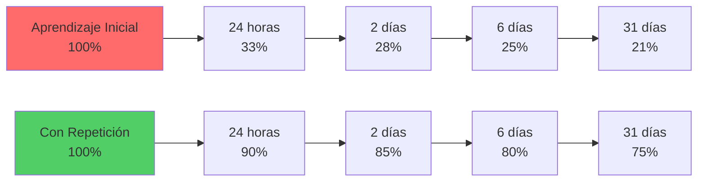
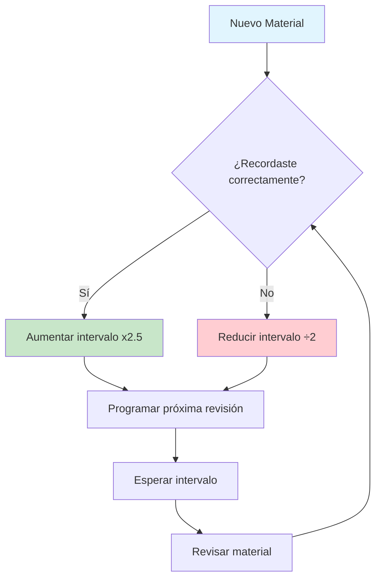
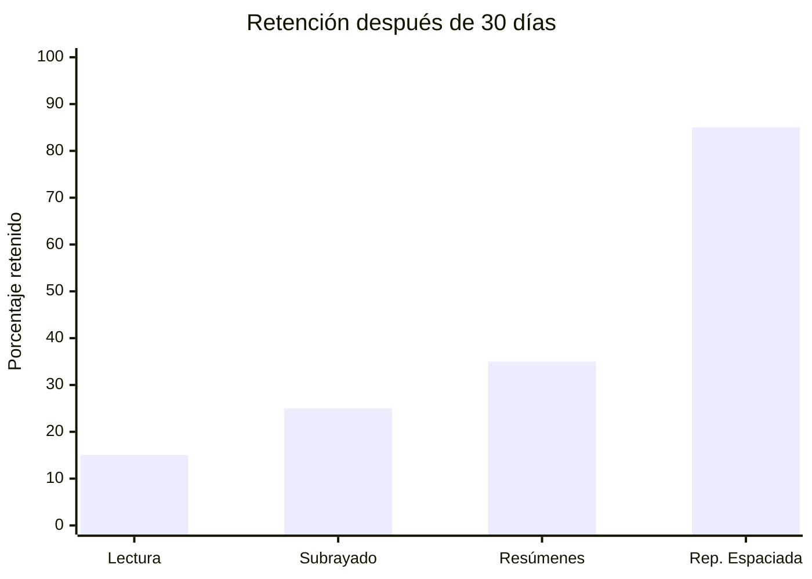

# 🧠 Repetición Espaciada - 

## 📚 ¿Qué es la Repetición Espaciada?

>[!info] **Definición** La repetición espaciada es una técnica de aprendizaje basada en revisar información en intervalos de tiempo crecientes. Se fundamenta en el efecto psicológico del espaciamiento, que demuestra que recordamos mejor la información cuando la estudiamos repetidamente con pausas entre sesiones, en lugar de hacerlo de manera concentrada.

## 🔬 Fundamento Científico

>[!tip] **Base Neurológica** 🧬 La repetición espaciada aprovecha la **curva del olvido** de Hermann Ebbinghaus, que muestra cómo la retención de información disminuye exponencialmente con el tiempo. Al revisar el material justo antes de olvidarlo, fortalecemos las conexiones sinápticas y mejoramos la consolidación en la memoria a largo plazo.

### 📊 Curva del Olvido vs Repetición Espaciada

## ⚙️ Metodología y Intervalos

>[!warning] **Intervalos Óptimos**
>
> ⏰ Los intervalos de revisión deben seguir una progresión exponencial:
> 
> - **1er repaso**: 1 día después
> - **2do repaso**: 3 días después del anterior
> - **3er repaso**: 7 días después del anterior
> - **4to repaso**: 14 días después del anterior
> - **5to repaso**: 30 días después del anterior
> - **6to repaso**: 90+ días después del anterior

### 🔄 Algoritmo de Espaciamiento

## 🛠️ Implementación Práctica

>[!tip] **Pasos para Implementar**
>
> 1. **📝 Crear tarjetas de estudio**: Fragmenta el contenido en unidades pequeñas
> 2. **📅 Establecer calendario**: Usa un sistema de seguimiento (Anki, Notion, etc.)
> 3. **🎯 Evaluar retención**: Clasifica tu recuerdo como fácil, medio o difícil
> 4. **🔄 Ajustar intervalos**: Modifica según tu rendimiento
> 5. **📊 Monitorear progreso**: Lleva estadísticas de tu aprendizaje

### 🔗 Integración con otros Métodos

>[!info] **Combinaciones Efectivas**
>
> - **🍅 Con [[Método 1 - Pomodoro]]**: Usa bloques de 25 min para sesiones de repaso
> - **📚 Con [[Método 2 - Feynman]]**: Explica conceptos durante las revisiones
> - **🎯 Con [[Técnicas de Concentración]]**: Mantén focus durante las sesiones
> - **📝 Con [[Bullet Journal Method (BuJo)]]**: Trackea tus repasos y progreso

### 📱 Herramientas Recomendadas

>[!info] **Software Especializado**
>
> - **Anki**: Algoritmo SM-2, multiplataforma
> - **SuperMemo**: Pionero en repetición espaciada
> - **Quizlet**: Interfaz amigable, funciones sociales
> - **RemNote**: Integración con toma de notas
> - **Obsidian + Spaced Repetition Plugin**: Para usuarios de Obsidian

>[!warning] **Configuración del Entorno**
>
> 📱 Para maximizar efectividad, combina con:
> 
> - **[[Productividad Digital]]**: Configuración de apps y automatizaciones
> - **[[Organización Física del Espacio]]**: Ambiente libre de distracciones
> - **[[Gestión del Tiempo]]**: Planificación sin dependencia digital

## 🎯 Estrategias de Optimización

>[!tip] **Maximizar Efectividad**
>
> 🚀 **Principio de Dificultad Deseable**: Hacer que la recuperación sea ligeramente difícil mejora el aprendizaje
> 
> ### Técnicas Complementarias:
> 
> - **🧩 Elaboración**: Conectar nueva información con conocimiento previo
> - **🔀 Intercalado**: Mezclar diferentes tipos de problemas/temas
> - **🧠 Testing Effect**: Autoexaminarse en lugar de solo releer
> - **🎨 Codificación Dual**: Usar imágenes y texto simultáneamente

### 🧘 Optimización Mental y Física

>[!info] **Estado Óptimo para Estudio**
>
> - **[[Mindfulness]]**: Practica atención plena antes de sesiones de repaso
> - **[[Hábitos de Estudio]]**: Desarrolla rutinas consistentes
> - **[[Hábitos y Rutinas Saludables]]**: Nutrición y ejercicio para mejor rendimiento
> - **[[Deep Work]]**: Elimina distracciones durante repasos críticos

## 💡 Motivación y Sostenibilidad

>[!tip] **Mantener Consistencia a Largo Plazo**
>
> 🎯 La repetición espaciada requiere disciplina sostenida. Estrategias clave:
> 
> ### 🔥 Sistema de Motivación
> 
> - **[[Motivación Académica]]**: Técnicas para mantener el impulso
> - **🏆 Gamificación**: Usa streaks, puntos y logros
> - **📊 Visualización de progreso**: Gráficos de retención
> - **🎉 Recompensas graduales**: Celebra hitos importantes
> 
> ### ⚖️ Balance y Recuperación
> 
> - **[[Productividad en la Vida Real]]**: Integra sin sobrecargar
> - **🧘 Descansos activos**: Evita el burnout cognitivo
> - **📅 Planificación realista**: Establece metas alcanzables

## ❌ Errores Comunes

>[!warning] **Qué Evitar**
>
> - **📚 Cramming**: Estudiar todo de una vez
> - **⏰ Intervalos fijos**: No adaptar según dificultad
> - **🎯 Tarjetas demasiado complejas**: Una idea por tarjeta
> - **📊 Ignorar métricas**: No revisar estadísticas de rendimiento
> - **🚫 Abandonar temprano**: Los beneficios se ven a largo plazo

>[!info] **Soluciones Preventivas**
>
> Consulta [[Hábitos de Estudio]] para desarrollar consistencia y [[Método 9 - Metodología GTD (Getting Things Done)]] para organizar mejor tu sistema de revisiones.

## 📈 Beneficios y Resultados

>[!info] **Ventajas Comprobadas**
>
> - **🎯 Retención superior**: 80-90% vs 20-30% métodos tradicionales
> - **⏱️ Eficiencia temporal**: Menos tiempo total de estudio
> - **🧠 Memoria a largo plazo**: Consolidación duradera
> - **📚 Aplicable universalmente**: Idiomas, ciencias, humanidades
> - **🎮 Motivación sostenida**: Sistema de progreso gamificado

### 📊 Comparación de Métodos

## 🎓 Aplicaciones por Disciplina

>[!tip] **Adaptaciones Específicas**
>
> - **🗣️ Idiomas**: Vocabulario, conjugaciones, expresiones
> - **🧪 Ciencias**: Fórmulas, procesos, clasificaciones
> - **⚖️ Derecho**: Artículos, jurisprudencia, procedimientos
> - **💼 Negocios**: Conceptos, frameworks, casos de estudio
> - **🎨 Arte/Historia**: Fechas, obras, movimientos culturales

---

## 📚 Referencias

> [!quote] Enlaces a otras notas **Métodos de Estudio Relacionados:**
> 
> - [[Método 1 - Pomodoro]] - Gestión de tiempo para sesiones
> - [[Método 2 - Feynman]] - Explicación durante revisiones
> - [[Método 9 - Metodología GTD (Getting Things Done)]] - Organización del sistema
> - [[Técnicas de Concentración]] - Maximizar focus en repasos
> 
> **Productividad y Hábitos:**
> 
> - [[Hábitos de Estudio]] - Rutinas consistentes
> - [[Hábitos y Rutinas Saludables]] - Base física y mental
> - [[Motivación Académica]] - Mantener consistencia
> - [[Deep Work]] - Trabajo profundo sin distracciones
> - [[Mindfulness]] - Atención plena en el estudio
> 
> **Herramientas y Organización:**
> 
> - [[Bullet Journal Method (BuJo)]] - Tracking de progreso
> - [[Productividad Digital]] - Apps y automatización
> - [[Productividad en la Vida Real]] - Integración práctica
> - [[Organización Física del Espacio]] - Ambiente óptimo
> - [[Gestión del Tiempo]] - Planificación analógica
> 
> **Temas Complementarios Sugeridos:**
> 
> - [[Curva del Olvido]]
> - [[Metacognición]]

---

**Tags:** #estudio #memoria #repeticion-espaciada #anki #aprendizaje #neurociencia #productividad #tecnicas-estudio