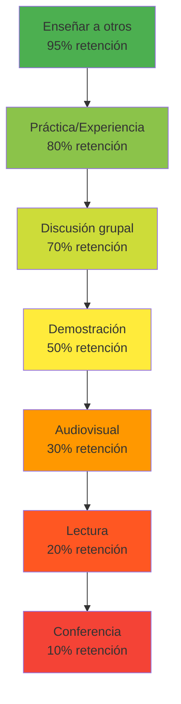
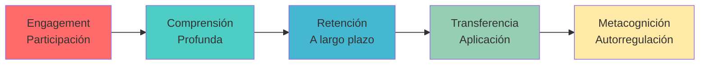

# 🎯Aprendizaje Activo

## 🧠 ¿Qué es el Aprendizaje Activo?

>[!info] **Definición**
>
> El aprendizaje activo es una metodología educativa que involucra al estudiante de manera participativa en el proceso de construcción del conocimiento. A diferencia del aprendizaje pasivo (escuchar, leer), requiere que el estudiante procese, analice, sintetice y aplique activamente la información a través de diversas estrategias cognitivas.

## 🔬 Fundamento Científico

>[!tip] **Base Neurológica**
>
> 🧬 El aprendizaje activo aprovecha la **neuroplasticidad** del cerebro, creando múltiples vías neuronales a través de diferentes modalidades sensoriales y cognitivas. La investigación demuestra que el cerebro retiene:
> 
> - **10%** de lo que lee
> - **20%** de lo que escucha
> - **30%** de lo que ve
> - **50%** de lo que ve y escucha
> - **70%** de lo que discute
> - **80%** de lo que experimenta
> - **95%** de lo que enseña a otros

### 🧪 Pirámide del Aprendizaje

## ⚙️ Principios Fundamentales

>[!warning] **Los 7 Pilares del Aprendizaje Activo**
>
> 1. **🎯 Participación Consciente**: El estudiante es protagonista de su aprendizaje
> 2. **🔄 Interacción Constante**: Con el material, compañeros y instructor
> 3. **💭 Reflexión Metacognitiva**: Pensar sobre el propio proceso de aprendizaje
> 4. **🛠️ Aplicación Práctica**: Usar el conocimiento en contextos reales
> 5. **❓ Cuestionamiento Crítico**: Desafiar ideas y buscar evidencias
> 6. **🔗 Conexión de Ideas**: Relacionar conceptos nuevos con conocimiento previo
> 7. **📊 Retroalimentación Inmediata**: Evaluación continua del progreso

## 🛠️ Técnicas y Estrategias

### 🎓 Técnicas Individuales

>[!tip] **Estrategias de Autoestudio Activo**
>
> - **📝 Toma de notas elaborativa**: Parafrasear, resumir, crear mapas conceptuales
> - **❓ Autoquestionamiento**: Generar preguntas sobre el material
> - **🗣️ Explicación en voz alta**: Método [[Método 2 - Feynman]]
> - **🔄 Práctica distribuida**: Combinado con [[Método 3 - Repetición Espaciada]]
> - **🎯 Testing activo**: Autoexámenes frecuentes
> - **📊 Visualización de datos**: Crear gráficos, diagramas, esquemas

### 👥 Técnicas Colaborativas

>[!info] **Aprendizaje Social y Grupal**
>
> - **💬 Discusiones estructuradas**: Debates, seminarios, mesas redondas
> - **🏫 Enseñanza entre pares**: Explicar conceptos a compañeros
> - **🎭 Juegos de roles**: Simular situaciones reales
> - **🧩 Resolución colaborativa**: Proyectos en equipo
> - **📋 Evaluación por pares**: Retroalimentación mutua

### 🔗 Integración con otros Métodos

>[!warning] **Sinergia Metodológica**
>
> - **⏰ Con [[Método 1 - Pomodoro]]**: Sesiones activas de 25 minutos
> - **📚 Con [[Técnicas de Concentración]]**: Mantener focus durante actividades
> - **🎯 Con [[Deep Work]]**: Aprendizaje profundo sin distracciones
> - **📝 Con [[Bullet Journal Method (BuJo)]]**: Tracking de actividades de aprendizaje
> - **🧠 Con [[Mindfulness]]**: Conciencia plena durante el proceso

## 🎯 Estrategias por Tipo de Contenido

### 📚 Contenidos Teóricos

>[!tip] **Activación de Conceptos Abstractos**
>
> - **🗺️ Mapas conceptuales**: Visualizar relaciones entre ideas
> - **📊 Organizadores gráficos**: Estructurar información jerárquicamente
> - **🎪 Analogías y metáforas**: Conectar con experiencias conocidas
> - **💡 Casos de estudio**: Aplicar teoría a situaciones reales
> - **🔍 Análisis crítico**: Evaluar argumentos y evidencias

### 🧪 Contenidos Prácticos

>[!info] **Desarrollo de Habilidades**
>
> - **🛠️ Práctica deliberada**: Repetición enfocada en debilidades
> - **🎯 Simulaciones**: Entornos controlados de práctica
> - **📈 Proyectos progresivos**: Complejidad creciente
> - **🔧 Troubleshooting**: Resolución de problemas reales
> - **📹 Grabación y análisis**: Revisar el propio desempeño

## 💻 Herramientas y Tecnología

>[!info] **Recursos Digitales para Aprendizaje Activo**
>
> ### 🎮 Gamificación y Simulación
> 
> - **Kahoot**: Quizzes interactivos y competitivos
> - **Mentimeter**: Encuestas y votaciones en tiempo real
> - **Socrative**: Evaluaciones formativas instantáneas
> - **PhET Simulations**: Simuladores científicos interactivos
> 
> ### 📱 Apps de Participación
> 
> - **Padlet**: Muros colaborativos virtuales
> - **Flipgrid**: Videos de discusión asíncrona
> - **Nearpod**: Presentaciones interactivas
> - **Classcraft**: Gamificación del aula

>[!warning] **Configuración del Entorno Digital**
>
> Optimiza tu setup con:
> 
> - **[[Productividad Digital]]**: Configuración de apps y flujos de trabajo
> - **[[Organización Física del Espacio]]**: Ambiente propicio para interacción
> - **[[Gestión del Tiempo]]**: Balance entre digital y analógico

## 🧘 Aspectos Cognitivos y Emocionales

### 🧠 Metacognición en Acción

>[!tip] **Desarrollo de Autoconciencia del Aprendizaje**
>
> - **🎯 Establecimiento de objetivos**: Metas específicas y medibles
> - **📊 Monitoreo del progreso**: Evaluación continua del avance
> - **🔄 Ajuste de estrategias**: Adaptar métodos según resultados
> - **💭 Reflexión post-aprendizaje**: Análisis de lo aprendido y cómo
> 
> Conecta con [[Motivación Académica]] para mantener el impulso y con [[Hábitos de Estudio]] para crear rutinas metacognitivas.

### 🎭 Gestión Emocional

>[!info] **Inteligencia Emocional en el Aprendizaje**
>
> - **😊 Motivación intrínseca**: Encontrar placer en el proceso
> - **💪 Tolerancia a la frustración**: Persistir ante dificultades
> - **🎉 Celebración de logros**: Reconocer el progreso
> - **🤝 Colaboración empática**: Trabajar efectivamente con otros
> 
> Integra con [[Hábitos y Rutinas Saludables]] para mantener equilibrio emocional.

## 📊 Evaluación y Retroalimentación

### 🔍 Autoevaluación Activa

>[!warning] **Herramientas de Autoanálisis**
>
> - **📋 Rúbricas personalizadas**: Criterios claros de evaluación
> - **📈 Portafolios de aprendizaje**: Evidencia del progreso
> - **🎯 Tests de comprensión**: Evaluaciones frecuentes y variadas
> - **📝 Diarios reflexivos**: Registro del proceso de aprendizaje
> - **🔄 Feedback loops**: Ciclos de mejora continua

### 📊 Métricas de Efectividad

## ❌ Obstáculos y Soluciones

>[!warning] **Desafíos Comunes**
>
> - **😴 Resistencia al cambio**: Preferencia por métodos pasivos
> - **⏰ Percepción de mayor tiempo**: Sensación de lentitud inicial
> - **😰 Ansiedad social**: Miedo a participar activamente
> - **🧠 Sobrecarga cognitiva**: Demasiada información simultánea
> - **📱 Distracciones tecnológicas**: Mal uso de herramientas digitales

>[!info] **Estrategias de Superación**
>
> Consulta [[Técnicas de Concentración]] para manejar distracciones y [[Método 9 - Metodología GTD (Getting Things Done)]] para organizar el proceso de aprendizaje activo de manera sistemática.

## 🎯 Aplicaciones por Disciplina

>[!tip] **Adaptaciones Específicas**
>
> ### 🔬 Ciencias y Matemáticas
> 
> - **🧪 Laboratorios virtuales**: Experimentación segura
> - **📊 Análisis de datos reales**: Proyectos con datasets actuales
> - **🧮 Resolución de problemas**: Múltiples estrategias y enfoques
> 
> ### 📚 Humanidades y Ciencias Sociales
> 
> - **🎭 Simulaciones históricas**: Role-playing de eventos
> - **💬 Debates estructurados**: Análisis de perspectivas múltiples
> - **📖 Análisis textual colaborativo**: Interpretación grupal
> 
> ### 💼 Áreas Profesionales
> 
> - **📈 Casos de negocio**: Análisis de situaciones reales
> - **🎯 Proyectos aplicados**: Solucionar problemas del sector
> - **🤝 Networking activo**: Construcción de redes profesionales

## 💡 Técnicas Avanzadas

### 🚀 Aprendizaje Experiencial

>[!tip] **Learning by Doing**
>
> - **🏗️ Construccionismo**: Aprender construyendo
> - **🔄 Ciclo de Kolb**: Experiencia → Reflexión → Conceptualización → Experimentación
> - **🎯 Aprendizaje basado en problemas (PBL)**: Resolver desafíos reales
> - **📋 Aprendizaje basado en proyectos**: Productos tangibles
> - **🌐 Service Learning**: Aprender sirviendo a la comunidad

### 🧬 Multimodalidad Sensorial

>[!info] **Activación de Múltiples Sentidos**
>
> - **👁️ Visual**: Diagramas, videos, mapas mentales
> - **👂 Auditivo**: Podcasts, discusiones, música
> - **✋ Kinestésico**: Movimiento, manipulación, construcción
> - **📝 Lectoescritura**: Notas, resúmenes, creación de contenido
> - **🎨 Artístico**: Creatividad, expresión, representación

---

## 📚 Referencias

> [!quote] Enlaces a otras notas **Métodos de Estudio Relacionados:**
> 
> - [[Método 1 - Pomodoro]] - Gestión de tiempo para sesiones activas
> - [[Método 2 - Feynman]] - Explicación como forma de aprendizaje activo
> - [[Método 9 - Metodología GTD (Getting Things Done)]] - Organización del proceso
> - [[Método 3 - Repetición Espaciada]] - Consolidación activa en memoria
> - [[Técnicas de Concentración]] - Focus durante actividades participativas
> 
> **Productividad y Hábitos:**
> 
> - [[Hábitos de Estudio]] - Rutinas para aprendizaje activo
> - [[Hábitos y Rutinas Saludables]] - Base física y mental
> - [[Motivación Académica]] - Mantener engagement a largo plazo
> - [[Deep Work]] - Trabajo profundo e inmersivo
> - [[Mindfulness]] - Conciencia plena en el proceso
> 
> **Herramientas y Organización:**
> 
> - [[Bullet Journal Method (BuJo)]] - Tracking de actividades y progreso
> - [[Productividad Digital]] - Apps y herramientas tecnológicas
> - [[Organización Física del Espacio]] - Ambiente para interacción
> - [[Gestión del Tiempo]] - Balance digital-analógico
> 
> **Temas Complementarios Sugeridos:**
> 
> - [[Gamificación Colaborativa]]
> - [[Evaluación Formativa vs Sumativa]]

---

**Tags:** #aprendizaje-activo #metodologia #educacion #participacion #interactividad #neuroeducacion #metacognicion #colaboracion #tecnologia-educativa #evaluacion