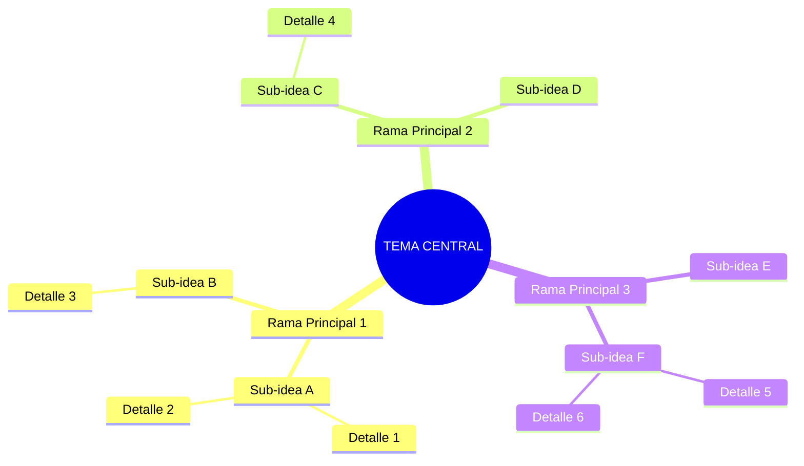
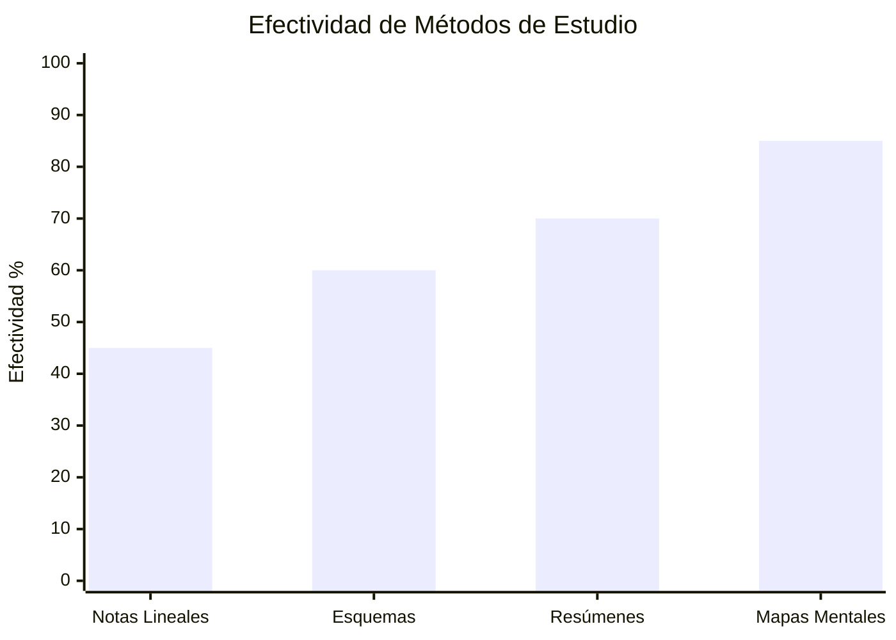

# 🗺️ Mapas Mentales 

## 🧠 ¿Qué son los Mapas Mentales?

>[!info] **Definición**
>
> Los mapas mentales son representaciones gráficas no lineales del conocimiento que imitan la forma natural en que el cerebro procesa y almacena información. Desarrollados por Tony Buzan, utilizan palabras clave, imágenes, colores y conexiones radiales para crear una estructura visual que facilite la comprensión, memoria y creatividad.

## 🔬 Fundamento Científico

>[!tip] **Base Neurológica**
>
> 🧬 Los mapas mentales aprovechan la **capacidad del cerebro para el pensamiento radiante**, donde las ideas se extienden desde un concepto central como las ramas de un árbol. Esta técnica activa simultáneamente:
> 
> - **🎨 Hemisferio derecho**: Creatividad, colores, imágenes, intuición
> - **📝 Hemisferio izquierdo**: Lógica, palabras, números, análisis
> - **🔗 Corpus callosum**: Conexión entre ambos hemisferios
> - **🧠 Corteza prefrontal**: Organización y planificación

### 🌳 Estructura del Pensamiento Radiante

## ⚙️ Principios Fundamentales de Tony Buzan

>[!warning] **Las 7 Leyes de los Mapas Mentales**
>
> 1. **🎯 Tema central**: Una imagen poderosa en el centro de la página
> 2. **🌈 Uso de colores**: Mínimo 3 colores diferentes para estimular el cerebro
> 3. **🖼️ Imágenes y símbolos**: Una imagen vale más que mil palabras
> 4. **📏 Palabras clave**: Una palabra por línea, máximo eficiencia
> 5. **🔗 Líneas conectoras**: Líneas curvas y orgánicas, no rectas
> 6. **📐 Jerarquía visual**: Ramas gruesas → delgadas, grande → pequeño
> 7. **🎨 Estilo personal**: Desarrollo de tu propio lenguaje visual

## 🛠️ Proceso de Creación

### 📝 Método Tradicional (Papel)

>[!tip] **Pasos para Crear un Mapa Mental Analógico**
>
> 1. **📄 Preparación**: Papel A4 horizontal, lápices de colores
> 2. **🎯 Centro**: Dibuja el tema central con imagen y color
> 3. **🌿 Ramas principales**: 5-7 temas principales desde el centro
> 4. **🍃 Sub-ramas**: Ideas secundarias desde las principales
> 5. **🎨 Decoración**: Añade colores, símbolos, iconos
> 6. **🔄 Refinamiento**: Revisa, reorganiza, mejora
> 
> Combina con [[Técnicas de Concentración]] para mantener focus durante la creación.

### 💻 Método Digital

>[!info] **Herramientas Digitales Recomendadas**
>
> **🌟 Especializadas en Mapas Mentales:**
> 
> - **MindMeister**: Colaborativo, plantillas, integración cloud
> - **XMind**: Profesional, múltiples estructuras, exportación
> - **iMindMap**: Creado por Tony Buzan, orgánico
> - **SimpleMind**: Multiplataforma, intuitivo
> 
> **🎨 Herramientas Generales:**
> 
> - **Miro/Mural**: Pizarras infinitas, colaboración
> - **Canva**: Templates prediseñados, fácil uso
> - **Lucidchart**: Diagramas profesionales
> 
> Optimiza tu setup con [[Productividad Digital]] para flujos eficientes.

### 🔗 Integración con otros Métodos

>[!warning] **Sinergia Metodológica**
>
> - **⏰ Con [[Método 1 - Pomodoro]]**: Sesiones de 25 min para crear mapas
> - **📚 Con [[Método 2 - Feynman]]**: Mapear conceptos antes de explicar
> - **🎯 Con [[Método 4 - Aprendizaje Activo]]**: Visualización participativa
> - **🔄 Con [[Método 3 - Repetición Espaciada]]**: Revisar mapas en intervalos
> - **📝 Con [[Bullet Journal Method (BuJo)]]**: Mapear proyectos y objetivos

## 🎯 Tipos de Mapas Mentales

### 📚 Mapas de Estudio

>[!tip] **Para Aprendizaje y Comprensión**
>
> - **📖 Mapas de lectura**: Resumir libros, artículos, papers
> - **🧪 Mapas de proceso**: Procedimientos, experimentos, métodos
> - **📊 Mapas comparativos**: Pros/contras, similitudes/diferencias
> - **🗓️ Mapas cronológicos**: Historia, evolución, líneas de tiempo
> - **🔍 Mapas analíticos**: Descomposición de problemas complejos

### 🚀 Mapas de Productividad

>[!info] **Organización y Planificación**
>
> - **🎯 Mapas de objetivos**: Metas, estrategias, acciones
> - **📋 Mapas de proyectos**: Tareas, recursos, timelines
> - **💡 Mapas de lluvia de ideas**: Creatividad, innovación
> - **🔄 Mapas de procesos**: Workflows, procedimientos
> - **📈 Mapas de decisión**: Análisis de opciones y consecuencias
> 
> Conecta con [[Método 9 - Metodología GTD (Getting Things Done)]] para mapear tu sistema de productividad.

### 🧘 Mapas de Desarrollo Personal

>[!warning] **Crecimiento y Autoconocimiento**
>
> - **🎭 Mapas de identidad**: Valores, fortalezas, propósito
> - **📅 Mapas de vida**: Planes a largo plazo, visión personal
> - **🧠 Mapas de habilidades**: Competencias actuales y deseadas
> - **💭 Mapas emocionales**: Estados, triggers, estrategias
> 
> Integra con [[Motivación Académica]] y [[Hábitos y Rutinas Saludables]].

## 🎨 Elementos Visuales Avanzados

### 🌈 Psicología del Color

>[!tip] **Código de Colores Efectivo**
>
> - **🔴 Rojo**: Urgencia, acción, energía, alertas
> - **🔵 Azul**: Información, datos, análisis, calma
> - **🟢 Verde**: Crecimiento, naturaleza, positivo, GO
> - **🟡 Amarillo**: Creatividad, ideas, atención, alegría
> - **🟣 Morado**: Imaginación, espiritualidad, lujo
> - **🟠 Naranja**: Entusiasmo, calidez, social
> - **⚫ Negro**: Elegancia, contraste, definición
> - **🤍 Blanco**: Simplicidad, claridad, espacios

### 🖼️ Iconografía y Símbolos

>[!info] **Biblioteca de Símbolos Universales**
>
> **⭐ Básicos:**
> 
> - 💡 Ideas, creatividad, inspiración
> - ⚡ Energía, rapidez, impacto
> - 🎯 Objetivos, metas, focus
> - 🔑 Claves, puntos importantes
> - ⚠️ Advertencias, precauciones
> 
> **📊 Académicos:**
> 
> - 📚 Conocimiento, estudio
> - 🧪 Ciencia, experimentos
> - 📐 Matemáticas, precisión
> - 🗣️ Comunicación, idiomas
> - 🎨 Arte, creatividad
> 
> **🏢 Profesionales:**
> 
> - 💼 Negocios, trabajo
> - 📈 Crecimiento, progreso
> - 🤝 Colaboración, teamwork
> - ⏰ Tiempo, deadlines
> - 💰 Finanzas, recursos

## 📊 Ventajas y Beneficios

>[!info] **Beneficios Cognitivos Comprobados**
>
> - **🧠 Memoria mejorada**: 15% más retención que notas lineales
> - **⚡ Velocidad de lectura**: 10-15% más rápido procesamiento
> - **🎨 Creatividad aumentada**: Activación hemisferio derecho
> - **🔗 Conexiones conceptuales**: Mayor comprensión relacional
> - **⏱️ Eficiencia temporal**: Revisión rápida y efectiva
> - **👁️ Visión global**: Perspectiva holística del tema
> - **💪 Concentración**: Mayor engagement y atención

### 📈 Comparación con Métodos Tradicionales

## 🎓 Aplicaciones por Disciplina

### 🔬 Ciencias y Tecnología

>[!tip] **Mapeo Científico**
>
> - **🧬 Biología**: Ecosistemas, procesos celulares, clasificaciones
> - **⚗️ Química**: Reacciones, elementos, compuestos
> - **🔢 Matemáticas**: Fórmulas, teoremas, demostraciones
> - **💻 Programación**: Algoritmos, estructuras de datos
> - **🏗️ Ingeniería**: Sistemas, procesos, diseños

### 📚 Humanidades y Arte

>[!info] **Mapeo Humanístico**
>
> - **📖 Literatura**: Análisis de obras, personajes, temas
> - **🏛️ Historia**: Líneas temporales, causas-efectos
> - **🗣️ Idiomas**: Vocabulario, gramática, expresiones
> - **🎭 Arte**: Movimientos, técnicas, artistas
> - **⚖️ Derecho**: Casos, leyes, procedimientos

### 💼 Áreas Profesionales

>[!warning] **Mapeo Empresarial**
>
> - **📈 Marketing**: Estrategias, campañas, segmentos
> - **💰 Finanzas**: Análisis, presupuestos, inversiones
> - **👥 RRHH**: Procesos, competencias, desarrollo
> - **🏢 Gestión**: Proyectos, procesos, estructuras
> - **🔍 Consultoría**: Diagnósticos, soluciones, implementación

## 🚫 Errores Comunes y Soluciones

>[!warning] **Qué Evitar**
>
> - **📝 Demasiado texto**: Usar frases largas en lugar de palabras clave
> - **⚫ Monocromático**: No usar colores, todo en negro
> - **📏 Líneas rectas**: Rígidez visual, menos orgánico
> - **🎯 Sin centro claro**: Múltiples focos de atención
> - **🔄 No revisar**: Crear y olvidar, sin mejora iterativa
> - **👥 Copiar estilos**: No desarrollar lenguaje visual propio

>[!info] **Estrategias de Mejora**
>
> Consulta [[Hábitos de Estudio]] para crear rutinas de mapeo y [[Deep Work]] para sesiones de creación sin distracciones. Para superar bloqueos creativos, usa [[Mindfulness]] para centrar la mente antes de mapear.

## 🎯 Técnicas Avanzadas

### 🔄 Mapas Dinámicos

>[!tip] **Evolución Continua**
>
> - **📱 Mapas digitales colaborativos**: Edición en tiempo real
> - **🔗 Hipervínculos**: Conexión con recursos externos
> - **📹 Elementos multimedia**: Videos, audios, animaciones
> - **📊 Datos en vivo**: Actualización automática de información
> - **🌐 Mapas web**: Navegación no lineal de contenidos

### 🧠 Metamapeo

>[!info] **Mapas de Mapas**
>
> - **🗂️ Índices visuales**: Organización de múltiples mapas
> - **🔍 Mapas de búsqueda**: Localizar información específica
> - **📈 Mapas de progreso**: Visualizar avance en aprendizaje
> - **🎯 Mapas de objetivos**: Jerarquía de metas y submetas
> - **🔄 Mapas de proceso**: Flujos de trabajo complejos

## 💡 Integración con Productividad Personal

### 📅 Planificación con Mapas

>[!warning] **Organización Visual**
>
> - **🗓️ Mapas de agenda**: Visualizar semana/mes
> - **📋 Mapas de tareas**: GTD visual con [[Método 9 - Metodología GTD (Getting Things Done)]]
> - **🎯 Mapas de hábitos**: Tracking visual con [[Hábitos de Estudio]]
> - **💭 Mapas de reflexión**: Integración con [[Bullet Journal Method (BuJo)]]
> - **🧘 Mapas de bienestar**: Conexión con [[Hábitos y Rutinas Saludables]]

### 🏠 Configuración del Espacio

>[!tip] **Ambiente Óptimo para Mapear**
>
> Combina con [[Organización Física del Espacio]] para crear un área de trabajo visual:
> 
> - **🖼️ Paredes de mapas**: Exhibir trabajos en progreso
> - **🎨 Materiales accesibles**: Colores, papeles, herramientas
> - **💡 Iluminación adecuada**: Natural preferida, LED blanco
> - **🪑 Mobiliario flexible**: Mesas grandes, sillas cómodas
> - **📱 Tech setup**: Tablets, stylus, pantallas grandes

---

## 📚 Referencias

> [!quote] Enlaces a otras notas **Métodos de Estudio Relacionados:**
> 
> - [[Método 1 - Pomodoro]] - Gestión de tiempo para sesiones de mapeo
> - [[Método 2 - Feynman]] - Mapear antes de explicar conceptos
> - [[Método 4 - Aprendizaje Activo]] - Visualización como participación
> - [[Método 9 - Metodología GTD (Getting Things Done)]] - Organización visual de tareas
> - [[Método 3 - Repetición Espaciada]] - Revisar mapas en intervalos programados
> - [[Técnicas de Concentración]] - Focus durante creación de mapas
> 
> **Productividad y Hábitos:**
> 
> - [[Hábitos de Estudio]] - Rutinas de mapeo mental
> - [[Hábitos y Rutinas Saludables]] - Base física para creatividad
> - [[Motivación Académica]] - Mantener engagement visual
> - [[Deep Work]] - Sesiones profundas de creación
> - [[Mindfulness]] - Conciencia plena en el proceso creativo
> 
> **Herramientas y Organización:**
> 
> - [[Bullet Journal Method (BuJo)]] - Integración de mapas en sistema
> - [[Productividad Digital]] - Apps y herramientas de mapeo
> - [[Organización Física del Espacio]] - Ambiente para trabajo visual
> - [[Gestión del Tiempo]] - Balance digital-analógico
> - [[Productividad en la Vida Real]] - Aplicación práctica diaria
> 
> **Temas Complementarios Sugeridos:**
> 
> - [[Design Thinking]]
> - [[Creatividad y Pensamiento Divergente]]

---

**Tags:** #mapas-mentales #visualizacion #creatividad #tony-buzan #pensamiento-radiante #neuroeducacion #organizacion-visual #aprendizaje-visual #productividad #herramientas-digitales