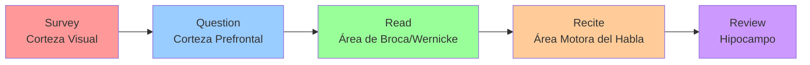
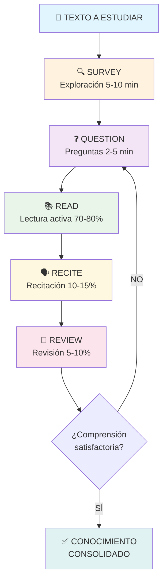
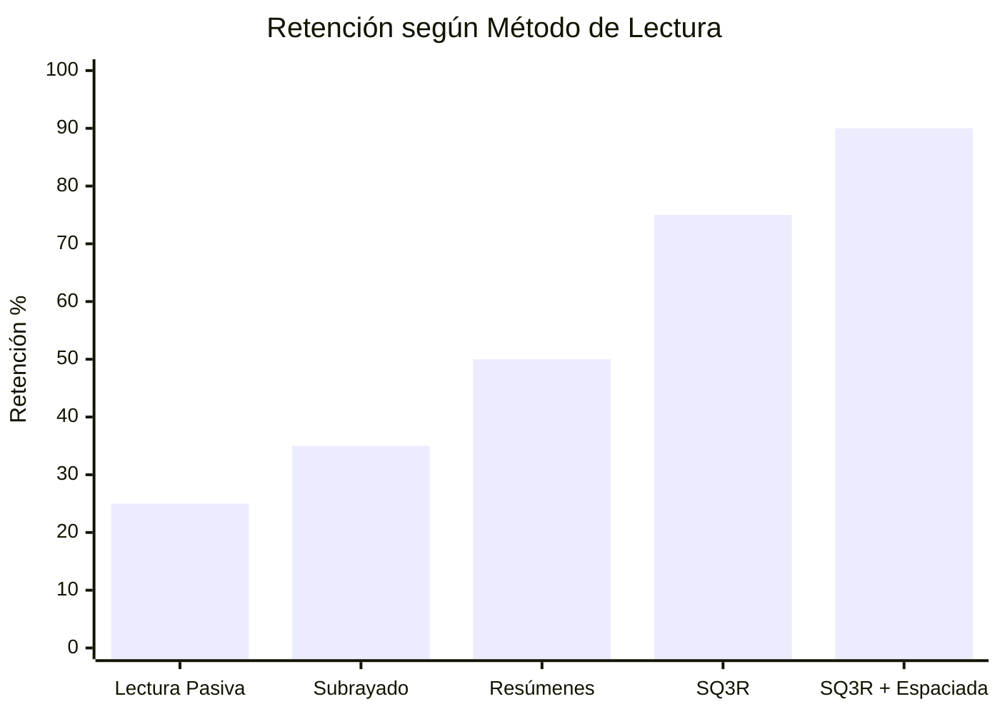

# 📖 Método 6 - Método SQ3R

## 🧠 ¿Qué es el Método SQ3R?

>[!info] **Definición**
>
> El método SQ3R es una técnica sistemática de lectura comprensiva desarrollada por Francis P. Robinson en 1946. Las siglas representan cinco pasos: **Survey** (Explorar), **Question** (Preguntar), **Read** (Leer), **Recite** (Recitar) y **Review** (Revisar). Esta metodología transforma la lectura pasiva en un proceso activo y estructurado que mejora significativamente la comprensión y retención.

## 🔬 Fundamento Científico

>[!tip] **Base Neurológica**
>
> 🧬 El SQ3R aprovecha múltiples principios cognitivos:
> 
> - **🎯 Atención selectiva**: El Survey activa el sistema de alerta del cerebro
> - **❓ Curiosidad epistémica**: Las preguntas generan expectativa y motivación
> - **🔍 Procesamiento profundo**: La lectura activa involucra múltiples áreas cerebrales
> - **🗣️ Codificación dual**: Recitar combina memoria verbal y auditiva
> - **🔄 Consolidación**: La revisión fortalece las conexiones sinápticas
> - **📊 Metacognición**: El proceso completo desarrolla conciencia del aprendizaje

### 🧠 Activación Cerebral por Etapas



## ⚙️ Las 5 Etapas del SQ3R

### 1️⃣ Survey (Explorar) - 5-10 minutos

>[!warning] **Exploración Inicial**
>
> **🎯 Objetivo**: Obtener una visión panorámica del material antes de leer
> 
> **📋 Qué hacer:**
> 
> - **📑 Título y subtítulos**: Lee toda la estructura jerárquica
> - **📊 Gráficos y diagramas**: Examina elementos visuales
> - **📝 Introducciones y conclusiones**: Lee párrafos iniciales y finales
> - **🔑 Palabras clave**: Identifica términos destacados o en negrita
> - **📖 Índice y sumario**: Revisa la organización general
> - **❓ Preguntas del capítulo**: Lee ejercicios o cuestionarios finales
> 
> **⏱️ Tiempo**: 10% del tiempo total de estudio Conecta con [[Técnicas de Concentración]] para mantener focus durante la exploración.

### 2️⃣ Question (Preguntar) - 2-5 minutos

>[!tip] **Generación de Preguntas**
>
> **🎯 Objetivo**: Crear expectativas específicas que guíen la lectura activa
> 
> **❓ Tipos de preguntas:**
> 
> - **📚 Transformar títulos**: "La Revolución Industrial" → "¿Qué fue la Revolución Industrial?"
> - **🔍 Preguntas analíticas**: ¿Por qué? ¿Cómo? ¿Cuándo? ¿Dónde? ¿Quién?
> - **🔗 Conexiones**: ¿Cómo se relaciona con lo que ya sé?
> - **🎯 Aplicación**: ¿Cómo puedo usar esta información?
> - **💭 Críticas**: ¿Qué evidencias respaldan estas afirmaciones?
> 
> **📝 Registro**: Anota las preguntas para revisarlas después Integra con [[Método 4 - Aprendizaje Activo]] para maximizar la participación.

### 3️⃣ Read (Leer) - 70-80% del tiempo

>[!info] **Lectura Activa y Enfocada**
>
> **🎯 Objetivo**: Leer buscando respuestas específicas a las preguntas formuladas
> 
> **📖 Estrategias de lectura:**
> 
> - **🎯 Lectura dirigida**: Busca respuestas a tus preguntas
> - **📝 Subrayado selectivo**: Marca solo información clave
> - **💭 Paráfrasis mental**: Reformula ideas con tus palabras
> - **🔄 Relectura táctica**: Vuelve sobre pasajes complejos
> - **⏸️ Pausas reflexivas**: Detente y procesa información densa
> - **🗒️ Notas marginales**: Comentarios, conexiones, dudas
> 
> **⏱️ Ritmo**: Ajusta velocidad según complejidad del material Combina con [[Método 1 - Pomodoro]] para gestionar sesiones de lectura intensiva.

### 4️⃣ Recite (Recitar) - 10-15% del tiempo

>[!warning] **Verbalización Activa**
>
> **🎯 Objetivo**: Consolidar el aprendizaje mediante expresión verbal
> 
> **🗣️ Técnicas de recitación:**
> 
> - **📢 Explicación en voz alta**: Estilo [[Método 2 - Feynman]]
> - **❓ Autoexamen**: Responde tus preguntas iniciales
> - **📊 Resumen verbal**: Síntesis de puntos principales
> - **🎭 Enseñanza imaginaria**: Explica a un público ficticio
> - **🔄 Paráfrasis**: Reformula conceptos con vocabulario propio
> - **📝 Dictado mental**: "Escribe" mentalmente los puntos clave
> 
> **⚠️ Indicador de comprensión**: Si no puedes explicarlo, vuelve a leer Potencia con [[Mindfulness]] para mantener conciencia del proceso.

### 5️⃣ Review (Revisar) - 5-10% del tiempo

>[!tip] **Consolidación y Síntesis**
>
> **🎯 Objetivo**: Reforzar el aprendizaje y crear conexiones duraderas
> 
> **🔄 Actividades de revisión:**
> 
> - **📋 Repaso de preguntas**: ¿Se respondieron todas?
> - **🗺️ Mapa conceptual**: Crea un [[Método 5 - Mapas Mentales]]
> - **📝 Síntesis escrita**: Resumen de 1-2 párrafos
> - **🔗 Conexiones**: Relaciona con conocimiento previo
> - **📊 Autoevaluación**: Califica tu comprensión (1-10)
> - **📅 Planificación**: Programa revisiones futuras con [[Método 3 - Repetición Espaciada]]
> 
> **⏰ Timing**: Inmediatamente después de leer y 24-48 horas después

## 🔄 Flujo del Proceso SQ3R



## 🎯 Adaptaciones por Tipo de Material

### 📚 Textos Académicos

>[!info] **Literatura Científica y Universitaria**
>
> **📖 Características**: Densos, técnicos, estructurados
> 
> - **Survey extendido**: 15-20 minutos para textos complejos
> - **Preguntas técnicas**: Enfoque en metodología, resultados, implicaciones
> - **Lectura en múltiples pasadas**: Primera general, segunda detallada
> - **Recitación técnica**: Definiciones precisas, fórmulas, conceptos
> - **Review con esquemas**: Diagramas, tablas, mapas conceptuales

### 📰 Artículos y Papers

>[!tip] **Investigación y Publicaciones**
>
> **📊 Estructura IMRAD**: Introducción, Metodología, Resultados, Discusión
> 
> - **Survey estratégico**: Abstract → Conclusiones → Figuras → Referencias
> - **Preguntas de investigación**: ¿Cuál es la hipótesis? ¿Qué se demostró?
> - **Lectura crítica**: Evalúa metodología y validez de conclusiones
> - **Recitación analítica**: Explica hallazgos y limitaciones
> - **Review comparativa**: Contrasta con otros estudios

### 📖 Literatura y Humanidades

>[!warning] **Textos Narrativos y Ensayísticos**
>
> **🎭 Características**: Subjetivos, estilísticos, interpretativos
> 
> - **Survey contextual**: Biografía del autor, contexto histórico
> - **Preguntas interpretativas**: ¿Qué significa? ¿Por qué es importante?
> - **Lectura apreciativa**: Atención al estilo, lenguaje, simbolismo
> - **Recitación reflexiva**: Interpretación personal, análisis crítico
> - **Review creativa**: Ensayos, debates, conexiones interdisciplinarias

## 🛠️ Herramientas y Tecnología

### 📱 Apps Especializadas

>[!info] **Tecnología para SQ3R**
>
> **📖 Lectores inteligentes:**
> 
> - **Readwise**: Highlights, notas, revisión espaciada
> - **Notion**: Templates SQ3R, bases de datos de lecturas
> - **Obsidian**: Vault de conocimiento con enlaces
> - **Logseq**: Notas bidireccionales, queries automáticos
> 
> **🔊 Herramientas de recitación:**
> 
> - **Voice Memos**: Grabación de recitaciones
> - **Otter.ai**: Transcripción automática de explicaciones
> - **Speechify**: Text-to-speech para revisión auditiva
> 
> Optimiza con [[Productividad Digital]] para flujos automatizados.

### 📝 Templates y Plantillas

>[!tip]  **Estructura Reutilizable**
>
>**📋 Template SQ3R básico:**
>
> ```markdown
> # [TÍTULO DEL TEXTO]
> 
> ## 🔍 SURVEY
> - Estructura general:
> - Elementos visuales:
> - Primera impresión:
> 
> ## ❓ QUESTIONS
> 1. ¿
> 2. ¿
> 3. ¿
> 
> ## 📚 READING NOTES
> - Idea principal:
> - Conceptos clave:
> - Evidencias:
> 
> ## 🗣️ RECITATION
> [ ] Puedo explicar sin consultar
> [ ] Respondí todas mis preguntas
> 
> ## 🔄 REVIEW
> - Síntesis:
> - Conexiones:
> - Próxima revisión:
> ```

## 📊 Beneficios y Efectividad

>[!info] **Ventajas Comprobadas**
>
> - **📈 Comprensión mejorada**: 40-60% más efectivo que lectura pasiva
> - **🧠 Retención superior**: 25-30% más información retenida
> - **⏱️ Eficiencia temporal**: Menos tiempo para mayor comprensión
> - **🎯 Lectura dirigida**: Evita divagación y pérdida de focus
> - **💪 Confianza académica**: Mayor seguridad en exámenes
> - **🔗 Pensamiento crítico**: Desarrollo de habilidades analíticas

### 📈 Comparación de Efectividad



## 🔗 Integración con otros Métodos

### 🎯 Sinergia Metodológica

>[!warning] **Combinaciones Potentes**
>
> - **⏰ [[Método 1 - Pomodoro]]**: Cada etapa en bloques de 25 minutos
> - **📚 [[Método 2 - Feynman]]**: Usar Recite para explicar conceptos
> - **🎯 [[Método 4 - Aprendizaje Activo]]**: Question y Recite como participación
> - **🗺️ [[Método 5 - Mapas Mentales]]**: Review mediante mapeo visual
> - **🔄 [[Método 3 - Repetición Espaciada]]**: Programar Reviews posteriores
> - **📝 [[Bullet Journal Method (BuJo)]]**: Tracking de lecturas y progreso

### 🧘 Estado Mental Óptimo

>[!tip] **Preparación Cognitiva**
>
> Combina con:
> 
> - **[[Mindfulness]]**: Atención plena durante cada etapa
> - **[[Técnicas de Concentración]]**: Focus sostenido en lectura
> - **[[Deep Work]]**: Sesiones sin interrupciones
> - **[[Hábitos de Estudio]]**: Rutinas consistentes de lectura
> - **[[Organización Física del Espacio]]**: Ambiente libre de distracciones

## ❌ Errores Comunes y Soluciones

>[!warning] **Qué Evitar**
>
> - **⏩ Survey superficial**: Pasar demasiado rápido por la exploración
> - **❓ Preguntas genéricas**: "¿De qué trata?" en lugar de específicas
> - **👁️ Lectura pasiva**: Leer sin buscar respuestas activamente
> - **🤐 Recitación mental**: No verbalizar realmente
> - **📅 Review única**: No programar revisiones posteriores
> - **📚 Aplicar a todo**: Usar SQ3R para textos inadecuados (ficción ligera)

>[!info] **Estrategias de Mejora**
>
> **🚀 Soluciones prácticas:**
> 
> - **⏰ Cronometrar etapas**: Usar timer para disciplina temporal
> - **📝 Checklist de preguntas**: Lista de tipos de preguntas por disciplina
> - **🎯 Metas de comprensión**: Definir % mínimo antes de continuar
> - **🗣️ Recitación social**: Explicar a compañeros o grupos de estudio
> - **📅 Calendario de revisiones**: Sistema automático de recordatorios
> 
> Consulta [[Motivación Académica]] para mantener disciplina y [[Hábitos y Rutinas Saludables]] para sostener energía mental.

## 🎓 Variantes y Adaptaciones

### 📖 SQ4R (Survey, Question, Read, Reflect, Recite, Review)

>[!tip] **Versión Extendida**
>
> **💭 Agregando Reflexión**:
> 
> - **Reflect**: Pausa después de Read para procesar
> - **Análisis crítico**: ¿Estoy de acuerdo? ¿Qué falta?
> - **Conexiones**: ¿Cómo se relaciona con mi experiencia?
> - **Aplicaciones**: ¿Dónde puedo usar esto?

### 📚 PQRST (Preview, Question, Read, Summary, Test)

>[!info] **Variante Psicológica**
>
> **🧠 Enfoque en Testing**:
> 
> - **Preview**: Similar a Survey
> - **Summary**: Síntesis estructurada
> - **Test**: Autoevaluación formal
> - **Ideal para**: Textos de psicología, medicina

### 🔬 SQRRR (Survey, Question, Read, Recite, wRite, Review)

>[!warning] **Agregando Escritura**
>
> **✍️ Componente Escrito**:
> 
> - **wRite**: Notas formales después de Recite
> - **Síntesis estructurada**: Ensayos cortos, esquemas
> - **Ventaja**: Mejora retención mediante escritura

## 🏆 Aplicación Avanzada

### 📊 SQ3R para Investigación

>[!tip] **Lectura Académica Profesional**
>
> **🔬 Proceso investigativo:**
> 
> 1. **Survey bibliográfico**: Revisar múltiples fuentes
> 2. **Questions de investigación**: Hipótesis y objetivos
> 3. **Reading crítico**: Análisis metodológico
> 4. **Recite académico**: Presentaciones, papers
> 5. **Review sistemático**: Meta-análisis, síntesis

### 📚 SQ3R Digital

>[!info] **Adaptación Tecnológica**
>
> **💻 Herramientas digitales:**
> 
> - **Survey con AI**: Resúmenes automáticos iniciales
> - **Question templates**: Generación automática de preguntas
> - **Read con highlights**: Marcado inteligente
> - **Recite con voice-to-text**: Transcripción automática
> - **Review con spaced repetition**: Algoritmos de repetición

---

## 📚 Referencias

> [!quote] Enlaces a otras notas **Métodos de Estudio Relacionados:**
> 
> - [[Método 1 - Pomodoro]] - Gestión temporal para cada etapa SQ3R
> - [[Método 2 - Feynman]] - Técnica de Recite mediante explicación
> - [[Método 4 - Aprendizaje Activo]] - Question y Recite como participación
> - [[Método 5 - Mapas Mentales]] - Review visual mediante mapeo
> - [[Método 3 - Repetición Espaciada]] - Programación de Reviews posteriores
> - [[Técnicas de Concentración]] - Focus durante lectura activa
> 
> **Productividad y Hábitos:**
> 
> - [[Hábitos de Estudio]] - Rutinas de lectura sistemática
> - [[Hábitos y Rutinas Saludables]] - Energía mental sostenida
> - [[Motivación Académica]] - Mantener disciplina en el proceso
> - [[Deep Work]] - Sesiones de lectura sin interrupciones
> - [[Mindfulness]] - Atención plena en cada etapa
> 
> **Herramientas y Organización:**
> 
> - [[Bullet Journal Method (BuJo)]] - Tracking de lecturas y progreso
> - [[Productividad Digital]] - Apps y herramientas de lectura
> - [[Organización Física del Espacio]] - Ambiente óptimo de lectura
> - [[Gestión del Tiempo]] - Balance lectura digital-analógica
> - [[Productividad en la Vida Real]] - Aplicación práctica diaria
> 
> **Temas Complementarios Sugeridos:**
> 
> - [[Comprensión Lectora - Niveles y Estrategias]]
> - [[Lectura Crítica y Análisis de Textos]]
> - [[Velocidad de Lectura vs Comprensión]]

---

**Tags:** #sq3r #lectura-comprensiva #francis-robinson #comprension-lectora #estudio-sistematico #lectura-activa #metodologia-academica #neuroeducacion #procesamiento-textual #retencion-informacion