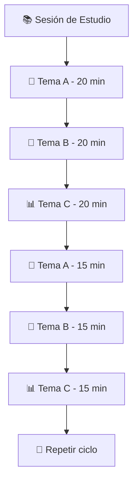
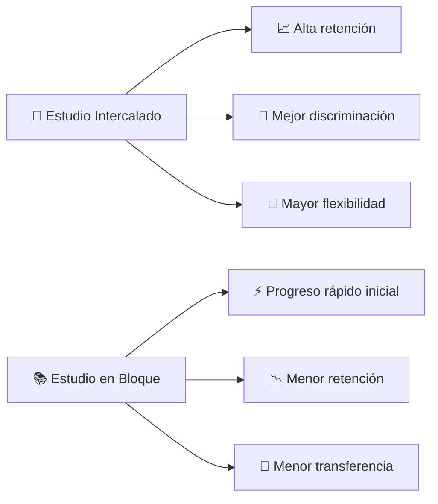

# 🔀 Estudio Intercalado

> [!tip] 💡 **Concepto Clave** El estudio intercalado (interleaving) es una técnica que consiste en alternar entre diferentes temas, materias o tipos de problemas durante una sesión de estudio, en lugar de estudiar un solo tema de forma continua (práctica en bloque).

## 🧠 Fundamentos Científicos

> [!info] 🔬 **Base Neurológica**
> 
> - **Discriminación**: Mejora la capacidad de distinguir entre conceptos similares
> - **Transferencia**: Facilita la aplicación de conocimientos a nuevos contextos
> - **Consolidación**: Fortalece las conexiones neuronales a largo plazo
> - **Flexibilidad cognitiva**: Desarrolla la adaptabilidad mental

## 🎯 Beneficios del Estudio Intercalado

> [!success] ✅ **Ventajas Principales**
> 
> - 📈 **Mejor retención a largo plazo** (hasta 76% más efectivo)
> - 🎪 **Mayor flexibilidad cognitiva**
> - 🔍 **Mejor discriminación entre conceptos**
> - 🚀 **Transferencia mejorada de aprendizaje**
> - 💪 **Fortalecimiento de la memoria**

## 📋 Cómo Implementar el Método

### 🏗️ Estructura Básica

### 📋 Pasos de Implementación

> [!note] 📝 **Proceso Paso a Paso**
> 
> **1. 🎯 Selección de Temas**
> 
> - Elige 2-4 temas relacionados pero distintos
> - Asegúrate de que tengan diferentes enfoques
> 
> **2. ⏰ Planificación Temporal**
> 
> - Bloques de 15-25 minutos por tema
> - Descansos de 5 minutos entre cambios
> 
> **3. 🔄 Rotación Sistemática**
> 
> - Alterna entre temas de forma planificada
> - Evita patrones demasiado predecibles
> 
> **4. 📊 Seguimiento del Progreso**
> 
> - Registra el rendimiento en cada tema
> - Ajusta tiempos según dificultad

## 🎨 Estrategias de Aplicación

### 📚 Por Tipo de Materia

> [!example] 🧮 **Matemáticas**
> 
> - Intercalar: Álgebra → Geometría → Cálculo → Álgebra
> - Alternar tipos de problemas dentro de cada tema
> - Mezclar ejercicios fáciles y difíciles

> [!example] 🌍 **Historia**
> 
> - Intercalar: Edad Media → Renacimiento → Revolución → Edad Media
> - Alternar análisis de causas, consecuencias y cronología
> - Combinar diferentes fuentes y perspectivas

> [!example] 🔬 **Ciencias**
> 
> - Intercalar: Química → Física → Biología → Química
> - Alternar teoría, problemas y experimentos
> - Mezclar diferentes niveles de complejidad

### 🎯 Técnicas Específicas

> [!tip] 🛠️ **Herramientas Prácticas**
> 
> **🎲 Técnica del Dado**
> 
> - Asigna números a cada tema
> - Usa un dado para decidir el siguiente tema
> 
> **🃏 Sistema de Cartas**
> 
> - Crea cartas para cada tema/subtema
> - Baraja y estudia según el orden
> 
> **⏰ Rotación Temporal**
> 
> - Cambia de tema cada X minutos
> - Usa temporizador para mantener disciplina

## ⚠️ Consideraciones Importantes

> [!warning] ⚠️ **Precauciones**
> 
> - **Curva de dificultad inicial**: Puede parecer más difícil al principio
> - **Sensación de progreso lento**: El avance parece menos evidente
> - **Requiere planificación**: Necesita más organización previa
> - **No para todos los temas**: Algunos requieren estudio en bloque primero

> [!danger] 🚫 **Cuándo NO usar**
> 
> - Conceptos completamente nuevos que requieren comprensión básica
> - Habilidades que necesitan práctica intensiva inicial
> - Cuando el tiempo es muy limitado
> - Materias que requieren secuencia estricta

## 📊 Comparación con Otros Métodos

## 🎯 Plan de Implementación Semanal

> [!note] 📅 **Estructura Semanal**
> 
> **Lunes - Miércoles - Viernes**: Intercalado intenso
> 
> - 3-4 temas por sesión
> - Bloques de 20 minutos
> 
> **Martes - Jueves**: Intercalado ligero
> 
> - 2-3 temas por sesión
> - Bloques de 25 minutos
> 
> **Sábado**: Revisión intercalada
> 
> - Todos los temas de la semana
> - Bloques de 15 minutos
> 
> **Domingo**: Descanso o repaso opcional

## 🔬 Evidencia Científica

> [!quote] 📖 **Investigación Clave**
> 
> **Rohrer & Taylor (2007)** "Los estudiantes que usaron estudio intercalado mejoraron su rendimiento en un 43% comparado con el estudio en bloque"
> 
> **Birnbaum et al. (2013)** "El intercalado mejora la discriminación entre categorías similares y la transferencia a nuevos problemas"

## 🎨 Personalización del Método

### 🎯 Según Estilo de Aprendizaje

> [!tip] 🎨 **Adaptaciones**
> 
> **👁️ Aprendices Visuales**
> 
> - Usa colores diferentes para cada tema
> - Intercala mapas mentales y diagramas
> 
> **👂 Aprendices Auditivos**
> 
> - Alterna explicaciones verbales y grabaciones
> - Intercala música de fondo temática
> 
> **✋ Aprendices Kinestésicos**
> 
> - Cambia de ubicación física para cada tema
> - Intercala actividades prácticas y teóricas

## 📈 Medición del Éxito

> [!success] 📊 **Indicadores de Progreso**
> 
> - **Test de discriminación**: Capacidad de distinguir conceptos similares
> - **Pruebas de transferencia**: Aplicación a nuevos contextos
> - **Retención a largo plazo**: Evaluaciones después de 1-2 semanas
> - **Flexibilidad cognitiva**: Velocidad de cambio entre tareas

## 🛠️ Herramientas Recomendadas

> [!info] 🔧 **Recursos Útiles**
> 
> - **Forest App**: Para temporizadores y seguimiento
> - **Anki**: Para flashcards intercaladas
> - **Notion**: Para planificación de rotaciones
> - **Google Calendar**: Para programar bloques

---

## 📚 Referencias

> [!quote] 🔗 **Enlaces a Otras Notas**
> 
> - [[Método 1 - Pomodoro]] - Para estructura temporal
> - [[Método 3 - Repetición Espaciada]] - Para optimizar la retención
> - [[Método 4 - Aprendizaje Activo]] - Para combinar técnicas
> - [[Método 5 - Mapas Mentales]] - Para organizar temas intercalados
> - [[Técnicas de Concentración]] - Para mantener el foco durante cambios

---

#estudio-intercalado #interleaving #métodos-estudio #neurociencia #retención #discriminación #flexibilidad-cognitiva #transferencia-aprendizaje