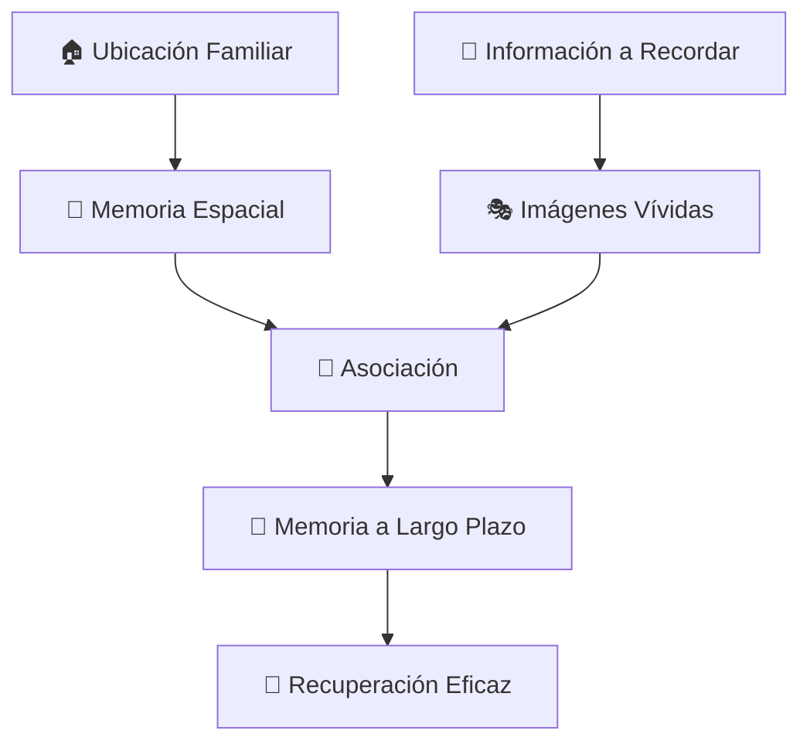
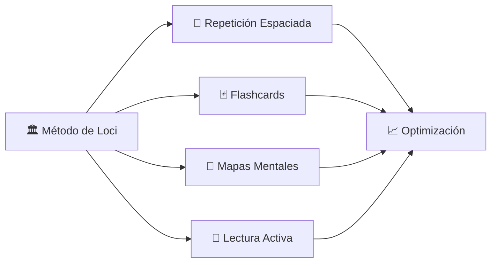

# 🏛️ Método de Loci (Palacio de la Memoria)

> [!tip] 💡 **Concepto Clave** El Método de Loci, también conocido como "Palacio de la Memoria", es una técnica milenaria que utiliza ubicaciones espaciales familiares para organizar y recordar información. Asocia elementos a memorizar con lugares específicos en un recorrido mental predefinido.

## 🏺 Historia y Fundamentos

> [!info] 📜 **Origen Histórico**
> 
> - **Antigua Grecia (500 a.C.)**: Creado por el poeta Simónides de Ceos
> - **Retórica Clásica**: Usado por oradores romanos como Cicerón
> - **Edad Media**: Empleado por monjes para memorizar textos sagrados
> - **Actualidad**: Utilizado por campeones de memoria mundial

## 🧠 Base Neurológica

> [!success] 🔬 **Fundamento Científico**
> 
> - **Memoria Espacial**: Aprovecha la capacidad natural del cerebro para recordar ubicaciones
> - **Codificación Dual**: Combina información visual y verbal
> - **Hipocampo**: Activa el centro de navegación espacial del cerebro
> - **Redes Neuronales**: Fortalece conexiones entre diferentes áreas cerebrales

## 🏗️ Construcción del Palacio de la Memoria

### 📍 Paso 1: Selección del Lugar

> [!note] 🏠 **Criterios de Selección**
> 
> **Lugares Ideales:**
> 
> - 🏡 Tu casa (la más efectiva)
> - 🏫 Escuela o universidad
> - 🏢 Lugar de trabajo
> - 🛣️ Ruta habitual (casa-trabajo)
> - 🏪 Centro comercial familiar
> 
> **Características Necesarias:**
> 
> - ✅ Muy familiar para ti
> - ✅ Secuencia lógica de recorrido
> - ✅ Puntos de referencia claros
> - ✅ Estable en tu memoria

### 🚶 Paso 2: Definición del Recorrido

> [!example] 🗺️ **Ejemplo: Recorrido por Casa**
> 
> **Ruta Principal:**
> 
> 1. 🚪 Puerta de entrada
> 2. 🛋️ Sala de estar
> 3. 🍽️ Comedor
> 4. 🍳 Cocina
> 5. 🛏️ Dormitorio principal
> 6. 🚿 Baño
> 7. 📚 Estudio
> 8. 🌿 Jardín/Balcón

### 🎯 Paso 3: Identificación de Loci

> [!tip] 📍 **Selección de Puntos**
> 
> - **5-10 ubicaciones** por recorrido básico
> - **Distancia adecuada** entre puntos
> - **Características distintivas** de cada locus
> - **Orden lógico** y natural de recorrido

## 🎨 Técnicas de Asociación

### 🖼️ Creación de Imágenes Mentales

> [!success] 🎭 **Principios de Visualización**
> 
> **Características Efectivas:**
> 
> - 🌈 **Exageradas**: Más grandes o pequeñas de lo normal
> - 🎪 **Absurdas**: Situaciones imposibles o cómicas
> - 🎨 **Coloridas**: Colores brillantes y contrastantes
> - 🎬 **En movimiento**: Acciones dinámicas
> - 😱 **Emocionales**: Que provoquen reacciones fuertes
> - 👥 **Personales**: Relacionadas con tu experiencia

### 🔗 Métodos de Vinculación

> [!example] 🎯 **Estrategias de Asociación**
> 
> **🎭 Interacción Dramática:**
> 
> - Haz que la información "haga algo" en el lugar
> - Ejemplo: Para recordar "Napoleón 1804", imagina a Napoleón cocinando en tu cocina
> 
> **📏 Sustitución por Tamaño:**
> 
> - Cambia el tamaño de los objetos
> - Ejemplo: Un libro gigante bloqueando tu puerta de entrada
> 
> **🎨 Transformación Visual:**
> 
> - Cambia colores, texturas o formas
> - Ejemplo: Tu sofá convertido en un elemento químico brillante

## 📚 Aplicaciones Específicas

### 🎓 Para Estudios Académicos

> [!note] 📖 **Historia**
> 
> **Memorizar Fechas Históricas:**
> 
> - Puerta de entrada: 1492 (Descubrimiento de América)
> - Sala: 1789 (Revolución Francesa)
> - Cocina: 1945 (Fin Segunda Guerra Mundial)
> 
> **Visualización:** Cristóbal Colón abriendo tu puerta, la guillotina en tu sala, celebración de paz en tu cocina

> [!note] 🧪 **Ciencias**
> 
> **Tabla Periódica:**
> 
> - Cada habitación = un grupo de elementos
> - Dormitorio: Metales alcalinos (Li, Na, K...)
> - Baño: Gases nobles (He, Ne, Ar...)
> 
> **Fórmulas Químicas:**
> 
> - H₂O: Hidrógeno y Oxígeno bailando en tu ducha

> [!note] 🗣️ **Idiomas**
> 
> **Vocabulario:**
> 
> - Entrada: "Hola" = Hello
> - Cocina: "Comida" = Food
> - Dormitorio: "Dormir" = Sleep
> 
> **Gramática:**
> 
> - Cada habitación = una regla gramatical específica

### 🎤 Para Presentaciones

> [!example] 🎯 **Estructura de Discurso**
> 
> **Recorrido Mental:**
> 
> 1. 🚪 Entrada: Introducción y saludo
> 2. 🛋️ Sala: Primer punto principal
> 3. 🍽️ Comedor: Segundo punto principal
> 4. 🍳 Cocina: Tercer punto principal
> 5. 🛏️ Dormitorio: Conclusiones
> 6. 🌿 Jardín: Llamada a la acción

## 🔧 Técnicas Avanzadas

### 🏘️ Múltiples Palacios

> [!tip] 🏗️ **Sistema Expandido**
> 
> **Especialización por Materia:**
> 
> - 🏠 Casa: Historia mundial
> - 🏫 Escuela: Matemáticas
> - 🏢 Oficina: Idiomas
> - 🏪 Centro comercial: Ciencias
> 
> **Ventajas:**
> 
> - Evita confusiones entre temas
> - Permite mayor capacidad de almacenamiento
> - Facilita la organización mental

### 🔄 Técnica de Recorrido Inverso

> [!success] 🔄 **Bidireccionalidad**
> 
> - Practica el recorrido en ambas direcciones
> - Refuerza las asociaciones memoria
> - Permite acceso desde cualquier punto
> - Mejora la flexibilidad de recuperación

### 🎭 Método de Personajes

> [!example] 👥 **Sistema de Actores**
> 
> - Asigna personajes fijos a cada ubicación
> - Einstein siempre en el estudio (ciencias)
> - Shakespeare en la biblioteca (literatura)
> - Napoleón en el comedor (historia)

## 📊 Plan de Entrenamiento

### 🏃 Fase 1: Construcción (Semana 1-2)

> [!note] 🏗️ **Establecimiento Básico**
> 
> **Día 1-3:** Mapeo del lugar
> 
> - Camina físicamente por el lugar
> - Memoriza el recorrido exacto
> - Identifica 8-10 loci específicos
> 
> **Día 4-7:** Recorrido mental
> 
> - Practica sin información adicional
> - Cronometra el recorrido (objetivo: <2 minutos)
> - Perfecciona la secuencia

**Día 8-14:** Primeras asociaciones

> - Comienza con listas simples (5-7 elementos)
> - Practica visualizaciones básicas
> - Refuerza las asociaciones

### 🚀 Fase 2: Desarrollo (Semana 3-4)

> [!success] 📈 **Expansión de Capacidad**
> 
> **Semana 3:** Complejidad media
> 
> - Listas de 10-15 elementos
> - Información más abstracta
> - Múltiples recorridos por día
> 
> **Semana 4:** Alta complejidad
> 
> - Textos completos
> - Información técnica
> - Combinación con otros métodos

### 🎯 Fase 3: Maestría (Mes 2+)

> [!tip] 🏆 **Optimización Avanzada**
> 
> - Múltiples palacios simultáneos
> - Información compleja y detallada
> - Recuperación instantánea
> - Mantenimiento a largo plazo

## ⚠️ Errores Comunes y Soluciones

> [!warning] ❌ **Problemas Frecuentes**
> 
> **🗺️ Recorrido Inconsistente**
> 
> - Problema: Cambiar la ruta constantemente
> - Solución: Establecer y mantener un recorrido fijo
> 
> **🎨 Imágenes Débiles**
> 
> - Problema: Visualizaciones vagas o aburridas
> - Solución: Hacer imágenes más exageradas y emocionales
> 
> **🔄 Falta de Práctica**
> 
> - Problema: No repasar regularmente
> - Solución: Recorridos diarios de mantenimiento
> 
> **📚 Sobrecarga de Información**
> 
> - Problema: Intentar memorizar demasiado muy rápido
> - Solución: Construir gradualmente la capacidad

> [!danger] 🚫 **Errores Críticos**
> 
> - **Mezclar diferentes palacios**: Mantén separación clara
> - **Saltar ubicaciones**: Respeta siempre el orden
> - **Imágenes estáticas**: Añade movimiento y emoción
> - **No personalizar**: Adapta a tu experiencia personal

## 📈 Beneficios y Limitaciones

### ✅ Ventajas del Método

> [!success] 🌟 **Beneficios Principales**
> 
> - 🧠 **Memoria excepcional**: Capacidad para miles de elementos
> - ⏰ **Retención duradera**: Información disponible años después
> - 🎯 **Recuperación ordenada**: Acceso secuencial o aleatorio
> - 🧘 **Desarrollo cognitivo**: Mejora visualización y concentración
> - 🎨 **Creatividad**: Estimula el pensamiento imaginativo

### ⚖️ Limitaciones y Consideraciones

> [!warning] ⚠️ **Limitaciones**
> 
> - ⏳ **Tiempo inicial**: Requiere inversión significativa al principio
> - 🎭 **Dependencia visual**: Menos efectivo para personas con afantasía
> - 🔄 **Mantenimiento**: Necesita práctica regular
> - 📝 **Información abstracta**: Más difícil para conceptos muy abstractos

## 🏆 Casos de Éxito

> [!quote] 🎯 **Campeones de Memoria Mundial**
> 
> **Dominic O'Brien (8 veces campeón mundial):** "El Método de Loci es la base de todas mis técnicas de memoria. Me permite memorizar 54 mazos de cartas en secuencia perfecta."
> 
> **Joshua Foyer (Campeón de Memoria de EE.UU.):** "Transformé mi memoria promedio en excepcional usando principalmente el Palacio de la Memoria."

## 🔬 Investigación Científica

> [!info] 📊 **Evidencia Científica**
> 
> **Neuroimagen (Maguire et al., 2003):**
> 
> - Los atletas de memoria muestran mayor activación en áreas espaciales
> - Misma estructura cerebral que taxistas de Londres
> 
> **Efectividad (Yates, 1966):**
> 
> - 90% de mejora en retención comparado con repetición simple
> - Mantiene efectividad después de meses sin práctica

## 🛠️ Herramientas de Apoyo

> [!tip] 🔧 **Recursos Digitales**
> 
> **Aplicaciones:**
> 
> - **Memory Palace App**: Construcción digital de palacios
> - **Lumosity**: Entrenamiento de memoria espacial
> - **Peak**: Juegos de visualización
> 
> **Técnicas Físicas:**
> 
> - **Fotografías**: Del lugar para referencia visual
> - **Planos**: Dibujos del recorrido
> - **Videos**: Grabación del recorrido real

## 🎯 Integración con Otros Métodos

> [!success] 🔗 **Combinaciones Efectivas**
> 
> - **+ Repetición Espaciada**: Para mantenimiento a largo plazo
> - **+ Mapas Mentales**: Para estructurar información compleja
> - **+ Método Feynman**: Para explicar conceptos memorizados
> - **+ Técnica Pomodoro**: Para sesiones de construcción del palacio

---

## 📚 Referencias

> [!quote] 🔗 **Enlaces a Otras Notas**
> 
> - [[Método 3 - Repetición Espaciada]] - Para mantenimiento de memorias
> - [[Método 5 - Mapas Mentales]] - Para organizar información espacialmente
> - [[Técnicas de Concentración]] - Para sesiones de visualización profunda
> - [[Motivación Académica]] - Para mantener disciplina en la práctica
> - [[Hábitos de Estudio]] - Para integrar el método en rutinas diarias

---

#método-loci #palacio-memoria #mnemotecnia #memoria-espacial #visualización #neurociencia #campeones-memoria #técnicas-memoria #memorización #retención