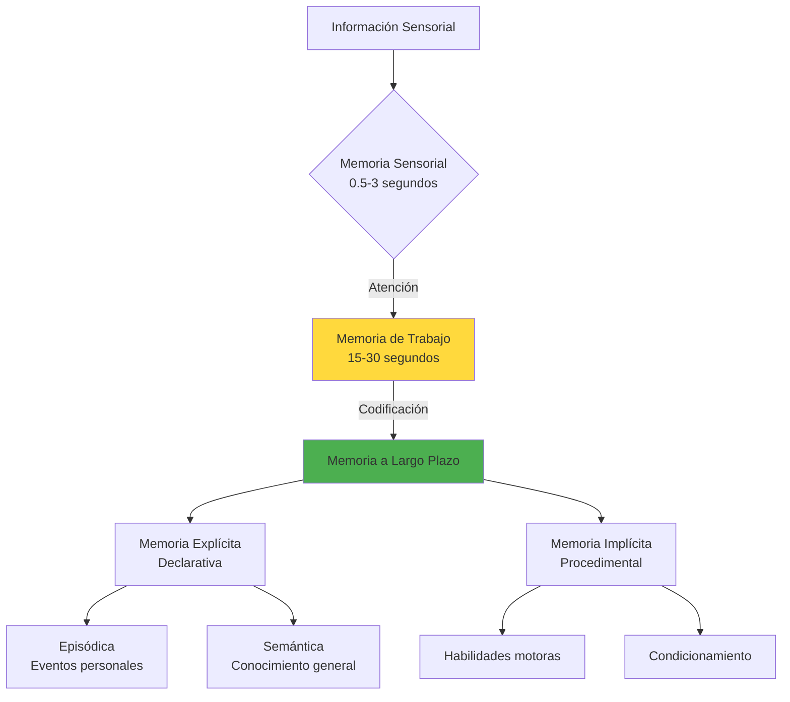
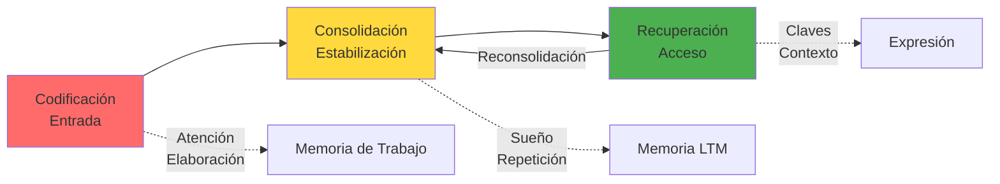
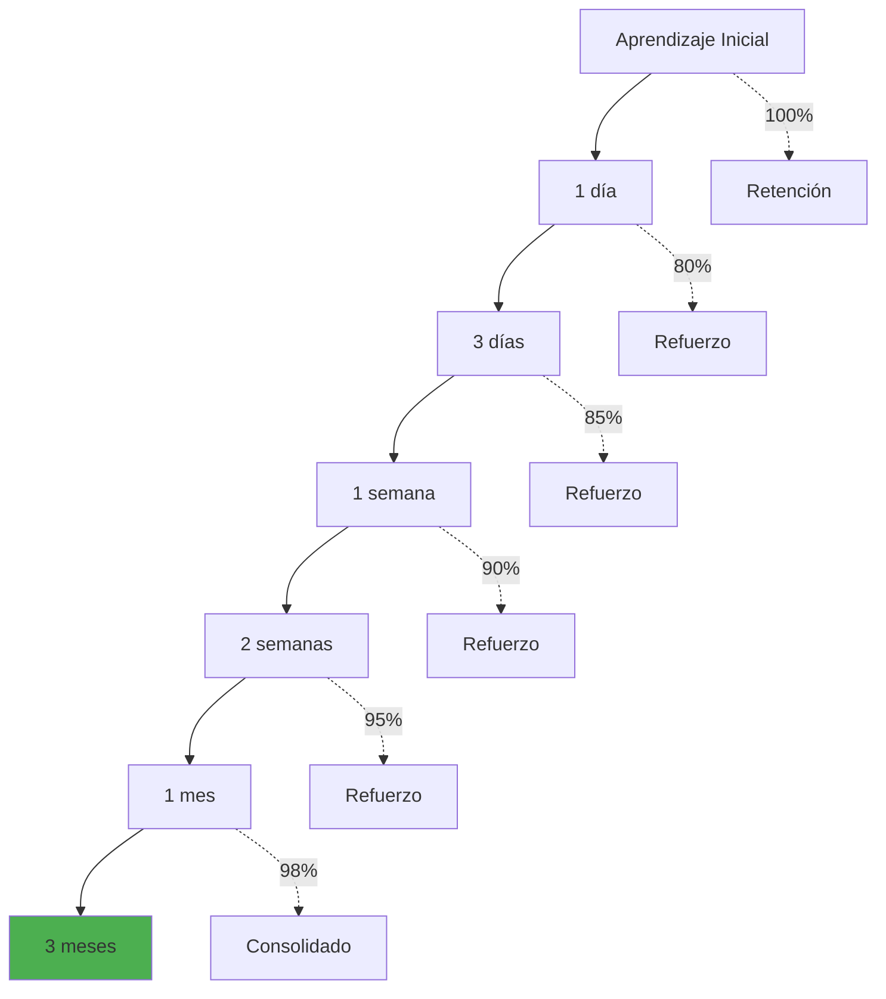

# 🧠 Neurociencia del Aprendizaje

> [!info] 🔬 Definición La neurociencia del aprendizaje estudia los mecanismos cerebrales subyacentes a la adquisición, consolidación y recuperación de conocimientos y habilidades. Examina cómo las redes neuronales se modifican para almacenar información y crear nuevas conexiones sinápticas que permiten el aprendizaje duradero.

## 🧬 Fundamentos Neurobiológicos

### 🔗 Neuroplasticidad

> [!tip] ⚡ Principios de la Plasticidad Cerebral **Definición**: Capacidad del cerebro para reorganizar sus conexiones neuronales en respuesta a la experiencia.
> 
> **Tipos de Neuroplasticidad:**
> 
> - **Estructural**: Cambios físicos en dendritas y axones
> - **Funcional**: Modificación en la fuerza de las conexiones sinápticas
> - **Sináptica**: Creación y eliminación de sinapsis
> - **Neurogénesis**: Formación de nuevas neuronas (principalmente en hipocampo)

> [!warning] 🕐 Ventanas Críticas de Aprendizaje **Períodos Sensibles:**
> 
> - **Lenguaje**: 0-7 años (máxima plasticidad)
> - **Música**: 3-15 años
> - **Matemáticas**: 1-4 años (conceptos numéricos básicos)
> - **Habilidades motoras**: 0-12 años
> 
> **Nota**: Aunque estos períodos son óptimos, el aprendizaje continúa toda la vida gracias a la neuroplasticidad adulta.

### 🎭 Sistemas de Memoria

> [!info] 🧠 Estructuras Cerebrales Clave **Hipocampo:**
> 
> - Consolidación de memoria declarativa
> - Formación de nuevos recuerdos episódicos
> - Navegación espacial y memoria de trabajo espacial
> 
> **Corteza Prefrontal:**
> 
> - Memoria de trabajo y funciones ejecutivas
> - Control atencional y toma de decisiones
> - Planificación y organización del aprendizaje
> 
> **Amígdala:**
> 
> - Procesamiento emocional
> - Modulación de la consolidación de memoria
> - Aprendizaje asociativo emocional
> 
> **Cerebelo:**
> 
> - Aprendizaje motor y procedimientos
> - Coordinación de secuencias temporales
> - Automatización de habilidades

## ⚡ Mecanismos Moleculares del Aprendizaje

### 🔬 Potenciación a Largo Plazo (LTP)

> [!tip] 🧬 Base Molecular de la Memoria **Proceso de LTP:**
> 
> 1. **Estimulación repetida** de sinapsis específicas
> 2. **Activación de receptores NMDA** por glutamato
> 3. **Entrada de calcio** en la neurona postsináptica
> 4. **Activación de cascadas de señalización** (CaMKII, PKA, CREB)
> 5. **Síntesis de nuevas proteínas** para fortalecer sinapsis
> 6. **Cambios estructurales duraderos** en espinas dendríticas

> [!info] 🧪 Neurotransmisores Clave **Acetilcolina:**
> 
> - Atención y codificación de nueva información
> - Modulación de la plasticidad en corteza e hipocampo
> 
> **Dopamina:**
> 
> - Motivación y recompensa en el aprendizaje
> - Consolidación de memorias importantes
> - Señalización de predicción de errores
> 
> **Noradrenalina:**
> 
> - Modulación del estado de alerta
> - Consolidación emocional de memorias
> - Regulación de la atención sostenida
> 
> **GABA:**
> 
> - Control inhibitorio y filtrado de información
> - Regulación de la excitabilidad neuronal
> - Timing preciso en circuitos de aprendizaje

## 🔄 Fases del Proceso de Aprendizaje

### 1️⃣ Codificación (Encoding)

> [!tip] 📥 Entrada de Información **Factores que mejoran la codificación:**
> 
> - **Atención selectiva**: Focus en información relevante
> - **Elaboración**: Conexión con conocimiento previo
> - **Organización**: Estructura jerárquica de la información
> - **Contexto múltiple**: Variedad de situaciones de aprendizaje
> 
> **Niveles de procesamiento:**
> 
> - **Superficial**: Características físicas (color, forma)
> - **Fonológico**: Sonido y pronunciación
> - **Semántico**: Significado y conceptos (más duradero)

### 2️⃣ Consolidación

> [!warning] ⏰ Proceso Temporal Crítico **Consolidación Sistémica (meses-años):**
> 
> - Transferencia gradual de hipocampo a corteza
> - Reorganización de redes neuronales
> - Independización del hipocampo para recuperación
> 
> **Consolidación Sináptica (horas-días):**
> 
> - Síntesis de proteínas en sinapsis específicas
> - Cambios estructurales en espinas dendríticas
> - Estabilización de conexiones neuronales
> 
> **Factores que facilitan consolidación:**
> 
> - **Sueño**: Especialmente ondas lentas y REM
> - **Repetición espaciada**: Reactivación periódica
> - **Contexto emocional**: Modulación por amígdala

### 3️⃣ Recuperación (Retrieval)

> [!info] 🔄 Reactivación de Memorias **Principios de recuperación efectiva:**
> 
> - **Práctica de recuperación**: Testing effect
> - **Claves contextuales**: Ambiente y estado interno
> - **Recuperación espaciada**: Intervalos crecientes
> - **Transferencia**: Aplicación en nuevos contextos

## 🧠 Tipos de Aprendizaje y Sus Bases Neurales

### 📚 Aprendizaje Declarativo

> [!info] 🎯 Conocimiento Explícito **Características neurales:**
> 
> - **Dependiente del hipocampo** para formación inicial
> - **Consciente y verbalizable**
> - **Rápida adquisición** pero requiere consolidación
> - **Vulnerable a interferencia** durante consolidación
> 
> **Subtipos:**
> 
> - **Semántico**: Hechos, conceptos, vocabulario
> - **Episódico**: Eventos autobiográficos, contexto espacio-temporal

### 🎯 Aprendizaje Procedimental

> [!tip] ⚙️ Habilidades y Hábitos **Características neurales:**
> 
> - **Dependiente de ganglios basales y cerebelo**
> - **Inconsciente y automatizado**
> - **Adquisición gradual** con práctica repetida
> - **Resistente al olvido** una vez consolidado
> 
> **Circuitos clave:**
> 
> - **Estriado dorsal**: Hábitos y secuencias motoras
> - **Cerebelo**: Coordinación y timing preciso
> - **Corteza motora**: Ejecución de movimientos

### 🎨 Aprendizaje Perceptual

> [!info] 👁️ Refinamiento Sensorial **Mecanismos neurales:**
> 
> - **Cambios en cortezas sensoriales primarias**
> - **Aumento de selectividad neuronal**
> - **Mejora en discriminación y detección**
> - **Plasticidad dirigida por atención**

## 🔬 Factores Neurobiológicos que Influyen en el Aprendizaje

### 😴 Sueño y Consolidación

> [!warning] 🌙 Rol Crítico del Sueño **Funciones del sueño en aprendizaje:**
> 
> - **Ondas lentas (NREM)**: Consolidación declarativa
> - **REM**: Consolidación procedimental y creativa
> - **Replay neuronal**: Reactivación de patrones aprendidos
> - **Eliminación sináptica**: Poda de conexiones innecesarias
> 
> **Privación de sueño:**
> 
> - Reducción del 40% en capacidad de formar nuevas memorias
> - Deterioro en atención y memoria de trabajo
> - Alteración en consolidación sináptica

### 🏃‍♂️ Ejercicio y Neurogénesis

> [!tip] 💪 Beneficios del Ejercicio Físico **Efectos neurobiológicos:**
> 
> - **Aumento de BDNF** (factor neurotrófico)
> - **Neurogénesis en hipocampo** (nuevas neuronas)
> - **Mejora de vascularización cerebral**
> - **Reducción de inflamación** neuronal
> 
> **Tipos de ejercicio más beneficiosos:**
> 
> - **Aeróbico moderado**: 150 min/semana
> - **Entrenamiento de intervalos**: Alta intensidad
> - **Ejercicios coordinativos**: Danza, artes marciales

### 🍎 Nutrición y Función Cerebral

> [!info] 🧬 Nutrientes Clave para el Aprendizaje **Ácidos grasos Omega-3:**
> 
> - Componente estructural de membranas neuronales
> - Mejora plasticidad sináptica y LTP
> - Reducción de inflamación cerebral
> 
> **Glucosa:**
> 
> - Combustible principal del cerebro (20% del metabolismo)
> - Niveles estables mejoran memoria de trabajo
> - Hipoglucemia deteriora función cognitiva
> 
> **Antioxidantes:**
> 
> - Protección contra daño oxidativo
> - Flavonoides mejoran flujo sanguíneo cerebral
> - Vitamina E y C protegen membranas neuronales

## 🎯 Optimización del Aprendizaje Basada en Neurociencia

### 📅 Repetición Espaciada

> [!tip] ⏰ Timing Óptimo para Consolidación **Intervalos de Hermann Ebbinghaus actualizados:**
> 
> - **1ª revisión**: 1 día después
> - **2ª revisión**: 3 días después
> - **3ª revisión**: 1 semana después
> - **4ª revisión**: 2 semanas después
> - **5ª revisión**: 1 mes después
> - **6ª revisión**: 3 meses después

### 🧩 Interleaving (Entrelazado)

> [!info] 🔄 Variación en la Práctica **Beneficios neurales del interleaving:**
> 
> - **Fortalecimiento de discriminación** entre conceptos
> - **Mejora en transferencia** a nuevas situaciones
> - **Activación de múltiples redes** neuronales
> - **Reducción de automatización prematura**
> 
> **Aplicación práctica:**
> 
> - Alternar entre diferentes tipos de problemas
> - Mezclar temas relacionados en sesiones de estudio
> - Variar contextos y modalidades de aprendizaje

### 🎭 Aprendizaje Multimodal

> [!tip] 🌈 Integración Sensorial **Ventajas neurales:**
> 
> - **Activación de múltiples cortezas** sensoriales
> - **Enlaces cruzados** entre modalidades
> - **Redundancia** que mejora retención
> - **Redes más robustas** de memoria
> 
> **Combinaciones efectivas:**
> 
> - Visual + Auditivo (texto + narración)
> - Kinestésico + Visual (manipulación + observación)
> - Auditivo + Motor (hablar + escribir)

## 🧬 Diferencias Individuales en el Aprendizaje

### 🧠 Variabilidad Neuroanatómica

> [!info] 📊 Diferencias Individuales **Factores que afectan capacidad de aprendizaje:**
> 
> - **Volumen del hipocampo**: Correlación con memoria declarativa
> - **Grosor cortical**: Asociado con inteligencia fluida
> - **Conectividad entre regiones**: Eficiencia en redes neuronales
> - **Mielinización**: Velocidad de procesamiento
> 
> **Especialización hemisférica:**
> 
> - **Hemisferio izquierdo**: Lenguaje, análisis secuencial
> - **Hemisferio derecho**: Procesamiento espacial, síntesis

### 🧬 Genética del Aprendizaje

> [!warning] 🔬 Factores Hereditarios **Genes relevantes:**
> 
> - **COMT**: Metabolismo de dopamina, memoria de trabajo
> - **BDNF**: Factor neurotrófico, plasticidad sináptica
> - **CACNA1C**: Canales de calcio, LTP
> - **KIBRA**: Formación de memoria episódica
> 
> **Nota**: La genética predispone pero no determina. El ambiente y la práctica pueden superar limitaciones genéticas.

## 🎯 Aplicaciones Prácticas para Estudiantes

### 📚 Técnicas Basadas en Evidencia Neurocientífica

> [!tip] 🎯 Estrategias Validadas **Testing Effect:**
> 
> - **Base neural**: Fortalecimiento de rutas de recuperación
> - **Aplicación**: Autoexámenes frecuentes sin consultar material
> - **Beneficio**: 50% mejor retención vs re-lectura
> 
> **Elaborative Interrogation:**
> 
> - **Base neural**: Activación de redes semánticas extensas
> - **Aplicación**: Preguntarse "¿Por qué es cierto esto?"
> - **Beneficio**: Conexiones más profundas y duraderas
> 
> **Dual Coding:**
> 
> - **Base neural**: Activación simultánea de sistemas verbal y visual
> - **Aplicación**: Combinar texto con diagramas, mapas mentales
> - **Beneficio**: Múltiples rutas de acceso a la información

### 🕐 Cronobiología del Aprendizaje

> [!info] ⏰ Ritmos Circadianos y Rendimiento **Picos de rendimiento cognitivo:**
> 
> - **09:00-11:00**: Memoria de trabajo y atención sostenida
> - **15:00-17:00**: Procesamiento visual-espacial
> - **18:00-20:00**: Coordinación motora fina
> 
> **Horarios óptimos por tipo de aprendizaje:**
> 
> - **Matemáticas/Lógica**: Mañana (alta atención)
> - **Creatividad**: Tarde (relajación atencional)
> - **Memorización**: Antes de dormir (consolidación)
> - **Repaso**: Mañana temprano (recuperación)

### 🎵 Estados Mentales Óptimos

> [!tip] 🧘 Modulación del Estado Cerebral **Estados de ondas cerebrales:**
> 
> - **Beta (13-30 Hz)**: Atención focalizada, análisis
> - **Alpha (8-13 Hz)**: Relajación alerta, creatividad
> - **Theta (4-8 Hz)**: Memoria profunda, insight
> - **Gamma (30-100 Hz)**: Integración consciente
> 
> **Técnicas de modulación:**
> 
> - **Meditación mindfulness**: Aumento de alpha y theta
> - **Música clásica**: Facilitación de estados alpha
> - **Ejercicio aeróbico**: Optimización de neurotransmisores
> - **Respiración profunda**: Activación parasimpática

## 📊 Medición y Evaluación del Aprendizaje

### 🔬 Biomarcadores de Aprendizaje

> [!info] 📈 Indicadores Neurobiológicos **Técnicas de neuroimagen:**
> 
> - **fMRI**: Actividad cerebral durante tareas
> - **EEG**: Ondas cerebrales y sincronización
> - **DTI**: Integridad de materia blanca
> - **PET**: Metabolismo cerebral y neurotransmisores
> 
> **Marcadores conductuales:**
> 
> - **Tiempo de reacción**: Velocidad de procesamiento
> - **Tasa de error**: Precisión y automatización
> - **Curva de aprendizaje**: Progreso temporal
> - **Transferencia**: Generalización a nuevos contextos

### 📋 Evaluación Neurocognitiva

> [!tip] 🧠 Test de Función Cerebral **Batería básica:**
> 
> - **Memoria de trabajo**: Span de dígitos, n-back
> - **Atención sostenida**: Test de vigilancia continua
> - **Velocidad de procesamiento**: Búsqueda visual, sustitución
> - **Flexibilidad cognitiva**: Wisconsin Card Sorting Test
> - **Memoria declarativa**: Lista de palabras, historias

## 🔮 Futuro de la Neurociencia Educativa

### 🧠 Tecnologías Emergentes

> [!info] 🚀 Innovaciones en Desarrollo **Neurofeedback en Tiempo Real:**
> 
> - Monitorización de estados cerebrales durante estudio
> - Retroalimentación para optimizar atención
> - Personalización basada en patrones neurales individuales
> 
> **Estimulación Cerebral No Invasiva:**
> 
> - **tDCS**: Estimulación transcraneal de corriente directa
> - **TMS**: Estimulación magnética transcraneal
> - Mejora temporal de plasticidad sináptica
> 
> **Inteligencia Artificial Neuromórfica:**
> 
> - Sistemas de aprendizaje que imitan redes neuronales
> - Personalización adaptativa de contenido educativo
> - Predicción de dificultades de aprendizaje

### 🎯 Educación Personalizada

> [!tip] 🎨 Adaptación Individual **Perfiles neurobiológicos:**
> 
> - Identificación de fortalezas y debilidades cognitivas
> - Estrategias de enseñanza personalizadas
> - Timing óptimo para diferentes tipos de contenido
> - Compensación de limitaciones individuales

---

## 📚 Referencias

> [!quote] Enlaces a Otras Notas
> 
> - [[Técnicas de Concentración]] - Aplicación práctica de neurociencia atencional
> - [[Gestión del Tiempo]] - Optimización basada en ritmos cerebrales
> - [[Deep Work]] - Estados cerebrales para trabajo profundo
> - [[Mindfulness]] - Modulación consciente de estados cerebrales
> - [[Hábitos de Estudio]] - Implementación práctica de principios neurocientíficos

## 📖 Notas Recomendadas para Complementar

- [[Creatividad y Pensamiento Divergente]] - Redes neurales de la creatividad
- [[Motivación Académica]] - Sistemas de dopamina en el aprendizaje
- [[Gestión del Estrés]] - Efectos del cortisol en memoria y atención
- [[Nutrición para el cerebro]] - Optimización nutricional para el aprendizaje
- [[Higiene de Sueño]] - Profundización en procesos nocturnos

---

**Tags:** #neurociencia #aprendizaje #memoria #plasticidad #cerebro #cognición #educación #neurobiología #consolidación #retrieval #hipocampo #sinapsis #neurotransmisores #ciencia-cognitiva