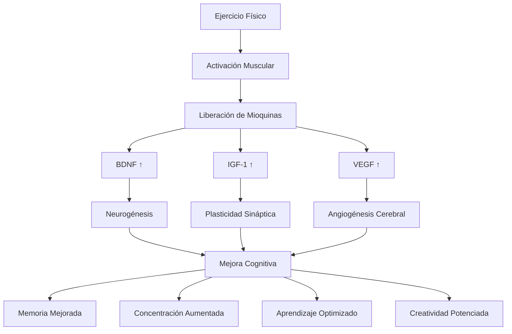

# 🏃‍♂️ Ejercicio y Cognición

> [!info] 🧠 Definición El ejercicio y la cognición están intrínsecamente conectados a través de múltiples mecanismos neurobiológicos. La actividad física regular no solo mejora la salud cardiovascular, sino que actúa como un potente modulador de la función cerebral, mejorando memoria, concentración, creatividad y capacidad de aprendizaje a través de cambios estructurales y funcionales en el cerebro.

## 🔬 Fundamentos Neurobiológicos

> [!tip] 🧬 Mecanismos Moleculares del Ejercicio **Factores Neurotróficos:**
> 
> - **BDNF (Factor Neurotrófico Derivado del Cerebro)**: Aumenta hasta 200% post-ejercicio
> - **IGF-1 (Factor de Crecimiento Similar a Insulina)**: Facilita plasticidad sináptica
> - **VEGF (Factor de Crecimiento Endotelial Vascular)**: Mejora vascularización cerebral
> - **GDNF (Factor Neurotrófico Derivado de Glía)**: Protege neuronas dopaminérgicas

> [!warning] 🩸 Cambios Vasculares y Metabólicos **Adaptaciones Cerebrovasculares:**
> 
> - **Aumento del flujo sanguíneo** cerebral (15-20%)
> - **Mejora de la oxigenación** neuronal
> - **Reducción de la presión arterial** y estrés oxidativo
> - **Optimización del metabolismo** de glucosa cerebral
> - **Eliminación eficiente** de desechos metabólicos

## 🏋️‍♀️ Tipos de Ejercicio y Efectos Cognitivos

### 🏃‍♀️ Ejercicio Aeróbico

> [!info] ❤️ Beneficios Cardiovasculares-Cognitivos **Actividades Principales:**
> 
> - **Carrera/Jogging**: 20-45 minutos, intensidad moderada
> - **Ciclismo**: Estacionario o al aire libre
> - **Natación**: Ejercicio completo de bajo impacto
> - **Caminar rápido**: Accesible para todos los niveles
> - **Baile**: Coordinación + cardiovascular + diversión
> 
> **Efectos Cognitivos Específicos:**
> 
> - **Mejora en memoria de trabajo** (30-40% después de 6 meses)
> - **Aumento de concentración** sostenida
> - **Reducción de fatiga mental** hasta 65%
> - **Mejora en velocidad** de procesamiento de información
> - **Incremento en flexibilidad** cognitiva

> [!tip] 📊 Parámetros Óptimos Aeróbicos **Intensidad**: 65-75% frecuencia cardiaca máxima **Duración**: 30-60 minutos por sesión **Frecuencia**: 4-5 veces por semana **Progresión**: Aumentar 10% semanal en duración/intensidad

### 💪 Entrenamiento de Resistencia

> [!info] 🏋️ Fuerza y Función Ejecutiva **Modalidades Efectivas:**
> 
> - **Pesas libres**: Estimulación propioceptiva adicional
> - **Máquinas**: Control preciso de resistencia
> - **Peso corporal**: Flexibilidad y accesibilidad
> - **Entrenamiento funcional**: Movimientos multiplanares
> 
> **Beneficios Cognitivos:**
> 
> - **Mejora en función ejecutiva** (planificación, toma de decisiones)
> - **Aumento de autocontrol** y disciplina mental
> - **Reducción de ansiedad** y síntomas depresivos
> - **Mejora en autoestima** y confianza cognitiva
> - **Transferencia a tareas** que requieren inhibición

> [!warning] ⚡ Especificaciones de Entrenamiento de Fuerza **Intensidad**: 70-80% de 1RM (repetición máxima) **Series**: 3-4 por ejercicio **Repeticiones**: 8-12 para hipertrofia, 3-6 para fuerza **Frecuencia**: 2-3 veces por semana **Descanso**: 48-72 horas entre sesiones del mismo grupo muscular

### 🤸‍♀️ Ejercicios de Coordinación y Equilibrio

> [!tip] 🧘 Integración Mente-Cuerpo **Disciplinas Recomendadas:**
> 
> - **Yoga**: Flexibilidad + mindfulness + fuerza
> - **Tai Chi**: Meditación en movimiento
> - **Pilates**: Core strength + control corporal
> - **Artes marciales**: Coordinación + disciplina mental
> - **Gimnasia**: Precisión + creatividad motora
> 
> **Impacto Neurológico:**
> 
> - **Mejora de la propiocepción** y conciencia corporal
> - **Integración hemisférica** cerebral
> - **Reducción del estrés** y cortisol
> - **Mejora en atención** y presente consciente
> - **Desarrollo de paciencia** y perseverancia

## ⏰ Timing Óptimo para Máximo Beneficio Cognitivo

### 🌅 Ejercicio Matutino

> [!info] 🌞 Ventajas del Entrenamiento Temprano **Beneficios Cognitivos Diurnos:**
> 
> - **Aumento de BDNF** que perdura 8-12 horas
> - **Mejora del estado de ánimo** para todo el día
> - **Optimización de la atención** en tareas académicas
> - **Regulación circadiana** mejorada
> - **Mayor adherencia** al programa de ejercicio
> 
> **Recomendaciones:**
> 
> - **30-45 minutos** de ejercicio moderado
> - **Hidratación previa** (250-500ml agua)
> - **Desayuno post-ejercicio** rico en proteínas
> - **Estiramientos** de 10-15 minutos post-entrenamiento

### 📚 Ejercicio Pre-Estudio

> [!tip] 🎯 Preparación Cognitiva Inmediata **Activación Óptima (10-20 minutos antes):**
> 
> - **Ejercicio de intensidad moderada**: 5-10 minutos
> - **Activaciones neuronales** específicas
> - **Jumping jacks**, **burpees modificados**, **yoga flow**
> - **Respiración profunda** combinada con movimiento
> 
> **Efectos Inmediatos:**
> 
> - **Aumento del flujo sanguíneo** cerebral (inmediato)
> - **Mejora de la atención** por 45-90 minutos
> - **Reducción de la ansiedad** pre-examen
> - **Optimización del estado** de alerta

### 🌙 Ejercicio Vespertino

> [!warning] 🕖 Consideraciones Nocturnas **Beneficios:**
> 
> - **Reducción del estrés** acumulado del día
> - **Mejora de la calidad** del sueño (si se hace 3+ horas antes)
> - **Consolidación de memoria** durante el sueño posterior
> 
> **Precauciones:**
> 
> - **Evitar alta intensidad** 3 horas antes de dormir
> - **Incluir estiramientos** y relajación post-ejercicio
> - **Hidratación controlada** para no interrumpir sueño

## 🧠 Efectos Específicos en Funciones Cognitivas

### 💭 Memoria y Aprendizaje

> [!info] 📚 Consolidación Mejorada **Memoria de Trabajo:**
> 
> - **Mejora del 20-30%** después de ejercicio aeróbico agudo
> - **Mantenimiento de información** por períodos prolongados
> - **Procesamiento simultáneo** más eficiente
> 
> **Memoria a Largo Plazo:**
> 
> - **Consolidación acelerada** durante el sueño post-ejercicio
> - **Mejor retención** de información nueva (hasta 20% mejor)
> - **Transferencia mejorada** entre contextos de aprendizaje
> 
> **Neuroplasticidad:**
> 
> - **Crecimiento de dendritas** en hipocampo
> - **Aumento de volumen** en áreas de memoria
> - **Mejor conectividad** entre regiones cerebrales

### 🎯 Atención y Concentración

> [!tip] 👁️ Enfoque Sostenido **Atención Selectiva:**
> 
> - **Filtrado mejorado** de distracciones
> - **Mantenimiento del foco** en tareas complejas
> - **Resistencia a la fatiga** atencional
> 
> **Atención Dividida:**
> 
> - **Multitasking eficiente** mejorado
> - **Alternancia rápida** entre tareas
> - **Menor interferencia** entre procesos cognitivos
> 
> **Mecanismos Neurales:**
> 
> - **Fortalecimiento de la corteza** prefrontal
> - **Mejora en redes** atencionales
> - **Reducción de activación** en áreas de distracción

### 🎨 Creatividad y Pensamiento Divergente

> [!warning] 💡 Innovación Cognitiva **Pensamiento Creativo:**
> 
> - **Aumento del 60%** en tareas de pensamiento divergente
> - **Generación de ideas** más originales y numerosas
> - **Conexiones remotas** entre conceptos
> 
> **Mecanismos Facilitadores:**
> 
> - **Reducción de inhibición** cognitiva excesiva
> - **Aumento de conectividad** entre regiones cerebrales
> - **Estado de flujo** facilitado por endorfinas
> - **Menor auto-crítica** durante generación de ideas

## 📊 Ejercicio Específico para Diferentes Objetivos Cognitivos

### 🎓 Para Exámenes y Evaluaciones

> [!info] 📝 Optimización Pre-Test **Protocolo de 2 Semanas Antes:**
> 
> - **Ejercicio aeróbico moderado**: 4-5 veces/semana, 30-45 min
> - **Entrenamiento de fuerza**: 2 veces/semana
> - **Yoga o estiramientos**: Diariamente, 15-20 min
> 
> **Día del Examen:**
> 
> - **10-15 minutos** de ejercicio ligero
> - **Respiración profunda** con movimiento suave
> - **Evitar fatiga** física excesiva
> - **Hidratación optimizada**

### 💼 Para Trabajo Intelectual Sostenido

> [!tip] 🖥️ Productividad Laboral/Académica **Protocolo de Microdescansos:**
> 
> - **Cada 45-90 minutos**: 2-3 minutos de movimiento
> - **Estiramentos dinámicos**, **flexiones** de pared
> - **Caminata corta** o **escaleras**
> 
> **Sesiones Intermedias:**
> 
> - **Almuerzo activo**: 20-30 minutos de caminata
> - **Yoga desk**: Ejercicios en el escritorio
> - **Respiración consciente** con movimiento

### 🧘‍♀️ Para Manejo del Estrés Académico

> [!warning] 😰 Reducción de Ansiedad **Ejercicios Anti-Estrés:**
> 
> - **Yoga suave**: 20-30 minutos diarios
> - **Caminar en naturaleza**: Efecto adicional del entorno verde
> - **Tai Chi**: Meditación activa
> - **Natación**: Efecto calmante del agua
> 
> **Beneficios Fisiológicos:**
> 
> - **Reducción del cortisol** (20-30%)
> - **Aumento de endorfinas** y serotonina
> - **Mejora de la variabilidad** de frecuencia cardíaca
> - **Activación del sistema** nervioso parasimpático

## 🍎 Integración con Nutrición

> [!info] 🥤 Sinergia Ejercicio-Alimentación **Pre-Ejercicio (30-60 min antes):**
> 
> - **Carbohidratos simples**: Plátano, dátiles
> - **Hidratación**: 250-500ml agua
> - **Evitar grasas** y proteínas pesadas
> 
> **Post-Ejercicio (30 min después):**
> 
> - **Proteínas + Carbohidratos**: Ratio 1:3 o 1:4
> - **Ejemplo**: Batido con proteína, plátano, avena
> - **Hidratación de recuperación**: 150% del peso perdido
> - **Antioxidantes**: Arándanos, té verde
> 
> **Beneficios Sinérgicos:**
> 
> - **Optimización de la síntesis** de BDNF
> - **Mejor recuperación** y adaptación neural
> - **Mantenimiento de niveles** de glucosa cerebral

## 🚫 Contraindicaciones y Precauciones

> [!warning] ⚠️ Limitaciones y Riesgos **Sobreentrenamiento:**
> 
> - **Fatiga cognitiva** por exceso de ejercicio
> - **Elevación crónica** de cortisol
> - **Deterioro temporal** del rendimiento cognitivo
> - **Síntomas**: Irritabilidad, problemas de sueño, concentración reducida
> 
> **Intensidad Inadecuada:**
> 
> - **Muy baja**: Beneficios cognitivos limitados
> - **Muy alta**: Estrés oxidativo contraproducente
> - **Timing inadecuado**: Interferencia con sueño o estudio
> 
> **Recomendaciones de Seguridad:**
> 
> - **Progresión gradual** en intensidad y volumen
> - **Escuchar al cuerpo** y síntomas de fatiga
> - **Días de descanso** programados
> - **Consulta médica** antes de programas intensivos

## 🔄 Integración con Métodos de Estudio

> [!tip] 📚 Sinergia con Técnicas de Aprendizaje **Con [[Sistema Cornell de Notas]]:**
> 
> - **Ejercicio pre-clase** para optimizar toma de notas
> - **Caminata durante revisión** de pistas (columna izquierda)
> - **Ejercicio antes de síntesis** final
> 
> **Con [[Método 3 - Repetición Espaciada]]:**
> 
> - **Ejercicio ligero** antes de sesiones de repaso
> - **Actividad física** como marcador temporal entre repasos
> - **Caminata durante recitación** de material memorizado
> 
> **Con [[Técnicas de Visualización]]:**
> 
> - **Yoga** para relajación antes de crear mapas mentales
> - **Caminata creativa** para generar conexiones visuales
> - **Ejercicio rítmico** mientras se visualizan conceptos

## 🔗 Referencias

> [!quote] 📚 Notas Relacionadas
> 
> - [[Nutrición para el cerebro]] - Sinergia alimentación-ejercicio
> - [[Gestión del Estrés]] - Ejercicio como modulador de estrés
> - [[Higiene de Sueño]] - Impacto del ejercicio en calidad del sueño
> - [[Hábitos y Rutinas Saludables]] - Integración de ejercicio en rutinas
> - [[Deep Work]] - Optimización física para trabajo profundo

## 📖 Notas Recomendadas

> [!info] 🔍 Para Profundizar
> 
> - [[Técnicas de Concentración]] - Ejercicio para mejorar enfoque
> - [[Mindfulness]] - Ejercicio consciente y meditativo
> - [[Análisis de Tiempo]] - Planificación de sesiones de ejercicio
> - [[Motivación Académica]] - Ejercicio como potenciador motivacional
> - [[Productividad en la Vida Real]] - Actividad física para rendimiento sostenido
> - [[Neurociencia del Aprendizaje]] - Fundamentos científicos del ejercicio-cognición

---

#ejercicio #cognición #neuroplasticidad #BDNF #rendimiento-cognitivo #actividad-física #memoria #concentración #creatividad #bienestar #salud-cerebral