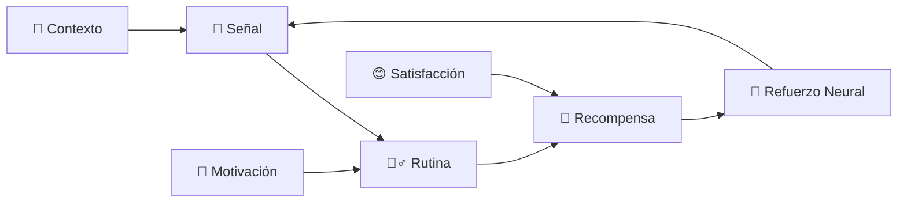
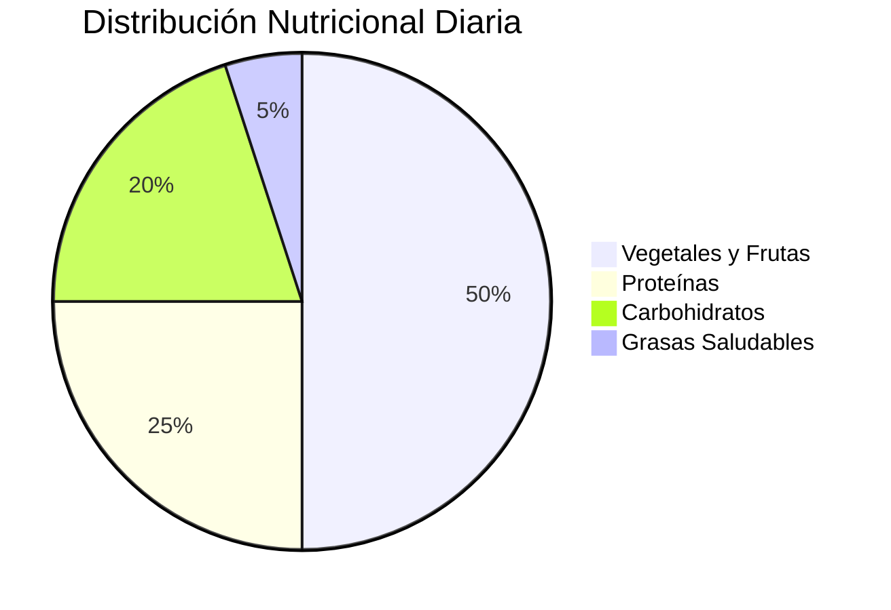
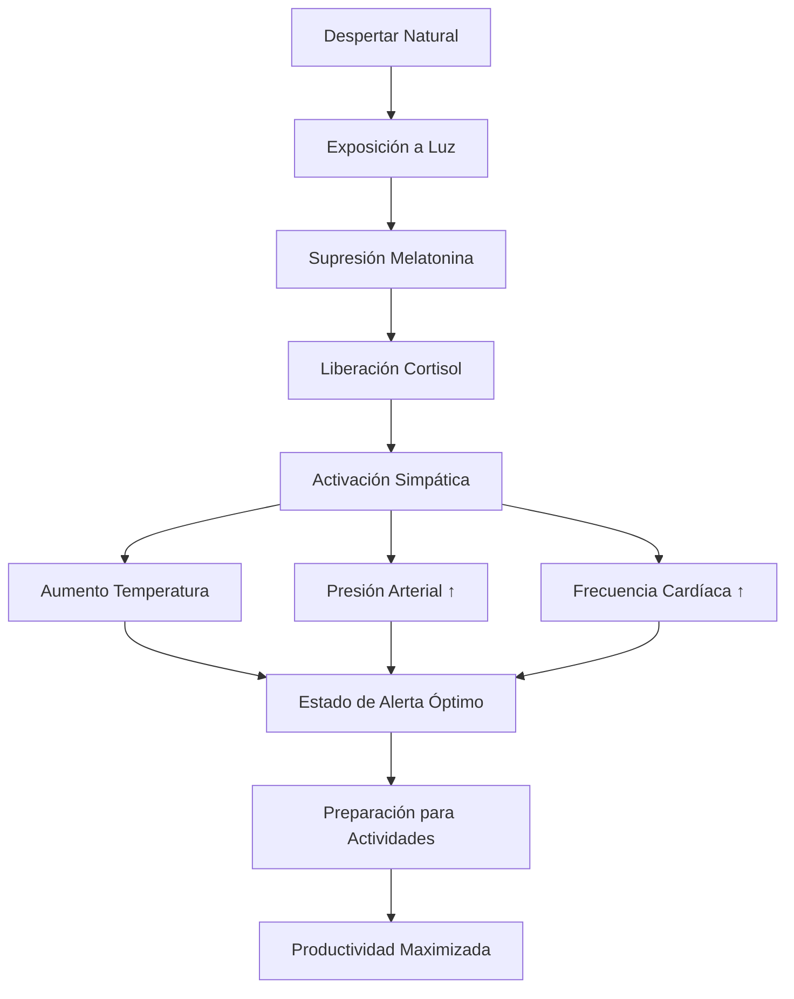
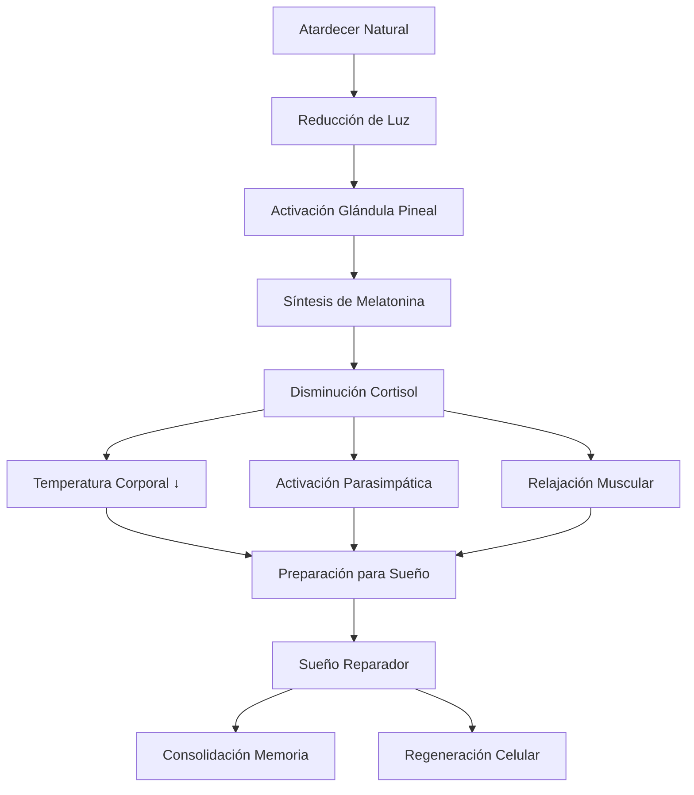

# 🌱 Hábitos y Rutinas Saludables

## 🧠 Fundamentos Neurológicos

> [!info] 🔬 La Ciencia del Hábito Los hábitos se forman a través del **bucle neurológico**: Señal → Rutina → Recompensa. El cerebro automatiza estas secuencias para conservar energía, creando senderos neuronales que se fortalecen con la repetición.

> [!tip] ⚡ Regla de los 21-66 Días
> 
> - **21 días**: Tiempo mínimo para establecer un hábito simple
> - **66 días**: Promedio real para automatizar comportamientos
> - **Variables**: Complejidad del hábito, motivación personal, entorno

## 🔄 Arquitectura de Hábitos



### 🏗️ Componentes Esenciales

> [!tip] 🎯 Diseño de Señales Efectivas **Tipos de disparadores:**
> 
> - **Temporales**: Horarios específicos (7:00 AM - ejercicio)
> - **Ubicación**: Espacios designados (cocina - desayuno saludable)
> - **Emocionales**: Estados de ánimo (estrés - meditación)
> - **Sociales**: Personas específicas (compañero - caminar)

> [!warning] ⚠️ Errores en la Formación de Hábitos
> 
> - Intentar cambios muy drásticos de una vez
> - No definir recompensas inmediatas
> - Ignorar el poder del entorno
> - Falta de seguimiento y medición

## 🌅 Rutinas Matutinas Optimizadas

> [!info] ☀️ La Hora Dorada Las primeras 2 horas después de despertar determinan el 80% de la productividad y bienestar del día. El cortisol natural está en su pico, optimizando la energía y concentración.

### 🎯 Rutina Matutina Básica (30 min)

```mermaid
gantt
    title Rutina Matutina Efectiva
    dateFormat HH:mm
    axisFormat %H:%M
    
    section Despertar
    Hidratación           :done, wake1, 06:00, 5m
    Respiración consciente :done, wake2, after wake1, 5m
    
    section Activación
    Ejercicio ligero      :active, move1, after wake2, 10m
    Ducha revigorante     :move2, after move1, 5m
    
    section Preparación
    Desayuno nutritivo    :prep1, after move2, 15m
```



> [!tip] 🥤 Hidratación Estratégica **Protocolo de despertar:**
> 
> - 500ml de agua tibia con limón
> - Activa el metabolismo y digestión
> - Compensa deshidratación nocturna
> - Prepara el sistema para nutrientes

### 🧘‍♀️ Prácticas de Mindfulness

> [!info] 🎯 Técnicas de Centramiento **Respiración 4-7-8:**
> 
> - Inhalar 4 segundos
> - Retener 7 segundos
> - Exhalar 8 segundos
> - Repetir 4 ciclos mínimo

## 🌙 Rutinas Vespertinas Restaurativas

> [!warning] 📱 Digital Sunset Evitar pantallas 2 horas antes de dormir. La luz azul suprime la melatonina hasta un 23%, alterando los ciclos de sueño naturales.

### 🛏️ Protocolo de Descanso

> [!tip] 🌜 Rutina de Desconexión (60 min) **Fase 1 - Preparación (20 min):**
> 
> - Organizar espacio para mañana siguiente
> - Preparar ropa y materiales del día siguiente
> - Revisión suave del día (3 gratitudes)
> 
> **Fase 2 - Relajación (20 min):**
> 
> - Baño tibio o ducha relajante
> - Lectura ligera o journaling
> - Técnicas de respiración profunda
> 
> **Fase 3 - Descanso (20 min):**
> 
> - Ambiente fresco (18-20°C)
> - Oscuridad total o antifaz
> - Sonidos blancos o silencio

## 🍎 Nutrición Consciente

### 🥗 Planificación Alimentaria

> [!info] 🍽️ Regla del Plato Equilibrado
> 
> - **50%**: Vegetales y frutas (colores variados)
> - **25%**: Proteínas magras (pescado, legumbres, aves)
> - **25%**: Carbohidratos complejos (quinoa, avena, batata)



> [!tip] ⏰ Horarios de Alimentación **Ventana de alimentación 12 horas:**
> 
> - **7:00 AM**: Desayuno energético
> - **12:00 PM**: Almuerzo equilibrado
> - **19:00 PM**: Cena ligera
> - **21:00 PM**: Cierre ventana alimentaria

> [!warning] 🚫 Alimentos que Sabotean la Energía
> 
> - Azúcares refinados (picos de glucosa)
> - Procesados ultraprocesados (inflamación)
> - Cafeína después de las 14:00 (altera sueño)
> - Alcohol cerca del sueño (fragmenta descanso)

## 🏃‍♀️ Movimiento Inteligente

### 💪 Ejercicio por Niveles

> [!tip] 🎯 Principiante (15-20 min/día) **Semana 1-2:**
> 
> - Caminata rápida 10 minutos
> - Estiramientos básicos 5 minutos
> - Respiración profunda 5 minutos
> 
> **Semana 3-4:**
> 
> - Añadir ejercicios de peso corporal
> - Incrementar caminata a 15 minutos
> - Introducir yoga básico

> [!info] 🔥 Intermedio (30-45 min/día) **Estructura semanal:**
> 
> - **Lun/Mié/Vie**: Cardio + Fuerza
> - **Mar/Jue**: Flexibilidad + Core
> - **Sáb**: Actividad recreativa
> - **Dom**: Descanso activo

> [!warning] ⚡ Avanzado (45-60 min/día)
> 
> - Periodización planificada
> - Métricas de rendimiento
> - Recuperación estructurada
> - Variabilidad programada

### 🧘‍♂️ Micro-Ejercicios

> [!tip] ⚡ Activación de 2 Minutos **Cada 2 horas durante trabajo:**
> 
> - 20 sentadillas o flexiones
> - Estiramientos de cuello y hombros
> - Respiraciones profundas
> - Movimiento de tobillos y muñecas

## 🧠 Salud Mental y Emocional

### 🎭 Gestión Emocional

> [!info] 🌊 Técnica RAIN
> 
> - **Reconocer**: ¿Qué estoy sintiendo?
> - **Aceptar**: Permitir la emoción sin juicio
> - **Investigar**: ¿Dónde siento esto en mi cuerpo?
> - **No-identificación**: No soy esta emoción

> [!tip] 📝 Journaling Terapéutico **Prompts diarios:**
> 
> - ¿Qué me generó alegría hoy?
> - ¿Qué desafío superé?
> - ¿Cómo me cuidé a mí mismo?
> - ¿Qué aprendí sobre mí?

### 🎯 Técnicas de Enfoque

> [!warning] 📱 Gestión de Distracciones Digitales **Protocolo de Atención:**
> 
> - Modo avión durante trabajo profundo
> - Notificaciones solo de emergencias
> - Revisión de redes sociales en horarios específicos
> - Apps de bloqueo para sitios problemáticos

## 📊 Sistema de Seguimiento

### 📈 Métricas de Bienestar

```mermaid
radar
    title Evaluación Semanal de Hábitos
    "Sueño" 0.9
    "Ejercicio" 0.8
    "Nutrición" 0.7
    "Mindfulness" 0.6
    "Hidratación" 0.9
    "Conexiones Sociales" 0.5
```

> [!tip] 📊 Tracker Simplificado **Puntuación diaria (1-5):**
> 
> - 🌅 Rutina matutina completada
> - 🥗 Alimentación consciente
> - 🏃‍♀️ Movimiento corporal
> - 🧘‍♀️ Práctica de mindfulness
> - 🌙 Rutina vespertina
> - 💧 Hidratación adecuada

### 🎯 Revisiones Periódicas

> [!info] 📅 Ciclos de Evaluación **Diario (5 min):**
> 
> - Check-in emocional
> - Revisar hábitos del día
> - Planificar día siguiente
> 
> **Semanal (20 min):**
> 
> - Análisis de patrones
> - Ajustes necesarios
> - Celebrar logros
> 
> **Mensual (45 min):**
> 
> - Evaluación integral
> - Redefinir objetivos
> - Introducir nuevos hábitos

## 🛠️ Herramientas y Recursos

> [!tip] 📱 Apps Recomendadas **Seguimiento:**
> 
> - Habitica (gamificación)
> - Streaks (simplicidad)
> - Way of Life (visual)
> 
> **Meditación:**
> 
> - Headspace, Calm, Insight Timer
> 
> **Ejercicio:**
> 
> - Nike Training, Freeletics, Seven

> [!info] 📚 Técnicas de Refuerzo **Accountability:**
> 
> - Compañero de hábitos
> - Grupos de apoyo
> - Coach o mentor
> - Comunidades online

## 🚨 Gestión de Recaídas

> [!warning] 🔄 Protocolo de Recuperación **Cuando falles:**
> 
> 1. **No juzgues**: Las recaídas son normales
> 2. **Analiza**: ¿Qué situación la provocó?
> 3. **Ajusta**: Modifica el sistema, no el objetivo
> 4. **Recomienza**: Al día siguiente, no el lunes

> [!tip] 🎯 Regla del 80/20 Si cumples tus hábitos el 80% del tiempo, estás en el camino correcto. La perfección no es el objetivo, la consistencia sí.

## 🔗 Referencias

> [!quote] 📚 Notas Relacionadas
> 
> - [[Hábitos y Rutinas Saludables]]
> - [[Mindfulness]]
> - [[Deep Work]]

---

#hábitos #rutinas #bienestar #salud #mindfulness #nutrición #ejercicio #sueño #productividad #desarrollo-personal

# 🌅 Rutinas Matutinas

> [!info] ⏰ Definición Las rutinas matutinas son secuencias estructuradas de actividades realizadas consistentemente al despertar, diseñadas para optimizar el estado físico, mental y emocional durante las primeras horas del día. Una rutina matutina bien diseñada establece el tono para todo el día, mejorando la productividad, bienestar y rendimiento cognitivo.

## 🧬 Fundamentos Cronobiológicos

> [!tip] 🔬 Ritmos Circadianos y Despertar **Proceso Fisiológico del Despertar:**
> 
> - **Pico de cortisol** (6:00-8:00 AM) - "Awakening Response"
> - **Temperatura corporal** en ascenso progresivo
> - **Supresión de melatonina** por exposición a luz
> - **Activación del sistema nervioso** simpático
> - **Aumento gradual** de presión arterial y frecuencia cardíaca



> [!warning] ⚠️ Importancia del Timing Consistente **Beneficios de la Consistencia Horaria:**
> 
> - **Sincronización del reloj** biológico interno
> - **Mejora en la calidad** del sueño nocturno
> - **Optimización hormonal** natural
> - **Reducción de la fatiga** matutina
> - **Mayor predictibilidad** energética durante el día

## 🏗️ Arquitectura de una Rutina Matutina Efectiva

### ⏰ Fases Temporales Estructuradas

> [!info] 📊 Distribución Temporal Recomendada **Fase 1: Transición (0-15 minutos)**
> 
> - **Despertar gradual** sin alarmas bruscas
> - **Hidratación inmediata** (500-750ml agua)
> - **Respiración consciente** (5-10 respiraciones profundas)
> - **Evaluación del estado** físico y mental
> 
> **Fase 2: Activación (15-45 minutos)**
> 
> - **Ejercicio físico** ligero a moderado
> - **Exposición a luz natural** (10-15 minutos mínimo)
> - **Ducha** con variaciones de temperatura
> - **Preparación nutricional** consciente
> 
> **Fase 3: Preparación Mental (45-75 minutos)**
> 
> - **Meditación o mindfulness** (10-20 minutos)
> - **Revisión de objetivos** diarios
> - **Lectura o aprendizaje** (15-30 minutos)
> - **Planificación estratégica** del día

### 💧 Hidratación Matutina Optimizada

> [!tip] 🚰 Protocolo de Rehidratación **Necesidades Hídricas al Despertar:**
> 
> - **Déficit nocturno**: 300-500ml perdidos durante sueño
> - **Hidratación celular**: Facilita todos los procesos metabólicos
> - **Activación del sistema** digestivo y renal
> 
> **Composición Ideal:**
> 
> - **Agua pura** con temperatura ambiente (no fría)
> - **Electrolitos naturales**: Pizca de sal marina + limón
> - **Agua de coco**: Alternativa natural rica en potasio
> - **Evitar**: Bebidas con cafeína como primera opción

### ☀️ Terapia de Luz Natural

> [!info] 🌞 Fototerapia Circadiana **Exposición Solar Estratégica:**
> 
> - **Timing óptimo**: Primeros 30-60 minutos post-despertar
> - **Duración mínima**: 10-15 minutos de luz directa
> - **Intensidad**: 1,000-10,000 lux (luz solar directa)
> - **Ubicación**: Exterior preferiblemente, ventana como alternativa
> 
> **Beneficios Neurológicos:**
> 
> - **Regulación de melatonina** para ciclo sueño-vigilia
> - **Mejora del estado de ánimo** vía síntesis de serotonina
> - **Sincronización del reloj** circadiano maestro
> - **Optimización de la temperatura** corporal diurna

## 🏃‍♀️ Componente de Actividad Física

### 🔥 Ejercicio de Activación Matutina

> [!warning] ⚡ Intensidad Calibrada **Niveles de Intensidad por Objetivo:**
> 
> **Activación Suave (5-15 minutos):**
> 
> - **Estiramientos dinámicos**: Movilidad articular completa
> - **Yoga flow**: Saludos al sol o secuencias suaves
> - **Caminata enérgica**: Interior o exterior según clima
> - **Respiración con movimiento**: Coordinación mente-cuerpo
> 
> **Activación Moderada (15-30 minutos):**
> 
> - **Cardio de baja intensidad**: Jumping jacks, marcha en sitio
> - **Entrenamiento funcional**: Peso corporal básico
> - **Ciclismo estacionario**: Intensidad 60-70% FCM
> - **Rutina de fuerza**: 2-3 ejercicios básicos
> 
> **Activación Intensa (30-60 minutos):**
> 
> - **HIIT matutino**: Intervalos de alta intensidad
> - **Corrida**: 3-8 km según condición física
> - **Entrenamiento de fuerza**: Rutina completa
> - **Deportes**: Tenis, natación, artes marciales

> [!tip] 🎯 Beneficios Cognitivos Inmediatos **Efectos en las Primeras 2-4 Horas:**
> 
> - **Aumento del BDNF** (factor neurotrófico) hasta 200%
> - **Mejora de la atención** y concentración sostenida
> - **Optimización del estado de ánimo** vía endorfinas
> - **Aumento de la energía** percibida durante 6-8 horas
> - **Mejor toma de decisiones** en tareas complejas

## 🧘‍♀️ Práticas de Mindfulness y Meditación

### 🧠 Entrenamiento Mental Matutino

> [!info] 🎯 Técnicas de Centrado **Meditación de Respiración (5-20 minutos):**
> 
> - **Postura**: Sentado cómodamente, columna erguida
> - **Técnica**: Atención plena en respiración natural
> - **Conteo**: 4 segundos inhalar, 4 segundos exhalar
> - **Actitud**: Observación sin juicio de pensamientos
> 
> **Meditación de Gratitud (5-10 minutos):**
> 
> - **Identificación** de 3-5 elementos de gratitud
> - **Visualización detallada** de cada elemento
> - **Sensación corporal** de la gratitud
> - **Intención** de mantener perspectiva durante el día
> 
> **Visualización de Objetivos (10-15 minutos):**
> 
> - **Visualización específica** del día ideal
> - **Ensayo mental** de situaciones desafiantes
> - **Afirmaciones positivas** realistas y específicas
> - **Compromiso consciente** con las metas diarias

### 📚 Aprendizaje y Desarrollo Personal

> [!tip] 📖 Inversión en Crecimiento **Modalidades de Aprendizaje Matutino:**
> 
> - **Lectura**: 10-30 minutos de libros de desarrollo
> - **Podcasts educativos**: Durante ejercicio o preparación
> - **Idiomas**: 15-20 minutos de práctica con apps
> - **Habilidades técnicas**: Cursos online cortos
> - **Journaling**: Escritura reflexiva y planificación

## 🍳 Nutrición Matutina Estratégica

### 🥗 Desayuno Optimizado para Cognición

> [!warning] 🧠 Composición Nutricional Ideal **Macronutrientes Balanceados:**
> 
> - **Proteínas (20-30g)**: Huevos, yogur griego, proteína en polvo
> - **Carbohidratos complejos (30-50g)**: Avena, quinoa, frutas
> - **Grasas saludables (10-20g)**: Aguacate, nueces, aceite de oliva
> - **Fibra (8-12g)**: Vegetales, semillas, cereales integrales
> 
> **Ejemplos de Desayunos Cerebrales:**
> 
> - **Opción 1**: Avena + arándanos + nueces + yogur griego
> - **Opción 2**: Huevos revueltos + aguacate + tostada integral
> - **Opción 3**: Smoothie verde + proteína + semillas de chía
> - **Opción 4**: Quinoa + frutas + almendras + miel

> [!info] ☕ Gestión de Cafeína **Protocolo de Cafeína Estratégica:**
> 
> - **Timing**: 90-120 minutos post-despertar (no inmediatamente)
> - **Cantidad**: 100-200mg (1-2 tazas café) máximo matutino
> - **Combinación**: Con L-teanina para suavizar efectos
> - **Hidratación**: 2:1 ratio agua:cafeína para balance hídrico

## 📱 Gestión de Tecnología Matutina

### 🚫 Protocolo de Desconexión Digital

> [!warning] 📵 Límites Tecnológicos Saludables **Regla de los Primeros 60 Minutos:**
> 
> - **Sin teléfono móvil** durante primera hora
> - **Sin redes sociales** hasta completar rutina básica
> - **Sin noticias** que puedan generar ansiedad matutina
> - **Sin emails laborales** antes de la planificación personal
> 
> **Uso Consciente de Tecnología:**
> 
> - **Apps de meditación**: Headspace, Calm, Insight Timer
> - **Música ambiental**: Para ejercicio y meditación
> - **Apps de objetivos**: Para tracking de hábitos
> - **Lectores de libros**: Kindle, audiolibros educativos

## 🎯 Rutinas Específicas por Perfil

### 🎓 Para Estudiantes

> [!info] 📚 Optimización Académica **Rutina de 60 minutos:**
> 
> - **0-10 min**: Despertar + hidratación + respiración
> - **10-25 min**: Ejercicio ligero + exposición solar
> - **25-35 min**: Ducha + preparación personal
> - **35-45 min**: Desayuno nutritivo + revisión de agenda
> - **45-60 min**: Meditación + repaso de material clave
> 
> **Días de Examen:**
> 
> - **Rutina reducida** a 30-40 minutos
> - **Ejercicio muy suave** para evitar fatiga
> - **Desayuno familiar** y nutritivo
> - **Meditación de calma** y confianza

### 💼 Para Profesionales

> [!tip] 🏢 Productividad Laboral **Rutina de 75-90 minutos:**
> 
> - **0-15 min**: Despertar gradual + hidratación + mindfulness
> - **15-45 min**: Ejercicio moderado + ducha
> - **45-60 min**: Desayuno + revisión de prioridades del día
> - **60-75 min**: Lectura/podcast + preparación mental
> - **75-90 min**: Commute consciente o transición al trabajo

### 🏠 Para Trabajo Remoto

> [!warning] 🖥️ Separación Casa-Trabajo **Ritual de Transición:**
> 
> - **Cambio de ropa**: De pijama a "uniforme de trabajo"
> - **Espacio dedicado**: Preparación del área de trabajo
> - **Límites temporales**: Horario claro de inicio laboral
> - **Ritual de apertura**: Encender vela, música específica
> - **Revisión de objetivos**: Planning del día productivo

## 🔧 Personalización y Adaptación

### 📊 Cronotipos y Horarios Naturales

> [!info] 🦉 Adaptación al Cronotipo Personal **Personas Matutinas ("Alondras"):**
> 
> - **Despertar**: 5:30-6:30 AM naturalmente
> - **Rutina completa**: 60-90 minutos
> - **Ejercicio intenso**: Bien tolerado
> - **Productividad pico**: 6:00-10:00 AM
> 
> **Personas Vespertinas ("Búhos"):**
> 
> - **Despertar**: 7:00-8:30 AM (obligado)
> - **Rutina suave**: 30-45 minutos
> - **Ejercicio ligero**: Mejor tolerancia
> - **Activación gradual**: Respeto al ritmo natural
> 
> **Personas Intermedias:**
> 
> - **Despertar**: 6:30-7:30 AM
> - **Rutina estándar**: 45-60 minutos
> - **Flexibilidad**: Adaptación según actividades del día

### 🔄 Implementación Gradual

> [!tip] 📈 Estrategia de Adopción Progresiva **Semana 1-2: Fundamentos**
> 
> - Solo **hidratación** y **5 minutos de respiración**
> - **Despertar** a la misma hora diariamente
> - **Exposición breve** a luz natural
> 
> **Semana 3-4: Expansión**
> 
> - **Agregar 10-15 minutos** de ejercicio ligero
> - **Introducir** rutina de preparación personal
> - **Desayuno** más consciente y nutritivo
> 
> **Semana 5-8: Consolidación**
> 
> - **Rutina completa** de 45-60 minutos
> - **Ajustes personalizados** según respuesta
> - **Tracking** de beneficios y adaptaciones necesarias

## 🔗 Referencias

> [!quote] 📚 Notas Relacionadas
> 
> - [[Hábitos y Rutinas Saludables]] - Marco general de hábitos saludables
> - [[Ejercicio y Cognición]] - Componente de actividad física matutina
> - [[Nutrición para el cerebro]] - Desayuno optimizado para cognición
> - [[Higiene de Sueño]] - Conexión con calidad del sueño nocturno
> - [[Gestión del Estrés]] - Técnicas de manejo matutino del estrés

## 📖 Notas Recomendadas

> [!info] 🔍 Para Profundizar
> - [[Mindfulness]] - Profundización en prácticas meditativas
> - [[Técnicas de Concentración]] - Optimización del enfoque diario
> - [[Análisis de Tiempo]] - Planificación eficiente de rutinas
> - [[Motivación Académica]] - Mantener consistencia en hábitos matutinos
> - [[Deep Work]] - Preparación para sesiones de trabajo profundo

---

#rutinas-matutinas #hábitos-saludables #cronobiología #mindfulness #ejercicio-matutino #nutrición-cerebral #productividad #bienestar #optimización-cognitiva

# 🌙 Rutinas Nocturnas

> [!info] 🕘 Definición Las rutinas nocturnas son secuencias estructuradas de actividades realizadas consistentemente antes del sueño, diseñadas para facilitar la transición del estado de vigilia al descanso, optimizar la calidad del sueño y preparar el cuerpo y mente para la regeneración nocturna. Una rutina nocturna efectiva mejora la consolidación de memoria, reduce el estrés acumulado y prepara el organismo para un nuevo día.

## 🧬 Fundamentos de la Fisiología Nocturna

> [!tip] 🔬 Procesos Circadianos del Atardecer **Cambios Hormonales Naturales:**
> 
> - **Disminución del cortisol** (7:00-10:00 PM)
> - **Aumento de melatonina** inicio 2-3 horas antes de dormir
> - **Reducción progresiva** de temperatura corporal
> - **Activación del sistema nervioso** parasimpático
> - **Liberación de hormona** de crecimiento durante sueño profundo



> [!warning] ⚠️ Disruptores Circadianos Comunes **Factores que Interfieren:**
> 
> - **Luz azul** de dispositivos electrónicos
> - **Estimulación cognitiva** intensa antes de dormir
> - **Cafeína** consumida después de las 2:00 PM
> - **Comidas pesadas** 3 horas antes del sueño
> - **Ejercicio intenso** 3-4 horas antes de acostarse
> - **Estrés y preocupaciones** no procesadas del día

## 🏗️ Arquitectura de una Rutina Nocturna Efectiva

### ⏰ Fases Temporales de Transición

> [!info] 📊 Estructura Temporal Recomendada **Fase 1: Cierre del Día (2-3 horas antes del sueño)**
> 
> - **Finalización de actividades** productivas/estimulantes
> - **Cena ligera** y nutritiva
> - **Organización** del espacio personal
> - **Revisión y cierre** de tareas pendientes
> 
> **Fase 2: Desaceleración (1-2 horas antes del sueño)**
> 
> - **Reducción de estímulos** visuales y auditivos
> - **Actividades de relajación** activa
> - **Preparación del entorno** de sueño
> - **Higiene personal** relajante
> 
> **Fase 3: Preparación Final (30-60 minutos antes del sueño)**
> 
> - **Rutinas de relajación** profunda
> - **Meditación o mindfulness** nocturno
> - **Lectura ligera** o journaling
> - **Configuración óptima** del dormitorio

### 🌅 Gestión de la Exposición Lumínica

> [!tip] 💡 Protocolo de Luz Circadiana **Transición Lumínica Gradual:**
> 
> - **3 horas antes**: Reducir luces brillantes generales
> - **2 horas antes**: Cambiar a iluminación cálida (2700K-3000K)
> - **1 hora antes**: Solo luces tenues o velas
> - **30 min antes**: Oscuridad casi completa
> 
> **Filtros de Luz Azul:**
> 
> - **Gafas con filtro**: Para uso de dispositivos necesarios
> - **Apps de filtro**: f.lux, Night Shift, Blue Light Filter
> - **Configuración de pantallas**: Modo nocturno automático
> - **Bombillas inteligentes**: Programación automática de temperatura

### 📱 Desconexión Digital Progresiva

> [!warning] 🚫 Digital Sunset Protocol **Regla de Desconexión por Fases:**
> 
> - **2 horas antes**: Sin trabajo, emails laborales, o tareas estimulantes
> - **1.5 horas antes**: Sin redes sociales o contenido activante
> - **1 hora antes**: Sin pantallas excepto lectura en e-reader con luz cálida
> - **30 min antes**: Dispositivos en modo avión o fuera del dormitorio
> 
> **Alternativas Analógicas:**
> 
> - **Libros físicos**: Preferiblemente ficción ligera o desarrollo personal
> - **Revistas** o **periódicos** impresos
> - **Puzzles** o **crucigramas** de baja estimulación
> - **Escritura manual**: Journaling o planificación del siguiente día

## 🧘‍♀️ Técnicas de Relajación y Desestresamiento

### 🫁 Prácticas de Respiración Nocturna

> [!info] 💨 Técnicas de Respiración Calmante **Respiración 4-7-8 (Técnica del Dr. Weil):**
> 
> - **Inhalar** por nariz durante 4 segundos
> - **Retener** la respiración durante 7 segundos
> - **Exhalar** por boca durante 8 segundos
> - **Repetir** 4-8 ciclos completos
> - **Efecto**: Activación parasimpática inmediata
> 
> **Respiración Abdominal Profunda:**
> 
> - **Posición**: Acostado, mano en pecho y abdomen
> - **Técnica**: Respiración que expande solo el abdomen
> - **Ritmo**: Inhalación 6 segundos, exhalación 6 segundos
> - **Duración**: 10-20 minutos de práctica
> 
> **Respiración de Coherencia Cardíaca:**
> 
> - **Patrón**: 5 segundos inhalar, 5 segundos exhalar
> - **Objetivo**: Sincronizar ritmo cardíaco con respiración
> - **Herramientas**: Apps como HeartMath, Breathe
> - **Beneficio**: Reducción inmediata de ansiedad

### 🧠 Meditación y Mindfulness Nocturno

> [!tip] 🎯 Técnicas Específicas para el Sueño **Body Scan Progresivo:**
> 
> - **Inicio**: Desde los dedos de los pies
> - **Progresión**: Ascendente hasta la cabeza
> - **Técnica**: Tensión y relajación consciente de cada grupo muscular
> - **Duración**: 15-30 minutos
> - **Efecto**: Relajación física profunda
> 
> **Meditación de Gratitud Nocturna:**
> 
> - **Reflexión**: 3-5 momentos positivos del día
> - **Detalle**: Visualización específica de cada momento
> - **Emoción**: Conexión con la sensación de agradecimiento
> - **Efecto**: Mejora del estado de ánimo y perspectiva
> 
> **Visualización de Lugar Seguro:**
> 
> - **Creación mental**: De un lugar tranquilo y seguro
> - **Detalles sensoriales**: Sonidos, olores, texturas, colores
> - **Inmersión**: Experiencia completa del entorno
> - **Propósito**: Refugio mental para reducir ansiedad

### 📝 Journaling y Procesamiento Emocional

> [!warning] 📖 Cierre Cognitivo del Día **Técnicas de Escritura Nocturna:**
> 
> **Descarga Mental (Brain Dump):**
> 
> - **Objetivo**: Vaciar preocupaciones y pensamientos persistentes
> - **Método**: Escribir sin filtro durante 10-15 minutos
> - **Sin edición**: Flujo consciente sin autocrítica
> - **Resultado**: Liberación de tensión mental
> 
> **Reflexión Estructurada:**
> 
> - **3 logros** del día (por pequeños que sean)
> - **2 lecciones** aprendidas o desafíos enfrentados
> - **1 intención** o objetivo para el día siguiente
> - **Formato**: Consistente para crear patrón de cierre
> 
> **Lista de Pendientes del Mañana:**
> 
> - **Transferencia**: De preocupaciones mentales al papel
> - **Priorización**: 3-5 tareas más importantes
> - **Delegación mental**: Al "yo del mañana"
> - **Liberación**: Permiso consciente para desconectar

## 🛁 Rituales de Cuidado Personal

### 🚿 Higiene Nocturna Relajante

> [!info] 🧴 Rutinas de Autocuidado **Ducha/Baño Terapéutico:**
> 
> - **Temperatura**: Agua tibia (no caliente) para no disrumpir termorregulación
> - **Duración**: 10-20 minutos máximo
> - **Aromas**: Lavanda, manzanilla, eucalipto (aceites esenciales)
> - **Timing**: 1-2 horas antes del sueño para permitir enfriamiento
> 
> **Skincare Nocturno:**
> 
> - **Limpieza**: Removal completo de maquillaje y contaminantes
> - **Tratamiento**: Productos nocturnos específicos
> - **Masaje facial**: Movimientos suaves para relajación
> - **Mindfulness**: Atención plena durante el proceso
> 
> **Cuidado Dental Consciente:**
> 
> - **Técnica**: Cepillado de 2-3 minutos con atención
> - **Hilo dental**: Proceso meditativo y completo
> - **Enjuague**: Sin alcohol para evitar sequedad
> - **Reflexión**: Gratitud por la salud bucal

### 💆‍♀️ Técnicas de Autorelajación Física

> [!tip] 🤲 Masaje y Liberación de Tensión **Auto-masaje de Pies:**
> 
> - **Técnica**: Presión circular en plantas y dedos
> - **Aceites**: Lavanda o manzanilla diluidos
> - **Duración**: 5-10 minutos por pie
> - **Beneficio**: Activación de puntos de presión relajantes
> 
> **Estiramiento Suave Nocturno:**
> 
> - **Cuello y hombros**: Rotaciones lentas y estiramientos laterales
> - **Espalda**: Posición fetal, rodillas al pecho
> - **Caderas**: Figura 4, rotaciones suaves
> - **Piernas**: Elevación contra pared
> 
> **Relajación Muscular Progresiva:**
> 
> - **Tensión sistemática**: 5 segundos cada grupo muscular
> - **Relajación**: 10 segundos de liberación consciente
> - **Progresión**: Pies → piernas → torso → brazos → rostro
> - **Finalización**: 5 minutos de relajación total

## 🍽️ Nutrición Nocturna Estratégica

### 🥛 Alimentos Promotores del Sueño

> [!warning] 🧠 Nutrientes para el Descanso **Triptófano (Precursor de Serotonina y Melatonina):**
> 
> - **Fuentes**: Pavo, pollo, huevos, queso, leche tibia
> - **Combinación**: Con carbohidratos complejos para mejor absorción
> - **Timing**: 1-2 horas antes del sueño
> - **Ejemplo**: Leche tibia con miel, avena con plátano
> 
> **Magnesio (Relajante Muscular Natural):**
> 
> - **Fuentes**: Almendras, espinacas, semillas de calabaza
> - **Suplementación**: 200-400mg si deficiencia
> - **Efectos**: Relajación muscular, reducción de ansiedad
> - **Forma**: Glicinato de magnesio mejor absorbido
> 
> **Melatonina Natural:**
> 
> - **Fuentes**: Cerezas ácidas, nueces, avena
> - **Potenciadores**: Oscuridad, temperatura fresca
> - **Suplementación**: 0.5-3mg, 30-60 min antes del sueño
> - **Precaución**: Consultar médico para uso regular

### 🚫 Alimentos y Sustancias a Evitar

> [!warning] ⚠️ Disruptores Nutricionales del Sueño **Estimulantes:**
> 
> - **Cafeína**: Evitar después de 2:00 PM (vida media 6-8 horas)
> - **Nicotina**: Estimulante que fragmenta el sueño
> - **Alcohol**: Sedante inicial pero disrumpre sueño REM
> - **Chocolate negro**: Contiene teobromina estimulante
> 
> **Comidas Problemáticas:**
> 
> - **Comidas pesadas**: 3-4 horas antes del sueño
> - **Alimentos picantes**: Pueden elevar temperatura corporal
> - **Exceso de líquidos**: 2 horas antes para evitar interrupciones
> - **Azúcares refinados**: Causan picos glucémicos disruptivos

## 🛏️ Optimización del Entorno de Sueño

### 🌡️ Control Ambiental del Dormitorio

> [!info] 🏠 Configuración del Espacio de Descanso **Temperatura Óptima:**
> 
> - **Rango ideal**: 16-19°C (60-67°F)
> - **Regulación**: Termostato programable o ventilador
> - **Ropa de cama**: Materiales transpirables (algodón, bambú)
> - **Vestimenta**: Pijama ligero o temperatura corporal natural
> 
> **Calidad del Aire:**
> 
> - **Ventilación**: Circulación de aire fresco
> - **Humedad**: 40-60% para comodidad respiratoria
> - **Purificación**: Plantas o purificador si hay alergias
> - **Aromas**: Lavanda, manzanilla (difusor o spray de almohada)
> 
> **Control de Ruido:**
> 
> - **Aislamiento**: Cortinas gruesas, alfombras
> - **Ruido blanco**: Ventilador, máquina de sonidos, apps
> - **Tapones**: Para entornos muy ruidosos
> - **Earplugs**: Silicona suave para comodidad prolongada

### 🕯️ Iluminación del Dormitorio

> [!tip] 💡 Protocolo de Luz Nocturna **Iluminación Pre-Sueño:**
> 
> - **Luces principales**: Apagadas 1 hora antes
> - **Luces de lectura**: LED cálido regulable (2700K)
> - **Luz de navegación**: Pequeña luz nocturna cálida
> - **Velas**: Opción natural (con precaución de seguridad)
> 
> **Bloqueo de Luz Externa:**
> 
> - **Cortinas blackout**: 99% bloqueo de luz externa
> - **Máscara de dormir**: Alternativa o complemento
> - **Cinta en LEDs**: Cubrir dispositivos con luces indicadoras
> - **Orientación de cama**: Evitar luz directa de farolas

## 🧸 Rutinas Específicas por Necesidades

### 😰 Para Ansiedad y Estrés

> [!warning] 🧠 Protocolo Anti-Ansiedad Nocturna **Técnicas de Regulación Emocional:**
> 
> - **Respiración 5-4-3-2-1**: 5 cosas que ves, 4 que tocas, 3 que escuchas, 2 que hueles, 1 que saboreas
> - **Afirmaciones calmantes**: "Estoy seguro/a", "Mañana es un nuevo día", "Merezco descansar"
> - **Técnica STOP**: Stop, Take a breath, Observe, Proceed mindfully
> - **Escritura de preocupaciones**: 15 minutos máximo, luego cerrar cuaderno
> 
> **Rutina Específica (60-90 minutos):**
> 
> 1. **Ducha tibia** con aceite esencial de lavanda (15 min)
> 2. **Técnica 4-7-8** de respiración (10 min)
> 3. **Journaling** de descarga mental (15 min)
> 4. **Meditación** body scan o app guiada (15-20 min)
> 5. **Lectura ligera** con luz tenue (10-15 min)
> 6. **Gratitud** - 3 cosas positivas del día (5 min)

### 😴 Para Insomnio Crónico

> [!info] 🔄 Terapia de Restricción del Sueño **Principios Fundamentales:**
> 
> - **Horario fijo**: Misma hora de despertar independiente de calidad del sueño
> - **Ventana de sueño**: Inicialmente limitada a tiempo real de sueño + 30 min
> - **Solo cama para dormir**: No actividades en cama excepto sueño e intimidad
> - **Regla de 15 minutos**: Si no duermes en 15-20 min, levantarse y hacer actividad tranquila
> 
> **Protocolo Progresivo:**
> 
> - **Semana 1-2**: Establecer ventana base de sueño restrictiva
> - **Semana 3-4**: Ajustar según eficiencia del sueño (>85% = añadir 15 min)
> - **Semana 5-8**: Estabilizar patrón óptimo personalizado
> - **Mantenimiento**: Flexibilidad controlada manteniendo estructura base

### 🏃‍♀️ Para Personas Muy Activas

> [!tip] 💪 Desaceleración Post-Ejercicio **Timing de Ejercicio:**
> 
> - **Ejercicio intenso**: Finalizar 4+ horas antes de dormir
> - **Ejercicio moderado**: Finalizar 2-3 horas antes
> - **Yoga/estiramientos**: Permitido hasta 1 hora antes
> - **Caminata ligera**: Beneficiosa hasta 30 min antes
> 
> **Rutina de Recuperación Nocturna:**
> 
> - **Hidratación**: Reposición gradual sin exceso antes de dormir
> - **Estiramiento terapéutico**: 15-20 min de flexibilidad
> - **Baño con sales de Epsom**: Relajación muscular y reducción inflamación
> - **Proteína ligera**: Caseína o yogurt griego para recuperación muscular nocturna

### 👩‍💼 Para Trabajadores por Turnos

> [!warning] ⏰ Adaptación Circadiana **Principios de Adaptación:**
> 
> - **Luz brillante**: Durante primeras horas del turno
> - **Gafas oscuras**: En viaje a casa después del turno nocturno
> - **Ambiente oscuro**: Dormitorio completamente a oscuras durante día
> - **Consistencia**: Mantener horarios incluso en días libres cuando sea posible
> 
> **Rutina Pre-Sueño Diurno:**
> 
> - **Máscara de dormir**: Obligatoria para bloqueo lumínico
> - **Ruido blanco**: Para enmascarar sonidos diurnos
> - **Temperatura más fresca**: 2-3°C más baja que sueño nocturno normal
> - **Comunicación familiar**: Establecer horarios de "no molestar"

## 📱 Tecnología y Herramientas de Apoyo

### 📊 Apps Recomendadas

> [!info] 📲 Herramientas Digitales para el Sueño **Meditación y Relajación:**
> 
> - **Headspace**: Meditaciones específicas para sueño
> - **Calm**: Historias para dormir, sonidos de la naturaleza
> - **Insight Timer**: Meditaciones gratuitas, temporizador personalizable
> - **Ten Percent Happier**: Enfoque científico en mindfulness
> 
> **Seguimiento del Sueño:**
> 
> - **Sleep Cycle**: Análisis de patrones y despertar inteligente
> - **Fitbit/Apple Watch**: Monitoreo automático de fases del sueño
> - **Oura Ring**: Métricas detalladas de recuperación y sueño
> - **Sleep Score**: Evaluación integral de calidad del descanso
> 
> **Gestión de Luz Azul:**
> 
> - **f.lux**: Filtro automático para computadoras
> - **Night Shift**: Función nativa iOS/macOS
> - **Twilight**: Android - filtro progresivo
> - **Blue Light Filter**: Múltiples opciones para Android

### 🎧 Audio y Sonidos Terapéuticos

> [!tip] 🔊 Paisajes Sonoros para el Descanso **Ruido Blanco y Rosa:**
> 
> - **Ruido blanco**: Frecuencias uniformes para enmascarar sonidos
> - **Ruido rosa**: Frecuencias más naturales, menos agudo
> - **Ruido marrón**: Tonos más profundos, muy relajante
> - **Apps**: Noisli, White Noise, Rain Rain
> 
> **Sonidos de la Naturaleza:**
> 
> - **Lluvia**: Constante, rítmico, altamente efectivo
> - **Océano**: Olas cíclicas, profundamente calmante
> - **Bosque**: Hojas, crujidos, ambiente natural
> - **Fuego**: Crepitar de leña, calidez auditiva
> 
> **Frecuencias Binaurales:**
> 
> - **Delta (0.5-4 Hz)**: Sueño profundo, regeneración
> - **Theta (4-8 Hz)**: Relajación profunda, meditación
> - **Alpha (8-14 Hz)**: Relajación alerta, transición
> - **Precaución**: Volumen muy bajo, no para todos

## 📅 Implementación y Personalización

### 🎯 Creación de tu Rutina Personal

> [!warning] 🔧 Proceso de Personalización **Fase 1: Evaluación Inicial (Semana 1-2)**
> 
> - **Diario de sueño**: Hora de acostarse, calidad subjetiva, despertares
> - **Identificación de patrones**: Qué funciona y qué no en rutina actual
> - **Cronotipos**: Determinar si eres matutino, vespertino o intermedio
> - **Restricciones**: Horarios, familia, trabajo, limitaciones físicas
> 
> **Fase 2: Diseño Personalizado (Semana 3-4)**
> 
> - **Selección de técnicas**: 3-5 elementos principales basados en necesidades
> - **Timing personal**: Ajustar horarios a tu cronograma real
> - **Flexibilidad**: Versión completa (60-90 min) y versión rápida (20-30 min)
> - **Contingencias**: Plan B para días complicados o viajes
> 
> **Fase 3: Implementación Gradual (Semana 5-8)**
> 
> - **Introducción progresiva**: Añadir un elemento nuevo por semana
> - **Ajustes**: Modificar según resultados y comodidad
> - **Consistencia**: Mínimo 4-5 noches por semana para formar hábito
> - **Evaluación**: Revisar efectividad cada 2 semanas

### 📈 Seguimiento y Optimización

> [!tip] 📊 Métricas de Evaluación **Indicadores Objetivos:**
> 
> - **Latencia del sueño**: Tiempo para quedarse dormido (<20 min ideal)
> - **Eficiencia del sueño**: Tiempo dormido/tiempo en cama (>85% bueno)
> - **Despertares nocturnos**: Frecuencia y duración
> - **Calidad del despertar**: Energía matutina, estado de ánimo
> 
> **Evaluación Subjetiva:**
> 
> - **Escala 1-10**: Calidad percibida del sueño
> - **Estado de ánimo**: Al acostarse y al despertar
> - **Estrés nocturno**: Dificultad para "desconectar"
> - **Satisfacción**: Con la rutina y resultados
> 
> **Ajustes Basados en Datos:**
> 
> - **Si latencia >30 min**: Más tiempo de relajación o técnicas diferentes
> - **Si despertares frecuentes**: Revisar ambiente, nutrición, estrés
> - **Si energía matutina baja**: Evaluar duración total, calidad del sueño
> - **Si baja adherencia**: Simplificar rutina, encontrar motivación intrínseca

## 🌟 Rutinas de Ejemplo Completas

### 🕘 Rutina Express (20-30 minutos)

> [!info] ⚡ Para Días con Poco Tiempo **Timing: 30 minutos antes de hora deseada de sueño**
> 
> **19:30-19:35**: Preparación del entorno
> 
> - Dimmer luces, configurar temperatura
> - Dispositivos en modo avión
> - Ropa cómoda de dormir
> 
> **19:35-19:45**: Higiene rápida mindful
> 
> - Lavado de cara consciente
> - Cepillado dental con atención
> - Crema hidratante con automasaje facial
> 
> **19:45-19:55**: Técnica de relajación
> 
> - Respiración 4-7-8 (8 ciclos) O
> - Body scan rápido de 10 minutos O
> - Meditación guiada de 10 minutos
> 
> **19:55-20:00**: Cierre mental
> 
> - 3 cosas por las que siente gratitud
> - Intención positiva para el siguiente día
> - Permiso consciente para descansar

### 🕐 Rutina Estándar (45-60 minutos)

> [!warning] ⚖️ Balance Ideal Tiempo-Efectividad **Timing: 60 minutos antes de hora deseada de sueño**
> 
> **19:00-19:15**: Cierre digital y del día
> 
> - Última revisión de emails/mensajes importantes
> - Dispositivos en modo avión o fuera del dormitorio
> - Preparación de ropa y objetos para el día siguiente
> - Lista rápida de 3-5 tareas prioritarias del mañana
> 
> **19:15-19:35**: Ritual de cuidado personal
> 
> - Ducha tibia con aceites esenciales (15 min) O
> - Baño relajante con sales (20 min) O
> - Rutina extendida de skincare (15 min)
> - Cepillado dental completo con hilo dental
> 
> **19:35-19:50**: Técnicas de relajación
> 
> - Respiración de coherencia cardíaca (5 min)
> - Estiramiento suave o yoga restaurativo (10 min)
> - Auto-masaje de pies o cuello/hombros (5 min)
> 
> **19:50-20:00**: Transición mental
> 
> - Journaling: descarga mental + gratitud (7 min)
> - Lectura ligera con luz tenue (10-15 min) O
> - Meditación o visualización (10 min)
> - Afirmaciones positivas y preparación mental

### 🕕 Rutina Intensiva (90-120 minutos)

> [!tip] 🌟 Para Máxima Optimización y Días Libres **Timing: 2 horas antes de hora deseada de sueño**
> 
> **18:00-18:30**: Pre-rutina y preparación
> 
> - Cena ligera y nutritiva (si corresponde)
> - Organización del espacio habitacional
> - Preparación completa para el día siguiente
> - Revisión de agenda y cierre mental de pendientes
> 
> **18:30-19:00**: Actividad de transición
> 
> - Caminata ligera al aire libre (20 min) O
> - Yoga suave o estiramientos (25 min) O
> - Actividad creativa relajante: dibujo, música (30 min)
> - Conversación tranquila con familia/pareja
> 
> **19:00-19:30**: Ritual de autocuidado extendido
> 
> - Baño terapéutico con aceites esenciales (25 min)
> - Rutina completa de skincare nocturno
> - Masaje corporal con aceites relajantes
> - Cuidado dental completo y consciente
> 
> **19:30-19:50**: Relajación profunda
> 
> - Técnica de relajación muscular progresiva (15 min)
> - Respiración avanzada: 4-7-8 + coherencia cardíaca (10 min)
> - Auto-masaje terapéutico: pies, cuello, rostro (15 min)
> 
> **19:50-20:00**: Cierre mental y espiritual
> 
> - Journaling extenso: reflexión del día + gratitud (15 min)
> - Meditación profunda o oración personal (10 min)
> - Lectura inspiracional o ficción ligera (15 min)
> - Visualización positiva del día siguiente (