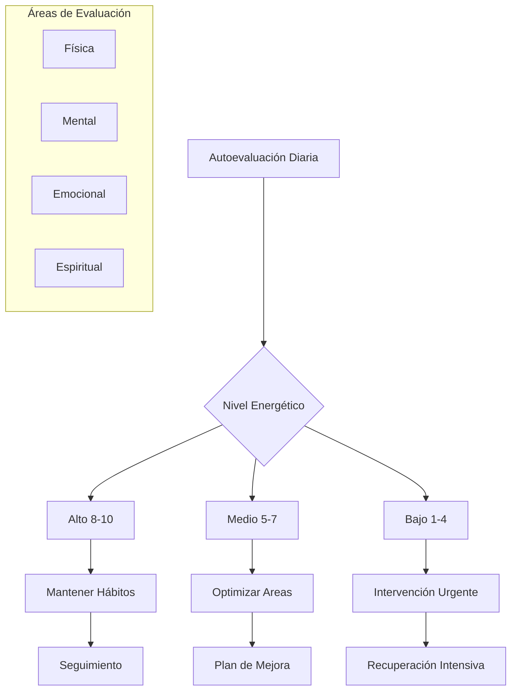

# ⚡ Gestión de la Energía Personal

## 🎯 Fundamentos de la Energía Personal

> [!info] Definición Integral La gestión de la energía personal es el arte y la ciencia de optimizar, conservar y renovar los recursos energéticos físicos, mentales, emocionales y espirituales para maximizar el rendimiento sostenible y el bienestar integral.

> [!tip] Principios Básicos
> 
> - 🔋 **Energía como recurso finito**: Cada día tenemos una cantidad limitada que debemos gestionar sabiamente
> - 🔄 **Ciclos naturales**: Respetar los ritmos circadianos y ultradianos
> - ⚖️ **Equilibrio dinámico**: Balance entre gasto y recuperación energética
> - 🎯 **Alineación con valores**: Invertir energía en lo que realmente importa

## 🧬 Los 4 Tipos de Energía

### 💪 Energía Física

> [!info] Fundamento Biológico Base de todos los demás tipos de energía. Incluye:
> 
> - **Cardiovascular**: Capacidad aeróbica y resistencia
> - **Muscular**: Fuerza, potencia y resistencia muscular
> - **Metabólica**: Eficiencia en la producción de ATP
> - **Neurológica**: Función del sistema nervioso

> [!tip] Estrategias de Optimización
> 
> - 🏃‍♂️ **Ejercicio regular**: 150 min/semana de actividad moderada
> - 🍎 **Nutrición inteligente**: Comidas balanceadas cada 3-4 horas
> - 💤 **Sueño de calidad**: 7-9 horas con higiene del sueño
> - 💧 **Hidratación óptima**: 35ml por kg de peso corporal

### 🧠 Energía Mental

> [!info] Recursos Cognitivos Capacidad para procesar información, tomar decisiones y mantener concentración:
> 
> - **Atención sostenida**: Foco prolongado en una tarea
> - **Memoria de trabajo**: Manipulación de información temporal
> - **Flexibilidad cognitiva**: Adaptación a nuevas situaciones
> - **Control inhibitorio**: Resistencia a distracciones

> [!warning] Agotadores Mentales
> 
> - 🔄 **Multitasking excesivo**: Reduce eficiencia hasta 40%
> - 📱 **Distracciones digitales**: Fragmentan la atención
> - 🤔 **Decisiones triviales**: Fatiga por decisión
> - 🧠 **Sobrecarga cognitiva**: Exceso de información

### ❤️ Energía Emocional

> [!info] Inteligencia Energética Capacidad para generar y mantener estados emocionales positivos:
> 
> - **Autoconciencia**: Reconocimiento de estados internos
> - **Autorregulación**: Control de impulsos y emociones
> - **Motivación intrínseca**: Impulso interno hacia objetivos
> - **Empatía**: Conexión emocional con otros

> [!tip] Técnicas de Renovación
> 
> - 😊 **Gratitud diaria**: 3 cosas por las que agradecer
> - 🤝 **Conexiones positivas**: Tiempo de calidad con seres queridos
> - 🎯 **Propósito claro**: Alineación con valores personales
> - 🧘‍♀️ **Mindfulness**: Presencia consciente en el momento

### 🕯️ Energía Espiritual

> [!info] Dimensión Trascendente Conexión con algo mayor que uno mismo y sentido de propósito:
> 
> - **Valores profundos**: Principios guía de vida
> - **Significado**: Sentido de propósito en las acciones
> - **Conexión**: Con la naturaleza, otros, o lo sagrado
> - **Trascendencia**: Ir más allá del ego personal

## 📊 Evaluación Energética



### 📋 Test de Energía Personal

> [!tip] Evaluación Semanal (Escala 1-10) **Energía Física**
> 
> - ¿Cómo te sientes físicamente?
> - ¿Qué tan bien duermes?
> - ¿Nivel de vitalidad general?
> 
> **Energía Mental**
> 
> - ¿Capacidad de concentración?
> - ¿Claridad en toma de decisiones?
> - ¿Creatividad y innovación?
> 
> **Energía Emocional**
> 
> - ¿Estado de ánimo general?
> - ¿Capacidad de manejar estrés?
> - ¿Conexión con otros?
> 
> **Energía Espiritual**
> 
> - ¿Sentido de propósito?
> - ¿Alineación con valores?
> - ¿Sensación de significado?

## ⏰ Gestión de Ritmos Energéticos

### 🌅 Cronotipos y Horarios Óptimos

> [!info] Patrones Circadianos **Alondra Matutina** (25% población)
> 
> - Pico energético: 6:00-10:00 AM
> - Mejor para: Trabajo creativo, decisiones importantes
> - Declive: Después de 2:00 PM
> 
> **Búho Nocturno** (25% población)
> 
> - Pico energético: 6:00-10:00 PM
> - Mejor para: Trabajo analítico, resolución de problemas
> - Lento despertar: Antes de 10:00 AM
> 
> **Tipo Intermedio** (50% población)
> 
> - Dos picos: 10:00 AM y 6:00 PM
> - Flexible pero necesita micro-descansos

### 🔄 Ciclos Ultradianos

> [!tip] Ritmos de 90-120 Minutos
> 
> - **90 min trabajo intenso** + **20 min descanso**
> - Sincronizar tareas demandantes con picos naturales
> - Respetar señales de fatiga (bostezos, pérdida de foco)
> - Usar descansos para renovación, no entretenimiento pasivo

## 🛠️ Estrategias de Optimización

### 🔋 Técnicas de Carga Energética

> [!tip] Renovación Rápida (5-15 min)
> 
> - 🌬️ **Respiración energizante**: Wim Hof o respiración de fuego
> - 🚿 **Ducha fría**: 30 segundos a 2°C menos de lo cómodo
> - 🎵 **Música activante**: 120-140 BPM
> - ☀️ **Exposición solar**: 10-15 min de luz natural
> - 🤸‍♂️ **Movimiento dinámico**: Saltos, estiramientos

> [!info] Renovación Profunda (30-60 min)
> 
> - 🧘‍♀️ **Meditación**: Mindfulness o trascendental
> - 🌿 **Tiempo en naturaleza**: Bosque, playa, montaña
> - 🛁 **Baño restaurativo**: Sales de Epsom, aceites esenciales
> - 📚 **Lectura inspiradora**: Libros que eleven el espíritu
> - 🎨 **Actividad creativa**: Arte, música, escritura

### ⚡ Técnicas de Conservación

> [!warning] Ladrones de Energía
> 
> - 📱 **Sobreconsumo digital**: Limitar redes sociales a 30 min/día
> - 😤 **Personas tóxicas**: Establecer límites claros
> - 🗣️ **Quejas excesivas**: Regla 24 horas para procesar
> - 🔄 **Perfeccionismo**: Aplicar principio 80/20
> - 💭 **Preocupación improductiva**: Técnica de "tiempo de preocupación"

> [!tip] Micro-Hábitos de Conservación
> 
> - 🚫 **Decir "No"**: Proteger tiempo y energía para prioridades
> - 📝 **Lista de "No hacer"**: Identificar actividades que drenan
> - ⏰ **Bloques de tiempo**: Agrupar tareas similares
> - 🔕 **Modo silencioso**: Períodos sin notificaciones
> - 🧘‍♂️ **Pausas conscientes**: 3 respiraciones entre actividades

## 📈 Plan de Optimización Energética

### 🗓️ Rutina Diaria Ideal

> [!info] Estructura de Alto Rendimiento **🌅 Mañana (6:00-9:00)**
> 
> - Despertar sin alarma (si es posible)
> - Hidratación inmediata (500ml agua)
> - Movimiento suave (5-10 min)
> - Meditación o respiración consciente (10-20 min)
> - Desayuno rico en proteínas
> 
> **🌞 Día (9:00-17:00)**
> 
> - Trabajo más demandante en pico energético
> - Descansos cada 90 minutos
> - Almuerzo balanceado y ligero
> - Caminata post-comida (10-15 min)
> - Snack energético a media tarde
> 
> **🌆 Tarde-Noche (17:00-22:00)**
> 
> - Ejercicio si no se hizo en la mañana
> - Tiempo social o familiar
> - Cena 3 horas antes de dormir
> - Rutina de desconexión digital
> - Preparación para el sueño

```mermaid
timeline
    title Ciclo Energético Óptimo de 24 Horas
    
    6:00  : Despertar natural
          : Hidratación
          : Movimiento suave
    
    7:00  : Meditación
          : Desayuno proteico
          : Luz solar
    
    9:00  : Trabajo de alta demanda
          : Peak energético
    
    12:00 : Almuerzo balanceado
          : Descanso activo
    
    15:00 : Segunda ola de energía
          : Tareas importantes
    
    18:00 : Ejercicio/Social
          : Conexión personal
    
    21:00 : Rutina nocturna
          : Desconexión digital
    
    22:00 : Sueño reparador
          : 7-9 horas
```

### 📊 Métricas de Seguimiento

> [!tip] Indicadores Clave **Diarios**
> 
> - Nivel de energía (1-10) 4 veces al día
> - Calidad del sueño (1-10)
> - Estado de ánimo (1-10)
> - Nivel de estrés (1-10)
> 
> **Semanales**
> 
> - Horas de ejercicio
> - Tiempo en naturaleza
> - Actividades de renovación
> - Balance trabajo-vida personal
> 
> **Mensuales**
> 
> - Revisión de valores y propósito
> - Evaluación integral de energía
> - Ajustes en rutinas y hábitos

## 🚧 Problemas Comunes y Soluciones

> [!warning] Síndrome de Agotamiento Energético **Síntomas**:
> 
> - Fatiga crónica sin causa médica
> - Pérdida de motivación y propósito
> - Irritabilidad y cambios de humor
> - Dificultad para concentrarse
> - Sensación de estar "vacío"
> 
> **Protocolo de Recuperación**:
> 
> 1. **Evaluación médica**: Descartar causas fisiológicas
> 2. **Descanso obligatorio**: 1-2 semanas de recuperación
> 3. **Reintroducción gradual**: 50% de actividades normales
> 4. **Enfoque en básicos**: Sueño, nutrición, movimiento
> 5. **Apoyo profesional**: Coaching o terapia si es necesario

## 📚 Referencias

> [!quote] [[Técnicas de Relajación]] La relajación sistemática es fundamental para la renovación energética y prevención del agotamiento

> [!quote] [[Respiración Consciente]] Las técnicas respiratorias son herramientas inmediatas para regular y optimizar los niveles de energía

> [!quote] [[Ritmos Circadianos]] La sincronización con los ritmos naturales es clave para la gestión energética sostenible

> [!quote] [[Mindfulness]] La atención consciente permite una gestión más eficiente de los recursos energéticos


---

#energía-personal #bienestar #productividad #ritmos-circadianos #autocuidado #rendimiento #equilibrio-vida #gestión-tiempo #biohacking #desarrollo-personal #sostenibilidad