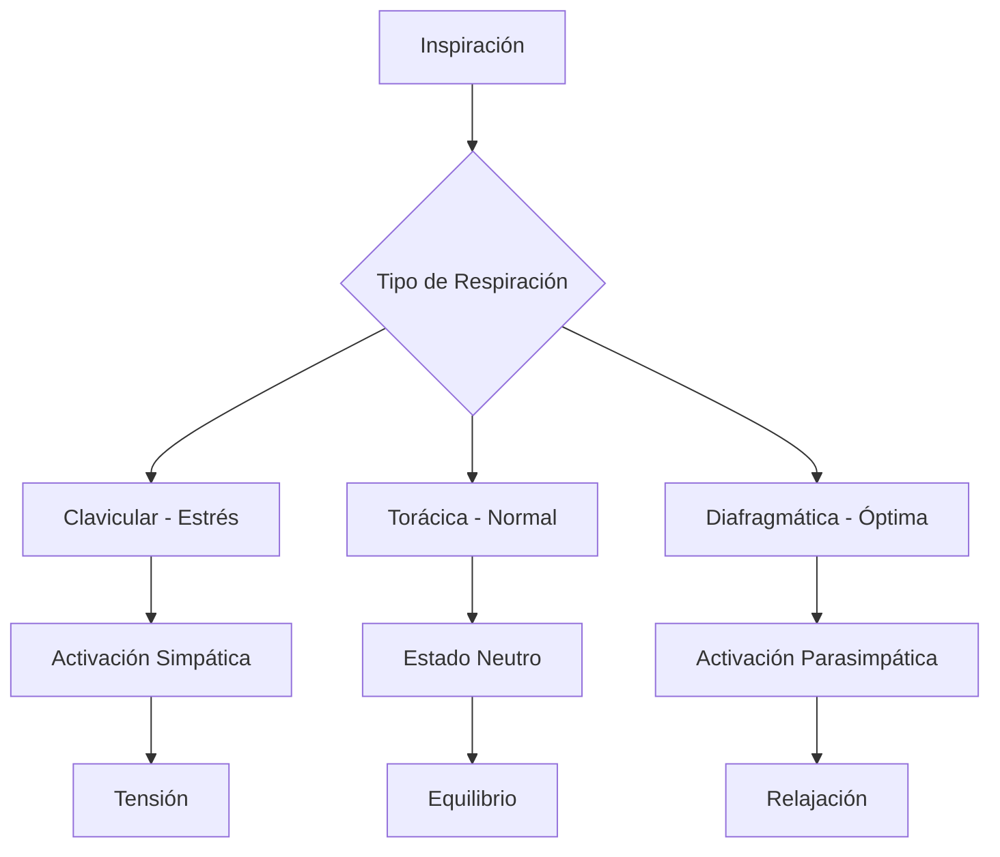
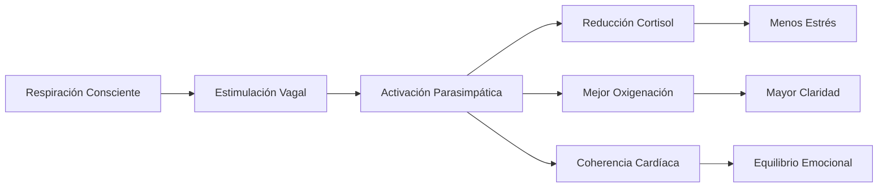

# 🌬️ Respiración Consciente

## 🎯 Fundamentos de la Respiración Consciente

> [!info] Definición La respiración consciente es la práctica deliberada de dirigir la atención hacia el proceso respiratorio, utilizándolo como herramienta para regular el sistema nervioso, las emociones y el estado mental.

> [!tip] Principios Básicos
> 
> - 🧠 **Conexión mente-cuerpo**: La respiración es el único proceso vital que puede ser tanto automático como consciente
> - ⚡ **Regulación del SNA**: Influye directamente en el sistema nervioso autónomo
> - 🎯 **Ancla de atención**: Sirve como punto focal para la meditación y mindfulness
> - 🔄 **Feedback inmediato**: Cambios perceptibles en tiempo real

## 🌊 Anatomía de la Respiración

### 📐 Tipos de Respiración

> [!info] Clasificación Anatómica
> 
> 1. **Respiración Clavicular** 🔺
> 
> - Superficial, usa solo la parte superior de los pulmones
>     
> - Asociada con estrés y ansiedad
>     
> 
> 2. **Respiración Torácica** 🔳
> 
> - Movimiento del pecho hacia adelante y atrás
>     
> - Respiración cotidiana normal
>     
> 
> 3. **Respiración Diafragmática** 🔵
> 
> - Expansión del abdomen, uso completo de los pulmones
> - Más eficiente y relajante

## 🛠️ Técnicas Específicas

### 🔢 Respiración 4-7-8 (Técnica de Weil)

> [!tip] Protocolo Paso a Paso
> 
> 1. **Inhalar** por la nariz durante **4 segundos**
> 2. **Retener** el aire durante **7 segundos**
> 3. **Exhalar** por la boca durante **8 segundos**
> 4. **Repetir** 4-8 ciclos
> 
> 💡 **Efecto**: Sedante natural, ideal para reducir ansiedad y conciliar el sueño

### 📦 Respiración de Caja (Box Breathing)

> [!info] Técnica Naval SEAL Patrón simétrico: **4-4-4-4**
> 
> - Inhalar: 4 segundos
> - Retener: 4 segundos
> - Exhalar: 4 segundos
> - Pausa: 4 segundos
> 
> 🎯 **Aplicación**: Concentración, rendimiento bajo presión, claridad mental

### 🌡️ Respiración de Fuego (Kapalabhati)

> [!warning] Técnica Energizante
> 
> - **Exhalaciones** fuertes y rápidas por la nariz
> - **Inhalaciones** pasivas y naturales
> - Ritmo: 1-2 exhalaciones por segundo
> - Duración: 30 segundos a 3 minutos
> 
> ⚠️ **Precaución**: No practicar con hipertensión o problemas cardíacos

### 🌊 Respiración Oceánica (Ujjayi)

> [!tip] Respiración Yóguica
> 
> - Respirar por la nariz con ligera constricción de la garganta
> - Crear un sonido suave similar al océano
> - Inhalación y exhalación de igual duración
> - Mantener durante toda la práctica de yoga o meditación

## ⏱️ Protocolos de Entrenamiento

### 📅 Programa Progresivo de 4 Semanas

> [!info] Desarrollo Gradual **Semana 1**: Consciencia básica (5-10 min/día)
> 
> - Observar la respiración natural
> - Identificar patrones automáticos
> 
> **Semana 2**: Respiración diafragmática (10-15 min/día)
> 
> - Práctica en posición supina
> - Mano en pecho y abdomen
> 
> **Semana 3**: Técnicas específicas (15-20 min/día)
> 
> - Introducir 4-7-8 y respiración de caja
> - Practicar en diferentes momentos del día
> 
> **Semana 4**: Integración avanzada (20+ min/día)
> 
> - Combinar técnicas según necesidades
> - Aplicar en situaciones reales

## 🧬 Efectos Fisiológicos

> [!info] Impacto Científicamente Comprobado
> 
> ### Sistema Nervioso
> 
> - 📉 Reduce actividad del sistema simpático en 40%
> - 📈 Aumenta tono vagal en 25%
> - 🧠 Mejora coherencia cardíaca
> 
> ### Bioquímica
> 
> - 🩸 Equilibra pH sanguíneo
> - 💨 Optimiza intercambio de O₂/CO₂
> - 🧬 Reduce cortisol hasta 23%
> 
> ### Neuroplasticidad
> 
> - 🧠 Fortalece corteza prefrontal
> - 🔄 Mejora conexiones interhemisféricas
> - 📈 Aumenta materia gris en áreas de atención

## 🎯 Aplicaciones Específicas

### 😰 Para Ansiedad

> [!tip] Protocolo Anti-Ansiedad
> 
> 1. **Técnica 4-7-8**: 4 ciclos
> 2. **Respiración diafragmática**: 5 minutos
> 3. **Visualización**: Respirar colores calmantes
> 4. **Frecuencia**: 3-4 veces al día

### 💤 Para Insomnio

> [!info] Rutina Nocturna
> 
> - **30 min antes de dormir**: Respiración 4-7-8
> - **En la cama**: Respiración de caja lenta (6-6-6-6)
> - **Si despiertas**: Contar respiraciones del 10 al 1

### 🏃‍♂️ Para Rendimiento

> [!tip] Optimización Deportiva
> 
> - **Pre-entreno**: Respiración de fuego (2-3 min)
> - **Durante**: Respiración rítmica sincronizada
> - **Post-entreno**: Respiración 4-7-8 para recuperación

## 🚧 Errores Comunes y Precauciones

> [!warning] Evitar Estos Errores
> 
> - 🚫 **Hiperventilación**: No forzar respiraciones demasiado profundas
> - 🚫 **Tensión muscular**: Mantener hombros y mandíbula relajados
> - 🚫 **Irregularidad**: La práctica esporádica reduce la efectividad
> - 🚫 **Expectativas altas**: Los beneficios se desarrollan gradualmente

> [!warning] Contraindicaciones
> 
> - Embarazo avanzado (consultar médico)
> - Problemas respiratorios severos
> - Trastornos de pánico (comenzar gradualmente)
> - Hipertensión severa (evitar retenciones largas)

## 📚 Referencias

> [!quote] [[Técnicas de Relajación]] La respiración consciente es la base fundamental de todas las técnicas de relajación efectivas

> [!quote] [[Gestión de la Energía Personal]] El control respiratorio es clave para la regulación energética y el manejo de los ritmos circadianos

> [!quote] [[Mindfulness]] La atención a la respiración es el ancla más utilizada en prácticas meditativas

> [!quote] [[Gestión del Estrés]] La respiración consciente es la herramienta más accesible y efectiva para la respuesta inmediata al estrés

---

#respiración #mindfulness #regulación-emocional #sistema-nervioso #bienestar #técnicas-corporales #meditación #pranayama #coherencia-cardíaca #autocuidado