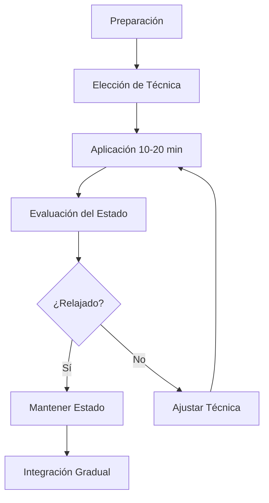

# 🧘‍♀️ Técnicas de Relajación

## 🎯 Fundamentos de la Relajación

> [!info] Definición La relajación es un estado de reducción de la tensión física y mental que permite al cuerpo y la mente restaurarse y recuperar energía. Es una respuesta opuesta al estrés que activa el sistema nervioso parasimpático.

> [!tip] Beneficios Comprobados
> 
> - 💤 Mejora la calidad del sueño
> - 🧠 Reduce la ansiedad y el estrés
> - ❤️ Disminuye la presión arterial
> - 🔋 Aumenta los niveles de energía
> - 🎯 Mejora la concentración y claridad mental

## 🛠️ Técnicas Principales

### 🌊 Relajación Muscular Progresiva (RMP)

> [!tip] Técnica de Jacobson Consiste en tensar y relajar grupos musculares específicos de forma secuencial:
> 
> 1. **Cara y cabeza**: Frente, ojos, mandíbula
> 2. **Cuello y hombros**: Músculos cervicales y trapecio
> 3. **Brazos**: Bíceps, tríceps, antebrazos, manos
> 4. **Torso**: Pecho, abdomen, espalda baja
> 5. **Piernas**: Muslos, pantorrillas, pies

### 🧘‍♂️ Técnicas de Visualización

> [!info] Visualización Guiada
> 
> - **Lugar seguro**: Imaginar un espacio de calma y seguridad
> - **Escenas naturales**: Playa, bosque, montaña
> - **Colores relajantes**: Azul, verde, violeta
> - **Elementos sensoriales**: Sonidos, texturas, aromas

### 🎵 Relajación con Sonido

> [!tip] Elementos Sonoros Efectivos
> 
> - **Sonidos naturales**: Océano, lluvia, viento
> - **Música instrumental**: Clásica, ambiental, new age
> - **Frecuencias específicas**: 432 Hz, 528 Hz
> - **Mantras y cantos**: Om, So Hum, Aham Brahmasmi

## ⏱️ Protocolos de Aplicación

### 📅 Rutina Diaria Sugerida

> [!warning] Constancia es Clave La efectividad de las técnicas de relajación aumenta significativamente con la práctica regular. Se recomienda:
> 
> - **Mañana** (5-10 min): Preparación para el día
> - **Mediodía** (3-5 min): Reset energético
> - **Noche** (15-20 min): Transición al descanso

## 🧬 Base Científica

> [!info] Investigación Actual Estudios neurocientíficos muestran que las técnicas de relajación:
> 
> - Activan el nervio vago
> - Reducen el cortisol en un 23-25%
> - Aumentan la producción de GABA
> - Mejoran la coherencia cardíaca

## 🚧 Precauciones y Contraindicaciones

> [!warning] Consideraciones Importantes
> 
> - Evitar durante episodios psicóticos agudos
> - Precaución en trastornos disociativos
> - Adaptar técnicas según limitaciones físicas
> - Consultar profesional en casos de trauma severo

## 📚 Referencias

> [!quote] [[Respiración Consciente]] La respiración es el puente entre la relajación muscular y la calma mental

> [!quote] [[Gestión de la Energía Personal]] Las técnicas de relajación son fundamentales para la conservación y renovación energética

> [!quote] [[Mindfulness]] La atención plena potencia los efectos de cualquier técnica de relajación

## 📖 Notas Recomendadas

- [[Higiene de Sueño]]
- [[Gestión del Estrés]]

---

#relajación #bienestar #salud-mental #técnicas-corporales #mindfulness #autocuidado #estrés #ansiedad