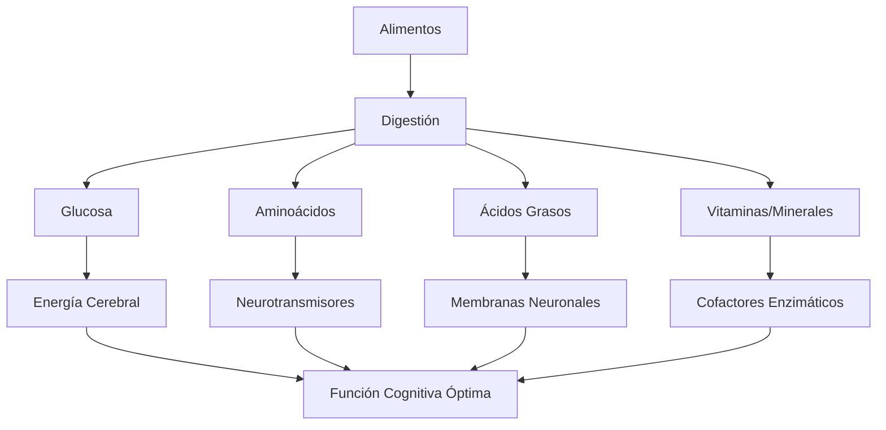

# 🧠 Nutrición para el Cerebro

> [!info] 🍎 Definición La nutrición cerebral se refiere al conjunto de alimentos, nutrientes y patrones alimenticios que optimizan las funciones cognitivas como la memoria, concentración, aprendizaje y rendimiento mental. El cerebro, siendo un órgano altamente metabólico, requiere nutrientes específicos para mantener su funcionamiento óptimo.

## ⚡ Fundamentos Metabólicos del Cerebro

> [!tip] 🔬 Datos Neurológicos Clave **Demanda Energética Cerebral:**
> 
> - Consume aproximadamente el **20% de la energía total** del cuerpo
> - Utiliza **120g de glucosa diarios** en promedio
> - Requiere **20% del oxígeno total** que respiramos
> - Contiene **60% de grasa** en su estructura
> - Procesa información a **268 mph** (velocidad de impulsos nerviosos)

## 🥗 Macronutrientes Esenciales

### 🍯 Carbohidratos: Combustible Cerebral

> [!info] ⚡ Glucosa como Energía Principal **Tipos Recomendados:**
> 
> - **Carbohidratos complejos**: Avena, quinoa, batata, arroz integral
> - **Frutas con bajo índice glucémico**: Arándanos, manzanas, peras
> - **Vegetales ricos en fibra**: Brócoli, espinacas, col rizada
> 
> **Beneficios Cognitivos:**
> 
> - **Energía sostenida** sin picos de glucosa
> - **Mejora la concentración** durante períodos prolongados
> - **Estabiliza el estado de ánimo** y reduce irritabilidad
> - **Optimiza la memoria de trabajo** y procesamiento de información

> [!warning] 🚫 Carbohidratos a Evitar
> 
> - Azúcares refinados que causan **picos y caídas energéticas**
> - Bebidas azucaradas que generan **fatiga mental**
> - Harinas procesadas que provocan **inflamación cerebral**

### 🥑 Grasas: Estructura y Función Neuronal

> [!tip] 🧈 Ácidos Grasos Omega-3 **Fuentes Principales:**
> 
> - **Pescados grasos**: Salmón, caballa, sardinas, atún
> - **Semillas**: Chía, linaza, nueces
> - **Aceites**: Oliva extra virgen, aguacate
> 
> **Funciones Cerebrales:**
> 
> - **Construcción de membranas** neuronales
> - **Reducción de inflamación** cerebral
> - **Mejora de la plasticidad** sináptica
> - **Protección contra deterioro** cognitivo

### 🥩 Proteínas: Neurotransmisores y Reparación

> [!info] 🔧 Aminoácidos Esenciales **Fuentes de Calidad:**
> 
> - **Proteínas completas**: Huevos, pescado, carne magra, legumbres + cereales
> - **Fuentes vegetales**: Quinoa, hemp, espirulina
> 
> **Neurotransmisores Clave:**
> 
> - **Triptófano** → Serotonina (bienestar, sueño)
> - **Tirosina** → Dopamina (motivación, enfoque)
> - **Glutamina** → GABA (relajación, ansiedad)

## 🌿 Micronutrientes y Vitaminas Neurológicas

### 🧪 Vitaminas del Complejo B

> [!tip] 🅱️ Cofactores Enzimáticos Esenciales **B1 (Tiamina)**
> 
> - **Función**: Metabolismo de glucosa cerebral
> - **Fuentes**: Semillas de girasol, cerdo magro, legumbres
> - **Déficit**: Confusión mental, irritabilidad
> 
> **B6 (Piridoxina)**
> 
> - **Función**: Síntesis de neurotransmisores
> - **Fuentes**: Plátano, pollo, salmón, garbanzos
> - **Déficit**: Depresión, problemas de memoria
> 
> **B12 (Cobalamina)**
> 
> - **Función**: Mantenimiento de mielina neuronal
> - **Fuentes**: Productos animales, algas, suplementos
> - **Déficit**: Deterioro cognitivo, fatiga mental
> 
> **Folato (B9)**
> 
> - **Función**: Síntesis de ADN y neurotransmisores
> - **Fuentes**: Vegetales de hoja verde, legumbres
> - **Déficit**: Problemas de concentración, depresión

### 🟡 Antioxidantes Neuroprotectores

> [!warning] 🛡️ Protección contra Radicales Libres **Vitamina E**
> 
> - **Función**: Protección de membranas neuronales
> - **Fuentes**: Almendras, semillas, aceites vegetales
> 
> **Vitamina C**
> 
> - **Función**: Síntesis de neurotransmisores, antioxidante
> - **Fuentes**: Cítricos, kiwi, pimientos, brócoli
> 
> **Flavonoides**
> 
> - **Función**: Mejora de la plasticidad cerebral
> - **Fuentes**: Arándanos, chocolate negro, té verde

## ⚗️ Minerales para la Función Cerebral

> [!info] 🧲 Elementos Traza Críticos **Hierro**
> 
> - **Función**: Transporte de oxígeno al cerebro
> - **Fuentes**: Carne roja magra, espinacas, legumbres
> - **Déficit**: Fatiga mental, dificultad de concentración
> 
> **Zinc**
> 
> - **Función**: Neurotransmisión y memoria
> - **Fuentes**: Ostras, carne, semillas de calabaza
> - **Déficit**: Problemas de aprendizaje, depresión
> 
> **Magnesio**
> 
> - **Función**: Relajación neuronal, sueño
> - **Fuentes**: Espinacas, almendras, chocolate negro
> - **Déficit**: Ansiedad, insomnio, irritabilidad
> 
> **Fósforo**
> 
> - **Función**: Estructura de membranas celulares
> - **Fuentes**: Pescado, huevos, lácteos, frutos secos

## 🍽️ Patrones Alimenticios Neuroprotectores

### 🏛️ Dieta Mediterránea

> [!tip] 🌊 Patrón Científicamente Validado **Componentes Principales:**
> 
> - **Aceite de oliva** como grasa principal
> - **Pescado** 2-3 veces por semana
> - **Frutas y vegetales** abundantes
> - **Frutos secos** y semillas diariamente
> - **Cereales integrales** como base energética
> - **Legumbres** 2-3 veces por semana
> 
> **Beneficios Cognitivos Comprobados:**
> 
> - **Reducción del 13%** en riesgo de deterioro cognitivo
> - **Mejora en memoria** y función ejecutiva
> - **Protección contra** Alzheimer y demencia
> - **Reducción de inflamación** cerebral

### 🧠 Dieta MIND (Mediterranean-DASH Intervention)

> [!info] 🎯 Específicamente Diseñada para el Cerebro **Alimentos Recomendados Diariamente:**
> 
> - **Vegetales de hoja verde** (1+ porción)
> - **Otros vegetales** (1+ porción)
> - **Frutos secos** (30g)
> - **Arándanos** (2+ porciones/semana)
> - **Frijoles** (3+ porciones/semana)
> - **Pescado** (1+ porción/semana)
> - **Aves** (2+ porciones/semana)

## ⏰ Cronobiología Nutricional

> [!warning] 🕐 Timing de Nutrientes para Optimización **Desayuno (7:00-9:00 AM)**
> 
> - **Proteínas** para síntesis de dopamina
> - **Carbohidratos complejos** para energía sostenida
> - **Grasas saludables** para saciedad
> - Ejemplo: Avena + nueces + arándanos + huevo
> 
> **Almuerzo (12:00-2:00 PM)**
> 
> - **Balance de macronutrientes** (40% carbs, 30% proteína, 30% grasa)
> - **Vegetales abundantes** para micronutrientes
> - Ejemplo: Salmón + quinoa + ensalada mixta + aguacate
> 
> **Cena (6:00-8:00 PM)**
> 
> - **Triptófano** para producción de serotonina
> - **Magnesio** para relajación
> - **Carbohidratos moderados** para sueño
> - Ejemplo: Pollo + batata + espinacas + almendras

## 💧 Hidratación y Función Cerebral

> [!tip] 💦 Agua como Nutriente Esencial **Requerimientos Hídricos:**
> 
> - **2-3 litros diarios** para adultos
> - **Aumento del 20%** durante estudio intensivo
> - **Electrolitos balanceados** (sodio, potasio, magnesio)
> 
> **Efectos de la Deshidratación:**
> 
> - **2% de pérdida** → Reducción del 20% en memoria
> - **Dolor de cabeza** y fatiga mental
> - **Disminución de concentración** y tiempo de reacción
> 
> **Optimización de Hidratación:**
> 
> - Agua con **limón y sal marina**
> - **Infusiones herbales** (té verde, menta)
> - **Agua de coco** para electrolitos naturales

## 🚫 Alimentos y Sustancias a Evitar

> [!warning] ⚠️ Neurotóxicos Alimentarios **Azúcares Refinados**
> 
> - Provocan **inflamación cerebral**
> - Generan **resistencia a la insulina** cerebral
> - Causan **fluctuaciones de humor** severas
> 
> **Grasas Trans**
> 
> - **Dañan membranas** neuronales
> - **Aumentan inflamación** sistémica
> - **Deterioran memoria** y aprendizaje
> 
> **Alcohol en Exceso**
> 
> - **Neurotóxico** en altas cantidades
> - **Interfiere con sueño** REM
> - **Depleta vitaminas** del complejo B
> 
> **Procesados Ultraprocesados**
> 
> - **Aditivos químicos** potencialmente tóxicos
> - **Déficit nutricional** por calidad pobre
> - **Alteración de microbiota** intestinal

## 🦠 Eje Intestino-Cerebro

> [!info] 🔗 Conexión Microbiota-Cognición **Microbioma Intestinal Saludable:**
> 
> - **Prebióticos**: Fibra fermentable, ajo, cebolla, plátano verde
> - **Probióticos**: Yogur, kéfir, kimchi, kombucha, chucrut
> - **Diversidad alimentaria**: 30+ alimentos diferentes por semana
> 
> **Impacto en Función Cerebral:**
> 
> - **Producción de neurotransmisores** (90% serotonina intestinal)
> - **Modulación de inflamación** cerebral
> - **Influencia en estado de ánimo** y ansiedad
> - **Mejora de memoria** y aprendizaje

## ⚡ Suplementación Estratégica

> [!tip] 💊 Complementos Basados en Evidencia **Suplementos de Primera Línea:**
> 
> - **Omega-3 (EPA/DHA)**: 1-2g diarios
> - **Vitamina D3**: 1000-4000 UI (según deficiencia)
> - **Complejo B**: Especialmente B12 en vegetarianos
> - **Magnesio**: 200-400mg antes de dormir
> 
> **Nootrópicos Naturales:**
> 
> - **Lion's Mane**: Regeneración neuronal
> - **Bacopa Monnieri**: Memoria y aprendizaje
> - **Ginkgo Biloba**: Circulación cerebral
> - **Rhodiola Rosea**: Adaptógeno para estrés

> [!warning] ⚠️ Precauciones con Suplementos
> 
> - **Consultar médico** antes de iniciar suplementación
> - **Calidad certificada** (terceros laboratorios)
> - **Interacciones medicamentosas** posibles
> - **Dosis terapéuticas** vs. megadosis peligrosas

## 🔗 Referencias

> [!quote] 📚 Notas Relacionadas
> 
> - [[Hábitos y Rutinas Saludables]] - Integración de hábitos nutricionales
> - [[Gestión del Estrés]] - Nutrición para manejo del estrés
> - [[Higiene de Sueño]] - Alimentación y calidad del sueño
> - [[Técnicas de Concentración]] - Nutrientes para enfoque mental
> - [[Deep Work]] - Alimentación para trabajo profundo

## 📖 Notas Recomendadas

> [!info] 🔍 Para Profundizar
> 
> - [[Análisis de Tiempo]] - Planificación de comidas para estudio
> - [[Hábitos de Estudio]] - Integración de nutrición en rutinas académicas
> - [[Motivación Académica]] - Impacto nutricional en motivación
> - [[Productividad en la Vida Real]] - Alimentación para rendimiento sostenido
> - [[Mindfulness]] - Alimentación consciente y presente
> - Carpeta Diseño de Espacios - Organización de cocina para nutrición cerebral

---

#nutrición-cerebral #alimentación-cognitiva #neurotransmisores #micronutrientes #hidratación #suplementación #microbiota #bienestar #rendimiento-cognitivo #salud-cerebral