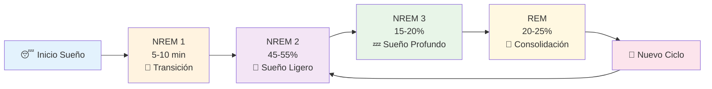
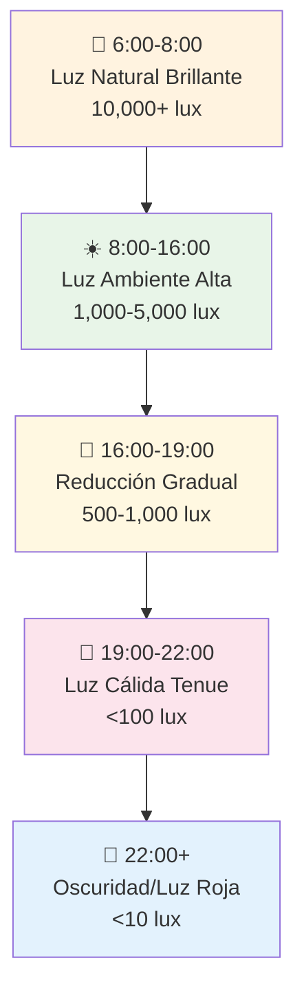
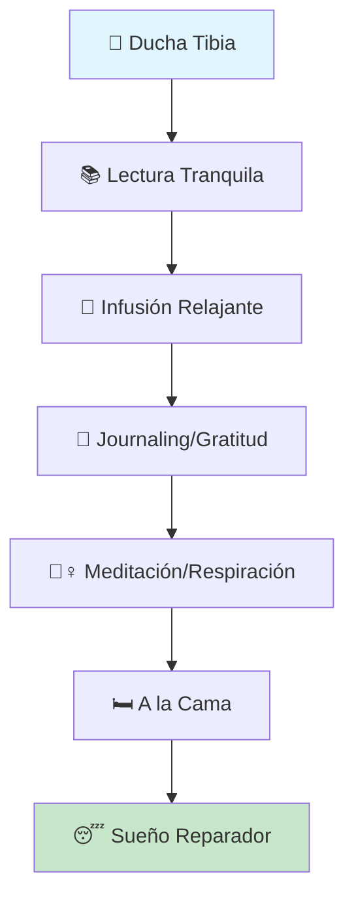

# 😴 Higiene del Sueño - Descanso Reparador

## 🌙 Definición

> [!info] ¿Qué es la Higiene del Sueño? La higiene del sueño es el conjunto de prácticas, hábitos y condiciones ambientales que promueven un sueño regular, reparador y de calidad. Es fundamental para la consolidación de la memoria, el rendimiento cognitivo y el bienestar general.

## 🧠 Neurofisiología del Sueño

> [!tip] El Ciclo del Sueño El sueño ocurre en ciclos de 90-120 minutos, compuestos por diferentes fases:
> 
> - **NREM 1**: Transición vigilia-sueño (5%)
> - **NREM 2**: Sueño ligero (45%)
> - **NREM 3**: Sueño profundo - crucial para restauración física (25%)
> - **REM**: Sueño de ensueño - esencial para memoria y aprendizaje (25%)

## ⏰ Cronobiología y Ritmos Circadianos

### 🌅 El Reloj Biológico

> [!info] Reguladores Naturales
> 
> - **Núcleo Supraquiasmático**: "Reloj maestro" en el hipotálamo
> - **Melatonina**: Hormona del sueño, liberada cuando oscurece
> - **Cortisol**: Hormona del despertar, pico matutino natural
> - **Temperatura Corporal**: Desciende 1-2°C durante la noche

### 📊 Cronotipos Personales

> [!tip] Identifica tu Cronotipo
> 
> - **🐓 Alondra (25%)**: Despertar temprano, rendimiento matutino máximo
> - **🦉 Búho (25%)**: Acostarse tarde, rendimiento vespertino óptimo
> - **🕊️ Mixto (50%)**: Flexibilidad en horarios, adaptación moderada
> - **Tip**: Respeta tu cronotipo natural cuando sea posible

## 🛏️ Optimización del Entorno de Sueño

### 🌡️ Condiciones Ambientales Ideales

> [!warning] Parámetros Críticos
> 
> - **Temperatura**: 16-19°C (60-67°F) - zona termoneutral
> - **Humedad**: 30-50% - evita sequedad excesiva
> - **Ruido**: <30 dB - usa tapones o ruido blanco si necesario
> - **Oscuridad**: Completa - cortinas blackout, máscara ocular

> [!tip] Herramientas Recomendadas
> 
> - **Termostato programable**: Reducción automática nocturna
> - **Humidificador**: Especialmente en climas secos
> - **Máquina de ruido blanco**: Apps como Noisli, Sleep Sounds
> - **Cortinas blackout**: Inversión en descanso de calidad

### 🛏️ Configuración de la Cama

> [!info] Elementos Clave
> 
> - **Colchón**: Reemplazar cada 7-10 años, firmeza según preferencia
> - **Almohadas**: Altura apropiada para alineación cervical
> - **Ropa de cama**: Materiales transpirables (algodón, bambú)
> - **Reserva la cama**: Solo para sueño e intimidad

## 📱 Impacto de la Luz y Pantallas

### 💡 Gestión de la Exposición Lumínica

> [!warning] Luz Azul y Sueño La luz azul (380-500nm) suprime la melatonina hasta 3 horas después de la exposición. Las pantallas emiten significativas cantidades de esta luz.

> [!tip] Estrategias de Mitigación
> 
> - **Regla 3-2-1**: 3h sin comida, 2h sin trabajo, 1h sin pantallas
> - **Filtros de luz azul**: f.lux, Night Shift, gafas especializadas
> - **Luz roja nocturna**: Bombillas rojas o linternas para baño nocturno
> - **Exposición matutina**: 15-30 min de luz natural al despertar

### 📊 Protocolo de Luz Circadiana

## 🍽️ Nutrición y Sueño

### ⏰ Timing de Comidas

> [!warning] Reglas Alimentarias Nocturnas
> 
> - **Cena completa**: Mínimo 3 horas antes de dormir
> - **Snacks ligeros**: Permitidos 1-2 horas antes si necesario
> - **Evitar**: Comidas pesadas, grasosas o muy condimentadas
> - **Hidratación**: Reducir líquidos 2 horas antes para evitar interrupciones

### 🍯 Alimentos que Favorecen el Sueño

> [!tip] Nutrientes Pro-Sueño
> 
> - **Triptófano**: Pavo, leche, plátanos, nueces
> - **Magnesio**: Almendras, espinacas, semillas de calabaza
> - **Melatonina natural**: Cerezas ácidas, nueces, avena
> - **Carbohidratos complejos**: Avena, quinoa, batata

> [!info] Infusiones Relajantes
> 
> - **Manzanilla**: Apigenina - efecto sedante suave
> - **Valeriana**: Ácido valerénico - reducción ansiedad
> - **Pasiflora**: Flavonoides - relajación muscular
> - **Melisa**: Ácido rosmarínico - calma mental

### ☕ Sustancias a Evitar

> [!warning] Interferencias del Sueño
> 
> - **Cafeína**: Vida media 6-8h - último consumo antes de 14:00
> - **Alcohol**: Fragmenta sueño REM - límite 2 copas, 3h antes
> - **Nicotina**: Estimulante - evitar completamente 4h antes
> - **Medicamentos**: Revisar con médico efectos secundarios

## 🏃‍♀️ Ejercicio y Actividad Física

### ⏰ Timing del Ejercicio

> [!tip] Horarios Óptimos para Ejercitarse
> 
> - **Mañana (6-9am)**: Mejora alertness diurna, sincroniza ritmo circadiano
> - **Tarde (14-17h)**: Rendimiento físico máximo, temperatura corporal elevada
> - **Evitar 3-4h antes**: Ejercicio intenso eleva temperatura y cortisol

> [!info] Beneficios del Ejercicio Regular
> 
> - **Latencia del sueño**: Reducción tiempo para dormirse (13 min promedio)
> - **Eficiencia**: Mayor porcentaje de tiempo dormido en cama
> - **Sueño profundo**: Incremento fases NREM 3 reparadoras
> - **Calidad subjetiva**: Sensación de descanso renovado

## 🧘‍♀️ Rutina Pre-Sueño

### 🌅 Ritual de Desconexión (90 minutos antes)

> [!tip] Secuencia de Relajación Progresiva **60-90 min antes:**
> 
> - Finalizar trabajo/estudio
> - Preparar ropa del día siguiente
> - Revisar agenda del mañana
> 
> **30-60 min antes:**
> 
> - Ducha tibia (reduce temperatura corporal)
> - Actividades tranquilas: lectura, meditación, journaling
> - Infusión relajante
> 
> **0-30 min antes:**
> 
> - Técnicas de respiración
> - Relajación muscular progresiva
> - Gratitud/reflexión del día

### 🧠 Técnicas de Relajación Mental

> [!info] Métodos Efectivos
> 
> - **4-7-8 Breathing**: Inhala 4, mantén 7, exhala 8 segundos
> - **Body Scan**: Consciencia corporal progresiva pies-cabeza
> - **Visualización**: Imágenes mentales peaceful, lugar seguro
> - **Mindfulness**: Observación sin juicio de pensamientos

## 📊 Monitoreo y Tracking

### 📱 Herramientas de Seguimiento

> [!tip] Apps y Dispositivos Recomendados
> 
> - **Sleep Cycle**: Análisis fases sueño via micrófono
> - **Fitbit/Apple Watch**: Tracking automático, métricas detalladas
> - **Oura Ring**: Precisión alta, variabilidad ritmo cardíaco
> - **Sleep Journal**: Registro manual patrones y factores

### 📈 Métricas Clave a Monitorear

> [!info] Indicadores de Calidad
> 
> - **Latencia**: Tiempo para dormirse (<15 min ideal)
> - **Eficiencia**: % tiempo dormido en cama (>85% bueno)
> - **Despertares**: Frecuencia interrupciones nocturnas (<2)
> - **Duración total**: 7-9 horas para adultos
> - **Consistencia**: Variación <30 min en horarios

## ⚠️ Trastornos Comunes y Soluciones

### 😵 Insomnio de Inicio

> [!warning] Dificultad para Dormirse **Causas comunes:**
> 
> - Ansiedad anticipatoria
> - Mente hiperactivata
> - Horarios irregulares
> 
> **Soluciones:**
> 
> - Técnica paradójica: "trata de mantenerte despierto"
> - Cognitive Shuffling: pensamientos aleatorios
> - Levantarse después 20 min - actividad tranquila

### 🌅 Despertar Temprano

> [!warning] Insomnio de Mantenimiento **Causas potenciales:**
> 
> - Depresión/ansiedad
> - Alcohol/medicamentos
> - Apnea del sueño
> 
> **Estrategias:**
> 
> - Evitar mirar reloj
> - Técnicas de relajación
> - Consulta médica si persiste >2 semanas

### 😪 Somnolencia Diurna Excesiva

> [!warning] Señales de Alarma Si experimentas somnolencia severa diurna, considera:
> 
> - **Apnea del sueño**: Ronquidos, pausas respiratorias
> - **Narcolepsia**: Episodios súbitos de sueño
> - **Síndrome piernas inquietas**: Sensaciones incómodas nocturnas
> - **Consulta médica**: Evaluación especializada necesaria

## 🎯 Plan de Implementación

### Semana 1: Fundamentos Ambientales

> [!tip] Optimización Básica
> 
> - [ ] Medir y ajustar temperatura habitación
> - [ ] Instalar cortinas blackout o máscara ocular
> - [ ] Establecer horario fijo de sueño (incluye fines de semana)
> - [ ] Eliminar dispositivos electrónicos del dormitorio

### Semana 2: Rutina Pre-Sueño

> [!tip] Ritual Nocturno
> 
> - [ ] Diseñar rutina 90 minutos pre-sueño
> - [ ] Implementar regla 3-2-1
> - [ ] Practicar técnica respiración 4-7-8
> - [ ] Probar infusión relajante nocturna

### Semana 3: Optimización Diurna

> [!tip] Exposición Lumínica
> 
> - [ ] 15-30 min luz natural matutina
> - [ ] Instalar f.lux o filtros luz azul
> - [ ] Ejercicio regular (no 4h antes sueño)
> - [ ] Último café antes 14:00

### Semana 4: Monitoreo y Ajustes

> [!tip] Seguimiento y Refinamiento
> 
> - [ ] Iniciar sleep tracking (app o dispositivo)
> - [ ] Diario de sueño manual
> - [ ] Identificar patrones problemáticos
> - [ ] Ajustar rutina según datos

## 📊 Calculadora de Horarios Ideales

> [!info] Herramienta Práctica **Si necesitas despertar a las 7:00 AM:**
> 
> - Hora ideal acostarse: 22:30 (5 ciclos completos)
> - Alternativa: 24:00 (4 ciclos completos)
> - Iniciar rutina pre-sueño: 21:00 o 22:30
> 
> **Fórmula**: Hora despertar - (ciclos × 1.5h) - 15 min = hora acostarse

---

## 📎 Referencias

> [!quote] Enlaces a Otras Notas
> 
> - [[Gestión del Estrés]] - Reducción ansiedad para mejor sueño
> - [[Hábitos y Rutinas Saludables]] - Integración en estilo de vida
> - [[Mindfulness]] - Técnicas meditación pre-sueño
> - [[Neurociencia del Aprendizaje]] - Consolidación memoria durante sueño
> - [[Nutrición para el cerebro]] - Alimentos que favorecen descanso
> - [[Ejercicio y Cognición]] - Timing óptimo actividad física

## 📚 Notas Recomendadas

> [!info] Lecturas Complementarias
> 
> - [[Técnicas de Relajación]] - Métodos avanzados desactivación
> - [[Gestión de la Energía Personal]] - Ritmos naturales y recuperación

---

_Tags: #sueño #higiene-del-sueño #descanso #ritmos-circadianos #melatonina #cronobiología #recuperación #bienestar #salud #rutinas-nocturnas #optimización-ambiental #calidad-de-vida_