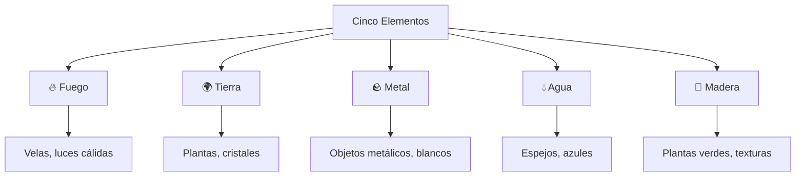
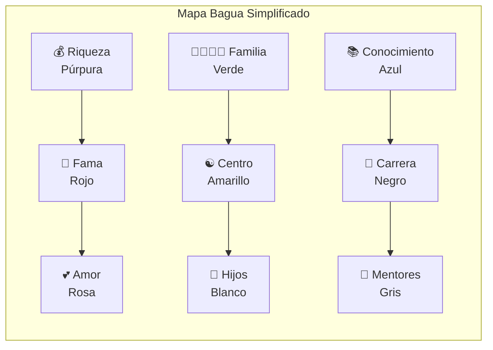
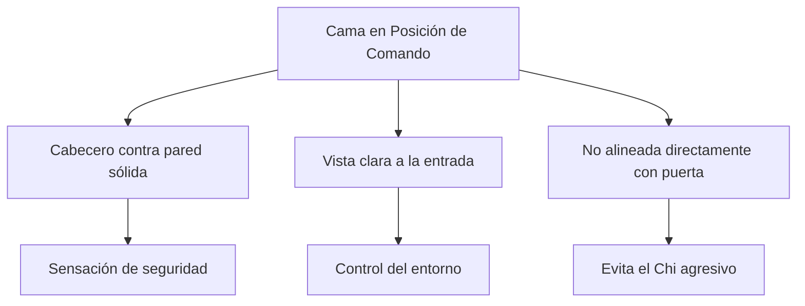
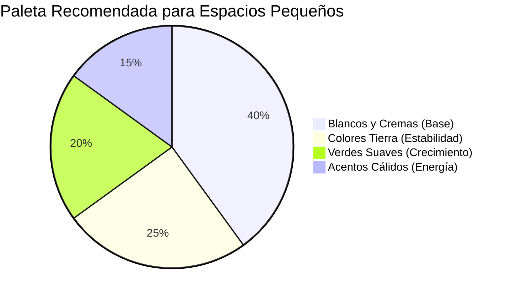

# 🏠 Feng Shui para Espacios Pequeños

> [!tip] 🌟 Concepto Clave El Feng Shui en espacios pequeños se enfoca en maximizar el flujo de energía positiva (Chi) a través de la optimización inteligente del espacio, creando armonía y bienestar sin importar las limitaciones de tamaño.

## 🎯 Fundamentos del Feng Shui en Espacios Reducidos

> [!info] 📚 Filosofía Base El Feng Shui, que literalmente significa "viento y agua", es el arte milenario chino de armonizar el entorno para potenciar el bienestar, la prosperidad y la salud. En espacios pequeños, cada elemento cuenta y debe ser cuidadosamente considerado.

### Los Cinco Elementos en Espacios Pequeños

> [!warning] ⚠️ Errores Comunes en Espacios Pequeños
> 
> - **Sobrecarga visual:** Demasiados elementos decorativos
> - **Bloqueo del Chi:** Muebles que obstruyen el paso
> - **Espejos mal ubicados:** Reflejando puertas o camas directamente
> - **Desorden acumulado:** Objetos sin propósito específico

## 🗺️ El Mapa Bagua Adaptado

### Bagua para Espacios Compactos

> [!tip] 🧭 Aplicación Práctica En espacios pequeños, el mapa Bagua se adapta proporcionalmente. Puedes aplicarlo a una habitación completa o incluso a un escritorio siguiendo la misma lógica de orientación.

## 🏡 Estrategias por Áreas

### Entrada y Recibidor

> [!tip] 🚪 Primera Impresión La entrada es crucial pues determina cómo entra el Chi a tu hogar. En espacios pequeños, mantén esta área despejada y bien iluminada.

**Elementos clave:**

- Espejo a un lado (nunca frente a la puerta)
- Planta pequeña para vitalizar la energía
- Iluminación cálida y suficiente
- Zapatos organizados en mueble cerrado

### Dormitorio Compacto

> [!info] 🛏️ Descanso Reparador En dormitorios pequeños, la ubicación de la cama es fundamental. Debe tener vista a la puerta sin estar directamente alineada con ella (posición de comando).

### Sala de Estar/Comedor

> [!tip] 🛋️ Espacio Social En espacios pequeños que combinan sala y comedor, crea separaciones visuales sutiles manteniendo el flujo de energía.

**Técnicas de optimización:**

- Muebles multifuncionales con almacenamiento
- Colores claros para ampliar visualmente
- Espejos estratégicos para crear profundidad
- Plantas para purificar y vitalizar

### Cocina Pequeña

> [!warning] 🍳 Centro Energético La cocina representa la nutrición y prosperidad. En espacios reducidos, mantén una relación armoniosa entre los elementos fuego (estufa) y agua (fregadero).

## 🎨 Técnicas de Ampliación Visual

### Uso Estratégico de Espejos

> [!info] 🪞 Multiplicadores de Espacio Los espejos son herramientas poderosas en espacios pequeños, pero deben usarse conscientemente según los principios del Feng Shui.

**Ubicaciones ideales:**

- Reflejando vistas naturales
- Multiplicando la luz natural
- En comedores (multiplican la abundancia)

**Evitar:**

- Frente a la cama
- Reflejando puertas principales
- En baños frente al inodoro

### Paleta de Colores Feng Shui

> [!tip] 🎨 Colores Estratégicos Los colores influyen directamente en la energía del espacio y la percepción del tamaño.

## 🌱 Plantas y Elementos Naturales

### Plantas Feng Shui para Espacios Reducidos

> [!tip] 🪴 Vida y Vitalidad Las plantas aportan el elemento madera y purifican el ambiente. En espacios pequeños, elige especies que no dominen visualmente el área.

**Plantas recomendadas:**

- **Pothos:** Fácil cuidado, purifica el aire
- **Sansevieria:** Tolera poca luz, elegante
- **Bambú de la suerte:** Atrae prosperidad
- **Jade:** Símbolo de abundancia

### Elementos Agua en Miniatura

> [!info] 💧 Fluidez y Prosperidad El elemento agua puede incorporarse sutilmente sin ocupar mucho espacio físico.

**Opciones compactas:**

- Pequeña fuente de mesa
- Cuenco con agua y piedras
- Imágenes de paisajes acuáticos
- Colores azules en textiles

## 🧹 Organización y Desorden

### Conexión con Productividad Personal

> [!tip] 🔗 Sinergia con Otros Sistemas El Feng Shui se complementa perfectamente con la [[Organización Física del Espacio]] y técnicas del [[Minimalismo Digital]], creando un entorno que potencia tanto el bienestar como la [[Automatizaciones Personales]].

### Técnica de los 27 Objetos

> [!info] 📦 Liberación Energética Cada día durante 9 días, elimina 3 objetos que ya no necesites. Esta práctica libera energía estancada y crea espacio para nuevas oportunidades.

```mermaid
gantt
    title Desafío de Liberación Energética (9 días)
    dateFormat X
    axisFormat Día %d
    
    section Semana 1
    3 objetos día 1    :1, 2
    3 objetos día 2    :2, 3
    3 objetos día 3    :3, 4
    
    section Semana 2
    3 objetos día 4    :4, 5
    3 objetos día 5    :5, 6
    3 objetos día 6    :6, 7
    
    section Semana 3
    3 objetos día 7    :7, 8
    3 objetos día 8    :8, 9
    3 objetos día 9    :9, 10
```

## 🎯 Espacios de Trabajo y Estudio

### Escritorio Feng Shui

> [!tip] 💻 Productividad Consciente La disposición del escritorio según Feng Shui potencia la concentración y creatividad, complementando técnicas como [[Deep Work]] y métodos de estudio eficientes.

**Elementos esenciales:**

- Posición de comando (espalda a pared, vista a entrada)
- Lámpara en esquina superior izquierda (área de riqueza)
- Planta pequeña para el elemento madera
- Cristal o piedra para el elemento tierra

### Integración con Métodos de Estudio

> [!info] 📚 Ambiente Propicio Un espacio armonizado según Feng Shui mejora la efectividad de técnicas como:

- [[Método 1 - Pomodoro]]: Ambiente sin distracciones
- [[Método 5 - Mapas Mentales]]: Espacio visual ordenado
- [[Técnicas de Concentración]]: Energía equilibrada

## 🧘‍♀️ Espacios de Relajación

### Rincón de Meditación

> [!tip] 🕯️ Refugio Interior Incluso en espacios muy pequeños, puedes crear un área dedicada al [[Mindfulness]] y la relajación que complemente tu [[Gestión del Estrés]].

**Elementos mínimos:**

- Cojín de meditación o mat de yoga
- Vela o incienso para el elemento fuego
- Objeto natural (piedra, concha, cristal)
- Imagen inspiradora o mandala

## 🌙 Feng Shui Nocturno

### Optimización del Descanso

> [!warning] 🌃 Calidad del Sueño El Feng Shui nocturno es crucial para un descanso reparador que apoye tus [[Hábitos y Rutinas Saludables]].

**Principios nocturnos:**

- Eliminar dispositivos electrónicos 1 hora antes de dormir ([[Detox Digital]])
- Cortinas que bloqueen completamente la luz
- Temperatura fresca y ventilación adecuada
- Aromas relajantes (lavanda, manzanilla)

## 📱 Tecnología y Feng Shui

### Armonía Digital

> [!info] ⚡ Energía Electromagnética La tecnología moderna requiere consideraciones especiales en el Feng Shui contemporáneo, conectando con principios de [[Productividad Digital]].

**Pautas tecnológicas:**

- Router wifi alejado de áreas de descanso
- Cables organizados y ocultos
- Pantallas con filtros de luz azul
- Espacios de "desconexión digital"

## 📚 Referencias

> [!quote] 📖 Enlaces Relacionados
> 
> - [[Organización Física del Espacio]] - Fundamentos de orden espacial
> - [[Minimalismo Digital]] - Reducir el desorden tecnológico
> - [[Gestión del Estrés]] - Crear ambientes relajantes
> - [[Mindfulness]] - Práctica de atención consciente al espacio
> - [[Hábitos y Rutinas Saludables]] - Integrar Feng Shui en la vida diaria

## 📝 Notas Recomendadas

> [!info] 🔗 Para Profundizar
> 
> - **[[Deep Work]]** - Crear espacios de concentración profunda
> - **[[Hábitos de Estudio]]** - Ambiente propicio para el aprendizaje
> - **[[Técnicas de Concentración]]** - Reducir distracciones ambientales
> - **[[Motivación Académica]]** - Espacios que inspiren y motiven
> - **[[Neurociencia del Aprendizaje]]** - Cómo el entorno afecta el cerebro
> - **[[Metacognición]]** - Consciencia del efecto del espacio en el pensamiento

---

**Tags:** #feng-shui #espacios-pequeños #organizacion #bienestar #diseño-interior #energia-positiva #minimalismo #productividad #meditacion #equilibrio #armonia-espacial