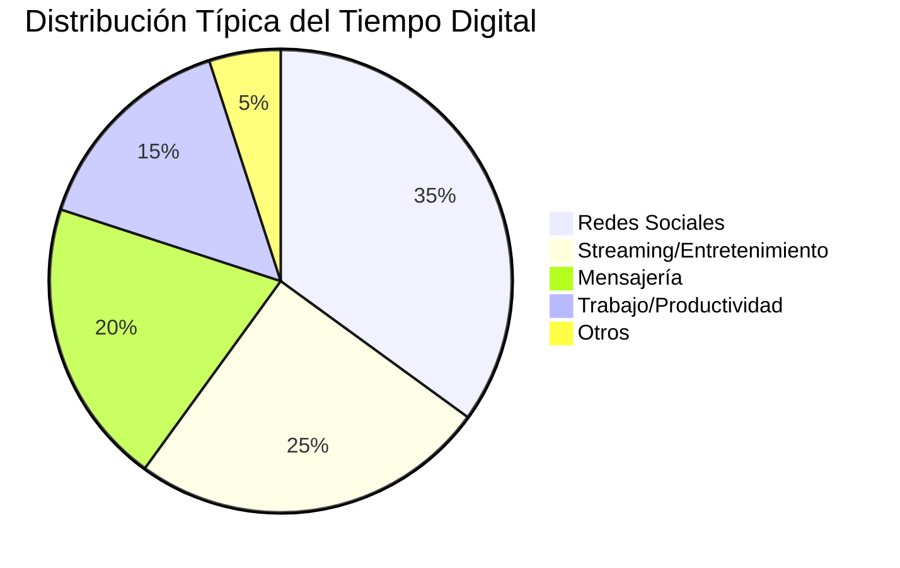
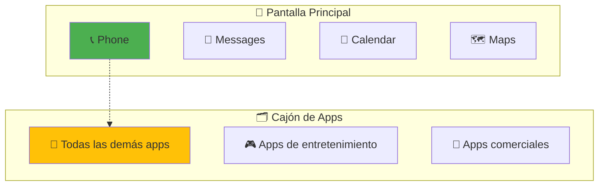
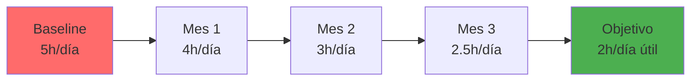

# 📱 Minimalismo Digital

> [!info] 🎯 Definición El minimalismo digital es una filosofía que busca maximizar el valor y la intención en el uso de la tecnología, eliminando las herramientas digitales que no aportan beneficios significativos a nuestros objetivos y valores fundamentales.

## 🧠 Fundamentos Filosóficos

> [!tip] 💡 Principios Centrales **1. Principio de Valor**: Solo usar tecnología que sirva algo que valoras profundamente **2. Principio de Optimización**: Determinar la mejor forma de usar la tecnología para apoyar tus valores **3. Principio de Intencionalidad**: Ser consciente y deliberado sobre cuándo y cómo usas la tecnología

> [!warning] ⚠️ El Costo Oculto de la Hiperconexión
> 
> - **Fragmentación de la atención**: Cambio constante entre aplicaciones
> - **Dopamina artificial**: Adicción a las notificaciones y "likes"
> - **FOMO** (Fear of Missing Out): Ansiedad por estar desconectado
> - **Comparación social**: Efectos negativos en autoestima y bienestar

## 🔄 Proceso de Implementación

### Fase 1: Auditoría Digital 📊

> [!info] 🔍 Análisis del Estado Actual **Screen Time Audit (30 días):**
> 
> - Tiempo total en dispositivos
> - Apps más utilizadas
> - Frecuencia de revisión del teléfono
> - Patrones de uso por horas del día
> 
> **Herramientas de medición:**
> 
> - iOS: Screen Time
> - Android: Digital Wellbeing
> - Ordenador: RescueTime, ManicTime

### Fase 2: Decluttering Digital 🧹

> [!tip] 🗂️ Reorganización por Categorías
> 
> **📱 APLICACIONES:**
> 
> - **Mantener**: Apps que aportan valor claro y medible
> - **Optimizar**: Apps útiles pero con configuración mejorable
> - **Eliminar**: Apps que generan distracción sin beneficio
> 
> **📧 EMAIL:**
> 
> - Unsubscribe masivo de newsletters innecesarias
> - Filtros automáticos para categorización
> - Horarios específicos para revisar email
> 
> **☁️ ALMACENAMIENTO:**
> 
> - Eliminar archivos duplicados o obsoletos
> - Organizar en estructura de carpetas lógica
> - Backup de archivos importantes

### Fase 3: Configuración Minimalista ⚙️

> [!warning] 🔕 Gestión de Notificaciones **Regla de las Notificaciones Esenciales:**
> 
> - Solo personas (llamadas/mensajes urgentes)
> - Solo eventos críticos del trabajo
> - Solo recordatorios que TÚ programaste
> 
> **Deshabilitar:**
> 
> - Notificaciones de redes sociales
> - Actualizaciones de apps no críticas
> - Newsletters y promociones
> - Notificaciones grupales no esenciales

## 🏠 Creación de Espacios Digitales Intentionales

### 📱 Smartphone Minimalista

> [!tip] 🎨 Configuración de Pantalla Principal **Launcher Simple:**
> 
> - Solo apps esenciales en pantalla principal
> - Todas las demás en cajón de aplicaciones
> - Fondo de pantalla neutro (sin distracciones)
> - Widgets solo para información crítica (clima, calendario)

### 💻 Ordenador Minimalista

> [!info] 🖥️ Ambiente de Trabajo Limpio **Desktop Clean:**
> 
> - Escritorio vacío (solo papelera)
> - Dock/barra de tareas solo con apps esenciales
> - Organización por espacios de trabajo virtuales
> 
> **Browser Setup:**
> 
> - Bloqueadores de anuncios (uBlock Origin)
> - Extensiones solo esenciales
> - Bookmarks organizados y curados
> - Modo oscuro para reducir fatiga visual

## 🧘 Prácticas y Rutinas

### ⏰ Horarios Digitales Estructurados

> [!tip] 📅 Time Boxing Digital **Bloques de Uso Consciente:**
> 
> - **08:00-09:00**: Revisión de noticias y email
> - **12:00-12:30**: Pausa social media (si es necesario)
> - **18:00-19:00**: Comunicación personal
> - **20:00-22:00**: Entretenimiento digital consciente

### 🌙 Digital Sunset

> [!warning] 🌅 Rutina de Desconexión **2 horas antes de dormir:**
> 
> - Modo "No molestar" activado
> - Filtro de luz azul al máximo
> - Apps de relajación en lugar de entretenimiento
> - Carga de dispositivos fuera del dormitorio

## 🎯 Beneficios Medibles

> [!info] 📈 Mejoras Esperadas **Productividad:**
> 
> - Aumento del 40% en tiempo de trabajo profundo
> - Reducción del 60% en cambios de contexto
> - Mejora en calidad de las tareas completadas
> 
> **Bienestar:**
> 
> - Reducción del estrés y ansiedad
> - Mejor calidad del sueño
> - Más tiempo para relaciones y hobbies
> - Mejora en la capacidad de concentración

## 🛠️ Herramientas y Apps Recomendadas

### 📱 Para Implementar Minimalismo

> [!tip] 🔧 Stack Tecnológico Minimalista **Control de Uso:**
> 
> - **Freedom**: Bloqueo de sitios web y apps
> - **Cold Turkey**: Control parental para adultos
> - **Forest**: Gamificación de la concentración
> 
> **Launchers Minimalistas:**
> 
> - **Niagara Launcher** (Android)
> - **Before Launcher** (Android)
> - **Configuración nativa simplificada** (iOS)
> 
> **Alternativas Minimalistas:**
> 
> - Email: **Spark**, **Hey**
> - Notas: **Obsidian**, **Notion**
> - Mapas: **Maps.me** offline
> - Música: **Spotify** (sin exploración social)

### 🌐 Navegación Consciente

> [!info] 🔍 Extensiones de Browser
> 
> - **uBlock Origin**: Bloqueo de anuncios
> - **StayFocusd**: Límite de tiempo en sitios
> - **Mercury Reader**: Lectura sin distracciones
> - **Dark Reader**: Modo oscuro universal

## 📊 Métricas de Progreso

> [!tip] 📏 KPIs del Minimalismo Digital
> 
> - **Tiempo de pantalla diario**: Reducción gradual mes a mes
> - **Frecuencia de revisión**: Número de veces que revisas el teléfono
> - **Apps instaladas**: Mantener menos de 30 apps útiles
> - **Notificaciones diarias**: Menos de 10 notificaciones importantes
> - **Tiempo en deep work**: Aumento en bloques de concentración

## 🚫 Desafíos Comunes y Soluciones

> [!warning] ⚡ Obstáculos Frecuentes **FOMO (Fear of Missing Out):**
> 
> - **Solución**: Crea resúmenes semanales de noticias importantes
> - **Mindset**: "Lo importante llegará a mí"
> 
> **Presión Social:**
> 
> - **Solución**: Comunica tus límites digitales a amigos/familia
> - **Alternativa**: Propón actividades presenciales
> 
> **Aburrimiento:**
> 
> - **Solución**: Lista de actividades offline preparada
> - **Herramientas**: Libros, instrumentos, ejercicio, cocina

## 🎨 Estilos de Minimalismo Digital

> [!info] 🎭 Enfoques Diferentes **🏔️ Minimalista Extremo:**
> 
> - Teléfono básico o smartphone con funciones limitadas
> - Sin redes sociales
> - Email una vez al día
> 
> **⚖️ Minimalista Balanceado:**
> 
> - Smartphone con apps curadas
> - Redes sociales con límites estrictos
> - Tecnología como herramienta, no entretenimiento
> 
> **🏢 Minimalista Profesional:**
> 
> - Enfoque en productividad y eficiencia
> - Herramientas digitales optimizadas para trabajo
> - Separación clara entre uso personal y profesional

## 🌱 Plan de Transición (90 días)

> [!tip] 🗓️ Roadmap de Implementación **Días 1-30: Awarness (Conciencia)**
> 
> - Auditoría completa del uso actual
> - Instalación de herramientas de medición
> - Identificación de apps y servicios no esenciales
> 
> **Días 31-60: Action (Acción)**
> 
> - Eliminación de apps innecesarias
> - Configuración de límites y bloqueos
> - Establecimiento de rutinas digitales
> 
> **Días 61-90: Adjustment (Ajuste)**
> 
> - Refinamiento del sistema
> - Optimización basada en resultados
> - Consolidación de nuevos hábitos

---

## 📚 Referencias

> [!quote] Enlaces a Otras Notas
> 
> - [[Gestión del Tiempo]] - Optimización del tiempo digital
> - [[Deep Work]] - Trabajo profundo sin distracciones digitales
> - [[Técnicas de Concentración]] - Métodos para mantener el focus
> - [[Mindfulness]] - Atención plena en el uso de tecnología
> - [[Hábitos y Rutinas Saludables]] - Incorporar minimalismo digital
> - [[Productividad Digital]] - Herramientas optimizadas y conscientes

## 📖 Notas Recomendadas para Complementar

- [[Detox Digital]] - Estrategias para desintoxicación tecnológica
- [[Organización Física del Espacio]] - Minimalismo integral
- [[Metacognición]] - Reflexión sobre patrones de uso tecnológico
- [[Motivación Académica]] - Mantener enfoque sin distracciones digitales
- [[Método 1 - Pomodoro]] - Trabajo concentrado sin interrupciones digitales
- [[Bullet Journal Method (BuJo)]] - Sistema analógico complementario

---

**Tags:** #minimalismo-digital #productividad #tecnología-consciente #detox-digital #bienestar #concentración #mindfulness #organización #hábitos-digitales #simplicidad