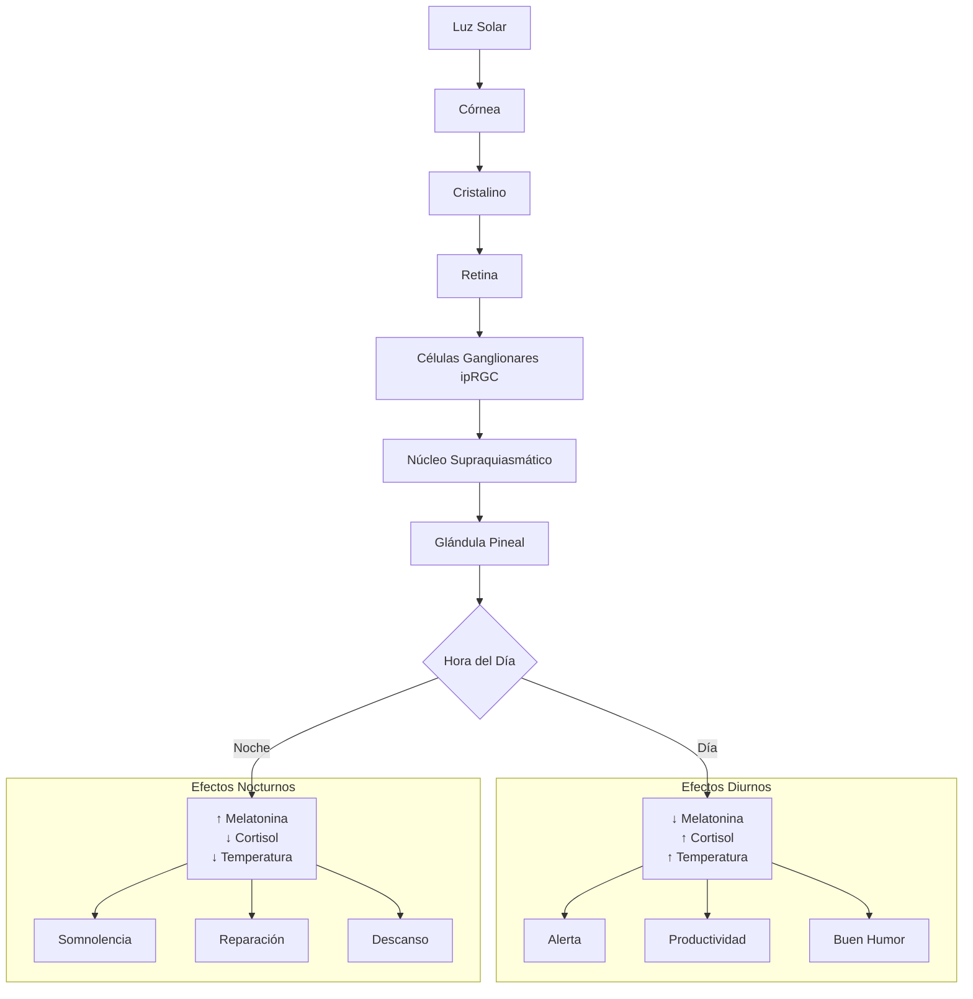
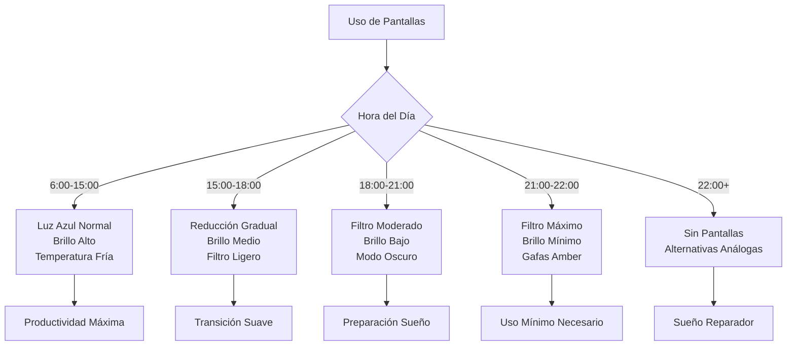
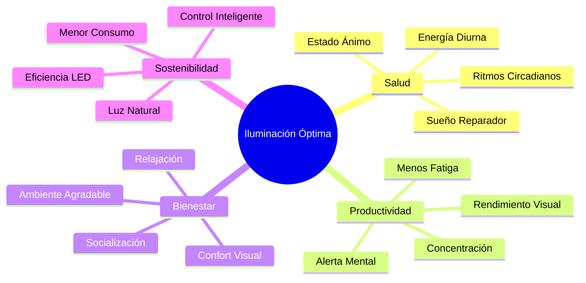

# 💡 Iluminación Óptima

## 🎯 Fundamentos de la Iluminación Óptima

> [!info] Definición La iluminación óptima es el diseño consciente del entorno lumínico para maximizar el bienestar, la productividad, la salud circadiana y la calidad de vida, adaptándose a las necesidades específicas de cada actividad y momento del día.

> [!tip] Principios Fundamentales
> 
> - ☀️ **Luz natural prioritaria**: Aprovechar al máximo la luz solar
> - 🕐 **Sincronización circadiana**: Seguir los ritmos naturales de luz
> - 🎯 **Función específica**: Adaptar la luz a cada actividad
> - 👁️ **Confort visual**: Evitar fatiga y tensión ocular
> - 🌈 **Calidad espectral**: Usar temperaturas de color apropiadas
> - ⚖️ **Balance energético**: Optimizar consumo y sostenibilidad

## 🌞 Ciencia de la Luz y Salud

### 🧬 Efectos Biológicos de la Luz

> [!info] Impacto Fisiológico **Sistema Circadiano:**
> 
> - Regula producción de melatonina y cortisol
> - Sincroniza reloj biológico interno
> - Influye en temperatura corporal
> - Afecta patrones de sueño-vigilia
> 
> **Neurotransmisores:**
> 
> - **Serotonina**: La luz brillante aumenta su producción
> - **Dopamina**: Mejora con exposición a luz natural
> - **GABA**: Se equilibra con ciclos luz-oscuridad apropiados

> [!warning] Consecuencias de Mala Iluminación
> 
> - 😴 **Trastornos del sueño**: Insomnio, sueño fragmentado
> - 😞 **Depresión estacional (SAD)**: Especialmente en invierno
> - 👁️ **Fatiga visual**: Sequedad, tensión, dolores de cabeza
> - 🧠 **Reducción cognitiva**: Menor concentración y memoria
> - ⚡ **Desregulación energética**: Fatiga crónica, cambios de humor

### 📊 Medición de la Luz

> [!info] Unidades de Medida Clave **Lux (lx)**: Intensidad lumínica percibida
> 
> - Día soleado: 100,000 lx
> - Día nublado: 10,000 lx
> - Oficina bien iluminada: 500-1,000 lx
> - Iluminación doméstica: 50-200 lx
> - Luna llena: 0.25 lx
> 
> **Kelvin (K)**: Temperatura de color
> 
> - Vela: 1,900K (muy cálida)
> - Incandescente: 2,700K (cálida)
> - Luz día: 5,500-6,500K (neutra)
> - Cielo azul: 10,000K (muy fría)



## 🕐 Iluminación Circadiana

### 🌅 Protocolo de Luz Diaria

> [!tip] Rutina de Luz Óptima **🌅 Amanecer (6:00-8:00)**
> 
> - **Exposición inmediata** a luz natural (10-30 min)
> - **Intensidad**: 1,000+ lx
> - **Temperatura**: 5,500-6,500K
> - **Actividad**: Mirar hacia el este, caminar al aire libre
> 
> **☀️ Mañana (8:00-12:00)**
> 
> - **Luz brillante y fría** para activación
> - **Intensidad**: 1,000-2,500 lx
> - **Temperatura**: 5,000-6,500K
> - **Espacios**: Cerca de ventanas, luz LED fría
> 
> **🌞 Mediodía (12:00-15:00)**
> 
> - **Máxima exposición** lumínica
> - **Intensidad**: 2,500+ lx
> - **Temperatura**: 5,500-6,500K
> - **Recomendación**: Almorzar al aire libre cuando sea posible
> 
> **🌆 Tarde (15:00-18:00)**
> 
> - **Transición gradual** hacia luz más cálida
> - **Intensidad**: 500-1,500 lx
> - **Temperatura**: 4,000-5,000K
> - **Actividades**: Trabajo de oficina, tareas domésticas
> 
> **🌙 Noche (18:00-22:00)**
> 
> - **Luz cálida y tenue** para preparar el sueño
> - **Intensidad**: 50-200 lx
> - **Temperatura**: 2,200-3,000K
> - **Evitar**: Pantallas sin filtros, luz azul intensa
> 
> **🌌 Pre-sueño (22:00+)**
> 
> - **Mínima iluminación** necesaria
> - **Intensidad**: <50 lx
> - **Temperatura**: <2,200K (luz roja ideal)
> - **Alternativas**: Velas, salt lamps, luz ámbar

```mermaid
timeline
    title Ciclo de Iluminación Circadiana Óptima
    
    6:00  : Luz natural intensa
          : 1000+ lx, 6500K
          : Activación circadiana
    
    9:00  : Luz fría de trabajo
          : 1500 lx, 5500K
          : Peak cognitivo
    
    12:00 : Máxima exposición
          : 2500+ lx, 6000K
          : Refuerzo circadiano
    
    15:00 : Luz neutra
          : 1000 lx, 4500K
          : Productividad sostenida
    
    18:00 : Transición cálida
          : 500 lx, 3500K
          : Preparación vespertina
    
    21:00 : Luz muy cálida
          : 100 lx, 2700K
          : Pre-sueño
    
    22:00 : Luz mínima/roja
          : <50 lx, <2200K
          : Inducción del sueño
```

## 🏠 Iluminación por Espacios

### 🛏️ Dormitorio

> [!info] Santuario del Sueño **Características Óptimas:**
> 
> - **Oscuridad total** para dormir (blackout curtains)
> - **Luz cálida tenue** para preparación (<100 lx, 2200K)
> - **Despertador con simulador de amanecer**
> - **Control independiente** de cada fuente de luz
> - **Evitar LED azules** de dispositivos electrónicos

> [!tip] Configuración Recomendada
> 
> - **Luz principal**: Dimmer con LED cálidos regulables
> - **Luz de lectura**: Lámpara direccional con filtro cálido
> - **Luz nocturna**: Strips LED rojos bajo la cama
> - **Amanecer artificial**: Light therapy lamp o sunrise clock

### 🍽️ Cocina

> [!info] Centro de Actividad **Requerimientos Funcionales:**
> 
> - **Iluminación general**: 500-750 lx, 4000-5000K
> - **Iluminación de tarea**: 1000+ lx en áreas de trabajo
> - **Iluminación de acento**: Para crear ambiente durante comidas
> - **Flexibilidad**: Múltiples controles y intensidades

> [!tip] Sistema de Capas
> 
> 1. **General**: Plafones LED de techo distribución uniforme
> 2. **Tarea**: Under-cabinet LEDs para encimeras
> 3. **Acento**: Pendants sobre isla/barra, luces decorativas
> 4. **Ambiente**: Dimmers para cenas románticas

### 💼 Oficina/Estudio

> [!info] Optimización Cognitiva **Para Máximo Rendimiento:**
> 
> - **Luz natural prioritaria**: Escritorio perpendicular a ventana
> - **Iluminación uniforme**: Evitar sombras y contrastes
> - **Temperatura fría**: 5000-6500K durante horas productivas
> - **Intensidad alta**: 1000-1500 lx en superficie de trabajo
> - **Reducción de deslumbramiento**: Pantallas anti-reflejo

> [!warning] Errores Comunes en Oficina
> 
> - Luz únicamente desde arriba (crea sombras)
> - Pantalla frente a ventana (deslumbramiento)
> - Iluminación demasiado cálida durante el día
> - Falta de control individual de intensidad
> - Ignorar la luz azul de pantallas en horario nocturno

### 🛋️ Sala de Estar

> [!info] Espacio Multifuncional **Necesidades Variables:**
> 
> - **Socialización**: Luz cálida y acogedora (2700-3000K)
> - **Lectura**: Luz direccional intensa (750+ lx)
> - **TV/Entretenimiento**: Luz tenue ambiente (<200 lx)
> - **Actividades familiares**: Luz neutra adaptable (3500-4000K)

> [!tip] Configuración Flexible
> 
> - **Luz general**: Plafón central con dimmer
> - **Luz de tarea**: Lámparas de pie y mesa para lectura
> - **Luz de acento**: Wall sconces, table lamps decorativas
> - **Luz ambiental**: LED strips detrás de TV, indirect lighting

## 💻 Iluminación Digital y Pantallas

### 📱 Gestión de Luz Azul

> [!warning] Impacto de Pantallas **Efectos Negativos:**
> 
> - Supresión de melatonina hasta 3 horas después del uso
> - Fatiga visual digital (CVS - Computer Vision Syndrome)
> - Interrupción de patrones de sueño
> - Incremento en miopía (especialmente en niños)

> [!tip] Estrategias de Protección **Software:**
> 
> - **f.lux**: Ajuste automático de temperatura de color
> - **Night Shift** (iOS) / **Blue Light Filter** (Android)
> - **Windows Night Light**: Reducción automática de azul
> - **Iris**: Control avanzado de luz azul y PWM
> 
> **Hardware:**
> 
> - **Gafas con filtro azul**: Para uso intensivo nocturno
> - **Pantallas E-ink**: Para lectura prolongada
> - **Monitores con Eye Care**: Tecnología de reducción de fatiga
> - **Filtros de pantalla**: Protectores físicos anti-azul

### ⏰ Protocolo Digital Nocturno

> [!info] Rutina de Desconexión Digital **3 Horas Antes del Sueño:**
> 
> - Activar filtros de luz azul al máximo
> - Reducir brillo de pantallas al mínimo
> - Usar modo oscuro en todas las aplicaciones
> 
> **2 Horas Antes del Sueño:**
> 
> - Evitar contenido estimulante o estresante
> - Preferir audio sobre video (podcasts, música)
> - Usar readers de e-ink para lectura
> 
> **1 Hora Antes del Sueño:**
> 
> - Cero pantallas idealmente
> - Alternativas: lectura física, meditación, journaling
> - Si es imprescindible: gafas amber + mínimo brillo



## 🏗️ Diseño de Sistemas de Iluminación

### 🔧 Tipos de Iluminación

> [!info] Clasificación por Función **1. Iluminación General (Ambient)**
> 
> - Función: Iluminación base del espacio
> - Características: Uniforme, difusa, sin sombras marcadas
> - Ejemplos: Plafones, downlights distribuidos
> - Intensidad: 200-500 lx según actividad
> 
> **2. Iluminación de Tarea (Task)**
> 
> - Función: Actividades específicas que requieren precisión
> - Características: Direccional, intensa, sin deslumbramiento
> - Ejemplos: Lámparas de escritorio, under-cabinet LEDs
> - Intensidad: 750-1500 lx en área de trabajo
> 
> **3. Iluminación de Acento (Accent)**
> 
> - Función: Resaltar elementos decorativos o arquitectónicos
> - Características: Direccional, dramática, contraste
> - Ejemplos: Spotlights, wall washers, uplights
> - Intensidad: Variable según efecto deseado
> 
> **4. Iluminación Decorativa (Decorative)**
> 
> - Función: Elemento estético en sí mismo
> - Características: Atractiva visualmente, crea ambiente
> - Ejemplos: Chandeliers, pendant lights, art fixtures
> - Intensidad: Más sobre estética que funcionalidad

### 💡 Tecnologías de Iluminación

> [!tip] Comparación de Tecnologías **LED (Light Emitting Diode)**
> 
> - ✅ Eficiencia energética superior (80-90% menos consumo)
> - ✅ Vida útil extendida (25,000-50,000 horas)
> - ✅ Control preciso de temperatura de color
> - ✅ Dimming suave y sin parpadeo
> - ✅ No emite calor significativo
> - ✅ Disponible en cualquier temperatura de color
> 
> **Halógena/Incandescente**
> 
> - ❌ Muy ineficiente energéticamente
> - ❌ Vida útil corta (1,000-2,000 horas)
> - ✅ Excelente renderizado de color (CRI 100)
> - ✅ Luz cálida natural
> - ❌ Genera mucho calor
> 
> **Fluorescente/CFL**
> 
> - ⚠️ Eficiencia moderada
> - ❌ Parpadeo visible (puede causar fatiga)
> - ❌ Contiene mercurio
> - ❌ Tiempo de encendido lento
> - ⚠️ Renderizado de color variable

### 🎛️ Sistemas de Control Inteligente

> [!info] Smart Lighting Benefits **Características Avanzadas:**
> 
> - **Programación automática**: Según horarios y ocupación
> - **Sensores de movimiento**: Encendido/apagado automático
> - **Sensores de luz natural**: Ajuste automático de intensidad
> - **Control remoto**: Apps, voice control, automation
> - **Perfiles personalizados**: Diferentes escenas preprogramadas
> - **Integración domótica**: Conexión con otros sistemas del hogar

> [!tip] Sistemas Recomendados **Entry Level:**
> 
> - **Philips Hue**: Ecosystem completo, fácil uso
> - **LIFX**: Colores vibrantes, sin hub necesario
> - **TP-Link Kasa**: Económico, funcionalidad básica
> 
> **Professional Level:**
> 
> - **Lutron Caseta/RadioRA**: Control de alta gama
> - **Control4**: Integración completa del hogar
> - **KNX/EIB**: Estándar europeo, muy robusto

## 🌿 Iluminación Natural y Arquitectura

### 🪟 Optimización de Luz Natural

> [!info] Estrategias Arquitectónicas **Orientación de Ventanas:**
> 
> - **Norte**: Luz constante y suave (ideal para oficinas)
> - **Sur**: Máxima luz en invierno, protección solar en verano
> - **Este**: Luz matutina energizante
> - **Oeste**: Luz vespertina, puede ser problemática por calor
> 
> **Elementos de Control Solar:**
> 
> - **Voladizos**: Bloquean sol alto, permiten sol bajo
> - **Persianas exteriores**: Control preciso de luz y calor
> - **Cristales selectivos**: Filtran UV manteniendo luz visible
> - **Estantes de luz**: Rebotan luz profundo en el espacio

> [!tip] Maximización de Luz Natural
> 
> - **Colores claros**: Paredes y techos en tonos blancos/claros
> - **Superficies reflectantes**: Espejos estratégicamente ubicados
> - **Espacios abiertos**: Menos divisiones, mejor distribución
> - **Tragaluces**: Luz cenital muy efectiva
> - **Patios internos**: Luz natural en espacios profundos

### 🌸 Seasonal Affective Disorder (SAD)

> [!warning] Trastorno Afectivo Estacional **Síntomas:**
> 
> - Depresión durante meses de menor luz solar
> - Fatiga extrema y somnolencia diurna
> - Antojos de carbohidratos y aumento de peso
> - Dificultad de concentración
> - Aislamiento social
> 
> **Más común en:**
> 
> - Latitudes altas (>37°)
> - Mujeres (4:1 ratio vs hombres)
> - Personas de 18-30 años
> - Quienes trabajan en interiores

> [!tip] Tratamiento con Light Therapy **Protocolo Estándar:**
> 
> - **Intensidad**: 10,000 lx
> - **Duración**: 20-30 minutos diarios
> - **Horario**: Temprano en la mañana (6:00-8:00 AM)
> - **Distancia**: 16-24 pulgadas de la caja de luz
> - **Consistencia**: Uso diario durante temporada de riesgo
> 
> **Light Boxes Recomendadas:**
> 
> - Debe emitir 10,000 lx a distancia recomendada
> - Filtro UV para seguridad ocular
> - Área de superficie mínima de 12x18 pulgadas
> - Certificación médica FDA si es posible

## 🎨 Aspectos Psicológicos de la Iluminación

### 🧠 Efectos en Estado de Ánimo y Cognición

> [!info] Impacto Psicológico Documentado **Luz Brillante y Fría (5000K+):**
> 
> - ⬆️ Aumenta alerta y concentración
> - ⬆️ Mejora rendimiento en tareas cognitivas
> - ⬆️ Reduce somnolencia diurna
> - ⬆️ Incrementa sensación de energía
> - ⚠️ Puede generar estrés si se usa en exceso
> 
> **Luz Cálida y Tenue (2700K-):**
> 
> - ⬇️ Promueve relajación y calma
> - ⬇️ Facilita transición al sueño
> - ⬆️ Crea sensación de intimidad y comodidad
> - ⬆️ Mejora ambiente social
> - ⚠️ Puede inducir somnolencia durante el día

### 🏠 Lighting Design para Bienestar

> [!tip] Principios de Diseño Consciente **Layered Lighting:**
> 
> - Combina al menos 3 tipos de iluminación por espacio
> - Permite flexibilidad según actividad y momento
> - Evita dependencia de una sola fuente
> 
> **Human-Centric Lighting:**
> 
> - Prioriza bienestar sobre solo funcionalidad
> - Considera ritmos circadianos en el diseño
> - Adapta automáticamente según hora del día
> 
> **Biophilic Lighting:**
> 
> - Imita patrones naturales de luz
> - Incluye variaciones dinámicas durante el día
> - Conecta espacios interiores con ciclos naturales



## 🚧 Problemas Comunes y Soluciones

### 👁️ Fatiga Visual Digital

> [!warning] Computer Vision Syndrome (CVS) **Síntomas:**
> 
> - Ojos secos, rojos o irritados
> - Visión borrosa o doble
> - Dolores de cabeza frecuentes
> - Dolor de cuello y hombros
> - Dificultad para enfocar
> 
> **Causas Principales:**
> 
> - Parpadeo reducido (1/3 de lo normal)
> - Luz azul intensa de pantallas
> - Distancia inadecuada a pantalla
> - Ángulo visual incorrecto
> - Deslumbramiento y reflejos

> [!tip] Protocolo de Prevención CVS **Regla 20-20-20:**
> 
> - Cada 20 minutos
> - Mirar algo a 20+ pies de distancia
> - Durante al menos 20 segundos
> 
> **Configuración Óptima de Pantalla:**
> 
> - Distancia: 50-70 cm de los ojos
> - Ángulo: Parte superior al nivel de ojos o ligeramente por debajo
> - Brillo: Similar al entorno circundante
> - Contraste: Alto, pero no extremo
> - Tamaño de texto: Suficientemente grande para leer sin esfuerzo

### 💡 Deslumbramiento y Contrastes

> [!warning] Tipos de Deslumbramiento **Directo:** Fuente de luz en campo visual directo
> 
> - Solución: Reposicionar fuentes o usar difusores
> 
> **Reflejado:** Luz reflejada en superficies brillantes
> 
> - Solución: Ángulos adecuados, superficies mate
> 
> **Por Contraste:** Diferencias extremas luz/sombra
> 
> - Solución: Iluminación más uniforme, múltiples fuentes

> [!tip] Prevención de Deslumbramiento
> 
> - **Ángulo de corte**: Luminarias con ángulo >30° del campo visual
> - **Difusión**: Pantallas, difusores para suavizar luz directa
> - **Posicionamiento**: Fuentes de luz fuera del campo visual directo
> - **Control de ventanas**: Persianas, cortinas para luz natural intensa

## 📊 Métricas y Evaluación

### 📏 Medición de Calidad Lumínica

> [!info] Herramientas de Medición **Apps Móviles (Aproximado):**
> 
> - Light Meter (Android/iOS)
> - Lux Light Meter Pro
> - MyLightMeter Pro
> 
> **Instrumentos Profesionales:**
> 
> - Luxómetro calibrado
> - Colorímetro para temperatura de color
> - Medidor de parpadeo (flicker meter)
> - Espectroradiómetro para análisis completo

> [!tip] Checklist de Evaluación por Espacio **Dormitorio:**
> 
> - [ ] <10 lx para dormir (blackout completo)
> - [ ] 50-100 lx luz cálida para preparación
> - [ ] 1000+ lx simulador amanecer
> - [ ] Sin LED azules visibles
> 
> **Oficina/Estudio:**
> 
> - [ ] 500-1000 lx en superficie de trabajo
> - [ ] 5000-6500K durante horas productivas
> - [ ] Sin sombras en área de teclado/documentos
> - [ ] Pantalla perpendicular a ventana
> 
> **Cocina:**
> 
> - [ ] 750+ lx en encimeras y isla
> - [ ] 4000-5000K para tareas culinarias
> - [ ] Iluminación bajo gabinetes sin sombras
> - [ ] Dimmer para ambiente durante comidas

### 📈 Tracking de Efectos

> [!tip] Métricas de Bienestar **Diarias (Escala 1-10):**
> 
> - Calidad del sueño nocturno
> - Energía matutina al despertar
> - Nivel de alerta durante el día
> - Fatiga visual al final del día
> - Estado de ánimo general
> 
> **Semanales:**
> 
> - Horas totales de sueño
> - Tiempo de exposición a luz natural
> - Tiempo frente a pantallas nocturnas
> - Uso de light therapy (si aplica)
> 
> **Mensuales:**
> 
> - Revisión integral de configuración
> - Ajustes estacionales necesarios
> - Evaluación de inversiones en iluminación
> - Impacto en productividad y bienestar

## 📚 Referencias


> [!quote] [[Gestión de la Energía Personal]] La optimización lumínica es fundamental para mantener niveles energéticos sostenibles y prevenir fatiga crónica

> [!quote] [[Feng Shui para Espacios Pequeños]] El diseño consciente de iluminación puede aumentar el rendimiento cognitivo hasta en un 25%


---

#iluminación #luz-natural #ritmos-circadianos #bienestar #salud-visual #sueño #productividad #smart-lighting #light-therapy #ergonomía #diseño-interior #arquitectura #tecnología-led #fatiga-visual