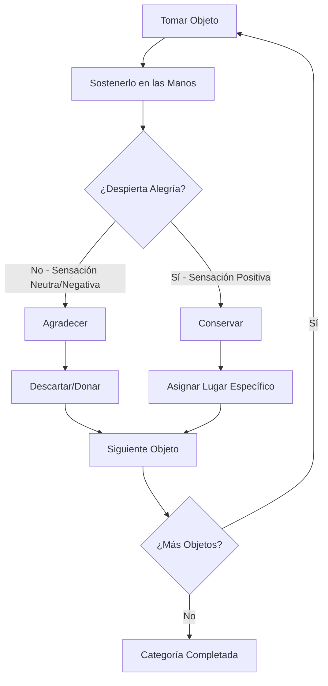
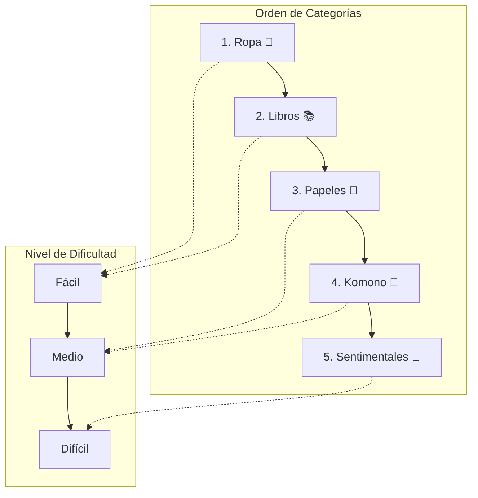
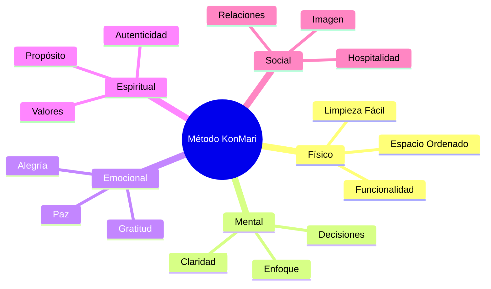

# ✨ Método KonMari

## 🎯 Fundamentos del Método KonMari

> [!info] Definición El Método KonMari, creado por Marie Kondo, es un sistema revolucionario de organización que se basa en conservar solo aquellos objetos que "despiertan alegría" (spark joy) y crear un estilo de vida que genere felicidad a través del orden consciente.

> [!tip] Filosofía Central
> 
> - 💖 **Joy-Based Decision**: Conservar solo lo que genera alegría
> - 🔄 **Tidying Festival**: Organizar como evento único, no rutina
> - 🎭 **Mindful Living**: Consciencia plena sobre nuestras posesiones
> - 🌱 **Life-Changing Magic**: Transformación integral de vida
> - 🙏 **Gratitude Practice**: Agradecer a los objetos su servicio

## 📋 Los 6 Principios Fundamentales

### 1️⃣ Comprometerse con el Orden

> [!warning] Compromiso Total
> 
> - No es una limpieza ocasional, es una transformación de vida
> - Requiere dedicación mental y emocional completa
> - Visualizar el estilo de vida ideal antes de comenzar
> - Entender que el proceso cambiará tu relación con las posesiones

### 2️⃣ Imaginar tu Estilo de Vida Ideal

> [!tip] Visualización Profunda **Preguntas Clave:**
> 
> - ¿Cómo quiero sentirme en mi espacio?
> - ¿Qué actividades quiero realizar en casa?
> - ¿Cómo se ve mi día perfecto?
> - ¿Qué emociones quiero experimentar?
> - ¿Qué imagen proyecto de mí mismo?

### 3️⃣ Terminar Primero con el Descarte

> [!info] Proceso de Eliminación
> 
> - **NUNCA** organizar antes de descartar
> - Reunir TODOS los objetos de una categoría
> - Tomar cada objeto individualmente
> - Preguntarse: "¿Esto me genera alegría?"
> - Agradecer y despedir lo que se va

### 4️⃣ Organizar por Categoría, No por Ubicación

> [!warning] Error Común ❌ **Incorrecto**: Limpiar habitación por habitación ✅ **Correcto**: Reunir toda la ropa de la casa, luego todos los libros, etc.

### 5️⃣ Seguir el Orden Correcto

> [!info] Secuencia Específica La dificultad emocional aumenta progresivamente:
> 
> 1. **Ropa** 👕 (Más fácil)
> 2. **Libros** 📚
> 3. **Papeles** 📄
> 4. **Komono** 🔧 (Misceláneos)
> 5. **Objetos Sentimentales** 💝 (Más difícil)

### 6️⃣ Preguntarse si Despierta Alegría

> [!tip] La Pregunta Mágica **"¿Esto me despierta alegría?"**
> 
> - Sostener el objeto en las manos
> - Prestar atención a la respuesta corporal
> - La alegría se siente como calidez, ligereza, sonrisa
> - Si dudas, probablemente no despierta alegría

## 🗂️ Las 5 Categorías Detalladas

### 👕 Categoría 1: Ropa

> [!tip] Proceso de Ropa **Reunir TODA la ropa de:**
> 
> - Closets principales y secundarios
> - Cajones de todas las habitaciones
> - Lavandería y ropa sucia
> - Abrigos de temporada
> - Ropa deportiva y de casa
> - Accesorios (cinturones, bolsos, sombreros)

> [!info] Técnica de Doblado KonMari **Principios del Doblado:**
> 
> - Cada prenda debe poder "pararse" por sí sola
> - Doblar en rectángulos uniformes
> - Almacenar verticalmente para ver todo
> - Crear "pulso" de felicidad al tocar la ropa

**Técnica por Tipo:**

- **Camisetas**: Doblar en tercios verticales, luego horizontalmente
- **Pantalones**: Doblar por la mitad, luego en tercios
- **Ropa interior**: Pequeños rectángulos en cajas organizadoras
- **Calcetines**: NUNCA enrollar, doblar suavemente

### 📚 Categoría 2: Libros

> [!info] Criterios de Evaluación **Conservar libros que:**
> 
> - Pertenecen al "salón de la fama" personal
> - Quieres releer o consultar específicamente
> - Te inspiran solo con verlos
> - Representan quién eres ahora (no quien eras)

> [!warning] Libros a Considerar Descartar
> 
> - Libros que "algún día" leerás
> - Libros que ya cumplieron su propósito
> - Libros que conservas por obligación social
> - Libros dañados o desactualizados

**Organización de Libros:**

- Por altura para armonía visual
- Los más queridos a la altura de los ojos
- Crear pequeñas bibliotecas temáticas

### 📄 Categoría 3: Papeles

> [!warning] Regla Fundamental **"Descartar casi todo"**
> 
> - La mayoría de papeles se pueden conseguir de nuevo
> - Digitalizar documentos importantes
> - Crear un sistema simple archivo/descarte

> [!tip] Sistema de Papeles **Conservar solo:**
> 
> - Documentos legales únicos
> - Garantías vigentes
> - Manuales de equipos actuales
> - Papeles con valor sentimental específico

**Organización:**

- Archivo vertical en carpetas etiquetadas

> - Sistema de colores por urgencia/tipo
> - Revisión trimestral de vigencia

### 🔧 Categoría 4: Komono (Misceláneos)

> [!info] La Categoría Más Amplia Incluye todo lo que no es ropa, libros o papeles:
> 
> - Artículos de cocina y limpieza
> - Decoración y adornos
> - Electrónicos y cables
> - Artículos de baño y cosméticos
> - Herramientas y materiales
> - Suministros de oficina

> [!tip] Estrategia por Subcategoría **Método de Subcategorías:**
> 
> 1. Dividir komono en grupos lógicos
> 2. Procesar un grupo a la vez
> 3. Aplicar el test de alegría rigurosamente
> 4. Asignar homes específicos a cada objeto

**Organización de Komono:**

> - Cajas y organizadores transparentes
> - Etiquetas claras y visibles
> - Principio: cada objeto tiene UN lugar específico
> - Acceso fácil para objetos de uso frecuente

### 💝 Categoría 5: Objetos Sentimentales

> [!warning] La Más Desafiante Se deja para el final porque:
> 
> - Requiere mayor claridad emocional
> - Las decisiones son más complejas
> - Ya tienes práctica con el método
> - Tu definición de "alegría" está más afinada

> [!tip] Proceso Sentimental **Técnica Especial:**
> 
> - Crear ambiente tranquilo y sin prisa
> - Tomar cada objeto y recordar su historia
> - Preguntarse: "¿Este objeto me ayuda a ser quien quiero ser?"
> - Agradecer profundamente antes de descartar

**Tipos de Objetos Sentimentales:**

> - Fotografías y álbumes
> - Cartas y tarjetas
> - Recuerdos de viajes
> - Regalos de personas queridas
> - Objetos de la infancia
> - Herencias familiares

## 🏠 Principios de Organización

### 📍 Asignación de "Homes"

> [!info] Cada Objeto Tiene un Hogar
> 
> - **Un lugar específico** para cada objeto
> - **Fácil acceso** para uso frecuente
> - **Lógica intuitiva** en la ubicación
> - **Retorno inmediato** después del uso

> [!tip] Estrategias de Ubicación **Por Frecuencia de Uso:**
> 
> - Uso diario: Al alcance de la mano
> - Uso semanal: En estantes accesibles
> - Uso ocasional: En partes altas o traseras
> - Uso excepcional: En almacenamientos especiales

### 📦 Sistemas de Almacenamiento

> [!tip] Herramientas Recomendadas
> 
> - **Cajas de zapatos**: Organizadores naturales
> - **Divisores de cajones**: Para artículos pequeños
> - **Contenedores transparentes**: Visibilidad total
> - **Etiquetas**: Identificación clara
> - **Ganchos adhesivos**: Para objetos ligeros

> [!warning] Evitar Estos Errores
> 
> - Comprar organizadores antes de descartar
> - Sistemas demasiado complejos
> - Categorías demasiado específicas
> - Lugares "temporales" que se vuelven permanentes

## 🧠 Aspectos Psicológicos del Método

### 💭 Transformación Mental

> [!info] Cambios Cognitivos El método genera:
> 
> - **Claridad de valores**: Saber qué es realmente importante
> - **Toma de decisiones**: Confianza en elecciones personales
> - **Mindfulness**: Consciencia del momento presente
> - **Autoconocimiento**: Entender patrones y preferencias
> - **Gratitud**: Apreciación por lo que se tiene

### 🔄 Efectos en Otras Áreas de la Vida

> [!tip] Transferencia de Habilidades Las personas reportan mejoras en:
> 
> - **Relaciones personales**: Claridad sobre quién aporta alegría
> - **Carrera profesional**: Decisiones más alineadas con valores
> - **Finanzas**: Compras más conscientes e intencionales
> - **Tiempo**: Mejor gestión de actividades y compromisos
> - **Salud**: Mayor atención al autocuidado

## ⏱️ Planificación del Proceso

### 📅 Timeline Realista

> [!info] Duración Esperada **Por Categoría (personas/familias):**
> 
> - **Ropa**: 1-3 días
> - **Libros**: 1-2 días
> - **Papeles**: 0.5-1 día
> - **Komono**: 1-2 semanas
> - **Sentimentales**: 2-5 días

> [!warning] Factores que Afectan el Tiempo
> 
> - Cantidad de posesiones acumuladas
> - Número de personas en el hogar
> - Espacio disponible para trabajar
> - Nivel de apego emocional
> - Experiencia previa con organización

### 🗓️ Preparación Pre-KonMari

> [!tip] Lista de Preparación **Antes de Comenzar:**
> 
> - [ ] Leer "La Magia del Orden" completo
> - [ ] Visualizar estilo de vida ideal (por escrito)
> - [ ] Conseguir bolsas para donación
> - [ ] Liberar tiempo suficiente (no apresurarse)
> - [ ] Informar a familia/compañeros de casa
> - [ ] Preparar snacks y música motivacional
> - [ ] Tomar fotos "antes" para comparación

## 🚧 Desafíos Comunes y Soluciones

### 😰 Resistencias Emocionales

> [!warning] Obstáculos Típicos **"¿Y si lo necesito después?"**
> 
> - Solución: Preguntarse cuándo fue la última vez que lo usaste
> - Estadística: 80% de lo que guardamos "por si acaso" nunca se usa
> 
> **"Fue muy caro para tirarlo"**
> 
> - Solución: El costo ya se pagó, conservarlo no lo recupera
> - Enfoque: ¿Te genera alegría AHORA?
> 
> **"Me lo regaló alguien especial"**
> 
> - Solución: Honrar la intención del regalo, no el objeto
> - El amor no está en el objeto sino en el gesto

### 🏠 Desafíos Familiares

> [!info] Convivencia Durante el Proceso **Con Familia Escéptica:**
> 
> - Comenzar solo con tus pertenencias
> - Demostrar beneficios con el ejemplo
> - No evangelizar, solo modelar
> - Respetar el ritmo de otros
> 
> **Con Niños:**
> 
> - Involucrarlos en sus propias categorías
> - Enseñar el concepto de alegría adaptado a su edad
> - Hacer el proceso divertido y no punitivo
> - Celebrar sus decisiones

### 🔄 Mantenimiento Post-KonMari

> [!tip] Sustentabilidad del Sistema **Rutina de Mantenimiento:**
> 
> - Regla: cada objeto vuelve a su "home"
> - Compras conscientes: ¿despierta alegría?
> - Revisión anual ligera por categoría
> - Gratitud diaria hacia el espacio ordenado

> [!warning] Señales de Alerta
> 
> - Acumulación en "zonas de aterrizaje"
> - Compras impulsivas frecuentes
> - Pérdida de alegría en el espacio
> - Retorno a patrones antiguos de desorganización

## 📊 Beneficios Documentados

> [!info] Investigación y Testimonios **Beneficios Físicos:**
> 
> - 78% reporta mejor calidad de sueño
> - 65% experimenta más energía diaria
> - 82% encuentra objetos más rápidamente
> 
> **Beneficios Mentales:**
> 
> - 71% siente menos estrés en casa
> - 89% reporta mayor claridad mental
> - 56% mejora en toma de decisiones
> 
> **Beneficios Emocionales:**
> 
> - 93% experimenta más alegría en casa
> - 67% siente mayor control sobre su vida
> - 74% reporta mejor estado de ánimo general

## 📚 Referencias

> [!quote] [[Minimalismo Digital]] El Método KonMari es una puerta de entrada al minimalismo basado en alegría más que en privación

> [!quote] [[Gestión de la Energía Personal]] Un espacio organizado reduce la carga cognitiva y libera energía mental para actividades importantes

> [!quote] [[Mindfulness]] La práctica de preguntarse sobre la alegría desarrolla mayor consciencia y conexión con el momento presente

## 📖 Notas Recomendadas

- [[Minimalismo Digital]]
- [[Feng Shui para Espacios Pequeños]]

---

#konmari #organización #minimalismo #orden #alegría #transformación #hogar #bienestar #marie-kondo #decluttering #mindfulness #autoconocimiento #estilo-de-vida