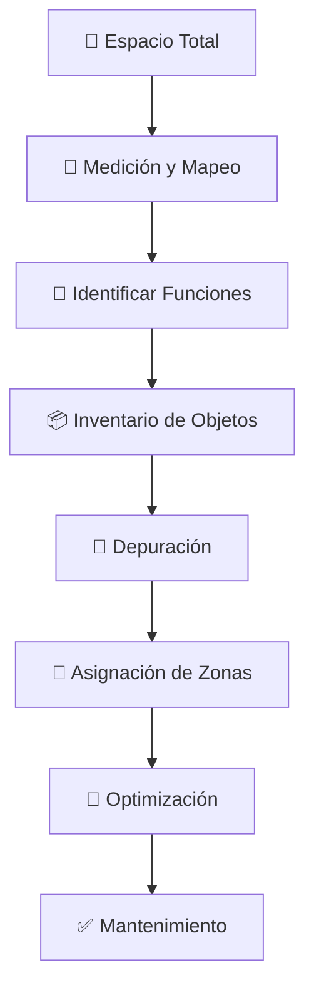
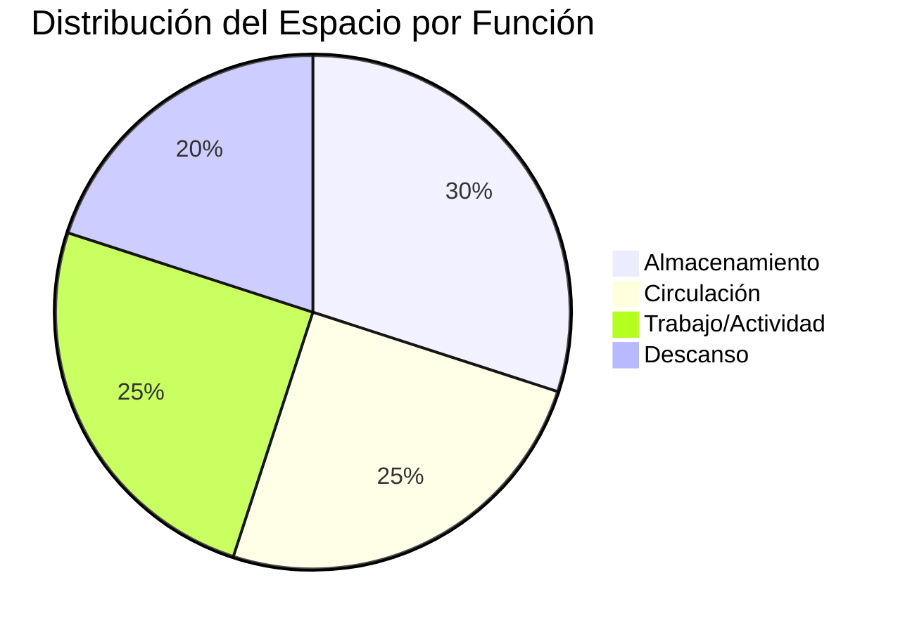
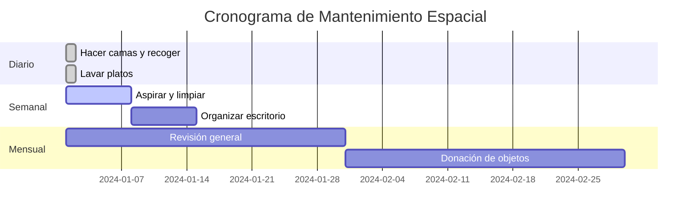

# 🏠 Organización Física del Espacio

## 📋 Principios Fundamentales

> [!info] 🎯 Objetivo Principal La organización física del espacio busca crear ambientes funcionales, estéticamente agradables y que promuevan el bienestar y la productividad de quienes los habitan.

> [!tip] 💡 Principio de las 5S
> 
> - **Seiri (Clasificar)**: Separar lo necesario de lo innecesario
> - **Seiton (Ordenar)**: Un lugar para cada cosa y cada cosa en su lugar
> - **Seiso (Limpiar)**: Mantener limpio y ordenado
> - **Seiketsu (Estandarizar)**: Crear procedimientos para mantener el orden
> - **Shitsuke (Disciplina)**: Hacer del orden un hábito

## 🗺️ Metodología de Análisis Espacial

## 🏠 Organización por Espacios

### 🛏️ Dormitorio

> [!tip] 🌙 Zona de Descanso **Elementos esenciales:**
> 
> - Cama con almacenamiento inferior
> - Mesitas de noche con cajones
> - Iluminación tenue para relajación
> 
> **Regla de oro**: Mantener superficies despejadas para promover la calma

> [!warning] ⚠️ Evitar en el Dormitorio
> 
> - Acumulación de ropa sobre sillas
> - Dispositivos electrónicos cerca de la cama
> - Colores muy estimulantes en paredes

### 🍳 Cocina

> [!info] 👨‍🍳 Triángulo de Trabajo Organizar nevera, fregadero y cocina formando un triángulo eficiente para optimizar movimientos durante la preparación de alimentos.

> [!tip] 📦 Zonas de Almacenamiento
> 
> - **Zona fría**: Nevera y despensa
> - **Zona de preparación**: Encimera y utensilios
> - **Zona de cocción**: Fogones y condimentos
> - **Zona de limpieza**: Fregadero y productos

### 🛋️ Sala de Estar

> [!tip] 🎭 Áreas Funcionales **División por actividades:**
> 
> - Zona de conversación (sofás en L o U)
> - Zona de entretenimiento (TV y consolas)
> - Zona de lectura (sillón cómodo con buena luz)
> - Zona de almacenamiento (estanterías y muebles)

### 💼 Espacio de Trabajo

> [!info] 🖥️ Ergonomía Digital
> 
> - Monitor a la altura de los ojos
> - Teclado y ratón al nivel de los codos
> - Silla con soporte lumbar adecuado
> - Iluminación que evite reflejos en pantalla

> [!warning] 🚨 Errores Comunes
> 
> - Cables desordenados (usar organizadores)
> - Falta de espacio para las piernas
> - Documentos apilados sin sistema

## 📊 Sistema de Categorización

> [!tip] 🏷️ Etiquetado Efectivo **Códigos de colores:**
> 
> - 🔴 Rojo: Uso diario
> - 🟡 Amarillo: Uso semanal
> - 🔵 Azul: Uso mensual
> - ⚫ Negro: Uso estacional

## 📐 Técnicas de Optimización

### 📏 Aprovechamiento Vertical

> [!info] ⬆️ Maximizar Altura
> 
> - Estanterías hasta el techo
> - Ganchos en puertas y paredes
> - Almacenamiento sobre armarios
> - Entrepisos en espacios altos

### 🔄 Mobiliario Multifuncional

> [!tip] 🪑 Ideas Inteligentes
> 
> - Otomanas con almacenamiento interno
> - Mesas extensibles o plegables
> - Camas con cajones integrados
> - Espejos que ocultan armarios

## 🔧 Herramientas y Materiales

> [!info] 🛠️ Kit Básico de Organización **Contenedores:**
> 
> - Cajas transparentes con tapa
> - Cestas de mimbre o tela
> - Organizadores de cajones
> - Bolsas al vacío para ropa
> 
> **Accesorios:**
> 
> - Etiquetas adhesivas
> - Separadores ajustables
> - Ganchos adhesivos
> - Barras extensibles

## 📅 Plan de Mantenimiento

> [!warning] 🔄 Señales de Reorganización Necesaria
> 
> - Dificultad para encontrar objetos
> - Sensación de agobio al entrar
> - Acumulación en superficies
> - Espacios subutilizados

## 🎨 Aspectos Estéticos

> [!tip] 🌈 Armonía Visual **Principios de diseño:**
> 
> - Regla del 60-30-10 para colores
> - Equilibrio entre elementos llenos y vacíos
> - Repetición de formas y texturas
> - Puntos focales definidos

> [!info] 💡 Iluminación Estratégica
> 
> - Luz general para actividades básicas
> - Luz de tarea para trabajos específicos
> - Luz de ambiente para crear atmósfera
> - Luz natural como prioridad

## 📊 Métricas de Éxito

> [!tip] 📈 Indicadores de Organización Exitosa
> 
> - **Tiempo de búsqueda**: < 30 segundos para objetos cotidianos
> - **Superficies libres**: Mínimo 70% despejadas
> - **Satisfacción espacial**: Sensación de calma al entrar
> - **Mantenimiento**: Menos de 15 minutos diarios

## 🔗 Referencias

> [!quote] 📚 Notas Relacionadas
> 
> - [[Minimalismo Digital]]
> - [[Feng Shui para Espacios Pequeños]]
> - [[Productividad en la Vida Real]]

---

#organización #espacios #hogar #productividad #bienestar #diseño-interior #minimalismo #feng-shui