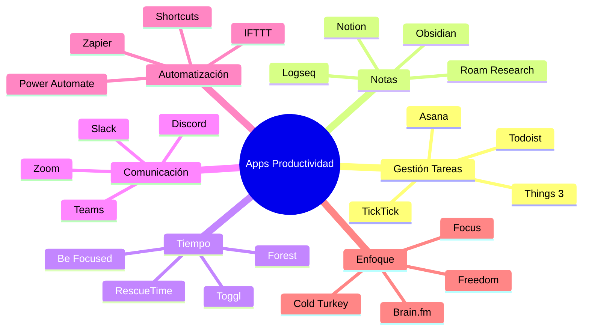
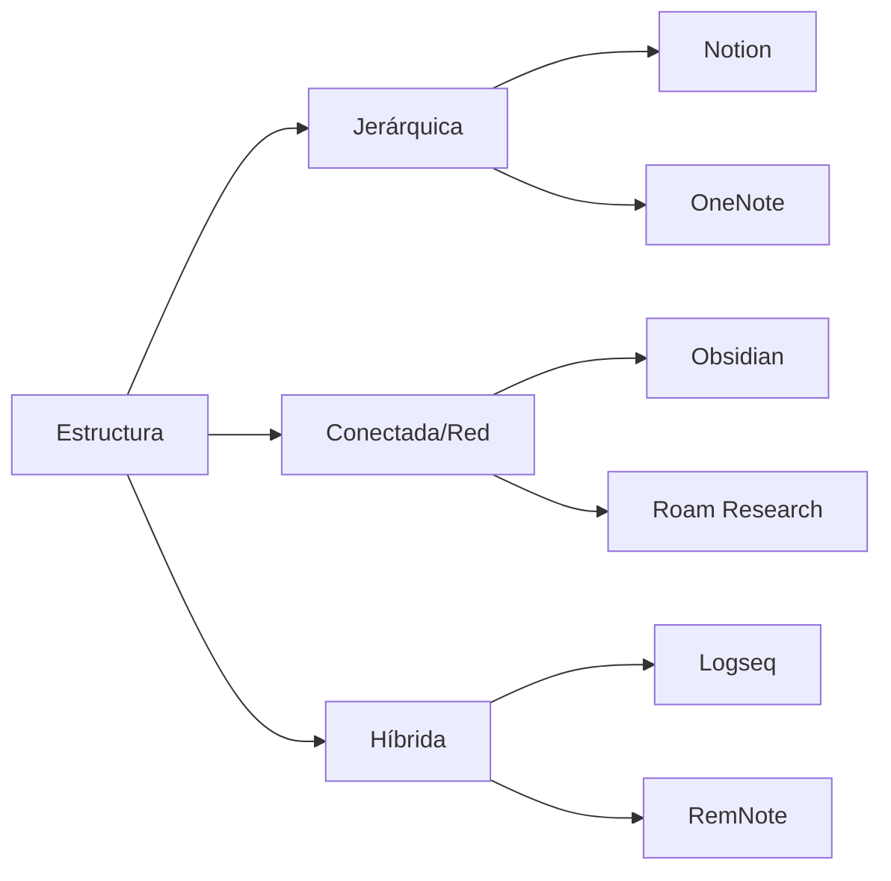
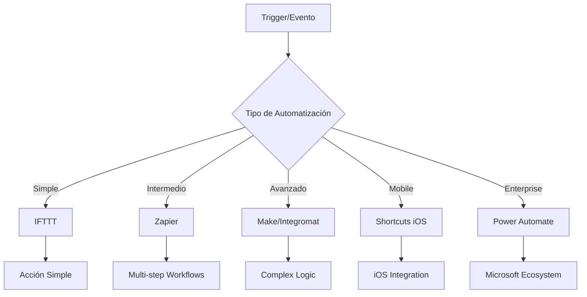
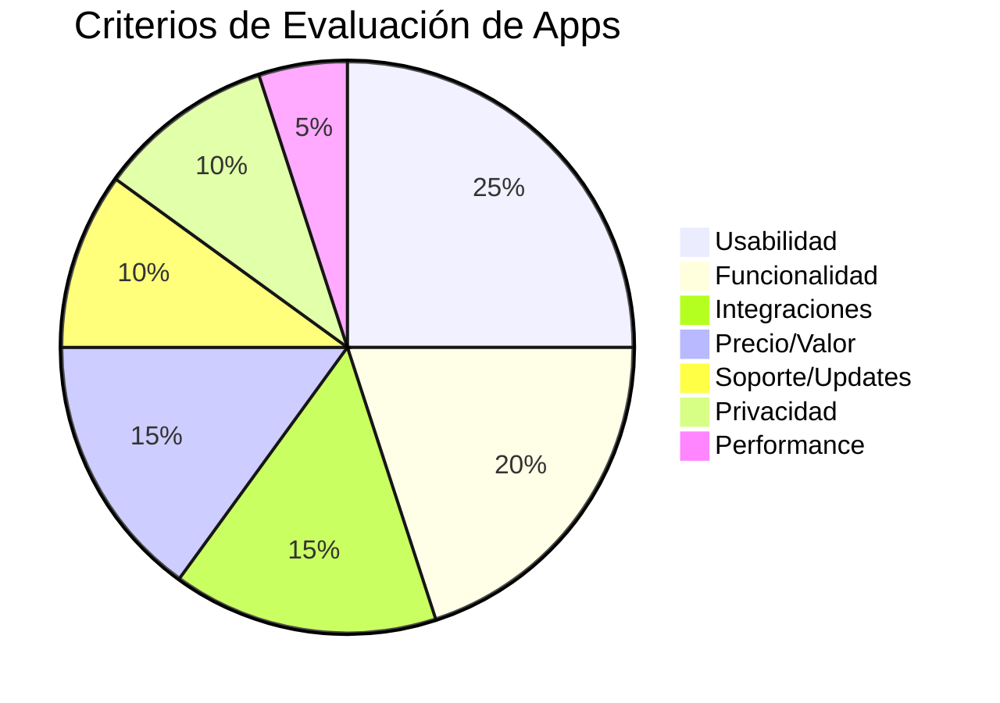

# 📱 Apps de Productividad

> [!info] 🎯 Definición Las apps de productividad son herramientas digitales diseñadas para optimizar la gestión del tiempo, organizar tareas, facilitar la colaboración y potenciar el rendimiento personal y profesional a través de interfaces intuitivas y funcionalidades especializadas.

## 🏗️ Categorías Fundamentales

> [!tip] 🧭 Navegando el Ecosistema de Apps **Task Management**: Gestión de tareas y proyectos **Note-Taking**: Captura y organización de información **Time Tracking**: Medición y análisis de tiempo **Communication**: Colaboración y comunicación eficiente **Automation**: Automatización de workflows repetitivos **Focus**: Herramientas para concentración y deep work

### 📊 Ecosistema de Productividad



## 🎯 Apps de Gestión de Tareas

> [!warning] ⚠️ Parálisis por Elección Existe una sobreabundancia de apps de tareas. La clave está en encontrar una que se alinee con tu flujo de trabajo natural, no en buscar la "perfecta".

### 📋 Comparativa Detallada

|App|Plataforma|Colaboración|Automatización|Precio|Complejidad|
|---|---|---|---|---|---|
|**Todoist**|⭐⭐⭐⭐⭐|⭐⭐⭐⭐|⭐⭐⭐|Freemium|⭐⭐⭐|
|**Things 3**|🍎 Apple|⭐|⭐⭐|Premium|⭐⭐|
|**Asana**|⭐⭐⭐⭐⭐|⭐⭐⭐⭐⭐|⭐⭐⭐⭐|Freemium|⭐⭐⭐⭐|
|**TickTick**|⭐⭐⭐⭐⭐|⭐⭐⭐|⭐⭐⭐|Freemium|⭐⭐⭐|
|**Microsoft To Do**|⭐⭐⭐⭐⭐|⭐⭐⭐⭐|⭐⭐⭐|Gratis|⭐⭐|

### 🏆 Recomendaciones por Perfil

```markdown
🎭 Matching App-Persona:

👤 **Minimalista Digital**
- Things 3 (iOS) - Diseño limpio, enfoque simple
- Microsoft To Do - Funcional sin complejidad

⚡ **Power User**
- Todoist - Filtros avanzados, integraciones
- Asana - Gestión de proyectos robusta

🎮 **Gamification Lover**
- Habitica - RPG para hábitos y tareas
- TickTick - Pomodoro integrado, logros

🤝 **Team Player**
- Asana - Colaboración avanzada
- Monday.com - Visual project management

📊 **Data Enthusiast**
- Todoist - Reportes detallados
- ClickUp - Analytics comprehensivos
```

## 📝 Apps de Toma de Notas

> [!info] 🧠 Segunda Cerebro Digital Las apps modernas de notas van más allá del texto simple, ofreciendo conexiones entre ideas, multimedia integrado y sistemas de conocimiento personal.

### 🔗 Comparativa de Sistemas PKM



### 📊 Matriz de Decisión PKM

|App|Linking|Offline|Learning Curve|Customización|Precio|
|---|---|---|---|---|---|
|**Obsidian**|⭐⭐⭐⭐⭐|⭐⭐⭐⭐⭐|⭐⭐⭐⭐|⭐⭐⭐⭐⭐|Freemium|
|**Notion**|⭐⭐⭐|⭐⭐|⭐⭐⭐⭐|⭐⭐⭐⭐|Freemium|
|**Roam Research**|⭐⭐⭐⭐⭐|⭐⭐|⭐⭐⭐⭐⭐|⭐⭐⭐|Premium|
|**Logseq**|⭐⭐⭐⭐|⭐⭐⭐⭐⭐|⭐⭐⭐|⭐⭐⭐⭐|Gratis|

## ⏱️ Apps de Gestión del Tiempo

> [!tip] 🎯 Time is Money El tiempo es el único recurso que no se puede recuperar. Las apps de tiempo te ayudan a invertirlo conscientemente, no solo gastarlo.

### 🕐 Categorías de Time Management

```markdown
⏰ Tipos de Apps de Tiempo:

🍅 **Pomodoro Apps**
- Be Focused (iOS) - Simple y elegante
- PomoDone - Integra con task managers
- Forest - Gamificación con árboles virtuales

📊 **Time Tracking Automático**
- RescueTime - Tracking pasivo multiplataforma
- Time Doctor - Monitoreo empresarial
- Toggl Track - Manual + automático

🚫 **Bloqueadores de Distracción**
- Freedom - Bloqueo cross-platform
- Cold Turkey - Poderoso bloqueador Windows
- SelfControl (Mac) - Bloqueador simple

⏳ **Calendar & Scheduling**
- Calendly - Scheduling automático
- Motion - AI calendar optimization
- Reclaim.ai - Time blocking inteligente
```

## 🤖 Apps de Automatización

> [!warning] 🔧 Automatización Inteligente La automatización debe simplificar tu vida, no complicarla. Empieza con automatizaciones simples y escala gradualmente.

### ⚡ Herramientas de Automatización



### 🎯 Automatizaciones Populares

```markdown
🤖 Top Automatizaciones:

📧 **Email & Communication**
- Email → Task creation (Gmail + Todoist)
- Meeting notes → Team channel (Zoom + Slack)
- Newsletter → Read later app (RSS + Pocket)

📊 **Data & Analytics**
- Time tracking → Spreadsheet (RescueTime + Google Sheets)
- Social media → Analytics (Instagram + Data Studio)
- Expense photos → Accounting (Receipt + QuickBooks)

📱 **Mobile Workflows**
- Location → Home automation (GPS + Smart Home)
- Photo → Cloud backup (Camera + Dropbox)
- Calendar → Focus mode (Calendar + Do Not Disturb)

💼 **Business Processes**
- Form submission → CRM (TypeForm + Salesforce)
- Invoice → Follow-up sequence (Stripe + Email)
- New customer → Onboarding (Signup + Course platform)
```

## 📞 Apps de Comunicación y Colaboración

> [!info] 🌐 Era de la Colaboración Remota Las herramientas de comunicación han evolucionado de simples mensajeros a plataformas completas de trabajo colaborativo.

### 🏢 Ecosistemas de Colaboración

|Plataforma|Chat|Video|Files|Integrations|Precio|
|---|---|---|---|---|---|
|**Slack**|⭐⭐⭐⭐⭐|⭐⭐⭐|⭐⭐⭐⭐|⭐⭐⭐⭐⭐|Freemium|
|**Microsoft Teams**|⭐⭐⭐⭐|⭐⭐⭐⭐⭐|⭐⭐⭐⭐⭐|⭐⭐⭐⭐|Freemium|
|**Discord**|⭐⭐⭐⭐⭐|⭐⭐⭐⭐|⭐⭐⭐|⭐⭐⭐|Freemium|
|**Zoom**|⭐⭐|⭐⭐⭐⭐⭐|⭐⭐|⭐⭐⭐|Freemium|

## 🎨 Apps de Creatividad y Diseño

> [!tip] 🎭 Creatividad Aumentada Las apps modernas democratizan el diseño, permitiendo que cualquiera cree contenido visual profesional sin años de entrenamiento.

### 🖼️ Suite Creativa Esencial

```markdown
🎨 Apps por Categoría Creativa:

📊 **Presentaciones & Infografías**
- Canva - Templates profesionales
- Beautiful.ai - AI-powered presentations
- Figma - Design colaborativo avanzado

📸 **Foto & Video**
- Adobe Lightroom - Edición profesional
- VSCO - Filtros y edición móvil
- DaVinci Resolve - Video editing gratuito

✏️ **Dibujo & Ilustración**
- Procreate (iPad) - Dibujo digital intuitivo
- Adobe Illustrator - Vector graphics estándar
- Affinity Designer - Alternativa profesional

🗂️ **Organización Visual**
- Milanote - Mood boards y referencias
- PureRef - Reference image organizer
- Eagle - Asset management avanzado
```

## 📊 Métricas y Evaluación de Apps

> [!warning] 📈 ROI de Productividad No todas las apps que parecen productivas realmente lo son. Mide el impacto real en tus resultados, no solo en tu sensación de estar "organizado".

### 🎯 Framework de Evaluación



### 📋 Checklist de Evaluación

```markdown
✅ **Antes de Adoptar Nueva App:**

🎯 **Necesidad Real**
□ ¿Resuelve un problema específico?
□ ¿No existe solución en apps actuales?
□ ¿El problema justifica nueva herramienta?

⚡ **Usabilidad**
□ ¿Interfaz intuitiva en primer uso?
□ ¿Learning curve aceptable?
□ ¿Disponible en todas mis plataformas?

🔄 **Integración**
□ ¿Se conecta con stack actual?
□ ¿Permite importar datos existentes?
□ ¿Exportación fácil si cambio?

💰 **Costo Total**
□ ¿Precio justo para valor proporcionado?
□ ¿Costos ocultos o aumentos futuros?
□ ¿ROI medible en productividad?
```

## 🎮 Gamificación en Apps de Productividad

> [!info] 🏆 Productividad Divertida Las mejores apps combinan eficiencia con elementos de juego para mantener el engagement a largo plazo.

### 🎯 Apps con Gamificación Nativa

```markdown
🎮 **Apps Gamificadas Destacadas:**

🐉 **Habitica**
- RPG completo para hábitos
- Parties y guilds sociales
- Rewards y penalties reales

🌳 **Forest**
- Plantar árboles virtuales/reales
- Estadísticas de bosque personal
- Competencia con amigos

📈 **Todoist**
- Karma points por completar tareas
- Streaks de productividad
- Goals y badges personales

⚡ **TickTick**
- Achievement system
- Pomodoro gamificado
- Progress tracking visual
```

## 🔒 Privacidad y Seguridad

> [!warning] 🛡️ Datos Personales en Juego Las apps de productividad manejan información sensible sobre tus hábitos, objetivos y vida personal. La privacidad debe ser prioritaria.

### 🔐 Evaluación de Privacidad

```markdown
🛡️ **Checklist de Privacidad:**

📊 **Recolección de Datos**
□ ¿Qué datos específicos recolecta?
□ ¿Política de privacidad clara?
□ ¿Vende datos a terceros?

🔒 **Seguridad**
□ ¿Encriptación end-to-end?
□ ¿2FA disponible?
□ ¿Historial de breaches?

🌍 **Jurisdicción**
□ ¿Dónde se almacenan los datos?
□ ¿Cumple GDPR/regulaciones locales?
□ ¿Derecho a portabilidad?

🏠 **Alternativas Self-Hosted**
□ ¿Versión auto-hospedada disponible?
□ ¿Código abierto auditado?
□ ¿Control total de datos?
```

## 📚 Referencias

> [!quote] Enlaces a Notas Relacionadas
> 
> - [[Productividad Digital]] - Estrategias generales que complementan las apps
> - [[Análisis de Tiempo Digital]] - Medir impacto real de las apps
> - [[Automatizaciones con IA]] - Integrar IA en workflows de apps
> - [[Gestión de Email]] - Apps específicas para comunicación
> - [[Gamificación Personal]] - Maximizar elementos de juego en apps
> - [[Organización en la Nube]] - Apps de almacenamiento y sincronización
> - [[Seguridad Digital Personal]] - Proteger datos en apps

## 📖 Notas Recomendadas

> [!info] 🔗 Para Complementar Este Tema
> 
> - [[Método 9 - Metodología GTD (Getting Things Done)]] - Implementar GTD con apps específicas
> - [[Método 1 - Pomodoro]] - Apps especializadas en técnica Pomodoro
> - [[Detox Digital]] - Balance entre productividad y bienestar
> - [[Minimalismo Digital]] - Principios para elegir menos apps, mejores
> - [[Hábitos de Estudio]] - Apps específicas para aprendizaje
> - [[Técnicas de Concentración]] - Apps de focus y bloqueo de distracciones
> - [[Neurociencia del Aprendizaje]] - Cómo las apps afectan el cerebro

---

**Tags**: #apps #productividad #herramientas #software #móvil #desktop #gestión-tareas #notas #tiempo #automatización #comunicación #colaboración #creatividad #gamificación #privacidad #evaluación #workflows