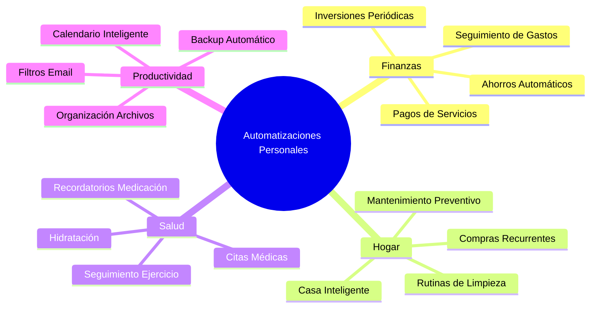
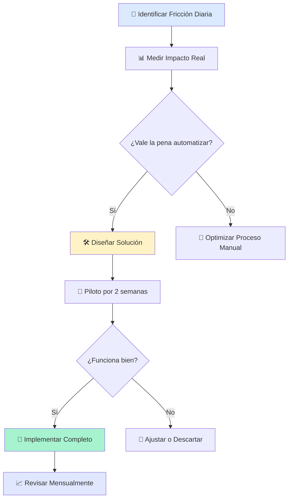

# Automatizaciones Personales 🏠

> [!tip] 💡 **Filosofía Personal** "La automatización personal no es solo sobre tecnología, es sobre diseñar una vida que funcione para ti sin esfuerzo constante."

## Fundamentos de las Automatizaciones Personales

> [!info] 📋 **¿Qué son las Automatizaciones Personales?**
> 
> Son sistemas y procesos que simplifican tu vida diaria, desde rutinas matutinas hasta gestión financiera, usando tecnología para eliminar decisiones repetitivas y crear hábitos sostenibles.
> 
> ### 🎯 **Áreas de Impacto:**
> 
> - 🏠 **Hogar**: Limpieza, organización, mantenimiento
> - 💰 **Finanzas**: Ahorros, inversiones, pagos
> - 🎯 **Hábitos**: Ejercicio, alimentación, sueño
> - 📱 **Digital**: Notificaciones, backups, organización

> [!warning] ⚠️ **Precauciones Importantes**
> 
> - No automatices decisiones que requieren reflexión personal
> - Mantén control sobre automatizaciones financieras críticas
> - Revisa periódicamente que las automatizaciones sigan siendo útiles
> - Ten planes de respaldo para fallos del sistema

## Mapa de Automatizaciones Vitales



## Categorías de Automatización Personal

> [!example] 💰 **Automatizaciones Financieras**
> 
> ### 🏦 **Gestión Bancaria:**
> 
> |Automatización|Herramienta|Frecuencia|Beneficio|
> |---|---|---|---|
> |**Ahorro automático** 💸|Banco/Apps|Mensual|Disciplina financiera|
> |**Pago de servicios** 🧾|Domiciliación|Mensual|Evita olvidos/recargos|
> |**Inversiones DCA** 📈|Broker/Apps|Semanal|Promedio de costos|
> |**Categorización gastos** 📊|Mint/YNAB|Diaria|Control presupuestario|
> 
> ### 💡 **Tips de Implementación:**
> 
> - Empieza con pequeños montos automáticos
> - Revisa y ajusta trimestralmente
> - Mantén un fondo de emergencia manual

> [!example] 🏠 **Automatizaciones del Hogar**
> 
> ### 🤖 **Casa Inteligente:**
> 
> - **🌡️ Termostato**: Ajustes por horario y ocupación
> - **💡 Iluminación**: Encendido/apagado automático
> - **🔒 Seguridad**: Alertas y monitoreo
> - **🎵 Audio**: Música por zonas y horarios
> 
> ### 📋 **Rutinas Domésticas:**
> 
> ```mermaid
> gantt
>     title Rutinas Automatizadas Semanales
>     dateFormat  X
>     axisFormat %a
>     
>     section Limpieza
>     Robot aspiradora    :0, 2
>     Lavadora           :1, 1
>     Lavavajillas       :0, 7
>     
>     section Compras
>     Supermercado online :6, 1
>     Productos limpieza  :0, 1
>     
>     section Mantenimiento
>     Revisión plantas   :2, 1
>     Filtros aire       :0, 1
> ```

> [!example] 🎯 **Automatizaciones de Hábitos**
> 
> ### 🏃‍♂️ **Salud y Bienestar:**
> 
> - **💊 Medicación**: Alarmas inteligentes con seguimiento
> - **💧 Hidratación**: Recordatorios cada 2 horas
> - **🚶‍♂️ Ejercicio**: Bloques automáticos en calendario
> - **😴 Sueño**: Modo nocturno automático en dispositivos
> 
> ### 📱 **Herramientas Recomendadas:**
> 
> - **iOS**: Shortcuts + Health App
> - **Android**: Tasker + Google Fit
> - **Wearables**: Apple Watch, Fitbit automations
> - **Apps**: Habitica, Streaks, Forest

## Flujo de Diseño de Automatización Personal



## Herramientas por Plataforma

> [!info] 📱 **Automatizaciones Móviles**
> 
> ### **iOS Shortcuts:**
> 
> ```
> Rutina Matutina:
> 1. Desactivar modo nocturno
> 2. Leer clima del día
> 3. Abrir app de meditación
> 4. Crear nota diaria
> 5. Revisar calendario
> ```
> 
> ### **Android Tasker:**
> 
> - Silenciar teléfono en reuniones automáticamente
> - Activar WiFi al llegar a casa
> - Backup de fotos cuando se conecta a WiFi

> [!info] 🏠 **Ecosistemas de Casa Inteligente**
> 
> |Ecosistema|Fortalezas|Ideal para|
> |---|---|---|
> |**Apple HomeKit** 🍎|Privacidad, integración iOS|Usuarios Apple|
> |**Google Home** 🏠|IA, reconocimiento voz|Usuarios Android|
> |**Amazon Alexa** 🗣️|Amplio catálogo dispositivos|Presupuesto variado|
> |**Home Assistant** 🔧|Control total, código abierto|Técnicos avanzados|

## Sistema de Evaluación Personal

> [!note] 📊 **Matriz de Priorización VIDA**
> 
> Evalúa cada automatización potencial:
> 
> - **V** - **Valor**: ¿Cuánto tiempo/esfuerzo me ahorra? (1-10)
> - **I** - **Implementación**: ¿Qué tan fácil es de configurar? (1-10)
> - **D** - **Durabilidad**: ¿Funcionará a largo plazo? (1-10)
> - **A** - **Adaptabilidad**: ¿Se ajusta a cambios en mi vida? (1-10)
> 
> **Fórmula**: `Puntuación = (V × 3) + (I × 2) + (D × 2) + (A × 1)`
> 
> - 30-40: Implementar inmediatamente
> - 20-29: Considerar seriamente
> - 10-19: Quizás más adelante
> - <10: Probablemente no vale la pena

## Templates de Planificación

> [!tip] 📋 **Template: Análisis de Automatización Personal**
> 
> ```markdown
> ## Automatización: [NOMBRE]
> 
> ### Problema Actual:
> - Situación: [Qué me molesta/consume tiempo]
> - Frecuencia: [Cuántas veces al día/semana]
> - Tiempo invertido: [Minutos por instancia]
> 
> ### Solución Propuesta:
> - Herramienta: [Qué usaré]
> - Configuración: [Pasos básicos]
> - Tiempo de setup: [Estimado]
> 
> ### Evaluación VIDA:
> - Valor: [1-10]
> - Implementación: [1-10]  
> - Durabilidad: [1-10]
> - Adaptabilidad: [1-10]
> - **Total: [Puntuación]**
> 
> ### Plan de Acción:
> - [ ] Investigar herramientas
> - [ ] Configurar piloto
> - [ ] Probar 2 semanas
> - [ ] Evaluar resultados
> - [ ] Decidir implementación
> ```

## Técnica de Estudio: HÁBITO

> [!note] 🧠 **Mnemotécnica HÁBITO para Recordar el Proceso**
> 
> - **H** - **Habitual**: ¿Es algo que hago repetidamente?
> - **Á** - **Ágil**: ¿La automatización será más rápida?
> - **B** - **Beneficioso**: ¿Realmente me ayuda?
> - **I** - **Implementable**: ¿Puedo configurarlo fácilmente?
> - **T** - **Testeable**: ¿Puedo probarlo antes de comprometer?
> - **O** - **Optimizable**: ¿Puedo mejorarlo con el tiempo?
> 
> ### 🔄 **Método de Revisión Semanal:**
> 
> Cada domingo, revisa 3 automatizaciones:
> 
> 1. Una que funciona bien (¿se puede optimizar?)
> 2. Una que no funciona (¿se puede arreglar?)
> 3. Una nueva oportunidad (¿qué me molestó esta semana?)

## Referencias

> [!quote] 🔗 **Notas Relacionadas**
> 
> - [[Hábitos de Estudio]] - Para automatizar rutinas de aprendizaje
> - [[Gestión del Tiempo]] - Complementa con automatizaciones
> - [[Productividad Digital]] - Herramientas y apps
> - [[Minimalismo Digital]] - Reduce antes de automatizar
> - [[Biohacking Personal]] - Automatizaciones para salud

## Notas Recomendadas

> [!info] 📚 **Para Complementar este Tema**
> 
> ### **Prerrequisitos:**
> 
> - [[Gestión del Tiempo]] - Entender dónde se va tu tiempo
> - [[Minimalismo Digital]] - Simplificar antes de automatizar


---

**Tags:** #automatizacion #personal #habitos #productividad #casa-inteligente #finanzas #tecnologia #lifestyle #sistemas #optimizacion