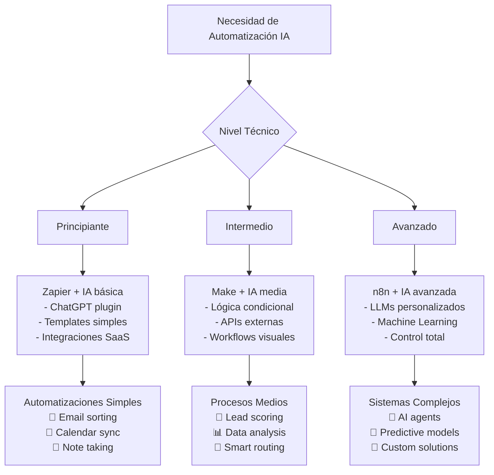

# 🤖 Automatizaciones con Inteligencia Artificial

## 🎯 Fundamentos de la Automatización IA

> [!info] Definición La automatización con IA combina flujos de trabajo programados con capacidades de inteligencia artificial para crear sistemas que no solo ejecutan tareas repetitivas, sino que también toman decisiones inteligentes, aprenden de patrones y se adaptan a contextos cambiantes.

> [!tip] Principios Fundamentales
> 
> - 🧠 **Inteligencia adaptativa**: Los workflows evolucionan según los datos
> - 🔄 **Procesamiento contextual**: IA que entiende situaciones específicas
> - 📊 **Análisis continuo**: Optimización automática de procesos
> - 🎯 **Personalización dinámica**: Respuestas adaptadas al usuario
> - ⚡ **Ejecución proactiva**: Anticipación de necesidades
> - 🔗 **Integración omnicanal**: Conectar todos los sistemas

## 🚀 Casos de Uso Transformadores

### 💼 Productividad Personal

> [!example] Escenarios Prácticos **Gestión de Email Inteligente:**
> 
> - Clasificación automática por prioridad e intención
> - Respuestas sugeridas contextualmente relevantes
> - Programación de seguimientos basada en importancia
> - Extracción de tareas desde emails (ver [[Gestión del Tiempo]])
> 
> **Planificación y Scheduling:**
> 
> - Análisis de patrones de productividad personal
> - Optimización automática de calendarios
> - Bloqueo inteligente de tiempo para [[Deep Work]]
> - Ajuste dinámico según energía y contexto
> 
> **Gestión de Información:**
> 
> - Resumen automático de artículos y documentos
> - Categorización inteligente de notas (ver [[Hábitos de Estudio]])
> - Creación de conexiones entre conceptos
> - Alertas proactivas sobre temas de interés

### 🏢 Automatización Empresarial

> [!example] Procesos de Negocio **Atención al Cliente:**
> 
> - Chatbots con comprensión de contexto emocional
> - Escalado inteligente a agentes humanos
> - Análisis de sentiment en tiempo real
> - Personalización de respuestas por historial
> 
> **Marketing y Ventas:**
> 
> - Segmentación dinámica de audiencias
> - Generación de contenido personalizado
> - Optimización automática de campañas
> - Lead scoring predictivo
> 
> **Operaciones y Finanzas:**
> 
> - Detección de anomalías en gastos
> - Pronósticos automáticos de cash flow
> - Reconciliación inteligente de cuentas
> - Compliance automático con regulaciones

## 🛠️ Plataformas y Herramientas Clave

### 🎯 Comparativa de Plataformas Principales

> [!tip] n8n - La Plataforma Más Poderosa para IA **Ventajas Técnicas:**
> 
> - Implementación nativa de LangChain con aproximadamente 70 nodos dedicados a funcionalidades de IA
> - Herramienta gratuita y open source para automatización de workflows
> - Control total sobre datos y procesos
> - Capacidades avanzadas de procesamiento de IA
> - Integración directa con LLMs y modelos personalizados
> 
> **Casos de Uso Ideales:**
> 
> - Workflows complejos con múltiples decisiones IA
> - Procesamiento de documentos con OCR y NLP
> - Análisis predictivo y machine learning
> - Sistemas de recomendación personalizados
> - Agentes IA conversacionales avanzados

> [!info] Make (Formerly Integromat) - Balance Potencia-Usabilidad **Características Destacadas:**
> 
> - Interface visual intuitiva con nodos drag-and-drop
> - Enfoque intermedio entre simplicidad y potencia
> - Capacidades IA integradas para tareas comunes
> - Plantillas pre-construidas para casos típicos
> - Debugging visual para workflows complejos
> 
> **Ideal Para:**
> 
> - Usuarios semi-técnicos que necesitan potencia
> - Automatizaciones con lógica condicional media
> - Integración con herramientas de marketing
> - Procesamiento de datos con transformaciones IA

> [!info] Zapier - Simplicidad y Adopción Masiva **Fortalezas Principales:**
> 
> - Conocido por su simplicidad y facilidad de uso, incluso para usuarios no técnicos
> - Ofrece la forma más accesible de integrar capacidades básicas de IA en workflows simples
> - Mayor ecosistema de integraciones (7000+ apps)
> - Curva de aprendizaje mínima
> - Soporte y documentación extensivos
> 
> **Mejor Para:**
> 
> - Automatizaciones simples con IA básica
> - Conectar herramientas SaaS populares
> - Equipos sin conocimientos técnicos
> - Prototipado rápido de ideas

### 🧰 Herramientas de IA Especializadas

> [!tip] Herramientas por Categoría **Procesamiento de Texto y Documentos:**
> 
> - **ChatGPT API**: Asistencia general y procesamiento de lenguaje natural
> - **Claude API**: Análisis profundo y razonamiento complejo
> - **GPT-4 Vision**: Extracción de datos de imágenes y documentos
> - **OpenAI Whisper**: Transcripción automática de audio
> 
> **Gestión de Datos y Analytics:**
> 
> - **Power BI con IA**: Análisis de grandes volúmenes de datos para detectar tendencias
> - **Tableau con Einstein**: Insights automáticos en dashboards
> - **DataRobot**: AutoML para modelos predictivos
> - **H2O.ai**: Análisis avanzado sin código
> 
> **Creatividad y Contenido:**
> 
> - **Midjourney API**: Creación de imágenes con IA
> - **Synthesia**: Generación de videos con avatares IA
> - **Canva AI**: Diseño gráfico automatizado con funciones de IA
> - **Copy.ai**: Generación de textos de marketing
> 
> **Productividad y Colaboración:**
> 
> - **Notion AI**: Herramienta de productividad que va más allá de notas y gestión de proyectos
> - **ClickUp AI**: Asistente de escritura accesible en todas las áreas del workspace
> - **Fathom**: Toma de notas automatizada en reuniones
> - **Asana Intelligence**: Automatización inteligente de gestión de proyectos



## 🎨 Blueprints de Automatización IA

### 📧 Sistema de Email Inteligente

> [!example] Workflow: Procesamiento Automático de Inbox **Componentes del Sistema:**
> 
> 1. **Detección y Clasificación**
> 
> - Conexión IMAP/Gmail API
>     
> - Análisis de contenido con GPT-4
>     
> - Clasificación por urgencia, categoría y emisor
>     
> - Detección de spam y phishing
>     
> 
> 2. **Procesamiento Inteligente**
> 
> - Extracción de fechas, tareas y compromisos
>     
> - Identificación de requests que requieren acción
>     
> - Generación de resúmenes para emails largos
>     
> - Análisis de sentiment del remitente
>     
> 
> 3. **Acciones Automatizadas**
> 
> - Creación automática de tareas en [[Gestión del Tiempo]]
> - Programación de recordatorios inteligentes
> - Respuestas automáticas contextuales
> - Reenvío a personas relevantes con contexto

> [!code] Ejemplo de Configuración (n8n)
> 
> ```json
> {
>  "workflow": "Smart Email Processing",
>  "triggers": [
>    {
>      "type": "Gmail Trigger",
>      "filter": "is:unread"
>    }
>  ],
>  "nodes": [
>    {
>      "name": "Content Analysis",
>      "type": "OpenAI GPT-4",
>      "prompt": "Analyze this email and classify: urgency (1-5), category, key points, required actions"
>    },
>    {
>      "name": "Decision Router",
>      "type": "Switch",
>      "conditions": [
>        {"urgency": ">= 4", "action": "immediate_notification"},
>        {"category": "meeting", "action": "calendar_creation"},
>        {"contains_task": true, "action": "task_creation"}
>      ]
>    }
>  ]
> }
> ```

### 📊 Dashboard de Productividad Inteligente

> [!example] Sistema de Métricas Personales con IA **Fuentes de Datos:**
> 
> - Time tracking apps (RescueTime, Toggl)
> - Calendar data (Google Calendar, Outlook)
> - Task completion (Todoist, ClickUp)
> - Health metrics (Apple Health, Fitbit)
> - Communication patterns (Slack, email volume)
> 
> **Análisis IA:**
> 
> - Correlación entre energía física y productividad
> - Identificación de patrones de distracción
> - Predicción de días de alta/baja performance
> - Recomendaciones personalizadas de horarios
> - Alertas proactivas sobre burnout potential
> 
> **Acciones Automatizadas:**
> 
> - Ajuste dinámico de [[Tracking de Hábitos]]
> - Bloqueo automático de tiempo para tareas críticas
> - Sugerencias de breaks basadas en datos biométricos
> - Optimización de reuniones según niveles de energía

### 🎯 Asistente de Investigación Personal

> [!example] Sistema de Knowledge Management con IA **Ingesta Automática:**
> 
> - RSS feeds de fuentes relevantes
> - Newsletters y publicaciones académicas
> - Videos de YouTube (transcripción automática)
> - Podcasts (análisis de contenido)
> - Social media (Twitter threads, LinkedIn posts)
> 
> **Procesamiento Inteligente:**
> 
> - Resumen automático de contenido largo
> - Extracción de insights clave y quotes
> - Conexión con conocimiento existente (ver [[Metacognición]])
> - Identificación de tendencias emergentes
> - Generación de preguntas de seguimiento
> 
> **Distribución Personalizada:**
> 
> - Digest diario personalizado por intereses
> - Alertas sobre topics específicos
> - Recomendaciones de lectura basadas en objetivos (ver [[Objetivos 2025]])
> - Auto-actualización de notas relevantes

## 🔧 Implementación Práctica

### 🚀 Metodología de Despliegue

> [!tip] Proceso de Implementación Escalable **Fase 1: Fundación (Semana 1-2)**
> 
> - Audit de procesos manuales actuales
> - Identificación de quick wins con alto ROI
> - Setup de plataforma principal (Zapier para principiantes)
> - Implementación de 1-2 automatizaciones básicas
> - Training en herramientas fundamentales
> 
> **Fase 2: Expansión (Semana 3-8)**
> 
> - Migración a plataforma más potente (Make/n8n)
> - Integración de APIs de IA (OpenAI, Claude)
> - Desarrollo de workflows de complejidad media
> - Implementación de sistema de monitoreo
> - Documentación de procesos y troubleshooting
> 
> **Fase 3: Optimización (Mes 3+)**
> 
> - Análisis de performance y costos
> - Implementación de machine learning personalizado
> - Desarrollo de agentes IA especializados
> - Integración con sistemas empresariales
> - Escalado y mantenimiento proactivo

### 📏 Métricas y KPIs

> [!info] Indicadores de Éxito **Eficiencia Operacional:**
> 
> - **Tiempo ahorrado por semana**: Meta >10 horas
> - **Tareas automatizadas**: % de trabajo repetitivo eliminado
> - **Errores reducidos**: Comparación pre/post automatización
> - **Velocidad de procesamiento**: Tiempo de respuesta mejorado
> 
> **Calidad de Resultados:**
> 
> - **Precisión de clasificaciones IA**: >95% accuracy
> - **Relevancia de insights generados**: User satisfaction score
> - **Proactividad del sistema**: Alertas útiles vs. ruido
> - **Adaptabilidad**: Mejora continua sin intervención manual
> 
> **ROI y Sostenibilidad:**
> 
> - **Costo por tarea automatizada**: Comparación con trabajo manual
> - **Tiempo de payback**: Recuperación de inversión inicial
> - **Escalabilidad**: Capacidad de manejar volumen creciente
> - **Mantenimiento requerido**: Horas semanales de ajustes

### 🛡️ Seguridad y Compliance

> [!warning] Consideraciones Críticas de Seguridad **Protección de Datos:**
> 
> - Encriptación end-to-end para datos sensibles (ver [[Seguridad Digital Personal]])
> - Tokens de API con permisos mínimos necesarios
> - Rotación regular de credenciales de acceso
> - Logs de auditoría para todas las automatizaciones
> - Backup y recovery procedures para workflows críticos
> 
> **Compliance y Privacidad:**
> 
> - GDPR compliance para procesamiento de datos personales
> - Retención policies para información procesada
> - Right to deletion en sistemas automatizados
> - Transparencia sobre uso de IA en decisiones
> - Consent management para datos de terceros
> 
> **Gestión de Riesgos:**
> 
> - Fallback procedures para cuando la IA falla
> - Human oversight para decisiones críticas
> - Rate limiting para prevenir spam o abuse
> - Monitoring de costos para evitar runaway charges
> - Testing riguroso antes de production deployment

## 🔮 Tendencias y Futuro

### 🚀 Innovaciones Emergentes 2025

> [!info] Tecnologías Disruptivas **Agentes IA Autónomos:**
> 
> - Sistemas que pueden tomar decisiones complejas sin supervisión
> - Capacidad de aprendizaje continuo desde interacciones
> - Coordinación entre múltiples agentes especializados
> - Ejecución de tareas de alto nivel con objetivos generales
> 
> **Multimodal AI Integration:**
> 
> - Procesamiento simultáneo de texto, imagen, audio y video
> - Comprensión contextual cruzada entre modalidades
> - Generación de contenido multimedia coordinado
> - Interfaces naturales voz-texto-visual
> 
> **Edge AI y Processing Local:**
> 
> - Modelos IA que corren completamente offline
> - Latencia ultrabaja para automatizaciones críticas
> - Privacidad total sin envío de datos a cloud
> - Integración con IoT y dispositivos inteligentes

### 🎯 Impacto en Productividad Personal

> [!tip] Evolución de Workflows **De Automatización a Augmentación:**
> 
> - IA como co-piloto en lugar de simple herramienta
> - Anticipación proactiva de necesidades del usuario
> - Personalización dinámica basada en contexto y estado
> - Coaching inteligente para mejora continua
> 
> **Democratización de Capacidades Avanzadas:**
> 
> - No-code access a tecnologías enterprise-grade
> - Templates inteligentes que se auto-optimizan
> - Marketplaces de workflows especializados por industria
> - Collaborative intelligence entre humanos y AI agents

### 📈 Preparación para el Futuro

> [!tip] Estrategias de Adopción Temprana **Skills Development:**
> 
> - Prompt engineering para maximizar efectividad de IA
> - Understanding de capacidades y limitaciones actuales
> - Data literacy para alimentar sistemas inteligentes
> - Systems thinking para arquitecturas complejas
> 
> **Infrastructure Preparation:**
> 
> - APIs-first approach en todas las herramientas
> - Data standardization y clean datasets
> - Monitoring y observability desde el diseño
> - Modular architecture para fácil evolución
> 
> **Mindset Evolution:**
> 
> - Shift de "doing tasks" a "orchestrating intelligence"
> - Comfort con sistemas que aprenden y cambian
> - Focus en high-value creative work
> - Continuous learning como core competency

## 🎯 Conclusiones Actionables

> [!tip] Primeros Pasos Inmediatos **Esta Semana:**
> 
> - [ ] Auditar 3 procesos repetitivos que haces diariamente
> - [ ] Crear cuenta en Zapier o Make para testing inicial
> - [ ] Configurar tu primera automatización simple (email → task)
> - [ ] Explorar templates de IA en tu plataforma elegida
> 
> **Este Mes:**
> 
> - [ ] Implementar sistema de email inteligente básico
> - [ ] Conectar tus principales herramientas de productividad
> - [ ] Establecer métricas para medir impacto de automatizaciones
> - [ ] Documentar workflows para futura optimización
> 
> **Próximos 3 Meses:**
> 
> - [ ] Migrar a plataforma más avanzada si es necesario
> - [ ] Desarrollar agente IA personalizado para tu dominio
> - [ ] Integrar análisis predictivo en tus procesos clave
> - [ ] Establecer sistema de mejora continua automatizada

> [!quote] Principio Guía "La automatización con IA no se trata de reemplazar el trabajo humano, sino de amplificar la inteligencia humana. El objetivo es liberar tiempo y energía mental para el trabajo que realmente importa: la creatividad, la estrategia y las conexiones humanas significativas."

>[!quote] **Recursos para Profundizar:**
>- 🔗 [n8n Workflows Community](https://n8n.io/workflows/) - 2198 plantillas automatizadas de la comunidad global
>- 🔗 [Make Academy](https://www.make.com/en/academy) - Cursos estructurados de automatización
>- 🔗 [Zapier University](https://zapier.com/university) - Training gratuito en automatización
>- 🔗 [OpenAI API Documentation](https://platform.openai.com/docs) - Integración de capacidades IA
>- 🔗 [LangChain Documentation](https://docs.langchain.com/) - Framework para aplicaciones IA

---

> [!info] Conexiones con Otras Áreas Esta guía conecta directamente con:
> 
> - [[Seguridad Digital Personal]] - Para proteger tus automatizaciones
> - [[Productividad Digital]] - Para integrar con tus sistemas actuales
> - [[Gestión del Tiempo]] - Para automatizar planning y scheduling
> - [[Deep Work]] - Para crear espacios protegidos mediante IA
> - [[Análisis de Tiempo]] - Para métricas y optimización continua
> - [[Objetivos 2025]] - Para alinear automatizaciones con metas personales