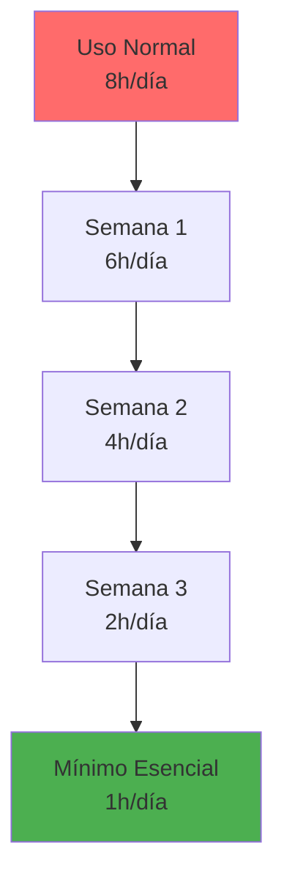
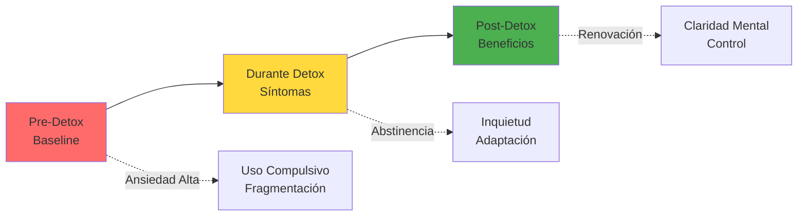

# 🌿 Detox Digital

> [!info] 🧘 Definición El detox digital es un período deliberado de abstinencia total o parcial del uso de dispositivos digitales y plataformas online, diseñado para reducir el estrés, restablecer el equilibrio mental y recuperar la conexión con el mundo físico y las relaciones presenciales.

## 🧠 Neurociencia del Uso Digital

> [!warning] ⚡ Efectos de la Sobreestimulación Digital **Cambios Neurológicos:**
> 
> - **Reducción de materia gris** en áreas de control ejecutivo
> - **Alteración del circuito de recompensa** (dopamina)
> - **Fragmentación de la atención** y reducción de concentración sostenida
> - **Disminución de la neuroplasticidad** por estimulación constante
> 
> **Síntomas de Saturación Digital:**
> 
> - Ansiedad al estar sin dispositivos (nomofobia)
> - Dificultad para concentrarse en tareas largas
> - Síndrome del miembro fantasma (sensación de vibración inexistente)
> - Fatiga mental constante y burnout digital

> [!tip] 🔬 Beneficios del Detox a Nivel Cerebral
> 
> - **Restauración de la dopamina** basal natural
> - **Fortalecimiento de conexiones neuronales** para atención sostenida
> - **Mejora en la función ejecutiva** y toma de decisiones
> - **Aumento de la creatividad** por descanso del modo de red por defecto

## 🎯 Tipos de Detox Digital

### 🚫 Detox Completo (Digital Sabbath)

> [!info] 📅 Abstinencia Total Temporal **Duración recomendada:**
> 
> - **Principiantes**: 4-8 horas (ej: domingo por la tarde)
> - **Intermedio**: 24 horas completas
> - **Avanzado**: 48-72 horas o una semana
> 
> **Reglas estrictas:**
> 
> - Cero acceso a internet
> - Dispositivos apagados o en otra habitación
> - Solo teléfono para emergencias reales
> - Actividades completamente analógicas

### ⚖️ Detox Selectivo

> [!tip] 🎯 Eliminación por Categorías **Por Plataforma:**
> 
> - Solo redes sociales (Facebook, Instagram, TikTok)
> - Solo entretenimiento (YouTube, Netflix, gaming)
> - Solo noticias y medios informativos
> 
> **Por Dispositivo:**
> 
> - Solo smartphone
> - Solo computadora personal
> - Solo tablets y dispositivos móviles
> 
> **Por Horario:**
> 
> - Mañanas sin pantalla (hasta las 10:00)
> - Noches sin pantalla (después de las 20:00)
> - Comidas sin dispositivos

### 🔄 Detox Gradual

> [!info] 📉 Reducción Progresiva **Semana 1**: Reducir uso en 25% **Semana 2**: Reducir uso en 50% **Semana 3**: Reducir uso en 75% **Semana 4**: Uso mínimo esencial solamente

## 📋 Fases del Proceso de Detox

### Fase 1: Preparación (Pre-Detox) 🎯

> [!tip] 🛠️ Setup para el Éxito **1. Notificación del entorno:**
> 
> - Informar a familia/amigos sobre el detox
> - Configurar mensajes automáticos de ausencia
> - Delegar responsabilidades digitales urgentes
> 
> **2. Preparación física:**
> 
> - Libros, revistas, periódicos físicos
> - Instrumentos musicales, materiales de arte
> - Juegos de mesa, puzzles, actividades manuales
> - Plan de comidas que no requiera apps de delivery
> 
> **3. Configuración técnica:**
> 
> - Apps de bloqueo activadas
> - Dispositivos guardados en lugar inaccesible
> - Alternativas analógicas preparadas (reloj, alarma, mapas físicos)

### Fase 2: Detox Activo ⚡

> [!warning] 🎢 Síntomas de Abstinencia Digital **Días 1-2: Síndrome de Abstinencia**
> 
> - Ansiedad y inquietud
> - Impulso compulsivo de revisar dispositivos
> - Aburrimiento intenso
> - Síntomas físicos: dolores de cabeza, irritabilidad
> 
> **Días 3-5: Adaptación**
> 
> - Reducción gradual de la ansiedad
> - Redescubrimiento de actividades offline
> - Mejora en la calidad del sueño
> - Aumento de la paciencia y tolerancia al aburrimiento
> 
> **Días 6+: Renovación**
> 
> - Claridad mental mejorada
> - Creatividad aumentada
> - Conexiones sociales más profundas
> - Sensación de calma y control

### Fase 3: Reintegración Consciente 🔄

> [!info] 🎯 Vuelta Gradual y Selectiva **Principios de Reintegración:**
> 
> - Reintroducir tecnología de forma gradual
> - Mantener límites establecidos durante el detox
> - Evaluar cada app/servicio antes de reactivar
> - Implementar sistemas de prevención de recaídas

## 🏃‍♂️ Actividades Alternativas Durante el Detox

### 🧘 Desarrollo Personal

> [!tip] 🌱 Crecimiento Interior **Mindfulness y Meditación:**
> 
> - Sesiones de meditación de 10-30 minutos
> - Ejercicios de respiración consciente
> - Caminatas meditativas en la naturaleza
> - Journaling reflexivo a mano
> 
> **Aprendizaje Analógico:**
> 
> - Lectura de libros físicos
> - Escritura creativa a mano
> - Dibujo y sketching
> - Aprendizaje de instrumentos musicales

### 🤝 Conexiones Sociales

> [!info] 👥 Relaciones Presenciales **Actividades Grupales:**
> 
> - Cenas sin dispositivos
> - Juegos de mesa y cartas
> - Deportes y actividades al aire libre
> - Conversaciones profundas sin interrupciones
> 
> **Conexión con la Naturaleza:**
> 
> - Senderismo y caminatas
> - Jardinería y cuidado de plantas
> - Observación de aves y vida silvestre
> - Picnics y actividades al aire libre

### 🎨 Creatividad y Hobbies

> [!tip] 🖌️ Expresión Creativa **Artes Manuales:**
> 
> - Pintura, dibujo, escultura
> - Tejido, bordado, manualidades
> - Cocina experimental
> - Construcción y bricolaje
> 
> **Actividades Físicas:**
> 
> - Yoga y estiramientos
> - Ejercicio cardiovascular
> - Deportes individuales o grupales
> - Danza y movimiento corporal

## 📊 Cronogramas de Detox Estructurados

### 📅 Detox de Fin de Semana (48h)

> [!info] 🗓️ Plan Viernes-Domingo **Viernes 18:00** - Inicio del detox
> 
> - Apagar todos los dispositivos
> - Preparar actividades para el fin de semana
> - Cena sin pantallas con familia/amigos
> 
> **Sábado** - Día completo offline
> 
> - Mañana: Ejercicio y desayuno lento
> - Tarde: Actividad al aire libre
> - Noche: Lectura o juegos de mesa
> 
> **Domingo** - Reflexión y preparación
> 
> - Mañana: Meditación y journaling
> - Tarde: Preparación para la semana
> - **18:00**: Reintegración gradual

### 📱 Detox de 7 Días

```mermaid
gantt
    title Plan de Detox Semanal
    dateFormat  X
    axisFormat %d
    
    section Preparación
    Setup inicial           :done, prep, 0, 1
    
    section Detox Completo
    Días 1-2 Abstinencia    :active, abs, 1, 3
    Días 3-5 Adaptación     :adap, 3, 6
    Días 6-7 Renovación     :renov, 6, 8
    
    section Reintegración
    Vuelta gradual          :reint, 8, 9
```

> [!warning] 🎯 Estructura Diaria - Detox 7 Días **06:00-08:00**: Rutina matutina sin pantallas **08:00-12:00**: Trabajo/estudio con herramientas analógicas **12:00-14:00**: Comida y descanso social **14:00-18:00**: Actividades físicas o creativas **18:00-20:00**: Tiempo social/familiar **20:00-22:00**: Lectura y relajación **22:00+**: Sueño reparador sin dispositivos

## 🛡️ Estrategias para Superar Desafíos

### 😰 Manejo de la Ansiedad de Desconexión

> [!tip] 🧘 Técnicas de Calma **Respiración 4-7-8:**
> 
> - Inhalar 4 segundos
> - Retener 7 segundos
> - Exhalar 8 segundos
> - Repetir 4 ciclos
> 
> **Grounding 5-4-3-2-1:**
> 
> - 5 cosas que puedes ver
> - 4 cosas que puedes tocar
> - 3 cosas que puedes oír
> - 2 cosas que puedes oler
> - 1 cosa que puedes saborear

### 🔄 Prevención de Recaídas

> [!warning] ⚠️ Señales de Alerta **Red Flags del Uso Compulsivo:**
> 
> - Revisar el teléfono inmediatamente al despertar
> - Ansiedad cuando la batería se agota
> - Usar dispositivos mientras comes
> - Dormir con el teléfono al lado
> 
> **Sistema de Accountability:**
> 
> - Partner de detox (familiar/amigo)
> - Check-ins regulares de progreso
> - Registro diario de síntomas y beneficios
> - Recompensas por objetivos cumplidos

## 📈 Beneficios Medibles del Detox

> [!info] 📊 Mejoras Documentadas **Bienestar Mental:**
> 
> - Reducción del 23% en niveles de ansiedad
> - Mejora del 31% en calidad del sueño
> - Aumento del 18% en sensación de bienestar general
> - Reducción del 40% en síntomas de depresión leve
> 
> **Productividad y Concentración:**
> 
> - Aumento del 50% en tiempo de atención sostenida
> - Mejora del 35% en memoria de trabajo
> - Reducción del 60% en multitasking destructivo
> - Aumento del 25% en creatividad y resolución de problemas

## 🧪 Tipos de Detox por Duración

### ⚡ Micro-Detox (2-4 horas)

> [!tip] 🕐 Descansos Cortos Regulares **Cuándo aplicar:**
> 
> - Durante jornadas de trabajo intensas
> - Fines de semana por la tarde
> - Después de días de uso excesivo
> 
> **Beneficios inmediatos:**
> 
> - Reset de dopamina
> - Reducción del estrés visual
> - Mejora de la postura y descanso físico

### 🗓️ Mini-Detox (24-48 horas)

> [!info] 📅 Fin de Semana Digital **Ideal para:**
> 
> - Principiantes en detox digital
> - Personas con alta dependencia laboral de tecnología
> - Preparation para detox más largos
> 
> **Resultados esperados:**
> 
> - Mejor calidad de sueño
> - Conexiones sociales más profundas
> - Redescubrimiento de hobbies offline

### 🌟 Mega-Detox (7-30 días)

> [!warning] ⚡ Transformación Profunda **Requisitos previos:**
> 
> - Experiencia con detox más cortos
> - Sistema de apoyo sólido
> - Flexibilidad laboral/académica
> 
> **Beneficios a largo plazo:**
> 
> - Reestructuración completa de hábitos digitales
> - Cambios neuroplásticos significativos
> - Nueva perspectiva sobre el rol de la tecnología

## 🎯 Detox Personalizado por Perfil

### 👨‍💼 Profesional Digital

> [!info] 💼 Adaptación Laboral **Desafíos específicos:**
> 
> - Dependencia laboral de email/slack
> - Reuniones virtuales frecuentes
> - Expectativas de disponibilidad 24/7
> 
> **Estrategias adaptadas:**
> 
> - Detox selectivo (solo entretenimiento)
> - Horarios específicos para trabajo digital
> - Comunicación previa con equipo de trabajo
> - Uso de herramientas analógicas para planificación

### 🎓 Estudiante

> [!tip] 📚 Enfoque Académico **Necesidades especiales:**
> 
> - Investigación y recursos online
> - Comunicación con compañeros de clase
> - Plataformas educativas digitales
> 
> **Detox académico:**
> 
> - Bibliotecas físicas en lugar de recursos digitales
> - Notas a mano en lugar de dispositivos
> - Grupos de estudio presenciales
> - Libros físicos cuando sea posible

### 👨‍👩‍👧‍👦 Familia

> [!info] 🏠 Detox Familiar **Detox colaborativo:**
> 
> - Reglas familiares consensuadas
> - Actividades grupales sin pantallas
> - Modelado de comportamiento para niños
> - Espacios físicos libres de tecnología

## 🔍 Autoevaluación y Seguimiento

> [!tip] 📋 Cuestionario Pre-Detox **Escala 1-10, evalúa tu relación actual con la tecnología:**
> 
> - ¿Qué tan ansioso te sientes sin tu teléfono?
> - ¿Qué tan frecuentemente revisas dispositivos sin propósito?
> - ¿Qué tan difícil es concentrarte en tareas largas?
> - ¿Qué tan satisfecho estás con tus relaciones cara a cara?
> - ¿Qué tan reparador es tu sueño actual?

> [!info] 📊 Tracking Durante el Detox **Métricas diarias:**
> 
> - Nivel de ansiedad (1-10)
> - Calidad del sueño (1-10)
> - Momentos de impulso digital (frecuencia)
> - Actividades alternativas realizadas
> - Estado de ánimo general (1-10)

---

## 📚 Referencias

> [!quote] Enlaces a Otras Notas
> 
> - [[Minimalismo Digital]] - Filosofía de uso consciente de tecnología
> - [[Mindfulness]] - Técnicas de atención plena aplicadas al detox
> - [[Gestión del Tiempo]] - Optimización del tiempo liberado post-detox
> - [[Hábitos y Rutinas Saludables]] - Establecimiento de nuevos patrones
> - [[Técnicas de Concentración]] - Recuperación de la atención sostenida
> - [[Deep Work]] - Aprovechamiento de la concentración mejorada

## 📖 Notas Recomendadas para Complementar

- [[Neurociencia del Aprendizaje]] - Comprensión de cambios cerebrales
- [[Gestión del Estrés]] - Técnicas para manejar la ansiedad del detox
- [[Organización Física del Espacio]] - Creación de ambientes libres de tecnología
- [[Hábitos y Rutinas Saludables]] - Integración del detox en rutinas de cuidado personal

---

**Tags:** #detox-digital #bienestar #mindfulness #neurociencia #hábitos-saludables #desconexión #equilibrio-digital #salud-mental #productividad #creatividad #relaciones #concentración