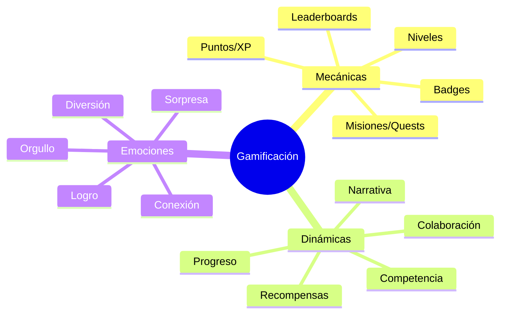
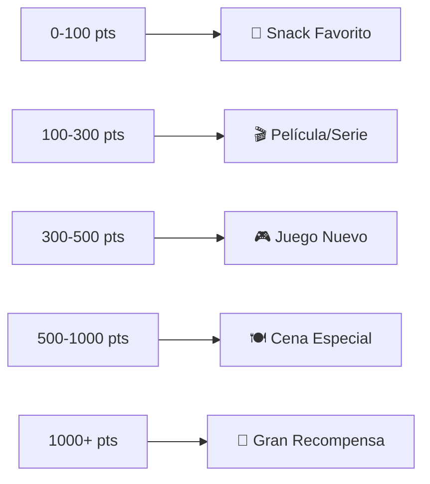
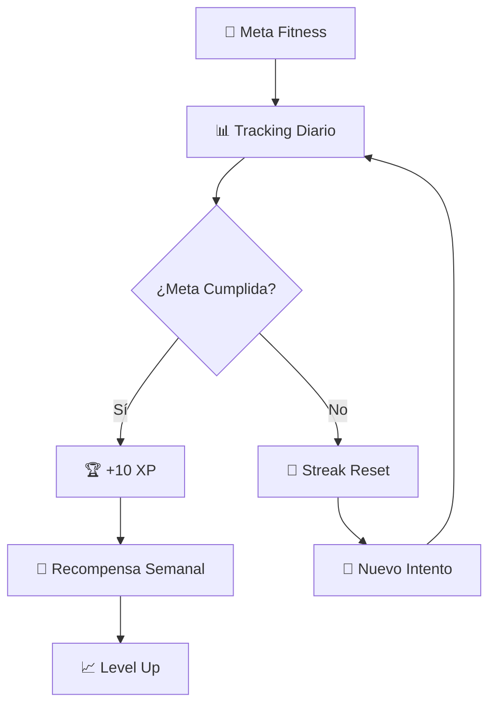
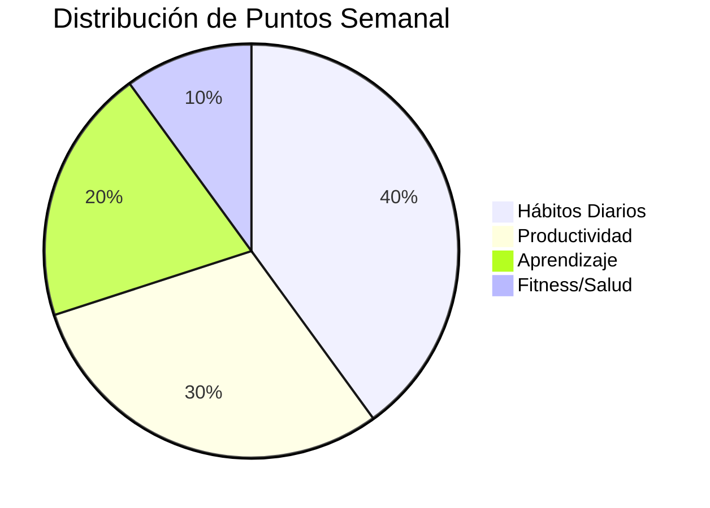

# 🎮 Gamificación Personal

> [!info] 🎯 Definición La gamificación personal es la aplicación de elementos y mecánicas de juego a actividades cotidianas, objetivos personales y hábitos, con el fin de aumentar la motivación, el compromiso y la satisfacción en el logro de metas personales y profesionales.

## 🎲 Fundamentos de la Gamificación

> [!tip] 🧠 Psicología del Juego **Motivación Intrínseca**: Los juegos activan centros de recompensa naturales **Progreso Visible**: Las barras de progreso y niveles proporcionan retroalimentación inmediata **Desafío Graduado**: Dificultad escalable mantiene el engagement **Logros y Reconocimiento**: Badges y achievements satisfacen necesidad de reconocimiento **Elemento Social**: Competencia y colaboración incrementan motivación

### 🏗️ Elementos Básicos de Game Design



## 🎖️ Sistemas de Puntuación y Recompensas

> [!warning] ⚖️ Balance en Recompensas Es crucial encontrar el equilibrio entre recompensas extrínsecas e intrínsecas para mantener la motivación a largo plazo.

### 🏆 Framework de Puntos Personal

```markdown
📊 Sistema de Puntuación Base:

🟢 **Hábitos Diarios** (1-5 puntos)
- Ejercicio: 3 pts
- Meditación: 2 pts  
- Lectura: 2 pts
- Dormir 8h: 1 pt

🔵 **Tareas Productivas** (5-20 puntos)
- Completar proyecto: 15 pts
- Aprender nueva habilidad: 10 pts
- Organizar espacio: 5 pts

🟡 **Desafíos Semanales** (25-50 puntos)
- Meta fitness semanal: 30 pts
- Completar curso online: 50 pts
- Networking profesional: 25 pts

🔴 **Logros Especiales** (100+ puntos)
- Certificación obtenida: 200 pts
- Proyecto personal completado: 150 pts
- Hábito 30 días consecutivos: 100 pts
```

### 🎁 Sistema de Recompensas Escalonado



## 📱 Herramientas y Apps de Gamificación

> [!info] 🛠️ Categorías de Apps Existen diferentes tipos de aplicaciones según el enfoque de gamificación que prefieras.

### 📊 Comparativa de Apps Populares

|App|Tipo|Personalización|Social|Precio|Rating|
|---|---|---|---|---|---|
|Habitica|RPG/Aventura|⭐⭐⭐⭐⭐|⭐⭐⭐⭐|Freemium|⭐⭐⭐⭐|
|Todoist|Productividad|⭐⭐⭐|⭐⭐⭐|Freemium|⭐⭐⭐⭐⭐|
|Forest|Concentración|⭐⭐|⭐⭐⭐|Pago|⭐⭐⭐⭐|
|Strava|Fitness|⭐⭐⭐|⭐⭐⭐⭐⭐|Freemium|⭐⭐⭐⭐|
|Duolingo|Aprendizaje|⭐⭐⭐⭐|⭐⭐⭐⭐|Freemium|⭐⭐⭐⭐⭐|

## 🎯 Aplicaciones por Área de Vida

> [!tip] 🏠 Gamificación del Hogar **Sistema de Puntos Domésticos**: Asignar puntos a tareas del hogar **Challenges Familiares**: Competencias amigables entre miembros **Reward Charts**: Tableros visuales de progreso **House Quests**: Misiones especiales de limpieza/organización

### 💼 Gamificación Profesional

```markdown
🎮 Estrategias Laborales:

1. **Skill Trees Profesionales**
   - Mapear competencias como árboles de habilidades
   - Desbloquear nuevas capacidades progresivamente

2. **Project Milestones**
   - Dividir proyectos grandes en "niveles"
   - Celebrar cada milestone completado

3. **Learning Streaks**
   - Mantener rachas de aprendizaje diario
   - Badges por días consecutivos de desarrollo

4. **Networking Achievements**
   - Puntos por nuevas conexiones profesionales
   - Badges por eventos de networking asistidos
```

### 🏃‍♂️ Gamificación de Fitness

> [!warning] 🎯 Evitar Obsesiones La gamificación del fitness debe promover hábitos saludables, no comportamientos obsesivos o poco saludables.



## 🧠 Diseño de Hábitos Gamificados

> [!info] 🔄 Loop de Hábito Gamificado **Cue (Señal)** → **Routine (Rutina)** → **Reward (Recompensa)** → **Tracking (Seguimiento)**

### 🎨 Creando Tu Sistema Personal

```markdown
🎯 Pasos para Diseñar Tu Gamificación:

1. **📋 Inventario de Objetivos**
   - Lista todas las áreas que quieres mejorar
   - Prioriza por impacto y dificultad

2. **🎮 Elige Tu Estilo de Juego**
   - RPG: Aventura y desarrollo de personaje
   - Estrategia: Planificación y optimización
   - Casual: Simple y relajado
   - Competitivo: Comparación y rankings

3. **🏗️ Construye el Framework**
   - Define sistema de puntos
   - Establece niveles y progresión
   - Crea badges significativos

4. **📱 Selecciona Herramientas**
   - Apps especializadas
   - Spreadsheets personalizados
   - Notebooks físicos gamificados

5. **🔄 Iteración y Mejora**
   - Ajusta según resultados
   - Mantén la novedad
   - Evita la fatiga del sistema
```

## 🎭 Narrativa Personal y Storytelling

> [!tip] 📖 El Poder de la Historia Personal Crear una narrativa alrededor de tus objetivos puede aumentar significativamente el compromiso y la motivación.

### 🏰 Arquetipos de Personaje Personal

```markdown
🎭 Roles que Puedes Adoptar:

🗡️ **El Guerrero**
- Conquista desafíos diarios
- Batalla contra la procrastinación
- Protege sus hábitos saludables

🧙‍♂️ **El Mago**
- Transforma hábitos negativos
- Usa "hechizos" (técnicas) especiales
- Acumula sabiduría (conocimiento)

🏃‍♂️ **El Explorador**
- Descubre nuevas habilidades
- Mapea territorios desconocidos
- Colecciona experiencias únicas

👑 **El Constructor de Reino**
- Desarrolla su "imperio personal"
- Gestiona recursos (tiempo, energía)
- Expande su dominio de competencias
```

## 📊 Métricas y Dashboard Personal

> [!info] 📈 Tracking Inteligente Un buen sistema de métricas te permite ver patrones, celebrar progreso y ajustar estrategias.

### 🎯 KPIs Gamificados



## 🤝 Gamificación Social

> [!warning] 🎭 Balance Social La competencia puede ser motivadora, pero asegúrate de que no se vuelva tóxica o contraproducente.

### 👥 Estrategias de Grupo

```markdown
🎮 Modalidades Sociales:

1. **Accountability Partners**
   - Comparte objetivos y progreso
   - Check-ins regulares gamificados

2. **Guilds/Equipos**
   - Grupos con objetivos comunes
   - Metas colectivas y individuales

3. **Friendly Competition**
   - Leaderboards semanales
   - Challenges específicos

4. **Mentorship Chains**
   - System de niveles con mentoring
   - Enseñar = puntos extra
```

## 🔄 Mantenimiento del Sistema

> [!warning] ⚠️ Fatiga de Gamificación Los sistemas pueden volverse obsoletos o abrumadores. Es importante evolucionar y simplificar regularmente.

### 🛠️ Mantenimiento Regular

```markdown
🔧 Checklist de Mantenimiento Mensual:

□ Revisar efectividad del sistema de puntos
□ Actualizar recompensas que ya no motivan
□ Añadir nuevos challenges/badges
□ Eliminar elementos que no se usan
□ Celebrar logros y niveles alcanzados
□ Ajustar dificultad si es necesario
□ Renovar la narrativa personal
```

## 📚 Referencias

> [!quote] Enlaces a Notas Relacionadas
> 
> - [[Hábitos de Estudio]] - Aplicar gamificación al aprendizaje
> - [[Motivación Académica]] - Técnicas de motivación estudiantil
> - [[Productividad Digital]] - Gamificar workflows digitales
> - [[Apps de Productividad]] - Herramientas con elementos de juego
> - [[Técnicas de Concentración]] - Gamificar sessions de focus
> - [[Análisis de Tiempo Digital]] - Métricas gamificadas
> - [[Metacognición]] - Reflexión sobre sistemas personales

## 📖 Notas Recomendadas

> [!info] 🔗 Para Complementar Este Tema
> 
> - [[Método 4 - Aprendizaje Activo]] - Gamificar el proceso de aprendizaje
> - [[Método 9 - Metodología GTD (Getting Things Done)]] - Aplicar elementos de juego a GTD
> - [[Detox Digital]] - Balance entre gamificación digital y analógica
> - [[Organización en la Nube]] - Gamificar la organización de archivos
> - [[Gestión de Email]] - Aplicar puntos y logros al email
> - [[Neurociencia del Aprendizaje]] - Base científica de la gamificación
> - [[Minimalismo Digital]] - Gamificación simple y efectiva

---

**Tags**: #gamificación #motivación #hábitos #productividad #juegos #apps #tracking #recompensas #psicología #engagement #logros #badges #puntos #narrativa #social #sistema-personal