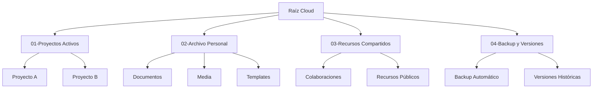
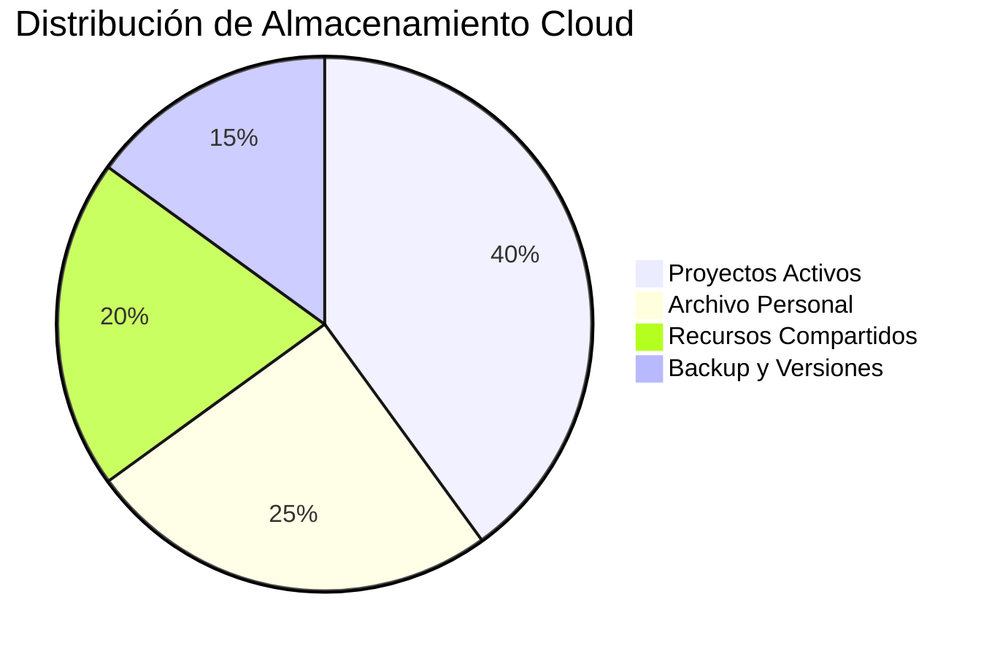

# ☁️ Organización en la Nube

> [!info] 📋 Definición La organización en la nube se refiere al conjunto de estrategias, herramientas y metodologías para gestionar de manera eficiente los recursos digitales almacenados en servicios de computación en la nube, optimizando el acceso, la colaboración y la productividad.

## 🏗️ Fundamentos de la Organización Cloud

> [!tip] 💡 Principios Básicos **Estructura Jerárquica**: Crear una arquitectura de carpetas lógica y escalable **Nomenclatura Consistente**: Establecer convenciones de nombres claras **Sincronización Inteligente**: Optimizar el uso del ancho de banda y almacenamiento **Control de Versiones**: Mantener historial de cambios y colaboración **Seguridad y Accesos**: Gestionar permisos y compartición de recursos

### 📁 Estrategias de Estructuración



## 🛠️ Herramientas y Plataformas

> [!warning] ⚠️ Consideraciones de Plataforma Cada servicio cloud tiene sus propias características y limitaciones. Es crucial elegir la herramienta adecuada según las necesidades específicas.

### 📊 Comparativa de Servicios

|Servicio|Almacenamiento|Colaboración|Sincronización|Integración|
|---|---|---|---|---|
|Google Drive|15GB gratuito|⭐⭐⭐⭐⭐|⭐⭐⭐⭐|⭐⭐⭐⭐⭐|
|Dropbox|2GB gratuito|⭐⭐⭐⭐|⭐⭐⭐⭐⭐|⭐⭐⭐⭐|
|OneDrive|5GB gratuito|⭐⭐⭐⭐|⭐⭐⭐⭐|⭐⭐⭐⭐⭐|
|iCloud|5GB gratuito|⭐⭐⭐|⭐⭐⭐⭐|⭐⭐⭐|

## 🎯 Metodologías de Organización

> [!tip] 📂 Sistema de Carpetas Inteligentes **Por Proyecto**: Organizar por iniciativas específicas **Por Fecha**: Estructura cronológica para archivos temporales **Por Tipo**: Clasificación por formato de archivo **Por Estado**: Separar trabajos en progreso, completados y archivados

### 🏷️ Convenciones de Nomenclatura

```markdown
Formato Recomendado:
[YYYY-MM-DD]_[Categoría]_[Descripción]_[Versión]

Ejemplos:
- 2024-03-15_Informe_Ventas-Q1_v2.1
- 2024-03-20_Presentación_Marketing_Final
- 2024-03-22_Template_Propuesta_Comercial
```

> [!info] 🔄 Flujo de Trabajo Cloud
> 
> 1. **Captura**: Subir y categorizar nuevos archivos
> 2. **Organización**: Aplicar estructura y nomenclatura
> 3. **Colaboración**: Configurar permisos y compartición
> 4. **Mantenimiento**: Limpieza periódica y archivado
> 5. **Backup**: Verificar respaldos y redundancia

## 🤖 Automatización y Optimización

> [!tip] ⚡ Automatizaciones Inteligentes **Sincronización Selectiva**: Solo sincronizar carpetas necesarias **Reglas de Organización**: Automatizar movimiento de archivos **Backup Programado**: Respaldos automáticos en intervalos definidos **Notificaciones Inteligentes**: Alertas de cambios importantes

### 📈 Métricas de Eficiencia



## 🔒 Seguridad y Mejores Prácticas

> [!warning] 🛡️ Consideraciones de Seguridad **Autenticación de Dos Factores**: Activar en todas las cuentas **Gestión de Permisos**: Revisar regularmente accesos compartidos **Encriptación**: Usar herramientas adicionales para datos sensibles **Monitoreo de Actividad**: Supervisar accesos y modificaciones

## 📚 Referencias

> [!quote] Enlaces a Notas Relacionadas
> 
> - [[Productividad Digital]] - Estrategias generales de productividad
> - [[Apps de Productividad]] - Herramientas complementarias
> - [[Gestión de Email]] - Organización de comunicaciones
> - [[Análisis de Tiempo Digital]] - Medición de eficiencia
> - [[Automatizaciones con IA]] - Optimización inteligente
> - [[Seguridad Digital Personal]] - Protección de datos
> - [[Detox Digital]] - Balance en el uso de tecnología

## 📖 Notas Recomendadas

> [!info] 🔗 Para Complementar Este Tema
> 
> - [[Método KonMari]] - Aplicar principios de organización física al digital
> - [[Minimalismo Digital]] - Reducir ruido digital en la nube
> - [[Técnicas de Concentración]] - Mantener foco durante la organización
> - [[Hábitos de Estudio]] - Crear rutinas de mantenimiento digital
> - [[Gamificación Personal]] - Motivación para mantener organización

---

**Tags**: #organización #cloud #productividad #digital #automatización #colaboración #almacenamiento #sincronización #backup #seguridad