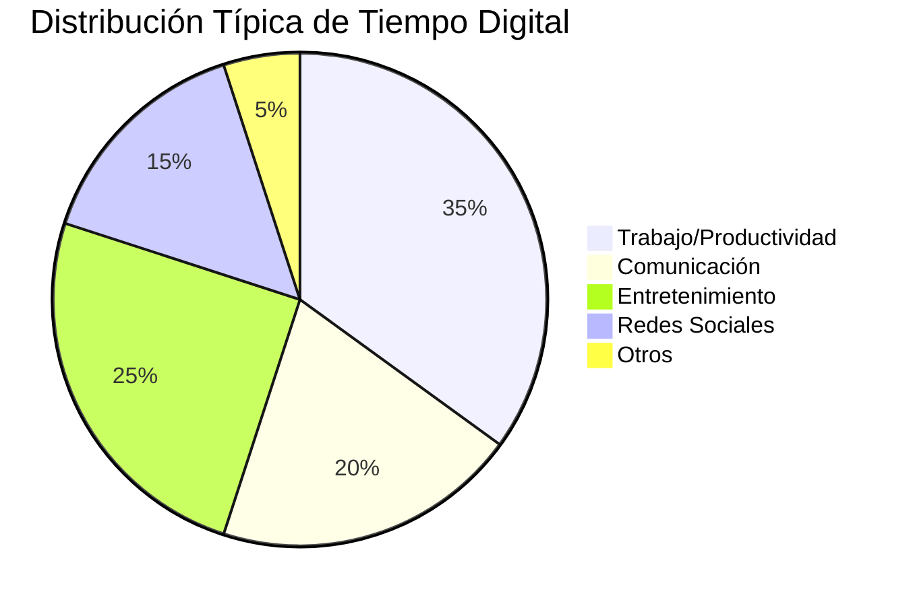
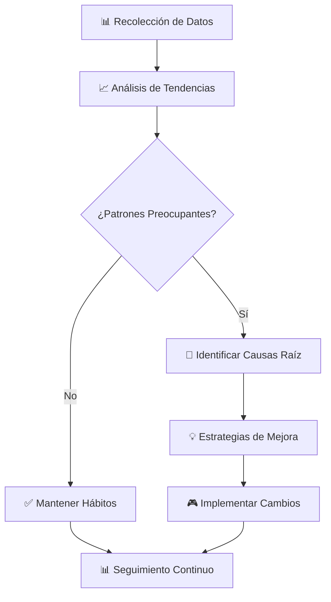
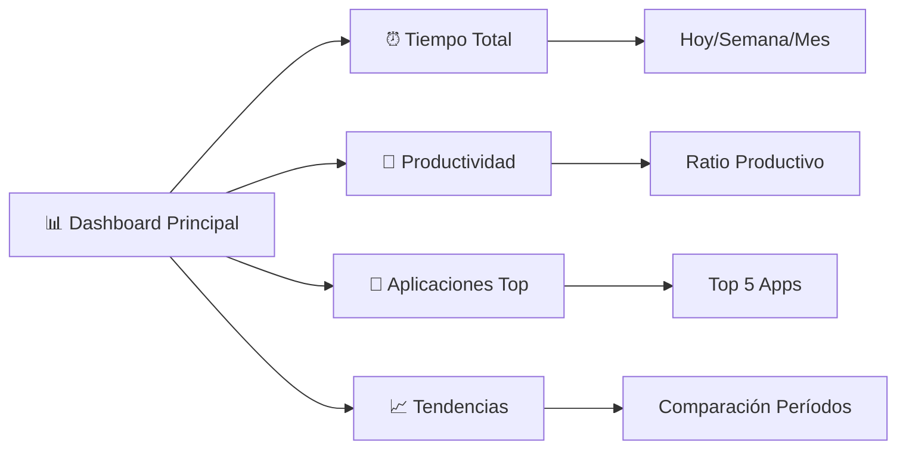
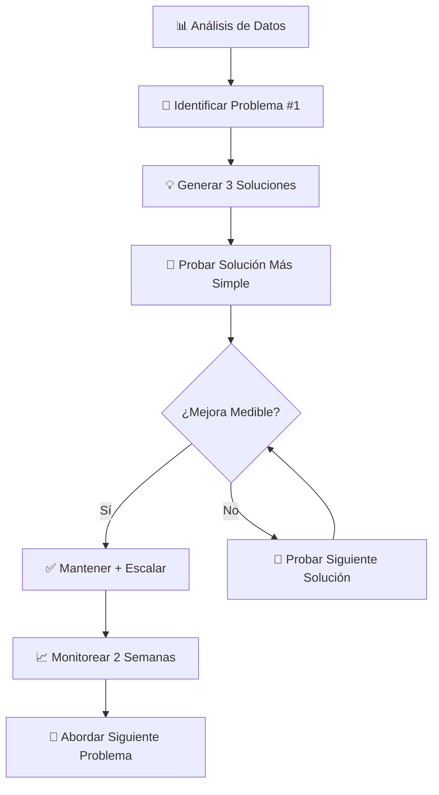

# ⏰ Análisis de Tiempo Digital

> [!info] 📊 Definición El análisis de tiempo digital es el proceso sistemático de medir, evaluar y optimizar cómo utilizamos nuestro tiempo en dispositivos digitales y aplicaciones, con el objetivo de mejorar la productividad, reducir distracciones y mantener un equilibrio saludable entre la vida digital y offline.

## 🎯 Fundamentos del Time Tracking Digital

> [!tip] 🧠 Por Qué Medir el Tiempo Digital **Conciencia de Uso**: La mayoría subestima su tiempo en pantalla real **Identificación de Patrones**: Reconocer hábitos inconscientes y triggers **Optimización de Productividad**: Distinguir tiempo productivo vs. pasivo **Bienestar Digital**: Prevenir burnout y fatiga digital **Toma de Decisiones**: Datos objetivos para cambios de comportamiento

### 📱 Categorías de Uso Digital



## 📊 Métricas Clave a Monitorear

> [!warning] ⚠️ Calidad vs. Cantidad No solo importa cuánto tiempo pasas en digital, sino la calidad y propósito de ese tiempo. 2 horas de trabajo profundo valen más que 4 horas de navegación dispersa.

### 🎖️ KPIs de Tiempo Digital

```markdown
📈 Métricas Fundamentales:

🕐 **Tiempo Total de Pantalla**
- Tiempo diario promedio
- Tendencias semanales/mensuales
- Comparación con objetivos

⚡ **Tiempo Productivo vs. Pasivo**
- Ratio productividad/entretenimiento
- Horas de trabajo profundo
- Tiempo en tareas específicas

📱 **Frecuencia de Uso**
- Número de pickups por día
- Tiempo promedio por sesión
- Aplicaciones más frecuentes

🎯 **Patrones de Comportamiento**
- Horas pico de uso
- Triggers de distracción
- Contextos de uso

🧘 **Indicadores de Bienestar**
- Tiempo antes de dormir
- Interrupciones durante trabajo
- Pausas regulares tomadas
```

## 🛠️ Herramientas de Medición

> [!info] 📱 Herramientas Nativas vs. Terceros Los sistemas operativos modernos incluyen herramientas básicas, pero apps especializadas ofrecen análisis más profundos.

### 📊 Comparativa de Herramientas

|Herramienta|Plataforma|Detalle|Automatización|Precio|Análisis|
|---|---|---|---|---|---|
|Screen Time|iOS|⭐⭐⭐|⭐⭐⭐⭐⭐|Gratis|⭐⭐⭐|
|Digital Wellbeing|Android|⭐⭐⭐|⭐⭐⭐⭐⭐|Gratis|⭐⭐⭐|
|RescueTime|Multi|⭐⭐⭐⭐⭐|⭐⭐⭐⭐⭐|Freemium|⭐⭐⭐⭐⭐|
|Toggl Track|Multi|⭐⭐⭐⭐|⭐⭐⭐|Freemium|⭐⭐⭐⭐|
|Forest|Multi|⭐⭐|⭐⭐⭐|Pago|⭐⭐⭐|
|Clockify|Multi|⭐⭐⭐⭐|⭐⭐⭐⭐|Freemium|⭐⭐⭐⭐|

### 🔧 Setup de Herramientas Avanzadas

> [!tip] ⚙️ Configuración Óptima para RescueTime **Categorización Automática**: Configurar reglas para clasificar sitios/apps **Goals Setting**: Establecer objetivos de tiempo productivo **FocusTime**: Usar bloqueadores integrados durante trabajo profundo **Weekly Reports**: Revisar patrones semanales regularmente

## 📈 Análisis e Interpretación de Datos

> [!warning] 🔍 Evitar Parálisis por Análisis El objetivo es obtener insights accionables, no obsesionarse con cada métrica. Enfócate en 3-5 KPIs principales.

### 📊 Framework de Análisis Semanal



### 🎯 Interpretación de Patrones Comunes

```markdown
🔍 Señales de Alerta:

🔴 **Uso Problemático**
- Tiempo de pantalla >8h sin trabajo
- >100 pickups diarios
- Uso nocturno frecuente (post 10pm)
- Ratio entretenimiento >70%

🟡 **Uso Subóptimo**
- Multitasking excesivo
- Sesiones muy cortas (<5min)
- Interrupciones frecuentes durante trabajo
- Falta de bloques de tiempo productivo

🟢 **Uso Saludable**
- Bloques de trabajo profundo >90min
- Pausas regulares cada 2h
- Ratio productivo >50%
- Tiempo offline diario >4h
```

## 🎨 Visualización de Datos

> [!info] 📊 El Poder de la Visualización Los gráficos y dashboards hacen que los datos abstractos se vuelvan comprensibles y accionables.

### 📈 Dashboard Personal Ideal



### 🎯 Métricas por Contexto

```markdown
📊 Análisis Contextual:

🏢 **Horario Laboral** (9-17h)
- % tiempo en apps productivas
- Interrupciones por redes sociales
- Eficiencia por hora

🏠 **Tiempo Personal** (17-22h)
- Balance entretenimiento/desarrollo
- Tiempo en familia sin dispositivos
- Actividades offline

🌙 **Período Nocturno** (22h+)
- Uso pre-sueño
- Calidad del digital sunset
- Apps más usadas en la noche

🌅 **Mañanas** (6-9h)
- Primera app abierta
- Tiempo hasta check de emails
- Rutina matutina digital
```

## 🎯 Establecimiento de Objetivos

> [!tip] 🏆 SMART Goals para Tiempo Digital Los objetivos deben ser **S**pecíficos, **M**edibles, **A**lcanzables, **R**elevantes y **T**emporales.

### 🎖️ Ejemplos de Objetivos Efectivos

```markdown
🎯 Objetivos SMART Ejemplo:

📱 **Reducción de Uso**
- "Reducir tiempo de redes sociales de 2h a 1h diaria en 30 días"
- "Disminuir pickups de 80 a 50 por día en 2 semanas"

⚡ **Aumento de Productividad**
- "Lograr 4h de trabajo profundo diario durante la semana"
- "Aumentar ratio productivo del 40% al 60% en 1 mes"

🧘 **Bienestar Digital**
- "Implementar 1h de digital sunset antes de dormir"
- "Mantener domingo libre de trabajo digital por 8 semanas"

📚 **Desarrollo Personal**
- "Dedicar 30min diarios a apps educativas durante 21 días"
- "Reemplazar 1h de entretenimiento pasivo con lectura"
```

## 🔄 Optimización Basada en Datos

> [!warning] 📊 Iteración Inteligente Realiza cambios graduales basados en datos. Los cambios drásticos raramente se sostienen a largo plazo.

### 🎨 Estrategias de Optimización



## 🤖 Automatización del Tracking

> [!info] ⚙️ Set & Forget Tracking La mejor medición es la que no requiere esfuerzo consciente. Automatiza todo lo posible.

### 🔧 Setup de Automatización

```markdown
🤖 Automatizaciones Recomendadas:

📱 **Móvil**
- Screen Time/Digital Wellbeing activado
- Límites automáticos en apps problemáticas
- Do Not Disturb programado

💻 **Desktop**
- RescueTime corriendo en background
- Bloqueadores automáticos durante focus time
- Reportes semanales automáticos

⌚ **Wearables**
- Sync con apps de tiempo
- Recordatorios de descanso
- Tracking de actividad física vs. digital

📊 **Reportes**
- Email semanal con resumen
- Dashboard accesible en 1 click
- Alertas por uso excesivo
```

## 🧠 Psicología del Tiempo Digital

> [!warning] 🧘 Relación Saludable con las Métricas El tracking puede volverse obsesivo. Mantén perspectiva y recuerda que las métricas son herramientas, no maestros.

### 🎭 Sesgos Cognitivos Comunes

```markdown
🧠 Sesgos a Evitar:

🎯 **Optimización Prematura**
- Obsesionarse con métricas menores
- Cambiar sistemas constantemente

📊 **Parálisis por Análisis**
- Medir todo sin actuar
- Buscar el sistema "perfecto"

🏆 **Gamificación Extrema**
- Competir con métricas pasadas obsesivamente
- Sacrificar bienestar por números

⚖️ **Falsa Precisión**
- Creer que las métricas son 100% exactas
- Ignorar contexto cualitativo
```

## 📚 Referencias

> [!quote] Enlaces a Notas Relacionadas
> 
> - [[Productividad Digital]] - Optimizar workflows basado en datos
> - [[Detox Digital]] - Estrategias para reducir uso problemático
> - [[Apps de Productividad]] - Herramientas que complementan el análisis
> - [[Técnicas de Concentración]] - Aplicar insights para mejorar focus
> - [[Hábitos de Estudio]] - Optimizar tiempo de aprendizaje digital
> - [[Gamificación Personal]] - Gamificar métricas de tiempo
> - [[Gestión de Email]] - Analizar tiempo en comunicaciones

## 📖 Notas Recomendadas

> [!info] 🔗 Para Complementar Este Tema
> 
> - [[Método 1 - Pomodoro]] - Combinar con time tracking para máxima eficiencia
> - [[Método 4 - Aprendizaje Activo]] - Medir calidad vs. cantidad de estudio
> - [[Neurociencia del Aprendizaje]] - Entender impacto del tiempo digital en cognición
> - [[Metacognición]] - Reflexionar sobre patrones de uso personal
> - [[Organización en la Nube]] - Optimizar tiempo en gestión de archivos
> - [[Minimalismo Digital]] - Usar datos para simplificar vida digital
> - [[Motivación Académica]] - Aplicar insights a estudios

---

**Tags**: #tiempo-digital #tracking #productividad #análisis #métricas #bienestar-digital #optimización #automatización #patrones #datos #focus #screen-time #digital-wellness #herramientas #dashboard #objetivos