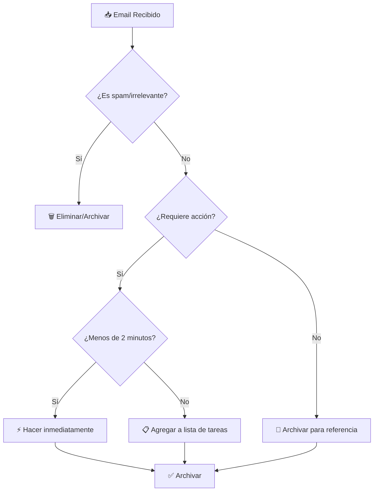
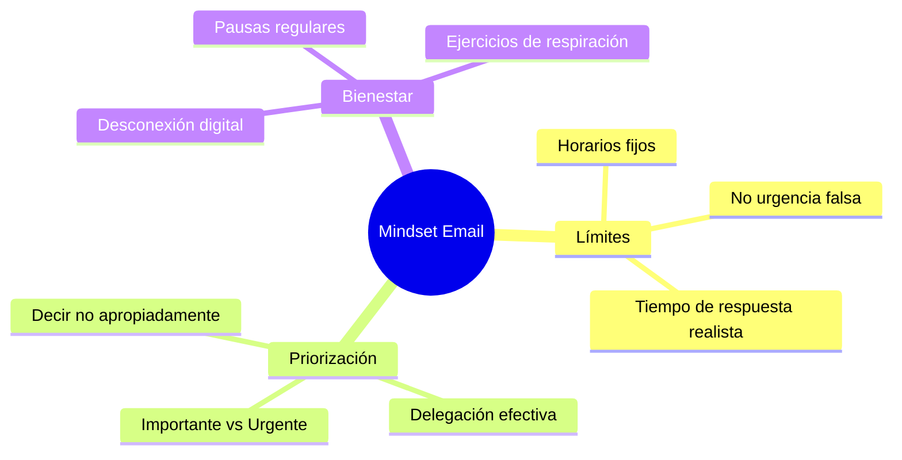

# 📧 Gestión de Email

> [!info] 📋 Definición La gestión de email es el conjunto de estrategias, técnicas y herramientas diseñadas para organizar, procesar y mantener bajo control el flujo de correos electrónicos, maximizando la productividad y minimizando el estrés asociado con la sobrecarga de información.

## 🎯 Fundamentos de la Gestión de Email

> [!tip] 💡 Principios Clave **Inbox Zero**: Mantener la bandeja de entrada vacía o casi vacía **Procesamiento por Lotes**: Revisar emails en momentos específicos **Regla de los 2 Minutos**: Si toma menos de 2 minutos, hazlo inmediatamente **Clasificación Inteligente**: Organizar por prioridad y contexto **Automatización**: Usar filtros y reglas para reducir trabajo manual

### 📊 Flujo de Procesamiento de Email



## 📁 Sistemas de Organización

> [!warning] ⚠️ Evitar Sobreorganización Crear demasiadas carpetas puede ser contraproducente. Mantén un sistema simple y funcional que realmente uses.

### 🏷️ Sistema de Carpetas Esenciales

```markdown
📂 Estructura Recomendada:
├── 🔥 Acción Inmediata
├── ⏳ Esperando Respuesta
├── 📅 Programado
├── 📁 Proyectos Activos
│   ├── Proyecto A
│   ├── Proyecto B
│   └── Cliente X
├── 📚 Referencia
├── ✅ Completado (Archivo)
└── 🗂️ Templates y Borradores
```

### 🎨 Sistema de Etiquetas/Labels

> [!tip] 🏷️ Etiquetado Inteligente **Por Prioridad**: 🔴 Urgente, 🟡 Importante, 🔵 Rutinario **Por Acción**: 📞 Llamar, 💬 Responder, 📝 Revisar, ⚡ Hacer **Por Contexto**: 🏢 Oficina, 🏠 Casa, 💻 Computadora, 📱 Móvil **Por Persona**: 👥 Equipo, 👤 Jefe, 🤝 Cliente, 📧 Newsletter

## ⚡ Técnicas de Procesamiento Eficiente

> [!info] 🔄 Método PARA (Para Email) **P**rocesar: Revisar y clasificar cada email **A**rchivar: Guardar información importante **R**esponder: Contestar lo que requiere respuesta **A**ctuar: Realizar acciones necesarias o delegarlas

### ⏰ Gestión del Tiempo en Email

```mermaid
gantt
    title Horarios Óptimos para Email
    dateFormat HH:mm
    axisFormat %H:%M
    
    section Mañana
    Revisión Principal    :active, 09:00, 09:30
    
    section Mediodía
    Revisión Rápida      :12:00, 12:15
    
    section Tarde
    Procesamiento Final  :16:00, 16:30
```



> [!tip] ⏱️ Batching (Procesamiento por Lotes) **Frecuencia Recomendada**: 2-3 veces al día máximo **Duración por Sesión**: 20-30 minutos **Horarios Óptimos**: Mañana temprano, después del almuerzo, final del día **Desactivar Notificaciones**: Durante bloques de trabajo profundo

## 🤖 Automatización y Filtros

> [!warning] 🔧 Configuración de Filtros Inteligentes Los filtros mal configurados pueden hacer que pierdas emails importantes. Revisa y ajusta regularmente.

### 📋 Filtros Esenciales

```markdown
🔄 Filtros Automáticos Recomendados:

1. **Newsletters y Promociones**
   - Mover a carpeta específica
   - Marcar como leído
   - Aplicar etiqueta 📰

2. **Notificaciones de Sistemas**
   - Archivar automáticamente
   - Etiqueta 🤖 Sistema

3. **Emails de Equipos/Proyectos**
   - Carpeta del proyecto
   - Etiqueta del equipo

4. **Emails Urgentes (VIP)**
   - Mantener en inbox
   - Notificación especial
   - Etiqueta 🔥 Urgente
```

## 📝 Templates y Respuestas Rápidas

> [!tip] 📧 Plantillas Eficientes Crear templates para respuestas comunes puede ahorrarte horas cada semana.

### 🚀 Templates Esenciales

```markdown
📌 Tipos de Templates:

1. **Confirmación de Reunión**
2. **Solicitud de Información**
3. **Seguimiento de Propuestas**
4. **Respuesta de Ausencia Detallada**
5. **Derivación a Otro Departamento**
6. **Agradecimiento Post-Reunión**
7. **Recordatorio Amigable**
```

## 📱 Herramientas y Aplicaciones

> [!info] 🛠️ Clientes de Email Recomendados La elección del cliente de email puede impactar significativamente tu productividad.

### 📊 Comparativa de Clientes

|Cliente|Filtros|Plantillas|Integración|Móvil|Precio|
|---|---|---|---|---|---|
|Gmail|⭐⭐⭐⭐⭐|⭐⭐⭐|⭐⭐⭐⭐⭐|⭐⭐⭐⭐|Gratis|
|Outlook|⭐⭐⭐⭐|⭐⭐⭐⭐|⭐⭐⭐⭐⭐|⭐⭐⭐⭐|Freemium|
|Apple Mail|⭐⭐⭐|⭐⭐|⭐⭐⭐|⭐⭐⭐⭐⭐|Gratis|
|Thunderbird|⭐⭐⭐⭐|⭐⭐⭐|⭐⭐⭐|⭐⭐|Gratis|

## 🧠 Psicología del Email

> [!warning] 🧘 Gestión del Estrés por Email El email puede generar ansiedad y estrés. Es importante desarrollar una relación saludable con la comunicación digital.

### 🎯 Estrategias Mentales



## 🔒 Seguridad en Email

> [!warning] 🛡️ Mejores Prácticas de Seguridad **Verificar Remitentes**: Confirmar identidad en emails sospechosos **Enlaces Seguros**: No hacer clic en links de fuentes no confiables **Attachments**: Escanear archivos adjuntos antes de abrir **Información Sensible**: Nunca compartir passwords o datos financieros **Backup Regular**: Respaldar emails importantes

## 📈 Métricas y Mejora Continua

> [!info] 📊 KPIs de Email **Tiempo de Respuesta Promedio**: Meta < 24 horas **Emails Procesados por Sesión**: Medir eficiencia **Inbox Zero Frequency**: Días por semana logrado **Ratio Acción/Información**: Balance de emails productivos

## 📚 Referencias

> [!quote] Enlaces a Notas Relacionadas
> 
> - [[Productividad Digital]] - Estrategias generales de optimización
> - [[Apps de Productividad]] - Herramientas complementarias
> - [[Organización en la Nube]] - Gestión de archivos adjuntos
> - [[Técnicas de Concentración]] - Mantener foco durante procesamiento
> - [[Automatizaciones con IA]] - Automatización avanzada de emails
> - [[Análisis de Tiempo Digital]] - Medición de tiempo en email
> - [[Hábitos de Estudio]] - Rutinas de procesamiento

## 📖 Notas Recomendadas

> [!info] 🔗 Para Complementar Este Tema
> 
> - [[Método 2 - Feynman]] - Simplificar comunicación por email
> - [[Método 4 - Aprendizaje Activo]] - Procesar información de emails
> - [[Método 9 - Metodología GTD (Getting Things Done)]] - Getting Things Done aplicado a email
> - [[Detox Digital]] - Balance saludable con comunicación digital
> - [[Minimalismo Digital]] - Reducir ruido en comunicaciones
> - [[Gamificación Personal]] - Motivación para mantener inbox organizado
> - [[Metacognición]] - Reflexionar sobre hábitos de email

---

**Tags**: #email #productividad #comunicación #organización #automatización #filtros #templates #inbox-zero #gestión-tiempo #digital #eficiencia #herramientas