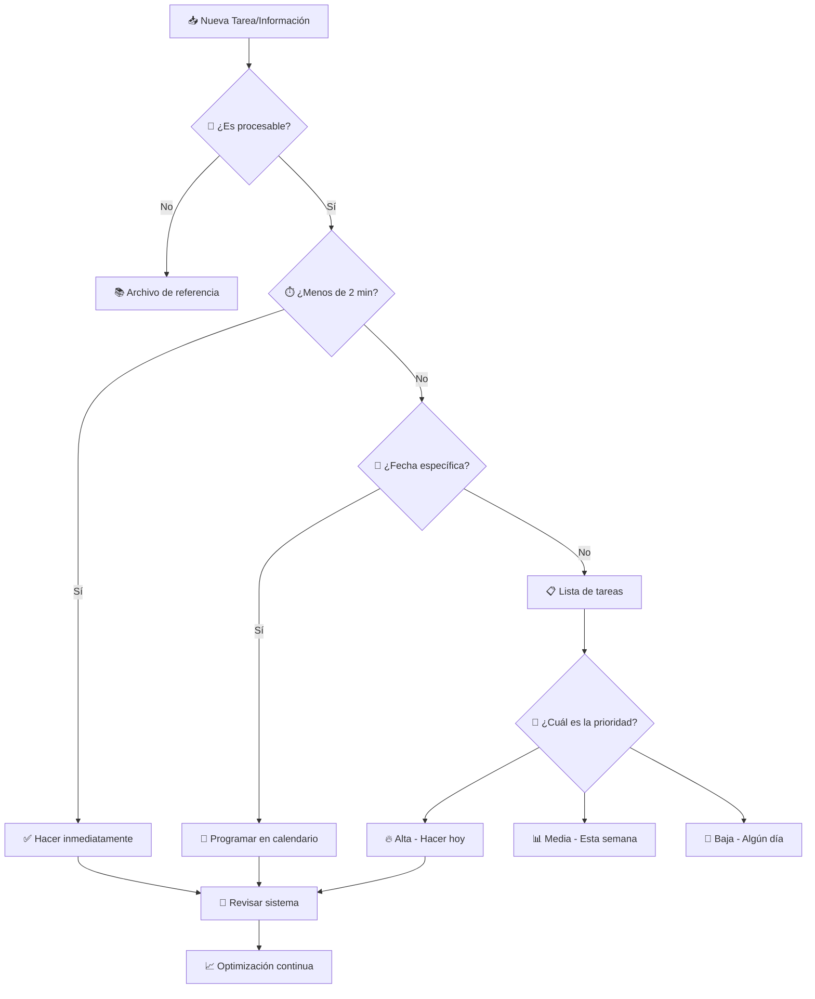

# 🚀 Productividad Digital

> [!info] 🎯 Contexto En un entorno de trabajo y estudio cada vez más digital, la productividad digital se ha vuelto esencial. Se trata de usar de forma inteligente las herramientas tecnológicas para optimizar el tiempo, organizar el trabajo y lograr los objetivos de manera más eficiente.

## 🔧 Variables Comunes

> [!tip] 📊 Elementos Fundamentales
> 
> - **⏰ Tiempo**: El recurso más valioso, que se gestiona y optimiza
> - **📋 Tareas**: Las actividades que se deben realizar
> - **🛠️ Herramientas digitales**: Aplicaciones, programas y servicios (gestores de tareas, calendarios, almacenamiento en la nube)
> - **⚡ Flujo de trabajo**: El proceso organizado para completar una serie de tareas
> - **🧠 Carga cognitiva**: El esfuerzo mental necesario para procesar información
> - **📈 ROI Digital**: Retorno de inversión en tiempo y eficiencia

## ⚙️ Metodología de Implementación

> [!warning] 📝 Sistema de 4 Pilares
> 
> ### 1. 🎯 **Planificación**
> 
> - Definir metas SMART (Específicas, Medibles, Alcanzables, Relevantes, Temporales)
> - Establecer prioridades usando matriz de Eisenhower
> - Crear cronogramas realistas
> 
> ### 2. 🗂️ **Organización**
> 
> - Estructurar información en sistemas lógicos
> - Implementar taxonomías y etiquetado consistente
> - Mantener espacios de trabajo ordenados
> 
> ### 3. 🤖 **Automatización**
> 
> - Identificar tareas repetitivas para automatizar
> - Configurar flujos de trabajo (workflows)
> - Usar plantillas y atajos
> 
> ### 4. 📊 **Optimización**
> 
> - Evaluar constantemente el flujo de trabajo
> - Medir y analizar métricas de productividad
> - Iterar y mejorar continuamente

## 📚 Explicación Teórica

> [!info] 🧠 Fundamentos Científicos La productividad digital se basa en principios de:
> 
> - **Psicología Cognitiva**: Minimizar la carga cognitiva externalizando la organización a herramientas digitales
> - **Gestión de Proyectos**: Aplicar metodologías probadas (GTD, Kanban, Scrum) al trabajo personal
> - **Teoría de Sistemas**: Crear ecosistemas integrados de herramientas que trabajen en conjunto
> - **Neurociencia**: Aprovechar los picos de concentración y energía mental óptimos
> 
> **Objetivo**: Liberar la mente para enfocarse en el trabajo creativo y de mayor valor agregado.

## 🎯 Herramientas y Aplicaciones Prácticas

### 📋 Gestión de Tareas

> [!tip] ✅ Sistemas de Organización
> 
> |Herramienta|Fortaleza|Ideal Para|
> |---|---|---|
> |**Todoist**|🎯 GTD nativo|Profesionales que siguen Getting Things Done|
> |**Notion**|🗄️ Base de datos|Gestión integral de proyectos y conocimiento|
> |**Trello**|👀 Visualización Kanban|Equipos y proyectos visuales|
> |**Asana**|👥 Colaboración|Gestión de equipos y proyectos complejos|
> |**Microsoft To Do**|🔄 Integración Office|Usuarios del ecosistema Microsoft|

### 📁 Gestión de Archivos y Conocimiento

> [!tip] 💾 Organización Digital
> 
> |Categoría|Herramientas|Beneficios|
> |---|---|---|
> |**Almacenamiento**|Google Drive, OneDrive, Dropbox|☁️ Acceso ubicuo y respaldo automático|
> |**Notas**|Obsidian, Roam, Logseq|🔗 Conexiones entre ideas|
> |**Documentos**|Notion, Craft, Bear|📝 Escritura y formateo avanzado|
> |**Referencias**|Zotero, Mendeley|📚 Gestión bibliográfica académica|

### 💬 Comunicación Eficaz

> [!tip] 📢 Canales Optimizados
> 
> |Contexto|Herramienta|Uso Óptimo|
> |---|---|---|
> |**Inmediato**|Slack, Teams|🚨 Comunicación urgente del equipo|
> |**Asíncrono**|Email, Loom|📧 Comunicación detallada no urgente|
> |**Colaborativo**|Miro, Figma|🎨 Trabajo creativo conjunto|
> |**Reuniones**|Zoom, Meet|🤝 Discusiones complejas y decisiones|

## 🔄 Flujo de Trabajo Optimizado

## 📊 Métricas de Productividad

> [!info] 📈 KPIs Personales
> 
> ### Métricas Cuantitativas
> 
> - **⏱️ Tiempo en tareas de valor**: % del día en trabajo importante vs. urgente
> - **✅ Tasa de completitud**: Tareas completadas vs. planificadas
> - **🔄 Ciclo de procesamiento**: Tiempo desde captura hasta acción
> - **📧 Inbox Zero**: Frecuencia de bandejas vacías
> 
> ### Métricas Cualitativas
> 
> - **😌 Estrés percibido**: Escala subjetiva de agobio
> - **🎯 Satisfacción con logros**: Alineación con objetivos personales
> - **⚡ Sensación de control**: Manejo de carga de trabajo
> - **🧘 Claridad mental**: Capacidad de concentración

## 🎭 Ejemplos de Aplicación

> [!tip] 💡 Casos de Uso Reales
> 
> ### 📚 **Estudiante Universitario**
> 
> **Antes**: Lista de pendientes en papel, archivos dispersos 
> **Después**:
> 
> - Notion para gestión de materias y proyectos
> - Google Drive con estructura de carpetas por semestre
> - Calendar para horarios y fechas de entrega
> - Anki para memorización espaciada
> 
> ### 💼 **Profesional Remote**
> 
> **Antes**: Email como gestor de tareas, archivos locales 
> **Después**:
> 
> - Asana para proyectos del equipo
> - Slack para comunicación inmediata
> - Calendly para programación de reuniones
> - Zapier para automatización entre herramientas
> 
> ### 🚀 **Emprendedor/Freelancer**
> 
> **Antes**: Múltiples sistemas desconectados **Después**:
> 
> - Todoist con GTD para gestión personal
> - Airtable como CRM ligero
> - Buffer para redes sociales
> - RescueTime para análisis de tiempo

## 📖 Referencias

> [!quote] 🔗 Enlaces a Notas Relacionadas
> 
> - [[Atajos de Teclado Universales]]
> - [[Comandos ASCII]]
> - [[Método 9 - Metodología GTD (Getting Things Done)]]
> - [[Hábitos y Rutinas Saludables]]
> - [[Gestión del Tiempo]]

---

#productividad #digital #eficiencia #herramientas #metodología #organización #automatización #gestión-tiempo #workflow #optimización