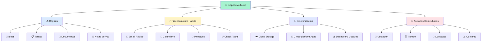
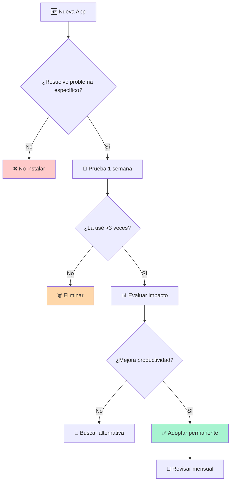

# Productividad Móvil 📱

> [!tip] 💡 **Principio Fundamental** "Tu teléfono puede ser tu mayor herramienta de productividad o tu mayor distracción. La diferencia está en cómo lo configures."

## Fundamentos de la Productividad Móvil

> [!info] 📋 **¿Qué es la Productividad Móvil?**
> 
> Es la capacidad de mantener y potenciar tu productividad utilizando dispositivos móviles como complemento eficaz a tu flujo de trabajo principal, aprovechando momentos muertos y facilitando la captura instantánea de ideas.
> 
> ### 🎯 **Ventajas Clave:**
> 
> - 📍 **Ubicuidad**: Productividad desde cualquier lugar
> - ⚡ **Captura instantánea**: Ideas y tareas al momento
> - 🔄 **Sincronización**: Continuidad entre dispositivos
> - ⏰ **Aprovechamiento**: Convierte tiempo muerto en productivo

> [!warning] ⚠️ **Trampas Comunes**
> 
> - **Multitasking excesivo**: El móvil invita a saltar entre apps
> - **Notificaciones constantes**: Interrumpen el flujo profundo
> - **Pantalla pequeña**: Limita ciertos tipos de trabajo
> - **Dependencia excesiva**: Puede reducir capacidad de concentración

## Ecosistema Móvil Optimizado



## Categorías de Apps Esenciales

> [!example] 📥 **Apps de Captura y Organización**
> 
> |Categoría|iOS|Android|Función Principal|
> |---|---|---|---|
> |**📝 Notas Rápidas**|Apple Notes, Bear|Google Keep, OneNote|Captura instantánea|
> |**✅ Gestión Tareas**|Things 3, OmniFocus|Todoist, TickTick|GTD móvil|
> |**📚 Lectura**|Instapaper, Pocket|Pocket, Flipboard|Read-later optimizado|
> |**🎤 Audio Notes**|Voice Memos, Otter|Recorder, Rev|Captura por voz|
> |**📊 Documentos**|GoodNotes, Notability|Adobe Scan, CamScanner|Digitalización|

> [!example] ⚡ **Apps de Procesamiento Rápido**
> 
> ### 📧 **Email y Comunicación:**
> 
> - **Spark** ✨: Email inteligente con snooze y templates
> - **Slack/Teams** 💼: Comunicación empresarial eficiente
> - **Telegram** 🔒: Mensajería con bots productivos
> - **Calendly** 📅: Scheduling sin fricciones
> 
> ### 🔧 **Utilidades Productivas:**
> 
> ```mermaid
> mindmap
>   root((Utilidades Móviles))
>     Automatización
>       Shortcuts iOS
>       Tasker Android
>       IFTTT
>       Zapier Mobile
>     Concentración
>       Forest Focus
>       Freedom
>       Cold Turkey
>       RescueTime
>     Medición
>       Screen Time
>       Digital Wellbeing
>       Moment
>       QualityTime
> ```

## Configuración del Dispositivo Óptimo

> [!info] 🎨 **Organización de la Pantalla Principal**
> 
> ### 📱 **Layout Sugerido (Dock/Primera pantalla):**
> 
> 1. **🎯 Captura**: Notas, Cámara, Voice Memos
> 2. **📧 Comunicación**: Email, Mensajes, Teléfono
> 3. **📅 Planificación**: Calendario, Tareas, Timer
> 4. **📚 Consumo**: Lectores, Podcasts, Kindle
> 
> ### 📂 **Carpetas por Contexto:**
> 
> - **"Trabajo"** 💼: Apps profesionales
> - **"Captura"** 📥: Todo para recopilar información
> - **"Enfoque"** 🎯: Apps de deep work
> - **"Referencia"** 📚: Apps de consulta rápida

> [!tip] 🔧 **Configuraciones Críticas**
> 
> ### ⚙️ **Optimizaciones del Sistema:**
> 
> **Notificaciones Inteligentes:**
> 
> ```
> ✅ Permitir: Calendario, Tareas críticas, Llamadas
> ⚠️  Programar: Email (cada 2h), Slack (horario laboral)
> ❌ Desactivar: Redes sociales, Noticias, Games
> ```
> 
> **Modo Concentración:**
> 
> - 🎯 **Trabajo**: Solo apps laborales y comunicación urgente
> - 📚 **Estudio**: Apps educativas y herramientas de aprendizaje
> - 🏠 **Personal**: Apps de hogar y familia
> - 😴 **Sueño**: Solo alarma y emergencias

## Workflows Móviles Eficientes

> [!example] 🔄 **Flujos de Trabajo por Situación**
> 
> ### 🚗 **En Transporte (15-45 min):**
> 
> ```mermaid
> flowchart LR
>     A[🚌 Subir al Transporte] --> B{¿Duración del viaje?}
>     B -->|<15 min| C[📧 Revisar Email Rápido]
>     B -->|15-30 min| D[📚 Leer Artículos Guardados]
>     B -->|>30 min| E[🎧 Podcast + Notas]
>     C --> F[✅ Quick Actions]
>     D --> G[📝 Highlights y Notas]
>     E --> H[💭 Ideas y Reflexiones]
>     
>     style A fill:#dbeafe
>     style F fill:#a7f3d0
>     style G fill:#fef3c7
>     style H fill:#e0e7ff
> ```
> 
> ### ⏰ **Entre Reuniones (5-10 min):**
> 
> 1. **📋 Quick Capture**: Anotar acciones de la reunión anterior
> 2. **👀 Preview**: Revisar agenda de próxima reunión
> 3. **✅ Micro-tasks**: 2-3 tareas que toman <2 min
> 4. **🧘 Reset**: 1-2 min de breathing o meditación

> [!example] 🏠 **Rutinas Diarias Automatizadas**
> 
> ### 🌅 **Rutina Matutina (Shortcuts/Tasker):**
> 
> ```
> Al desactivar alarma:
> 1. 📰 Abrir resumen de noticias personalizadas
> 2. 🌤️  Mostrar clima y outfit sugerido
> 3. 🚗 Tiempo de commute actualizado
> 4. 📅 Agenda del día + preparación necesaria
> 5. 💪 Recordatorio de hábito matutino
> ```
> 
> ### 🌙 **Rutina Nocturna:**
> 
> ```
> A las 21:00:
> 6. 📊 Revisar métricas del día
> 7. ✅ Completar tareas pendientes
> 8. 📝 Journaling de 3 minutos  
> 9. 📚 Preparar lectura/podcast para mañana
> 10. 😴 Activar modo sueño
> ```

## Técnicas de Productividad Móvil

> [!note] 🎯 **Método MICRO para Momentos Cortos**
> 
> Para aprovechar ventanas de 2-15 minutos:
> 
> - **M** - **Medir**: ¿Cuánto tiempo tengo realmente?
> - **I** - **Identificar**: ¿Qué puedo hacer en este tiempo?
> - **C** - **Capturar**: Si no hay tiempo, solo recopila
> - **R** - **Revisar**: O procesa algo ya capturado
> - **O** - **Organizar**: Ordena para cuando tengas más tiempo
> 
> ### ⏱️ **Matriz de Tiempo vs Acción:**
> 
> |Tiempo|Captura|Proceso|Organiza|Crea|
> |---|---|---|---|---|
> |**2-5 min**|✅|⚠️|❌|❌|
> |**5-15 min**|✅|✅|✅|⚠️|
> |**15-30 min**|✅|✅|✅|✅|
> |**+30 min**|✅|✅|✅|✅|

> [!tip] 📱 **Técnica del Batching Móvil**
> 
> ### 📦 **Agrupa tareas similares:**
> 
> **🌅 Mañana (7-9am):**
> 
> - Revisar todas las notificaciones de una vez
> - Procesar inbox de tareas
> - Planificar el día
> 
> **🍽️ Almuerzo (12-1pm):**
> 
> - Email batch processing
> - Actualizar proyectos
> - Quick calls/messages
> 
> **🌆 Tarde (5-6pm):**
> 
> - Capturar todo lo pendiente del día
> - Revisar y organizar notas
> - Preparar el día siguiente

## Herramientas de Medición y Optimización

> [!info] 📊 **Apps de Analytics Personal**
> 
> |App|Plataforma|Mide|Useful Para|
> |---|---|---|---|
> |**Screen Time** 📱|iOS|Uso de apps|Awareness básico|
> |**Digital Wellbeing** 🤖|Android|Tiempo y picks up|Control de hábitos|
> |**RescueTime** ⏰|Cross-platform|Productividad detallada|Optimización profunda|
> |**Moment** 📈|iOS/Android|Patrones de uso|Cambio de comportamiento|
> 
> ### 📈 **KPIs Móviles Importantes:**
> 
> - 🎯 **Tiempo productivo** vs entretenimiento (ratio 70:30)
> - 📱 **Pick-ups diarios** (objetivo: <50)
> - ⏰ **Sesiones promedio** (objetivo: >5 min cuando es trabajo)
> - 🔔 **Interrupciones** por notificaciones (objetivo: <20/día)

## Framework de Evaluación de Apps



## Templates de Configuración

> [!tip] 📋 **Template: Audit Móvil Semanal**
> 
> ```markdown
> ## Audit Móvil - Semana del [FECHA]
> 
> ### 📊 Métricas de la Semana:
> - Screen time total: [X horas]
> - Apps más usadas: [Top 5]
> - Pick-ups promedio: [X/día]
> - Notificaciones recibidas: [X/día]
> 
> ### 🎯 Análisis:
> - ¿Qué me ayudó a ser más productivo?
> - ¿Qué me distrajo más?
> - ¿Qué apps no usé para nada?
> 
> ### 🔧 Acciones para la próxima semana:
> - [ ] Desinstalar: [Apps no usadas]
> - [ ] Configurar: [Mejoras necesarias]
> - [ ] Probar: [Nueva herramienta/configuración]
> 
> ### ⭐ Rating Semanal: [1-10]
> Explicación: [Por qué esta puntuación]
> ```

## Técnica de Estudio: MÓVIL

> [!note] 🧠 **Mnemotécnica MÓVIL para Optimización**
> 
> - **M** - **Medir**: ¿Cómo uso realmente mi móvil?
> - **Ó** - **Óptico**: ¿Mi configuración visual es óptima?
> - **V** - **Velocidad**: ¿Las tareas son rápidas y fluidas?
> - **I** - **Integración**: ¿Se conecta bien con mis otros sistemas?
> - **L** - **Límites**: ¿Tengo control sobre mi uso?
> 
> ### 🔄 **Método de Optimización Mensual:**
> 
> 1. **📊 Analiza** métricas del mes pasado
> 2. **🎯 Identifica** el mayor problema/oportunidad
> 3. **🧪 Experimenta** con una mejora específica
> 4. **📝 Documenta** resultados después de 2 semanas
> 5. **✅ Adopta** o descarta basado en datos

## Seguridad y Backup Móvil

> [!warning] 🔒 **Configuraciones de Seguridad Críticas**
> 
> ### 🛡️ **Protección de Datos:**
> 
> - **🔐 Autenticación**: Face/Touch ID + PIN fuerte
> - **📱 Find My Device**: Activado y configurado
> - **☁️ Backup automático**: Diario, incluye apps work
> - **🔄 2FA**: En todas las apps importantes
> - **🔗 VPN**: Para WiFis públicos
> 
> ### 🚨 **Plan de Emergencia:**
> 
> ```
> Si pierdo el móvil:
> 1. 🔍 Usar Find My para localizar
> 2. 🔒 Bloqueo remoto inmediato
> 3. 📞 Contactar operadora para SIM
> 4. 🔄 Restaurar desde backup en nuevo dispositivo
> 5. 🔑 Cambiar passwords críticos
> ```

## Referencias

> [!quote] 🔗 **Notas Relacionadas**
> 
> - [[Automatizaciones Personales]] - Complement workflows
> - [[Deep Work]] - Balance con productividad superficial
> - [[Gestión del Tiempo]] - Integrar móvil en sistema temporal
> - [[Minimalismo Digital]] - Reducir antes de optimizar
> - [[Hábitos de Estudio]] - Apps para aprendizaje móvil

## Notas Recomendadas

> [!info] 📚 **Para Complementar este Tema**
> 
> ### **Prerrequisitos:**
> 
> - [[Minimalismo Digital]] - Limpiar antes de optimizar
> - [[Gestión de Atención Avanzada]] - Entender el coste de las interrupciones
> - [[Análisis de Tiempo]] - Saber dónde va tu tiempo actual
> 
> ### **Temas Relacionados:**
> 
> - [[Apps de Productividad]] - Revisión específica de herramientas
> - [[Seguridad Digital Personal]] - Protección avanzada de datos

---

**Tags:** #productividad #movil #apps #smartphone #tablet #workflows #automatizacion #digital #eficiencia #herramientas #optimizacion #tecnologia