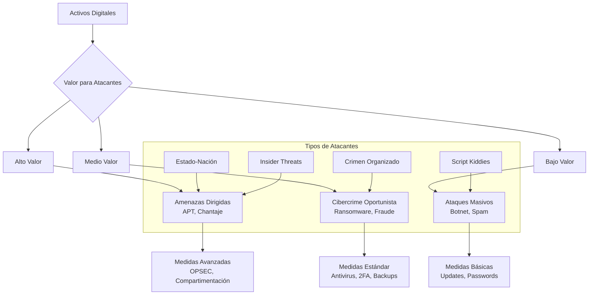
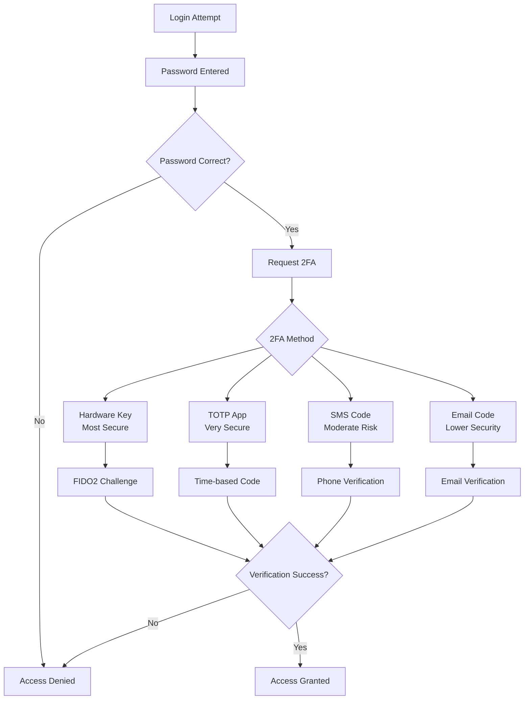
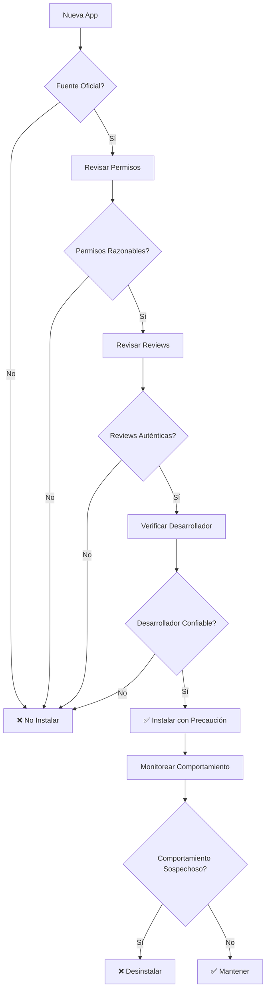

# 🔐 Seguridad Digital Personal

## 🎯 Fundamentos de la Seguridad Digital

> [!info] Definición La seguridad digital personal es el conjunto de prácticas, herramientas y conocimientos necesarios para proteger la información personal, la privacidad y los activos digitales contra amenazas cibernéticas, preservando al mismo tiempo la funcionalidad y usabilidad de los sistemas tecnológicos.

> [!tip] Principios Fundamentales
> 
> - 🛡️ **Defensa en profundidad**: Múltiples capas de protección
> - 🔒 **Principio de menor privilegio**: Acceso mínimo necesario
> - 🔄 **Actualización constante**: Software y conocimientos al día
> - 👤 **Factor humano**: La educación es la mejor defensa
> - 🎯 **Evaluación de riesgos**: Amenazas relevantes para cada persona
> - ⚖️ **Balance seguridad-usabilidad**: Protección sin paralizar productividad

## 🎭 Modelo de Amenazas Personales

### 🎯 Identificación de Activos Digitales

> [!info] Inventario de Activos Críticos **Información Personal:**
> 
> - Documentos de identidad (DNI, pasaporte, licencias)
> - Información financiera (cuentas, tarjetas, inversiones)
> - Registros médicos y de salud
> - Comunicaciones privadas (emails, mensajes, fotos)
> - Credenciales de acceso (passwords, tokens, llaves)
> 
> **Activos Profesionales:**
> 
> - Documentos de trabajo confidenciales
> - Propiedad intelectual y creaciones
> - Contactos y redes profesionales
> - Accesos a sistemas corporativos
> - Reputación digital y marca personal

### 🦹‍♂️ Tipos de Amenazas

> [!warning] Amenazas Comunes **Cibercriminales Oportunistas:**
> 
> - **Objetivo**: Beneficio económico rápido
> - **Métodos**: Malware, phishing, ransomware
> - **Protección**: Higiene digital básica, antivirus, backups
> 
> **Atacantes Dirigidos:**
> 
> - **Objetivo**: Información específica o venganza personal
> - **Métodos**: Spear phishing, ingeniería social, stalking
> - **Protección**: OPSEC, compartimentación, vigilancia activa
> 
> **Corporaciones y Data Brokers:**
> 
> - **Objetivo**: Recolección masiva de datos para lucro
> - **Métodos**: Tracking, profiling, data mining
> - **Protección**: Privacidad por diseño, herramientas anti-tracking
> 
> **Gobiernos y Agencias:**
> 
> - **Objetivo**: Vigilancia masiva, inteligencia
> - **Métodos**: Interceptación, backdoors, cooperación forzada
> - **Protección**: Comunicaciones encriptadas, jurisdicciones seguras



## 🔑 Gestión de Contraseñas y Autenticación

### 🔐 Contraseñas Fuertes

> [!tip] Características de Contraseña Segura **Criterios Técnicos:**
> 
> - **Longitud mínima**: 12+ caracteres (idealmente 16+)
> - **Complejidad**: Mayúsculas, minúsculas, números, símbolos
> - **Úniques**: Contraseña diferente para cada servicio
> - **No predictibles**: Sin información personal obvía
> - **Passphrase método**: Combinar palabras aleatorias con separadores
> 
> **Ejemplo de Passphrase:**
> 
> - `Café-Luna-87-Montaña!` (más fácil de recordar)
> - `P@ssw0rd123` ❌ (predecible y común)

> [!warning] Contraseñas que NUNCA Usar
> 
> - Información personal (nombres, fechas de nacimiento)
> - Palabras del diccionario simples
> - Secuencias (123456, qwerty, abcdef)
> - Contraseñas previamente comprometidas
> - Variaciones menores de contraseñas existentes

### 🔧 Gestores de Contraseñas

> [!info] Beneficios Críticos
> 
> - **Generación automática** de contraseñas únicas y fuertes
> - **Almacenamiento seguro** con encriptación de grado militar
> - **Autocompletado seguro** que previene phishing
> - **Sincronización multiplataforma** con encriptación end-to-end
> - **Auditoria de seguridad** identifica contraseñas débiles/reutilizadas
> - **Notas seguras** para información sensible adicional

> [!tip] Gestores Recomendados por Nivel **Nivel Básico:**
> 
> - **Bitwarden**: Gratuito, open source, confiable
> - **Firefox Lockwise**: Integrado, básico pero funcional
> - **iCloud Keychain**: Para ecosistema Apple
> 
> **Nivel Avanzado:**
> 
> - **1Password**: UX excelente, funciones empresariales
> - **KeePass**: Control total, local, muy configurable
> - **Dashlane**: Monitoreo avanzado, VPN incluido
> 
> **Nivel Paranoid:**
> 
> - **KeePassXC**: Completamente offline, auditable
> - **Bitwarden self-hosted**: Control total del servidor
> - **LessPass**: Generación algorítmica sin almacenamiento

### 🛡️ Autenticación Multifactor (2FA/MFA)

> [!info] Tipos de Factores **Algo que sabes** (Knowledge)
> 
> - Contraseña, PIN, respuestas de seguridad
> 
> **Algo que tienes** (Possession)
> 
> - Teléfono, token de hardware, tarjeta inteligente
> 
> **Algo que eres** (Inherence)
> 
> - Huella dactilar, reconocimiento facial, iris

> [!tip] Métodos 2FA por Seguridad (Más a Menos Seguro) **1. Hardware Security Keys (FIDO2/WebAuthn)**
> 
> - **Ejemplos**: YubiKey, Google Titan, SoloKeys
> - **Ventajas**: Inmune a phishing, no depende de red
> - **Desventajas**: Costo, puede perderse
> 
> **2. Aplicaciones Authenticator (TOTP)**
> 
> - **Ejemplos**: Authy, Google Authenticator, Microsoft Authenticator
> - **Ventajas**: Funciona offline, múltiples dispositivos
> - **Desventajas**: Vulnerable a malware en teléfono
> 
> **3. SMS/Códigos por Teléfono**
> 
> - **Ventajas**: Universal, fácil de usar
> - **Desventajas**: Vulnerable a SIM swapping, interceptación
> 
> **4. Email de Verificación**
> 
> - **Ventajas**: Accesible, no requiere teléfono
> - **Desventajas**: Solo tan seguro como el email



## 🌐 Navegación Segura y Privacidad

### 🔍 Navegadores y Configuración

> [!tip] Navegadores Recomendados por Uso **Navegación General Segura:**
> 
> - **Firefox** con configuración endurecida
> - **Brave** con shields activados
> - **Safari** (macOS/iOS) con configuración de privacidad
> 
> **Máxima Privacidad:**
> 
> - **Tor Browser** para anonimato real
> - **Firefox** con perfil hardened (user.js personalizado)
> - **Ungoogled Chromium** sin servicios Google
> 
> **Balance Productividad-Privacidad:**
> 
> - **Chrome** con extensiones de privacidad
> - **Edge** con configuración de privacidad estricta
> - **Firefox** configuración estándar con extensiones

> [!info] Configuraciones Críticas **Firefox Hardening:**
> 
> ```
> privacy.trackingprotection.enabled = true
> privacy.donottrackheader.enabled = true
> privacy.clearOnShutdown.everything = true
> network.cookie.cookieBehavior = 1
> dom.event.clipboardevents.enabled = false
> media.navigator.enabled = false
> webgl.disabled = true
> ```
> 
> **Chrome Privacy Settings:**
> 
> - Desactivar "Make searches and browsing better"
> - Activar "Send 'Do Not Track' request"
> - Desactivar "Use prediction service"
> - Configurar cookies a "Block third-party cookies"

### 🔌 Extensiones de Seguridad Esenciales

> [!tip] Stack de Extensiones Recomendado **Bloqueo de Anuncios y Trackers:**
> 
> - **uBlock Origin**: Bloqueador más eficiente y configurable
> - **Privacy Badger**: Anti-tracking inteligente de EFF
> - **Ghostery**: Identificador visual de trackers
> 
> **Seguridad de Contraseñas:**
> 
> - **Bitwarden/1Password**: Manager de contraseñas
> - **Have I Been Pwned**: Checker de brechas de datos
> 
> **Conexiones Seguras:**
> 
> - **HTTPS Everywhere**: Fuerza conexiones seguras
> - **DuckDuckGo Privacy Essentials**: Suite completa
> 
> **Anti-Phishing:**
> 
> - **Web of Trust (WOT)**: Reputación de sitios web
> - **PhishTank**: Base de datos de sitios maliciosos

> [!warning] Extensiones a Evitar
> 
> - Extensiones con pocos usuarios o reviews
> - Extensiones que requieren permisos excesivos
> - Software "gratuito" de antivirus con extensiones
> - Extensiones de VPN gratuitas
> - Extensiones no actualizadas en >6 meses

### 🕵️ Motores de Búsqueda Privados

> [!info] Alternativas a Google **DuckDuckGo**
> 
> - No tracking, no perfil de usuario
> - Resultados agregados de múltiples fuentes
> - Funciones !bang para búsquedas específicas
> 
> **Startpage**
> 
> - Resultados de Google sin tracking
> - Proxy para ver resultados anónimamente
> - Basado en Países Bajos (GDPR)
> 
> **Searx**
> 
> - Open source, self-hosteable
> - Agrega resultados de múltiples motores
> - Completamente configurable

## 📱 Seguridad Móvil

### 📲 Configuración de Dispositivos

> [!tip] Endurecimiento de Smartphones **iOS (iPhone):**
> 
> - Activar Face ID/Touch ID + passcode fuerte (no 4 dígitos)
> - Configurar > Privacidad > Localización > Servicios del sistema
> - Desactivar Siri en pantalla bloqueada
> - Configurar > Tiempo en pantalla > restricciones
> - Activar "Borrar datos" después de 10 intentos fallidos
> 
> **Android:**
> 
> - Usar biometría + PIN/patrón fuerte
> - Configuración > Privacidad > Administrador de permisos
> - Desactivar "Fuentes desconocidas" excepto cuando sea necesario
> - Usar launcher privado como Nova o Lawnchair
> - Activar encriptación completa del dispositivo

> [!warning] Configuraciones Riesgosas Comunes
> 
> - Permitir instalación de apps desde fuentes desconocidas
> - Usar patrones de desbloqueo simples o predecibles
> - Tener activado "Smart Lock" en ubicaciones públicas
> - No revisar permisos de aplicaciones regularmente
> - Conectarse a WiFi públicos sin VPN

### 📦 Selección de Aplicaciones Seguras

> [!info] Criterios de Evaluación de Apps **Factores de Confianza:**
> 
> - **Desarrollador verificado** con historial limpio
> - **Reviews auténticas** y rating alto sostenido
> - **Transparencia** sobre recolección de datos
> - **Actualizaciones regulares** y parches de seguridad
> - **Permisos mínimos** necesarios para funcionar
> - **Open source** cuando sea posible

> [!tip] Apps Recomendadas por Categoría **Comunicación Segura:**
> 
> - **Signal**: Mensajería con encriptación E2E perfecta
> - **Wire**: Comunicación empresarial segura
> - **Element**: Chat descentralizado basado en Matrix
> 
> **Email Seguro:**
> 
> - **ProtonMail**: Zero-knowledge, basado en Suiza
> - **Tutanota**: Open source, encriptación automática
> - **K-9 Mail**: Cliente open source para cuentas existentes
> 
> **Almacenamiento en la Nube:**
> 
> - **Tresorit**: Encriptación end-to-end, auditable
> - **pCloud Crypto**: Storage con carpeta encriptada
> - **Nextcloud**: Self-hosted, control total
> 
> **Navegación Móvil:**
> 
> - **Firefox Focus**: Navegador privado automático
> - **Brave Mobile**: Bloqueador integrado
> - **Tor Browser** (Android): Máximo anonimato



## 🔐 Comunicaciones Encriptadas

### 💬 Mensajería Segura

> [!info] Criterios de Mensajería Segura **Encriptación End-to-End (E2E):**
> 
> - Mensajes encriptados en dispositivo origen
> - Solo los participantes pueden descifrar
> - Servidor no puede leer contenido
> - Forward secrecy (llaves cambian regularmente)
> 
> **Metadata Mínima:**
> 
> - No almacenar contactos en servidor
> - Minimizar logs de conexión
> - No requerir número de teléfono real
> - Permitir comunicación anónima

> [!tip] Ranking de Seguridad en Mensajería **Nivel Máximo:**
> 
> - **Signal**: Gold standard, recomendado por expertos
> - **Wire**: Excelente para uso empresarial
> - **Element/Matrix**: Descentralizado, federated
> 
> **Nivel Alto:**
> 
> - **Threema**: Sin metadatos, basado en Suiza
> - **Session**: Fork de Signal, sin números de teléfono
> - **Briar**: P2P, funciona sin internet
> 
> **Nivel Moderado:**
> 
> - **WhatsApp**: E2E pero metadata extensive
> - **Telegram Secret Chats**: Solo en modo secreto
> - **iMessage**: Solo dentro ecosistema Apple
> 
> **❌ No Recomendados:**
> 
> - SMS/MMS: Sin encriptación
> - Facebook Messenger: Metadata extensive
> - WeChat, QQ: Sujetos a censura gubernamental
> - Discord: No E2E, enfocado en gaming

### 📧 Email Seguro

> [!warning] Limitaciones del Email Traditional
> 
> - **Email estándar NO es seguro** por diseño
> - Metadatos siempre visibles (remitente, destinatario, timestamps)
> - Servidores intermedios pueden leer contenido
> - Susceptible a interceptación en tránsito
> - Headers revelan información técnica sensible

> [!tip] Estrategias de Email Seguro **Proveedores Seguros:**
> 
> - **ProtonMail**: Zero-access encryption, auditable
> - **Tutanota**: Open source, encriptación automática
> - **Guerrilla Mail**: Temporal, para registros
> 
> **PGP/GPG para Email Existente:**
> 
> - **Thunderbird + Enigmail**: Setup relativamente simple
> - **GPG4Win**: Suite completa para Windows
> - **GPG Suite**: Integración nativa macOS
> 
> **Alternativas Modernas:**
> 
> - **Signal** para conversaciones críticas
> - **Wire** para comunicación profesional
> - **Session** para máximo anonimato

## 🛡️ Protección de Redes y VPN

### 🌐 Redes WiFi Seguras

> [!warning] Riesgos de WiFi Público
> 
> - **Man-in-the-Middle**: Interceptación de tráfico
> - **Fake Hotspots**: Redes maliciosas que imitan legítimas
> - **Packet Sniffing**: Captura de datos no encriptados
> - **Malware Distribution**: Inyección de código malicioso
> - **Session Hijacking**: Robo de cookies y sesiones

> [!tip] Protocolo de WiFi Público Seguro **Antes de Conectarse:**
> 
> 1. Verificar nombre exacto de red con establecimiento
> 2. Activar VPN ANTES de conectarse
> 3. Desactivar auto-join para redes públicas
> 4. Configurar firewall en modo público
> 
> **Durante Uso:**
> 
> - Solo HTTPS (verificar candado verde)
> - No acceder a cuentas críticas (banking, work)
> - Usar hotspot del teléfono si es posible
> - Monitorear conexiones activas
> 
> **Después de Usar:**
> 
> - "Olvidar" la red para evitar reconexión automática
> - Cambiar contraseñas si se accedió a cuentas importantes
> - Revisar actividad reciente en cuentas sensibles

### 🔧 Configuración de Router Doméstico

> [!info] Seguridad del Router **Configuraciones Críticas:**
> 
> - **Cambiar credenciales por defecto** (admin/admin, etc.)
> - **Actualizar firmware** regularmente
> - **WPA3** o mínimo WPA2 con contraseña fuerte
> - **Desactivar WPS** (vulnerable a ataques)
> - **Cambiar SSID** para no revelar modelo/marca
> - **Desactivar acceso remoto** si no es necesario
> - **Guest network** separada para visitantes
> - **Firewall activado** con reglas restrictivas

> [!tip] Configuraciones Avanzadas **DNS Seguro:**
> 
> - **Cloudflare**: 1.1.1.1 (privacidad + velocidad)
> - **Quad9**: 9.9.9.9 (bloquea malware)
> - **OpenDNS**: 208.67.222.222 (filtrado familiar)
> 
> **Monitoreo de Red:**
> 
> - Revisar dispositivos conectados regularmente
> - Alertas para nuevos dispositivos
> - Logs de conexión activados
> - Bandwidth monitoring para detectar anomalías

### 🌍 VPN (Virtual Private Network)

> [!info] Funciones de una VPN
> 
> - **Encriptación de tráfico**: Todo el tráfico pasa por túnel seguro
> - **Cambio de IP**: Apareces desde ubicación del servidor VPN
> - **Bypass de censura**: Acceder a contenido geo-bloqueado
> - **Protección en WiFi público**: Capa adicional de seguridad
> - **Anonimato relativo**: Ocultar actividad del ISP

> [!tip] Criterios de Selección de VPN **Factores Críticos:**
> 
> - **No-logs policy** verificable y auditada
> - **Jurisdicción favorable** (fuera de 5/9/14 Eyes)
> - **Protocolos modernos** (WireGuard, IKEv2, OpenVPN)
> - **Kill switch** que bloquea tráfico si VPN falla
> - **Servidores propios** vs. tercerizados
> - **Transparencia**: Regular transparency reports
> - **Performance**: Velocidad y latencia aceptables

> [!warning] VPNs a Evitar
> 
> - **VPNs gratuitas**: Monetizan vendiendo datos
> - **VPNs en países con censura**: China, Rusia, etc.
> - **VPNs con historial de leaks**: Logs filtrados previamente
> - **VPNs sin kill switch**: Riesgo de exposure accidental
> - **VPNs con demasiada publicidad**: Modelo de negocio cuestionable

**VPNs Recomendadas por Categoría:**

> [!tip] Recomendaciones por Uso **Para Privacidad General:**
> 
> - **Mullvad**: Anonymous signup, auditable
> - **IVPN**: No-logs verificado, transparente
> - **ProtonVPN**: Secure Core, company confiable
> 
> **Para Streaming:**
> 
> - **NordVPN**: Amplia red, buen streaming
> - **Surfshark**: Unlimited devices, buen precio
> - **ExpressVPN**: Velocidad consistente
> 
> **Para Usuarios Avanzados:**
> 
> - **Mullvad**: WireGuard nativo, completamente anónimo
> - **IVPN**: Open source apps, auditable
> - **Self-hosted**: WireGuard en VPS propio

```mermaid
flowchart TD
    A[Selección VPN] --> B{Necesidad Principal}
    B --> C[Privacidad Máxima]
    B --> D[Streaming/Torrents]
    B --> E[Uso Empresarial]
    B --> F[Presupuesto Limitado]
    
    C --> G[Mullvad<br/>IVPN<br/>ProtonVPN]
    D --> H[NordVPN<br/>Surfshark<br/>ExpressVPN]
    E --> I[ProtonVPN<br/>NordLayer<br/>Perimeter81]
    F --> J[ProtonVPN Free<br/>Windscribe<br/>(Limitado)]
    
    G --> K[Verificar: No-logs<br/>Jurisdicción<br/>Auditoria]
    H --> L[Verificar: Velocidad<br/>Servers<br/>Geo-unblocking]
    I --> M[Verificar: Compliance<br/>Admin features<br/>Support]
    J --> N[Verificar: Limitations<br/>Security features<br/>Upgrade path]
```

## 💾 Backup y Recuperación

### 🔄 Estrategia 3-2-1

> [!info] Regla 3-2-1 de Backups
> 
> - **3 copias** de datos importantes (original + 2 backups)
> - **2 medios diferentes** (disco duro + nube, SSD + HDD)
> - **1 copia offsite** (en ubicación física diferente)
> 
> **Extensión 3-2-1-1-0:**
> 
> - **1 copia offline** (no conectada a red)
> - **0 errores** verificados (testing de backups regular)

> [!tip] Implementación Práctica 3-2-1 **Nivel Básico:**
> 
> - **Original**: En computadora principal
> - **Backup 1**: Disco externo (semanal)
> - **Backup 2**: Cloud storage (diario automático)
> 
> **Nivel Avanzado:**
> 
> - **Original**: SSD principal
> - **Backup 1**: NAS local (RAID 1, diario)
> - **Backup 2**: Cloud encriptado (diario)
> - **Backup 3**: Disco externo offline (mensual)
> 
> **Nivel Paranoid:**
> 
> - **Múltiples versiones** con retention policy
> - **Backup geográficamente distribuido**
> - **Encriptación end-to-end** para todas las copias
> - **Testing de restauración** trimestral

### 💽 Herramientas de Backup

> [!tip] Software de Backup Recomendado **Multiplataforma:**
> 
> - **Duplicati**: Open source, encriptación, múltiples destinos
> - **Restic**: CLI potente, deduplicación, fast
> - **Rclone**: Sync con 40+ cloud providers
> 
> **Windows:**
> 
> - **File History**: Integrado, fácil de usar
> - **Veeam Agent**: Profesional, imaging completo
> - **AOMEI Backupper**: Funciones avanzadas gratuitas
> 
> **macOS:**
> 
> - **Time Machine**: Nativo, automático, confiable
> - **Carbon Copy Cloner**: Cloning completo booteable
> - **Arq**: Backup a múltiples clouds
> 
> **Linux:**
> 
> - **rsync**: CLI clásico, muy flexible
> - **Borg**: Deduplicación, encriptación, compresión
> - **Timeshift**: Similar a Time Machine

### 🔐 Backup Encriptado

> [!warning] Importancia de Encriptación en Backups
> 
> - **Cloud providers** pueden acceder datos sin encriptación
> - **Empleados maliciosos** en servicios de cloud
> - **Brechas de seguridad** en proveedores
> - **Órdenes gubernamentales** para acceso a datos
> - **Ransomware** puede cifrar backups en la red

> [!info] Opciones de Encriptación **Client-side Encryption:**
> 
> - **VeraCrypt**: Contenedores encriptados locales
> - **AxCrypt**: Encriptación de archivos individual
> - **7-Zip**: Compresión + encriptación AES-256
> 
> **Cloud con Encriptación:**
> 
> - **Tresorit**: Zero-knowledge, auditado
> - **pCloud Crypto**: Carpeta encriptada en cloud
> - **SpiderOak**: No-knowledge architecture
> 
> **Self-hosted Encrypted:**
> 
> - **Nextcloud**: Con encriptación server-side
> - **Syncthing**: P2P sync con encriptación
> - **Own server**: Control total, máxima seguridad

## 🚨 Respuesta a Incidentes

### 🔍 Detección de Compromiso

> [!warning] Señales de Alerta Críticas **Comportamiento Anómalo del Sistema:**
> 
> - Rendimiento significativamente más lento
> - Programas que se ejecutan automáticamente
> - Archivos o carpetas desconocidos aparecen
> - Configuraciones que cambian sin intervención
> - Actividad de red inusual o conexiones sospechosas
> 
> **Indicadores de Cuenta Comprometida:**
> 
> - Emails de "password changed" no iniciados por ti
> - Actividad en redes sociales que no hiciste
> - Compras o transacciones no autorizadas
> - Amigos reportan mensajes extraños de tu cuenta
> - Sesiones activas desde ubicaciones desconocidas

> [!tip] Herramientas de Detección **Análisis de Sistema:**
> 
> - **Malwarebytes**: Antimalware especializado
> - **ESET Online Scanner**: Scan bajo demanda
> - **Windows Defender**: Scan completo del sistema
> 
> **Monitoreo de Cuentas:**
> 
> - **Have I Been Pwned**: Verificar brechas conocidas
> - **Google Security Checkup**: Review de cuenta Google
> - **Facebook Security Checkup**: Review actividad social
> 
> **Análisis de Red:**
> 
> - **Wireshark**: Captura y análisis de paquetes
> - **GlassWire**: Monitor de tráfico visual
> - **Little Snitch** (macOS): Firewall outbound


### 🚑 Protocolo de Respuesta Inmediata

> [!info] Primeros 15 Minutos **Si Sospechas Compromiso:**
> 
> 1. **Desconectar de internet** (WiFi + Ethernet)
> 2. **No apagar el equipo** (puede borrar evidencia en RAM)
> 3. **Fotografiar pantalla** con teléfono si hay mensajes de error
> 4. **Cambiar contraseñas críticas** desde dispositivo LIMPIO
> 5. **Notificar contactos importantes** sobre posible compromiso
> 6. **Revisar cuentas bancarias** desde dispositivo separado
> 7. **Activar alertas de fraude** en bancos y tarjetas de crédito

> [!warning] QUÉ NO HACER Durante Respuesta
> 
> - ❌ **No introducir más credenciales** en el dispositivo comprometido
> - ❌ **No descargar "soluciones" de internet** pueden ser malware
> - ❌ **No pagar rescates** de ransomware sin consultar expertos
> - ❌ **No borrar archivos sospechosos** antes de documentar
> - ❌ **No reiniciar** hasta completar análisis inicial

### 🔧 Pasos de Remediación

> [!tip] Limpieza y Recuperación (Siguiente Hora) **Análisis Profundo:**
> 
> 1. **Boot desde USB antivirus** (Malwarebytes Rescue, Kaspersky)
> 2. **Scan completo offline** del sistema
> 3. **Revisar procesos activos** con Task Manager/Activity Monitor
> 4. **Analizar conexiones de red** activas con netstat
> 5. **Verificar programas instalados** recientemente
> 
> **Acciones Correctivas:**
> 
> - **Eliminar malware detectado** siguiendo guías del antivirus
> - **Revisar y limpiar startup programs**
> - **Verificar extensiones de navegador** instaladas
> - **Actualizar TODOS los programas** y sistema operativo
> - **Cambiar TODAS las contraseñas** desde dispositivo limpio

> [!info] Recuperación de Cuentas Comprometidas **Para Cada Cuenta Afectada:**
> 
> 1. **Cambiar contraseña inmediatamente**
> 2. **Cerrar todas las sesiones activas**
> 3. **Revisar configuraciones de seguridad**
> 4. **Activar/verificar 2FA**
> 5. **Revisar aplicaciones conectadas** y revocar accesos sospechosos
> 6. **Configurar alertas de actividad** si están disponibles
> 7. **Descargar logs de actividad** para análisis posterior

### 📊 Documentación y Aprendizaje

> [!tip] Registro del Incidente **Información a Documentar:**
> 
> - **Timeline detallado** de eventos observados
> - **Síntomas específicos** del compromiso
> - **Acciones tomadas** durante la respuesta
> - **Archivos/URLs maliciosos** encontrados
> - **Impacto estimado** de la brecha
> - **Medidas preventivas** que fallaron
> - **Lecciones aprendidas** para el futuro

> [!info] Análisis Post-Incidente **Preguntas Críticas:**
> 
> - ¿Cómo ocurrió el compromiso inicial?
> - ¿Qué medidas de seguridad existentes fallaron?
> - ¿Cuánto tiempo estuvo comprometido el sistema?
> - ¿Qué datos pudieron haber sido accedidos?
> - ¿Cómo se puede prevenir este tipo de ataque?
> - ¿Qué procesos de detección deben mejorarse?

### 🚑 Protocolo de Respuesta Inmediata

> [!info] Primeros 15 Minutos **Si Sospechas Compromiso:**
> 
> 1. **Desconectar de internet** (WiFi + Ethernet)
> 2. **No apagar el equipo** (puede borrar evidencia en RAM)
> 3. **Fotografiar pantalla** con teléfono si hay mensajes de error
> 4. **Cambiar contraseñas críticas** desde dispositivo LIMPIO (ver [[Gestión del Tiempo]])
> 5. **Notificar contactos importantes** sobre posible compromiso
> 6. **Revisar cuentas bancarias** desde dispositivo separado
> 7. **Activar alertas de fraude** en bancos y tarjetas de crédito

> [!warning] QUÉ NO HACER Durante Respuesta
> 
> - ❌ **No introducir más credenciales** en el dispositivo comprometido
> - ❌ **No descargar "soluciones" de internet** pueden ser malware
> - ❌ **No pagar rescates** de ransomware sin consultar expertos
> - ❌ **No borrar archivos sospechosos** antes de documentar
> - ❌ **No reiniciar** hasta completar análisis inicial

### 🔧 Pasos de Remediación

> [!tip] Limpieza y Recuperación (Siguiente Hora) **Análisis Profundo:**
> 
> 1. **Boot desde USB antivirus** (Malwarebytes Rescue, Kaspersky)
> 2. **Scan completo offline** del sistema
> 3. **Revisar procesos activos** con Task Manager/Activity Monitor
> 4. **Analizar conexiones de red** activas con netstat
> 5. **Verificar programas instalados** recientemente (ver [[Apps de Productividad]])
> 
> **Acciones Correctivas:**
> 
> - **Eliminar malware detectado** siguiendo guías del antivirus
> - **Revisar y limpiar startup programs**
> - **Verificar extensiones de navegador** instaladas
> - **Actualizar TODOS los programas** y sistema operativo (ver [[Automatizaciones Digitales]])
> - **Cambiar TODAS las contraseñas** desde dispositivo limpio

> [!info] Recuperación de Cuentas Comprometidas **Para Cada Cuenta Afectada:**
> 
> 1. **Cambiar contraseña inmediatamente**
> 2. **Cerrar todas las sesiones activas**
> 3. **Revisar configuraciones de seguridad**
> 4. **Activar/verificar 2FA**
> 5. **Revisar aplicaciones conectadas** y revocar accesos sospechosos
> 6. **Configurar alertas de actividad** si están disponibles
> 7. **Descargar logs de actividad** para análisis posterior

### 📊 Documentación y Aprendizaje

> [!tip] Registro del Incidente **Información a Documentar:**
> 
> - **Timeline detallado** de eventos observados
> - **Síntomas específicos** del compromiso
> - **Acciones tomadas** durante la respuesta
> - **Archivos/URLs maliciosos** encontrados
> - **Impacto estimado** de la brecha
> - **Medidas preventivas** que fallaron
> - **Lecciones aprendidas** para el futuro

> [!info] Análisis Post-Incidente **Preguntas Críticas:**
> 
> - ¿Cómo ocurrió el compromiso inicial?
> - ¿Qué medidas de seguridad existentes fallaron?
> - ¿Cuánto tiempo estuvo comprometido el sistema?
> - ¿Qué datos pudieron haber sido accedidos?
> - ¿Cómo se puede prevenir este tipo de ataque?
> - ¿Qué procesos de detección deben mejorarse?

## 🎓 Educación y Concientización

### 🎯 Ingeniería Social y Phishing

> [!warning] Técnicas Comunes de Ingeniería Social **Pretexting (Crear Pretexto):**
> 
> - Llamadas haciéndose pasar por soporte técnico
> - Emails de "verificación de cuenta" urgentes
> - Mensajes de "amigos" pidiendo ayuda financiera
> - Ofertas de trabajo demasiado buenas para ser verdad
> 
> **Baiting (Cebo):**
> 
> - USB "perdidos" en parking lots
> - Software "gratuito" con funciones premium
> - Descarga de contenido "exclusivo"
> - Ofertas limitadas con descuentos enormes
> 
> **Tailgating/Piggybacking:**
> 
> - Seguir a empleados a través de puertas seguras
> - Pedir acceso WiFi como "visitante"
> - Solicitar ayuda con "problemas técnicos"

> [!tip] Señales de Alerta en Comunicaciones **Red Flags Inmediatas:**
> 
> - **Urgencia artificial**: "Actúa ahora o perderás..."
> - **Amenazas**: "Tu cuenta será cerrada si no..."
> - **Errores gramaticales**: En comunicaciones "oficiales"
> - **Enlaces sospechosos**: URLs acortadas o dominios extraños
> - **Información no solicitada**: Ofertas que no pediste
> - **Solicitudes de información personal**: Por email/teléfono
> - **Presión emocional**: Apelar a miedo, codicia, simpatía

> [!info] Técnicas de Verificación **Antes de Actuar:**
> 
> 1. **Pausa y reflexiona**: ¿Esperaba esta comunicación?
> 2. **Verifica el remitente**: ¿Conoces a esta persona/organización?
> 3. **Contacta directamente**: Llama usando número oficial conocido
> 4. **Revisa URLs**: Hover sobre links sin hacer click
> 5. **Busca en internet**: ¿Otros reportan este mismo mensaje?
> 6. **Consulta con alguien**: Segunda opinión de persona técnica

### 🧠 Desarrollo de Mentalidad de Seguridad

> [!tip] Principios de Pensamiento Seguro **Paranoia Saludable:**
> 
> - **Verify, don't trust**: Confirmar antes de actuar
> - **Assume breach**: ¿Qué pasa si ya estoy comprometido?
> - **Defense in depth**: Nunca depender de una sola medida
> - **Principle of least privilege**: Mínimo acceso necesario
> - **Compartmentalization**: Separar actividades por riesgo
> 
> **Evaluación Continua de Riesgos:**
> 
> - ¿Qué estoy protegiendo?
> - ¿Quién podría querer atacarme?
> - ¿Cuáles son mis puntos más débiles?
> - ¿Qué pasaría si este sistema fuera comprometido?
> - ¿Mis medidas de seguridad están actualizadas?

### 📚 Recursos de Educación Continua

> [!info] Fuentes Confiables de Información **Organizaciones de Seguridad:**
> 
> - **CISA**: Cybersecurity & Infrastructure Security Agency
> - **NIST**: National Institute of Standards and Technology
> - **EFF**: Electronic Frontier Foundation
> - **OWASP**: Open Web Application Security Project
> - **SANS**: Instituto de capacitación en seguridad
> 
> **Blogs y Podcasts Recomendados:**
> 
> - **Krebs on Security**: Investigación de ciberseguridad
> - **Schneier on Security**: Análisis experto de Bruce Schneier
> - **Darknet Diaries**: Podcast de historias de hacking
> - **Security Now**: Podcast técnico semanal
> - **Threatpost**: Noticias de seguridad actualizadas

> [!tip] Plan de Educación Continua **Rutina Mensual:**
> 
> - Revisar configuraciones de seguridad de todas las cuentas
> - Leer al menos 3 artículos sobre amenazas actuales
> - Practicar un escenario de respuesta a incidentes
> - Actualizar plan de backup y testing (ver [[Productividad Digital]])
> - Revisar y actualizar modelo de amenazas personal
> 
> **Rutina Trimestral:**
> 
> - Audit completo de todas las contraseñas
> - Revisión de aplicaciones instaladas y permisos (ver [[Apps de Productividad]])
> - Testing de backups y procedimientos de recuperación
> - Evaluación de nuevas herramientas de seguridad
> - Capacitación en nuevas técnicas de ataque (ver [[Hábitos de Estudio]])

## 🔄 Mantenimiento y Evolución

### 📅 Cronograma de Mantenimiento

> [!tip] Rutinas de Seguridad Regulares **Diario:**
> 
> - Instalar actualizaciones críticas automáticas
> - Revisar emails de alertas de seguridad
> - Verificar conexiones VPN activas
> 
> **Semanal:**
> 
> - Ejecutar scan antivirus completo
> - Revisar actividad de cuentas principales
> - Verificar backups automáticos
> - Limpiar archivos temporales y caches
> 
> **Mensual:**
> 
> - Revisar todas las contraseñas en el manager
> - Actualizar software no-crítico
> - Revisar configuraciones de privacidad
> - Analizar logs de seguridad
> - Testing de procedimientos de emergencia
> 
> **Trimestral:**
> 
> - Audit completo de todas las cuentas online
> - Revisar y actualizar modelo de amenazas
> - Evaluar efectividad de medidas actuales
> - Investigar nuevas herramientas y amenazas
> - Backup offline completo y testing de restauración

### 🔄 Adaptación a Nuevas Amenazas

> [!warning] Amenazas Emergentes a Monitorear **Inteligencia Artificial Maliciosa:**
> 
> - Deepfakes para ingeniería social
> - AI-powered phishing personalizado
> - Automatización de ataques dirigidos (ver [[Automatizaciones Digitales]])
> - Bypass de sistemas de detección tradicionales
> 
> **IoT y Smart Home:**
> 
> - Dispositivos con seguridad deficiente
> - Botnet de dispositivos domésticos
> - Espionaje a través de asistentes virtuales
> - Ataques a infraestructura doméstica
> 
> **Criptomonedas y DeFi:**
> 
> - Estafas de inversión sophisticadas
> - Ataques a wallets y exchanges
> - Ransomware pidiendo crypto
> - Social engineering relacionado con NFTs

> [!info] Estrategias de Adaptación **Mantente Informado:**
> 
> - Suscribirse a alertas de CISA/CERT
> - Seguir investigadores de seguridad en Twitter
> - Participar en comunidades de seguridad
> - Asistir a conferencias virtuales de ciberseguridad (ver [[Deep Work]])
> 
> **Evaluación Continua:**
> 
> - Revisar modelo de amenazas semestralmente
> - Testing regular de medidas de seguridad
> - Benchmark contra mejores prácticas actuales (ver [[Objetivos 2025]])
> - Incorporar feedback de incidentes pasados

### 💡 Innovación en Seguridad Personal

> [!tip] Tecnologías Emergentes Útiles **Autenticación Avanzada:**
> 
> - **FIDO2/WebAuthn**: Estándar futuro sin contraseñas
> - **Biometría mejorada**: Reconocimiento multimodal
> - **Behavioral biometrics**: Patrones de typing/uso
> 
> **Privacy-Enhancing Technologies:**
> 
> - **Zero-knowledge proofs**: Verificación sin revelar datos
> - **Homomorphic encryption**: Computación sobre datos encriptados
> - **Secure multi-party computation**: Colaboración sin compartir datos
> 
> **Herramientas de Anonimato:**
> 
> - **Mix networks**: Comunicación resistente a metadata
> - **Anonymous credentials**: Verificación sin identificación
> - **Decentralized identity**: Control total de identidad digital

## 🎯 Conclusiones y Próximos Pasos

### ✅ Checklist de Implementación Inmediata

> [!tip] Primeras 24 Horas
> 
> - [ ] Instalar y configurar gestor de contraseñas
> - [ ] Activar 2FA en cuentas críticas (email, banking, redes sociales)
> - [ ] Actualizar todos los dispositivos y software (ver [[Automatizaciones Digitales]])
> - [ ] Configurar backup automático básico (ver [[Productividad Digital]])
> - [ ] Instalar uBlock Origin en todos los navegadores
> - [ ] Revisar configuraciones de privacidad en redes sociales
> - [ ] Cambiar contraseñas débiles o reutilizadas
> 
> **Primera Semana:**
> 
> - [ ] Implementar estrategia de backup 3-2-1
> - [ ] Configurar VPN y testear funcionalidad
> - [ ] Endurecer configuraciones de dispositivos móviles (ver [[Automatizaciones Personales]])
> - [ ] Limpiar aplicaciones innecesarias (ver [[Apps de Productividad]])
> - [ ] Configurar alertas de seguridad en cuentas importantes
> - [ ] Crear plan de respuesta a incidentes personalizado
> - [ ] Educar a familiares sobre phishing básico

### 🎓 Desarrollo de Expertise

> [!info] Camino de Aprendizaje Progresivo **Nivel Principiante (0-3 meses):**
> 
> - Dominar gestor de contraseñas y 2FA
> - Configurar backups automáticos confiables (ver [[Productividad Digital]])
> - Desarrollar hygiene digital básica (ver [[Hábitos y Rutinas Saludables]])
> - Reconocer phishing y ingeniería social común
> 
> **Nivel Intermedio (3-12 meses):**
> 
> - Implementar compartimentación digital
> - Usar herramientas de privacidad avanzadas
> - Realizar análisis básico de malware
> - Configurar monitoreo de red doméstica
> 
> **Nivel Avanzado (1+ años):**
> 
> - Threat modeling sophisticado (ver [[Análisis de Tiempo]])
> - OPSEC operational security
> - Análisis forense básico
> - Contribuir a comunidades de seguridad

### 🌟 Mentalidad a Largo Plazo

> [!quote] Principios Guía "La seguridad perfecta no existe, pero la seguridad razonable y adaptativa sí. El objetivo no es eliminar todos los riesgos, sino gestionarlos de manera consciente e informada, manteniendo un balance entre seguridad, privacidad y funcionalidad que permita vivir digitalmente con confianza."

> [!tip] Valores Fundamentales
> 
> - **Educación continua**: La tecnología evoluciona, nuestros conocimientos también (ver [[Hábitos de Estudio]])
> - **Compartir conocimiento**: Ayudar a otros mejora la seguridad colectiva
> - **Balance pragmático**: Seguridad útil, no seguridad que paraliza (ver [[Productividad en la Vida Real]])
> - **Preparación resiliente**: Planificar para lo inesperado (ver [[Gestión del Estrés]])
> - **Responsabilidad personal**: Ser protagonista de nuestra seguridad digital

---

>[!quote] Recursos Adicionales 
>- 🔗 [Have I Been Pwned](https://haveibeenpwned.com/) - Verificar brechas de datos
>- 🔗 [Security Planner](https://securityplanner.org/) - Recomendaciones personalizadas
>>- 🔗 [PrivacyTools](https://privacytools.io/) - Herramientas de privacidad recomendadas
>- 🔗 [NIST Cybersecurity Framework](https://nist.gov/cyberframework) - Marco de referencia
>- 🔗 [EFF Surveillance Self-Defense](https://ssd.eff.org/) - Guías detalladas de privacidad

>[!success] 💡 **Recuerda**:
 La seguridad digital es un proceso continuo, no un destino. Mantente informado, sé proactivo, y adapta tus medidas según evolucionen las amenazas y tus necesidades personales (ver [[Dashboard Semanal]] para hacer seguimiento de tu progreso).