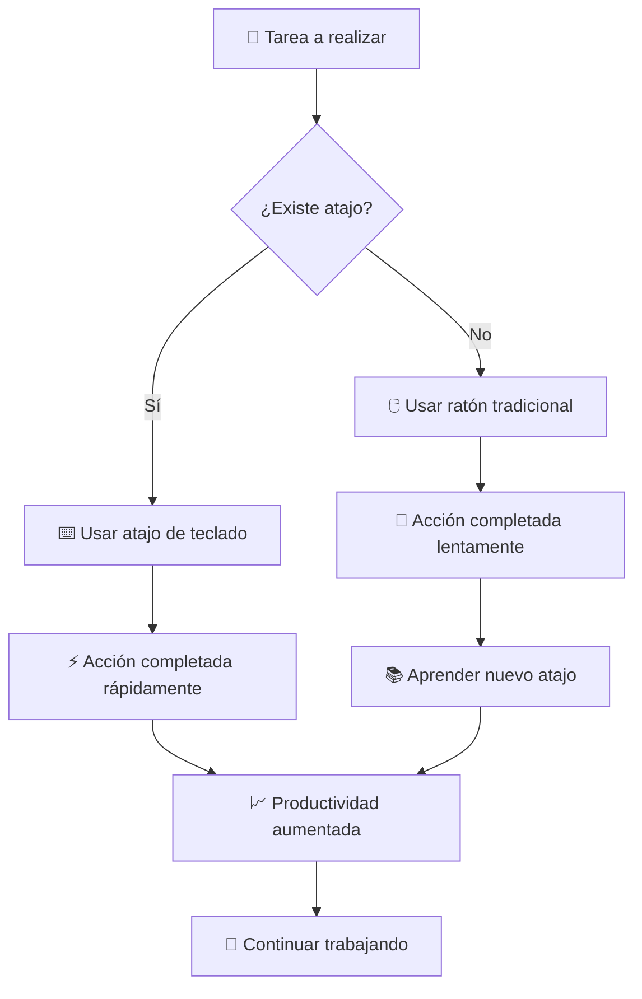

# ⌨️ Atajos de Teclado Universales

> [!info] 🎯 Contexto Los atajos de teclado son combinaciones de teclas que permiten realizar acciones de forma más rápida y eficiente en un sistema operativo o en una aplicación. Dominarlos puede ahorrar tiempo y mejorar la productividad significativamente, ya que evitan el uso del ratón para tareas repetitivas.

## 🔧 Variables Comunes

> [!tip] 🎛️ Teclas de Función Principales
> 
> - **`Ctrl`**: Tecla de Control, utilizada en la mayoría de las combinaciones para Windows
> - **`Cmd`**: Tecla de Comando (⌘), utilizada en la mayoría de las combinaciones para macOS
> - **`Shift`**: Tecla de Mayúsculas, usada para escribir letras mayúsculas y símbolos superiores
> - **`Alt`**: Tecla de Alternar (Windows) / Option (⌥) en macOS
> - **`Esc`**: Tecla de Escape, para cancelar acciones
> - **`Tab`**: Tecla de tabulación, para navegar entre elementos

## ⚙️ Procedimiento General

> [!warning] 📝 Técnica de Ejecución
> 
> 1. **Presionar y mantener** las teclas de función (como `Ctrl`, `Shift` o `Alt`)
> 2. **Presionar** la tecla del comando deseado
> 3. **Soltar todas las teclas** simultáneamente
> 
> ⚠️ **Importante**: Mantener presionadas las teclas modificadoras hasta completar la secuencia

## 📚 Explicación Teórica

> [!info] 🧠 Fundamentos del Sistema El uso de atajos de teclado se basa en la programación del sistema operativo y las aplicaciones para responder a comandos específicos. Por ejemplo, cuando se presiona `Ctrl + C`, el sistema operativo reconoce esta secuencia como el comando "Copiar" y realiza la acción correspondiente. Este método es mucho más eficiente a nivel de procesamiento que los clics del ratón, lo que se traduce en una experiencia de usuario más fluida.

## 🎯 Atajos Esenciales

### 📋 Gestión de Contenido

> [!tip] ✂️ Operaciones Básicas
> 
> |Acción|Windows|macOS|Descripción|
> |---|---|---|---|
> |**Copiar**|`Ctrl` + `C`|`Cmd` + `C`|📄 Copia selección al portapapeles|
> |**Cortar**|`Ctrl` + `X`|`Cmd` + `X`|✂️ Corta y copia al portapapeles|
> |**Pegar**|`Ctrl` + `V`|`Cmd` + `V`|📋 Pega contenido del portapapeles|
> |**Deshacer**|`Ctrl` + `Z`|`Cmd` + `Z`|↶ Deshace última acción|
> |**Rehacer**|`Ctrl` + `Y`|`Cmd` + `Shift` + `Z`|↷ Rehace acción deshecha|
> |**Seleccionar todo**|`Ctrl` + `A`|`Cmd` + `A`|🎯 Selecciona todo el contenido|

### 💾 Gestión de Archivos

> [!tip] 📁 Operaciones de Archivo
> 
> |Acción|Windows|macOS|Descripción|
> |---|---|---|---|
> |**Guardar**|`Ctrl` + `S`|`Cmd` + `S`|💾 Guarda documento actual|
> |**Guardar como**|`Ctrl` + `Shift` + `S`|`Cmd` + `Shift` + `S`|📝 Guarda con nuevo nombre|
> |**Abrir**|`Ctrl` + `O`|`Cmd` + `O`|📂 Abre archivo existente|
> |**Nuevo**|`Ctrl` + `N`|`Cmd` + `N`|➕ Crea nuevo documento|
> |**Imprimir**|`Ctrl` + `P`|`Cmd` + `P`|🖨️ Envía a impresora|

### 🔍 Navegación y Búsqueda

> [!tip] 🧭 Navegación Eficiente
> 
> |Acción|Windows|macOS|Descripción|
> |---|---|---|---|
> |**Buscar**|`Ctrl` + `F`|`Cmd` + `F`|🔍 Abre cuadro de búsqueda|
> |**Buscar y reemplazar**|`Ctrl` + `H`|`Cmd` + `Option` + `F`|🔄 Busca y reemplaza texto|
> |**Ir a línea**|`Ctrl` + `G`|`Cmd` + `L`|📍 Navega a línea específica|
> |**Buscar siguiente**|`F3`|`Cmd` + `G`|⬇️ Encuentra siguiente coincidencia|

### 🪟 Gestión de Ventanas

> [!tip] 🖼️ Control de Ventanas
> 
> |Acción|Windows|macOS|Descripción|
> |---|---|---|---|
> |**Cerrar ventana**|`Alt` + `F4`|`Cmd` + `Q`|❌ Cierra aplicación completa|
> |**Cerrar pestaña**|`Ctrl` + `W`|`Cmd` + `W`|🗙 Cierra pestaña actual|
> |**Nueva pestaña**|`Ctrl` + `T`|`Cmd` + `T`|➕ Abre nueva pestaña|
> |**Cambiar pestaña**|`Ctrl` + `Tab`|`Cmd` + `Option` + `→`|↔️ Navega entre pestañas|
> |**Cambiar aplicación**|`Alt` + `Tab`|`Cmd` + `Tab`|🔄 Cambia entre aplicaciones|

### ✏️ Edición de Texto

> [!tip] 📝 Manipulación de Texto
> 
> |Acción|Windows|macOS|Descripción|
> |---|---|---|---|
> |**Negrita**|`Ctrl` + `B`|`Cmd` + `B`|**🔤 Texto en negrita**|
> |**Cursiva**|`Ctrl` + `I`|`Cmd` + `I`|_🔤 Texto en cursiva_|
> |**Subrayado**|`Ctrl` + `U`|`Cmd` + `U`|<u>🔤 Texto subrayado</u>|
> |**Seleccionar palabra**|`Ctrl` + doble clic|`Cmd` + doble clic|🎯 Selecciona palabra completa|

## 🔄 Flujo de Trabajo Optimizado

## 💡 Ejemplo de Aplicación

> [!tip] 🎭 Escenario Práctico **Situación**: Escribiendo un documento y necesitas copiar un párrafo
> 
> **❌ Método tradicional:**
> 
> 1. Arrastrar ratón para seleccionar texto
> 2. Clic derecho
> 3. Elegir "Copiar" del menú
> 4. Navegar a destino
> 5. Clic derecho
> 6. Elegir "Peger"
> 
> **✅ Método con atajos:**
> 
> 7. Seleccionar texto con `Shift` + flechas
> 8. `Ctrl` + `C` para copiar
> 9. Navegar a destino
> 10. `Ctrl` + `V` para pegar
> 
> **Resultado**: ⚡ 70% menos tiempo invertido

## 🌐 Relación con Otros Temas

> [!info] 🔗 Conexiones Importantes El uso de atajos de teclado está directamente relacionado con:
>
> - **[[Automatizaciones Personales]]**: Acelera tareas cotidianas y flujo de trabajo
> - **[[Comandos ASCII]]**: Complementa el uso eficiente del teclado
> - **[[Automatización de Tareas]]**: Base para scripts y macros más complejas

## 📚 Atajos Avanzados por Contexto

### 🌐 Navegadores Web

> [!info] 🔗 Atajos para Navegación Web
> 
> |Acción|Windows|macOS|
> |---|---|---|
> |Recargar página|`F5` / `Ctrl` + `R`|`Cmd` + `R`|
> |Recargar sin caché|`Ctrl` + `F5`|`Cmd` + `Shift` + `R`|
> |Abrir enlace en nueva pestaña|`Ctrl` + clic|`Cmd` + clic|
> |Ir a barra de direcciones|`Ctrl` + `L`|`Cmd` + `L`|
> |Historial|`Ctrl` + `H`|`Cmd` + `Y`|

### 💻 Terminal/Línea de Comandos

> [!info] ⌨️ Atajos para Terminal
> 
> |Acción|Atajo|Descripción|
> |---|---|---|
> |Interrumpir proceso|`Ctrl` + `C`|⛔ Cancela comando actual|
> |Limpiar pantalla|`Ctrl` + `L`|🧹 Limpia terminal|
> |Autocompletar|`Tab`|🤖 Completa comando/archivo|
> |Historial anterior|`↑`|⬆️ Comando anterior|

## 📖 Referencias

> [!quote] 🔗 Enlaces a Notas Relacionadas
> 
> - [[Comandos ASCII]]
> - [[Productividad Digital]]
> - [[Automatización de Tareas]]

---

#atajos #teclado #productividad #eficiencia #ergonomía #windows #macos #navegación