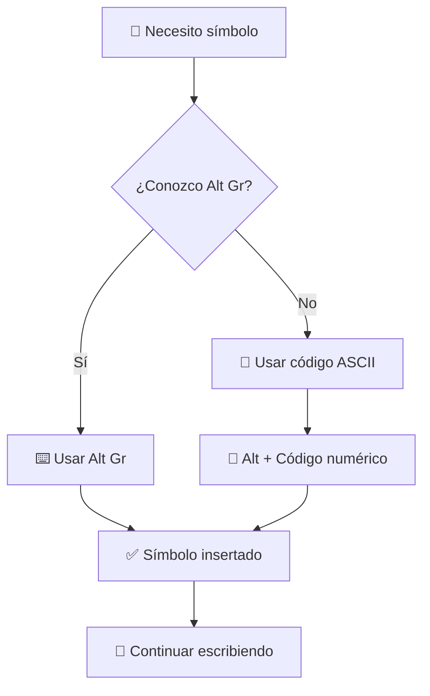

# ⌨️ Comandos ASCII Útiles para Teclados en Español

> [!info] 📋 Contexto En teclados con distribuciones en español, algunos símbolos de programación o de uso técnico, como los corchetes, las llaves o la barra invertida, no son fácilmente accesibles con una sola tecla. La combinación de la tecla `Alt Gr` o el uso de los códigos ASCII con la tecla `Alt` nos permiten insertarlos de manera rápida y eficiente.

## 🔧 Variables Comunes

> [!tip] 🎯 Definiciones Clave
> 
> - **`Alt`**: Tecla de función en el teclado que se utiliza en combinación con los códigos numéricos ASCII
> - **`Alt Gr`**: Tecla de función que permite acceder a los símbolos de tercera capa en el teclado, ubicada a la derecha de la barra espaciadora
> - **Teclado numérico**: Pad numérico ubicado en la parte derecha del teclado (debe estar activado con Num Lock)

## ⚙️ Procedimiento General

> [!warning] 📝 Pasos para usar códigos ASCII
> 
> 1. **Mantener presionada** la tecla `Alt`
> 2. **Escribir** el código numérico correspondiente al símbolo en el teclado numérico (`Num Pad`)
> 3. **Soltar** la tecla `Alt`
> 
> ⚠️ **Importante**: Debe usarse el teclado numérico, no los números de la fila superior

## 📚 Explicación Teórica

> [!info] 🧠 Fundamentos ASCII El **código ASCII (American Standard Code for Information Interchange)** es un estándar de codificación de caracteres que asigna un número a cada letra, número, signo de puntuación y símbolo. Al utilizar la combinación `Alt` + `Código`, le indicamos al sistema operativo que inserte el carácter que corresponde a ese número. Esta es una forma universal de acceder a símbolos, independientemente de la distribución del teclado.

## 🎯 Comandos Prácticos

> [!tip] 💡 Tabla de Símbolos Esenciales
> 
> |Símbolo|Nombre|Alt Gr|Código ASCII|
> |---|---|---|---|
> |`[`|Corchete apertura|`Alt Gr` + `(`|`Alt` + 91|
> |`]`|Corchete cierre|`Alt Gr` + `)`|`Alt` + 93|
> |`{`|Llave apertura|`Alt Gr` + `'`|`Alt` + 123|
> |`}`|Llave cierre|`Alt Gr` + `¡`|`Alt` + 125|
> |`~`|Tilde/virgulilla|`Alt Gr` + `4`|`Alt` + 126|
> |`^`|Circunflejo|`Shift` + `[`|`Alt` + 94|
> |`\`|Barra invertida|`Alt Gr` + `ç`|`Alt` + 92|
> |`@`|Arroba|`Alt Gr` + `2`|`Alt` + 64|
> |`#`|Numeral|`Alt Gr` + `3`|`Alt` + 35|
> |`|`|Barra vertical|`Alt Gr` + `1`|

### 🔗 Símbolos Adicionales Útiles

> [!info] ➕ Más Códigos ASCII
> 
> |Símbolo|Nombre|Código ASCII|
> |---|---|---|
> |`«`|Comillas dobles izq|`Alt` + 174|
> |`»`|Comillas dobles der|`Alt` + 175|
> |`°`|Grado|`Alt` + 248|
> |`±`|Más/menos|`Alt` + 241|
> |`¢`|Centavo|`Alt` + 155|
> |`£`|Libra|`Alt` + 156|
> |`¥`|Yen|`Alt` + 157|

## 🎨 Ejemplo de Aplicación

> [!tip] 💻 Código de Ejemplo Para escribir un fragmento de código en Python usando estos atajos:
> 
> ```python
> # Definir un diccionario usando Alt+123 y Alt+125
> mi_diccionario = {"clave": "valor"}
> 
> # Acceder a elemento de lista usando Alt+91 y Alt+93
> mi_lista = [1, 2, 3]
> elemento = mi_lista[0]
> 
> # Usar símbolo de potencia con Alt+94 o **
> resultado = 2**3
> 
> # Ruta de archivo con barra invertida Alt+92
> ruta = "C:\Users\Usuario\Documentos"
> ```

## 🔄 Flujo de Trabajo



## 🌐 Relación con Otros Temas

> [!info] 🔗 Conexiones Importantes La familiaridad con estos comandos es esencial en:
> 
> - **[[Módulo 6.1 Introducción a NumPy]]**: Corchetes `[]` para arrays, llaves `{}` para bloques
> - **[[Desarrollo Web]]**: Símbolos para HTML, CSS y JavaScript
> - **[[Línea de Comandos (CLI)]]**: Barra invertida `\` para rutas y escape de caracteres
> - **[[Markdown]]**: Símbolos especiales para formateo
> - **[[Expresiones Regulares (Regex)]]**: Caracteres especiales para expresiones regulares

## 📖 Referencias

> [!quote] 🔗 Enlaces a Notas Relacionadas
> 
> - [[Atajos de Teclado Universales]]
> - [[Atajos y Características de Obsidian]]


---

#teclado #ascii #programación #productividad #español #símbolos #atajos