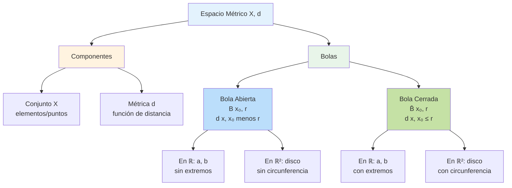

# 🌐 Espacios Métricos

## 🎯 ¿Qué es un Espacio Métrico?

> [!info]- 💡 Introducción Intuitiva Un **espacio métrico** es simplemente un conjunto de elementos donde podemos medir "distancias" entre ellos de manera consistente. Es la formalización matemática de la idea intuitiva de "qué tan lejos está algo de otra cosa".
> 
> **Analogías útiles:**
> 
> - **Mapa de una ciudad:** Puedes medir distancias entre cualquier par de lugares
> - **Red social:** Puedes medir "cercanía" entre personas (número de conexiones)
> - **Colores:** Puedes medir qué tan diferentes son dos colores
> 
> **La idea central:** Tener una manera precisa de hablar sobre "proximidad" entre elementos.

### 📐 Definición Formal

> [!note]- 🌟 Concepto Fundamental
> 
> **Definición:** Un **espacio métrico** es un par $(X, d)$ donde:
> 
> - $X$ es un conjunto no vacío (el **espacio**)
> - $d: X \times X \rightarrow \mathbb{R}$ es una **métrica** o **función de distancia**
> 
> La métrica $d$ debe satisfacer cuatro propiedades para todo $x, y, z \in X$:
> 
> **M1. No negatividad:** $$d(x, y) \geq 0$$ "Las distancias nunca son negativas"
> 
> **M2. Identidad:** $$d(x, y) = 0 \iff x = y$$ "La distancia es cero solo si los puntos son iguales"
> 
> **M3. Simetría:** $$d(x, y) = d(y, x)$$ "La distancia de A a B es igual a la de B a A"
> 
> **M4. Desigualdad triangular:** $$d(x, z) \leq d(x, y) + d(y, z)$$ "El camino directo nunca es más largo que un rodeo"

### 🔍 Interpretación Simple

> [!tip]- 💭 ¿Qué significa todo esto?
> 
> **En lenguaje cotidiano:**
> 
> Un espacio métrico es como un "universo matemático" donde:
> 
> - Los elementos son "puntos"
> - Puedes medir la distancia entre cualquier par de puntos
> - Esas distancias se comportan como esperarías en el mundo real
> 
> **Ejemplos cotidianos:**
> 
> - La ciudad donde vives (puntos = lugares, distancia = kilómetros)
> - Un grupo de personas (puntos = personas, distancia = diferencia de edad)
> - Palabras en un diccionario (puntos = palabras, distancia = número de letras diferentes)

## 🎨 Ejemplos Básicos de Espacios Métricos

### 📏 La Recta Real

> [!example]- 🔢 El Ejemplo Más Simple
> 
> **Espacio:** $(\mathbb{R}, d_E)$
> 
> **Métrica (distancia usual):** $$d_E(x, y) = |x - y|$$
> 
> **Interpretación:** La distancia es simplemente "cuánto hay que moverse" de un número a otro.
> 
> **Ejemplos concretos:**
> 
> - $d_E(3, 7) = |3 - 7| = 4$
> - $d_E(-2, 5) = |-2 - 5| = 7$
> - $d_E(4, 4) = |4 - 4| = 0$
> 
> **Visualización:** En una línea numérica, es literalmente la longitud del segmento entre dos puntos.

### 🗺️ El Plano

> [!example]- 🌍 Espacio Bidimensional
> 
> **Espacio:** $(\mathbb{R}^2, d_E)$
> 
> **Métrica euclidiana (distancia "en línea recta"):** $$d_E((x_1, y_1), (x_2, y_2)) = \sqrt{(x_2 - x_1)^2 + (y_2 - y_1)^2}$$
> 
> **Interpretación:** Es el Teorema de Pitágoras - la distancia en línea recta entre dos puntos.
> 
> **Ejemplos concretos:**
> 
> - $d_E((0, 0), (3, 4)) = \sqrt{9 + 16} = 5$
> - $d_E((1, 2), (4, 6)) = \sqrt{9 + 16} = 5$
> 
> **Visualización:** Como medir con una regla directamente de un punto a otro en un mapa.

### 🏙️ Distancia en Ciudades

> [!example]- 🚕 Métrica del Taxista
> 
> **Espacio:** $(\mathbb{R}^2, d_1)$
> 
> **Métrica Manhattan:** $$d_1((x_1, y_1), (x_2, y_2)) = |x_2 - x_1| + |y_2 - y_1|$$
> 
> **Interpretación:** Cómo se mueve un taxi en una ciudad con cuadrícula - solo puede ir horizontal o verticalmente.
> 
> **Ejemplos concretos:**
> 
> - $d_1((0, 0), (3, 4)) = 3 + 4 = 7$
> - $d_1((1, 2), (4, 6)) = 3 + 4 = 7$
> 
> **Comparación:**
> 
> - Distancia euclidiana de $(0,0)$ a $(3,4)$: 5 unidades
> - Distancia del taxista: 7 unidades (más larga porque no puede ir en diagonal)

### 🎲 Todo o Nada

> [!example]- 🔢 Métrica Discreta
> 
> **Espacio:** Cualquier conjunto $X$ con la métrica discreta
> 
> **Métrica discreta:** $$d_D(x, y) = \begin{cases} 0 & \text{si } x = y \ 1 & \text{si } x \neq y \end{cases}$$
> 
> **Interpretación:** Solo importa si dos elementos son iguales o diferentes, no "qué tan diferentes".
> 
> **Ejemplos concretos:**
> 
> - En $\mathbb{N}$: $d_D(5, 5) = 0$ pero $d_D(5, 6) = 1$ y también $d_D(5, 1000) = 1$
> - En palabras: $d_D(\text{"gato"}, \text{"gato"}) = 0$ pero $d_D(\text{"gato"}, \text{"perro"}) = 1$
> 
> **Característica especial:** Todos los elementos diferentes están a la misma distancia entre sí.

## 🔵 Bolas Abiertas y Cerradas

### 📐 Bola Abierta

> [!note]- ⭕ Definición de Bola Abierta
> 
> **Definición:** Sea $(X, d)$ un espacio métrico, $x_0 \in X$ un punto, y $r > 0$ un número real positivo.
> 
> La **bola abierta** con centro $x_0$ y radio $r$ es: $$B(x_0, r) = {x \in X : d(x, x_0) < r}$$
> 
> **En palabras:** Todos los puntos que están a distancia **estrictamente menor** que $r$ del centro.
> 
> **Nota clave:** La palabra "abierta" significa que NO incluimos los puntos que están exactamente a distancia $r$.
> 
> **Componentes:**
> 
> - $x_0$ = **centro** de la bola
> - $r$ = **radio** de la bola
> - $d$ = métrica que usamos para medir

### 🎯 Bola Cerrada

> [!note]- 🔵 Definición de Bola Cerrada
> 
> **Definición:** Sea $(X, d)$ un espacio métrico, $x_0 \in X$ un punto, y $r > 0$ un número real positivo.
> 
> La **bola cerrada** con centro $x_0$ y radio $r$ es: $$\overline{B}(x_0, r) = {x \in X : d(x, x_0) \leq r}$$
> 
> **En palabras:** Todos los puntos que están a distancia **menor o igual** que $r$ del centro.
> 
> **Nota clave:** La palabra "cerrada" significa que SÍ incluimos los puntos que están exactamente a distancia $r$.
> 
> **Diferencia con bola abierta:**
> 
> - Bola abierta: $d(x, x_0) < r$ (sin igualdad)
> - Bola cerrada: $d(x, x_0) \leq r$ (con igualdad)

### 🎨 Visualización: Diferencia entre Abierta y Cerrada

> [!tip]- 👁️ ¿Cómo se ven?
> 
> **En la recta real $(\mathbb{R}, d_E)$ con centro $x_0$ y radio $r$:**
> 
> **Bola abierta:** $$B(x_0, r) = (x_0 - r, x_0 + r)$$
> 
> - Es un intervalo abierto
> - NO incluye los extremos
> - Ejemplo: $B(0, 2) = (-2, 2)$ → NO incluye $-2$ ni $2$
> 
> **Bola cerrada:** $$\overline{B}(x_0, r) = [x_0 - r, x_0 + r]$$
> 
> - Es un intervalo cerrado
> - SÍ incluye los extremos
> - Ejemplo: $\overline{B}(0, 2) = [-2, 2]$ → SÍ incluye $-2$ y $2$
> 
> **Relación:** $$B(x_0, r) \subseteq \overline{B}(x_0, r)$$ La bola cerrada contiene a la bola abierta más su "borde".

## 🎨 Ejemplos Visuales de Bolas

### 📏 En la Recta Real

> [!example]- 🔢 $(\mathbb{R}, d_E)$
> 
> **Bola abierta $B(5, 2)$:** $$B(5, 2) = {x \in \mathbb{R} : |x - 5| < 2}$$ $$= {x \in \mathbb{R} : -2 < x - 5 < 2}$$ $$= {x \in \mathbb{R} : 3 < x < 7}$$ $$= (3, 7)$$
> 
> **Visualización:**
> 
> ```
> ───────○═══════════════════○───────
>        3                   7
>        ↑       radio=2     ↑
>        NO          5       NO
>      incluido  (centro)  incluido
> ```
> 
> **Bola cerrada $\overline{B}(5, 2)$:** $$\overline{B}(5, 2) = [3, 7]$$
> 
> **Visualización:**
> 
> ```
> ───────●═══════════════════●───────
>        3                   7
>        ↑       radio=2     ↑
>        SÍ          5       SÍ
>      incluido  (centro)  incluido
> ```

### 🗺️ En el Plano Euclidiano

> [!example]- 🌍 $(\mathbb{R}^2, d_E)$
> 
> **Bola abierta $B((0,0), 1)$:** $$B((0,0), 1) = {(x, y) \in \mathbb{R}^2 : \sqrt{x^2 + y^2} < 1}$$ $$= {(x, y) \in \mathbb{R}^2 : x^2 + y^2 < 1}$$
> 
> **Forma geométrica:** Disco circular (interior del círculo)
> 
> - NO incluye la circunferencia
> - Radio: 1
> - Centro: origen $(0, 0)$
> 
> **Visualización:**
> 
> ```
>         y
>         ↑
>         │     ╱─────╲
>         │   ╱    ●    ╲
>         │  │   (0,0)   │
>     ────┼──┼───────────┼──→ x
>         │  │           │
>         │   ╲         ╱
>         │     ╲─────╱
>         │    (sin borde)
> ```
> 
> **Bola cerrada $\overline{B}((0,0), 1)$:** $$\overline{B}((0,0), 1) = {(x, y) \in \mathbb{R}^2 : x^2 + y^2 \leq 1}$$
> 
> **Forma geométrica:** Disco circular (círculo + interior)
> 
> - SÍ incluye la circunferencia
> - Radio: 1
> - Centro: origen $(0, 0)$
> 
> **Visualización:**
> 
> ```
>         y
>         ↑
>         │     ●─────●
>         │   ●    ●    ●
>         │  ●   (0,0)   ●
>     ────┼──●───────────●──→ x
>         │  ●           ●
>         │   ●         ●
>         │     ●─────●
>         │   (con borde)
> ```

### 🏙️ En la Métrica del Taxista

> [!example]- 🚕 $(\mathbb{R}^2, d_1)$
> 
> **Bola abierta $B((0,0), 2)$ con métrica Manhattan:** $$B((0,0), 2) = {(x, y) : |x| + |y| < 2}$$
> 
> **Forma geométrica:** Rombo (cuadrado rotado 45°)
> 
> **Visualización:**
> 
> ```
>         y
>         ↑
>       2 │      ╱╲
>         │     ╱  ╲
>       1 │    ╱ ● ╲
>         │   ╱(0,0)╲
>     ────┼──╱────────╲──→ x
>       -2│-1    1    2
>         │   ╲      ╱
>         │    ╲    ╱
>         │     ╲  ╱
>         │      ╲╱
> ```
> 
> **Puntos extremos (NO incluidos en bola abierta):**
> 
> - $(2, 0)$: distancia $= |2| + |0| = 2$
> - $(0, 2)$: distancia $= |0| + |2| = 2$
> - $(-2, 0)$: distancia $= |-2| + |0| = 2$
> - $(0, -2)$: distancia $= |0| + |-2| = 2$
> 
> **Puntos intermedios (SÍ incluidos):**
> 
> - $(1, 0)$: distancia $= 1 < 2$ ✓
> - $(1, 0.5)$: distancia $= 1.5 < 2$ ✓
> - $(0.5, 1)$: distancia $= 1.5 < 2$ ✓

### 🎲 En la Métrica Discreta

> [!example]- 🔢 $(X, d_D)$
> 
> Sea $X$ cualquier conjunto con métrica discreta y $x_0 \in X$.
> 
> **Caso 1: Radio $r \leq 1$**
> 
> **Bola abierta $B(x_0, 1)$:** $$B(x_0, 1) = {x \in X : d_D(x, x_0) < 1}$$ Como $d_D$ solo toma valores $0$ o $1$, y necesitamos $< 1$: $$B(x_0, 1) = {x_0}$$ Solo el centro está en la bola.
> 
> **Bola cerrada $\overline{B}(x_0, 1)$:** $$\overline{B}(x_0, 1) = {x \in X : d_D(x, x_0) \leq 1}$$ Ahora incluimos distancias $= 1$: $$\overline{B}(x_0, 1) = X$$ ¡Todo el espacio!
> 
> **Caso 2: Radio $r > 1$**
> 
> **Tanto bola abierta como cerrada:** $$B(x_0, r) = \overline{B}(x_0, r) = X$$ Todo el espacio, porque todas las distancias son $\leq 1 < r$.
> 
> **Conclusión peculiar:** En métrica discreta, las bolas son muy diferentes a nuestra intuición geométrica.

## 🎯 ¿Para Qué Sirven las Bolas?

> [!tip]- 💡 Importancia de las Bolas
> 
> **1. Definir cercanía:** Las bolas formalizan "estar cerca de un punto".
> 
> - "$x$ está cerca de $x_0$" = "$x \in B(x_0, r)$ para algún $r$ pequeño"
> 
> **2. Definir conceptos topológicos:**
> 
> - **Conjunto abierto:** Contiene una bola alrededor de cada uno de sus puntos
> - **Punto interior:** Está en el interior si hay una bola a su alrededor
> - **Convergencia:** $x_n \to x$ significa que eventualmente $x_n \in B(x, \varepsilon)$ para todo $\varepsilon > 0$
> 
> **3. Aplicaciones prácticas:**
> 
> - **Búsqueda por proximidad:** Encontrar todos los elementos a distancia $< r$ de un punto
> - **Clustering:** Agrupar puntos que están "cerca"
> - **Filtrado:** Mantener solo puntos dentro de cierto radio
> 
> **4. Visualización geométrica:** Las bolas nos dan una intuición geométrica en espacios abstractos.

## 📊 Comparación Visual de Bolas en Diferentes Métricas

> [!example]- 🎨 Misma Posición y Radio, Diferentes Formas
> 
> Todas con centro en $(0, 0)$ y radio $r = 1$ en $\mathbb{R}^2$:
> 
> **Métrica Euclidiana ($d_E$):**
> 
> ```
>       ╱─────╲
>     ╱    ●    ╲
>    │   (0,0)   │
>    │           │
>     ╲         ╱
>       ╲─────╱
>     CÍRCULO
> ```
> 
> **Métrica del Taxista ($d_1$):**
> 
> ```
>        ╱╲
>       ╱  ╲
>      ╱ ● ╲
>     ╱(0,0)╲
>     ────────
>     ╲      ╱
>      ╲    ╱
>       ╲  ╱
>        ╲╱
>     ROMBO
> ```
> 
> **Métrica del Supremo ($d_\infty$):**
> 
> ```
>     ┌────────┐
>     │        │
>     │   ●    │
>     │ (0,0)  │
>     │        │
>     └────────┘
>     CUADRADO
> ```
> 
> **Observación importante:** La misma "bola de radio 1" tiene diferentes formas dependiendo de cómo medimos distancias.

## 🔗 Conexiones con el Sistema de Notas

> [!quote]- 🌐 Enlaces Conceptuales
> 
> **Prerequisitos:**
> 
> - [[00.1 Métricas]] - Definición de función de distancia
> - [[Conjuntos]] - Teoría básica de conjuntos
> - [[Funciones]] - Concepto de función
> 
> **Temas relacionados:**
> 
> - [[00.3 Puntos de Acumulación]] - Usa bolas para definir proximidad
> - [[Topología]] - Las bolas generan la topología
> - [[Convergencia]] - Definida usando bolas
> 
> **Aplicaciones:**
> 
> - [[Continuidad]] - Definición con bolas (ε-δ)
> - [[Algoritmos de Búsqueda]] - Búsqueda por proximidad
> - [[Clustering]] - Agrupamiento por distancia

## 🧪 Ejercicios Simples

> [!example]- 💪 Práctica Básica
> 
> **Ejercicio 1:** En $(\mathbb{R}, d_E)$, describir explícitamente:
> 
> - $B(3, 2)$
> - $\overline{B}(3, 2)$
> - ¿Cuál es la diferencia?
> 
> **Solución:**
> 
> - $B(3, 2) = (1, 5)$ (intervalo abierto, sin extremos)
> - $\overline{B}(3, 2) = [1, 5]$ (intervalo cerrado, con extremos)
> - Diferencia: Los puntos $1$ y $5$ están en la cerrada pero no en la abierta
> 
> **Ejercicio 2:** En $(\mathbb{R}^2, d_E)$, ¿el punto $(3, 4)$ está en $B((0, 0), 5)$?
> 
> **Solución:**
> 
> - Distancia: $d_E((0,0), (3,4)) = \sqrt{9 + 16} = 5$
> - Como $5 \not< 5$, entonces $(3, 4) \notin B((0, 0), 5)$
> - Pero SÍ está en $\overline{B}((0, 0), 5)$ porque $5 \leq 5$
> 
> **Ejercicio 3:** En $(X, d_D)$ con $X = {a, b, c, d}$ y $x_0 = a$:
> 
> - ¿Qué elementos tiene $B(a, 0.5)$?
> - ¿Y $B(a, 1)$?
> - ¿Y $\overline{B}(a, 1)$?
> 
> **Solución:**
> 
> - $B(a, 0.5) = {a}$ (solo $d_D(a, a) = 0 < 0.5$)
> - $B(a, 1) = {a}$ (solo $d_D(a, a) = 0 < 1$, los demás tienen distancia $1$)
> - $\overline{B}(a, 1) = {a, b, c, d} = X$ (todos tienen distancia $\leq 1$)

## 📚 Resumen Visual



---

**Tags:** #espacios-métricos #bolas #bola-abierta #bola-cerrada #métrica #distancia #topología-básica #análisis-real #university #mathematics #conceptos-fundamentales