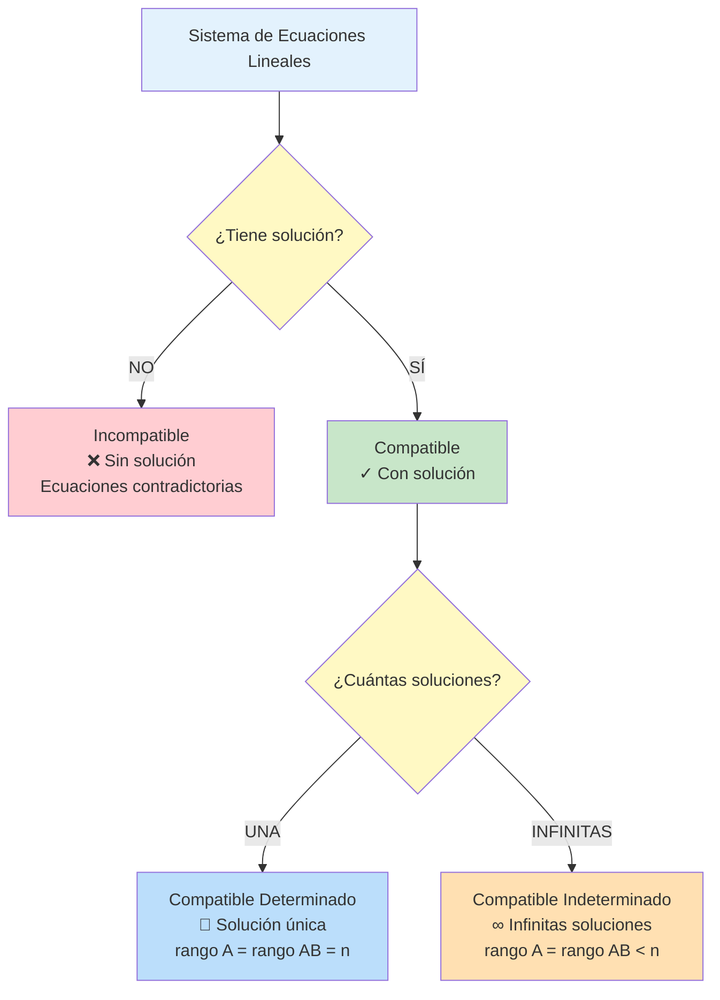

# 📐 Sistemas de Ecuaciones Lineales (S.E.L.)

## 🎯 Fundamentos de los Sistemas

> [!info]- 💡 Introducción a los Sistemas de Ecuaciones Lineales Un **Sistema de Ecuaciones Lineales (S.E.L.)** es un conjunto de dos o más ecuaciones lineales con las mismas incógnitas que deben satisfacerse simultáneamente. Encontrar la solución de un sistema significa hallar los valores de las incógnitas que hacen verdaderas todas las ecuaciones al mismo tiempo.
> 
> **Analogías útiles:**
> 
> - **Intersección de caminos:** Cada ecuación representa un "camino" y la solución es donde todos se encuentran
> - **Sistema de restricciones:** Como requisitos que deben cumplirse todos a la vez
> - **Balance simultáneo:** Como balanzas múltiples que deben equilibrarse juntas
> 
> **Importancia histórica:**
> 
> - **China antigua (200 a.C.):** "Los nueve capítulos" contiene métodos sistemáticos
> - **Gauss (1809):** Formalización del método de eliminación
> - **Cramer (1750):** Regla de Cramer para sistemas pequeños
> - **Aplicaciones modernas:** Base de algoritmos en ingeniería, economía, física, computación

## 📝 Definición y Notación

### 🔢 Forma General de un Sistema

> [!note]- 📋 Estructura Matemática Un sistema de **m ecuaciones** con **n incógnitas** se escribe:
> 
> ```
> a₁₁x₁ + a₁₂x₂ + ... + a₁ₙxₙ = b₁
> a₂₁x₁ + a₂₂x₂ + ... + a₂ₙxₙ = b₂
>   ⋮         ⋮            ⋮      ⋮
> aₘ₁x₁ + aₘ₂x₂ + ... + aₘₙxₙ = bₘ
> ```
> 
> **Componentes:**
> 
> - **x₁, x₂, ..., xₙ:** Incógnitas o variables del sistema
> - **aᵢⱼ:** Coeficientes (números que multiplican a las variables)
> - **bᵢ:** Términos independientes (lado derecho de las ecuaciones)
> - **m:** Número de ecuaciones
> - **n:** Número de incógnitas
> 
> **Notación de índices:**
> 
> - Primer subíndice (i): número de ecuación
> - Segundo subíndice (j): número de variable
> - Ejemplo: a₂₃ es el coeficiente de x₃ en la segunda ecuación

### ✅ Ejemplos de Sistemas

> [!example]- 🎯 Casos Representativos
> 
> **Sistema 2×2 (2 ecuaciones, 2 incógnitas):**
> 
> ```
> 2x + 3y = 7
>  x -  y = 1
> ```
> 
> **Sistema 3×3:**
> 
> ```
> 2x + 3y - z = 5
>  x - 2y + 4z = 1
> 3x +  y + 2z = 7
> ```
> 
> **Sistema rectangular (3×2):**
> 
> ```
> x + 2y = 3
> 2x - y = 1
> 3x + y = 5
> ```
> 
> Más ecuaciones que incógnitas (sobredeterminado)
> 
> **Sistema rectangular (2×3):**
> 
> ```
> x + y + z = 6
> 2x - y + 3z = 14
> ```
> 
> Más incógnitas que ecuaciones (subdeterminado)

### 🔗 Conexión con Matrices (Recordatorio)

> [!tip]- 📊 Notación Matricial Un sistema se puede expresar en forma matricial compacta:
> 
> **AX = B**
> 
> Donde:
> 
> ```
> A = [a₁₁  a₁₂  ...  a₁ₙ]    X = [x₁]    B = [b₁]
>     [a₂₁  a₂₂  ...  a₂ₙ]        [x₂]        [b₂]
>     [ ⋮    ⋮    ⋱    ⋮ ]        [⋮ ]        [⋮ ]
>     [aₘ₁  aₘ₂  ...  aₘₙ]        [xₙ]        [bₘ]
> ```
> 
> - **A:** Matriz de coeficientes (m×n)
> - **X:** Vector de incógnitas (n×1)
> - **B:** Vector de términos independientes (m×1)
> 
> **Matriz ampliada [A|B]:**
> 
> ```
> [a₁₁  a₁₂  ...  a₁ₙ | b₁]
> [a₂₁  a₂₂  ...  a₂ₙ | b₂]
> [ ⋮    ⋮    ⋱    ⋮  | ⋮ ]
> [aₘ₁  aₘ₂  ...  aₘₙ | bₘ]
> ```
> 
> Esta notación será fundamental para el método de Gauss.

## 🎨 Interpretación Geométrica

### 📍 Visualización de Sistemas

> [!success]- 🌍 Significado Geométrico
> 
> **En ℝ² (dos variables):**
> 
> - Cada ecuación lineal representa una **recta** en el plano
> - La solución es el **punto de intersección** de las rectas
> 
> **Casos posibles:**
> 
> ```
> Caso 1: Una solución          Caso 2: Sin solución
>    y                              y
>    |  \    /                      |  ║    ║
>    |   \  /                       |  ║    ║
>    |    \/  ← Punto único         |  ║    ║  ← Paralelas
>    |    /\                        |  ║    ║
>    +-------x                      +-------x
> 
> Caso 3: Infinitas soluciones
>    y
>    |  ═══════  ← Misma recta
>    |
>    +-------x
> ```
> 
> **En ℝ³ (tres variables):**
> 
> - Cada ecuación representa un **plano** en el espacio
> - La solución es la **intersección** de los planos
> 
> **Casos en ℝ³:**
> 
> - **Un punto:** Los tres planos se intersectan en un único punto
> - **Una recta:** Los planos se intersectan en una línea común
> - **Un plano:** Los tres planos coinciden
> - **Sin solución:** Los planos no tienen punto común (paralelos o sin intersección común)
> 
> **Para n > 3:**
> 
> - Trabajamos con **hiperplanos** en espacios de n dimensiones
> - La intuición geométrica se extiende conceptualmente

## 📊 Clasificación de Sistemas

### 🎯 Tipos Según Existencia de Soluciones

> [!warning]- 🔴 Sistema Incompatible (Sin Solución)
> 
> **Definición:** Un sistema es **incompatible** o **inconsistente** si no tiene ninguna solución. No existe ningún conjunto de valores que satisfaga simultáneamente todas las ecuaciones.
> 
> **Características:**
> 
> - Las ecuaciones se contradicen entre sí
> - Geométricamente: rectas paralelas, planos paralelos o sin intersección común
> 
> **Ejemplo en ℝ²:**
> 
> ```
> x + y = 3
> x + y = 7
> ```
> 
> Las rectas son paralelas (misma pendiente, diferentes ordenadas al origen)
> 
> **Ejemplo en ℝ³:**
> 
> ```
> x + y + z = 1
> x + y + z = 2
> 2x - y + 3z = 5
> ```
> 
> Las dos primeras ecuaciones son contradictorias
> 
> **Identificación algebraica:** Al resolver, se llega a una contradicción como 0 = 5

> [!success]- 🟢 Sistema Compatible (Con Solución)
> 
> **Definición:** Un sistema es **compatible** o **consistente** si tiene al menos una solución.
> 
> Se subdivide en dos categorías importantes:

#### 🎯 Compatible Determinado

> [!note]- 🔵 Sistema Compatible Determinado (Solución Única)
> 
> **Definición:** El sistema tiene **exactamente una solución única**. Existe un único conjunto de valores que satisface todas las ecuaciones.
> 
> **Características:**
> 
> - La forma más común en aplicaciones prácticas
> - Número de ecuaciones independientes = número de incógnitas
> - Geométricamente: intersección en un único punto
> 
> **Ejemplo en ℝ²:**
> 
> ```
> 2x + y = 5
> x - y = 1
> ```
> 
> Solución única: x = 2, y = 1
> 
> **Ejemplo en ℝ³:**
> 
> ```
> x + y + z = 6
> 2x - y + z = 3
> x + 2y - z = 0
> ```
> 
> Los tres planos se intersectan en un único punto
> 
> **Condición algebraica:**
> 
> - Rango(A) = Rango([A|B]) = n (número de incógnitas)

#### 🎯 Compatible Indeterminado

> [!note]- 🟡 Sistema Compatible Indeterminado (Infinitas Soluciones)
> 
> **Definición:** El sistema tiene **infinitas soluciones**. Existe un conjunto infinito de valores que satisfacen todas las ecuaciones simultáneamente.
> 
> **Características:**
> 
> - Hay ecuaciones redundantes (no aportan información nueva)
> - Una o más incógnitas quedan como parámetros libres
> - Geométricamente: rectas coincidentes, intersección en una recta, etc.
> 
> **Ejemplo en ℝ² (rectas coincidentes):**
> 
> ```
> 2x + y = 3
> 4x + 2y = 6  ← Múltiplo de la primera
> ```
> 
> Infinitas soluciones: y = 3 - 2x (para cualquier x ∈ ℝ)
> 
> **Ejemplo en ℝ³ (intersección en una recta):**
> 
> ```
> x + y + z = 1
> 2x + 2y + 2z = 2  ← Múltiplo de la primera
> ```
> 
> Infinitas soluciones parametrizadas
> 
> **Expresión de soluciones:** Se expresan en función de parámetros libres (variables independientes)
> 
> - Ejemplo: x = t, y = 1 - t, z = 0 donde t ∈ ℝ
> 
> **Condición algebraica:**
> 
> - Rango(A) = Rango([A|B]) < n (menor que el número de incógnitas)

### 📊 Diagrama de Clasificación



### 📋 Tabla Resumen Comparativa

> [!example]- 📊 Comparación de Tipos
> 
> |Tipo|Soluciones|Interpretación Geométrica (ℝ²)|Interpretación Geométrica (ℝ³)|Condición (Rango)|
> |---|---|---|---|---|
> |**Incompatible**|0|Rectas paralelas distintas|Planos sin intersección común|rango(A) ≠ rango([A\|B])|
> |**Compatible Determinado**|1|Rectas que se cortan en un punto|Planos que se cortan en un punto|rango(A) = rango([A\|B]) = n|
> |**Compatible Indeterminado**|∞|Rectas coincidentes|Planos coincidentes o intersección en recta/plano|rango(A) = rango([A\|B]) < n|

## 🔧 Métodos de Solución para Sistemas Pequeños

### ✏️ Método de Sustitución

> [!tip]- 🔄 Sustitución Paso a Paso
> 
> **Procedimiento:**
> 
> 1. **Despejar** una variable en una de las ecuaciones
> 2. **Sustituir** esa expresión en las demás ecuaciones
> 3. **Resolver** el sistema reducido
> 4. **Retroceder** para encontrar todas las variables
> 
> **Ejemplo detallado:**
> 
> ```
> Sistema:
> (1)  2x + y = 5
> (2)  x - y = 1
> 
> Paso 1: Despejar y de la ecuación (2)
>         y = x - 1
> 
> Paso 2: Sustituir en (1)
>         2x + (x - 1) = 5
>         3x - 1 = 5
> 
> Paso 3: Resolver para x
>         3x = 6
>         x = 2
> 
> Paso 4: Sustituir x = 2 en y = x - 1
>         y = 2 - 1 = 1
> 
> Solución: x = 2, y = 1
> ```
> 
> **Ventajas:**
> 
> - Intuitivo y directo
> - Útil para sistemas pequeños (2×2, 3×3)
> - No requiere notación matricial
> 
> **Desventajas:**
> 
> - Tedioso para sistemas grandes
> - Puede generar fracciones complicadas
> - Difícil de sistematizar

### ⚖️ Método de Igualación

> [!tip]- ⚖️ Igualación Paso a Paso
> 
> **Procedimiento:**
> 
> 1. **Despejar** la misma variable en dos ecuaciones
> 2. **Igualar** las expresiones obtenidas
> 3. **Resolver** para la otra variable
> 4. **Sustituir** para encontrar la variable despejada
> 
> **Ejemplo detallado:**
> 
> ```
> Sistema:
> (1)  2x + y = 5
> (2)  x - y = 1
> 
> Paso 1: Despejar y en ambas ecuaciones
>         De (1): y = 5 - 2x
>         De (2): y = x - 1
> 
> Paso 2: Igualar las expresiones
>         5 - 2x = x - 1
> 
> Paso 3: Resolver para x
>         5 + 1 = x + 2x
>         6 = 3x
>         x = 2
> 
> Paso 4: Sustituir en cualquiera
>         y = 2 - 1 = 1
> 
> Solución: x = 2, y = 1
> ```
> 
> **Ventajas:**
> 
> - Simétrico y ordenado
> - Reduce errores de sustitución
> - Bueno cuando los coeficientes facilitan el despeje
> 
> **Desventajas:**
> 
> - Similar al de sustitución para sistemas grandes
> - Puede generar expresiones complejas

### ➕ Método de Eliminación (Reducción)

> [!tip]- ➕➖ Eliminación por Combinación Lineal
> 
> **Procedimiento:**
> 
> 1. **Multiplicar** ecuaciones por constantes adecuadas
> 2. **Sumar o restar** ecuaciones para eliminar una variable
> 3. **Resolver** el sistema reducido
> 4. **Sustituir regresivamente** para las demás variables
> 
> **Ejemplo detallado:**
> 
> ```
> Sistema:
> (1)  2x + y = 5
> (2)  x - y = 1
> 
> Paso 1: Observar que los coeficientes de y son opuestos
> 
> Paso 2: Sumar (1) + (2) para eliminar y
>         2x + y = 5
>       + x - y = 1
>         ─────────
>         3x = 6
> 
> Paso 3: Resolver para x
>         x = 2
> 
> Paso 4: Sustituir en (2)
>         2 - y = 1
>         y = 1
> 
> Solución: x = 2, y = 1
> ```
> 
> **Ejemplo con multiplicación:**
> 
> ```
> Sistema:
> (1)  3x + 2y = 12
> (2)  2x + 5y = 19
> 
> Paso 1: Multiplicar para igualar coeficientes de x
>         (1) × 2:  6x + 4y = 24
>         (2) × 3:  6x + 15y = 57
> 
> Paso 2: Restar para eliminar x
>         6x + 15y = 57
>       - (6x + 4y = 24)
>         ──────────────
>         11y = 33
> 
> Paso 3: Resolver
>         y = 3
> 
> Paso 4: Sustituir en (1)
>         3x + 2(3) = 12
>         3x = 6
>         x = 2
> 
> Solución: x = 2, y = 3
> ```
> 
> **Ventajas:**
> 
> - Base del método de Gauss
> - Sistemático y algorítmico
> - Evita fracciones hasta el final (si se eligen bien los multiplicadores)
> 
> **Desventajas:**
> 
> - Requiere elegir multiplicadores adecuados
> - Para sistemas grandes, necesita organización matricial

## 🔢 Operaciones Elementales sobre Ecuaciones

> [!note]- ⚙️ Transformaciones Permitidas
> 
> Las siguientes operaciones **no cambian el conjunto de soluciones** del sistema:
> 
> **1. Intercambiar dos ecuaciones (Eᵢ ↔ Eⱼ)**
> 
> ```
> Original:        Después del intercambio:
> E₁: x + y = 3    E₂: 2x - y = 1
> E₂: 2x - y = 1   E₁: x + y = 3
> ```
> 
> **2. Multiplicar una ecuación por una constante no nula (Eᵢ → k·Eᵢ, k ≠ 0)**
> 
> ```
> Original:        Multiplicar E₁ por 2:
> E₁: x + y = 3    E₁: 2x + 2y = 6
> E₂: 2x - y = 1   E₂: 2x - y = 1
> ```
> 
> **3. Sumar a una ecuación un múltiplo de otra (Eᵢ → Eᵢ + k·Eⱼ)**
> 
> ```
> Original:        E₂ → E₂ - 2·E₁:
> E₁: x + y = 3    E₁: x + y = 3
> E₂: 2x - y = 1   E₂: -3y = -5
> ```
> 
> **Notación matricial (para el método de Gauss):**
> 
> - **Rᵢ ↔ Rⱼ:** Intercambiar filas i y j
> - **Rᵢ → k·Rᵢ:** Multiplicar fila i por k
> - **Rᵢ → Rᵢ + k·Rⱼ:** Sumar a la fila i un múltiplo k de la fila j
> 
> Estas operaciones serán fundamentales en el algoritmo de Gauss.

## 🎓 Ejemplos Completos de Clasificación

> [!example]- 💪 Casos de Estudio Detallados
> 
> **Caso 1: Sistema Compatible Determinado**
> 
> ```
> x + y = 4
> x - y = 2
> 
> Por sustitución: y = 4 - x
> x - (4 - x) = 2
> 2x = 6 → x = 3
> y = 1
> 
> ✓ Solución única: (3, 1)
> Tipo: Compatible Determinado
> ```
> 
> **Caso 2: Sistema Incompatible**
> 
> ```
> 2x + y = 3
> 2x + y = 7
> 
> Si restamos las ecuaciones:
> 0 = -4  ← Contradicción
> 
> ✗ No hay solución
> Tipo: Incompatible
> ```
> 
> **Caso 3: Sistema Compatible Indeterminado**
> 
> ```
> x + 2y = 3
> 2x + 4y = 6  ← Es 2 × (primera ecuación)
> 
> La segunda no aporta información nueva
> Solución: x = 3 - 2t, y = t, para t ∈ ℝ
> 
> ∞ Infinitas soluciones
> Tipo: Compatible Indeterminado
> ```
> 
> **Caso 4: Sistema 3×3 Compatible Determinado**
> 
> ```
> x + y + z = 6
> 2x - y + z = 3
> x + 2y - z = 0
> 
> Resolviendo sistemáticamente:
> Solución: x = 1, y = 2, z = 3
> 
> ✓ Solución única
> Tipo: Compatible Determinado
> ```

## 🎯 Estrategia para Analizar Sistemas

> [!success]- 🗺️ Guía de Análisis
> 
> **Pasos para identificar el tipo de sistema:**
> 
> 1. **Observación inicial:**
>     - ¿Hay ecuaciones idénticas o múltiplos entre sí?
>     - ¿Hay ecuaciones contradictorias evidentes?
> 2. **Conteo:**
>     - m = número de ecuaciones
>     - n = número de incógnitas
>     - Si m < n: probablemente indeterminado
>     - Si m = n: puede ser determinado o incompatible
>     - Si m > n: puede ser incompatible o determinado
> 3. **Resolución inicial:**
>     - Aplicar método de eliminación
>     - Observar si aparecen contradicciones (0 = k, k ≠ 0)
>     - Observar si quedan variables libres
> 4. **Cálculo del rango (método avanzado):**
>     - rango(A) vs rango([A|B])
>     - Esto se verá en detalle con el método de Gauss

## 🔗 Conexión con Temas Siguientes

> [!quote]- 🌐 Puentes Conceptuales
> 
> **Esta nota establece las bases para:**
> 
> - **[[Matriz Ampliada y Gauss]]** - Método sistemático de solución
> - **[[Rango de una Matriz]]** - Criterio algebraico de clasificación
> - **[[Espacios Vectoriales]]** - Interpretación en términos de dependencia lineal
> - **[[Determinantes]]** - Criterio para sistemas cuadrados
> 
> **Aplicaciones directas:**
> 
> - **Física:** Análisis de circuitos, equilibrio de fuerzas
> - **Economía:** Modelos de oferta-demanda, optimización
> - **Ingeniería:** Análisis estructural, procesamiento de señales
> - **Computación:** Gráficos 3D, machine learning, sistemas de recomendación

---

**Tags:** #sistemas-ecuaciones-lineales #SEL #algebra-lineal #compatible #incompatible #determinado #indeterminado #metodos-solucion #sustitucion #igualacion #eliminacion #interpretacion-geometrica #clasificacion-sistemas #university #mathematics #linear-algebra