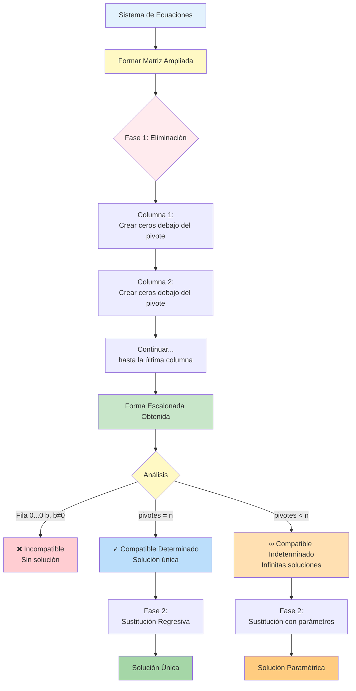

# 🔢 Algoritmo de Gauss

## 🎯 Fundamentos del Método

> [!info]- 💡 Introducción al Método de Eliminación Gaussiana El **Algoritmo de Gauss** (o método de eliminación gaussiana) es un procedimiento sistemático para resolver sistemas de ecuaciones lineales mediante operaciones elementales sobre filas. Transforma el sistema original en uno equivalente más simple (forma escalonada) que es fácil de resolver mediante sustitución regresiva.
> 
> **Analogías útiles:**
> 
> - **Escalera descendente:** Cada paso nos acerca a la solución simplificando progresivamente
> - **Limpieza ordenada:** Eliminamos variables de abajo hacia arriba, una columna a la vez
> - **Triangulación:** Convertimos una matriz en forma triangular superior
> 
> **Importancia histórica:**
> 
> - **Carl Friedrich Gauss (1777-1855):** Popularizó el método al usarlo para calcular órbitas de asteroides
> - **China antigua:** Métodos similares aparecen en textos del siglo II a.C.
> - **Computación moderna:** Base de algoritmos numéricos en software científico
> - **Aplicaciones actuales:** Gráficos 3D, inteligencia artificial, simulaciones físicas
> 
> **¿Por qué es importante?**
> 
> - Método **sistemático y algorítmico** (puede programarse)
> - Funciona para sistemas de **cualquier tamaño**
> - Permite **clasificar** el sistema durante el proceso
> - Base para calcular el **rango** de una matriz

## 📐 Matriz Ampliada

### 🔗 Representación Matricial del Sistema

> [!note]- 📊 De Ecuaciones a Matriz Ampliada
> 
> Para aplicar Gauss, primero representamos el sistema como una **matriz ampliada**:
> 
> **Sistema original:**
> 
> ```
> a₁₁x₁ + a₁₂x₂ + ... + a₁ₙxₙ = b₁
> a₂₁x₁ + a₂₂x₂ + ... + a₂ₙxₙ = b₂
>   ⋮         ⋮            ⋮      ⋮
> aₘ₁x₁ + aₘ₂x₂ + ... + aₘₙxₙ = bₘ
> ```
> 
> **Matriz ampliada [A|B]:**
> 
> ```
> [a₁₁  a₁₂  ...  a₁ₙ | b₁]
> [a₂₁  a₂₂  ...  a₂ₙ | b₂]
> [ ⋮    ⋮    ⋱    ⋮  | ⋮ ]
> [aₘ₁  aₘ₂  ...  aₘₙ | bₘ]
> ```
> 
> **Componentes:**
> 
> - **Parte izquierda (A):** Coeficientes de las variables
> - **Línea vertical (|):** Separador visual
> - **Parte derecha (B):** Términos independientes
> 
> **Ventajas:**
> 
> - Notación compacta y organizada
> - Facilita las operaciones elementales
> - Permite trabajar con números directamente

### ✅ Ejemplo de Conversión

> [!example]- 🔄 Del Sistema a la Matriz Ampliada
> 
> **Sistema:**
> 
> ```
> 2x + 3y - z = 5
>  x - 2y + 4z = 1
> 3x +  y + 2z = 7
> ```
> 
> **Paso 1: Identificar coeficientes**
> 
> - Ecuación 1: coeficientes (2, 3, -1), término independiente 5
> - Ecuación 2: coeficientes (1, -2, 4), término independiente 1
> - Ecuación 3: coeficientes (3, 1, 2), término independiente 7
> 
> **Paso 2: Formar la matriz ampliada**
> 
> ```
> [ 2   3  -1 | 5]
> [ 1  -2   4 | 1]
> [ 3   1   2 | 7]
> ```
> 
> **Atención a detalles:**
> 
> - Mantener el orden de las variables (x, y, z)
> - Incluir signos negativos
> - Si una variable no aparece, su coeficiente es 0
> 
> **Ejemplo con ceros:**
> 
> ```
> Sistema:           Matriz ampliada:
> x + z = 2         [ 1  0  1 | 2]
> y - z = 1         [ 0  1 -1 | 1]
> x + y = 3         [ 1  1  0 | 3]
> ```

## 🔧 Operaciones Elementales sobre Filas

> [!tip]- ⚙️ Las Tres Operaciones Fundamentales
> 
> Estas operaciones **no cambian el conjunto de soluciones** del sistema:
> 
> **1. Intercambio de filas (Rᵢ ↔ Rⱼ)**
> 
> - Intercambiar la posición de dos filas
> - **Notación:** Rᵢ ↔ Rⱼ
> - **Ejemplo:**
> 
> ```
> Original:          Después de R₁ ↔ R₂:
> [ 2  1 | 3]       [ 1  2 | 4]
> [ 1  2 | 4]       [ 2  1 | 3]
> ```
> 
> **2. Multiplicación de una fila por una constante no nula (Rᵢ → k·Rᵢ, k ≠ 0)**
> 
> - Multiplicar todos los elementos de una fila por k
> - **Notación:** Rᵢ → k·Rᵢ o k·Rᵢ
> - **Ejemplo:**
> 
> ```
> Original:          Después de R₁ → 2·R₁:
> [ 1  2 | 3]       [ 2  4 | 6]
> [ 3  1 | 5]       [ 3  1 | 5]
> ```
> 
> **3. Suma de un múltiplo de una fila a otra (Rᵢ → Rᵢ + k·Rⱼ)**
> 
> - Sumar a una fila un múltiplo de otra fila
> - **Notación:** Rᵢ → Rᵢ + k·Rⱼ
> - **Ejemplo:**
> 
> ```
> Original:          Después de R₂ → R₂ - 3·R₁:
> [ 1  2 | 3]       [ 1  2 |  3]
> [ 3  1 | 5]       [ 0 -5 | -4]
> ```
> 
> **Reglas importantes:**
> 
> - La operación 3 es la más usada (para crear ceros)
> - La fila que se usa como referencia (Rⱼ) NO cambia
> - Solo la fila objetivo (Rᵢ) se modifica
> - Siempre documentar cada operación realizada

## 📊 Forma Escalonada

### 🎯 Definición y Características

> [!success]- 📐 Forma Escalonada (Row Echelon Form)
> 
> Una matriz está en **forma escalonada** si cumple:
> 
> **Condiciones:**
> 
> 1. Todas las filas nulas (solo ceros) están al final
> 2. El primer elemento no nulo de cada fila (llamado **pivote**) está a la derecha del pivote de la fila anterior
> 3. Todos los elementos debajo de cada pivote son ceros
> 
> **Estructura visual:**
> 
> ```
> [★  *  *  *  | *]    ★ = pivotes
> [0  ★  *  *  | *]    * = cualquier número
> [0  0  0  ★  | *]    0 = ceros obligatorios
> [0  0  0  0  | 0]
> ```
> 
> **Características del "escalón":**
> 
> - Forma una escalera descendente de izquierda a derecha
> - Cada escalón tiene un pivote (primer elemento no nulo)
> - Todo lo que está debajo de los pivotes es cero
> 
> **Ejemplo de forma escalonada:**
> 
> ```
> [ 1  2  3 | 4]    Pivotes en: (1,1), (2,2), (3,4)
> [ 0  1  5 | 6]    
> [ 0  0  2 | 8]    
> ```
> 
> **No está en forma escalonada:**
> 
> ```
> [ 1  2  3 | 4]
> [ 2  1  5 | 6]    ← El 2 debería ser 0
> [ 0  0  2 | 8]
> ```

### 🌟 Forma Escalonada Reducida (Gauss-Jordan)

> [!info]- ✨ Forma Escalonada Reducida (Reduced Row Echelon Form)
> 
> Una forma más simplificada donde:
> 
> **Condiciones adicionales:**
> 
> 1. Cumple todas las condiciones de forma escalonada
> 2. Cada pivote es 1
> 3. Todos los elementos **arriba** de cada pivote también son ceros
> 
> **Estructura visual:**
> 
> ```
> [1  0  0  *  | *]    1 = pivotes normalizados
> [0  1  0  *  | *]    * = cualquier número
> [0  0  1  *  | *]    0 = ceros (arriba y abajo)
> [0  0  0  0  | 0]
> ```
> 
> **Ejemplo:**
> 
> ```
> [ 1  0  0 | 2]    
> [ 0  1  0 | 3]    Solución directa: x=2, y=3, z=1
> [ 0  0  1 | 1]    
> ```
> 
> **Ventaja:**
> 
> - La solución se lee directamente (no necesita sustitución regresiva)
> - Método de Gauss-Jordan
> 
> **Nota:** En este curso nos enfocaremos en la forma escalonada estándar (no reducida)

## 🚀 Algoritmo de Gauss: Procedimiento Paso a Paso

### 📋 Fase 1: Eliminación hacia Adelante

> [!warning]- 🔽 Transformación a Forma Escalonada
> 
> **Objetivo:** Crear ceros debajo de cada pivote, columna por columna.
> 
> **Procedimiento general:**
> 
> **Para cada columna j (de izquierda a derecha):**
> 
> 1. **Buscar el pivote:**
>     - Identificar el primer elemento no nulo en la columna j (desde la fila actual hacia abajo)
>     - Si es necesario, intercambiar filas para traer el pivote a la posición correcta
> 2. **Opcional - Normalizar el pivote:**
>     - Dividir la fila entre el valor del pivote para hacerlo 1
>     - (Esto facilita los cálculos pero no es obligatorio)
> 3. **Eliminar elementos debajo del pivote:**
>     - Para cada fila i debajo del pivote:
>         - Calcular el multiplicador: m = aᵢⱼ / pivote
>         - Aplicar: Rᵢ → Rᵢ - m·Rₚᵢᵥₒₜₑ
> 4. **Avanzar a la siguiente columna:**
>     - Pasar a la siguiente columna y la siguiente fila diagonal
>     - Repetir el proceso
> 
> **Resultado:** Matriz en forma escalonada

### 🔄 Fase 2: Sustitución Regresiva

> [!success]- 🔼 Encontrar las Soluciones
> 
> **Objetivo:** Usar la forma escalonada para encontrar los valores de las variables.
> 
> **Procedimiento:**
> 
> 1. **Empezar desde la última fila no nula:**
>     - Resolver para la última variable
> 2. **Subir fila por fila:**
>     - Sustituir los valores ya conocidos
>     - Despejar la siguiente variable
> 3. **Continuar hasta la primera fila:**
>     - Obtener todas las variables
> 
> **Caso especial - Sistema indeterminado:**
> 
> - Si hay menos pivotes que variables, expresar las variables libres como parámetros
> - Variables pivote en función de variables libres
> 
> **Verificación final:**
> 
> - Sustituir la solución en el sistema original para verificar

## 💡 Ejemplo Completo 2×2

> [!example]- 🎯 Sistema 2×2 Paso a Paso
> 
> **Sistema:**
> 
> ```
> 2x + 3y = 7
> 4x + 5y = 13
> ```
> 
> **Paso 1: Formar la matriz ampliada**
> 
> ```
> [ 2  3 |  7]
> [ 4  5 | 13]
> ```
> 
> **Paso 2: Fase de eliminación**
> 
> Objetivo: Crear un cero en la posición (2,1)
> 
> ```
> Operación: R₂ → R₂ - 2·R₁
> 
> Cálculo detallado de R₂:
> Nueva R₂ = [4  5 | 13] - 2·[2  3 | 7]
>          = [4  5 | 13] - [4  6 | 14]
>          = [0 -1 | -1]
> 
> Resultado:
> [ 2  3 |  7]
> [ 0 -1 | -1]
> ```
> 
> **Paso 3: Sustitución regresiva**
> 
> ```
> De la fila 2: -1y = -1
>              y = 1
> 
> De la fila 1: 2x + 3(1) = 7
>              2x = 4
>              x = 2
> ```
> 
> **Solución:** x = 2, y = 1
> 
> **Verificación:**
> 
> ```
> 2(2) + 3(1) = 4 + 3 = 7 ✓
> 4(2) + 5(1) = 8 + 5 = 13 ✓
> ```

## 💡 Ejemplo Completo 3×3

> [!example]- 🎯 Sistema 3×3 Detallado
> 
> **Sistema:**
> 
> ```
> x + 2y + z = 4
> 2x + 5y + 4z = 13
> 3x + 7y + 5z = 17
> ```
> 
> **Paso 1: Matriz ampliada inicial**
> 
> ```
> [ 1  2  1 |  4]
> [ 2  5  4 | 13]
> [ 3  7  5 | 17]
> ```
> 
> **Paso 2: Eliminación en la columna 1**
> 
> ```
> Objetivo: Crear ceros debajo del pivote (1,1)
> 
> Operación 1: R₂ → R₂ - 2·R₁
> Nueva R₂ = [2  5  4 | 13] - 2·[1  2  1 | 4]
>          = [2  5  4 | 13] - [2  4  2 | 8]
>          = [0  1  2 |  5]
> 
> Operación 2: R₃ → R₃ - 3·R₁
> Nueva R₃ = [3  7  5 | 17] - 3·[1  2  1 | 4]
>          = [3  7  5 | 17] - [3  6  3 | 12]
>          = [0  1  2 |  5]
> 
> Resultado:
> [ 1  2  1 |  4]
> [ 0  1  2 |  5]
> [ 0  1  2 |  5]
> ```
> 
> **Paso 3: Eliminación en la columna 2**
> 
> ```
> Objetivo: Crear cero en la posición (3,2)
> 
> Operación: R₃ → R₃ - R₂
> Nueva R₃ = [0  1  2 | 5] - [0  1  2 | 5]
>          = [0  0  0 | 0]
> 
> Forma escalonada final:
> [ 1  2  1 | 4]
> [ 0  1  2 | 5]
> [ 0  0  0 | 0]
> ```
> 
> **Paso 4: Análisis del resultado**
> 
> ```
> - Hay 2 pivotes (en columnas 1 y 2)
> - Hay 3 variables (x, y, z)
> - La tercera fila es [0 0 0 | 0] (consistente)
> - Por lo tanto: Sistema Compatible Indeterminado
> ```
> 
> **Paso 5: Sustitución regresiva con parámetro**
> 
> ```
> Variable libre: z = t (parámetro)
> 
> De R₂: y + 2z = 5
>        y + 2t = 5
>        y = 5 - 2t
> 
> De R₁: x + 2y + z = 4
>        x + 2(5 - 2t) + t = 4
>        x + 10 - 4t + t = 4
>        x = -6 + 3t
> ```
> 
> **Solución paramétrica:**
> 
> ```
> x = -6 + 3t
> y = 5 - 2t      donde t ∈ ℝ
> z = t
> ```
> 
> **Ejemplos de soluciones particulares:**
> 
> ```
> t = 0:  (x, y, z) = (-6, 5, 0)
> t = 1:  (x, y, z) = (-3, 3, 1)
> t = 2:  (x, y, z) = (0, 1, 2)
> ```

## 💡 Ejemplo de Sistema Incompatible

> [!example]- ❌ Detectando Inconsistencias
> 
> **Sistema:**
> 
> ```
> x + y = 3
> 2x + 2y = 8
> ```
> 
> **Paso 1: Matriz ampliada**
> 
> ```
> [ 1  1 | 3]
> [ 2  2 | 8]
> ```
> 
> **Paso 2: Eliminación**
> 
> ```
> Operación: R₂ → R₂ - 2·R₁
> 
> Nueva R₂ = [2  2 | 8] - 2·[1  1 | 3]
>          = [2  2 | 8] - [2  2 | 6]
>          = [0  0 | 2]
> 
> Resultado:
> [ 1  1 | 3]
> [ 0  0 | 2]  ← ¡Contradicción!
> ```
> 
> **Interpretación:**
> 
> ```
> La fila [0 0 | 2] representa: 0x + 0y = 2
> Esto es imposible: 0 = 2
> ```
> 
> **Conclusión:** Sistema Incompatible (sin solución)
> 
> **Regla general:** Si aparece una fila de la forma [0 0 ... 0 | b] con b ≠ 0, el sistema es INCOMPATIBLE.

## 🔍 Identificación del Tipo de Sistema con Gauss

> [!tip]- 🎯 Criterios de Clasificación Durante Gauss
> 
> Después de obtener la forma escalonada:
> 
> **1. Sistema INCOMPATIBLE:**
> 
> ```
> Condición: Aparece una fila [0 0 ... 0 | b] con b ≠ 0
> 
> Ejemplo:
> [ 1  2  3 | 4]
> [ 0  1  2 | 3]
> [ 0  0  0 | 5]  ← 0 = 5 (imposible)
> 
> Conclusión: Sin solución
> ```
> 
> **2. Sistema COMPATIBLE DETERMINADO:**
> 
> ```
> Condición: Número de pivotes = número de variables
>           (y no hay filas contradictorias)
> 
> Ejemplo con 3 variables:
> [ 1  2  1 | 4]
> [ 0  1  3 | 5]
> [ 0  0  2 | 6]  ← 3 pivotes para 3 variables
> 
> Conclusión: Solución única
> ```
> 
> **3. Sistema COMPATIBLE INDETERMINADO:**
> 
> ```
> Condición: Número de pivotes < número de variables
>           (y no hay filas contradictorias)
> 
> Ejemplo con 3 variables:
> [ 1  2  1 | 4]
> [ 0  1  3 | 5]
> [ 0  0  0 | 0]  ← Solo 2 pivotes para 3 variables
> 
> Conclusión: Infinitas soluciones
> Variables libres = n - número de pivotes = 3 - 2 = 1
> ```
> 
> **Tabla resumen:**
> 
> |Condición|Tipo de Sistema|Soluciones|
> |---|---|---|
> |[0 ... 0 \| b], b ≠ 0|Incompatible|0|
> |# pivotes = n|Compatible Det.|1|
> |# pivotes < n|Compatible Indet.|∞|

## ⚡ Casos Especiales y Trucos

### 🎲 Estrategias de Pivoteo

> [!warning]- 🔄 Selección Inteligente de Pivotes
> 
> **Problema:** ¿Qué hacer cuando el pivote es cero o muy pequeño?
> 
> **Solución 1: Intercambio de filas**
> 
> ```
> Matriz con problema:
> [ 0  2  1 | 3]  ← Pivote es 0
> [ 1  1  2 | 4]
> [ 2  3  1 | 5]
> 
> Intercambiar R₁ ↔ R₂:
> [ 1  1  2 | 4]  ← Ahora pivote es 1
> [ 0  2  1 | 3]
> [ 2  3  1 | 5]
> ```
> 
> **Estrategia de pivoteo parcial:**
> 
> - Buscar el elemento de mayor valor absoluto en la columna
> - Intercambiar filas para traerlo a la posición del pivote
> - Reduce errores de redondeo en cálculos numéricos
> 
> **Ejemplo:**
> 
> ```
> [ 1  2 | 3]
> [ 5  1 | 4]  ← |5| > |1|, mejor pivote
> 
> Intercambiar R₁ ↔ R₂:
> [ 5  1 | 4]
> [ 1  2 | 3]
> ```

### ➗ Simplificación de Filas

> [!tip]- 🎯 Normalización de Pivotes
> 
> **Objetivo:** Hacer que el pivote sea 1 (opcional pero útil)
> 
> **Método:** Dividir toda la fila entre el valor del pivote
> 
> **Ejemplo:**
> 
> ```
> Fila con pivote 3:
> [ 3  6  9 | 12]
> 
> Operación: R → (1/3)·R
> [ 1  2  3 |  4]  ← Pivote normalizado a 1
> ```
> 
> **Ventajas:**
> 
> - Facilita los cálculos mentales
> - Los multiplicadores son más sencillos
> - Reduce errores aritméticos
> 
> **Desventaja:**
> 
> - Puede introducir fracciones

### 🔢 Trabajo con Fracciones

> [!note]- 🧮 Manejo de Números Racionales
> 
> **Estrategia 1: Mantener fracciones**
> 
> ```
> Fila: [ 2  3 | 5]
> Dividir por 2: [ 1  3/2 | 5/2]
> 
> Ventaja: Exactitud matemática
> Desventaja: Cálculos más complejos
> ```
> 
> **Estrategia 2: Multiplicar para eliminar denominadores**
> 
> ```
> Fila: [ 1  3/2 | 5/2]
> Multiplicar por 2: [ 2  3 | 5]
> 
> Ventaja: Evita fracciones temporalmente
> Desventaja: Números más grandes
> ```
> 
> **Recomendación:**
> 
> - En cálculos a mano: evitar fracciones cuando sea posible
> - En cálculos exactos: mantener fracciones
> - En computadora: usar punto flotante o fracciones según necesidad

## 🎨 Diagrama del Proceso de Gauss



## 📝 Algoritmo Formal (Pseudocódigo)

> [!note]- 💻 Estructura Algorítmica
> 
> ```
> ALGORITMO Gauss(Matriz_Ampliada)
> 
> ENTRADA: Matriz ampliada [A|B] de tamaño m×(n+1)
> SALIDA: Matriz en forma escalonada
> 
> fila_actual = 1
> 
> PARA cada columna j desde 1 hasta n:
>     
>     // Buscar pivote (elemento no nulo)
>     SI todos los elementos desde fila_actual hasta m en columna j son 0:
>         CONTINUAR con siguiente columna
>     
>     // Encontrar fila con mejor pivote
>     fila_pivote = fila con |elemento| máximo en columna j (desde fila_actual)
>     
>     // Intercambiar si es necesario
>     SI fila_pivote ≠ fila_actual:
>         Intercambiar fila_actual con fila_pivote
>     
>     // Opcional: Normalizar pivote a 1
>     pivote = Matriz[fila_actual][j]
>     Matriz[fila_actual] = Matriz[fila_actual] / pivote
>     
>     // Eliminar elementos debajo del pivote
>     PARA cada fila i desde (fila_actual + 1) hasta m:
>         multiplicador = Matriz[i][j] / Matriz[fila_actual][j]
>         Matriz[i] = Matriz[i] - multiplicador × Matriz[fila_actual]
>     FIN PARA
>     
>     fila_actual = fila_actual + 1
>     
>     SI fila_actual > m:
>         SALIR del bucle
> FIN PARA
> 
> RETORNAR Matriz
> 
> FIN ALGORITMO
> ```

## 🎓 Ejercicios Progresivos

> [!example]- 💪 Práctica Guiada
> 
> **Nivel 1: Sistema 2×2 simple** 🟢
> 
> ```
> Resolver:
> x + y = 5
> 2x - y = 4
> 
> Pistas:
> - Forma la matriz ampliada
> - Usa R₂ → R₂ - 2·R₁
> - Aplica sustitución regresiva
> 
> Respuesta: x = 3, y = 2
> ```
> 
> **Nivel 2: Sistema 3×3 determinado** 🟡
> 
> ```
> Resolver:
> x + y + z = 6
> 2x + y - z = 1
> x - y + z = 2
> 
> Pistas:
> - Elimina x de las filas 2 y 3
> - Luego elimina y de la fila 3
> - Sustitución regresiva desde z
> 
> Respuesta: x = 1, y = 2, z = 3
> ```
> 
> **Nivel 3: Sistema indeterminado** 🟠
> 
> ```
> Resolver:
> x + 2y + z = 3
> 2x + 4y + 2z = 6
> 3x + 6y + 3z = 9
> 
> Pistas:
> - Observa que las filas son múltiplos
> - Quedará solo un pivote
> - Expresa la solución con parámetros
> 
> Respuesta: x = 3 - 2s - t, y = s, z = t (s, t ∈ ℝ)
> ```
> 
> **Nivel 4: Sistema incompatible** 🔴
> 
> ```
> Analizar:
> x + y = 2
> 2x + 2y = 5
> 
> Pistas:
> - La segunda fila se vuelve contradictoria
> - Aparecerá [0 0 | k] con k ≠ 0
> 
> Respuesta: Sistema Incompatible
> ```
> 
> **Nivel 5: Sistema 4×4 complejo** 🔴
> 
> ```
> Resolver:
> 2x + y - z + w = 3
> x + 3y + 2z - w = 7
> 3x - y + z + 2w = 5
> x + y + z + w = 6
> 
> Pistas:
> - Intercambia filas para facilitar cálculos
> - Trabaja sistemáticamente columna por columna
> - Documenta cada operación
> ```

## 🧮 Ejemplo Completo con Todos los Detalles

> [!example]- 🎯 Resolución Exhaustiva: Sistema 3×3
> 
> **Sistema:**
> 
> ```
> 2x + y - z = 1
> x + 3y + 2z = 12
> 3x - y + z = 5
> ```
> 
> **SOLUCIÓN PASO A PASO:**
> 
> **Paso 0: Matriz ampliada inicial**
> 
> ```
> [ 2   1  -1 |  1]  R₁
> [ 1   3   2 | 12]  R₂
> [ 3  -1   1 |  5]  R₃
> ```
> 
> **Paso 1: Optimizar pivote**
> 
> Es conveniente tener 1 como pivote. Intercambiamos R₁ ↔ R₂:
> 
> ```
> Operación: R₁ ↔ R₂
> 
> [ 1   3   2 | 12]  R₁ (nueva)
> [ 2   1  -1 |  1]  R₂ (nueva)
> [ 3  -1   1 |  5]  R₃
> ```
> 
> **Paso 2: Eliminar elementos debajo del primer pivote**
> 
> ```
> Operación: R₂ → R₂ - 2·R₁
> 
> Cálculo detallado:
> R₂ = [2  1  -1 | 1] - 2·[1  3  2 | 12]
>    = [2  1  -1 | 1] - [2  6  4 | 24]
>    = [0  -5  -5 | -23]
> 
> Resultado parcial:
> [ 1   3   2 | 12]
> [ 0  -5  -5 |-23]
> [ 3  -1   1 |  5]
> ```
> 
> ```
> Operación: R₃ → R₃ - 3·R₁
> 
> Cálculo detallado:
> R₃ = [3  -1  1 | 5] - 3·[1  3  2 | 12]
>    = [3  -1  1 | 5] - [3  9  6 | 36]
>    = [0  -10  -5 | -31]
> 
> Resultado:
> [ 1   3   2 | 12]
> [ 0  -5  -5 |-23]
> [ 0 -10  -5 |-31]
> ```
> 
> **Paso 3: Normalizar segundo pivote (opcional)**
> 
> ```
> Operación: R₂ → (-1/5)·R₂
> 
> [ 1   3   2 | 12]
> [ 0   1   1 | 23/5]
> [ 0 -10  -5 |-31]
> ```
> 
> **Paso 4: Eliminar elemento debajo del segundo pivote**
> 
> ```
> Operación: R₃ → R₃ + 10·R₂
> 
> Cálculo:
> R₃ = [0  -10  -5 | -31] + 10·[0  1  1 | 23/5]
>    = [0  -10  -5 | -31] + [0  10  10 | 46]
>    = [0   0   5 | 15]
> 
> Forma escalonada final:
> [ 1   3   2 | 12]
> [ 0   1   1 | 23/5]
> [ 0   0   5 | 15]
> ```
> 
> **Paso 5: Análisis**
> 
> ```
> - Tres pivotes (en columnas 1, 2, 3)
> - Tres variables (x, y, z)
> - Sin filas contradictorias
> - Conclusión: Compatible Determinado (solución única)
> ```
> 
> **Paso 6: Sustitución regresiva**
> 
> ```
> De R₃: 5z = 15
>        z = 3
> 
> De R₂: y + z = 23/5
>        y + 3 = 23/5
>        y = 23/5 - 15/5
>        y = 8/5
> 
> De R₁: x + 3y + 2z = 12
>        x + 3(8/5) + 2(3) = 12
>        x + 24/5 + 6 = 12
>        x = 12 - 6 - 24/5
>        x = 6 - 24/5
>        x = 30/5 - 24/5
>        x = 6/5
> ```
> 
> **Solución final:**
> 
> ```
> x = 6/5
> y = 8/5
> z = 3
> ```
> 
> **Paso 7: Verificación (en sistema original)**
> 
> ```
> Ecuación 1: 2(6/5) + 8/5 - 3 = 12/5 + 8/5 - 15/5 = 5/5 = 1 ✓
> 
> Ecuación 2: 6/5 + 3(8/5) + 2(3) = 6/5 + 24/5 + 30/5 = 60/5 = 12 ✓
> 
> Ecuación 3: 3(6/5) - 8/5 + 3 = 18/5 - 8/5 + 15/5 = 25/5 = 5 ✓
> ```

## ⚠️ Errores Comunes y Cómo Evitarlos

> [!warning]- 🚫 Problemas Frecuentes
> 
> **Error 1: Modificar la fila de referencia**
> 
> ```
> ❌ Incorrecto:
> R₂ → R₂ - 2·R₁  [pero se modifica R₁ también]
> 
> ✅ Correcto:
> Solo se modifica R₂, R₁ permanece igual
> ```
> 
> **Error 2: Olvidar operar sobre el término independiente**
> 
> ```
> ❌ Incorrecto:
> [ 2  3 | 5]
> R₁ → R₁ - 2·R₂ solo en coeficientes
> [ 0  ? | 5]  ← ¡Error! El término independiente cambió
> 
> ✅ Correcto:
> Aplicar la operación a TODA la fila, incluyendo b
> ```
> 
> **Error 3: Signos en la resta**
> 
> ```
> ❌ Común:
> [3  1 | 5] - 2·[1  2 | 3]
> = [3-2  1-4 | 5-6]  ← Error en el segundo término
> 
> ✅ Correcto:
> = [3-2  1-2(2) | 5-2(3)]
> = [1  -3 | -1]
> ```
> 
> **Error 4: Dividir por el pivote equivocado**
> 
> ```
> ❌ Al normalizar:
> Dividir por el elemento (i,i) sin verificar que sea el pivote
> 
> ✅ Correcto:
> Asegurarse de dividir por el elemento de la diagonal actual
> ```
> 
> **Error 5: No documentar las operaciones**
> 
> ```
> ❌ Problemático:
> Hacer operaciones mentalmente sin escribirlas
> 
> ✅ Recomendado:
> Anotar cada operación: R₂ → R₂ - 3·R₁
> Facilita encontrar errores y verificar el trabajo
> ```
> 
> **Error 6: Confundir pivotes con ceros**
> 
> ```
> ❌ Interpretar mal la forma escalonada:
> [ 1  2  0 | 3]
> [ 0  0  1 | 2]  ← El pivote está en columna 3, no 2
> 
> ✅ Correcto:
> Identificar pivotes como primeros elementos no nulos de cada fila
> ```
> 
> **Error 7: Sustitución regresiva incorrecta**
> 
> ```
> ❌ Empezar desde arriba:
> Resolver primero x, luego y, luego z
> 
> ✅ Correcto:
> Empezar desde la última ecuación hacia arriba
> ```

## 🎯 Estrategias y Consejos Prácticos

> [!tip]- 💡 Mejores Prácticas
> 
> **1. Organización del trabajo:**
> 
> - Usa una tabla clara para la matriz ampliada
> - Escribe cada operación elemental antes de ejecutarla
> - Mantén las columnas alineadas verticalmente
> - Usa un lápiz (no bolígrafo) para facilitar correcciones
> 
> **2. Verificación continua:**
> 
> - Después de cada operación, verifica que se creó el cero esperado
> - Revisa los signos cuidadosamente
> - Si algo parece extraño, verifica desde el último paso correcto
> 
> **3. Elección de pivotes:**
> 
> - Prefiere pivotes con valor absoluto grande
> - Evita pivotes muy pequeños (propensos a errores de redondeo)
> - Considera normalizar a 1 si facilita los cálculos
> 
> **4. Manejo de fracciones:**
> 
> - Si aparecen fracciones complicadas, considera multiplicar la fila completa
> - Mantén las fracciones en su forma más simple
> - Usa mínimo común múltiplo cuando sea necesario
> 
> **5. Casos especiales:**
> 
> - Si una columna completa es cero (debajo del pivote), pasa a la siguiente
> - Si encuentras filas de ceros, colócalas al final
> - Si aparece [0 0 ... 0 | b] con b ≠ 0, detente: sistema incompatible
> 
> **6. Verificación final:**
> 
> - SIEMPRE sustituye la solución en el sistema original
> - No sustituyas en la forma escalonada (puede haber errores acumulados)
> - Verifica todas las ecuaciones, no solo algunas

## 🔗 Relación con el Rango de una Matriz

> [!info]- 📊 Conexión con el Rango
> 
> El método de Gauss es fundamental para calcular el **rango** de una matriz:
> 
> **Definición preliminar:** El rango de una matriz es el número de pivotes (filas no nulas) en su forma escalonada.
> 
> **Conexión con sistemas:**
> 
> ```
> rango(A) = número de pivotes en la forma escalonada de A
> rango([A|B]) = número de filas no nulas en [A|B] escalonada
> ```
> 
> **Criterio de clasificación:**
> 
> - **Incompatible:** rango(A) ≠ rango([A|B])
> - **Compatible Determinado:** rango(A) = rango([A|B]) = n
> - **Compatible Indeterminado:** rango(A) = rango([A|B]) < n
> 
> **Ejemplo:**
> 
> ```
> Forma escalonada:
> [ 1  2  3 | 4]
> [ 0  1  5 | 6]  
> [ 0  0  0 | 0]
> 
> rango(A) = 2 (dos pivotes)
> rango([A|B]) = 2 (dos filas no nulas)
> n = 3 (tres variables)
> 
> Como rango(A) = rango([A|B]) < n
> → Sistema Compatible Indeterminado
> ```
> 
> Este concepto se desarrollará en detalle en la siguiente nota sobre rango.

## 🌐 Aplicaciones del Método de Gauss

> [!success]- 🚀 Uso en Diversas Áreas
> 
> **1. Ingeniería:**
> 
> - Análisis de circuitos eléctricos (leyes de Kirchhoff)
> - Análisis estructural (distribución de fuerzas)
> - Procesamiento de señales digitales
> 
> **2. Física:**
> 
> - Sistemas de partículas en equilibrio
> - Análisis de redes de resortes
> - Ecuaciones de movimiento
> 
> **3. Economía:**
> 
> - Modelos de insumo-producto (matriz de Leontief)
> - Equilibrio de mercados múltiples
> - Análisis de costos en producción
> 
> **4. Gráficos por computadora:**
> 
> - Transformaciones lineales 3D
> - Interpolación de curvas
> - Ajuste de superficies
> 
> **5. Ciencia de datos:**
> 
> - Regresión lineal múltiple
> - Análisis de componentes principales (PCA)
> - Sistemas de ecuaciones en machine learning
> 
> **6. Química:**
> 
> - Balance de ecuaciones químicas
> - Sistemas de reacciones simultáneas
> 
> **Ejemplo - Balance químico:**
> 
> ```
> Balance de: aCH₄ + bO₂ → cCO₂ + dH₂O
> 
> Sistema de ecuaciones por elemento:
> C:  a = c
> H:  4a = 2d
> O:  2b = 2c + d
> 
> Solución: a=1, b=2, c=1, d=2
> CH₄ + 2O₂ → CO₂ + 2H₂O
> ```

## 🎓 Complejidad Computacional

> [!note]- 💻 Eficiencia del Algoritmo
> 
> **Análisis de complejidad:**
> 
> - Para una matriz m×n, el método de Gauss requiere aproximadamente:
>     - **Operaciones:** O(m·n·min(m,n))
>     - Para matrices cuadradas n×n: O(n³)
> 
> **Implicaciones prácticas:**
> 
> ```
> Sistema 10×10:    ~1,000 operaciones
> Sistema 100×100:  ~1,000,000 operaciones
> Sistema 1000×1000: ~1,000,000,000 operaciones
> ```
> 
> **Optimizaciones modernas:**
> 
> - Algoritmos paralelos para computadoras con múltiples núcleos
> - Aprovechamiento de matrices dispersas (con muchos ceros)
> - Métodos iterativos para sistemas muy grandes
> 
> **Estabilidad numérica:**
> 
> - El pivoteo parcial mejora la precisión
> - Errores de redondeo se acumulan en sistemas grandes
> - Bibliotecas especializadas (LAPACK, NumPy) implementan versiones optimizadas

## 📚 Resumen y Puntos Clave

> [!summary]- 🎯 Conceptos Esenciales
> 
> **El método de Gauss en 5 pasos:**
> 
> 1. Formar la matriz ampliada [A|B]
> 2. Aplicar operaciones elementales para obtener forma escalonada
> 3. Identificar el tipo de sistema (incompatible, determinado, indeterminado)
> 4. Aplicar sustitución regresiva
> 5. Verificar la solución
> 
> **Operaciones elementales:**
> 
> - Rᵢ ↔ Rⱼ (intercambio)
> - Rᵢ → k·Rᵢ (multiplicación, k ≠ 0)
> - Rᵢ → Rᵢ + k·Rⱼ (suma de múltiplo)
> 
> **Clasificación del sistema:**
> 
> - [0...0|b], b≠0 → Incompatible
> - # pivotes = n → Compatible Determinado
>     
> - # pivotes < n → Compatible Indeterminado
>     
> 
> **Ventajas del método:**
> 
> - Sistemático y algorítmico
> - Aplicable a cualquier tamaño de sistema
> - Permite clasificar mientras se resuelve
> - Base para cálculo del rango
> 
> **Limitaciones:**
> 
> - Puede ser tedioso para sistemas grandes (a mano)
> - Requiere cuidado con errores aritméticos
> - En computadora, sensible a errores de redondeo sin pivoteo

## 🔗 Conexiones con el Sistema de Notas

> [!quote]- 🌐 Enlaces Conceptuales
> 
> **Prerequisites (Prerrequisitos):**
> 
> - [[Sistemas de Ecuaciones Lineales]] - Conceptos básicos y clasificación
> - [[Matrices]] - Operaciones matriciales fundamentales
> - [[Operaciones Elementales]] - Base teórica
> 
> **Temas relacionados:**
> 
> - [[Rango de una Matriz]] - Cálculo mediante forma escalonada
> - [[Método de Gauss-Jordan]] - Extensión a forma escalonada reducida
> - [[Factorización LU]] - Descomposición relacionada con Gauss
> 
> **Aplicaciones directas:**
> 
> - [[Espacios Vectoriales]] - Dependencia e independencia lineal
> - [[Determinantes]] - Cálculo mediante forma triangular
> - [[Matriz Inversa]] - Algoritmo de inversión
> 
> **Temas avanzados:**
> 
> - [[Métodos Iterativos]] - Jacobi, Gauss-Seidel
> - [[Análisis Numérico]] - Estabilidad y errores de redondeo
> - [[Álgebra Lineal Computacional]] - Implementaciones eficientes
> 
> **Aplicaciones interdisciplinarias:**
> 
> - [[Circuitos Eléctricos]] - Análisis de redes
> - [[Análisis Estructural]] - Sistemas de fuerzas
> - [[Regresión Lineal]] - Estimación de parámetros
> - [[Procesamiento de Imágenes]] - Transformaciones lineales

---

**Tags:** #algoritmo-gauss #eliminacion-gaussiana #forma-escalonada #matriz-ampliada #operaciones-elementales #sustitucion-regresiva #pivoteo #sistemas-lineales #metodos-numericos #algebra-lineal #university #mathematics #computational-methods