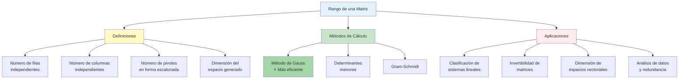

# 📏 Rango de una Matriz

## 🎯 Fundamentos del Rango

> [!info]- 💡 Introducción al Concepto de Rango El **rango de una matriz** es un número que mide la "cantidad de información independiente" contenida en la matriz. Es uno de los conceptos más importantes del álgebra lineal, ya que determina completamente las propiedades del sistema de ecuaciones asociado y las características del espacio vectorial que representa.
> 
> **Analogías útiles:**
> 
> - **Dimensión efectiva:** Como el número de direcciones independientes que puedes tomar
> - **Información no redundante:** Como eliminar datos duplicados de una base de datos
> - **Grados de libertad:** Como las dimensiones reales en las que puedes moverte
> - **Columnas/filas útiles:** Como el número de variables realmente necesarias
> 
> **Importancia histórica:**
> 
> - **Ferdinand Georg Frobenius (1849-1917):** Desarrollo formal del concepto
> - **Teorema de Rouché-Frobenius:** Criterio para solución de sistemas
> - **Base matemática:** Fundamental en espacios vectoriales y transformaciones lineales
> 
> **¿Por qué es importante?**
> 
> - Determina si un sistema tiene solución (y cuántas)
> - Mide la independencia lineal de vectores
> - Caracteriza transformaciones lineales
> - Base de algoritmos en machine learning y análisis de datos
> - Fundamental en compresión de datos y reducción de dimensionalidad

## 📚 Definiciones del Rango

### 🔢 Definición Principal

> [!note]- 📖 Definición Formal
> 
> **Definición:** El **rango** de una matriz A (denotado rango(A) o rg(A)) es el número máximo de filas (o columnas) linealmente independientes de A.
> 
> **Equivalentemente:**
> 
> - Número de **pivotes** en la forma escalonada de A
> - Número de **filas no nulas** en la forma escalonada de A
> - **Dimensión** del espacio generado por las columnas de A
> - **Dimensión** del espacio generado por las filas de A
> 
> **Notación:**
> 
> - rango(A), rg(A), rank(A), o r(A)
> 
> **Propiedades básicas:**
> 
> - 0 ≤ rango(A) ≤ min(m, n) para una matriz m×n
> - rango(A) = 0 si y solo si A es la matriz nula
> - rango(A) = min(m, n) → A tiene "rango completo" o "rango máximo"

### 🎨 Interpretaciones del Rango

> [!tip]- 🌈 Diferentes Perspectivas del Mismo Concepto
> 
> **1. Interpretación geométrica:**
> 
> ```
> Para una matriz 3×3:
> - rango = 3: Los vectores fila/columna generan todo ℝ³
> - rango = 2: Los vectores están en un plano (espacio 2D)
> - rango = 1: Los vectores están en una recta (espacio 1D)
> - rango = 0: Solo el vector cero (matriz nula)
> ```
> 
> **2. Interpretación en sistemas de ecuaciones:**
> 
> ```
> - rango(A) = número de ecuaciones realmente independientes
> - n - rango(A) = número de variables libres (parámetros)
> - rango([A|B]) - rango(A) = indicador de compatibilidad
> ```
> 
> **3. Interpretación en transformaciones:**
> 
> ```
> Si A representa una transformación lineal T:
> - rango(A) = dimensión de la imagen de T
> - n - rango(A) = dimensión del núcleo de T
> ```
> 
> **4. Interpretación de datos:**
> 
> ```
> En una matriz de datos m×n:
> - rango(A) = número de variables realmente independientes
> - n - rango(A) = redundancia en los datos
> ```

## 🔧 Cálculo del Rango mediante Gauss

### 📐 Método Principal: Forma Escalonada

> [!success]- ✅ Algoritmo Estándar para Calcular el Rango
> 
> **Procedimiento:**
> 
> **Paso 1:** Aplicar el método de Gauss a la matriz A para obtener su forma escalonada
> 
> **Paso 2:** Contar el número de filas no nulas (pivotes) en la forma escalonada
> 
> **Paso 3:** Ese número es el rango de A
> 
> **¿Por qué funciona?**
> 
> - Las operaciones elementales **no cambian el rango** de una matriz
> - En la forma escalonada, las filas no nulas son linealmente independientes
> - El número de filas no nulas = número máximo de filas independientes
> 
> **Identificación de filas no nulas:**
> 
> ```
> Fila no nula: Al menos un elemento diferente de cero
> Fila nula: Todos los elementos son cero [0 0 ... 0]
> ```

### ✅ Ejemplos de Cálculo del Rango

> [!example]- 🎯 Ejemplo 1: Matriz 3×3 con Rango Completo
> 
> **Matriz A:**
> 
> ```
> A = [ 1  2  1]
>     [ 2  1  3]
>     [ 1  1  2]
> ```
> 
> **Aplicar Gauss:**
> 
> ```
> Paso inicial:
> [ 1  2  1]
> [ 2  1  3]
> [ 1  1  2]
> 
> R₂ → R₂ - 2·R₁:
> [ 1  2  1]
> [ 0 -3  1]
> [ 1  1  2]
> 
> R₃ → R₃ - R₁:
> [ 1  2  1]
> [ 0 -3  1]
> [ 0 -1  1]
> 
> R₃ → R₃ - (1/3)·R₂:
> [ 1  2  1]
> [ 0 -3  1]
> [ 0  0  2/3]
> ```
> 
> **Forma escalonada:**
> 
> ```
> [ 1  2    1  ]
> [ 0 -3    1  ]  ← 3 filas no nulas
> [ 0  0   2/3 ]
> ```
> 
> **Resultado:** rango(A) = 3
> 
> **Interpretación:** La matriz tiene rango completo (máximo posible para 3×3)

> [!example]- 🎯 Ejemplo 2: Matriz 3×3 con Rango 2
> 
> **Matriz B:**
> 
> ```
> B = [ 1  2  3]
>     [ 2  4  6]
>     [ 1  1  2]
> ```
> 
> **Aplicar Gauss:**
> 
> ```
> Paso inicial:
> [ 1  2  3]
> [ 2  4  6]
> [ 1  1  2]
> 
> R₂ → R₂ - 2·R₁:
> [ 1  2  3]
> [ 0  0  0]  ← Segunda fila se vuelve nula
> [ 1  1  2]
> 
> R₃ → R₃ - R₁:
> [ 1  2  3]
> [ 0  0  0]
> [ 0 -1 -1]
> 
> Reordenar (opcional):
> [ 1  2  3]
> [ 0 -1 -1]  ← 2 filas no nulas
> [ 0  0  0]
> ```
> 
> **Forma escalonada:**
> 
> ```
> [ 1  2  3]
> [ 0 -1 -1]
> [ 0  0  0]
> ```
> 
> **Resultado:** rango(B) = 2
> 
> **Interpretación:**
> 
> - Solo 2 filas son linealmente independientes
> - La segunda fila original es múltiplo de la primera (2×R₁)
> - Los vectores fila generan un plano en ℝ³

> [!example]- 🎯 Ejemplo 3: Matriz 3×4 Rectangular
> 
> **Matriz C:**
> 
> ```
> C = [ 1  2  0  3]
>     [ 2  4  1  8]
>     [ 3  6  1 11]
> ```
> 
> **Aplicar Gauss:**
> 
> ```
> Paso inicial:
> [ 1  2  0  3]
> [ 2  4  1  8]
> [ 3  6  1 11]
> 
> R₂ → R₂ - 2·R₁:
> [ 1  2  0  3]
> [ 0  0  1  2]
> [ 3  6  1 11]
> 
> R₃ → R₃ - 3·R₁:
> [ 1  2  0  3]
> [ 0  0  1  2]
> [ 0  0  1  2]
> 
> R₃ → R₃ - R₂:
> [ 1  2  0  3]
> [ 0  0  1  2]  ← 2 filas no nulas
> [ 0  0  0  0]
> ```
> 
> **Resultado:** rango(C) = 2
> 
> **Interpretación:**
> 
> - De 3 filas, solo 2 son independientes
> - La matriz tiene 4 columnas pero rango 2
> - Hay redundancia en la información

> [!example]- 🎯 Ejemplo 4: Matriz con Rango 1
> 
> **Matriz D:**
> 
> ```
> D = [ 2  4  6]
>     [ 1  2  3]
>     [ 3  6  9]
> ```
> 
> **Observación:** Todas las filas son múltiplos de [1 2 3]
> 
> **Aplicar Gauss:**
> 
> ```
> R₂ → (1/2)·R₁:
> [ 1  2  3]
> [ 1  2  3]
> [ 3  6  9]
> 
> R₂ → R₂ - R₁:
> [ 1  2  3]
> [ 0  0  0]
> [ 3  6  9]
> 
> R₃ → R₃ - 3·R₁:
> [ 1  2  3]  ← Solo 1 fila no nula
> [ 0  0  0]
> [ 0  0  0]
> ```
> 
> **Resultado:** rango(D) = 1
> 
> **Interpretación:**
> 
> - Todas las filas son linealmente dependientes
> - Los vectores fila están en una recta en ℝ³
> - Información completamente redundante (excepto una dirección)

## 🔗 Teorema de Rouché-Frobenius

### 📊 Criterio de Compatibilidad de Sistemas

> [!warning]- ⚡ Teorema Fundamental
> 
> **Teorema de Rouché-Frobenius:**
> 
> Dado un sistema de ecuaciones lineales AX = B, donde:
> 
> - A es la matriz de coeficientes (m×n)
> - B es el vector de términos independientes
> - [A|B] es la matriz ampliada
> 
> El sistema es:
> 
> **1. INCOMPATIBLE** si y solo si:
> 
> ```
> rango(A) ≠ rango([A|B])
> ```
> 
> El vector B no está en el espacio generado por las columnas de A
> 
> **2. COMPATIBLE** si y solo si:
> 
> ```
> rango(A) = rango([A|B])
> ```
> 
> Y dentro de los compatibles:
> 
> **2a. COMPATIBLE DETERMINADO** (solución única) si:
> 
> ```
> rango(A) = rango([A|B]) = n
> ```
> 
> donde n es el número de incógnitas
> 
> **2b. COMPATIBLE INDETERMINADO** (infinitas soluciones) si:
> 
> ```
> rango(A) = rango([A|B]) < n
> ```
> 
> El número de parámetros libres es: n - rango(A)

### 🎯 Aplicación del Teorema

> [!example]- 💡 Ejemplos de Clasificación por Rango
> 
> **Ejemplo 1: Sistema Incompatible**
> 
> ```
> Sistema:
> x + y = 3
> 2x + 2y = 8
> 
> Matriz ampliada:
> [A|B] = [ 1  1 | 3]
>         [ 2  2 | 8]
> 
> Forma escalonada:
> [ 1  1 | 3]
> [ 0  0 | 2]  ← [0 0 | 2] indica incompatibilidad
> 
> Análisis:
> A = [ 1  1]  →  Forma escalonada: [ 1  1]
>     [ 2  2]                        [ 0  0]
> rango(A) = 1
> 
> [A|B] en forma escalonada tiene 2 filas no nulas
> rango([A|B]) = 2
> 
> Como rango(A) ≠ rango([A|B]):
> → Sistema INCOMPATIBLE
> ```
> 
> **Ejemplo 2: Compatible Determinado**
> 
> ```
> Sistema:
> x + y = 3
> x - y = 1
> 
> Matriz ampliada:
> [A|B] = [ 1  1 | 3]
>         [ 1 -1 | 1]
> 
> Forma escalonada:
> [ 1  1 | 3]
> [ 0 -2 |-2]
> 
> rango(A) = 2 (dos pivotes)
> rango([A|B]) = 2 (dos filas no nulas)
> n = 2 (dos variables)
> 
> Como rango(A) = rango([A|B]) = n:
> → Sistema COMPATIBLE DETERMINADO
> Solución: x = 2, y = 1
> ```
> 
> **Ejemplo 3: Compatible Indeterminado**
> 
> ```
> Sistema:
> x + 2y + z = 3
> 2x + 4y + 2z = 6
> 
> Matriz ampliada:
> [A|B] = [ 1  2  1 | 3]
>         [ 2  4  2 | 6]
> 
> Forma escalonada:
> [ 1  2  1 | 3]
> [ 0  0  0 | 0]
> 
> rango(A) = 1 (un pivote)
> rango([A|B]) = 1 (una fila no nula)
> n = 3 (tres variables)
> 
> Como rango(A) = rango([A|B]) < n:
> → Sistema COMPATIBLE INDETERMINADO
> Número de parámetros: n - rango(A) = 3 - 1 = 2
> ```

## 📊 Propiedades del Rango

### 🔢 Propiedades Fundamentales

> [!note]- 📐 Teoremas y Propiedades Importantes
> 
> **Propiedad 1: Simetría fila-columna**
> 
> ```
> rango(A) = rango(Aᵀ)
> ```
> 
> El rango por filas es igual al rango por columnas
> 
> **Propiedad 2: Rango y transposición**
> 
> ```
> rango(A) = rango(Aᵀ)
> ```
> 
> Transponer no cambia el rango
> 
> **Propiedad 3: Rango de productos**
> 
> ```
> rango(AB) ≤ min(rango(A), rango(B))
> ```
> 
> El rango de un producto no supera al menor de los rangos
> 
> **Propiedad 4: Rango y matriz inversa**
> 
> ```
> Si A es cuadrada n×n:
> A es invertible ⟺ rango(A) = n
> ```
> 
> **Propiedad 5: Rango y determinante (matrices cuadradas)**
> 
> ```
> Para matriz cuadrada A:
> rango(A) = n ⟺ det(A) ≠ 0
> ```
> 
> **Propiedad 6: Operaciones elementales**
> 
> ```
> Las operaciones elementales de fila/columna NO cambian el rango
> ```
> 
> **Propiedad 7: Suma de matrices**
> 
> ```
> rango(A + B) ≤ rango(A) + rango(B)
> ```
> 
> **Propiedad 8: Rango máximo**
> 
> ```
> Para matriz m×n:
> rango(A) ≤ min(m, n)
> ```

### 📈 Casos Especiales

> [!tip]- 🌟 Situaciones Particulares
> 
> **Matrices con rango completo:**
> 
> **1. Matriz de rango completo por filas:**
> 
> ```
> Si A es m×n con rango(A) = m:
> - Todas las filas son linealmente independientes
> - El sistema AX = B es siempre compatible
> - Puede tener solución única o infinitas (depende de si m = n o m < n)
> ```
> 
> **2. Matriz de rango completo por columnas:**
> 
> ```
> Si A es m×n con rango(A) = n:
> - Todas las columnas son linealmente independientes
> - Si el sistema AX = B tiene solución, es única
> - El sistema puede ser incompatible (si m > n)
> ```
> 
> **3. Matriz cuadrada de rango completo:**
> 
> ```
> Si A es n×n con rango(A) = n:
> - A es invertible (det(A) ≠ 0)
> - El sistema AX = B tiene solución única para cualquier B
> - Las columnas/filas forman una base de ℝⁿ
> ```
> 
> **Matriz nula:**
> 
> ```
> Si todos los elementos son 0:
> rango(A) = 0
> ```
> 
> **Matrices identidad y diagonal:**
> 
> ```
> rango(Iₙ) = n (identidad n×n)
> 
> Para matriz diagonal D:
> rango(D) = número de elementos no nulos en la diagonal
> ```

## 🎨 Visualización Geométrica del Rango

> [!success]- 🌈 Interpretación Visual
> 
> **En ℝ²:**
> 
> ```
> Matriz 2×2:
> 
> Rango 2 (máximo):        Rango 1:              Rango 0:
>     y                       y                      y
>     |  ↗                    |  ↗  ↗               |
>     | ↗                     | ↗  ↗                | (0,0)
>     |→                      |→  ↗                 |
>     +----x                  +----x                +----x
> Vectores independientes   Vectores colineales   Solo vector cero
> (generan todo ℝ²)        (generan una recta)
> ```
> 
> **En ℝ³:**
> 
> ```
> Matriz 3×3:
> 
> Rango 3: Los vectores generan todo el espacio ℝ³
>          (cubo completo de direcciones)
> 
> Rango 2: Los vectores están en un plano
>          (como una hoja de papel en el espacio)
> 
> Rango 1: Los vectores están en una recta
>          (como una varilla en el espacio)
> 
> Rango 0: Solo el vector cero (el origen)
> ```
> 
> **Para sistemas de ecuaciones:**
> 
> ```
> Sistema 3×3 en ℝ³:
> 
> Rango 3: Los tres planos se intersectan en un punto único
> Rango 2: Los planos se intersectan en una recta (infinitas soluciones)
> Rango 1: Los planos son paralelos o coincidentes (caso especial)
> ```

## 🧮 Métodos Alternativos para Calcular el Rango

### 🔍 Método de Determinantes (Menores)

> [!info]- 📊 Cálculo por Subdeterminantes
> 
> **Definición de menor:** Un **menor de orden k** es el determinante de una submatriz k×k obtenida al seleccionar k filas y k columnas de A.
> 
> **Teorema:**
> 
> ```
> rango(A) = r si y solo si:
> - Existe al menos un menor de orden r con determinante ≠ 0
> - Todos los menores de orden r+1 tienen determinante = 0
> ```
> 
> **Procedimiento:**
> 
> 1. Calcular determinantes de submatrices de tamaño creciente
> 2. El rango es el orden del mayor menor no nulo
> 
> **Ejemplo:**
> 
> ```
> A = [ 1  2  3]
>     [ 2  4  6]
>     [ 1  1  2]
> 
> Menores 1×1: |1| = 1 ≠ 0  ✓
> 
> Menores 2×2: | 1  2| = 4 - 4 = 0
>              | 2  4|
> 
>              | 1  3| = 6 - 6 = 0
>              | 2  6|
> 
>              | 1  2| = 1 - 2 = -1 ≠ 0  ✓
>              | 1  1|
> 
> Menor 3×3:   det(A) = calcular...
> 
> Si det(A) = 0 y existe un menor 2×2 ≠ 0:
> rango(A) = 2
> ```
> 
> **Ventajas:**
> 
> - Teóricamente elegante
> - Útil para matrices pequeñas
> 
> **Desventajas:**
> 
> - Muy ineficiente para matrices grandes
> - Requiere calcular muchos determinantes
> - No es práctico computacionalmente

### 🔄 Método de Ortogonalización (Gram-Schmidt)

> [!note]- 🎯 Mediante Vectores Ortogonales
> 
> **Idea:** Aplicar el proceso de Gram-Schmidt a las columnas (o filas) de A. El número de vectores no nulos obtenidos es el rango.
> 
> **Ventaja:** Útil cuando necesitamos una base ortonormal
> 
> **Desventaja:** Más complejo que Gauss para solo calcular el rango

## 🎓 Ejercicios Progresivos

> [!example]- 💪 Práctica del Cálculo de Rango
> 
> **Nivel 1: Identificación visual** 🟢
> 
> ```
> Determinar el rango observando:
> 
> 1. A = [ 1  2]      Pista: Filas independientes
>        [ 3  4]      Respuesta: rango = 2
> 
> 2. B = [ 2  4]      Pista: Segunda fila = 2×primera
>        [ 1  2]      Respuesta: rango = 1
> 
> 3. C = [ 0  0  0]   Pista: Matriz nula
>        [ 0  0  0]   Respuesta: rango = 0
> ```
> 
> **Nivel 2: Cálculo con Gauss** 🟡
> 
> ```
> Calcular el rango aplicando Gauss:
> 
> 4. D = [ 1  2  3]
>        [ 2  4  6]
>        [ 1  3  5]
> 
> Pista: Aplica R₂ → R₂ - 2·R₁ y R₃ → R₃ - R₁
> Respuesta: rango = 2
> 
> 5. E = [ 1  0  2]
>        [ 0  1  1]
>        [ 2  1  5]
> 
> Pista: Forma escalonada completa
> Respuesta: rango = 3
> ```
> 
> **Nivel 3: Matrices rectangulares** 🟠
> 
> ```
> 6. F = [ 1  2  0  1]
>        [ 2  4  1  3]
>        [ 0  0  1  1]
> 
> Pista: Matriz 3×4
> Respuesta: rango = ?
> 
> 7. G = [ 1  2]
>        [ 3  4]
>        [ 5  6]
>        [ 7  8]
> 
> Pista: Matriz 4×2, rango máximo posible = 2
> Respuesta: rango = ?
> ```
> 
> **Nivel 4: Clasificación de sistemas** 🔴
> 
> ```
> Clasificar usando el teorema de Rouché-Frobenius:
> 
> 8. Sistema:
>    x + y + z = 6
>    2x + 2y + 2z = 12
>    x - y + z = 2
> 
> Calcular rango(A) y rango([A|B])
> 
> 9. Sistema:
>    x + y = 1
>    2x + 2y = 3
> 
> Predecir: ¿Compatible o incompatible?
> ```
> 
> **Nivel 5: Rango con parámetros** 🔴
> 
> ```
> 10. Para qué valor de k la matriz tiene rango 2:
> 
>     A = [ 1  2  3]
>         [ 2  4  6]
>         [ 1  1  k]
> 
> Pista: Analiza cuándo la tercera fila es independiente
> ```

## 📊 Diagrama Conceptual del Rango



## 🔗 Relación Rango-Nulidad

> [!info]- ⚖️ Teorema de la Dimensión
> 
> **Teorema Rango-Nulidad:**
> 
> Para una matriz A de tamaño m×n:
> 
> ```
> rango(A) + nulidad(A) = n
> ```
> 
> Donde:
> 
> - **nulidad(A)** = dimensión del núcleo (espacio nulo) de A
> - **n** = número de columnas de A
> 
> **Interpretación:**
> 
> ```
> nulidad(A) = número de variables libres
>            = n - rango(A)
>            = número de parámetros en la solución general
> ```
> 
> **Ejemplo:**
> 
> ```
> Si A es 3×5 con rango(A) = 3:
> nulidad(A) = 5 - 3 = 2
> 
> Significa:
> - 3 variables pivote (determinadas)
> - 2 variables libres (parámetros)
> - El espacio nulo tiene dimensión 2
> ```
> 
> **Aplicación a sistemas:**
> 
> ```
> Para AX = 0 (sistema homogéneo):
> - Si rango(A) = n: solo solución trivial X = 0
> - Si rango(A) < n: infinitas soluciones con (n - rango(A)) parámetros
> ```

## 🌐 Aplicaciones Prácticas del Rango

> [!success]- 🚀 Uso en Diversas Áreas
> 
> **1. Análisis de datos y estadística:**
> 
> ```
> - Detección de multicolinealidad en regresión
> - Reducción de dimensionalidad (PCA)
> - Identificación de variables redundantes
> - Compresión de datos
> ```
> 
> **2. Machine Learning:**
> 
> ```
> - Feature selection (selección de características)
> - Determinación de capacidad del modelo
> - Análisis de matrices de datos
> - Regularización de modelos
> ```
> 
> **3. Procesamiento de imágenes:**
> 
> ```
> - Compresión de imágenes (SVD)
> - Reconstrucción de imágenes
> - Reducción de ruido
> - Rango bajo = menos información = más compresión
> ```
> 
> **4. Sistemas de control:**
> 
> ```
> - Controlabilidad de sistemas
> - Observabilidad
> - Análisis de estabilidad
> ```
> 
> **5. Economía:**
> 
> ```
> - Modelo de Leontief (insumo-producto)
> - Identificación de sectores económicos independientes
> - Análisis de correlaciones entre variables
> ```
> 
> **6. Redes y grafos:**
> 
> ```
> - Análisis de conectividad
> - Flujos en redes
> - Matrices de adyacencia
> ```
> 
> **Ejemplo práctico - Compresión de imágenes:**
> 
> ```
> Imagen en escala de grises = Matriz de píxeles
> 
> Imagen 1000×1000:
> - Rango completo 1000: 1,000,000 valores únicos
> - Aproximación rango 100: ~200,000 valores
> - Compresión: 80% menos datos
> - Pérdida visual: mínima
> ```

## 💡 Ejemplo Completo Integrador

> [!example]- 🎯 Análisis Completo: Sistema 4×4
> 
> **Sistema de ecuaciones:**
> 
> ```
> x + 2y + z - w = 3
> 2x + 4y + z + w = 7
> x + 2y + 2z + w = 5
> 3x + 6y + 2z = 8
> ```
> 
> **Objetivo:** Determinar el tipo de sistema calculando rangos
> 
> **SOLUCIÓN DETALLADA:**
> 
> **Paso 1: Formar matrices**
> 
> ```
> Matriz de coeficientes A:
> [ 1  2  1 -1]
> [ 2  4  1  1]
> [ 1  2  2  1]
> [ 3  6  2  0]
> 
> Matriz ampliada [A|B]:
> [ 1  2  1 -1 | 3]
> [ 2  4  1  1 | 7]
> [ 1  2  2  1 | 5]
> [ 3  6  2  0 | 8]
> ```
> 
> **Paso 2: Calcular rango(A) aplicando Gauss**
> 
> ```
> Aplicar operaciones elementales:
> 
> R₂ → R₂ - 2·R₁:
> [ 1  2  1 -1 | 3]
> [ 0  0 -1  3 | 1]
> [ 1  2  2  1 | 5]
> [ 3  6  2  0 | 8]
> 
> R₃ → R₃ - R₁:
> [ 1  2  1 -1 | 3]
> [ 0  0 -1  3 | 1]
> [ 0  0  1  2 | 2]
> [ 3  6  2  0 | 8]
> 
> R₄ → R₄ - 3·R₁:
> [ 1  2  1 -1 | 3]
> [ 0  0 -1  3 | 1]
> [ 0  0  1  2 | 2]
> [ 0  0 -1  3 |-1]
> 
> R₃ → R₃ + R₂:
> [ 1  2  1 -1 | 3]
> [ 0  0 -1  3 | 1]
> [ 0  0  0  5 | 3]
> [ 0  0 -1  3 |-1]
> 
> R₄ → R₄ - R₂:
> [ 1  2  1 -1 | 3]
> [ 0  0 -1  3 | 1]
> [ 0  0  0  5 | 3]
> [ 0  0  0  0 |-2]  ← Fila crítica
> ```
> 
> **Paso 3: Análisis de rangos**
> 
> ```
> Para rango(A), ignoramos la última columna:
> [ 1  2  1 -1]
> [ 0  0 -1  3]
> [ 0  0  0  5]
> [ 0  0  0  0]
> 
> Filas no nulas en forma escalonada: 3
> rango(A) = 3
> 
> Para rango([A|B]), consideramos toda la matriz ampliada:
> [ 1  2  1 -1 | 3]
> [ 0  0 -1  3 | 1]
> [ 0  0  0  5 | 3]
> [ 0  0  0  0 |-2]  ← Esta fila representa 0 = -2
> 
> Filas no nulas: 4
> rango([A|B]) = 4
> ```
> 
> **Paso 4: Aplicar teorema de Rouché-Frobenius**
> 
> ```
> rango(A) = 3
> rango([A|B]) = 4
> n = 4 (número de variables)
> 
> Como rango(A) ≠ rango([A|B]):
> → Sistema INCOMPATIBLE
> ```
> 
> **Interpretación:**
> 
> ```
> La fila [0 0 0 0 | -2] representa la ecuación:
> 0·x + 0·y + 0·z + 0·w = -2
> 
> Esto es: 0 = -2 (IMPOSIBLE)
> 
> El sistema no tiene solución porque las ecuaciones
> se contradicen entre sí.
> ```
> 
> **Verificación geométrica:**
> 
> ```
> En ℝ⁴, tenemos 4 hiperplanos que deberían intersectarse.
> Sin embargo, debido a las ecuaciones contradictorias,
> no existe ningún punto común a los cuatro hiperplanos.
> ```

## 📋 Tabla de Decisión Rápida

> [!tip]- 🎯 Guía Rápida de Clasificación
> 
> |rango(A) vs rango([A\|B])|rango vs n|Tipo de Sistema|Soluciones|
> |---|---|---|---|
> |rango(A) < rango([A\|B])|-|**Incompatible**|0|
> |rango(A) = rango([A\|B])|= n|**Compatible Determinado**|1 única|
> |rango(A) = rango([A\|B])|< n|**Compatible Indeterminado**|∞ (con n - rango(A) parámetros)|
> 
> **Ejemplos numéricos:**
> 
> |Caso|m×n|rango(A)|rango([A\|B])|n|Clasificación|Parámetros|
> |---|---|---|---|---|---|---|
> |1|3×3|2|3|3|Incompatible|-|
> |2|3×3|3|3|3|Compatible Det.|0|
> |3|3×4|2|2|4|Compatible Indet.|2|
> |4|2×3|2|2|3|Compatible Indet.|1|
> |5|4×3|3|3|3|Compatible Det.|0|

## ⚠️ Errores Comunes en el Cálculo del Rango

> [!warning]- 🚫 Problemas Frecuentes y Soluciones
> 
> **Error 1: Contar filas nulas como pivotes**
> 
> ```
> ❌ Incorrecto:
> [ 1  2  3]
> [ 0  0  0]  ← Contar esta fila
> [ 0  1  2]
> Rango = 3 (FALSO)
> 
> ✅ Correcto:
> Solo contar filas con al menos un elemento ≠ 0
> Rango = 2
> ```
> 
> **Error 2: No llevar a forma escalonada completa**
> 
> ```
> ❌ Incorrecto:
> Detenerse prematuramente en el proceso de Gauss
> 
> ✅ Correcto:
> Completar la eliminación hasta obtener forma escalonada
> Crear ceros debajo de todos los pivotes
> ```
> 
> **Error 3: Confundir rango(A) con rango([A|B])**
> 
> ```
> ❌ Incorrecto:
> Usar solo rango(A) para clasificar el sistema
> 
> ✅ Correcto:
> Calcular AMBOS rangos y compararlos según Rouché-Frobenius
> ```
> 
> **Error 4: No considerar la última columna al calcular rango([A|B])**
> 
> ```
> ❌ Común:
> [ 1  2 | 3]
> [ 0  0 | 5]
> Pensar que rango([A|B]) = 1 porque la parte de A tiene rango 1
> 
> ✅ Correcto:
> La segunda fila [0 0 | 5] NO es nula (el 5 cuenta)
> rango([A|B]) = 2
> ```
> 
> **Error 5: Errores aritméticos acumulados**
> 
> ```
> ❌ Problema:
> No verificar cada paso del algoritmo de Gauss
> 
> ✅ Solución:
> - Verificar cada operación elemental
> - Comprobar que se crearon los ceros esperados
> - Revisar signos cuidadosamente
> ```
> 
> **Error 6: Pensar que rango depende del tamaño**
> 
> ```
> ❌ Incorrecto:
> "Matriz 5×5 siempre tiene rango 5"
> 
> ✅ Correcto:
> El rango depende de la independencia lineal,
> no del tamaño. Una matriz 5×5 puede tener
> rango 0, 1, 2, 3, 4 o 5.
> ```

## 🎯 Estrategias para Cálculos Eficientes

> [!tip]- 💡 Técnicas de Optimización
> 
> **1. Detección temprana de dependencias:**
> 
> ```
> Antes de aplicar Gauss, observar:
> - ¿Hay filas/columnas idénticas?
> - ¿Hay filas/columnas que son múltiplos?
> - ¿Hay filas/columnas de ceros?
> 
> Esto da pistas sobre el rango sin calcular.
> ```
> 
> **2. Simplificación inicial:**
> 
> ```
> Si todos los elementos de una fila tienen factor común:
> Dividir la fila completa por ese factor
> 
> Ejemplo:
> [ 2  4  6 | 8]  →  [ 1  2  3 | 4]
> Facilita los cálculos posteriores
> ```
> 
> **3. Reordenamiento inteligente:**
> 
> ```
> Colocar filas/columnas con más ceros al final
> Esto puede reducir el número de operaciones
> ```
> 
> **4. Para matrices grandes:**
> 
> ```
> - Usar software (Python NumPy, MATLAB, Wolfram)
> - Comando: numpy.linalg.matrix_rank(A)
> - Verificar resultados manualmente con matrices pequeñas
> ```
> 
> **5. Verificación rápida:**
> 
> ```
> Después de calcular el rango:
> - ¿Es rango ≤ min(m, n)? ✓
> - ¿Tiene sentido geométricamente? ✓
> - ¿Es consistente con el tipo de sistema? ✓
> ```

## 🧮 Ejemplo con Parámetros

> [!example]- 🔢 Rango Dependiente de un Parámetro
> 
> **Problema:** Determinar para qué valores de _a_ el sistema es compatible.
> 
> **Sistema:**
> 
> ```
> x + y + z = 1
> 2x + y + az = 3
> x + ay + 3z = 2
> ```
> 
> **Solución:**
> 
> **Paso 1: Matriz ampliada**
> 
> ```
> [A|B] = [ 1  1  1 | 1]
>         [ 2  1  a | 3]
>         [ 1  a  3 | 2]
> ```
> 
> **Paso 2: Aplicar Gauss**
> 
> ```
> R₂ → R₂ - 2·R₁:
> [ 1  1  1 | 1]
> [ 0 -1 a-2| 1]
> [ 1  a  3 | 2]
> 
> R₃ → R₃ - R₁:
> [ 1  1   1  | 1]
> [ 0 -1  a-2 | 1]
> [ 0 a-1  2  | 1]
> 
> R₃ → R₃ + (a-1)·R₂:
> [ 1  1      1      | 1]
> [ 0 -1     a-2     | 1]
> [ 0  0  (a-1)(a-2)+2 | 1+(a-1)]
> 
> Simplificando la posición (3,3):
> (a-1)(a-2)+2 = a²-3a+2+2 = a²-3a+4
> 
> Simplificando la posición (3,4):
> 1+(a-1) = a
> 
> Forma final:
> [ 1  1      1     | 1]
> [ 0 -1     a-2    | 1]
> [ 0  0   a²-3a+4  | a]
> ```
> 
> **Paso 3: Analizar compatibilidad**
> 
> ```
> Para que el sistema sea COMPATIBLE:
> rango(A) = rango([A|B])
> 
> Casos:
> 
> Caso 1: a²-3a+4 ≠ 0
> - La tercera fila no es nula en A ni en [A|B]
> - rango(A) = 3
> - rango([A|B]) = 3
> - Sistema Compatible Determinado ✓
> 
> Caso 2: a²-3a+4 = 0
> - Resolver: a = (3±√(9-16))/2 = (3±√(-7))/2
> - No hay soluciones reales para a²-3a+4 = 0
> - (El discriminante es negativo)
> 
> Conclusión:
> Para TODO valor real de a, a²-3a+4 > 0
> Por lo tanto, el sistema es SIEMPRE Compatible Determinado
> para cualquier valor de a ∈ ℝ
> ```
> 
> **Verificación:**
> 
> ```
> a²-3a+4 = (a-3/2)²-9/4+4 = (a-3/2)²+7/4 > 0 ✓
> Siempre positivo, nunca cero
> ```

## 📊 Resumen Comparativo de Métodos

> [!summary]- 🎯 Comparación de Técnicas de Cálculo
> 
> |Método|Eficiencia|Dificultad|Uso recomendado|
> |---|---|---|---|
> |**Gauss**|⭐⭐⭐⭐⭐|🟢 Media|Siempre (método estándar)|
> |**Determinantes**|⭐⭐|🔴 Alta|Solo matrices ≤ 3×3|
> |**Gram-Schmidt**|⭐⭐⭐|🟡 Media-Alta|Cuando necesitas base ortonormal|
> |**Software**|⭐⭐⭐⭐⭐|🟢 Baja|Matrices grandes o verificación|
> 
> **Complejidad temporal:**
> 
> ```
> Método de Gauss:        O(n³)
> Determinantes (menores): O(n! × n²)
> Gram-Schmidt:           O(n³)
> ```
> 
> **Recomendación general:**
> 
> - Matrices pequeñas (≤ 4×4): Gauss a mano
> - Matrices medianas (5×5 - 10×10): Gauss con calculadora
> - Matrices grandes (> 10×10): Software especializado
> - Análisis teórico: Cualquier método válido

## 🔍 Relación con Otros Conceptos

> [!note]- 🌐 Conexiones Conceptuales Profundas
> 
> **1. Rango y Espacios Vectoriales:**
> 
> ```
> rango(A) = dim(Col(A)) = dimensión del espacio columna
> rango(A) = dim(Row(A)) = dimensión del espacio fila
> ```
> 
> **2. Rango y Transformaciones Lineales:**
> 
> ```
> Si T: ℝⁿ → ℝᵐ es la transformación con matriz A:
> rango(A) = dim(Im(T)) = dimensión de la imagen
> nulidad(A) = dim(Ker(T)) = dimensión del núcleo
> ```
> 
> **3. Rango y Sistemas Homogéneos:**
> 
> ```
> Para AX = 0:
> - rango(A) = n → solo solución X = 0
> - rango(A) < n → infinitas soluciones no triviales
> ```
> 
> **4. Rango e Inversibilidad:**
> 
> ```
> Matriz cuadrada A (n×n):
> A invertible ⟺ rango(A) = n
>              ⟺ det(A) ≠ 0
>              ⟺ columnas independientes
>              ⟺ filas independientes
> ```
> 
> **5. Rango y Descomposiciones:**
> 
> ```
> Descomposición SVD: A = UΣVᵀ
> rango(A) = número de valores singulares no nulos en Σ
> ```

## 📚 Teoremas Avanzados sobre el Rango

> [!info]- 🎓 Resultados Importantes
> 
> **Teorema 1: Rango de una suma**
> 
> ```
> rango(A + B) ≤ rango(A) + rango(B)
> ```
> 
> **Teorema 2: Rango de un producto**
> 
> ```
> rango(AB) ≤ min(rango(A), rango(B))
> 
> Si A es m×n y B es n×p:
> rango(AB) ≤ mín(rango(A), rango(B))
> ```
> 
> **Teorema 3: Desigualdad de Sylvester**
> 
> ```
> rango(A) + rango(B) - n ≤ rango(AB)
> donde A es m×n y B es n×p
> ```
> 
> **Teorema 4: Rango y bloques**
> 
> ```
> Para matriz por bloques:
> rango([A | B]) ≤ rango(A) + rango(B)
> ```
> 
> **Teorema 5: Rango máximo en productos**
> 
> ```
> Si A tiene rango completo por filas (rango m):
> rango(AB) = rango(B)
> 
> Si B tiene rango completo por columnas (rango n):
> rango(AB) = rango(A)
> ```

## 💻 Implementación Computacional

> [!success]- 🖥️ Código para Calcular el Rango
> 
> **Python (NumPy):**
> 
> ```python
> import numpy as np
> 
> # Definir matriz
> A = np.array([[1, 2, 3],
>               [2, 4, 6],
>               [1, 1, 2]])
> 
> # Calcular rango
> rango = np.linalg.matrix_rank(A)
> print(f"Rango de A: {rango}")
> 
> # Con tolerancia personalizada
> rango_tol = np.linalg.matrix_rank(A, tol=1e-10)
> ```
> 
> **MATLAB:**
> 
> ```matlab
> % Definir matriz
> A = [1 2 3; 2 4 6; 1 1 2];
> 
> % Calcular rango
> rango = rank(A);
> fprintf('Rango de A: %d\n', rango);
> ```
> 
> **Wolfram Mathematica:**
> 
> ```mathematica
> A = {{1, 2, 3}, {2, 4, 6}, {1, 1, 2}}
> MatrixRank[A]
> ```
> 
> **Implementación manual (pseudocódigo):**
> 
> ```
> FUNCIÓN calcularRango(Matriz A):
>     escalonada = aplicarGauss(A)
>     contador = 0
>     
>     PARA cada fila en escalonada:
>         SI fila no es [0, 0, ..., 0]:
>             contador = contador + 1
>     
>     RETORNAR contador
> FIN FUNCIÓN
> ```

## 🎯 Consejos para Exámenes

> [!tip]- 📝 Estrategias de Resolución
> 
> **Checklist para problemas de rango:**
> 
> - [ ] Identificar qué se pide (rango de A, [A|B], o ambos)
> - [ ] Escribir la matriz claramente
> - [ ] Aplicar Gauss documentando cada operación
> - [ ] Contar filas no nulas correctamente
> - [ ] Aplicar Rouché-Frobenius si es sistema
> - [ ] Interpretar el resultado
> - [ ] Verificar que rango ≤ min(m,n)
> 
> **Errores que cuestan puntos:**
> 
> - No documentar las operaciones elementales
> - Errores aritméticos en Gauss
> - Confundir rango(A) con rango([A|B])
> - No dar la conclusión final (tipo de sistema)
> 
> **Trucos para ahorrar tiempo:**
> 
> - Si ves filas/columnas idénticas → dependientes
> - Si ves múltiplos evidentes → menor rango
> - Normalizar pivotes a 1 facilita cálculos
> - Verificación rápida: rango ≤ dimensión menor
> 
> **Cómo presentar la solución:**
> 
> 1. Matriz inicial clara
> 2. Operaciones paso a paso
> 3. Forma escalonada final
> 4. Conteo de pivotes
> 5. Conclusión con teorema (si aplica)

## 🔗 Conexiones con el Sistema de Notas

> [!quote]- 🌐 Enlaces Conceptuales
> 
> **Prerequisites (Prerrequisitos):**
> 
> - [[Sistemas de Ecuaciones Lineales]] - Base conceptual
> - [[Algoritmo de Gauss]] - Método de cálculo principal
> - [[Matrices]] - Operaciones y propiedades
> 
> **Temas directamente relacionados:**
> 
> - [[Teorema de Rouché-Frobenius]] - Clasificación de sistemas
> - [[Espacios Vectoriales]] - Dimensión y bases
> - [[Dependencia e Independencia Lineal]] - Concepto fundamental
> 
> **Aplicaciones del rango:**
> 
> - [[Determinantes]] - Relación con invertibilidad
> - [[Matriz Inversa]] - Condición de existencia
> - [[Transformaciones Lineales]] - Núcleo e imagen
> - [[Valores y Vectores Propios]] - Análisis espectral
> 
> **Temas avanzados:**
> 
> - [[Descomposición SVD]] - Valores singulares
> - [[Espacios Fundamentales]] - Cuatro subespacios
> - [[Teorema Rango-Nulidad]] - Dimensiones complementarias
> - [[Pseudoinversa de Moore-Penrose]] - Generalización de inversa
> 
> **Aplicaciones computacionales:**
> 
> - [[PCA (Análisis de Componentes Principales)]] - Reducción de dimensionalidad
> - [[Regresión Lineal]] - Problemas de mínimos cuadrados
> - [[Compresión de Datos]] - Aproximación de bajo rango
> - [[Machine Learning]] - Feature selection

---

**Tags:** #rango-matriz #teorema-rouche-frobenius #forma-escalonada #independencia-lineal #sistemas-lineales #clasificacion-sistemas #algoritmo-gauss #espacios-vectoriales #algebra-lineal #university #mathematics #linear-algebra #computational-methods