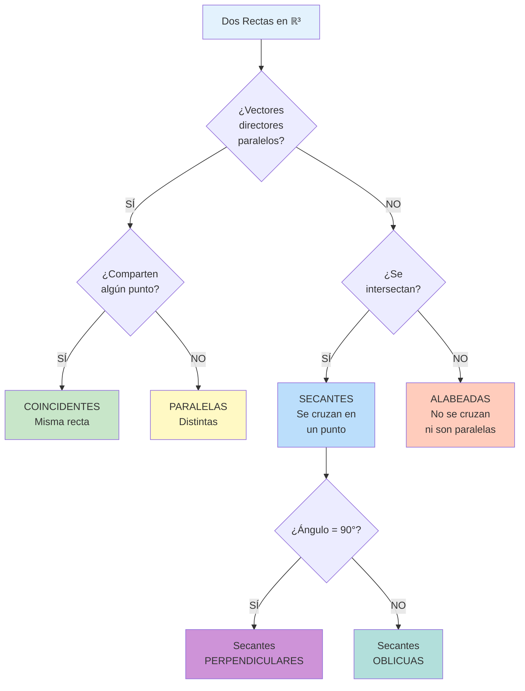

# 📐 Rectas en ℝ³

## 🎯 Fundamentos de Rectas en el Espacio

> [!info]- 💡 Introducción a las Rectas Tridimensionales Una **recta en ℝ³** es un conjunto infinito de puntos que se extienden indefinidamente en ambas direcciones siguiendo una trayectoria rectilínea. A diferencia del plano (ℝ²), donde dos rectas pueden ser paralelas o secantes, en el espacio existe una tercera posibilidad: **rectas alabeadas** (que no se intersectan ni son paralelas).
> 
> **Analogías útiles:**
> 
> - **Física:** Trayectoria de un rayo de luz en línea recta
> - **Ingeniería:** Eje de una viga o columna
> - **Transporte:** Vía de tren que atraviesa el espacio
> 
> **Elementos que definen una recta:**
> 
> 1. **Un punto** sobre la recta (punto de paso)
> 2. **Un vector director** (indica la dirección)
> 
> **Importancia histórica:**
> 
> - **Euclides (300 a.C.):** Geometría de líneas rectas
> - **Descartes (1637):** Ecuaciones algebraicas de rectas
> - **Grassmann (1844):** Representación vectorial
> - **Plücker (1846):** Coordenadas de rectas en el espacio

### 📊 Definición Formal

> [!note]- 🌟 Concepto de Recta en ℝ³ **Definición:**
> 
> Una **recta L** en ℝ³ queda determinada por:
> 
> - Un **punto fijo** P₀ = (x₀, y₀, z₀) que pertenece a la recta
> - Un **vector director** **v** = (a, b, c) ≠ **0** paralelo a la recta
> 
> **Propiedades fundamentales:**
> 
> 1. Por dos puntos distintos pasa una única recta
> 2. Una recta tiene infinitos vectores directores (todos paralelos entre sí)
> 3. Una recta es un subespacio afín de dimensión 1
> 4. Cualquier punto de la recta puede servir como punto base
> 
> **Notación:**
> 
> - L: nombre de la recta
> - P₀: punto de paso o punto base
> - **v**: vector director o vector de dirección

## 📝 Ecuación Vectorial de la Recta

### ➡️ Forma Vectorial

> [!success]- 🟢 Representación Fundamental **Ecuación vectorial:**
> 
> Dado un punto P₀ = (x₀, y₀, z₀) y un vector director **v** = (a, b, c):
> 
> **r(t) = P₀ + t·v**
> 
> O en forma de componentes:
> 
> **r(t) = (x₀, y₀, z₀) + t(a, b, c)**
> 
> Donde **t ∈ ℝ** es un parámetro.
> 
> **Interpretación geométrica:**
> 
> - Cuando t = 0: obtenemos el punto P₀
> - Cuando t = 1: obtenemos el punto P₀ + **v**
> - Cuando t = -1: obtenemos el punto P₀ - **v**
> - Para cada valor de t obtenemos un punto diferente de la recta
> 
> **Ejemplo:**
> 
> ```
> Recta que pasa por P₀ = (2, 1, 3) con vector director v = (1, -2, 4)
> 
> Ecuación vectorial: r(t) = (2, 1, 3) + t(1, -2, 4)
> 
> Algunos puntos:
> t = 0:  r(0) = (2, 1, 3)
> t = 1:  r(1) = (2+1, 1-2, 3+4) = (3, -1, 7)
> t = 2:  r(2) = (4, -3, 11)
> t = -1: r(-1) = (1, 3, -1)
> ```

### 🔗 Recta por Dos Puntos

> [!tip]- 📍 Determinación por Dos Puntos **Dados dos puntos distintos P₁ = (x₁, y₁, z₁) y P₂ = (x₂, y₂, z₂):**
> 
> **Paso 1:** Calcular el vector director **v** = P₁P₂⃗ = P₂ - P₁ = (x₂ - x₁, y₂ - y₁, z₂ - z₁)
> 
> **Paso 2:** Usar cualquiera de los dos puntos como punto base **r(t) = P₁ + t·v** o **r(t) = P₂ + t·v**
> 
> (Nota: ambas representan la misma recta)
> 
> **Ejemplo:**
> 
> ```
> Encontrar la ecuación de la recta que pasa por A = (1, 2, -1) y B = (3, 0, 5)
> 
> Vector director: v = B - A = (3-1, 0-2, 5-(-1))
>                            = (2, -2, 6)
> 
> Ecuación vectorial: r(t) = (1, 2, -1) + t(2, -2, 6)
> 
> Simplificando v: v = 2(1, -1, 3), podemos usar (1, -1, 3)
> r(t) = (1, 2, -1) + t(1, -1, 3)
> ```
> 
> **Verificación:**
> 
> - t = 0: r(0) = (1, 2, -1) = A ✓
> - t = 2: r(2) = (1, 2, -1) + 2(1, -1, 3) = (3, 0, 5) = B ✓

## 📊 Ecuaciones Paramétricas

### 🔢 Forma Paramétrica

> [!warning]- 🔷 Ecuaciones con Parámetro **Definición:**
> 
> Las **ecuaciones paramétricas** expresan cada coordenada en función de un parámetro t:
> 
> Dada la ecuación vectorial **r(t) = (x₀, y₀, z₀) + t(a, b, c)**:
> 
> **x = x₀ + at** **y = y₀ + bt** **z = z₀ + ct**
> 
> Donde t ∈ ℝ es el parámetro.
> 
> **Componentes:**
> 
> - **(x₀, y₀, z₀)**: punto de paso
> - **(a, b, c)**: vector director
> - **t**: parámetro (puede tomar cualquier valor real)
> 
> **Características:**
> 
> - Sistema de tres ecuaciones con una variable (t)
> - Para cada t obtenemos un punto único (x, y, z)
> - Es la forma más útil para cálculos computacionales

### 📐 Ejemplos de Ecuaciones Paramétricas

> [!example]- 🎯 Casos Resueltos **Ejemplo 1: De vectorial a paramétrica**
> 
> Dada: **r(t) = (2, -1, 3) + t(4, 2, -5)**
> 
> Ecuaciones paramétricas:
> 
> ```
> x = 2 + 4t
> y = -1 + 2t
> z = 3 - 5t
> ```
> 
> ---
> 
> **Ejemplo 2: Por dos puntos**
> 
> Recta que pasa por A = (1, 0, 2) y B = (3, 4, -1)
> 
> ```
> Vector director: v = (3-1, 4-0, -1-2) = (2, 4, -3)
> Punto base: A = (1, 0, 2)
> 
> Ecuaciones paramétricas:
> x = 1 + 2t
> y = 0 + 4t = 4t
> z = 2 - 3t
> ```
> 
> ---
> 
> **Ejemplo 3: Puntos específicos**
> 
> Dadas las ecuaciones:
> 
> ```
> x = 3 + 2t
> y = 1 - t
> z = -2 + 4t
> ```
> 
> Encontrar el punto cuando t = 2:
> 
> ```
> x = 3 + 2(2) = 7
> y = 1 - 2 = -1
> z = -2 + 4(2) = 6
> 
> Punto: P = (7, -1, 6)
> ```

### 🔄 Conversión de Formas

> [!note]- 🔀 De Paramétrica a Vectorial y Viceversa **De paramétrica a vectorial:**
> 
> Dadas:
> 
> ```
> x = x₀ + at
> y = y₀ + bt
> z = z₀ + ct
> ```
> 
> La forma vectorial es: **r(t) = (x₀, y₀, z₀) + t(a, b, c)**
> 
> **De vectorial a paramétrica:**
> 
> Dada: **r(t) = P₀ + t·v**
> 
> Expandir componente por componente para obtener las tres ecuaciones.
> 
> **Ejemplo completo:**
> 
> ```
> Vectorial: r(t) = (1, -2, 5) + t(3, 1, -4)
> 
> Paramétrica:
> x = 1 + 3t
> y = -2 + t
> z = 5 - 4t
> ```

## 📏 Ecuaciones Simétricas

### ⚖️ Forma Simétrica

> [!info]- 🔶 Eliminación del Parámetro **Definición:**
> 
> Las **ecuaciones simétricas** se obtienen despejando el parámetro t de las ecuaciones paramétricas:
> 
> De:
> 
> ```
> x = x₀ + at  →  t = (x - x₀)/a
> y = y₀ + bt  →  t = (y - y₀)/b
> z = z₀ + ct  →  t = (z - z₀)/c
> ```
> 
> Igualando:
> 
> **(x - x₀)/a = (y - y₀)/b = (z - z₀)/c**
> 
> **Condición importante:** a, b, c ≠ 0
> 
> **Ventajas:**
> 
> - No depende del parámetro
> - Forma más compacta
> - Fácil de verificar si un punto está en la recta
> 
> **Desventaja:**
> 
> - No funciona cuando alguna componente del vector director es cero

### 🔍 Casos Especiales

> [!warning]- ⚠️ Cuando Hay Componentes Nulas **Si alguna componente del vector director es cero:**
> 
> **Caso 1: a = 0 (recta paralela al plano YZ)**
> 
> ```
> x = x₀ (constante)
> (y - y₀)/b = (z - z₀)/c
> ```
> 
> **Caso 2: b = 0 (recta paralela al plano XZ)**
> 
> ```
> y = y₀ (constante)
> (x - x₀)/a = (z - z₀)/c
> ```
> 
> **Caso 3: c = 0 (recta paralela al plano XY)**
> 
> ```
> z = z₀ (constante)
> (x - x₀)/a = (y - y₀)/b
> ```
> 
> **Ejemplo:**
> 
> ```
> Vector director: v = (2, 0, 3)
> Punto: P₀ = (1, 5, -2)
> 
> Ecuaciones simétricas:
> y = 5
> (x - 1)/2 = (z + 2)/3
> ```

### 📋 Ejemplos de Ecuaciones Simétricas

> [!example]- 🎯 Conversiones Completas **Ejemplo 1: De paramétrica a simétrica**
> 
> Dadas:
> 
> ```
> x = 2 + 3t
> y = -1 + 2t
> z = 4 - t
> ```
> 
> Despejando t:
> 
> ```
> t = (x - 2)/3
> t = (y + 1)/2
> t = (z - 4)/(-1)
> ```
> 
> Ecuaciones simétricas: **(x - 2)/3 = (y + 1)/2 = (z - 4)/(-1)**
> 
> O simplificando el último término: **(x - 2)/3 = (y + 1)/2 = -(z - 4) = (4 - z)/1**
> 
> ---
> 
> **Ejemplo 2: Verificar si un punto está en la recta**
> 
> Recta: (x - 1)/2 = (y + 2)/3 = (z - 5)/1
> 
> ¿El punto P = (5, 4, 7) está en la recta?
> 
> ```
> Sustituir:
> (5 - 1)/2 = 4/2 = 2
> (4 + 2)/3 = 6/3 = 2
> (7 - 5)/1 = 2/1 = 2
> 
> Como todos dan 2, P SÍ está en la recta ✓
> ```
> 
> ---
> 
> **Ejemplo 3: De simétrica a paramétrica**
> 
> Dada: (x - 3)/4 = (y - 1)/(-2) = (z + 5)/3
> 
> Llamando a este cociente t:
> 
> ```
> (x - 3)/4 = t  →  x = 3 + 4t
> (y - 1)/(-2) = t  →  y = 1 - 2t
> (z + 5)/3 = t  →  z = -5 + 3t
> ```

## 🎨 Tabla Resumen de Formas de Ecuaciones

> [!example]- 📊 Comparación de Representaciones
> 
> |Forma|Ecuación|Ventajas|Desventajas|
> |---|---|---|---|
> |**Vectorial**|**r**(t) = **P₀** + t**v**|Compacta, geométrica|Requiere notación vectorial|
> |**Paramétrica**|x = x₀+at<br>y = y₀+bt<br>z = z₀+ct|Fácil para computación<br>Genera puntos directamente|Tres ecuaciones|
> |**Simétrica**|(x-x₀)/a = (y-y₀)/b = (z-z₀)/c|Sin parámetro<br>Compacta|No funciona si a, b o c = 0|
> 
> **Para convertir de una forma a otra:**
> 
> ```
> Vectorial ←→ Paramétrica (directa)
> Paramétrica → Simétrica (despejar t e igualar)
> Simétrica → Paramétrica (igualar a t)
> ```

## 🔀 Tipos de Rectas en ℝ³

### ↕️ Rectas Paralelas

> [!note]- ∥ Paralelismo en el Espacio **Definición:**
> 
> Dos rectas L₁ y L₂ son **paralelas** si sus vectores directores son paralelos.
> 
> **Condición matemática:**
> 
> L₁: vector director **v₁** = (a₁, b₁, c₁) L₂: vector director **v₂** = (a₂, b₂, c₂)
> 
> **L₁ ∥ L₂ ⟺ ∃k ∈ ℝ tal que v₁ = k·v₂**
> 
> Equivalentemente: **a₁/a₂ = b₁/b₂ = c₁/c₂ = k**
> 
> **Casos:**
> 
> 1. **Paralelas distintas:** No se intersectan, mantienen distancia constante
> 2. **Coincidentes:** Son la misma recta (caso especial de paralelismo)
> 
> **Ejemplo:**
> 
> ```
> L₁: r₁(t) = (1, 2, 3) + t(2, -1, 4)
> L₂: r₂(s) = (0, 5, 1) + s(4, -2, 8)
> 
> Vectores: v₁ = (2, -1, 4)
>          v₂ = (4, -2, 8) = 2(2, -1, 4) = 2v₁
> 
> Por lo tanto: L₁ ∥ L₂ ✓
> 
> Para verificar si son distintas, verificar si algún punto 
> de una está en la otra (si no lo está, son paralelas distintas)
> ```

### ⊥ Rectas Perpendiculares

> [!tip]- ⊥ Perpendicularidad **Definición:**
> 
> Dos rectas L₁ y L₂ son **perpendiculares** si sus vectores directores son ortogonales.
> 
> **Condición matemática:**
> 
> **L₁ ⊥ L₂ ⟺ v₁ · v₂ = 0**
> 
> Donde · denota el producto punto (escalar).
> 
> **Fórmula del producto punto:** **v₁ · v₂ = a₁a₂ + b₁b₂ + c₁c₂**
> 
> **Nota importante:** Dos rectas perpendiculares en ℝ³ NO necesariamente se intersectan (pueden ser alabeadas).
> 
> **Ejemplo:**
> 
> ```
> L₁: vector director v₁ = (1, 2, -1)
> L₂: vector director v₂ = (2, 0, 2)
> 
> Producto punto: v₁ · v₂ = 1(2) + 2(0) + (-1)(2)
>                         = 2 + 0 - 2
>                         = 0
> 
> Por lo tanto: L₁ ⊥ L₂ ✓
> ```

### ✕ Rectas Secantes

> [!success]- ⚡ Intersección de Rectas **Definición:**
> 
> Dos rectas son **secantes** si se intersectan en exactamente un punto.
> 
> **Método para encontrar intersección:**
> 
> Dadas:
> 
> ```
> L₁: x = x₁ + a₁t,  y = y₁ + b₁t,  z = z₁ + c₁t
> L₂: x = x₂ + a₂s,  y = y₂ + b₂s,  z = z₂ + c₂s
> ```
> 
> **Paso 1:** Igualar las ecuaciones paramétricas
> 
> ```
> x₁ + a₁t = x₂ + a₂s
> y₁ + b₁t = y₂ + b₂s
> z₁ + c₁t = z₂ + c₂s
> ```
> 
> **Paso 2:** Resolver el sistema para t y s
> 
> **Paso 3:** Verificar consistencia
> 
> - Si hay solución única (t, s): son secantes
> - Si no hay solución: son alabeadas o paralelas
> - Si infinitas soluciones: son coincidentes
> 
> **Ejemplo completo:**
> 
> ```
> L₁: x = 1 + 2t,  y = 2 - t,  z = 3 + t
> L₂: x = 3 + s,   y = 1 + 2s, z = 4 - s
> 
> Sistema:
> 1 + 2t = 3 + s   →   2t - s = 2    ... (1)
> 2 - t = 1 + 2s   →   -t - 2s = -1  ... (2)
> 3 + t = 4 - s    →   t + s = 1     ... (3)
> 
> De (3): s = 1 - t
> Sustituyendo en (1): 2t - (1-t) = 2
>                      3t = 3
>                      t = 1
> 
> Entonces: s = 0
> 
> Verificar en (2): -1 - 2(0) = -1 ✓
> 
> Punto de intersección (con t=1 en L₁):
> P = (1 + 2(1), 2 - 1, 3 + 1) = (3, 1, 4)
> 
> Son secantes en P = (3, 1, 4) ✓
> ```

### 🔀 Rectas Alabeadas

> [!warning]- 🌀 Caso Exclusivo del Espacio 3D **Definición:**
> 
> Dos rectas son **alabeadas** (o cruzadas) si:
> 
> 1. NO son paralelas
> 2. NO se intersectan
> 
> Este fenómeno SOLO ocurre en ℝ³ (o dimensiones superiores).
> 
> **Características:**
> 
> - No están en el mismo plano
> - Mantienen una distancia mínima constante
> - Sus vectores directores NO son paralelos
> 
> **Método de verificación:**
> 
> Dos rectas L₁ y L₂ son alabeadas si:
> 
> 1. Sus vectores directores NO son paralelos
> 2. El sistema de ecuaciones al igualarlas NO tiene solución
> 
> **Ejemplo:**
> 
> ```
> L₁: x = t,    y = 1,     z = 1 + t
> L₂: x = 1,    y = 1 + s, z = s
> 
> Vectores: v₁ = (1, 0, 1)
>          v₂ = (0, 1, 1)
> 
> No son paralelos (v₁ ≠ k·v₂) ✓
> 
> Intentar intersección:
> t = 1           ... (1)
> 1 = 1 + s       →  s = 0  ... (2)
> 1 + t = s       ... (3)
> 
> De (1) y (2): t = 1, s = 0
> Verificar en (3): 1 + 1 = 0  →  2 = 0  ✗
> 
> CONTRADICCIÓN → Son alabeadas
> ```
> 
**Visualización:** Imagina una carretera que pasa a nivel del suelo y un puente elevado que cruza perpendicularmente arriba: son rectas alabeadas.

## 📐 Ángulo entre Rectas

### 🔺 Definición de Ángulo

> [!info]- 📐 Medida de Inclinación **Definición:**
> 
> El **ángulo entre dos rectas** L₁ y L₂ es el ángulo θ entre sus vectores directores.
> 
> **Fórmula fundamental:**
> 
> Dados **v₁** = (a₁, b₁, c₁) y **v₂** = (a₂, b₂, c₂):
> 
> **cos(θ) = |v₁ · v₂| / (||v₁|| · ||v₂||)**
> 
> Donde:
> 
> - **v₁ · v₂** = a₁a₂ + b₁b₂ + c₁c₂ (producto punto)
> - ||**v₁**|| = √(a₁² + b₁² + c₁²) (magnitud)
> - ||**v₂**|| = √(a₂² + b₂² + c₂²) (magnitud)
> 
> **Nota importante:** Usamos valor absoluto en el producto punto para obtener el ángulo agudo (0° ≤ θ ≤ 90°).
> 
> **Casos especiales:**
> 
> - θ = 0°: rectas paralelas (mismo sentido)
> - θ = 90°: rectas perpendiculares
> - θ = 180°: rectas paralelas (sentidos opuestos)

### 📊 Ejemplos de Cálculo de Ángulos

> [!example]- 🎯 Ejercicios Resueltos **Ejemplo 1: Ángulo básico**
> 
> ```
> L₁: vector director v₁ = (1, 0, 0)
> L₂: vector director v₂ = (1, 1, 0)
> 
> Paso 1: Producto punto
> v₁ · v₂ = 1(1) + 0(1) + 0(0) = 1
> 
> Paso 2: Magnitudes
> ||v₁|| = √(1² + 0² + 0²) = 1
> ||v₂|| = √(1² + 1² + 0²) = √2
> 
> Paso 3: Coseno
> cos(θ) = |1| / (1 · √2) = 1/√2 = √2/2
> 
> Paso 4: Ángulo
> θ = arccos(√2/2) = 45°
> ```
> 
> ---
> 
> **Ejemplo 2: Ángulo entre rectas dadas en forma paramétrica**
> 
> ```
> L₁: x = 2 + 3t,  y = 1 - t,   z = 4 + 2t
> L₂: x = 1 + s,   y = 3 + 2s,  z = -1 + s
> 
> Vectores directores:
> v₁ = (3, -1, 2)
> v₂ = (1, 2, 1)
> 
> Producto punto:
> v₁ · v₂ = 3(1) + (-1)(2) + 2(1) = 3 - 2 + 2 = 3
> 
> Magnitudes:
> ||v₁|| = √(9 + 1 + 4) = √14
> ||v₂|| = √(1 + 4 + 1) = √6
> 
> Coseno:
> cos(θ) = |3| / (√14 · √6) = 3/√84 = 3/(2√21) = 3√21/42 = √21/14
> 
> Ángulo:
> θ = arccos(√21/14) ≈ 70.53°
> ```
> 
> ---
> 
> **Ejemplo 3: Verificar perpendicularidad**
> 
> ```
> L₁: v₁ = (2, -1, 3)
> L₂: v₂ = (1, 5, 1)
> 
> Producto punto:
> v₁ · v₂ = 2(1) + (-1)(5) + 3(1) = 2 - 5 + 3 = 0
> 
> Como v₁ · v₂ = 0, entonces θ = 90°
> Las rectas son perpendiculares ✓
> ```

## 🧮 Problemas Resueltos Integrales

### 📝 Problema 1: Recta por Condiciones

> [!example]- 🎯 Construcción de Recta **Enunciado:** Encontrar la ecuación de la recta que pasa por el punto P = (2, -1, 3) y es paralela a la recta:
> 
> ```
> L: x = 1 + 2t,  y = 3 - t,  z = -2 + 4t
> ```
> 
> **Solución:**
> 
> ```
> Paso 1: Identificar el vector director de L
> v = (2, -1, 4)
> 
> Paso 2: Como la nueva recta es paralela a L, usa el mismo vector director
> Punto: P = (2, -1, 3)
> Vector: v = (2, -1, 4)
> 
> Paso 3: Ecuación vectorial
> r(t) = (2, -1, 3) + t(2, -1, 4)
> 
> Paso 4: Ecuaciones paramétricas
> x = 2 + 2t
> y = -1 - t
> z = 3 + 4t
> 
> Paso 5: Ecuaciones simétricas
> (x - 2)/2 = (y + 1)/(-1) = (z - 3)/4
> ```

### 📝 Problema 2: Intersección de Rectas

> [!example]- 🎯 Punto de Corte **Enunciado:** Determinar si las rectas se intersectan y, en caso afirmativo, encontrar el punto de intersección:
> 
> ```
> L₁: x = 1 + t,   y = 2 - 2t,  z = 3 + t
> L₂: x = 2 + 2s,  y = -2 + 4s, z = 1 + 3s
> ```
> 
> **Solución:**
> 
> ```
> Paso 1: Igualar las ecuaciones
> 1 + t = 2 + 2s       ... (1)
> 2 - 2t = -2 + 4s     ... (2)
> 3 + t = 1 + 3s       ... (3)
> 
> Paso 2: Simplificar
> De (1): t - 2s = 1           ... (1')
> De (2): -2t - 4s = -4  →  t + 2s = 2  ... (2')
> De (3): t - 3s = -2          ... (3')
> 
> Paso 3: Resolver el sistema (usando 1' y 2')
> t - 2s = 1    ... (1')
> t + 2s = 2    ... (2')
> 
> Sumando: 2t = 3  →  t = 3/2
> 
> Sustituyendo en (2'): 3/2 + 2s = 2
>                       2s = 1/2
>                       s = 1/4
> 
> Paso 4: Verificar en (3')
> t - 3s = 3/2 - 3(1/4) = 3/2 - 3/4 = 6/4 - 3/4 = 3/4 ≠ -2
> 
> CONTRADICCIÓN → Las rectas NO se intersectan
> Son alabeadas
> ```

### 📝 Problema 3: Recta Perpendicular

> [!example]- 🎯 Construcción con Condición **Enunciado:** Encontrar la ecuación de la recta que:
> 
> - Pasa por A = (1, 2, 3)
> - Es perpendicular a L: (x-1)/2 = (y+1)/1 = (z-3)/(-1)
> - Pasa por el punto B = (3, 4, 5)
> 
> **Solución:**
> 
> ```
> Paso 1: Vector director de L
> v_L = (2, 1, -1)
> 
> Paso 2: Vector AB (une los dos puntos dados)
> v = AB = B - A = (3-1, 4-2, 5-3) = (2, 2, 2)
> 
> Paso 3: Verificar perpendicularidad con L
> v · v_L = 2(2) + 2(1) + 2(-1) = 4 + 2 - 2 = 4 ≠ 0
> 
> No es perpendicular a L con este vector.
> 
> Paso 4: Reinterpretación del problema
> Si buscamos una recta que pase por A, sea perpendicular a L,
> necesitamos un vector v tal que v · v_L = 0
> 
> Hay infinitas rectas perpendiculares a L que pasan por A
> (forman un plano perpendicular a v_L)
> 
> Si también debe pasar por B, entonces:
> La recta es: r(t) = (1, 2, 3) + t(2, 2, 2)
> o simplificado: r(t) = (1, 2, 3) + t(1, 1, 1)
> 
> Verificación: (2, 2, 2) · (2, 1, -1) = 4 + 2 - 2 = 4 ≠ 0
> 
> Nota: Si debe pasar por ambos puntos Y ser perpendicular,
> verificar compatibilidad primero.
> ```

### 📝 Problema 4: Clasificación de Rectas

> [!example]- 🎯 Análisis Completo **Enunciado:** Clasificar la relación entre las rectas:
> 
> ```
> L₁: (x-1)/2 = (y-2)/3 = (z+1)/1
> L₂: x = 3 + 4t,  y = 5 + 6t,  z = 2t
> ```
> 
> **Solución:**
> 
> ```
> Paso 1: Extraer vectores directores
> v₁ = (2, 3, 1)
> v₂ = (4, 6, 2)
> 
> Paso 2: Verificar paralelismo
> v₂ = 2v₁  →  v₂ = 2(2, 3, 1) = (4, 6, 2) ✓
> 
> Son paralelas o coincidentes
> 
> Paso 3: Verificar si son la misma recta
> Punto de L₁: P₁ = (1, 2, -1)
> 
> ¿P₁ está en L₂?
> 1 = 3 + 4t  →  t = -1/2
> 2 = 5 + 6t  →  t = -1/2  ✓
> -1 = 2t     →  t = -1/2  ✓
> 
> P₁ SÍ está en L₂ → Son COINCIDENTES (la misma recta)
> ```

## 🎨 Diagrama de Clasificación de Rectas



## 💻 Implementación Computacional

### 🐍 Clase Recta en Python

> [!success]- 💻 Código Completo
> 
> ```python
> import math
> from typing import Tuple, Optional
> 
> class Vector3D:
>     def __init__(self, x, y, z):
>         self.x = x
>         self.y = y
>         self.z = z
>     
>     def __mul__(self, escalar):
>         """Multiplicación por escalar"""
>         return Vector3D(self.x * escalar, self.y * escalar, self.z * escalar)
>     
>     def producto_punto(self, otro):
>         """Producto punto con otro vector"""
>         return self.x * otro.x + self.y * otro.y + self.z * otro.z
>     
>     def magnitud(self):
>         """Magnitud del vector"""
>         return math.sqrt(self.x**2 + self.y**2 + self.z**2)
>     
>     def es_paralelo(self, otro, tolerancia=1e-6):
>         """Verifica si es paralelo a otro vector"""
>         if self.magnitud() == 0 or otro.magnitud() == 0:
>             return False
>         # Verificar si existe k tal que self = k * otro
>         ratios = []
>         if otro.x != 0: ratios.append(self.x / otro.x)
>         if otro.y != 0: ratios.append(self.y / otro.y)
>         if otro.z != 0: ratios.append(self.z / otro.z)
>         
>         if len(ratios) < 2:
>             return False
>         
>         return all(abs(ratios[0] - r) < tolerancia for r in ratios)
>     
>     def __repr__(self):
>         return f"({self.x}, {self.y}, {self.z})"
> 
> 
> class Recta3D:
>     def __init__(self, punto: Tuple[float, float, float], 
>                  vector_director: Tuple[float, float, float]):
>         """
>         Inicializa una recta en ℝ³
>         
>         Args:
>             punto: Punto de paso (x₀, y₀, z₀)
>             vector_director: Vector director (a, b, c)
>         """
>         self.punto = Vector3D(*punto)
>         self.vector = Vector3D(*vector_director)
>     
>     def punto_en_recta(self, t: float) -> Tuple[float, float, float]:
>         """Obtiene un punto en la recta para un parámetro t dado"""
>         return (
>             self.punto.x + self.vector.x * t,
>             self.punto.y + self.vector.y * t,
>             self.punto.z + self.vector.z * t
>         )
>     
>     def contiene_punto(self, punto: Tuple[float, float, float], 
>                       tolerancia: float = 1e-6) -> bool:
>         """Verifica si un punto está en la recta"""
>         px, py, pz = punto
>         
>         # Resolver para t en cada componente
>         t_values = []
>         
>         if abs(self.vector.x) > tolerancia:
>             t_values.append((px - self.punto.x) / self.vector.x)
>         elif abs(px - self.punto.x) > tolerancia:
>             return False
>         
>         if abs(self.vector.y) > tolerancia:
>             t_values.append((py - self.punto.y) / self.vector.y)
>         elif abs(py - self.punto.y) > tolerancia:
>             return False
>         
>         if abs(self.vector.z) > tolerancia:
>             t_values.append((pz - self.punto.z) / self.vector.z)
>         elif abs(pz - self.punto.z) > tolerancia:
>             return False
>         
>         if len(t_values) == 0:
>             return True
>         
>         return all(abs(t_values[0] - t) < tolerancia for t in t_values)
>     
>     def es_paralela(self, otra) -> bool:
>         """Verifica si es paralela a otra recta"""
>         return self.vector.es_paralelo(otra.vector)
>     
>     def es_perpendicular(self, otra, tolerancia: float = 1e-6) -> bool:
>         """Verifica si es perpendicular a otra recta"""
>         return abs(self.vector.producto_punto(otra.vector)) < tolerancia
>     
>     def angulo_con(self, otra) -> float:
>         """Calcula el ángulo (en grados) con otra recta"""
>         producto = abs(self.vector.producto_punto(otra.vector))
>         mag1 = self.vector.magnitud()
>         mag2 = otra.vector.magnitud()
>         
>         cos_theta = producto / (mag1 * mag2)
>         cos_theta = max(-1, min(1, cos_theta))  # Clamp para evitar errores numéricos
>         
>         return math.degrees(math.acos(cos_theta))
>     
>     def interseccion_con(self, otra, tolerancia: float = 1e-6) -> Optional[Tuple[float, float, float]]:
>         """
>         Encuentra el punto de intersección con otra recta
>         Retorna None si no se intersectan
>         """
>         # Sistema de ecuaciones: P₁ + t*v₁ = P₂ + s*v₂
>         # Resolver para t y s
>         
>         # Este es un problema complejo que requiere resolver un sistema
>         # Aquí una implementación simplificada para casos no degenerados
>         
>         # TODO: Implementación completa del sistema de ecuaciones
>         # Por ahora, retornamos None indicando que no se implementó completamente
>         return None
>     
>     def ecuaciones_parametricas(self) -> str:
>         """Retorna las ecuaciones paramétricas como string"""
>         return (f"x = {self.punto.x} + {self.vector.x}t\n"
>                 f"y = {self.punto.y} + {self.vector.y}t\n"
>                 f"z = {self.punto.z} + {self.vector.z}t")
>     
>     def ecuaciones_simetricas(self) -> str:
>         """Retorna las ecuaciones simétricas como string"""
>         partes = []
>         
>         if abs(self.vector.x) > 1e-6:
>             partes.append(f"(x - {self.punto.x})/{self.vector.x}")
>         else:
>             return f"x = {self.punto.x} y ecuaciones con y, z"
>         
>         if abs(self.vector.y) > 1e-6:
>             partes.append(f"(y - {self.punto.y})/{self.vector.y}")
>         
>         if abs(self.vector.z) > 1e-6:
>             partes.append(f"(z - {self.punto.z})/{self.vector.z}")
>         
>         return " = ".join(partes)
>     
>     def __repr__(self):
>         return f"Recta: P₀={self.punto}, v={self.vector}"
> 
> 
> # Ejemplos de uso
> if __name__ == "__main__":
>     # Crear rectas
>     L1 = Recta3D((1, 2, 3), (2, -1, 4))
>     L2 = Recta3D((0, 5, 1), (4, -2, 8))
>     
>     print("L1:", L1)
>     print("\nEcuaciones paramétricas de L1:")
>     print(L1.ecuaciones_parametricas())
>     
>     print("\nEcuaciones simétricas de L1:")
>     print(L1.ecuaciones_simetricas())
>     
>     print(f"\n¿L1 es paralela a L2? {L1.es_paralela(L2)}")
>     print(f"Ángulo entre L1 y L2: {L1.angulo_con(L2):.2f}°")
>     
>     # Verificar si un punto está en la recta
>     punto_test = (3, 1, 7)
>     print(f"\n¿El punto {punto_test} está en L1? {L1.contiene_punto(punto_test)}")
>     
>     # Obtener puntos en la recta
>     print("\nPuntos en L1 para diferentes valores de t:")
>     for t in [0, 1, 2, -1]:
>         print(f"t = {t}: {L1.punto_en_recta(t)}")
> ```

## 🧪 Ejercicios Progresivos

> [!example]- 💪 Práctica Completa **Nivel 1 - Básico:** 🟢
> 
> 1. Escribir las ecuaciones de la recta que pasa por A = (1, 0, 2) con vector director **v** = (2, -1, 3) en las tres formas.
> 
> **Solución:**
> 
> ```
> Vectorial: r(t) = (1, 0, 2) + t(2, -1, 3)
> 
> Paramétrica:
> x = 1 + 2t
> y = -t
> z = 2 + 3t
> 
> Simétrica:
> (x - 1)/2 = y/(-1) = (z - 2)/3
> o
> (x - 1)/2 = -y = (z - 2)/3
> ```
> 
> 2. Encontrar dos puntos en la recta: x = 3 + t, y = 2 - 2t, z = 1 + 4t
> 
> **Solución:**
> 
> ```
> Para t = 0: P₁ = (3, 2, 1)
> Para t = 1: P₂ = (4, 0, 5)
> ```
> 
> ---
> 
> **Nivel 2 - Intermedio:** 🟡
> 
> 3. Determinar si las rectas son paralelas, perpendiculares o ninguna:
> 
> ```
> L₁: (x-1)/3 = (y+2)/2 = (z-4)/1
> L₂: x = 2 + 6t, y = 1 + 4t, z = -1 + 2t
> ```
> 
> **Solución:**
> 
> ```
> Vectores: v₁ = (3, 2, 1)
>          v₂ = (6, 4, 2) = 2(3, 2, 1) = 2v₁
> 
> Son PARALELAS ✓
> 
> Producto punto: v₁ · v₂ = 3(6) + 2(4) + 1(2) = 18 + 8 + 2 = 28 ≠ 0
> NO son perpendiculares
> ```
> 
> 4. Encontrar el ángulo entre:
> 
> ```
> L₁: v₁ = (1, 1, 0)
> L₂: v₂ = (0, 1, 1)
> ```
> 
> **Solución:**
> 
> ```
> v₁ · v₂ = 0 + 1 + 0 = 1
> ||v₁|| = √2
> ||v₂|| = √2
> 
> cos(θ) = |1| / (√2 · √2) = 1/2
> θ = arccos(1/2) = 60°
> ```
> 
> ---
> 
> **Nivel 3 - Avanzado:** 🔴
> 
> 5. Encontrar la ecuación de la recta que:
>     - Pasa por P = (2, 1, -1)
>     - Es perpendicular a L₁: **v₁** = (1, 0, 2)
>     - Es perpendicular a L₂: **v₂** = (0, 1, 1)
> 
> **Solución:**
> 
> ```
> Necesitamos **v** tal que:
> v · v₁ = 0  →  a + 2c = 0
> v · v₂ = 0  →  b + c = 0
> 
> De la segunda: c = -b
> Sustituyendo: a + 2(-b) = 0  →  a = 2b
> 
> Tomando b = 1: a = 2, c = -1
> Vector: v = (2, 1, -1)
> 
> Ecuación: r(t) = (2, 1, -1) + t(2, 1, -1)
> ```
> 
> 6. Clasificar completamente la relación entre:
> 
> ```
> L₁: x = 1 + 2t, y = 3 - t, z = 2 + t
> L₂: x = 2 + s, y = 1 + 2s, z = 4 - s
> ```
> 
> **Solución:**
> 
> ```
> Vectores: v₁ = (2, -1, 1)
>          v₂ = (1, 2, -1)
> 
> ¿Paralelos? v₁ ≠ k·v₂ → NO
> 
> ¿Se intersectan?
> 1 + 2t = 2 + s    →  2t - s = 1  ... (1)
> 3 - t = 1 + 2s    →  -t - 2s = -2  ... (2)
> 2 + t = 4 - s     →  t + s = 2  ... (3)
> 
> De (3): s = 2 - t
> En (1): 2t - (2-t) = 1  →  3t = 3  →  t = 1
> Entonces: s = 1
> 
> Verificar en (2): -1 - 2(1) = -3 ≠ -2
> 
> CONTRADICCIÓN → Son ALABEADAS
> 
> Ángulo: v₁ · v₂ = 2 - 2 - 1 = -1
> cos(θ) = |-1| / (√6 · √6) = 1/6
> θ = arccos(1/6) ≈ 80.4°
> ```

## 🔗 Conexiones con el Sistema de Notas

> [!quote]- 🌟 Enlaces Conceptuales **Prerequisites (Prerrequisitos):**
> 
> - [[01.1 Sistema de Referencia Espacial]] - Puntos en ℝ³
> - [[01.2 Vectores en ℝ³]] - Vector director
> - [[01.3 Distancia en el Espacio]] - Cálculos de distancia
> 
> **Temas siguientes:**
> 
> - [[01.5 Planos en ℝ³]] - Intersección recta-plano
> - [[01.6 Relación Recta-Plano]] - Posiciones relativas
> - [[01.7 Distancias en ℝ³]] - Distancia punto-recta, recta-recta
> 
> **Conceptos relacionados:**
> 
> - [[Producto Punto]] - Ángulos y perpendicularidad
> - [[Producto Cruz]] - Vector perpendicular a dos rectas
> - [[Sistemas de Ecuaciones]] - Intersecciones
> 
> **Aplicaciones:**
> 
> - [[Cinemática]] - Trayectorias rectilíneas
> - [[Óptica Geométrica]] - Rayos de luz
> - [[Computación Gráfica]] - Ray tracing

## 💡 Consejos y Errores Comunes

> [!tip]- 🧠 Estrategias de Éxito **Para dominar rectas en ℝ³:**
> 
> **1. Identificación rápida:**
> 
> - Punto base: término independiente
> - Vector director: coeficiente de t (o s)
> - Siempre verificar que el vector director no sea cero
> 
> **2. Conversión entre formas:**
> 
> - Memorizar: Vectorial ↔ Paramétrica (directa)
> - Para simétrica: despejar t e igualar
> - Cuidado con componentes nulas del vector
> 
> **3. Clasificación:**
> 
> - PRIMERO: verificar paralelismo (vectores)
> - SEGUNDO: si no paralelas, buscar intersección
> - Si no se intersectan → alabeadas
> 
> **Errores comunes a evitar:**
> 
> ❌ **Error 1:** Confundir parámetros
> 
> ```
> ✗ Igualar t de L₁ con t de L₂
> ✓ Usar parámetros distintos: t y s
> ```
> 
> ❌ **Error 2:** División por cero en simétricas
> 
> ```
> Si v = (2, 0, 3):
> ✗ (x-x₀)/2 = (y-y₀)/0 = (z-z₀)/3
> ✓ y = y₀ constante, (x-x₀)/2 = (z-z₀)/3
> ```
> 
> ❌ **Error 3:** Olvidar valor absoluto en ángulos
> 
> ```
> ✗ cos(θ) = v₁·v₂ / (||v₁|| ||v₂||)
> ✓ cos(θ) = |v₁·v₂| / (||v₁|| ||v₂||)
> (para obtener ángulo agudo)
> ```
> 
> ❌ **Error 4:** Asumir que perpendiculares se cruzan
> 
> ```
> En ℝ³: dos rectas pueden ser perpendiculares Y alabeadas
> Perpendicularidad NO implica intersección
> ```
> 
> ❌ **Error 5:** Vectores directores no únicos
> 
> ```
> v = (2, 4, 6) y v' = (1, 2, 3) representan la MISMA dirección
> Cualquier múltiplo no nulo sirve como vector director
> ```

## 📊 Tabla Resumen

> [!example]- 📋 Compendio de Rectas
> 
> |Aspecto|Fórmula/Condición|Notas|
> |---|---|---|
> |**Ecuación vectorial**|**r**(t) = **P₀** + t**v**|Forma más compacta|
> |**Ecuaciones paramétricas**|x=x₀+at, y=y₀+bt, z=z₀+ct|Útil para cálculos|
> |**Ecuaciones simétricas**|(x-x₀)/a = (y-y₀)/b = (z-z₀)/c|Sin parámetro|
> |**Recta por 2 puntos**|**v** = P₂ - P₁|Vector director|
> |**Paralelas**|**v₁** = k**v₂**|Vectores proporcionales|
> |**Perpendiculares**|**v₁** · **v₂** = 0|Producto punto nulo|
> |**Ángulo**|cos(θ) = \|**v₁**·**v₂**\|/(\|**v₁**\|
> |**Alabeadas**|No paralelas Y no se intersectan|Solo en ℝ³|

---

**Tags:** #rectas-3d #geometría-analítica #R3 #ecuaciones-paramétricas #ecuaciones-simétricas #ecuación-vectorial #vector-director #rectas-paralelas #rectas-perpendiculares #rectas-secantes #rectas-alabeadas #ángulo-entre-rectas #producto-punto #university #matemáticas #geometría-espacial# 📐 Rectas en ℝ³

## 🎯 Fundamentos de Rectas en el Espacio

> [!info]- 💡 Introducción a las Rectas Tridimensionales Una **recta en ℝ³** es un conjunto infinito de puntos que se extienden indefinidamente en ambas direcciones siguiendo una trayectoria rectilínea. A diferencia del plano (ℝ²), donde dos rectas pueden ser paralelas o secantes, en el espacio existe una tercera posibilidad: **rectas alabeadas** (que no se intersectan ni son paralelas).
> 
> **Analogías útiles:**
> 
> - **Física:** Trayectoria de un rayo de luz en línea recta
> - **Ingeniería:** Eje de una viga o columna
> - **Transporte:** Vía de tren que atraviesa el espacio
> 
> **Elementos que definen una recta:**
> 
> 1. **Un punto** sobre la recta (punto de paso)
> 2. **Un vector director** (indica la dirección)
> 
> **Importancia histórica:**
> 
> - **Euclides (300 a.C.):** Geometría de líneas rectas
> - **Descartes (1637):** Ecuaciones algebraicas de rectas
> - **Grassmann (1844):** Representación vectorial
> - **Plücker (1846):** Coordenadas de rectas en el espacio

### 📊 Definición Formal

> [!note]- 🌟 Concepto de Recta en ℝ³ **Definición:**
> 
> Una **recta L** en ℝ³ queda determinada por:
> 
> - Un **punto fijo** P₀ = (x₀, y₀, z₀) que pertenece a la recta
> - Un **vector director** **v** = (a, b, c) ≠ **0** paralelo a la recta
> 
> **Propiedades fundamentales:**
> 
> 1. Por dos puntos distintos pasa una única recta
> 2. Una recta tiene infinitos vectores directores (todos paralelos entre sí)
> 3. Una recta es un subespacio afín de dimensión 1
> 4. Cualquier punto de la recta puede servir como punto base
> 
> **Notación:**
> 
> - L: nombre de la recta
> - P₀: punto de paso o punto base
> - **v**: vector director o vector de dirección

## 📝 Ecuación Vectorial de la Recta

### ➡️ Forma Vectorial

> [!success]- 🟢 Representación Fundamental **Ecuación vectorial:**
> 
> Dado un punto P₀ = (x₀, y₀, z₀) y un vector director **v** = (a, b, c):
> 
> **r(t) = P₀ + t·v**
> 
> O en forma de componentes:
> 
> **r(t) = (x₀, y₀, z₀) + t(a, b, c)**
> 
> Donde **t ∈ ℝ** es un parámetro.
> 
> **Interpretación geométrica:**
> 
> - Cuando t = 0: obtenemos el punto P₀
> - Cuando t = 1: obtenemos el punto P₀ + **v**
> - Cuando t = -1: obtenemos el punto P₀ - **v**
> - Para cada valor de t obtenemos un punto diferente de la recta
> 
> **Ejemplo:**
> 
> ```
> Recta que pasa por P₀ = (2, 1, 3) con vector director v = (1, -2, 4)
> 
> Ecuación vectorial: r(t) = (2, 1, 3) + t(1, -2, 4)
> 
> Algunos puntos:
> t = 0:  r(0) = (2, 1, 3)
> t = 1:  r(1) = (2+1, 1-2, 3+4) = (3, -1, 7)
> t = 2:  r(2) = (4, -3, 11)
> t = -1: r(-1) = (1, 3, -1)
> ```

### 🔗 Recta por Dos Puntos

> [!tip]- 📍 Determinación por Dos Puntos **Dados dos puntos distintos P₁ = (x₁, y₁, z₁) y P₂ = (x₂, y₂, z₂):**
> 
> **Paso 1:** Calcular el vector director **v** = P₁P₂⃗ = P₂ - P₁ = (x₂ - x₁, y₂ - y₁, z₂ - z₁)
> 
> **Paso 2:** Usar cualquiera de los dos puntos como punto base **r(t) = P₁ + t·v** o **r(t) = P₂ + t·v**
> 
> (Nota: ambas representan la misma recta)
> 
> **Ejemplo:**
> 
> ```
> Encontrar la ecuación de la recta que pasa por A = (1, 2, -1) y B = (3, 0, 5)
> 
> Vector director: v = B - A = (3-1, 0-2, 5-(-1))
>                            = (2, -2, 6)
> 
> Ecuación vectorial: r(t) = (1, 2, -1) + t(2, -2, 6)
> 
> Simplificando v: v = 2(1, -1, 3), podemos usar (1, -1, 3)
> r(t) = (1, 2, -1) + t(1, -1, 3)
> ```
> 
> **Verificación:**
> 
> - t = 0: r(0) = (1, 2, -1) = A ✓
> - t = 2: r(2) = (1, 2, -1) + 2(1, -1, 3) = (3, 0, 5) = B ✓

## 📊 Ecuaciones Paramétricas

### 🔢 Forma Paramétrica

> [!warning]- 🔷 Ecuaciones con Parámetro **Definición:**
> 
> Las **ecuaciones paramétricas** expresan cada coordenada en función de un parámetro t:
> 
> Dada la ecuación vectorial **r(t) = (x₀, y₀, z₀) + t(a, b, c)**:
> 
> **x = x₀ + at** **y = y₀ + bt** **z = z₀ + ct**
> 
> Donde t ∈ ℝ es el parámetro.
> 
> **Componentes:**
> 
> - **(x₀, y₀, z₀)**: punto de paso
> - **(a, b, c)**: vector director
> - **t**: parámetro (puede tomar cualquier valor real)
> 
> **Características:**
> 
> - Sistema de tres ecuaciones con una variable (t)
> - Para cada t obtenemos un punto único (x, y, z)
> - Es la forma más útil para cálculos computacionales

### 📐 Ejemplos de Ecuaciones Paramétricas

> [!example]- 🎯 Casos Resueltos **Ejemplo 1: De vectorial a paramétrica**
> 
> Dada: **r(t) = (2, -1, 3) + t(4, 2, -5)**
> 
> Ecuaciones paramétricas:
> 
> ```
> x = 2 + 4t
> y = -1 + 2t
> z = 3 - 5t
> ```
> 
> ---
> 
> **Ejemplo 2: Por dos puntos**
> 
> Recta que pasa por A = (1, 0, 2) y B = (3, 4, -1)
> 
> ```
> Vector director: v = (3-1, 4-0, -1-2) = (2, 4, -3)
> Punto base: A = (1, 0, 2)
> 
> Ecuaciones paramétricas:
> x = 1 + 2t
> y = 0 + 4t = 4t
> z = 2 - 3t
> ```
> 
> ---
> 
> **Ejemplo 3: Puntos específicos**
> 
> Dadas las ecuaciones:
> 
> ```
> x = 3 + 2t
> y = 1 - t
> z = -2 + 4t
> ```
> 
> Encontrar el punto cuando t = 2:
> 
> ```
> x = 3 + 2(2) = 7
> y = 1 - 2 = -1
> z = -2 + 4(2) = 6
> 
> Punto: P = (7, -1, 6)
> ```

### 🔄 Conversión de Formas

> [!note]- 🔀 De Paramétrica a Vectorial y Viceversa **De paramétrica a vectorial:**
> 
> Dadas:
> 
> ```
> x = x₀ + at
> y = y₀ + bt
> z = z₀ + ct
> ```
> 
> La forma vectorial es: **r(t) = (x₀, y₀, z₀) + t(a, b, c)**
> 
> **De vectorial a paramétrica:**
> 
> Dada: **r(t) = P₀ + t·v**
> 
> Expandir componente por componente para obtener las tres ecuaciones.
> 
> **Ejemplo completo:**
> 
> ```
> Vectorial: r(t) = (1, -2, 5) + t(3, 1, -4)
> 
> Paramétrica:
> x = 1 + 3t
> y = -2 + t
> z = 5 - 4t
> ```

## 📏 Ecuaciones Simétricas

### ⚖️ Forma Simétrica

> [!info]- 🔶 Eliminación del Parámetro **Definición:**
> 
> Las **ecuaciones simétricas** se obtienen despejando el parámetro t de las ecuaciones paramétricas:
> 
> De:
> 
> ```
> x = x₀ + at  →  t = (x - x₀)/a
> y = y₀ + bt  →  t = (y - y₀)/b
> z = z₀ + ct  →  t = (z - z₀)/c
> ```
> 
> Igualando:
> 
> **(x - x₀)/a = (y - y₀)/b = (z - z₀)/c**
> 
> **Condición importante:** a, b, c ≠ 0
> 
> **Ventajas:**
> 
> - No depende del parámetro
> - Forma más compacta
> - Fácil de verificar si un punto está en la recta
> 
> **Desventaja:**
> 
> - No funciona cuando alguna componente del vector director es cero

### 🔍 Casos Especiales

> [!warning]- ⚠️ Cuando Hay Componentes Nulas **Si alguna componente del vector director es cero:**
> 
> **Caso 1: a = 0 (recta paralela al plano YZ)**
> 
> ```
> x = x₀ (constante)
> (y - y₀)/b = (z - z₀)/c
> ```
> 
> **Caso 2: b = 0 (recta paralela al plano XZ)**
> 
> ```
> y = y₀ (constante)
> (x - x₀)/a = (z - z₀)/c
> ```
> 
> **Caso 3: c = 0 (recta paralela al plano XY)**
> 
> ```
> z = z₀ (constante)
> (x - x₀)/a = (y - y₀)/b
> ```
> 
> **Ejemplo:**
> 
> ```
> Vector director: v = (2, 0, 3)
> Punto: P₀ = (1, 5, -2)
> 
> Ecuaciones simétricas:
> y = 5
> (x - 1)/2 = (z + 2)/3
> ```

### 📋 Ejemplos de Ecuaciones Simétricas

> [!example]- 🎯 Conversiones Completas **Ejemplo 1: De paramétrica a simétrica**
> 
> Dadas:
> 
> ```
> x = 2 + 3t
> y = -1 + 2t
> z = 4 - t
> ```
> 
> Despejando t:
> 
> ```
> t = (x - 2)/3
> t = (y + 1)/2
> t = (z - 4)/(-1)
> ```
> 
> Ecuaciones simétricas: **(x - 2)/3 = (y + 1)/2 = (z - 4)/(-1)**
> 
> O simplificando el último término: **(x - 2)/3 = (y + 1)/2 = -(z - 4) = (4 - z)/1**
> 
> ---
> 
> **Ejemplo 2: Verificar si un punto está en la recta**
> 
> Recta: (x - 1)/2 = (y + 2)/3 = (z - 5)/1
> 
> ¿El punto P = (5, 4, 7) está en la recta?
> 
> ```
> Sustituir:
> (5 - 1)/2 = 4/2 = 2
> (4 + 2)/3 = 6/3 = 2
> (7 - 5)/1 = 2/1 = 2
> 
> Como todos dan 2, P SÍ está en la recta ✓
> ```
> 
> ---
> 
> **Ejemplo 3: De simétrica a paramétrica**
> 
> Dada: (x - 3)/4 = (y - 1)/(-2) = (z + 5)/3
> 
> Llamando a este cociente t:
> 
> ```
> (x - 3)/4 = t  →  x = 3 + 4t
> (y - 1)/(-2) = t  →  y = 1 - 2t
> (z + 5)/3 = t  →  z = -5 + 3t
> ```

## 🎨 Tabla Resumen de Formas de Ecuaciones

> [!example]- 📊 Comparación de Representaciones
> 
> |Forma|Ecuación|Ventajas|Desventajas|
> |---|---|---|---|
> |**Vectorial**|**r**(t) = **P₀** + t**v**|Compacta, geométrica|Requiere notación vectorial|
> |**Paramétrica**|x = x₀+at<br>y = y₀+bt<br>z = z₀+ct|Fácil para computación<br>Genera puntos directamente|Tres ecuaciones|
> |**Simétrica**|(x-x₀)/a = (y-y₀)/b = (z-z₀)/c|Sin parámetro<br>Compacta|No funciona si a, b o c = 0|
> 
> **Para convertir de una forma a otra:**
> 
> ```
> Vectorial ←→ Paramétrica (directa)
> Paramétrica → Simétrica (despejar t e igualar)
> Simétrica → Paramétrica (igualar a t)
> ```

## 🔀 Tipos de Rectas en ℝ³

### ↕️ Rectas Paralelas

> [!note]- ∥ Paralelismo en el Espacio **Definición:**
> 
> Dos rectas L₁ y L₂ son **paralelas** si sus vectores directores son paralelos.
> 
> **Condición matemática:**
> 
> L₁: vector director **v₁** = (a₁, b₁, c₁) L₂: vector director **v₂** = (a₂, b₂, c₂)
> 
> **L₁ ∥ L₂ ⟺ ∃k ∈ ℝ tal que v₁ = k·v₂**
> 
> Equivalentemente: **a₁/a₂ = b₁/b₂ = c₁/c₂ = k**
> 
> **Casos:**
> 
> 1. **Paralelas distintas:** No se intersectan, mantienen distancia constante
> 2. **Coincidentes:** Son la misma recta (caso especial de paralelismo)
> 
> **Ejemplo:**
> 
> ```
> L₁: r₁(t) = (1, 2, 3) + t(2, -1, 4)
> L₂: r₂(s) = (0, 5, 1) + s(4, -2, 8)
> 
> Vectores: v₁ = (2, -1, 4)
>          v₂ = (4, -2, 8) = 2(2, -1, 4) = 2v₁
> 
> Por lo tanto: L₁ ∥ L₂ ✓
> 
> Para verificar si son distintas, verificar si algún punto 
> de una está en la otra (si no lo está, son paralelas distintas)
> ```

### ⊥ Rectas Perpendiculares

> [!tip]- ⊥ Perpendicularidad **Definición:**
> 
> Dos rectas L₁ y L₂ son **perpendiculares** si sus vectores directores son ortogonales.
> 
> **Condición matemática:**
> 
> **L₁ ⊥ L₂ ⟺ v₁ · v₂ = 0**
> 
> Donde · denota el producto punto (escalar).
> 
> **Fórmula del producto punto:** **v₁ · v₂ = a₁a₂ + b₁b₂ + c₁c₂**
> 
> **Nota importante:** Dos rectas perpendiculares en ℝ³ NO necesariamente se intersectan (pueden ser alabeadas).
> 
> **Ejemplo:**
> 
> ```
> L₁: vector director v₁ = (1, 2, -1)
> L₂: vector director v₂ = (2, 0, 2)
> 
> Producto punto: v₁ · v₂ = 1(2) + 2(0) + (-1)(2)
>                         = 2 + 0 - 2
>                         = 0
> 
> Por lo tanto: L₁ ⊥ L₂ ✓
> ```

### ✕ Rectas Secantes

> [!success]- ⚡ Intersección de Rectas **Definición:**
> 
> Dos rectas son **secantes** si se intersectan en exactamente un punto.
> 
> **Método para encontrar intersección:**
> 
> Dadas:
> 
> ```
> L₁: x = x₁ + a₁t,  y = y₁ + b₁t,  z = z₁ + c₁t
> L₂: x = x₂ + a₂s,  y = y₂ + b₂s,  z = z₂ + c₂s
> ```
> 
> **Paso 1:** Igualar las ecuaciones paramétricas
> 
> ```
> x₁ + a₁t = x₂ + a₂s
> y₁ + b₁t = y₂ + b₂s
> z₁ + c₁t = z₂ + c₂s
> ```
> 
> **Paso 2:** Resolver el sistema para t y s
> 
> **Paso 3:** Verificar consistencia
> 
> - Si hay solución única (t, s): son secantes
> - Si no hay solución: son alabeadas o paralelas
> - Si infinitas soluciones: son coincidentes
> 
> **Ejemplo completo:**
> 
> ```
> L₁: x = 1 + 2t,  y = 2 - t,  z = 3 + t
> L₂: x = 3 + s,   y = 1 + 2s, z = 4 - s
> 
> Sistema:
> 1 + 2t = 3 + s   →   2t - s = 2    ... (1)
> 2 - t = 1 + 2s   →   -t - 2s = -1  ... (2)
> 3 + t = 4 - s    →   t + s = 1     ... (3)
> 
> De (3): s = 1 - t
> Sustituyendo en (1): 2t - (1-t) = 2
>                      3t = 3
>                      t = 1
> 
> Entonces: s = 0
> 
> Verificar en (2): -1 - 2(0) = -1 ✓
> 
> Punto de intersección (con t=1 en L₁):
> P = (1 + 2(1), 2 - 1, 3 + 1) = (3, 1, 4)
> 
> Son secantes en P = (3, 1, 4) ✓
> ```

### 🔀 Rectas Alabeadas

> [!warning]- 🌀 Caso Exclusivo del Espacio 3D **Definición:**
> 
> Dos rectas son **alabeadas** (o cruzadas) si:
> 
> 1. NO son paralelas
> 2. NO se intersectan
> 
> Este fenómeno SOLO ocurre en ℝ³ (o dimensiones superiores).
> 
> **Características:**
> 
> - No están en el mismo plano
> - Mantienen una distancia mínima constante
> - Sus vectores directores NO son paralelos
> 
> **Método de verificación:**
> 
> Dos rectas L₁ y L₂ son alabeadas si:
> 
> 1. Sus vectores directores NO son paralelos
> 2. El sistema de ecuaciones al igualarlas NO tiene solución
> 
> **Ejemplo:**
> 
> ```
> L₁: x = t,    y = 1,     z = 1 + t
> L₂: x = 1,    y = 1 + s, z = s
> 
> Vectores: v₁ = (1, 0, 1)
>          v₂ = (0, 1, 1)
> 
> No son paralelos (v₁ ≠ k·v₂) ✓
> 
> Intentar intersección:
> t = 1           ... (1)
> 1 = 1 + s       →  s = 0  ... (2)
> 1 + t = s       ... (3)
> 
> De (1) y (2): t = 1, s = 0
> Verificar en (3): 1 + 1 = 0  →  2 = 0  ✗
> 
> CONTRADICCIÓN → Son alabeadas
> ```
> 
> **Visualización:** Imagina una carretera que pasa a nivel del suelo y un puente elevado que cruza perpend