# 🔷 Planos en ℝ³

## 🎯 Fundamentos de los Planos

> [!info]- 💡 Introducción a los Planos en el Espacio Los **planos en ℝ³** son superficies planas bidimensionales que se extienden infinitamente en el espacio tridimensional. Son uno de los objetos geométricos fundamentales en geometría analítica espacial.
> 
> **Analogías útiles:**
> 
> - **Física:** Como una hoja de papel infinita suspendida en el espacio
> - **Geometría:** Extensión bidimensional de una recta en el espacio
> - **Arquitectura:** Como paredes, pisos o techos idealizados
> 
> **Importancia práctica:**
> 
> - **Ingeniería:** Diseño de estructuras y superficies
> - **Física:** Análisis de fuerzas y movimientos en planos
> - **Computación Gráfica:** Renderizado de superficies planas
> - **Cristalografía:** Estudio de planos cristalinos

### 🔢 Elementos que Definen un Plano

> [!note]- 🌟 Formas de Determinar un Plano Un plano en ℝ³ queda completamente determinado por:
> 
> 1. **Tres puntos no colineales**
>     - Puntos: P₁, P₂, P₃
>     - Condición: No deben estar en la misma recta
> 2. **Un punto y un vector normal**
>     - Punto: P₀(x₀, y₀, z₀)
>     - Vector normal: **n** = (a, b, c)
> 3. **Una recta y un punto externo**
>     - Recta dada con su dirección
>     - Punto P no contenido en la recta
> 4. **Dos rectas paralelas**
>     - Rectas L₁ y L₂ con misma dirección
>     - Pero diferentes posiciones
> 5. **Dos rectas secantes**
>     - Rectas L₁ y L₂ que se intersectan
>     - En un punto común

## 📐 Ecuación General del Plano

### 🔍 Forma General

> [!example]- 🔵 Ecuación General del Plano **Definición:** La ecuación general de un plano en ℝ³ tiene la forma:
> 
> $$ax + by + cz + d = 0$$
> 
> Donde:
> 
> - **a, b, c** son las componentes del vector normal **n** = (a, b, c)
> - **d** es una constante
> - **x, y, z** son las coordenadas de cualquier punto en el plano
> 
> **Características clave:**
> 
> - El vector **n** = (a, b, c) es **perpendicular** al plano
> - Si **n** = (a, b, c) ≠ (0, 0, 0), el plano está bien definido
> - El vector normal determina la orientación del plano

### 🎯 Deducción de la Ecuación

> [!tip]- 📝 Cómo Obtener la Ecuación General **Dado:** Un punto P₀(x₀, y₀, z₀) en el plano y un vector normal **n** = (a, b, c)
> 
> **Procedimiento:**
> 
> 1. Tomar un punto genérico P(x, y, z) en el plano
> 2. Formar el vector P₀P = (x - x₀, y - y₀, z - z₀)
> 3. Este vector debe ser perpendicular a **n**
> 4. Aplicar producto punto: **n** · P₀P = 0
> 
> **Desarrollo:** $$\begin{align} (a, b, c) \cdot (x - x_0, y - y_0, z - z_0) &= 0 \ a(x - x_0) + b(y - y_0) + c(z - z_0) &= 0 \ ax + by + cz - ax_0 - by_0 - cz_0 &= 0 \ ax + by + cz + d &= 0 \end{align}$$
> 
> Donde: d = -ax₀ - by₀ - cz₀

### ✅ Ejemplo de Obtención

> [!example]- 💪 Caso Práctico: Ecuación desde Punto y Normal **Problema:** Encontrar la ecuación del plano que pasa por P₀(2, -1, 3) y tiene vector normal **n** = (1, 2, -2)
> 
> **Solución:**
> 
> **Método 1: Sustitución directa** $$\begin{align} a(x - x_0) + b(y - y_0) + c(z - z_0) &= 0 \ 1(x - 2) + 2(y + 1) + (-2)(z - 3) &= 0 \ x - 2 + 2y + 2 - 2z + 6 &= 0 \ x + 2y - 2z + 6 &= 0 \end{align}$$
> 
> **Método 2: Encontrar d** $$\begin{align} d &= -ax_0 - by_0 - cz_0 \ d &= -1(2) - 2(-1) - (-2)(3) \ d &= -2 + 2 + 6 = 6 \end{align}$$
> 
> Ecuación: x + 2y - 2z + 6 = 0
> 
> **Verificación:** P₀(2, -1, 3) debe satisfacer la ecuación:
> 
> - 2 + 2(-1) - 2(3) + 6 = 2 - 2 - 6 + 6 = 0 ✓

## 📋 Formas Alternativas de la Ecuación

### 🔢 Ecuación Vectorial

> [!note]- 🎯 Forma Vectorial del Plano **Definición:** Usando un punto P₀ y dos vectores directores **u** y **v** no paralelos:
> 
> $$\mathbf{r}(s,t) = \mathbf{r}_0 + s\mathbf{u} + t\mathbf{v}$$
> 
> O en componentes: $$(x, y, z) = (x_0, y_0, z_0) + s(u_1, u_2, u_3) + t(v_1, v_2, v_3)$$
> 
> Donde:
> 
> - **r₀** = (x₀, y₀, z₀) es un punto en el plano
> - **u** y **v** son vectores directores (paralelos al plano)
> - s, t ∈ ℝ son parámetros
> 
> **Relación con el vector normal:** $$\mathbf{n} = \mathbf{u} \times \mathbf{v}$$

### 📊 Ecuaciones Paramétricas

> [!success]- 🟢 Forma Paramétrica Desarrollando la ecuación vectorial:
> 
> $$\begin{cases} x = x_0 + su_1 + tv_1 \ y = y_0 + su_2 + tv_2 \ z = z_0 + su_3 + tv_3 \end{cases}$$
> 
> **Ventajas:**
> 
> - Fácil generar puntos del plano
> - Útil para parametrizaciones
> - Clara visualización de direcciones
> 
> **Ejemplo:** Plano que pasa por P₀(1, 2, -1) con vectores **u** = (2, 0, 1) y **v** = (1, 1, 0):
> 
> $$\begin{cases} x = 1 + 2s + t \ y = 2 + t \ z = -1 + s \end{cases}$$

### 🔄 Ecuación Normal

> [!info]- 📐 Forma Normal del Plano **Definición:** Usando el vector normal unitario **n̂**:
> 
> $$\mathbf{n̂} \cdot (\mathbf{r} - \mathbf{r}_0) = 0$$
> 
> O equivalentemente: $$\mathbf{n̂} \cdot \mathbf{r} = p$$
> 
> Donde:
> 
> - **n̂** = **n**/||**n**|| es el vector normal unitario
> - p = **n̂** · **r₀** es la distancia del origen al plano
> 
> **Ventaja:** Facilita cálculos de distancias

### 📏 Forma de Interceptos

> [!warning]- 🟡 Ecuación por Interceptos Si el plano intercepta los ejes en a, b, c (todos ≠ 0):
> 
> $$\frac{x}{a} + \frac{y}{b} + \frac{z}{c} = 1$$
> 
> **Interpretación geométrica:**
> 
> - a: intercepto con eje x
> - b: intercepto con eje y
> - c: intercepto con eje z
> 
> **Ejemplo:** Plano que pasa por (3, 0, 0), (0, 2, 0), (0, 0, 4):
> 
> $$\frac{x}{3} + \frac{y}{2} + \frac{z}{4} = 1$$
> 
> Forma general: 4x + 6y + 3z - 12 = 0

## 🎨 Planos Especiales

### 🔵 Planos Paralelos a los Ejes

> [!example]- 📦 Planos Coordenados y Paralelos **Planos coordenados:**
> 
> 1. **Plano xy** (z = 0)
>     - Normal: **n** = (0, 0, 1)
>     - Ecuación: z = 0
> 2. **Plano xz** (y = 0)
>     - Normal: **n** = (0, 1, 0)
>     - Ecuación: y = 0
> 3. **Plano yz** (x = 0)
>     - Normal: **n** = (1, 0, 0)
>     - Ecuación: x = 0
> 
> **Planos paralelos a coordenados:**
> 
> - **Paralelo a xy:** z = k (donde k es constante)
> - **Paralelo a xz:** y = k
> - **Paralelo a yz:** x = k
> 
> **Ejemplos:**
> 
> - z = 5: plano paralelo a xy, 5 unidades arriba
> - x = -2: plano paralelo a yz, 2 unidades a la izquierda
> - y = 0: el propio plano xz

### 🔶 Planos que Pasan por el Origen

> [!tip]- 🎯 Casos Particulares Si un plano pasa por el origen (0, 0, 0):
> 
> $$ax + by + cz = 0$$
> 
> (El término independiente d = 0)
> 
> **Características:**
> 
> - Contiene al origen
> - Divide el espacio en dos semiespacios
> - Útil en transformaciones lineales
> 
> **Ejemplos:**
> 
> - x + y + z = 0
> - 2x - y + 3z = 0
> - x - 2y = 0 (también paralelo al eje z)

## 📐 Obtención de Planos

### 🎯 Método 1: Tres Puntos No Colineales

> [!example]- 💪 Plano por Tres Puntos **Problema:** Encontrar el plano que pasa por P₁(1, 2, 3), P₂(2, 0, 1), P₃(0, 1, 2)
> 
> **Procedimiento:**
> 
> **Paso 1:** Formar dos vectores en el plano $$\begin{align} \mathbf{v}_1 &= P_1P_2 = (2-1, 0-2, 1-3) = (1, -2, -2) \ \mathbf{v}_2 &= P_1P_3 = (0-1, 1-2, 2-3) = (-1, -1, -1) \end{align}$$
> 
> **Paso 2:** Calcular el vector normal mediante producto cruz $$\mathbf{n} = \mathbf{v}_1 \times \mathbf{v}_2 = \begin{vmatrix} \mathbf{i} & \mathbf{j} & \mathbf{k} \ 1 & -2 & -2 \ -1 & -1 & -1 \end{vmatrix}$$
> 
> $$\begin{align} \mathbf{n} &= \mathbf{i}[(-2)(-1) - (-2)(-1)] - \mathbf{j}[(1)(-1) - (-2)(-1)] + \mathbf{k}[(1)(-1) - (-2)(-1)] \ &= \mathbf{i}(2 - 2) - \mathbf{j}(-1 - 2) + \mathbf{k}(-1 - 2) \ &= (0, 3, -3) \end{align}$$
> 
> Simplificando: **n** = (0, 1, -1)
> 
> **Paso 3:** Usar un punto (P₁) para obtener la ecuación $$\begin{align} 0(x - 1) + 1(y - 2) + (-1)(z - 3) &= 0 \ y - 2 - z + 3 &= 0 \ y - z + 1 &= 0 \end{align}$$
> 
> **Ecuación del plano:** y - z + 1 = 0
> 
> **Verificación:** Los tres puntos deben satisfacer la ecuación:
> 
> - P₁(1, 2, 3): 2 - 3 + 1 = 0 ✓
> - P₂(2, 0, 1): 0 - 1 + 1 = 0 ✓
> - P₃(0, 1, 2): 1 - 2 + 1 = 0 ✓

### 🎯 Método 2: Punto y Dos Vectores Directores

> [!success]- 🟢 Vectores Directores Conocidos **Problema:** Plano por P₀(1, -1, 2) con vectores **u** = (2, 1, 0) y **v** = (1, 0, 3)
> 
> **Paso 1:** Calcular vector normal $$\mathbf{n} = \mathbf{u} \times \mathbf{v} = \begin{vmatrix} \mathbf{i} & \mathbf{j} & \mathbf{k} \ 2 & 1 & 0 \ 1 & 0 & 3 \end{vmatrix}$$
> 
> $$\mathbf{n} = \mathbf{i}(3 - 0) - \mathbf{j}(6 - 0) + \mathbf{k}(0 - 1) = (3, -6, -1)$$
> 
> **Paso 2:** Aplicar ecuación del plano $$\begin{align} 3(x - 1) - 6(y + 1) - 1(z - 2) &= 0 \ 3x - 3 - 6y - 6 - z + 2 &= 0 \ 3x - 6y - z - 7 &= 0 \end{align}$$

### 🎯 Método 3: Recta y Punto Externo

> [!note]- 📏 Plano por Recta y Punto **Problema:** Plano que contiene la recta L: (x, y, z) = (1, 0, 2) + t(2, 1, -1) y el punto P(3, 2, 1)
> 
> **Paso 1:** Identificar elementos
> 
> - Punto en la recta: P₀(1, 0, 2)
> - Vector director de la recta: **u** = (2, 1, -1)
> - Punto externo: P(3, 2, 1)
> 
> **Paso 2:** Formar segundo vector director $$\mathbf{v} = P_0P = (3-1, 2-0, 1-2) = (2, 2, -1)$$
> 
> **Paso 3:** Calcular normal $$\mathbf{n} = \mathbf{u} \times \mathbf{v} = \begin{vmatrix} \mathbf{i} & \mathbf{j} & \mathbf{k} \ 2 & 1 & -1 \ 2 & 2 & -1 \end{vmatrix}$$
> 
> $$\mathbf{n} = \mathbf{i}(-1 + 2) - \mathbf{j}(-2 + 2) + \mathbf{k}(4 - 2) = (1, 0, 2)$$
> 
> **Paso 4:** Ecuación del plano $$\begin{align} 1(x - 1) + 0(y - 0) + 2(z - 2) &= 0 \ x - 1 + 2z - 4 &= 0 \ x + 2z - 5 &= 0 \end{align}$$

### 🎯 Método 4: Dos Rectas Paralelas

> [!info]- 🔄 Rectas Paralelas Generan Plano **Problema:** Plano que contiene las rectas paralelas:
> 
> - L₁: (x, y, z) = (1, 0, 1) + s(2, 1, 0)
> - L₂: (x, y, z) = (0, 1, 2) + t(2, 1, 0)
> 
> **Paso 1:** Vector director común $$\mathbf{u} = (2, 1, 0)$$
> 
> **Paso 2:** Vector entre las rectas Puntos: P₁(1, 0, 1) en L₁ y P₂(0, 1, 2) en L₂ $$\mathbf{v} = P_1P_2 = (-1, 1, 1)$$
> 
> **Paso 3:** Vector normal $$\mathbf{n} = \mathbf{u} \times \mathbf{v} = \begin{vmatrix} \mathbf{i} & \mathbf{j} & \mathbf{k} \ 2 & 1 & 0 \ -1 & 1 & 1 \end{vmatrix} = (1, -2, 3)$$
> 
> **Paso 4:** Ecuación (usando P₁) $$\begin{align} 1(x - 1) - 2(y - 0) + 3(z - 1) &= 0 \ x - 2y + 3z - 4 &= 0 \end{align}$$

### 🎯 Método 5: Dos Rectas Secantes

> [!warning]- 🔶 Rectas que se Intersectan **Problema:** Plano que contiene las rectas secantes:
> 
> - L₁: (x, y, z) = (1, 1, 0) + s(1, 0, 1)
> - L₂: (x, y, z) = (1, 1, 0) + t(0, 1, 1)
> 
> (Ambas pasan por P₀(1, 1, 0))
> 
> **Paso 1:** Vectores directores $$\mathbf{u} = (1, 0, 1), \quad \mathbf{v} = (0, 1, 1)$$
> 
> **Paso 2:** Vector normal $$\mathbf{n} = \mathbf{u} \times \mathbf{v} = \begin{vmatrix} \mathbf{i} & \mathbf{j} & \mathbf{k} \ 1 & 0 & 1 \ 0 & 1 & 1 \end{vmatrix} = (-1, -1, 1)$$
> 
> O simplificado: **n** = (1, 1, -1)
> 
> **Paso 3:** Ecuación $$\begin{align} 1(x - 1) + 1(y - 1) - 1(z - 0) &= 0 \ x + y - z - 2 &= 0 \end{align}$$

## 🔀 Posiciones Relativas entre Planos

### 📊 Tipos de Configuraciones

> [!note]- 🎯 Clasificación de Planos Dados dos planos π₁: a₁x + b₁y + c₁z + d₁ = 0 y π₂: a₂x + b₂y + c₂z + d₂ = 0
> 
> Con vectores normales **n₁** = (a₁, b₁, c₁) y **n₂** = (a₂, b₂, c₂)
> 
> **Casos posibles:**
> 
> |Relación|Condición|Vectores Normales|Intersección|
> |---|---|---|---|
> |**Paralelos coincidentes**|Mismo plano|**n₁** ∥ **n₂** y punto común|Todos los puntos|
> |**Paralelos distintos**|No se tocan|**n₁** ∥ **n₂** y sin puntos comunes|Vacía|
> |**Secantes**|Se cortan|**n₁** ∦ **n₂**|Una recta|
> |**Perpendiculares**|Ángulo 90°|**n₁** ⊥ **n₂**|Una recta|

### 🔵 Planos Paralelos

> [!example]- 📐 Paralelismo entre Planos **Definición:** Dos planos son paralelos si sus vectores normales son paralelos.
> 
> **Condición algebraica:** $$\mathbf{n}_1 = k\mathbf{n}_2 \quad \text{para algún } k \in \mathbb{R}$$
> 
> O equivalentemente: $$\frac{a_1}{a_2} = \frac{b_1}{b_2} = \frac{c_1}{c_2}$$
> 
> **Distinción:**
> 
> - **Paralelos distintos:** $\frac{a_1}{a_2} = \frac{b_1}{b_2} = \frac{c_1}{c_2} \neq \frac{d_1}{d_2}$
> - **Coincidentes:** $\frac{a_1}{a_2} = \frac{b_1}{b_2} = \frac{c_1}{c_2} = \frac{d_1}{d_2}$
> 
> **Ejemplos:**
> 
> 1. **Paralelos distintos:**
>     - π₁: 2x + 3y - z + 5 = 0
>     - π₂: 4x + 6y - 2z + 1 = 0
>     - Verificación: **n₁** = (2, 3, -1), **n₂** = (4, 6, -2) = 2**n₁** ✓
> 2. **Coincidentes:**
>     - π₁: x + 2y + 3z - 6 = 0
>     - π₂: 2x + 4y + 6z - 12 = 0
>     - Verificación: π₂ = 2π₁ (mismo plano) ✓

### 🔶 Planos Perpendiculares

> [!success]- 🟢 Perpendicularidad entre Planos **Definición:** Dos planos son perpendiculares si sus vectores normales son perpendiculares.
> 
> **Condición:** $$\mathbf{n}_1 \cdot \mathbf{n}_2 = 0$$
> 
> O explícitamente: $$a_1a_2 + b_1b_2 + c_1c_2 = 0$$
> 
> **Características:**
> 
> - Se intersectan en una recta
> - El ángulo entre ellos es 90°
> - Común en geometría arquitectónica
> 
> **Ejemplos:**
> 
> 1. π₁: x + 2y - z = 3 con **n₁** = (1, 2, -1) π₂: 2x - y + 0z = 1 con **n₂** = (2, -1, 0)
>     
>     Verificación: (1)(2) + (2)(-1) + (-1)(0) = 2 - 2 + 0 = 0 ✓
>     
> 2. Planos coordenados son perpendiculares entre sí:
>     
>     - xy (z = 0) ⊥ xz (y = 0): **n₁** = (0, 0, 1), **n₂** = (0, 1, 0)
>     - **n₁** · **n₂** = 0 ✓

### 🔴 Planos Secantes

> [!info]- 🔷 Planos que se Intersectan **Definición:** Dos planos son secantes si se intersectan en una recta.
> 
> **Condición:** Vectores normales no paralelos $$\mathbf{n}_1 \not\parallel \mathbf{n}_2$$
> 
> **Encontrar la recta de intersección:**
> 
> **Método 1: Sistema de ecuaciones** Resolver el sistema: $$\begin{cases} a_1x + b_1y + c_1z + d_1 = 0 \ a_2x + b_2y + c_2z + d_2 = 0 \end{cases}$$
> 
> **Método 2: Vector director de la recta** $$\mathbf{v} = \mathbf{n}_1 \times \mathbf{n}_2$$
> 
> **Ejemplo completo:**
> 
> π₁: x + y + z = 6 π₂: 2x - y + z = 3
> 
> **Paso 1:** Verificar que no son paralelos **n₁** = (1, 1, 1), **n₂** = (2, -1, 1) No son proporcionales ✓
> 
> **Paso 2:** Vector director de la intersección $$\mathbf{v} = \mathbf{n}_1 \times \mathbf{n}_2 = \begin{vmatrix} \mathbf{i} & \mathbf{j} & \mathbf{k} \ 1 & 1 & 1 \ 2 & -1 & 1 \end{vmatrix} = (2, 1, -3)$$
> 
> **Paso 3:** Encontrar un punto en la intersección (z = 0) $$\begin{cases} x + y = 6 \ 2x - y = 3 \end{cases}$$
> 
> Sumando: 3x = 9 → x = 3, y = 3 Punto: P₀(3, 3, 0)
> 
> **Recta de intersección:** $$(x, y, z) = (3, 3, 0) + t(2, 1, -3)$$

## 📏 Ángulo entre Planos

### 🔍 Definición y Fórmula

> [!note]- 📐 Cálculo del Ángulo **Definición:** El ángulo θ entre dos planos es el menor ángulo entre sus vectores normales.
> 
> **Fórmula:** $$\cos \theta = \frac{|\mathbf{n}_1 \cdot \mathbf{n}_2|}{||\mathbf{n}_1|| \cdot ||\mathbf{n}_2||}$$
> 
> O explícitamente: $$\cos \theta = \frac{|a_1a_2 + b_1b_2 + c_1c_2|}{\sqrt{a_1^2 + b_1^2 + c_1^2} \cdot \sqrt{a_2^2 + b_2^2 + c_2^2}}$$
> 
> **Rango:** 0° ≤ θ ≤ 90°
> 
> **Casos especiales:**
> 
> - θ = 0° → Planos paralelos
> - θ = 90° → Planos perpendiculares
> - 0° < θ < 90° → Planos secantes oblicuos

### ✅ Ejemplos de Ángulos

> [!example]- 💪 Cálculos Prácticos 
> **Ejemplo 1:** Ángulo entre π₁: 2x + y - 2z = 5 y π₂: x - 2y + z = 3
> 
> **Solución:**
> 
> **Paso 1:** Identificar vectores normales
> 
> - **n₁** = (2, 1, -2)
> - **n₂** = (1, -2, 1)
> 
> **Paso 2:** Calcular producto punto $$\mathbf{n}_1 \cdot \mathbf{n}_2 = (2)(1) + (1)(-2) + (-2)(1) = 2 - 2 - 2 = -2$$
> 
> **Paso 3:** Calcular magnitudes $$\begin{align} ||\mathbf{n}_1|| &= \sqrt{2^2 + 1^2 + (-2)^2} = \sqrt{4 + 1 + 4} = \sqrt{9} = 3 \ ||\mathbf{n}_2|| &= \sqrt{1^2 + (-2)^2 + 1^2} = \sqrt{1 + 4 + 1} = \sqrt{6} \end{align}$$
> 
> **Paso 4:** Aplicar fórmula $$\cos \theta = \frac{|-2|}{3\sqrt{6}} = \frac{2}{3\sqrt{6}} = \frac{2\sqrt{6}}{18} = \frac{\sqrt{6}}{9}$$
> 
> $$\theta = \arccos\left(\frac{\sqrt{6}}{9}\right) \approx 74.21°$$
> 
> ---
> 
> **Ejemplo 2:** Ángulo entre π₁: x + 2y + 2z = 8 y π₂: 2x - y + z = 5
> 
> **Solución:**
> 
> **Vectores normales:**
> 
> - **n₁** = (1, 2, 2)
> - **n₂** = (2, -1, 1)
> 
> **Producto punto:** $$\mathbf{n}_1 \cdot \mathbf{n}_2 = (1)(2) + (2)(-1) + (2)(1) = 2 - 2 + 2 = 2$$
> 
> **Magnitudes:** $$\begin{align} ||\mathbf{n}_1|| &= \sqrt{1 + 4 + 4} = 3 \ ||\mathbf{n}_2|| &= \sqrt{4 + 1 + 1} = \sqrt{6} \end{align}$$
> 
> **Ángulo:** $$\cos \theta = \frac{|2|}{3\sqrt{6}} = \frac{2}{3\sqrt{6}} \approx 0.272$$
> 
> $$\theta \approx 74.21°$$
> 
> ---
> 
> **Ejemplo 3:** Verificar perpendicularidad π₁: 3x - y + 2z = 7 y π₂: x + 2y + z = 4
> 
> **Vectores normales:**
> 
> - **n₁** = (3, -1, 2)
> - **n₂** = (1, 2, 1)
> 
> **Producto punto:** $$\mathbf{n}_1 \cdot \mathbf{n}_2 = 3(1) + (-1)(2) + 2(1) = 3 - 2 + 2 = 3 \neq 0$$
> 
> **Conclusión:** No son perpendiculares
> 
> **Ángulo:** $$\cos \theta = \frac{|3|}{\sqrt{14} \cdot \sqrt{6}} = \frac{3}{\sqrt{84}} \approx 0.327$$
> 
> $$\theta \approx 70.89°$$
> 

## 🎨 Visualización y Representación

### 📐 Trazas del Plano

> [!tip]- 🎯 Intersecciones con Planos Coordenados **Definición:** Las trazas son las intersecciones del plano con los planos coordenados.
> 
> **Para el plano ax + by + cz + d = 0:**
> 
> **1. Traza en el plano xy (z = 0):** $$ax + by + d = 0$$
> 
> - Recta en el plano xy
> - Si c ≠ 0, el plano corta el plano xy
> 
> **2. Traza en el plano xz (y = 0):** $$ax + cz + d = 0$$
> 
> - Recta en el plano xz
> - Si b ≠ 0, el plano corta el plano xz
> 
> **3. Traza en el plano yz (x = 0):** $$by + cz + d = 0$$
> 
> - Recta en el plano yz
> - Si a ≠ 0, el plano corta el plano yz
> 
> **Ejemplo:** Plano: 2x + 3y + 4z - 12 = 0
> 
> - **Traza xy (z=0):** 2x + 3y - 12 = 0 → 2x + 3y = 12
> - **Traza xz (y=0):** 2x + 4z - 12 = 0 → 2x + 4z = 12
> - **Traza yz (x=0):** 3y + 4z - 12 = 0 → 3y + 4z = 12

### 🖼️ Interpretación Geométrica

> [!success]- 🟢 Visualización del Plano **Elementos clave para graficar:**
> 
> **1. Interceptos con los ejes:** Para ax + by + cz + d = 0:
> 
> - **Intercepto x:** Hacer y = 0, z = 0 → x = -d/a
> - **Intercepto y:** Hacer x = 0, z = 0 → y = -d/b
> - **Intercepto z:** Hacer x = 0, y = 0 → z = -d/c
> 
> **2. Vector normal:**
> 
> - **n** = (a, b, c) es perpendicular al plano
> - Indica la "orientación" del plano
> - Su dirección determina cuál es el "lado positivo"
> 
> **3. Región del plano:**
> 
> - El plano divide ℝ³ en dos semiespacios
> - Semiespacio positivo: ax + by + cz + d > 0
> - Semiespacio negativo: ax + by + cz + d < 0
> 
> **Ejemplo visual:** Plano: x + y + z = 3
> 
> - Interceptos: (3, 0, 0), (0, 3, 0), (0, 0, 3)
> - Vector normal: **n** = (1, 1, 1)
> - Forma de interceptos: x/3 + y/3 + z/3 = 1

### 📊 Gráfica de Ejemplo

> [!example]- 🎨 Construcción Visual **Plano:** 2x + 3y + 6z = 12
> 
> **Paso 1: Forma de interceptos** $$\frac{x}{6} + \frac{y}{4} + \frac{z}{2} = 1$$
> 
> **Paso 2: Puntos de corte**
> 
> - A(6, 0, 0): intercepto eje x
> - B(0, 4, 0): intercepto eje y
> - C(0, 0, 2): intercepto eje z
> 
> **Paso 3: Triángulo ABC**
> 
> - Conectar los tres puntos
> - Este triángulo representa una porción del plano
> 
> **Paso 4: Vector normal**
> 
> - **n** = (2, 3, 6) apunta "hacia afuera"
> - Normalizado: **n̂** = (2/7, 3/7, 6/7)
> 
> **Características:**
> 
> - Plano oblicuo (corta los tres ejes)
> - Pasa por el primer octante
> - Más inclinado hacia el eje z (componente mayor)

## 🔧 Problemas Resueltos

### 💪 Problema 1: Plano por Condiciones Múltiples

> [!example]- 📝 Ejercicio Completo **Problema:** Encontrar la ecuación del plano que:
> 
> - Pasa por el punto P(1, 2, -1)
> - Es perpendicular al vector **v** = (2, -1, 3)
> - Contiene al punto Q(3, 0, 2)
> 
> **Análisis:** Si el plano es perpendicular a **v**, entonces **v** es el vector normal del plano.
> 
> **Solución:**
> 
> **Paso 1:** Vector normal $$\mathbf{n} = \mathbf{v} = (2, -1, 3)$$
> 
> **Paso 2:** Ecuación usando P(1, 2, -1) $$\begin{align} 2(x - 1) - 1(y - 2) + 3(z + 1) &= 0 \ 2x - 2 - y + 2 + 3z + 3 &= 0 \ 2x - y + 3z + 3 &= 0 \end{align}$$
> 
> **Paso 3:** Verificar que Q está en el plano $$2(3) - 0 + 3(2) + 3 = 6 + 6 + 3 = 15 \neq 0$$
> 
> **Conclusión:** ⚠️ **Error en el planteamiento**
> 
> Las condiciones son **inconsistentes**:
> 
> - Un plano perpendicular a **v** = (2, -1, 3)
> - Que pase por P(1, 2, -1)
> 
> No puede simultáneamente pasar por Q(3, 0, 2) a menos que PQ sea perpendicular a **v**.
> 
> **Verificación:** $$\mathbf{PQ} = (2, -2, 3)$$ $$\mathbf{v} \cdot \mathbf{PQ} = (2)(2) + (-1)(-2) + (3)(3) = 4 + 2 + 9 = 15 \neq 0$$
> 
> Como **v** · **PQ** ≠ 0, las condiciones son incompatibles.

### 💪 Problema 2: Plano Equidistante

> [!example]- 🎯 Problema de Distancias **Problema:** Encontrar el plano que pasa por el origen y es equidistante de los puntos A(2, 0, 0) y B(0, 4, 0).
> 
> **Análisis:** El plano debe ser el plano mediador del segmento AB.
> 
> **Solución:**
> 
> **Paso 1:** Punto medio de AB $$M = \left(\frac{2+0}{2}, \frac{0+4}{2}, \frac{0+0}{2}\right) = (1, 2, 0)$$
> 
> **Paso 2:** Vector AB como normal $$\mathbf{n} = \mathbf{AB} = (-2, 4, 0)$$
> 
> Simplificando: **n** = (1, -2, 0)
> 
> **Paso 3:** Ecuación del plano por M con normal **n** $$\begin{align} 1(x - 1) - 2(y - 2) + 0(z - 0) &= 0 \ x - 1 - 2y + 4 &= 0 \ x - 2y + 3 &= 0 \end{align}$$
> 
> **Pero:** El problema pide que pase por el origen.
> 
> **Verificación:** (0, 0, 0) en x - 2y + 3 = 0: $$0 - 0 + 3 = 3 \neq 0$$
> 
> **Conclusión:** El plano mediador NO pasa por el origen.
> 
> **Reinterpretación:** Plano por el origen paralelo al mediador: $$x - 2y = 0$$
> 
> **Verificación de equidistancia:**
> 
> - Distancia de A(2, 0, 0) al plano: d₁
> - Distancia de B(0, 4, 0) al plano: d₂
> 
> Usando fórmula de distancia punto-plano (que veremos después): $$d_1 = \frac{|2 - 0|}{\sqrt{1 + 4}} = \frac{2}{\sqrt{5}}$$ $$d_2 = \frac{|0 - 8|}{\sqrt{5}} = \frac{8}{\sqrt{5}}$$
> 
> No son iguales, por lo tanto esta interpretación también falla.
> 
> **Solución correcta:** El problema como está planteado no tiene solución única. Se necesita reformular.

### 💪 Problema 3: Familia de Planos

> [!success]- 🟢 Planos Paralelos **Problema:** Encontrar la ecuación del plano paralelo a π: 2x - y + 3z = 7 que pasa por P(1, -2, 3).
> 
> **Solución:**
> 
> **Paso 1:** Vector normal del plano dado $$\mathbf{n} = (2, -1, 3)$$
> 
> **Paso 2:** Plano paralelo tiene el mismo normal $$2(x - 1) - 1(y + 2) + 3(z - 3) = 0$$
> 
> **Paso 3:** Simplificar $$\begin{align} 2x - 2 - y - 2 + 3z - 9 &= 0 \ 2x - y + 3z - 13 &= 0 \end{align}$$
> 
> **Verificación:**
> 
> - Vectores normales: **n₁** = (2, -1, 3), **n₂** = (2, -1, 3) ✓ Paralelos
> - P(1, -2, 3) en el plano: 2(1) - (-2) + 3(3) - 13 = 2 + 2 + 9 - 13 = 0 ✓
> 
> **Nota:** La familia completa de planos paralelos es: $$2x - y + 3z = k, \quad k \in \mathbb{R}$$
> 
> Para nuestro caso específico: k = 13

### 💪 Problema 4: Intersección de Tres Planos

> [!info]- 🔷 Sistema de Tres Ecuaciones **Problema:** Analizar la intersección de:
> 
> - π₁: x + y + z = 6
> - π₂: 2x - y + z = 3
> - π₃: x + 2y - z = 5
> 
> **Solución:**
> 
> **Sistema de ecuaciones:** $$\begin{cases} x + y + z = 6 \ 2x - y + z = 3 \ x + 2y - z = 5 \end{cases}$$
> 
> **Método de eliminación:**
> 
> **De (1) y (2):** $$(1) - (2): -x + 2y = 3 \Rightarrow x = 2y - 3 \quad \text{...(4)}$$
> 
> **De (1) y (3):** $$(1) + (3): 2x + 3y = 11 \quad \text{...(5)}$$
> 
> **Sustituir (4) en (5):** $$\begin{align} 2(2y - 3) + 3y &= 11 \ 4y - 6 + 3y &= 11 \ 7y &= 17 \ y &= \frac{17}{7} \end{align}$$
> 
> **De (4):** $$x = 2\left(\frac{17}{7}\right) - 3 = \frac{34}{7} - \frac{21}{7} = \frac{13}{7}$$
> 
> **De (1):** $$z = 6 - x - y = 6 - \frac{13}{7} - \frac{17}{7} = 6 - \frac{30}{7} = \frac{12}{7}$$
> 
> **Solución:** Punto único $$P\left(\frac{13}{7}, \frac{17}{7}, \frac{12}{7}\right)$$
> 
> **Verificación en π₃:** $$\frac{13}{7} + 2\left(\frac{17}{7}\right) - \frac{12}{7} = \frac{13 + 34 - 12}{7} = \frac{35}{7} = 5$$ ✓

## 🎲 Casos Especiales y Aplicaciones

### 🔶 Plano Bisector

> [!tip]- 🎯 Planos Bisectores entre Dos Planos **Definición:** Los planos bisectores dividen en dos partes iguales el ángulo diedro formado por dos planos secantes.
> 
> **Dados:** π₁: a₁x + b₁y + c₁z + d₁ = 0 y π₂: a₂x + b₂y + c₂z + d₂ = 0
> 
> **Ecuaciones de los bisectores:** $$\frac{a_1x + b_1y + c_1z + d_1}{\sqrt{a_1^2 + b_1^2 + c_1^2}} = \pm \frac{a_2x + b_2y + c_2z + d_2}{\sqrt{a_2^2 + b_2^2 + c_2^2}}$$
> 
> **Dos bisectores:**
> 
> - Signo (+): un bisector
> - Signo (−): el otro bisector
> - Ambos son perpendiculares entre sí
> 
> **Ejemplo:** π₁: x + y = 2 y π₂: x - y = 0
> 
> **Bisectores:** $$\frac{x + y - 2}{\sqrt{2}} = \pm \frac{x - y}{\sqrt{2}}$$
> 
> **Bisector 1 (+):** $$x + y - 2 = x - y \Rightarrow 2y = 2 \Rightarrow y = 1$$
> 
> **Bisector 2 (−):** $$x + y - 2 = -(x - y) \Rightarrow x + y - 2 = -x + y \Rightarrow 2x = 2 \Rightarrow x = 1$$

### 🔷 Haz de Planos

> [!note]- 📚 Familia de Planos con Propiedad Común **Definición:** Un haz de planos es un conjunto de planos que comparten una propiedad común.
> 
> **Tipos:**
> 
> **1. Haz de planos paralelos:** $$ax + by + cz = k, \quad k \in \mathbb{R}$$
> 
> - Todos tienen el mismo vector normal
> - Ejemplo: 2x + y - z = k
> 
> **2. Haz de planos que contienen una recta:** Dados π₁ y π₂ que se intersectan en una recta L: $$\lambda \pi_1 + \mu \pi_2 = 0, \quad (\lambda, \mu) \neq (0, 0)$$
> 
> O equivalentemente: $$\pi_1 + k\pi_2 = 0, \quad k \in \mathbb{R}$$
> 
> **Ejemplo:** π₁: x + y + z = 1 y π₂: x - y + 2z = 3 se intersectan.
> 
> Haz: (x + y + z - 1) + k(x - y + 2z - 3) = 0
> 
> Simplificando: $$(1+k)x + (1-k)y + (1+2k)z - (1+3k) = 0$$
> 
> Para k = 0: π₁ Para k = ±∞: π₂ Para otros k: planos diferentes que contienen L

### 🔴 Proyecciones sobre Planos

> [!success]- 🟢 Proyección Ortogonal **Definición:** La proyección ortogonal de un punto P sobre un plano π es el punto P' en π tal que PP' es perpendicular a π.
> 
> **Procedimiento para encontrar P':**
> 
> **Dado:** Plano π: ax + by + cz + d = 0 y punto P(x₀, y₀, z₀)
> 
> **Paso 1:** Recta perpendicular al plano por P
> 
> - Vector director: **n** = (a, b, c)
> - Ecuación: (x, y, z) = (x₀, y₀, z₀) + t(a, b, c)
> 
> **Paso 2:** Intersección de la recta con el plano Sustituir en la ecuación del plano y resolver para t
> 
> **Paso 3:** Evaluar el punto P' con el valor de t encontrado
> 
> **Ejemplo:** Proyección de P(1, 2, 3) sobre π: 2x + y - 2z = 3
> 
> **Recta perpendicular:** $$(x, y, z) = (1, 2, 3) + t(2, 1, -2)$$
> 
> **Intersección:** $$\begin{align} 2(1 + 2t) + (2 + t) - 2(3 - 2t) &= 3 \ 2 + 4t + 2 + t - 6 + 4t &= 3 \ 9t - 2 &= 3 \ t &= \frac{5}{9} \end{align}$$
> 
> **Punto proyectado:** $$P' = \left(1 + \frac{10}{9}, 2 + \frac{5}{9}, 3 - \frac{10}{9}\right) = \left(\frac{19}{9}, \frac{23}{9}, \frac{17}{9}\right)$$

## 🧮 Tabla Resumen de Planos

> [!example]- 📋 Compendio de Fórmulas y Propiedades
> 
> |Concepto|Fórmula/Condición|Notas|
> |---|---|---|
> |**Ecuación general**|ax + by + cz + d = 0|**n** = (a, b, c)|
> |**Ecuación por punto y normal**|a(x-x₀) + b(y-y₀) + c(z-z₀) = 0|P₀(x₀, y₀, z₀) en el plano|
> |**Ecuación vectorial**|**r** = **r₀** + s**u** + t**v**|**u**, **v** directores|
> |**Forma de interceptos**|x/a + y/b + z/c = 1|a, b, c ≠ 0|
> |**Planos paralelos**|**n₁** ∥ **n₂**|a₁/a₂ = b₁/b₂ = c₁/c₂|
> |**Planos perpendiculares**|**n₁** · **n₂** = 0|a₁a₂ + b₁b₂ + c₁c₂ = 0|
> |**Ángulo entre planos**|cos θ = \|**n₁**·**n₂**\| / (\|**n₁**\| \|**n₂**\|)|0° ≤ θ ≤ 90°|
> |**Vector normal**|**n** = **u** × **v**|De dos vectores directores|
> |**Distancia punto-plano**|d = \|ax₀+by₀+cz₀+d\| / √(a²+b²+c²)|Fórmula próxima sección|

## 🎨 Diagrama Conceptual

```mermaid
graph TD
    A[Planos en ℝ³] --> B[Definición]
    A --> C[Ecuaciones]
    A --> D[Posiciones Relativas]
    A --> E[Aplicaciones]
    
    B --> B1[Superficie plana infinita]
    B --> B2[Requiere: punto + normal]
    B --> B3[O: 3 puntos no colineales]
    
    C --> C1[General: ax+by+cz+d=0]
    C --> C2[Vectorial: r=r₀+su+tv]
    C --> C3[Paramétrica: x,y,z en función de s,t]
    C --> C4[Interceptos: x/a+y/b+z/c=1]
    
    D --> D1[Paralelos: n₁ ∥ n₂]
    D --> D2[Perpendiculares: n₁·n₂=0]
    D --> D3[Secantes: intersección = recta]
    D --> D4[Coincidentes: mismo plano]
    
    E --> E1[Distancias]
    E --> E2[Proyecciones]
    E --> E3[Ángulos]
    E --> E4[Intersecciones]
    
    style A fill:#e3f2fd
    style B fill:#e8f5e9
    style C fill:#fff3e0
    style D fill:#f3e5f5
    style E fill:#fce4ec
```



## 🧪 Ejercicios Propuestos

> [!example]- 💪 Práctica Progresiva
> 
> **Nivel 1 - Básico:** 🟢
> 
> 1. Encontrar la ecuación del plano que pasa por P(2, -1, 3) con normal **n** = (1, 2, -1)
>     
> 2. Determinar si los planos son paralelos:
>     
>     - π₁: 2x + 3y - z = 5
>     - π₂: 4x + 6y - 2z = 10
> 3. Hallar la traza del plano x + 2y + 3z = 6 en el plano xy
>     
> 4. Verificar si el punto P(1, 1, 2) está en el plano 2x - y + z = 3
>     
> 5. Encontrar el vector normal al plano 3x - 2y + 5z = 7
>     
> 
> **Nivel 2 - Intermedio:** 🟡
> 
> 6. Hallar la ecuación del plano que pasa por los puntos: P(1, 0, 0), Q(0, 2, 0), R(0, 0, 3)
>     
> 7. Encontrar el ángulo entre los planos:
>     
>     - π₁: x + y + z = 1
>     - π₂: 2x - y + z = 3
> 8. Determinar el plano que contiene la recta L: (x,y,z) = (1,2,0) + t(1,1,1) y el punto P(3, 1, 2)
>     
> 9. Hallar la intersección de los planos:
>     
>     - π₁: x + y + z = 6
>     - π₂: 2x - y + z = 3
> 10. Encontrar el plano paralelo a 3x - y + 2z = 5 que pasa por (1, -1, 2)
>     
> 
> **Nivel 3 - Avanzado:** 🔴
> 
> 11. Hallar el plano que contiene las rectas paralelas:
>     
>     - L₁: (x,y,z) = (1,0,1) + s(2,1,0)
>     - L₂: (x,y,z) = (0,1,2) + t(2,1,0)
> 12. Encontrar los planos bisectores de:
>     
>     - π₁: x + 2y - z = 3
>     - π₂: 2x - y + z = 1
> 13. Determinar el haz de planos que contienen la recta intersección de:
>     
>     - π₁: x + y + z = 1
>     - π₂: x - y + 2z = 3
> 14. Hallar la proyección del punto P(2, 3, 1) sobre el plano x - 2y + 2z = 5
>     
> 15. Tres planos forman un prisma triangular. Hallar sus ecuaciones si:
>     
>     - Pasan por los puntos A(1,0,0), B(0,2,0), C(0,0,3)
>     - Son perpendiculares a los planos coordenados

## 🌍 Aplicaciones Prácticas

### 💻 En Computación Gráfica

> [!success]- 🖥️ Renderizado y Modelado 3D **Aplicaciones clave:**
> 
> **1. Culling de caras:**
> 
> - Determinar qué caras de polígonos son visibles
> - Usar el vector normal para saber la orientación
> - Descartar caras que miran hacia atrás
> 
> **2. Iluminación:**
> 
> - Cálculo de reflexión especular
> - Ángulo entre normal del plano y dirección de la luz
> - Modelos de sombreado (Phong, Gouraud)
> 
> **3. Detección de colisiones:**
> 
> - Verificar si un objeto intersecta un plano
> - Calcular punto de impacto
> - Simulaciones físicas realistas
> 
> **4. Clipping (recorte):**
> 
> - Determinar qué partes de objetos están dentro de la vista
> - Planos de recorte near y far en cámaras
> - Optimización de renderizado
> 
> **Ejemplo en código:**
> 
> ```python
> def punto_en_plano(punto, normal, d):
>     """Verifica de qué lado del plano está el punto"""
>     valor = normal[0]*punto[0] + normal[1]*punto[1] + normal[2]*punto[2] + d
>     if valor > 0:
>         return "Lado positivo"
>     elif valor < 0:
>         return "Lado negativo"
>     else:
>         return "En el plano"
> ```

### 🏗️ En Ingeniería y Arquitectura

> [!note]- 🏛️ Diseño Estructural **Aplicaciones fundamentales:**
> 
> **1. Diseño de superficies:**
> 
> - Pisos, paredes, techos inclinados
> - Cálculo de ángulos de inclinación
> - Drenaje y escorrentía de agua
> 
> **2. Análisis estructural:**
> 
> - Planos de corte para analizar fuerzas
> - Distribución de cargas en superficies planas
> - Estabilidad de estructuras
> 
> **3. Topografía:**
> 
> - Modelado de terrenos planos
> - Planos de nivelación
> - Cálculo de volúmenes de corte y relleno
> 
> **4. Diseño de techos:**
> 
> - Techos a dos aguas: dos planos secantes
> - Ángulos de inclinación para drenaje
> - Intersecciones entre planos (limatesas)
> 
> **Ejemplo práctico:** Techo a dos aguas con planos:
> 
> - π₁: 2x + y - 3z = 10 (vertiente norte)
> - π₂: 2x - y - 3z = 10 (vertiente sur)
> - Intersección: cumbrera del techo

### ✈️ En Física y Mecánica

> [!info]- ⚡ Movimiento y Fuerzas **Aplicaciones en física:**
> 
> **1. Planos inclinados:**
> 
> - Descomposición de fuerzas
> - Vector normal al plano = perpendicular a superficie
> - Cálculo de aceleración en el plano
> 
> **2. Reflexión de luz:**
> 
> - Ley de reflexión: ángulo de incidencia = ángulo de reflexión
> - Plano como superficie reflectante
> - Vector normal determina dirección de reflexión
> 
> **3. Colisiones:**
> 
> - Plano como superficie de impacto
> - Componente normal y tangencial de velocidad
> - Conservación de momento
> 
> **4. Ondas:**
> 
> - Frentes de onda como planos
> - Propagación perpendicular al plano
> - Interferencia entre ondas planas
> 
> **Ejemplo:** Objeto deslizando en plano inclinado 2x + 3y - 6z = 0:
> 
> - Normal: **n** = (2, 3, -6)
> - Gravedad: **g** = (0, 0, -g)
> - Componente normal: **g**·**n̂**
> - Componente tangencial: **g** - (**g**·**n̂**)**n̂**

### 🔬 En Cristalografía

> [!tip]- 💎 Planos Cristalinos **Índices de Miller:**
> 
> **Definición:** Sistema para identificar planos en estructuras cristalinas
> 
> **Notación (hkl):**
> 
> - Interceptos con ejes: a/h, b/k, c/l
> - Plano (100): paralelo a yz, intercepta x
> - Plano (111): intercepta los tres ejes igualmente
> - Plano (110): intercepta x e y, paralelo a z
> 
> **Aplicaciones:**
> 
> - Difracción de rayos X
> - Propiedades direccionales de cristales
> - Crecimiento de cristales
> - Semiconductores y materiales avanzados
> 
> **Ejemplo:** Plano (221) en estructura cúbica:
> 
> - Intercepta x en a/2
> - Intercepta y en b/2
> - Intercepta z en c/1
> - Ecuación: 2x/a + 2y/b + z/c = 1

### 🎮 En Desarrollo de Videojuegos

> [!success]- 🕹️ Game Development **Usos específicos:**
> 
> **1. Física de colisiones:**
> 
> - Detección de colisión con superficies
> - Rebotes y reflexiones
> - Sliding (deslizamiento en superficies)
> 
> **2. Portales y teleports:**
> 
> - Planos como superficies de portal
> - Transformaciones al cruzar el plano
> - Cálculo de visibilidad a través del portal
> 
> **3. Frustum culling:**
> 
> - 6 planos definen el volumen de visión
> - Optimización: no renderizar objetos fuera
> - Aumento dramático de rendimiento
> 
> **4. Navegación de IA:**
> 
> - Nav meshes: conjuntos de planos
> - Pathfinding en superficies planas
> - Detección de línea de vista
> 
> **Código ejemplo:**
> 
> ```cpp
> // Frustum culling básico
> bool esferoEnFrustum(Vector3 centro, float radio) {
>     for (Plano p : planosDelFrustum) {
>         float distancia = p.distanciaPunto(centro);
>         if (distancia < -radio) {
>             return false; // Completamente fuera
>         }
>     }
>     return true; // Visible
> }
> ```

## 🔗 Conexiones con el Sistema de Notas

> [!quote]- 🌐 Enlaces Conceptuales
> 
> **Prerrequisitos (Prerequisites):**
> 
> - [[01. Sistema de Referencia Espacial]] - Coordenadas en ℝ³
> - [[02. Vectores en R3]] - Operaciones vectoriales fundamentales
> - [[02.1 Producto Cruz]] - Cálculo de vectores normales
> - [[02.2 Producto Punto]] - Perpendicularidad y ángulos
> - [[03. Distancia en el Espacio]] - Fundamentos métricos
> - [[04. Rectas en R3]] - Relación recta-plano
> 
> **Aplicaciones directas:**
> 
> - [[06. Relación Recta-Plano]] - Intersecciones y paralelismo
> - [[07. Distancias en R3]] - Distancia punto-plano, plano-plano
> - [[07.1 Distancia Punto-Plano]] - Fórmula y aplicaciones
> - [[07.4 Distancia entre Planos Paralelos]] - Caso especial
> 
> **Temas relacionados:**
> 
> - [[Transformaciones Lineales]] - Planos como núcleo/imagen
> - [[Sistemas de Ecuaciones Lineales]] - Intersección de planos
> - [[Espacios Vectoriales]] - Planos como subespacios
> - [[Álgebra de Matrices]] - Representación matricial
> 
> **Aplicaciones avanzadas:**
> 
> - [[Geometría Diferencial]] - Planos tangentes
> - [[Cálculo Multivariable]] - Gradiente y planos tangentes
> - [[Ecuaciones Diferenciales]] - Familias de planos solución
> - [[Optimización]] - Restricciones planares
> 
> **Aplicaciones prácticas:**
> 
> - [[Computación Gráfica 3D]] - Renderizado y clipping
> - [[Diseño Asistido por Computadora]] - Modelado CAD
> - [[Robótica]] - Planificación de trayectorias
> - [[Análisis Estructural]] - Elementos finitos

## 💡 Consejos y Estrategias de Estudio

> [!tip]- 🧠 Técnicas de Aprendizaje Efectivo
> 
> **Para visualizar planos:**
> 
> 1. **Usar interceptos:** Siempre encuentra dónde el plano corta los ejes
>     - Es la forma más rápida de visualizar
>     - Dibuja el triángulo que forman
> 2. **Vector normal es clave:**
>     - Indica la "dirección" del plano
>     - Perpendicular a toda dirección en el plano
>     - Fácil de dibujar para orientarse
> 3. **Pensar en objetos cotidianos:**
>     - Paredes, pisos, mesas → planos reales
>     - Hoja de papel → plano finito
>     - Superficie del agua → plano horizontal
> 
> **Para resolver problemas:**
> 
> 4. **Identificar qué se conoce:**
>     
>     - ¿Tengo puntos? → Formar vectores
>     - ¿Tengo vectores? → Calcular normal
>     - ¿Tengo normal? → Usar directamente
> 5. **Método sistemático:**
>     
>     ```
>     Datos → Vectores → Normal → Ecuación → Verificación
>     ```
>     
> 6. **Verificar siempre:**
>     
>     - Los puntos dados deben satisfacer la ecuación
>     - El vector normal debe ser perpendicular a direcciones
>     - Las propiedades geométricas deben cumplirse
> 
> **Errores comunes a evitar:**
> 
> 7. ❌ Confundir vector director con vector normal
>     - Director: paralelo al plano
>     - Normal: perpendicular al plano
> 8. ❌ Olvidar verificar colinealidad
>     - Tres puntos colineales NO definen plano único
>     - Dos vectores paralelos NO generan plano
> 9. ❌ Errores algebraicos en producto cruz
>     - Revisar signos cuidadosamente
>     - Usar la regla del determinante correctamente
> 10. ❌ Confundir paralelismo con perpendicularidad
>     - Paralelo: **n₁** ∥ **n₂** (proporcionales)
>     - Perpendicular: **n₁** · **n₂** = 0
> 11. ❌ No simplificar ecuaciones
>     - Dividir por factor común cuando sea posible
>     - Facilita cálculos posteriores
> 
> **Mnemotécnicas útiles:**
> 
> - **"TPN":** Tres Puntos → dos vectores → Normal (producto cruz)
> - **"Normal es Perpendicular a Todo":** NPT
> - **"Paralelos = Proporcionales":** mismas componentes salvo factor
> - **"Perpendiculares = Producto Punto cero":** PPPc (triple P + c)

## 📚 Fórmulas Clave de Referencia Rápida

> [!example]- 📋 Formulario Esencial
> 
> **Ecuaciones del plano:**
> 
> |Forma|Ecuación|Cuándo usar|
> |---|---|---|
> |**General**|ax + by + cz + d = 0|Forma estándar|
> |**Punto-Normal**|a(x-x₀) + b(y-y₀) + c(z-z₀) = 0|Conoces punto y normal|
> |**Vectorial**|**r** = **r₀** + s**u** + t**v**|Parametrizaciones|
> |**Interceptos**|x/a + y/b + z/c = 1|Conoces interceptos|
> |**Tres puntos**|Det[**r**-**r₁**, **r₂**-**r₁**, **r₃**-**r₁**] = 0|Forma determinante|
> 
> **Vectores y relaciones:**
> 
> $$\begin{align} \text{Vector normal:} \quad & \mathbf{n} = \mathbf{u} \times \mathbf{v} \ \text{Paralelismo:} \quad & \mathbf{n}_1 = k\mathbf{n}_2 \ \text{Perpendicularidad:} \quad & \mathbf{n}_1 \cdot \mathbf{n}_2 = 0 \ \text{Ángulo:} \quad & \cos \theta = \frac{|\mathbf{n}_1 \cdot \mathbf{n}_2|}{||\mathbf{n}_1|| \cdot ||\mathbf{n}_2||} \ \text{Distancia P a } \pi: \quad & d = \frac{|ax_0 + by_0 + cz_0 + d|}{\sqrt{a^2 + b^2 + c^2}} \end{align}$$
> 
> **Casos especiales:**
> 
> |Plano|Ecuación|Vector normal|
> |---|---|---|
> |xy|z = 0|(0, 0, 1)|
> |xz|y = 0|(0, 1, 0)|
> |yz|x = 0|(1, 0, 0)|
> |Paralelo a xy|z = k|(0, 0, 1)|
> |Paralelo a xz|y = k|(0, 1, 0)|
> |Paralelo a yz|x = k|(1, 0, 0)|
> |Por origen|ax + by + cz = 0|(a, b, c)|

## 🎓 Resumen Final

> [!summary]- 📖 Puntos Clave para Recordar
> 
> **Definiciones esenciales:**
> 
> 1. Un plano en ℝ³ es una superficie plana bidimensional infinita
> 2. Se define por: punto + vector normal, o 3 puntos no colineales
> 3. Ecuación general: ax + by + cz + d = 0
> 4. Vector normal **n** = (a, b, c) es perpendicular al plano
> 
> **Métodos para obtener ecuaciones:**
> 
> 1. Punto + normal → Sustitución directa
> 2. Tres puntos → Dos vectores → Producto cruz → Normal
> 3. Dos vectores directores → Producto cruz → Normal
> 4. Recta + punto → Vector de recta + vector al punto → Normal
> 
> **Posiciones relativas:**
> 
> - **Paralelos:** **n₁** ∥ **n₂** (componentes proporcionales)
> - **Perpendiculares:** **n₁** · **n₂** = 0
> - **Secantes:** Se intersectan en una recta
> - **Coincidentes:** Mismo plano (todas las componentes proporcionales)
> 
> **Fórmulas cruciales:**
> 
> - Ángulo: cos θ = |**n₁**·**n₂**| / (||**n₁**|| ||**n₂**||)
> - Vector director de intersección: **v** = **n₁** × **n₂**
> - Normal de dos direcciones: **n** = **u** × **v**
> 
> **Consejos prácticos:**
> 
> - Siempre verifica tus resultados sustituyendo puntos
> - Usa interceptos para visualizar el plano
> - El vector normal es tu mejor amigo para todo cálculo
> - Simplifica ecuaciones cuando sea posible
> - Dibuja siempre que puedas para entender la geometría

---

**Tags:** #geometría-analítica #planos #R3 #vectores #ecuaciones-plano #vector-normal #posiciones-relativas #ángulos #intersecciones #computación-gráfica #ingeniería #física #cristalografía #universidad #matemáticas #geometría-espacial