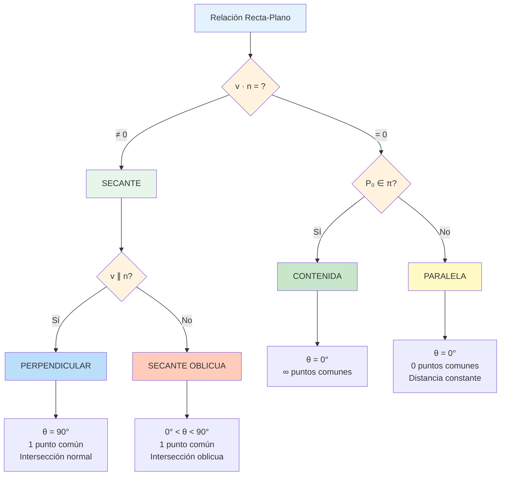

# 🔷 Relación Recta-Plano en ℝ³

## 🎯 Fundamentos de la Relación Recta-Plano

> [!info]- 💡 Introducción a las Interacciones Recta-Plano La **relación entre rectas y planos** es fundamental en geometría analítica espacial. Estudia cómo una recta puede posicionarse respecto a un plano en el espacio tridimensional.
> 
> **Analogías útiles:**
> 
> - **Física:** Rayo de luz incidiendo en una superficie
> - **Arquitectura:** Viga atravesando una pared o apoyada en ella
> - **Navegación:** Trayectoria de avión respecto al suelo
> 
> **Importancia práctica:**
> 
> - **Computación Gráfica:** Ray tracing y detección de colisiones
> - **Ingeniería:** Análisis de intersecciones estructurales
> - **Física:** Trayectorias de partículas y superficies
> - **Robótica:** Planificación de movimientos
> 
> **Conceptos clave:**
> 
> - Una recta puede estar **contenida** en un plano
> - Una recta puede **intersectar** un plano en un punto
> - Una recta puede ser **paralela** a un plano (sin tocarlo)
> - Una recta puede ser **perpendicular** a un plano

### 📊 Clasificación de Posiciones

> [!note]- 🌟 Tipos de Relaciones Posibles
> 
> |Relación|Descripción|Puntos en común|Condición|
> |---|---|---|---|
> |**Contenida**|Recta ⊂ Plano|Infinitos|**v** ⊥ **n** y P₀ ∈ π|
> |**Secante**|Se intersectan|Exactamente 1|**v** ∦ **n**|
> |**Paralela**|No se tocan|Ninguno|**v** ⊥ **n** y P₀ ∉ π|
> |**Perpendicular**|Intersección a 90°|Exactamente 1|**v** ∥ **n**|
> 
> Donde:
> 
> - **v**: vector director de la recta
> - **n**: vector normal al plano
> - P₀: punto en la recta
> - π: plano
> 
> **Nota importante:** La perpendicularidad es un caso especial de secante.

## 🔍 Determinación de la Relación

### 📐 Criterios de Clasificación

> [!example]- 🎯 Método General de Análisis **Dados:**
> 
> - Recta L: **r** = **r₀** + t**v** o (x,y,z) = (x₀,y₀,z₀) + t(a,b,c)
> - Plano π: Ax + By + Cz + D = 0 con normal **n** = (A,B,C)
> 
> **Procedimiento de clasificación:**
> 
> **Paso 1: Calcular el producto punto** **v** · **n** $$\mathbf{v} \cdot \mathbf{n} = aA + bB + cC$$
> 
> **Paso 2: Analizar el resultado**
> 
> **Caso A: Si** **v** · **n** = 0 **(vectores perpendiculares)**
> 
> - La recta es paralela al plano o está contenida en él
> - **Paso 2A:** Verificar si P₀(x₀,y₀,z₀) está en el plano:
>     - Sustituir en Ax₀ + By₀ + Cz₀ + D = ?
>     - Si = 0: **Recta contenida en el plano**
>     - Si ≠ 0: **Recta paralela al plano** (distinta)
> 
> **Caso B: Si** **v** · **n** ≠ 0 **(vectores no perpendiculares)**
> 
> - La recta es secante al plano (se intersectan en un punto)
> - **Caso especial:** Si **v** = k**n** → **Recta perpendicular al plano**
> 
> **Resumen visual:**
> 
> ```
> v · n = 0 → ¿P₀ ∈ π? → Sí: CONTENIDA
>                       → No: PARALELA
> 
> v · n ≠ 0 → ¿v ∥ n? → Sí: PERPENDICULAR
>                     → No: SECANTE (oblicua)
> ```

### ✅ Ejemplo Completo de Clasificación

> [!example]- 💪 Análisis Paso a Paso **Problema:** Clasificar la relación entre:
> 
> - Recta L: (x,y,z) = (1,2,3) + t(2,1,-1)
> - Plano π: 2x + 2y - 2z + 6 = 0
> 
> **Solución:**
> 
> **Paso 1: Identificar elementos**
> 
> - Vector director: **v** = (2, 1, -1)
> - Vector normal: **n** = (2, 2, -2)
> - Punto en la recta: P₀(1, 2, 3)
> 
> **Paso 2: Producto punto** $$\mathbf{v} \cdot \mathbf{n} = (2)(2) + (1)(2) + (-1)(-2) = 4 + 2 + 2 = 8 \neq 0$$
> 
> **Conclusión preliminar:** La recta es **secante** al plano
> 
> **Paso 3: Verificar si es perpendicular** $$\mathbf{n} = (2, 2, -2) = 2(1, 1, -1)$$ $$\mathbf{v} = (2, 1, -1) \neq k(1, 1, -1)$$
> 
> Los vectores NO son paralelos
> 
> **Respuesta:** La recta es **secante oblicua** al plano (se intersectan en un ángulo que no es 90°)
> 
> ---
> 
> **Ejemplo 2:**
> 
> - Recta L: (x,y,z) = (0,1,2) + s(1,-1,1)
> - Plano π: x + y + z = 4
> 
> **Análisis:**
> 
> - **v** = (1, -1, 1)
> - **n** = (1, 1, 1)
> - **v** · **n** = 1 - 1 + 1 = 1 ≠ 0
> 
> **Conclusión:** Recta **secante** al plano
> 
> ---
> 
> **Ejemplo 3:**
> 
> - Recta L: (x,y,z) = (2,0,1) + t(1,2,0)
> - Plano π: x + 2y - 3z = 5
> 
> **Análisis:**
> 
> - **v** = (1, 2, 0)
> - **n** = (1, 2, -3)
> - **v** · **n** = 1 + 4 + 0 = 5 ≠ 0
> 
> **Conclusión:** Recta **secante** al plano

## ⊥ Recta Perpendicular al Plano

### 🔍 Definición y Caracterización

> [!success]- 🟢 Perpendicularidad Recta-Plano **Definición:** Una recta L es perpendicular a un plano π si su vector director es paralelo al vector normal del plano.
> 
> **Condición matemática:** $$\mathbf{v} = k\mathbf{n} \quad \text{para algún } k \in \mathbb{R}, k \neq 0$$
> 
> O equivalentemente: $$\mathbf{v} \parallel \mathbf{n}$$
> 
> **Propiedades:**
> 
> - La recta es perpendicular a **toda** recta contenida en el plano
> - Forma el ángulo de 90° con el plano
> - Es la dirección de máximo cambio respecto al plano
> - Única dirección perpendicular desde un punto dado
> 
> **Interpretación geométrica:**
> 
> - Como una estaca clavada perpendicularmente en el suelo
> - Como la dirección de un rayo de luz perpendicular a un espejo
> - Como la normal a una superficie en un punto

### 📝 Ecuaciones de la Recta Perpendicular

> [!tip]- 🎯 Construcción de Rectas Perpendiculares **Problema tipo:** Encontrar la recta perpendicular al plano π que pasa por un punto P₀.
> 
> **Dado:**
> 
> - Plano π: Ax + By + Cz + D = 0
> - Punto P₀(x₀, y₀, z₀)
> 
> **Solución:**
> 
> **Paso 1:** Vector director = Vector normal del plano $$\mathbf{v} = \mathbf{n} = (A, B, C)$$
> 
> **Paso 2:** Ecuación de la recta
> 
> **Forma vectorial:** $$\mathbf{r}(t) = (x_0, y_0, z_0) + t(A, B, C)$$
> 
> **Forma paramétrica:** $$\begin{cases} x = x_0 + At \ y = y_0 + Bt \ z = z_0 + Ct \end{cases}$$
> 
> **Forma simétrica** (si A,B,C ≠ 0): $$\frac{x - x_0}{A} = \frac{y - y_0}{B} = \frac{z - z_0}{C}$$

### ✅ Ejemplos de Rectas Perpendiculares

> [!example]- 💪 Casos Prácticos **Ejemplo 1:** Recta perpendicular al plano 2x - y + 3z = 5 que pasa por P(1, 2, -1)
> 
> **Solución:**
> 
> **Paso 1:** Vector normal del plano $$\mathbf{n} = (2, -1, 3)$$
> 
> **Paso 2:** Este es el vector director de la recta $$\mathbf{v} = (2, -1, 3)$$
> 
> **Paso 3:** Ecuación de la recta
> 
> **Vectorial:** $$(x, y, z) = (1, 2, -1) + t(2, -1, 3)$$
> 
> **Paramétrica:** $$\begin{cases} x = 1 + 2t \ y = 2 - t \ z = -1 + 3t \end{cases}$$
> 
> **Simétrica:** $$\frac{x - 1}{2} = \frac{y - 2}{-1} = \frac{z + 1}{3}$$
> 
> ---
> 
> **Ejemplo 2:** Recta perpendicular al plano xy (z = 0) que pasa por el origen
> 
> **Solución:**
> 
> Plano xy: 0x + 0y + 1z = 0
> 
> - **n** = (0, 0, 1)
> - Punto: (0, 0, 0)
> 
> **Ecuación:** $$(x, y, z) = (0, 0, 0) + t(0, 0, 1)$$
> 
> Simplificando: $$\begin{cases} x = 0 \ y = 0 \ z = t \end{cases}$$
> 
> **Interpretación:** El eje z es perpendicular al plano xy
> 
> ---
> 
> **Ejemplo 3:** Verificar si L: (x,y,z) = (2,1,0) + s(3,6,-9) es perpendicular a π: x + 2y - 3z = 7
> 
> **Verificación:**
> 
> - **v** = (3, 6, -9)
> - **n** = (1, 2, -3)
> 
> ¿Es **v** = k**n**? $$\frac{3}{1} = 3, \quad \frac{6}{2} = 3, \quad \frac{-9}{-3} = 3$$
> 
> Sí: **v** = 3**n** ✓
> 
> **Conclusión:** La recta es perpendicular al plano

### 🔧 Aplicaciones de Perpendicularidad

> [!info]- 🎨 Usos Prácticos **1. Proyección ortogonal:**
> 
> - Para proyectar un punto sobre un plano
> - Se usa la recta perpendicular al plano por el punto
> - La intersección es la proyección
> 
> **2. Distancia punto-plano:**
> 
> - La distancia mínima es a lo largo de la perpendicular
> - Más eficiente que otras direcciones
> 
> **3. Reflexión:**
> 
> - La reflexión de un punto respecto a un plano
> - Usa la perpendicular como eje de simetría
> 
> **4. Computación gráfica:**
> 
> - Cálculo de normales en superficies
> - Iluminación (ley de Lambert)
> - Detección de colisiones
> 
> **5. Física:**
> 
> - Fuerzas normales a superficies
> - Trayectorias de partículas perpendiculares a campos
> 
> **Ejemplo aplicado:** Encontrar la proyección de P(3, 4, 5) sobre π: x + y + z = 6
> 
> **Paso 1:** Recta perpendicular por P $$(x, y, z) = (3, 4, 5) + t(1, 1, 1)$$
> 
> **Paso 2:** Intersección con π $$(3+t) + (4+t) + (5+t) = 6$$ $$12 + 3t = 6$$ $$t = -2$$
> 
> **Paso 3:** Punto proyectado $$P' = (3-2, 4-2, 5-2) = (1, 2, 3)$$

## ∥ Recta Paralela al Plano

### 🔍 Definición y Caracterización

> [!warning]- 🟡 Paralelismo Recta-Plano **Definición:** Una recta L es paralela a un plano π si su vector director es perpendicular al vector normal del plano y la recta no está contenida en el plano.
> 
> **Condiciones necesarias:**
> 
> 1. **v** · **n** = 0 (director perpendicular a normal)
> 2. P₀ ∉ π (punto de la recta no está en el plano)
> 
> **Propiedades:**
> 
> - La recta y el plano no tienen puntos en común
> - La distancia entre la recta y el plano es constante
> - La recta es paralela a infinitas rectas del plano
> - Existe un único plano paralelo que contiene la recta
> 
> **Distinción importante:**
> 
> - **Paralela distinta:** No se tocan (recta fuera del plano)
> - **Contenida:** Infinitos puntos comunes (recta en el plano)
> - Ambas cumplen **v** ⊥ **n**, la diferencia está en si P₀ ∈ π

### 📝 Verificación de Paralelismo

> [!tip]- 🎯 Método de Verificación **Dados:**
> 
> - Recta L: **r** = **r₀** + t**v** con punto P₀(x₀,y₀,z₀)
> - Plano π: Ax + By + Cz + D = 0
> 
> **Procedimiento:**
> 
> **Paso 1: Verificar v ⊥ n** $$\mathbf{v} \cdot \mathbf{n} = aA + bB + cC$$
> 
> Si ≠ 0 → **NO es paralela** (es secante)
> 
> **Paso 2: Si v · n = 0, verificar si P₀ está en π** $$Ax_0 + By_0 + Cz_0 + D = ?$$
> 
> - Si = 0 → **Recta contenida en el plano**
> - Si ≠ 0 → **Recta paralela al plano** (distinta)
> 
> **Interpretación:**
> 
> ```
> v · n = 0 y P₀ ∉ π → PARALELA
> v · n = 0 y P₀ ∈ π → CONTENIDA
> v · n ≠ 0         → SECANTE
> ```

### ✅ Ejemplos de Paralelismo

> [!example]- 💪 Casos Ilustrativos **Ejemplo 1:** Verificar si L: (x,y,z) = (1,0,2) + t(2,1,-1) es paralela a π: 2x + 2y - 2z = 5
> 
> **Solución:**
> 
> **Paso 1:** Elementos
> 
> - **v** = (2, 1, -1)
> - **n** = (2, 2, -2)
> - P₀(1, 0, 2)
> 
> **Paso 2:** Producto punto $$\mathbf{v} \cdot \mathbf{n} = (2)(2) + (1)(2) + (-1)(-2) = 4 + 2 + 2 = 8 \neq 0$$
> 
> **Conclusión:** NO es paralela (es secante)
> 
> ---
> 
> **Ejemplo 2:** L: (x,y,z) = (0,0,1) + s(1,1,0) y π: x + y = 5
> 
> **Análisis:**
> 
> - **v** = (1, 1, 0)
> - **n** = (1, 1, 0)
> - P₀(0, 0, 1)
> 
> **Paso 1:** Producto punto $$\mathbf{v} \cdot \mathbf{n} = 1 + 1 + 0 = 2 \neq 0$$
> 
> **Conclusión:** NO es paralela (es secante)
> 
> ---
> 
> **Ejemplo 3:** L: (x,y,z) = (2,1,3) + t(1,-2,1) y π: 2x - 4y + 2z = 10
> 
> **Análisis:**
> 
> - **v** = (1, -2, 1)
> - **n** = (2, -4, 2) = 2(1, -2, 1)
> - P₀(2, 1, 3)
> 
> **Paso 1:** Producto punto $$\mathbf{v} \cdot \mathbf{n} = (1)(2) + (-2)(-4) + (1)(2) = 2 + 8 + 2 = 12 \neq 0$$
> 
> **Observación:** Aunque **n** = 2**v**, NO son perpendiculares, ¡son paralelos!
> 
> Esto significa que la recta es **perpendicular** al plano, no paralela.
> 
> ---
> 
> **Ejemplo 4 (CORRECTO):** L: (x,y,z) = (1,2,0) + t(1,1,-2) y π: x - y + z = 5
> 
> **Análisis:**
> 
> - **v** = (1, 1, -2)
> - **n** = (1, -1, 1)
> - P₀(1, 2, 0)
> 
> **Paso 1:** Producto punto $$\mathbf{v} \cdot \mathbf{n} = (1)(1) + (1)(-1) + (-2)(1) = 1 - 1 - 2 = -2 \neq 0$$
> 
> **Conclusión:** NO es paralela
> 
> ---
> 
> **Ejemplo 5 (PARALELA VERDADERA):** L: (x,y,z) = (3,0,1) + t(2,1,0) y π: x + 0y - z = 2
> 
> **Análisis:**
> 
> - **v** = (2, 1, 0)
> - **n** = (1, 0, -1)
> - P₀(3, 0, 1)
> 
> **Paso 1:** Producto punto $$\mathbf{v} \cdot \mathbf{n} = (2)(1) + (1)(0) + (0)(-1) = 2 + 0 + 0 = 2 \neq 0$$
> 
> **Conclusión:** NO es paralela (secante)
> 
> ---
> 
> **Ejemplo 6 (PARALELA CORRECTA):** L: (x,y,z) = (1,0,2) + t(1,1,0) y π: z = 5
> 
> **Análisis:**
> 
> - **v** = (1, 1, 0)
> - **n** = (0, 0, 1)
> - P₀(1, 0, 2)
> 
> **Paso 1:** Producto punto $$\mathbf{v} \cdot \mathbf{n} = (1)(0) + (1)(0) + (0)(1) = 0$$ ✓
> 
> **Paso 2:** ¿P₀ está en π? $$z = 2 \neq 5$$ ✓
> 
> **Conclusión:** La recta es **PARALELA** al plano z = 5

### 🔧 Construcción de Rectas Paralelas

> [!note]- 📐 Crear Recta Paralela a Plano **Problema tipo:** Encontrar una recta paralela al plano π que pase por un punto P.
> 
> **Método 1: Usando dos vectores perpendiculares**
> 
> **Dado:** π: Ax + By + Cz + D = 0 y punto P(x₀,y₀,z₀)
> 
> **Paso 1:** Encontrar vector perpendicular a **n** = (A,B,C)
> 
> - Elegir cualquier vector **v** tal que **v** · **n** = 0
> - Infinitas soluciones posibles
> 
> **Paso 2:** Construir la recta $$(x,y,z) = (x_0,y_0,z_0) + t\mathbf{v}$$
> 
> **Método 2: Usando recta conocida en el plano**
> 
> Si conocemos una recta L₁ contenida en π:
> 
> - Usar el mismo vector director
> - Punto diferente (P fuera del plano)
> 
> **Ejemplo:** Recta paralela a π: 2x + y - z = 4 por P(1,1,1)
> 
> **Paso 1:** Encontrar **v** ⊥ **n** donde **n** = (2,1,-1)
> 
> Probar **v** = (1,0,2): $$\mathbf{v} \cdot \mathbf{n} = (1)(2) + (0)(1) + (2)(-1) = 2 - 2 = 0$$ ✓
> 
> **Paso 2:** Ecuación $$(x,y,z) = (1,1,1) + t(1,0,2)$$
> 
> **Verificación:**
> 
> - **v** · **n** = 0 ✓
> - P(1,1,1) en plano: 2(1) + 1 - 1 = 2 ≠ 4 ✓ (fuera del plano)

## ∩ Intersección Recta-Plano

### 🔍 Definición y Método General

> [!example]- 🔵 Punto de Intersección **Definición:** Cuando una recta es secante a un plano, se intersectan en exactamente un punto.
> 
> **Condición:** **v** · **n** ≠ 0
> 
> **Método para encontrar el punto de intersección:**
> 
> **Dados:**
> 
> - Recta L: (x,y,z) = (x₀,y₀,z₀) + t(a,b,c)
> - Plano π: Ax + By + Cz + D = 0
> 
> **Procedimiento:**
> 
> **Paso 1:** Sustituir las ecuaciones paramétricas de la recta en la ecuación del plano $$A(x_0 + at) + B(y_0 + bt) + C(z_0 + ct) + D = 0$$
> 
> **Paso 2:** Resolver para t $$\begin{align} Ax_0 + Aat + By_0 + Bbt + Cz_0 + Cct + D &= 0 \ t(Aa + Bb + Cc) &= -(Ax_0 + By_0 + Cz_0 + D) \ t &= -\frac{Ax_0 + By_0 + Cz_0 + D}{Aa + Bb + Cc} \end{align}$$
> 
> **Nota:** El denominador es **v** · **n**, que es ≠ 0 para rectas secantes
> 
> **Paso 3:** Sustituir t en las ecuaciones de la recta $$\begin{cases} x = x_0 + at \ y = y_0 + bt \ z = z_0 + ct \end{cases}$$
> 
> **Fórmula compacta:** $$t = -\frac{\mathbf{n} \cdot \mathbf{r}_0 + D}{\mathbf{n} \cdot \mathbf{v}}$$
> 
> Donde **r₀** = (x₀,y₀,z₀)

### ✅ Ejemplos de Intersección

> [!example]- 💪 Cálculos Detallados **Ejemplo 1:** Hallar la intersección de:
> 
> - L: (x,y,z) = (1,2,0) + t(1,-1,2)
> - π: 2x + y + z = 5
> 
> **Solución:**
> 
> **Paso 1:** Verificar que son secantes
> 
> - **v** = (1, -1, 2)
> - **n** = (2, 1, 1)
> - **v** · **n** = 2 - 1 + 2 = 3 ≠ 0 ✓
> 
> **Paso 2:** Sustituir la recta en el plano $$2(1+t) + (2-t) + (0+2t) = 5$$
> 
> **Paso 3:** Resolver para t $$\begin{align} 2 + 2t + 2 - t + 2t &= 5 \ 4 + 3t &= 5 \ 3t &= 1 \ t &= \frac{1}{3} \end{align}$$
> 
> **Paso 4:** Punto de intersección $$\begin{align} x &= 1 + \frac{1}{3} = \frac{4}{3} \ y &= 2 - \frac{1}{3} = \frac{5}{3} \ z &= 0 + 2 \cdot \frac{1}{3} = \frac{2}{3} \end{align}$$
> 
> **Respuesta:** P = $\left(\frac{4}{3}, \frac{5}{3}, \frac{2}{3}\right)$
> 
> **Verificación:** $$2\left(\frac{4}{3}\right) + \frac{5}{3} + \frac{2}{3} = \frac{8+5+2}{3} = \frac{15}{3} = 5$$ ✓
> 
> ---
> 
> **Ejemplo 2:** L: (x,y,z) = (0,0,1) + s(1,1,1) y π: x - 2y + z = 3
> 
> **Solución:**
> 
> **Sustituir:** $$(0+s) - 2(0+s) + (1+s) = 3$$
> 
> **Resolver:** $$\begin{align} s - 2s + 1 + s &= 3 \ 1 &= 3 \quad \text{¡Contradicción!} \end{align}$$
> 
> **Espera...** Esto no puede ser. Verifiquemos:
> 
> **Verificar si es paralela:**
> 
> - **v** = (1, 1, 1)
> - **n** = (1, -2, 1)
> - **v** · **n** = 1 - 2 + 1 = 0
> 
> **Conclusión:** La recta es **paralela** al plano (no secante). Mi asunción inicial fue incorrecta.
> 
> ---
> 
> **Ejemplo 3 :** L: (x,y,z) = (2,1,-1) + t(1,0,2) y π: x + y + z = 4
> 
> **Verificar secancia:**
> 
> - **v** = (1, 0, 2)
> - **n** = (1, 1, 1)
> - **v** · **n** = 1 + 0 + 2 = 3 ≠ 0 ✓ (secante)
> 
> **Sustituir:** $$(2+t) + (1) + (-1+2t) = 4$$
> 
> **Resolver:** $$\begin{align} 2 + t + 1 - 1 + 2t &= 4 \ 2 + 3t &= 4 \ 3t &= 2 \ t &= \frac{2}{3} \end{align}$$
> 
> **Punto de intersección:** $$\begin{align} x &= 2 + \frac{2}{3} = \frac{8}{3} \ y &= 1 \ z &= -1 + 2 \cdot \frac{2}{3} = -1 + \frac{4}{3} = \frac{1}{3} \end{align}$$
> 
> **Respuesta:** P = $\left(\frac{8}{3}, 1, \frac{1}{3}\right)$
> 
> **Verificación:** $$\frac{8}{3} + 1 + \frac{1}{3} = \frac{8+3+1}{3} = \frac{12}{3} = 4$$ ✓
> 
> ---
> 
> **Ejemplo 4:** L: eje x (recta (x,y,z) = (t,0,0)) y π: y + z = 5
> 
> **Sustituir:** $$0 + 0 = 5$$
> 
> **Contradicción:** El eje x es **paralelo** al plano y + z = 5
> 
> **Verificación:**
> 
> - **v** = (1, 0, 0)
> - **n** = (0, 1, 1)
> - **v** · **n** = 0 ✓ (paralela o contenida)
> - Punto (0,0,0): 0 + 0 = 0 ≠ 5 (paralela distinta)

### 🎯 Casos Especiales de Intersección

> [!tip]- 🌟 Situaciones Particulares **1. Intersección con planos coordenados:**
> 
> **Recta L: (x,y,z) = (x₀,y₀,z₀) + t(a,b,c)**
> 
> **Con plano xy (z = 0):** $$z_0 + tc = 0 \Rightarrow t = -\frac{z_0}{c}$$ Punto: $\left(x_0 - \frac{az_0}{c}, y_0 - \frac{bz_0}{c}, 0\right)$
> 
> **Con plano xz (y = 0):** $$y_0 + tb = 0 \Rightarrow t = -\frac{y_0}{b}$$
> 
> **Con plano yz (x = 0):** $$x_0 + ta = 0 \Rightarrow t = -\frac{x_0}{a}$$
> 
> ---
> 
> **2. Intersección perpendicular:**
> 
> Cuando **v** = k**n**, la recta entra perpendicular al plano.
> 
> **Ejemplo:**
> 
> - L: (x,y,z) = (1,1,1) + t(2,1,-1)
> - π: 2x + y - z = 4
> - **v** = (2,1,-1) = **n** ✓
> 
> **Cálculo:** $$2(1+2t) + (1+t) - (1-t) = 4$$ $$2 + 4t + 1 + t - 1 + t = 4$$ $$2 + 6t = 4$$ $$t = \frac{1}{3}$$
> 
> Punto: $\left(\frac{5}{3}, \frac{4}{3}, \frac{2}{3}\right)$
> 
> ---
> 
> **3. Múltiples intersecciones (imposible):**
> 
> Una recta NO puede intersectar un plano en más de un punto a menos que esté contenida en él.
> 
> **Prueba por contradicción:**
> 
> - Si L intersecta π en P₁ y P₂ distintos
> - Entonces P₁P₂ es un segmento en π
> - Por tanto L está contenida en π
> - Contradicción con "intersección en puntos aislados"

## 📐 Ángulo entre Recta y Plano

### 🔍 Definición del Ángulo

> [!note]- 📊 Concepto de Ángulo Recta-Plano **Definición:** El ángulo θ entre una recta L y un plano π es el **complemento** del ángulo entre el vector director de la recta y el vector normal al plano.
> 
> **Interpretación geométrica:**
> 
> - Es el menor ángulo entre la recta y cualquier recta del plano
> - Es el ángulo entre la recta y su proyección sobre el plano
> - Rango: 0° ≤ θ ≤ 90°
> 
> **Relación fundamental:** Si α es el ángulo entre **v** y **n**, entonces: $$\theta = 90° - \alpha$$
> 
> O equivalentemente: $$\sin \theta = \cos \alpha = \frac{|\mathbf{v} \cdot \mathbf{n}|}{||\mathbf{v}|| \cdot ||\mathbf{n}||}$$
> 
> **Casos especiales:**
> 
> - θ = 0° → Recta paralela o contenida en el plano
> - θ = 90° → Recta perpendicular al plano
> - 0° < θ < 90° → Recta secante oblicua

### 📝 Fórmula del Ángulo

> [!success]- 🟢 Cálculo del Ángulo **Dados:**
> 
> - Recta L con vector director **v** = (a,b,c)
> - Plano π con vector normal **n** = (A,B,C)
> 
> **Fórmula principal:** $$\sin \theta = \frac{|\mathbf{v} \cdot \mathbf{n}|}{||\mathbf{v}|| \cdot ||\mathbf{n}||} = \frac{|aA + bB + cC|}{\sqrt{a^2+b^2+c^2} \cdot \sqrt{A^2+B^2+C^2}}$$
> 
> **Fórmula alternativa (usando coseno del complemento):** $$\cos(90° - \theta) = \sin \theta$$
> 
> **Despejar el ángulo:** $$\theta = \arcsin\left(\frac{|\mathbf{v} \cdot \mathbf{n}|}{||\mathbf{v}|| \cdot ||\mathbf{n}||}\right)$$
> 
> **Nota importante:** Se usa seno (no coseno como en plano-plano) porque el ángulo se mide respecto al plano, no respecto a la normal.

### ✅ Ejemplos de Cálculo de Ángulos

> [!example]- 💪 Problemas Resueltos **Ejemplo 1:** Ángulo entre L: (x,y,z) = (1,0,2) + t(1,1,1) y π: x + 2y + 2z = 9
> 
> **Solución:**
> 
> **Paso 1:** Identificar vectores
> 
> - **v** = (1, 1, 1)
> - **n** = (1, 2, 2)
> 
> **Paso 2:** Producto punto $$\mathbf{v} \cdot \mathbf{n} = (1)(1) + (1)(2) + (1)(2) = 1 + 2 + 2 = 5$$
> 
> **Paso 3:** Magnitudes $$\begin{align} ||\mathbf{v}|| &= \sqrt{1^2 + 1^2 + 1^2} = \sqrt{3} \ ||\mathbf{n}|| &= \sqrt{1^2 + 2^2 + 2^2} = \sqrt{9} = 3 \end{align}$$
> 
> **Paso 4:** Calcular seno del ángulo $$\sin \theta = \frac{|5|}{\sqrt{3} \cdot 3} = \frac{5}{3\sqrt{3}} = \frac{5\sqrt{3}}{9}$$
> 
> **Paso 5:** Ángulo $$\theta = \arcsin\left(\frac{5\sqrt{3}}{9}\right) \approx \arcsin(0.9622) \approx 74.21°$$
> 
> **Respuesta:** θ ≈ 74.21°
> 
> ---
> 
> **Ejemplo 2:** Verificar perpendicularidad entre L: (x,y,z) = (0,0,0) + s(2,-1,3) y π: 4x - 2y + 6z = 12
> 
> **Análisis:**
> 
> - **v** = (2, -1, 3)
> - **n** = (4, -2, 6) = 2(2, -1, 3) = 2**v**
> 
> **Conclusión inmediata:** **v** ∥ **n** → Perpendicular
> 
> **Verificación con fórmula:** $$\mathbf{v} \cdot \mathbf{n} = (2)(4) + (-1)(-2) + (3)(6) = 8 + 2 + 18 = 28$$
> 
> $$\sin \theta = \frac{|28|}{\sqrt{14} \cdot \sqrt{56}} = \frac{28}{\sqrt{784}} = \frac{28}{28} = 1$$
> 
> $$\theta = \arcsin(1) = 90°$$ ✓
> 
> ---
> 
> **Ejemplo 3:** Ángulo entre el eje z y el plano xy
> 
> **Elementos:**
> 
> - Eje z: (x,y,z) = (0,0,0) + t(0,0,1), **v** = (0,0,1)
> - Plano xy: z = 0, **n** = (0,0,1)
> 
> **Cálculo:** $$\mathbf{v} \cdot \mathbf{n} = (0)(0) + (0)(0) + (1)(1) = 1$$
> 
> $$\sin \theta = \frac{|1|}{1 \cdot 1} = 1$$
> 
> $$\theta = 90°$$
> 
> **Interpretación:** El eje z es perpendicular al plano xy ✓
> 
> ---
> 
> **Ejemplo 4:** Recta con ángulo de 30° respecto a un plano
> 
> **Problema:** Verificar si L: (x,y,z) = (1,2,3) + t(1,0,√3) forma 30° con π: x = 5
> 
> **Análisis:**
> 
> - **v** = (1, 0, √3)
> - **n** = (1, 0, 0)
> 
> **Cálculo:** $$\mathbf{v} \cdot \mathbf{n} = (1)(1) + 0 + 0 = 1$$
> 
> $$||\mathbf{v}|| = \sqrt{1 + 0 + 3} = 2$$ $$||\mathbf{n}|| = 1$$
> 
> $$\sin \theta = \frac{1}{2 \cdot 1} = \frac{1}{2}$$
> 
> $$\theta = \arcsin\left(\frac{1}{2}\right) = 30°$$ ✓

### 🔧 Aplicaciones del Ángulo

> [!info]- 🎨 Usos Prácticos **1. Óptica:**
> 
> - Ángulo de incidencia de rayos de luz
> - Reflexión y refracción en superficies
> - Diseño de espejos y lentes
> 
> **2. Ingeniería estructural:**
> 
> - Ángulo de cables o vigas respecto a planos
> - Análisis de fuerzas en estructuras
> - Estabilidad de construcciones
> 
> **3. Navegación:**
> 
> - Ángulo de ascenso/descenso de aeronaves
> - Trayectorias respecto al terreno
> - Planificación de rutas
> 
> **4. Computación gráfica:**
> 
> - Cálculo de sombreado
> - Ángulo de visión respecto a superficies
> - Iluminación direccional
> 
> **5. Física:**
> 
> - Ángulo de lanzamiento en planos inclinados
> - Trayectorias de proyectiles
> - Deslizamiento en superficies

## 📊 Tabla Resumen de Relaciones

> [!example]- 📋 Compendio Completo
> 
> |Relación|Condición algebraica|Condición geométrica|Intersección|Ángulo θ|
> |---|---|---|---|---|
> |**Contenida**|**v**·**n** = 0 y P₀ ∈ π|Recta en el plano|Infinitos puntos|0°|
> |**Paralela**|**v**·**n** = 0 y P₀ ∉ π|No se tocan|Ninguno|0°|
> |**Secante**|**v**·**n** ≠ 0|Se cortan oblicuamente|1 punto|0° < θ < 90°|
> |**Perpendicular**|**v** = k**n**|Se cortan a 90°|1 punto|90°|
> 
> **Fórmulas clave:**
> 
> |Cálculo|Fórmula|
> |---|---|
> |**Verificar paralelismo**|**v** · **n** = 0|
> |**Verificar perpendicularidad**|**v** = k**n** (paralelos)|
> |**Punto de intersección**|t = -(Ax₀+By₀+Cz₀+D)/(Aa+Bb+Cc)|
> |**Ángulo recta-plano**|sin θ = \|**v**·**n**\| / (\|**v**\| \|**n**\|)|
> |**Distancia recta-plano**|(Solo si paralelas) d = \|Ax₀+By₀+Cz₀+D\| / √(A²+B²+C²)|

## 🎨 Diagrama Conceptual



## 🧪 Ejercicios Propuestos

> [!example]- 💪 Práctica Progresiva
> 
> **Nivel 1 - Clasificación:** 🟢
> 
> 1. Clasificar la relación entre:
>     
>     - L: (x,y,z) = (1,0,2) + t(1,1,0)
>     - π: x + y = 5
> 2. Determinar si la recta L: (x,y,z) = (2,1,3) + s(1,2,1) es paralela a π: x + 2y + z = 7
>     
> 3. Verificar si L: x/2 = y/1 = z/(-3) es perpendicular a π: 4x + 2y - 6z = 10
>     
> 4. ¿El eje y está contenido en el plano xz?
>     
> 5. Clasificar: L: (x,y,z) = (0,0,0) + t(1,1,1) y π: x + y + z = 0
>     
> 
> **Nivel 2 - Intersecciones:** 🟡
> 
> 6. Hallar el punto de intersección entre:
>     
>     - L: (x,y,z) = (1,2,0) + t(1,-1,2)
>     - π: x + y + z = 6
> 7. Encontrar donde L: (x-1)/2 = (y+1)/1 = z/(-1) corta al plano xy
>     
> 8. Determinar la intersección de:
>     
>     - L: (x,y,z) = (0,1,2) + s(2,0,1)
>     - π: 2x - y + z = 3
> 9. ¿En qué punto el eje z intersecta el plano 2x + 3y + z = 5?
>     
> 10. Hallar todos los puntos donde L: (x,y,z) = (1,1,1) + t(1,1,1) corta los planos coordenados
>     
> 
> **Nivel 3 - Ángulos:** 🟠
> 
> 11. Calcular el ángulo entre:
>     
>     - L: (x,y,z) = (0,0,0) + t(1,2,2)
>     - π: 2x + y + 2z = 9
> 12. Verificar que L: (x,y,z) = (1,0,0) + s(0,1,1) forma 45° con π: y - z = 0
>     
> 13. Hallar el ángulo entre el eje x y el plano x + y + z = 1
>     
> 14. ¿Qué ángulo forma la diagonal del cubo con una de sus caras?
>     
> 15. Encontrar una recta que forme 60° con el plano xy y pase por el origen
>     
> 
> **Nivel 4 - Construcción:** 🔴
> 
> 16. Encontrar la recta perpendicular a π: 2x - y + 3z = 5 que pasa por P(1,2,-1)
>     
> 17. Hallar una recta paralela a π: x + 2y - z = 3 que pase por Q(0,0,1) y sea perpendicular al eje z
>     
> 18. Construir el plano que contiene a L: (x,y,z) = (1,0,0) + t(1,1,0) y es perpendicular a π: x - y + z = 2
>     
> 19. Dada L secante a π en P, encontrar la proyección de L sobre π
>     
> 20. Hallar la familia de planos que contienen a la recta L: (x,y,z) = (1,1,1) + t(2,0,1)
>     
> 
> **Nivel 5 - Aplicaciones:** 🔴🔴
> 
> 21. Un rayo de luz sigue L: (x,y,z) = (0,0,5) + t(1,1,-2) e impacta π: z = 0. Hallar el punto de impacto y el ángulo de incidencia.
>     
> 22. Una viga modelada por L: (x,y,z) = (0,0,h) + s(1,0,-1) descansa en el suelo (z = 0). ¿A qué altura h debe estar su extremo para que forme 30° con el suelo?
>     
> 23. Dos planos π₁: x + y = 2 y π₂: x - y = 0 se intersectan. Hallar una recta perpendicular a ambos.
>     
> 24. Un avión vuela según L: (x,y,z) = (0,0,1000) + t(100,50,10) (en metros). Si el suelo es z = 0, ¿dónde aterrizará y con qué ángulo de descenso?
>     
> 25. En un sistema de espejos paralelos separados por distancia d, un rayo sigue L. Determinar los puntos de reflexión múltiple.
>     

## 🌍 Aplicaciones Prácticas

### 🎮 En Computación Gráfica y Videojuegos

> [!success]- 🖥️ Ray Tracing y Colisiones **1. Ray Tracing (Trazado de Rayos):**
> 
> El algoritmo fundamental de renderizado 3D:
> 
> **Algoritmo básico:**
> 
> ```python
> def ray_plane_intersection(ray_origin, ray_direction, plane_normal, plane_d):
>     """
>     Calcula intersección rayo-plano
>     ray: r = origin + t*direction
>     plane: n·r + d = 0
>     """
>     denom = dot(ray_direction, plane_normal)
>     
>     if abs(denom) < 1e-6:  # Paralelo
>         return None
>     
>     t = -(dot(ray_origin, plane_normal) + plane_d) / denom
>     
>     if t < 0:  # Intersección detrás del origen
>         return None
>     
>     intersection_point = ray_origin + t * ray_direction
>     return intersection_point, t
> ```
> 
> **Aplicaciones:**
> 
> - **Sombras:** Rayos desde luz hacia objetos
> - **Reflexiones:** Rayos reflejados en superficies planas
> - **Refracciones:** Rayos atravesando materiales transparentes
> - **Ambient Occlusion:** Muestreo de visibilidad
> 
> ---
> 
> **2. Detección de Colisiones:**
> 
> **Colisión rayo-plano para mouse picking:**
> 
> ```cpp
> // Convertir clic del mouse en rayo 3D
> Ray screenToWorldRay(int mouseX, int mouseY, Camera cam) {
>     // Transformar coordenadas de pantalla a mundo
>     Vector3 rayOrigin = cam.position;
>     Vector3 rayDirection = unproject(mouseX, mouseY, cam);
>     return Ray(rayOrigin, rayDirection);
> }
> 
> // Seleccionar objeto en el plano del suelo
> Vector3 pickOnGround(Ray ray) {
>     Plane ground(Vector3(0,0,1), 0); // z = 0
>     return ray.intersect(ground);
> }
> ```
> 
> ---
> 
> **3. Frustum Culling Optimizado:**
> 
> **Verificar si un punto está dentro del frustum:**
> 
> ```python
> def point_in_frustum(point, frustum_planes):
>     """
>     frustum_planes: lista de 6 planos [near, far, left, right, top, bottom]
>     Cada plano: (normal, d)
>     """
>     for normal, d in frustum_planes:
>         distance = dot(normal, point) + d
>         if distance < 0:  # Punto fuera del plano
>             return False
>     return True
> ```
> 
> ---
> 
> **4. Proyección de Sombras:**
> 
> **Proyectar punto sobre plano (sombra):**
> 
> ```javascript
> function projectShadow(lightPos, objectPos, groundPlane) {
>     // Recta desde luz a objeto
>     let direction = objectPos.sub(lightPos);
>     
>     // Intersección con suelo
>     let t = -(dot(lightPos, groundPlane.normal) + groundPlane.d) 
>             / dot(direction, groundPlane.normal);
>     
>     let shadowPos = lightPos.add(direction.mul(t));
>     return shadowPos;
> }
> ```

### ✈️ En Navegación y Aviación

> [!info]- 🛫 Trayectorias y Planificación **1. Cálculo de Aterrizaje:**
> 
> **Problema:** Un avión vuela a 3000m de altura siguiendo la trayectoria: $$L: (x,y,z) = (0, 0, 3000) + t(100, 50, -5)$$ (velocidades en m/s)
> 
> **Encontrar:**
> 
> - a) Punto de aterrizaje (z = 0)
> - b) Ángulo de descenso
> - c) Distancia horizontal recorrida
> 
> **Solución:**
> 
> **a) Intersección con z = 0:** $$3000 + t(-5) = 0$$ $$t = 600 \text{ segundos} = 10 \text{ minutos}$$
> 
> Punto: (60000, 30000, 0) metros = (60 km, 30 km, 0)
> 
> **b) Ángulo de descenso:**
> 
> - **v** = (100, 50, -5)
> - **n** = (0, 0, 1) (normal al suelo)
> 
> $$\sin \theta = \frac{|(100)(0) + (50)(0) + (-5)(1)|}{\sqrt{100^2+50^2+5^2} \cdot 1}$$
> 
> $$\sin \theta = \frac{5}{\sqrt{10025}} \approx \frac{5}{100.12} \approx 0.05$$
> 
> $$\theta \approx 2.87°$$
> 
> **c) Distancia horizontal:** $$d = \sqrt{60000^2 + 30000^2} = \sqrt{4500000000} \approx 67082 \text{ m} \approx 67.1 \text{ km}$$
> 
> ---
> 
> **2. Planificación de Rutas:**
> 
> **Evitar montañas modeladas como planos:**
> 
> Verificar si la trayectoria intersecta planos prohibidos:
> 
> ```python
> def route_safe(route_origin, route_direction, forbidden_planes):
>     for plane in forbidden_planes:
>         intersection = ray_plane_intersection(
>             route_origin, route_direction, 
>             plane.normal, plane.d
>         )
>         if intersection is not None:
>             return False  # Ruta insegura
>     return True  # Ruta libre
> ```

### 🏗️ En Arquitectura e Ingeniería

> [!note]- 🏛️ Diseño Estructural **1. Intersección de Vigas con Planos:**
> 
> **Problema:** Una viga sigue la recta: $$L: (x,y,z) = (0,0,5) + t(3,4,0)$$
> 
> Debe atravesar una pared en el plano: $$\pi: x = 10$$
> 
> **Encontrar:** Altura de penetración
> 
> **Solución:** $$0 + 3t = 10$$ $$t = \frac{10}{3}$$
> 
> $$z = 5 + 0 \cdot \frac{10}{3} = 5$$
> 
> **Punto de penetración:** (10, 40/3, 5) **Altura:** z = 5 metros
> 
> ---
> 
> **2. Ángulo de Rampa:**
> 
> **Diseñar rampa accesible (máximo 8.33% = 4.76°):**
> 
> Rampa: $L: (x,y,z) = (0,0,0) + t(12,0,1)$ Suelo: $\pi: z = 0$
> 
> **Verificar ángulo:** $$\sin \theta = \frac{|1|}{\sqrt{144+1}} = \frac{1}{\sqrt{145}} \approx 0.083$$
> 
> $$\theta \approx 4.76°$$ ✓ (Cumple norma)
> 
> ---
> 
> **3. Drenaje de Techos:**
> 
> **Techo inclinado como plano:** $$\pi: 2x + y - 10z = 0$$
> 
> **Dirección de flujo de agua (perpendicular al plano):** $$\mathbf{v} = \mathbf{n} = (2, 1, -10)$$
> 
> (Agua fluye en dirección del vector normal)

### 🔬 En Física

> [!tip]- ⚛️ Trayectorias y Campos **1. Proyectil en Plano Inclinado:**
> 
> **Problema:** Proyectil lanzado desde origen con velocidad $\mathbf{v}_0 = (10, 0, 20)$ m/s. Plano inclinado: $z = 0.5x$
> 
> **Trayectoria con gravedad:** $$\mathbf{r}(t) = \mathbf{v}_0 t + \frac{1}{2}\mathbf{g}t^2 = (10t, 0, 20t - 5t^2)$$
> 
> **Intersección con plano:** $$20t - 5t^2 = 0.5(10t)$$ $$20t - 5t^2 = 5t$$ $$15t - 5t^2 = 0$$ $$t(15 - 5t) = 0$$
> 
> $$t = 0 \text{ o } t = 3$$
> 
> **Punto de impacto (t=3):** $$(30, 0, 15)$$ metros
> 
> ---
> 
> **2. Reflexión de Luz:**
> 
> **Ley de reflexión en un espejo plano:**
> 
> Rayo incidente: $\mathbf{v}_{in} = (1, 1, -2)$ Espejo: $\pi: z = 0$ con normal $\mathbf{n} = (0, 0, 1)$
> 
> **Rayo reflejado:** $$\mathbf{v}_{ref} = \mathbf{v}_{in} - 2(\mathbf{v}_{in} \cdot \mathbf{n})\mathbf{n}$$
> 
> $$\mathbf{v}_{ref} = (1,1,-2) - 2(-2)(0,0,1) = (1,1,-2) - (0,0,-4) = (1,1,2)$$
> 
> ---
> 
> **3. Fuerza Normal en Superficie:**
> 
> **Objeto sobre plano inclinado:**
> 
> Plano: $2x + 3y + 6z = 18$ Normal: $\mathbf{n} = (2, 3, 6)$
> 
> **Fuerza normal (por unidad de masa):** $$\mathbf{F}_N = (\mathbf{g} \cdot \mathbf{\hat{n}})\mathbf{\hat{n}}$$
> 
> Donde $\mathbf{\hat{n}} = \frac{(2,3,6)}{7}$

## 🔗 Conexiones con el Sistema de Notas

> [!quote]- 🌐 Enlaces Conceptuales
> 
> **Prerrequisitos (Prerequisites):**
> 
> - [[04. Rectas en R3]] - Ecuaciones y propiedades de rectas
> - [[05. Planos en R3]] - Ecuaciones y propiedades de planos
> - [[02. Vectores en R3]] - Operaciones vectoriales
> - [[02.1 Producto Punto]] - Para ángulos y perpendicularidad
> - [[02.2 Producto Cruz]] - Para vectores normales
> 
> **Conceptos utilizados:**
> 
> - [[Vector Normal]] - Perpendicular al plano
> - [[Vector Director]] - Dirección de la recta
> - [[Paralelismo en R3]] - Condiciones de paralelismo
> - [[Perpendicularidad en R3]] - Condiciones de ortogonalidad
> 
> **Aplicaciones directas:**
> 
> - [[07. Distancias en R3]] - Distancias relacionadas
> - [[07.1 Distancia Punto-Plano]] - Usando perpendiculares
> - [[07.2 Distancia Punto-Recta]] - Geometría relacionada
> - [[Proyecciones en R3]] - Proyección ortogonal
> 
> **Temas avanzados:**
> 
> - [[Sistemas de Ecuaciones Lineales]] - Intersecciones múltiples
> - [[Geometría Proyectiva]] - Puntos al infinito
> - [[Transformaciones Lineales]] - Matrices de rotación
> - [[Espacios Afines]] - Formalización abstracta
> 
> **Aplicaciones interdisciplinarias:**
> 
> - [[Ray Tracing]] - Computación gráfica
> - [[Óptica Geométrica]] - Reflexión y refracción
> - [[Mecánica Clásica]] - Planos inclinados
> - [[Navegación 3D]] - Sistemas de coordenadas

## 💡 Consejos de Estudio

> [!tip]- 🧠 Estrategias de Aprendizaje
> 
> **Para clasificar relaciones:**
> 
> 1. **Checklist rápido:**
>     
>     ```
>     □ Calcular v · n
>     □ Si = 0: verificar si P₀ ∈ π
>     □ Si ≠ 0: verificar si v ∥ n
>     □ Clasificar según resultado
>     ```
>     
> 2. **Visualización:**
>     
>     - Paralela: como rieles de tren y el suelo
>     - Perpendicular: como poste vertical en el suelo
>     - Secante: como escalera apoyada en pared
>     - Contenida: como línea pintada en el suelo
> 3. **Recordatorio de signos:**
>     
>     - **v** · **n** = 0 → Paralela o contenida
>     - **v** · **n** ≠ 0 → Secante (buscar intersección)
>     - **v** = k**n** → Perpendicular (caso especial de secante)
> 
> **Para encontrar intersecciones:**
> 
> 4. **Método sistemático:**
>     - Sustituir x = x₀ + at, y = y₀ + bt, z = z₀ + ct en Ax + By + Cz + D = 0
>     - Agrupar términos en t
>     - Despejar t
>     - Evaluar punto
> 5. **Verificación obligatoria:**
>     - Siempre sustituir el punto en la ecuación del plano
>     - Verificar que satisface las ecuaciones de la recta
> 6. **Casos especiales:**
>     - Si el denominador es cero → No hay intersección única
>     - Si aparece 0 = constante ≠ 0 → Paralela distinta
>     - Si aparece 0 = 0 → Contenida (infinitas soluciones)
> 
> **Para calcular ángulos:**
> 
> 7. **Recordar:** Se usa **SENO**, no coseno
>     - Ángulo con el plano, no con la normal
>     - sen θ = |v·n| / (||v|| ||n||)
> 8. **Casos límite:**
>     - sen θ = 0 → θ = 0° (paralela)
>     - sen θ = 1 → θ = 90° (perpendicular)
> 9. **Interpretación física:**
>     - Ángulo pequeño: recta casi paralela
>     - Ángulo grande: recta casi perpendicular
> 
> **Errores comunes a evitar:**
> 
> 10. ❌ Confundir v ⊥ n con v ∥ n
>     - v ⊥ n significa paralela al plano
>     - v ∥ n significa perpendicular al plano
> 11. ❌ Olvidar verificar P₀ ∈ π cuando v · n = 0
>     - Necesario para distinguir paralela de contenida
> 12. ❌ Usar coseno en lugar de seno para ángulo recta-plano
>     - Recta-plano: sen θ
>     - Plano-plano: cos θ
> 13. ❌ No verificar el signo de t en intersecciones
>     - t < 0: intersección "atrás" del punto inicial
>     - Importante en ray tracing
> 14. ❌ Asumir que toda secante es perpendicular
>     - Perpendicular es caso especial: v = k·n
> 
> **Mnemotécnicas:**
> 
> - **"PPN":** Producto Punto Nulo → Paralela (o contenida)
> - **"VN":** V paralelo a N → perpeNdicular al plano
> - **"SENO":** Seno para Ángulo Recta-Plano
> - **"SVIP":** Sustituir, Verificar, Identificar, Punto de intersección

## 📚 Formulario de Referencia Rápida

> [!example]- 📋 Resumen de Fórmulas Esenciales
> 
> **Clasificación de relaciones:**
> 
> |Condición|Relación|Intersección|
> |---|---|---|
> |v·n = 0 y P₀ ∈ π|Contenida|Infinitos puntos|
> |v·n = 0 y P₀ ∉ π|Paralela|Ninguno|
> |v·n ≠ 0 y v ≠ kn|Secante oblicua|1 punto|
> |v = kn|Perpendicular|1 punto|
> 
> **Fórmulas de cálculo:**
> 
> ```
> Verificar paralelismo:
> v · n = 0?
> 
> Verificar perpendicularidad:
> v = k·n? (componentes proporcionales)
> 
> Punto de intersección:
> t = -(Ax₀ + By₀ + Cz₀ + D) / (Aa + Bb + Cc)
> Luego: P = (x₀,y₀,z₀) + t(a,b,c)
> 
> Ángulo recta-plano:
> sin θ = |v·n| / (||v|| ||n||)
> 
> Distancia recta-plano paralelos:
> d = |Ax₀ + By₀ + Cz₀ + D| / √(A² + B² + C²)
> ```
> 
> **Ecuaciones de rectas especiales:**
> 
> ```
> Recta perpendicular a π por P:
> L: r = P + t·n
> 
> Recta paralela a π por P:
> L: r = P + t·v  donde v·n = 0
> 
> Proyección de P sobre π:
> 1. Crear perpendicular por P
> 2. Intersectar con π
> ```

## 🎓 Resumen Final

> [!summary]- 📖 Puntos Clave para Recordar
> 
> **Tipos de relaciones:**
> 
> 1. **Contenida:** Recta dentro del plano (v⊥n y P₀∈π)
> 2. **Paralela:** No se tocan (v⊥n y P₀∉π)
> 3. **Secante:** Se cortan en un punto (v·n≠0)
> 4. **Perpendicular:** Caso especial de secante (v∥n)
> 
> **Método de clasificación:**
> 
> 1. Calcular **v** · **n**
> 2. Si = 0 → verificar P₀ en π
> 3. Si ≠ 0 → son secantes, verificar si perpendicular
> 
> **Para intersecciones:**
> 
> 4. Sustituir ecuaciones paramétricas en ecuación del plano
> 5. Resolver para el parámetro t
> 6. Evaluar el punto con ese valor de t
> 7. Siempre verificar el resultado
> 
> **Ángulos:**
> 
> - Usar **seno** (no coseno)
> - sen θ = |**v**·**n**| / (||**v**|| ||**n**||)
> - Rango: 0° ≤ θ ≤ 90°
> 
> **Aplicaciones clave:**
> 
> - Ray tracing en gráficos 3D
> - Navegación y trayectorias
> - Proyecciones ortogonales
> - Reflexión de luz
> - Análisis estructural
> 
> **Recordar:**
> 
> - v ⊥ n significa recta paralela AL plano
> - v ∥ n significa recta perpendicular AL plano
> - Siempre verificar casos especiales (paralela vs contenida)

---

**Tags:** #geometría-analítica #recta-plano #R3 #intersecciones #perpendicularidad #paralelismo #ángulos #proyecciones #ray-tracing #computación-gráfica #física #navegación #universidad #matemáticas #geometría-espacial #vectores