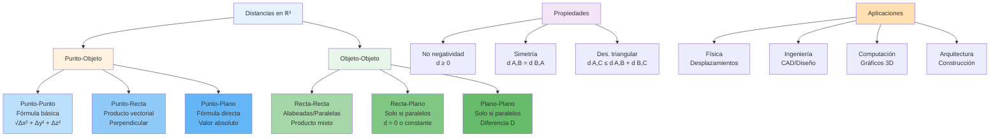

# 📏 Distancias en ℝ³

## 🎯 Fundamentos de las Distancias

> [!info]- 💡 Introducción a las Métricas en el Espacio Tridimensional Las **distancias en ℝ³** son medidas que cuantifican la separación entre diferentes objetos geométricos (puntos, rectas, planos) en el espacio tridimensional. Estas métricas son fundamentales para la geometría analítica y tienen aplicaciones directas en física, ingeniería, computación gráfica y análisis espacial.
> 
> **Analogías útiles:**
> 
> - **Geografía:** Distancia entre ciudades en un mapa 3D
> - **Física:** Medición de desplazamientos en el espacio
> - **Videojuegos:** Cálculo de colisiones y proximidad entre objetos
> - **Arquitectura:** Medición de separaciones entre estructuras
> 
> **Importancia histórica:**
> 
> - **Euclides (300 a.C.):** Fundamentos geométricos básicos
> - **Descartes (1637):** Geometría analítica
> - **Gauss (1827):** Geometría diferencial
> - **Minkowski (1908):** Espacios métricos generales

### 📊 Tipos de Distancias Fundamentales

> [!note]- 🌟 Clasificación de Distancias en ℝ³
> 
> |Tipo de Distancia|Objetos Involucrados|Complejidad|Aplicación Principal|
> |---|---|---|---|
> |**Punto-Punto**|P₁, P₂|Básica|Navegación, física|
> |**Punto-Recta**|P, L|Media|CAD, robótica|
> |**Punto-Plano**|P, π|Media|Computación gráfica|
> |**Recta-Recta**|L₁, L₂|Alta|Diseño mecánico|
> |**Recta-Plano**|L, π|Media|Arquitectura|
> |**Plano-Plano**|π₁, π₂|Básica|Construcción|
> 
> **Características generales:**
> 
> - Son **no negativas:** d(A, B) ≥ 0
> - Son **simétricas:** d(A, B) = d(B, A)
> - Cumplen **desigualdad triangular:** d(A, C) ≤ d(A, B) + d(B, C)
> - Son **invariantes** bajo traslaciones y rotaciones

## 📍 Distancia entre Dos Puntos

### 🔍 Definición y Fórmula

> [!example]- 🔵 Métrica Euclidiana Fundamental
> 
> **Definición:** La distancia entre dos puntos P₁(x₁, y₁, z₁) y P₂(x₂, y₂, z₂) en ℝ³ es la longitud del segmento que los une.
> 
> **Fórmula:** $$d(P_1, P_2) = \sqrt{(x_2-x_1)^2 + (y_2-y_1)^2 + (z_2-z_1)^2}$$
> 
> **Forma vectorial:** $$d(P_1, P_2) = |\vec{P_1P_2}| = |\vec{v}|$$
> 
> donde $\vec{v} = (x_2-x_1, y_2-y_1, z_2-z_1)$
> 
> **Interpretación geométrica:**
> 
> - Es la **hipotenusa** de un paralelepípedo rectangular
> - Extiende el **teorema de Pitágoras** a tres dimensiones
> - Es el **camino más corto** entre dos puntos

### 📐 Propiedades de la Distancia Punto-Punto

> [!note]- 📋 Propiedades Fundamentales
> 
> **1. No negatividad:**
> 
> - d(P₁, P₂) ≥ 0
> - d(P₁, P₂) = 0 ⟺ P₁ = P₂
> 
> **2. Simetría:**
> 
> - d(P₁, P₂) = d(P₂, P₁)
> 
> **3. Desigualdad triangular:**
> 
> - d(P₁, P₃) ≤ d(P₁, P₂) + d(P₂, P₃)
> - La igualdad se cumple cuando P₂ está en el segmento P₁P₃
> 
> **4. Invariancia:**
> 
> - **Traslaciones:** d(P₁ + v, P₂ + v) = d(P₁, P₂)
> - **Rotaciones:** La distancia no cambia al rotar el sistema
> 
> **5. Homogeneidad:**
> 
> - Si escalamos por factor k: d(kP₁, kP₂) = |k| · d(P₁, P₂)

### ✅ Ejemplos de Distancia Punto-Punto

> [!example]- 💪 Casos Prácticos
> 
> **Ejemplo 1 - Cálculo básico:**
> 
> - P₁(1, 2, 3) y P₂(4, 6, 8)
> - d = √[(4-1)² + (6-2)² + (8-3)²]
> - d = √[9 + 16 + 25] = √50 = 5√2 ≈ 7.07 unidades
> 
> **Ejemplo 2 - Puntos en ejes coordenados:**
> 
> - P₁(5, 0, 0) y P₂(0, 0, 12)
> - d = √[(0-5)² + 0² + (12-0)²]
> - d = √[25 + 144] = √169 = 13 unidades
> 
> **Ejemplo 3 - Distancia al origen:**
> 
> - O(0, 0, 0) y P(x, y, z)
> - d = √(x² + y² + z²)
> - Esta es la **norma euclidiana** del vector posición
> 
> **Aplicación física:**
> 
> - Dos satélites en posiciones S₁(100, 200, 300) km y S₂(150, 250, 400) km
> - d = √[(50)² + (50)² + (100)²] = √12,500 ≈ 111.8 km

## 📏 Distancia de un Punto a una Recta

### 🔍 Definición y Métodos

> [!success]- 🟢 Distancia Perpendicular
> 
> **Definición:** La distancia de un punto P a una recta L es la longitud del segmento perpendicular desde P hasta L.
> 
> **Ecuación paramétrica de la recta:** $$L: \vec{r}(t) = \vec{r_0} + t\vec{d}$$
> 
> donde:
> 
> - $\vec{r_0}$ = punto conocido en la recta
> - $\vec{d}$ = vector director de la recta
> - t = parámetro
> 
> **Fórmula de la distancia:** $$d(P, L) = \frac{|\vec{P_0P} \times \vec{d}|}{|\vec{d}|}$$
> 
> donde:
> 
> - P₀ es un punto cualquiera de la recta L
> - × denota el producto vectorial
> 
> **Método alternativo (proyección):** $$d(P, L) = |\vec{P_0P}| \sin\theta$$
> 
> donde θ es el ángulo entre $\vec{P_0P}$ y $\vec{d}$

### 🔧 Procedimiento de Cálculo

> [!tip]- 🎯 Pasos para Calcular d(P, L)
> 
> **Método 1 - Producto vectorial:**
> 
> 1. **Identificar datos:**
>     - Punto P(x₀, y₀, z₀)
>     - Punto en la recta P₀(x₁, y₁, z₁)
>     - Vector director $\vec{d} = (a, b, c)$
> 2. **Calcular vector $\vec{P_0P}$:**
>     - $\vec{P_0P} = (x₀-x₁, y₀-y₁, z₀-z₁)$
> 3. **Producto vectorial:**
>     - $\vec{P_0P} \times \vec{d}$
> 4. **Aplicar fórmula:**
>     - $d = \frac{|\vec{P_0P} \times \vec{d}|}{|\vec{d}|}$
> 
> **Método 2 - Minimización:**
> 
> 1. Punto en la recta: Q(t) = P₀ + t$\vec{d}$
> 2. Función distancia: f(t) = ||PQ(t)||²
> 3. Derivar: f'(t) = 0
> 4. Resolver para t y calcular distancia mínima
> 
> **Método 3 - Proyección:**
> 
> 1. Proyectar $\vec{P_0P}$ sobre $\vec{d}$: $$\text{proy}_{\vec{d}}\vec{P_0P} = \frac{\vec{P_0P} \cdot \vec{d}}{|\vec{d}|^2}\vec{d}$$
>     
> 2. Componente perpendicular: $$\vec{w} = \vec{P_0P} - \text{proy}_{\vec{d}}\vec{P_0P}$$
>     
> 3. Distancia: d = ||$\vec{w}$||
>     

### ✅ Ejemplos de Distancia Punto-Recta

> [!example]- 🔗 Aplicaciones Prácticas
> 
> **Ejemplo 1 - Cálculo directo:**
> 
> - Punto P(2, 3, 1)
> - Recta L: $\vec{r}(t) = (1, 1, 0) + t(1, 0, 2)$
> - P₀(1, 1, 0), $\vec{d} = (1, 0, 2)$
> - $\vec{P_0P} = (1, 2, 1)$
> - $\vec{P_0P} \times \vec{d} = (4, -1, -2)$
> - $|\vec{P_0P} \times \vec{d}| = \sqrt{21}$
> - $|\vec{d}| = \sqrt{5}$
> - $d = \frac{\sqrt{21}}{\sqrt{5}} = \sqrt{\frac{21}{5}} \approx 2.05$ unidades
> 
> **Ejemplo 2 - Recta en forma simétrica:**
> 
> - P(3, 4, 5)
> - L: $\frac{x-1}{2} = \frac{y-2}{1} = \frac{z}{3}$
> - P₀(1, 2, 0), $\vec{d} = (2, 1, 3)$
> - Aplicar fórmula del producto vectorial
> 
> **Aplicación en robótica:**
> 
> - Robot en posición R(5, 3, 2)
> - Riel lineal: L: (0, 0, 0) + t(1, 0, 0)
> - Calcular distancia para evitar colisión

## 🛫 Distancia de un Punto a un Plano

### 🔍 Definición y Fórmula

> [!warning]- 🟡 Distancia Ortogonal
> 
> **Definición:** La distancia de un punto P a un plano π es la longitud del segmento perpendicular desde P hasta π.
> 
> **Ecuación del plano:** $$\pi: Ax + By + Cz + D = 0$$
> 
> **Fórmula de la distancia:** $$d(P, \pi) = \frac{|Ax_0 + By_0 + Cz_0 + D|}{\sqrt{A^2 + B^2 + C^2}}$$
> 
> donde P(x₀, y₀, z₀) es el punto.
> 
> **Forma vectorial:** $$d(P, \pi) = \frac{|\vec{n} \cdot \vec{P_0P}|}{|\vec{n}|}$$
> 
> donde:
> 
> - $\vec{n} = (A, B, C)$ = vector normal al plano
> - P₀ = punto cualquiera del plano
> - $\vec{P_0P}$ = vector desde P₀ hasta P
> 
> **Interpretación geométrica:**
> 
> - El numerador mide la "altura" con signo
> - El denominador normaliza respecto al vector normal
> - El valor absoluto garantiza distancia no negativa

### 📐 Casos Especiales

> [!tip]- 🎯 Situaciones Particulares
> 
> **1. Punto en el plano:**
> 
> - Si P ∈ π, entonces d(P, π) = 0
> - Verificación: Ax₀ + By₀ + Cz₀ + D = 0
> 
> **2. Planos coordenados:**
> 
> - **Plano XY** (z = 0): d = |z₀|
> - **Plano XZ** (y = 0): d = |y₀|
> - **Plano YZ** (x = 0): d = |x₀|
> 
> **3. Planos paralelos a ejes:**
> 
> - x = k: d(P, π) = |x₀ - k|
> - y = k: d(P, π) = |y₀ - k|
> - z = k: d(P, π) = |z₀ - k|
> 
> **4. Distancia con signo:**
> 
> - En algunos contextos se preserva el signo
> - Indica de qué lado del plano está el punto
> - Útil en clasificación y particionamiento espacial

### ✅ Ejemplos de Distancia Punto-Plano

> [!example]- 🎨 Casos Ilustrativos
> 
> **Ejemplo 1 - Cálculo estándar:**
> 
> - Punto P(1, 2, 3)
> - Plano π: 2x + 3y - z + 4 = 0
> - d = |2(1) + 3(2) - 3 + 4| / √(4 + 9 + 1)
> - d = |2 + 6 - 3 + 4| / √14
> - d = 9/√14 ≈ 2.40 unidades
> 
> **Ejemplo 2 - Distancia a plano coordenado:**
> 
> - P(4, -3, 7) al plano XY (z = 0)
> - d = |7| = 7 unidades
> 
> **Ejemplo 3 - Verificación de pertenencia:**
> 
> - P(1, 1, 1) y π: x + y + z - 3 = 0
> - d = |1 + 1 + 1 - 3| / √3 = 0
> - P está en el plano
> 
> **Aplicación en computación gráfica:**
> 
> - Cámara en C(0, 0, 10)
> - Plano de recorte: z - 1 = 0
> - d = |10 - 1| = 9 unidades
> - Determina si objetos son visibles

## ↔️ Distancia entre Dos Rectas

### 🔍 Análisis de Posiciones Relativas

> [!info]- 🔵 Clasificación de Rectas en ℝ³
> 
> **Posiciones relativas posibles:**
> 
> 1. **Rectas secantes:** d = 0 (se intersectan)
> 2. **Rectas paralelas:** d = constante > 0
> 3. **Rectas alabeadas:** d > 0 (no coplanares)
> 
> **Criterios de identificación:**
> 
> |Condición|Tipo|Distancia|
> |---|---|---|
> |$\vec{d_1} \times \vec{d_2} = \vec{0}$|Paralelas o coincidentes|d ≥ 0|
> |$\vec{d_1} \times \vec{d_2} \neq \vec{0}$ y se intersectan|Secantes|d = 0|
> |$\vec{d_1} \times \vec{d_2} \neq \vec{0}$ y no se intersectan|Alabeadas|d > 0|
> 
> **Nota:** Dos rectas alabeadas son aquellas que no se intersectan ni son paralelas (no están en el mismo plano).

### 🔧 Fórmula General

> [!success]- 🟢 Distancia entre Rectas Alabeadas
> 
> **Dadas dos rectas:**
> 
> - L₁: $\vec{r_1}(s) = \vec{P_1} + s\vec{d_1}$
> - L₂: $\vec{r_2}(t) = \vec{P_2} + t\vec{d_2}$
> 
> **Fórmula de la distancia:** $$d(L_1, L_2) = \frac{|(\vec{P_2} - \vec{P_1}) \cdot (\vec{d_1} \times \vec{d_2})|}{|\vec{d_1} \times \vec{d_2}|}$$
> 
> **Interpretación:**
> 
> - El numerador es el producto mixto (volumen del paralelepípedo)
> - El denominador es el área del paralelogramo base
> - El resultado es la "altura" del paralelepípedo
> 
> **Casos especiales:**
> 
> **Rectas paralelas:** $$d(L_1, L_2) = \frac{|\vec{P_1P_2} \times \vec{d_1}|}{|\vec{d_1}|}$$
> 
> **Rectas secantes:**
> 
> - d(L₁, L₂) = 0
> - Verificar: $(\vec{P_2} - \vec{P_1}) \cdot (\vec{d_1} \times \vec{d_2}) = 0$

### 📊 Procedimiento Completo

> [!tip]- 🎯 Algoritmo de Cálculo
> 
> **Paso 1 - Determinar posición relativa:**
> 
> 1. Calcular $\vec{d_1} \times \vec{d_2}$
> 2. Si es $\vec{0}$: rectas paralelas
> 3. Si no es $\vec{0}$: verificar intersección
> 
> **Paso 2 - Para rectas alabeadas:**
> 
> 4. Calcular $\vec{P_1P_2} = \vec{P_2} - \vec{P_1}$
> 5. Calcular producto vectorial $\vec{d_1} \times \vec{d_2}$
> 6. Calcular producto mixto: $\vec{P_1P_2} \cdot (\vec{d_1} \times \vec{d_2})$
> 7. Aplicar fórmula
> 
> **Paso 3 - Para rectas paralelas:**
> 
> 8. Tomar punto P₁ de L₁
> 9. Calcular distancia de P₁ a L₂
> 10. Usar fórmula punto-recta
> 
> **Paso 4 - Verificación:**
> 
> - La distancia debe ser no negativa
> - Verificar coherencia geométrica

### ✅ Ejemplos de Distancia Recta-Recta

> [!example]- 💼 Casos Resueltos
> 
> **Ejemplo 1 - Rectas alabeadas:**
> 
> - L₁: $\vec{r} = (1, 0, 0) + s(1, 1, 0)$
> - L₂: $\vec{r} = (0, 1, 1) + t(0, 1, 1)$
> - $\vec{d_1} = (1, 1, 0)$, $\vec{d_2} = (0, 1, 1)$
> - $\vec{P_1P_2} = (-1, 1, 1)$
> - $\vec{d_1} \times \vec{d_2} = (1, -1, 1)$
> - Producto mixto = (-1)(1) + (1)(-1) + (1)(1) = -1
> - $|\vec{d_1} \times \vec{d_2}| = \sqrt{3}$
> - $d = \frac{|-1|}{\sqrt{3}} = \frac{1}{\sqrt{3}} \approx 0.577$ unidades
> 
> **Ejemplo 2 - Rectas paralelas:**
> 
> - L₁: x = t, y = 2t, z = 3t
> - L₂: x = 1 + t, y = 2 + 2t, z = 3t
> - Ambas tienen $\vec{d} = (1, 2, 3)$
> - P₁(0, 0, 0) de L₁, P₂(1, 2, 0) de L₂
> - Usar fórmula de rectas paralelas
> 
> **Aplicación en ingeniería:**
> 
> - Dos cables eléctricos en posiciones espaciales
> - Calcular separación mínima de seguridad

## ✈️ Distancia de una Recta a un Plano

### 🔍 Análisis de Configuraciones

> [!note]- 📋 Casos Posibles
> 
> **Posiciones relativas:**
> 
> 1. **Recta contenida en el plano:** d = 0
> 2. **Recta secante al plano:** d = 0 (hay intersección)
> 3. **Recta paralela al plano:** d > 0
> 
> **Criterio de paralelismo:**
> 
> - L paralela a π ⟺ $\vec{d} \cdot \vec{n} = 0$
> - donde $\vec{d}$ es el vector director de L y $\vec{n}$ es el vector normal a π
> 
> **Condición de intersección:**
> 
> - Si $\vec{d} \cdot \vec{n} \neq 0$, la recta interseca al plano

### 🔧 Fórmula para Recta Paralela a Plano

> [!warning]- 🟡 Caso No Trivial
> 
> **Cuando L ∥ π:**
> 
> **Método:** Calcular la distancia de cualquier punto de L al plano π.
> 
> $$d(L, \pi) = d(P, \pi) = \frac{|Ax_0 + By_0 + Cz_0 + D|}{\sqrt{A^2 + B^2 + C^2}}$$
> 
> donde P(x₀, y₀, z₀) es cualquier punto de L.
> 
> **Justificación:**
> 
> - Todos los puntos de L están a la misma distancia de π
> - La distancia es constante a lo largo de L
> 
> **Casos especiales:**
> 
> - Si L ⊂ π: d = 0 (pero L no es paralela, está contenida)
> - Si L ∩ π ≠ ∅: d = 0 (recta secante)

### ✅ Ejemplos de Distancia Recta-Plano

> [!example]- 🌉 Aplicaciones
> 
> **Ejemplo 1 - Recta paralela a plano:**
> 
> - L: $\vec{r} = (1, 2, 3) + t(1, 0, 0)$
> - π: x + 2y + 2z - 10 = 0
> - $\vec{d} = (1, 0, 0)$, $\vec{n} = (1, 2, 2)$
> - $\vec{d} \cdot \vec{n} = 1 \neq 0$ → No son paralelas (se intersectan)
> - d = 0
> 
> **Ejemplo 2 - Caso paralelo:**
> 
> - L: $\vec{r} = (0, 0, 5) + t(1, 1, 0)$
> - π: z = 0 (plano XY)
> - $\vec{d} = (1, 1, 0)$, $\vec{n} = (0, 0, 1)$
> - $\vec{d} \cdot \vec{n} = 0$ → Paralelas
> - Tomar P(0, 0, 5) de L
> - d = |5 - 0| = 5 unidades
> 
> **Aplicación arquitectónica:**
> 
> - Viga horizontal L a altura constante
> - Suelo representado por plano π
> - Calcular altura de instalación

## 🏢 Distancia entre Dos Planos

### 🔍 Configuraciones Posibles

> [!info]- 🔵 Relaciones entre Planos
> 
> **Posiciones relativas:**
> 
> 1. **Planos coincidentes:** d = 0 (mismo plano)
> 2. **Planos secantes:** d = 0 (se intersectan en una recta)
> 3. **Planos paralelos:** d > 0
> 
> **Criterio de paralelismo:**
> 
> - π₁ ∥ π₂ ⟺ $\vec{n_1}$ es múltiplo escalar de $\vec{n_2}$
> - Es decir: $\vec{n_1} = k\vec{n_2}$ para algún k ∈ ℝ
> 
> **Ecuaciones generales:**
> 
> - π₁: A₁x + B₁y + C₁z + D₁ = 0
> - π₂: A₂x + B₂y + C₂z + D₂ = 0

### 🔧 Fórmula para Planos Paralelos

> [!success]- 🟢 Caso de Planos Paralelos
> 
> **Cuando π₁ ∥ π₂ con normales proporcionales:**
> 
> Si π₂: Ax + By + Cz + D₂ = 0 es paralelo a π₁: Ax + By + Cz + D₁ = 0:
> 
> $$d(\pi_1, \pi_2) = \frac{|D_2 - D_1|}{\sqrt{A^2 + B^2 + C^2}}$$
> 
> **Método alternativo:**
> 
> 1. Tomar un punto P cualquiera de π₁
> 2. Calcular d(P, π₂)
> 3. Este valor es la distancia entre los planos
> 
> **Forma general:**
> 
> - π₁: A₁x + B₁y + C₁z + D₁ = 0
> - π₂: A₂x + B₂y + C₂z + D₂ = 0
> - Si $\vec{n_1} = k\vec{n_2}$, normalizar primero
> 
> **Propiedades:**
> 
> - d(π₁, π₂) = d(π₂, π₁) (simetría)
> - d(π₁, π₂) = 0 ⟺ planos coincidentes
> - La distancia es constante en todo el espacio

### ✅ Ejemplos de Distancia Plano-Plano

> [!example]- 🏗️ Casos Constructivos
> 
> **Ejemplo 1 - Planos paralelos simples:**
> 
> - π₁: 2x + 3y - z + 5 = 0
> - π₂: 2x + 3y - z - 10 = 0
> - d = |(-10) - 5| / √(4 + 9 + 1)
> - d = 15/√14 ≈ 4.01 unidades
> 
> **Ejemplo 2 - Normales no normalizadas:**
> 
> - π₁: x + 2y + 2z - 6 = 0
> - π₂: 2x + 4y + 4z + 12 = 0
> - Normalizar π₂: dividir entre 2
> - π₂: x + 2y + 2z + 6 = 0
> - d = |6 - (-6)| / √(1 + 4 + 4) = 12/3 = 4 unidades
> 
> **Ejemplo 3 - Planos coordenados:**
> 
> - π₁: z = 3
> - π₂: z = 7
> - d = |7 - 3| = 4 unidades
> 
> **Aplicación en construcción:**
> 
> - Dos pisos de un edificio
> - π₁: z = 0 (piso 1)
> - π₂: z = 3 (piso 2)
> - Altura entre pisos = 3 metros

## 📐 Tabla Resumen de Distancias

Veo que la tabla tiene fórmulas incompletas. Te ayudo a corregirla:


## 📊 Tabla Resumen de Distancias

> [!example]- 📋 Compendio de Fórmulas
> 
> | Objetos | Fórmula | Condiciones | Complejidad |
> |---------|---------|-------------|-------------|
> | **P₁, P₂** | $\sqrt{(x_2-x_1)^2 + (y_2-y_1)^2 + (z_2-z_1)^2}$ | Siempre | ⭐ |
> | **P, L** | $\frac{\|\vec{P_0P} \times \vec{d}\|}{\|\vec{d}\|}$ | P punto, L recta | ⭐⭐ |
> | **P, π** | $\frac{\|Ax_0 + By_0 + Cz_0 + D\|}{\sqrt{A^2 + B^2 + C^2}}$ | P punto, π plano | ⭐⭐ |
> | **L₁, L₂** | $\frac{\|(\vec{P_2}-\vec{P_1}) \cdot (\vec{d_1} \times \vec{d_2})\|}{\|\vec{d_1} \times \vec{d_2}\|}$ | Alabeadas | ⭐⭐⭐ |
> | **L₁, L₂** | $\frac{\|\vec{P_1P_2} \times \vec{d_1}\|}{\|\vec{d_1}\|}$ | Paralelas | ⭐⭐ |
> | **L, π** | $d(P, \pi)$ donde P ∈ L | L ∥ π | ⭐⭐ |
> | **π₁, π₂** | $\frac{\|D_2 - D_1\|}{\sqrt{A^2 + B^2 + C^2}}$ | Paralelos | ⭐⭐ |
> 
> **Leyenda de complejidad:**
> - ⭐ Básica - Cálculo directo
> - ⭐⭐ Media - Requiere vectores o productos
> - ⭐⭐⭐ Alta - Múltiples operaciones vectoriales


## 🎨 Visualización Geométrica



## 🧮 Métodos Computacionales

### 💻 Implementación en Python

> [!success]- 🔧 Código para Cálculo de Distancias
> 
> ```python
> import numpy as np
> 
> # Distancia entre dos puntos
> def distancia_punto_punto(P1, P2):
>     """
>     Calcula distancia euclidiana entre dos puntos
>     P1, P2: tuplas o arrays (x, y, z)
>     """
>     return np.linalg.norm(np.array(P2) - np.array(P1))
> 
> # Distancia de punto a recta
> def distancia_punto_recta(P, P0, d):
>     """
>     P: punto (x, y, z)
>     P0: punto en la recta
>     d: vector director de la recta
>     """
>     P = np.array(P)
>     P0 = np.array(P0)
>     d = np.array(d)
>     
>     P0P = P - P0
>     cruz = np.cross(P0P, d)
>     
>     return np.linalg.norm(cruz) / np.linalg.norm(d)
> 
> # Distancia de punto a plano
> def distancia_punto_plano(P, A, B, C, D):
>     """
>     P: punto (x, y, z)
>     Plano: Ax + By + Cz + D = 0
>     """
>     x0, y0, z0 = P
>     numerador = abs(A*x0 + B*y0 + C*z0 + D)
>     denominador = np.sqrt(A**2 + B**2 + C**2)
>     
>     return numerador / denominador
> 
> # Distancia entre rectas alabeadas
> def distancia_rectas_alabeadas(P1, d1, P2, d2):
>     """
>     Recta 1: P1 + t*d1
>     Recta 2: P2 + s*d2
>     """
>     P1 = np.array(P1)
>     d1 = np.array(d1)
>     P2 = np.array(P2)
>     d2 = np.array(d2)
>     
>     P1P2 = P2 - P1
>     cruz = np.cross(d1, d2)
>     
>     # Verificar si son paralelas
>     if np.allclose(cruz, 0):
>         # Rectas paralelas
>         return distancia_punto_recta(P1, P2, d2)
>     
>     # Rectas alabeadas
>     numerador = abs(np.dot(P1P2, cruz))
>     denominador = np.linalg.norm(cruz)
>     
>     return numerador / denominador
> 
> # Distancia entre planos paralelos
> def distancia_planos_paralelos(A, B, C, D1, D2):
>     """
>     Plano 1: Ax + By + Cz + D1 = 0
>     Plano 2: Ax + By + Cz + D2 = 0
>     """
>     return abs(D2 - D1) / np.sqrt(A**2 + B**2 + C**2)
> 
> # Ejemplo de uso
> if __name__ == "__main__":
>     # Distancia punto-punto
>     P1 = (1, 2, 3)
>     P2 = (4, 6, 8)
>     d1 = distancia_punto_punto(P1, P2)
>     print(f"Distancia P1-P2: {d1:.2f}")
>     
>     # Distancia punto-recta
>     P = (2, 3, 1)
>     P0 = (1, 1, 0)
>     d = (1, 0, 2)
>     d2 = distancia_punto_recta(P, P0, d)
>     print(f"Distancia P-Recta: {d2:.2f}")
>     
>     # Distancia punto-plano
>     P = (1, 2, 3)
>     d3 = distancia_punto_plano(P, 2, 3, -1, 4)
>     print(f"Distancia P-Plano: {d3:.2f}")
> ```
> 
> **Ventajas de la implementación:**
> 
> - Uso de NumPy para eficiencia
> - Manejo de casos especiales
> - Verificación de condiciones de paralelismo
> - Código reutilizable y modular

### 🎯 Optimizaciones y Consideraciones

> [!tip]- ⚡ Mejoras de Rendimiento
> 
> **1. Precalcular normas:**
> 
> ```python
> # En lugar de calcular ||d|| múltiples veces
> norm_d = np.linalg.norm(d)
> # Usar norm_d en cálculos subsecuentes
> ```
> 
> **2. Evitar raíces cuadradas cuando sea posible:**
> 
> ```python
> # Para comparar distancias, usar distancia²
> dist_squared = (x2-x1)**2 + (y2-y1)**2 + (z2-z1)**2
> # Solo calcular sqrt cuando se necesite el valor exacto
> ```
> 
> **3. Vectorización para múltiples puntos:**
> 
> ```python
> # Calcular distancias de múltiples puntos simultáneamente
> puntos = np.array([[x1,y1,z1], [x2,y2,z2], ...])
> distancias = np.linalg.norm(puntos - P0, axis=1)
> ```
> 
> **4. Tolerancia numérica:**
> 
> ```python
> # Para verificar paralelismo con tolerancia
> EPSILON = 1e-10
> if np.linalg.norm(cruz) < EPSILON:
>     # Considerar paralelas
> ```

## 🔬 Aplicaciones Avanzadas

### 🎮 Computación Gráfica y Videojuegos

> [!example]- 🕹️ Casos de Uso en Gráficos 3D
> 
> **1. Detección de colisiones:**
> 
> - Calcular distancia entre objetos
> - Si d < umbral → colisión detectada
> - Optimización con bounding boxes
> 
> ```python
> def detectar_colision(objeto1, objeto2, radio_colision):
>     d = distancia_punto_punto(objeto1.posicion, objeto2.posicion)
>     return d < (objeto1.radio + objeto2.radio + radio_colision)
> ```
> 
> **2. Culling de geometría:**
> 
> - Distancia de objetos a plano de cámara
> - Eliminar objetos muy lejanos o fuera de vista
> - Mejora rendimiento de renderizado
> 
> **3. Picking (selección de objetos):**
> 
> - Ray casting desde cursor
> - Calcular distancia rayo-objeto
> - Seleccionar objeto más cercano
> 
> **4. Cálculo de iluminación:**
> 
> - Distancia de superficie a fuente de luz
> - Atenuación: intensidad ∝ 1/d²
> - Sombras basadas en distancia
> 
> **5. Sistemas de partículas:**
> 
> - Distancias entre partículas para interacciones
> - Fuerzas inversamente proporcionales a distancia
> - Optimización con spatial hashing

### 🤖 Robótica y Control

> [!note]- 🦾 Aplicaciones Robóticas
> 
> **1. Planificación de trayectorias:**
> 
> - Distancia de robot a obstáculos
> - Mantener d > d_seguridad
> - Algoritmos como RRT*, A*
> 
> **2. Navegación autónoma:**
> 
> - Sensor de proximidad basado en distancias
> - Evitar colisiones en tiempo real
> - Mapeo SLAM (Simultaneous Localization and Mapping)
> 
> **3. Control de brazos robóticos:**
> 
> - Distancia de efector final a objetivo
> - Cinemática inversa optimizada
> - Minimizar d(posición_actual, posición_objetivo)
> 
> **4. Robots colaborativos:**
> 
> - Distancia segura entre humanos y robots
> - Zonas de seguridad definidas por distancias
> - Reducción de velocidad cuando d < umbral
> 
> **Ejemplo de control:**
> 
> ```python
> def controlador_distancia(posicion_robot, posicion_objetivo, obstaculos):
>     # Calcular distancia a objetivo
>     d_objetivo = distancia_punto_punto(posicion_robot, posicion_objetivo)
>     
>     # Verificar distancias a obstáculos
>     distancias_obst = [distancia_punto_punto(posicion_robot, obs) 
>                        for obs in obstaculos]
>     
>     # Decisión de movimiento
>     if min(distancias_obst) < DISTANCIA_SEGURA:
>         return "DETENER"
>     elif d_objetivo < TOLERANCIA:
>         return "OBJETIVO_ALCANZADO"
>     else:
>         return "CONTINUAR"
> ```

### 🏗️ Ingeniería Civil y Arquitectura

> [!warning]- 🏢 Aplicaciones en Construcción
> 
> **1. Separación entre estructuras:**
> 
> - Distancia entre edificios (códigos de construcción)
> - Separación de líneas eléctricas
> - Distancias de seguridad contra incendios
> 
> **2. Diseño de caminos:**
> 
> - Distancia entre ejes de carreteras paralelas
> - Separación mínima entre carriles
> - Radios de curvatura y distancias de visibilidad
> 
> **3. Instalaciones industriales:**
> 
> - Distancia entre tuberías
> - Separación de cables de alta tensión
> - Espaciamiento de equipos
> 
> **4. Análisis de interferencias:**
> 
> - Detección de conflictos en modelos BIM
> - Distancias entre sistemas (HVAC, electricidad, plomería)
> - Optimización de espacio
> 
> **Ejemplo en CAD:**
> 
> ```python
> def verificar_codigo_construccion(edificio1, edificio2):
>     """
>     Verificar distancia mínima según código local
>     """
>     DISTANCIA_MINIMA = 3.0  # metros
>     
>     # Simplificación: edificios como puntos o líneas
>     d = calcular_distancia_minima(edificio1, edificio2)
>     
>     if d < DISTANCIA_MINIMA:
>         return False, f"Violación: d={d:.2f}m < {DISTANCIA_MINIMA}m"
>     else:
>         return True, f"Cumple: d={d:.2f}m"
> ```

### 📡 Telecomunicaciones y GPS

> [!info]- 🛰️ Sistemas de Posicionamiento
> 
> **1. Triangulación GPS:**
> 
> - Distancia del receptor a múltiples satélites
> - Resolución de sistema de ecuaciones
> - Cálculo de posición (x, y, z)
> 
> **2. Cobertura de antenas:**
> 
> - Distancia desde antena determina señal
> - Potencia ∝ 1/d²
> - Planificación de redes celulares
> 
> **3. Interferencia de señales:**
> 
> - Distancia entre transmisores
> - Zonas de Fresnel
> - Cálculo de line-of-sight
> 
> **4. Optimización de ubicación de estaciones:**
> 
> - Minimizar distancia promedio a usuarios
> - Maximizar cobertura con mínimas estaciones
> - Algoritmos de clustering espacial

### 🔬 Física y Simulaciones

> [!success]- ⚛️ Aplicaciones Científicas
> 
> **1. Fuerzas gravitacionales:** $$F = G\frac{m_1 m_2}{d^2}$$
> 
> - Distancia entre masas determina fuerza
> - Simulaciones de N-cuerpos
> - Órbitas planetarias
> 
> **2. Fuerzas electromagnéticas:** $$F = k\frac{q_1 q_2}{d^2}$$
> 
> - Ley de Coulomb
> - Interacciones entre cargas
> - Campos eléctricos y magnéticos
> 
> **3. Dinámica molecular:**
> 
> - Distancias entre átomos/moléculas
> - Potenciales de Lennard-Jones
> - Simulaciones de proteínas
> 
> **4. Análisis de colisiones:**
> 
> - Distancia de máximo acercamiento
> - Secciones eficaces
> - Detectores de partículas

## 🧪 Ejercicios Progresivos

> [!example]- 💪 Práctica Graduada
> 
> **Nivel 1 - Fundamentos:** 🟢
> 
> 1. **Distancia básica:**
>     - Calcular d entre P₁(2, -1, 3) y P₂(5, 3, -1)
>     - Respuesta: d = √[(3)² + (4)² + (-4)²] = √41 ≈ 6.40
> 2. **Punto en eje:**
>     - Distancia de P(3, 4, 0) al origen
>     - Respuesta: d = √(9 + 16) = 5
> 3. **Plano coordenado:**
>     - Distancia de P(2, -3, 7) al plano XY
>     - Respuesta: d = |7| = 7
> 4. **Identificación:**
>     - ¿Las rectas L₁: (1,0,0) + t(1,1,0) y L₂: (0,1,0) + s(1,1,0) son paralelas?
>     - Respuesta: Sí, tienen el mismo vector director
> 
> **Nivel 2 - Aplicaciones:** 🟡
> 
> 5. **Punto-Recta:**
>     - P(1, 2, 3), L: r = (0, 1, 1) + t(1, 0, 1)
>     - Calcular d(P, L)
>     - Respuesta: Usar fórmula del producto vectorial
> 6. **Punto-Plano:**
>     - P(2, -1, 4), π: 3x - 2y + z - 5 = 0
>     - d = |3(2) - 2(-1) + 4 - 5| / √(9 + 4 + 1)
>     - Respuesta: d = 7/√14 ≈ 1.87
> 7. **Planos paralelos:**
>     - π₁: 2x + y - 2z + 3 = 0
>     - π₂: 2x + y - 2z - 6 = 0
>     - Respuesta: d = |(-6) - 3| / √(4+1+4) = 3
> 8. **Verificación:**
>     - ¿El punto P(1, 2, -1) está en el plano x + y + z - 2 = 0?
>     - Respuesta: 1 + 2 - 1 - 2 = 0. Sí, d = 0
> 
> **Nivel 3 - Problemas Complejos:** 🔴
> 
> 9. **Rectas alabeadas:**
>     - L₁: r = (1, 0, 1) + s(1, 1, 0)
>     - L₂: r = (0, 1, 0) + t(0, 1, 1)
>     - Calcular d(L₁, L₂)
>     - Usar fórmula del producto mixto
> 10. **Problema aplicado:**
>     - Un dron vuela en trayectoria L: (0,0,50) + t(10,0,0) m
>     - Torre de comunicaciones: eje z (recta x=5, y=0)
>     - ¿Cuál es la distancia mínima entre dron y torre?
>     - Aplicar distancia entre rectas
> 11. **Optimización:**
>     - Encontrar el punto en el plano 2x + y + 2z = 9 más cercano a P(1, 1, 1)
>     - Pista: El punto está en la perpendicular al plano que pasa por P
> 12. **Caso general:**
>     - Dada recta L: x = 1 + 2t, y = 2 - t, z = 3t
>     - Y plano π: x - y + 2z = 5
>     - Determinar relación (paralela, secante, contenida) y calcular distancia si aplica

## 📊 Propiedades Métricas Generales

### 🔍 Axiomas de una Métrica

> [!note]- 📐 Definición Formal de Distancia
> 
> Una función d: S × S → ℝ es una **métrica** si satisface:
> 
> **1. No negatividad:** $$d(A, B) \geq 0$$ $$d(A, B) = 0 \iff A = B$$
> 
> **2. Simetría:** $$d(A, B) = d(B, A)$$
> 
> **3. Desigualdad triangular:** $$d(A, C) \leq d(A, B) + d(B, C)$$
> 
> **Verificación para distancia euclidiana:**
> 
> - ✅ No negatividad: Raíz de suma de cuadrados siempre ≥ 0
> - ✅ Simetría: (x₂-x₁)² = (x₁-x₂)²
> - ✅ Desigualdad triangular: Demostrada por Minkowski
> 
> **Otras métricas en ℝ³:**
> 
> **Métrica del taxista (Manhattan):** $$d_1(P_1, P_2) = |x_2-x_1| + |y_2-y_1| + |z_2-z_1|$$
> 
> **Métrica del máximo (Chebyshev):** $$d_\infty(P_1, P_2) = \max{|x_2-x_1|, |y_2-y_1|, |z_2-z_1|}$$
> 
> **Métrica de Minkowski (generalización):** $$d_p(P_1, P_2) = \left(\sum|x_i^{(2)} - x_i^{(1)}|^p\right)^{1/p}$$
> 
> Para p = 2 obtenemos la métrica euclidiana estándar.

### ⚖️ Comparación de Métricas

> [!tip]- 🔄 Diferentes Conceptos de Distancia
> 
> **Visualización de métricas:**
> 
> Para puntos a distancia 1 del origen:
> 
> - **Euclidiana (p=2):** Esfera
> - **Manhattan (p=1):** Octaedro
> - **Chebyshev (p=∞):** Cubo
> 
> **Aplicaciones específicas:**
> 
> |Métrica|Mejor para|Ejemplo|
> |---|---|---|
> |Euclidiana|Distancias físicas reales|GPS, física|
> |Manhattan|Movimiento en cuadrícula|Redes urbanas, circuitos|
> |Chebyshev|Movimiento en ajedrez|Juegos, optimización|
> 
> **Relación entre métricas:** $$d_\infty \leq d_2 \leq d_1 \leq \sqrt{3} \cdot d_\infty$$

## 🌐 Conexiones Conceptuales

> [!quote]- 🔗 Enlaces con Otros Temas
> 
> **Prerequisitos:**
> 
> - [[Vectores en ℝ³]] - Operaciones vectoriales fundamentales
> - [[Producto Vectorial]] - Necesario para distancia punto-recta
> - [[Producto Escalar]] - Proyecciones y ángulos
> - [[Ecuaciones de Rectas]] - Formas paramétricas y simétricas
> - [[Ecuaciones de Planos]] - Forma general y normal
> 
> **Aplicaciones directas:**
> 
> - [[Ángulos en ℝ³]] - Complementa el estudio geométrico
> - [[Proyecciones]] - Relacionado con distancias perpendiculares
> - [[Superficies Cuádricas]] - Distancias a objetos curvos
> - [[Optimización en ℝ³]] - Minimización de distancias
> 
> **Temas avanzados:**
> 
> - [[Cálculo Vectorial]] - Gradientes y direcciones
> - [[Geometría Diferencial]] - Métricas en variedades
> - [[Espacios Métricos]] - Generalización abstracta
> - [[Topología]] - Bolas abiertas y cerradas
> 
> **Aplicaciones interdisciplinarias:**
> 
> - [[Computación Gráfica]] - Rendering y ray tracing
> - [[Visión por Computadora]] - Reconstrucción 3D
> - [[Machine Learning]] - k-NN, clustering espacial
> - [[Física Computacional]] - Simulaciones de partículas
> - [[GIS (Sistemas de Información Geográfica)]] - Análisis espacial

## 💡 Consejos de Estudio

> [!tip]- 🧠 Estrategias de Aprendizaje
> 
> **Para memorizar fórmulas:**
> 
> 1. **Distancia punto-punto:** "Pitágoras en 3D"
> 2. **Punto-recta:** "Altura del paralelogramo (producto vectorial)"
> 3. **Punto-plano:** "Sustituir y normalizar"
> 4. **Recta-recta:** "Volumen sobre área base (producto mixto)"
> 5. **Planos paralelos:** "Diferencia de términos independientes normalizada"
> 
> **Nemotecnia PPRRP:**
> 
> - **P**unto-**P**unto: Pitágoras
> - **P**unto-**R**ecta: Producto vectorial
> - **P**unto-**P**lano: Sustituir en ecuación
> - **R**ecta-**R**ecta: Producto mixto
> - **P**lano-**P**lano: Diferencia D
> 
> **Práctica recomendada:**
> 
> - Visualizar cada problema en 3D (usar software o papel)
> - Verificar casos límite (d = 0, objetos coincidentes)
> - Implementar algoritmos en código
> - Resolver problemas aplicados (física, ingeniería)
> 
> **Errores comunes a evitar:**
> 
> - ❌ Olvidar valor absoluto en distancia punto-plano
> - ❌ No verificar paralelismo antes de usar fórmulas
> - ❌ Confundir vector director con vector normal
> - ❌ Errores de signo en componentes vectoriales
> - ❌ No normalizar vectores cuando es necesario
> 
> **Verificación de resultados:**
> 
> - La distancia siempre debe ser ≥ 0
> - Verificar unidades (todas coherentes)
> - Casos especiales deben dar resultados conocidos
> - Comprobar con método alternativo cuando sea posible

## 🎓 Problemas Desafiantes

> [!example]- 🏆 Ejercicios Avanzados
> 
> **Desafío 1 - Optimización:** Encontrar el punto en la recta L: (1, 2, 3) + t(1, 1, 1) que está más cercano al punto P(0, 0, 0).
> 
> **Desafío 2 - Sistema de ecuaciones:** Dadas tres esferas con centros C₁(0,0,0), C₂(4,0,0), C₃(0,3,0) y radios r₁=5, r₂=3, r₃=4, encontrar el punto P(x,y,z) equidistante de las tres superficies.
> 
> **Desafío 3 - Problema aplicado:** Un avión vuela en trayectoria recta de A(0,0,5) a B(100,0,5) km. Una torre de control está en T(50,30,0). ¿En qué momento el avión está más cerca de la torre? ¿Cuál es esa distancia mínima?
> 
> **Desafío 4 - Geometría analítica:** Demostrar que la distancia de un punto P al plano π que pasa por tres puntos no colineales A, B, C puede calcularse usando: $$d(P, \pi) = \frac{|(\vec{AP}) \cdot (\vec{AB} \times \vec{AC})|}{||\vec{AB} \times \vec{AC}||}$$
> 
> **Desafío 5 - Generalización:** Encontrar la distancia mínima entre la hélice circular r(t) = (cos t, sin t, t) y el eje z.

---

**Tags:** #geometría-analítica #distancias #espacio-euclidiano #vectores #producto-vectorial #producto-escalar #métricas #cálculo-vectorial #geometría-3d #computación-gráfica #física #ingeniería #optimización #university #mathematics #R3