# 📐 Superficies Cuadráticas

## 🎯 Fundamentos de las Superficies Cuadráticas

> [!info]- 💡 Introducción a las Superficies de Segundo Grado Las **superficies cuadráticas** son superficies tridimensionales definidas por ecuaciones polinómicas de segundo grado en las variables x, y, z. Constituyen una extensión natural de las cónicas (elipse, hipérbola, parábola) al espacio tridimensional y son fundamentales en geometría analítica, física, ingeniería y computación gráfica.
> 
> **Analogías útiles:**
> 
> - **Geometría plana:** Las cónicas son a ℝ² lo que las cuádricas son a ℝ³
> - **Arquitectura:** Cúpulas, bóvedas y estructuras modernas
> - **Física:** Superficies equipotenciales y trayectorias
> - **Astronomía:** Órbitas y formas de cuerpos celestes
> 
> **Importancia histórica:**
> 
> - **Apolonio de Perga (262-190 a.C.):** Estudio sistemático de cónicas
> - **Fermat y Descartes (s. XVII):** Geometría analítica
> - **Euler (1748):** Clasificación de superficies cuadráticas
> - **Monge (1795):** Geometría descriptiva y superficies

### 📊 Ecuación General de una Cuádrica

> [!note]- 🌟 Forma General La ecuación más general de una superficie cuádrica en ℝ³ es:
> 
> $$Ax^2 + By^2 + Cz^2 + Dxy + Exz + Fyz + Gx + Hy + Iz + J = 0$$
> 
> donde A, B, C, D, E, F, G, H, I, J son constantes reales.
> 
> **Clasificación por términos:**
> 
> - **Términos cuadráticos puros:** Ax², By², Cz²
> - **Términos cruzados:** Dxy, Exz, Fyz (indican rotación de ejes)
> - **Términos lineales:** Gx, Hy, Iz (indican traslación)
> - **Término constante:** J
> 
> **Simplificación mediante transformaciones:** Mediante rotaciones y traslaciones adecuadas del sistema de coordenadas, toda superficie cuádrica puede reducirse a una **forma canónica** donde los términos cruzados desaparecen:
> 
> $$Ax^2 + By^2 + Cz^2 + Gx + Hy + Iz + J = 0$$

## 🔍 Clasificación de Superficies Cuadráticas

### 📋 Tipos Principales

> [!example]- 🎨 Taxonomía Completa
> 
> Las superficies cuadráticas se clasifican en **17 tipos**, pero los más importantes son:
> 
> |Tipo|Ecuación Canónica|Característica|
> |---|---|---|
> |**Elipsoide**|$\frac{x^2}{a^2} + \frac{y^2}{b^2} + \frac{z^2}{c^2} = 1$|Superficie cerrada|
> |**Hiperboloide de 1 hoja**|$\frac{x^2}{a^2} + \frac{y^2}{b^2} - \frac{z^2}{c^2} = 1$|Una superficie conexa|
> |**Hiperboloide de 2 hojas**|$-\frac{x^2}{a^2} - \frac{y^2}{b^2} + \frac{z^2}{c^2} = 1$|Dos componentes|
> |**Paraboloide elíptico**|$\frac{x^2}{a^2} + \frac{y^2}{b^2} = z$|Abierto, cóncavo/convexo|
> |**Paraboloide hiperbólico**|$\frac{x^2}{a^2} - \frac{y^2}{b^2} = z$|"Silla de montar"|
> |**Cono elíptico**|$\frac{x^2}{a^2} + \frac{y^2}{b^2} - \frac{z^2}{c^2} = 0$|Vértice en origen|
> |**Cilindro elíptico**|$\frac{x^2}{a^2} + \frac{y^2}{b^2} = 1$|Extiende en z|
> |**Cilindro hiperbólico**|$\frac{x^2}{a^2} - \frac{y^2}{b^2} = 1$|Extiende en z|
> |**Cilindro parabólico**|$x^2 = 2py$|Extiende en z|
> 
> **Casos degenerados:**
> 
> - Plano, par de planos, recta, punto

## 🔵 Elipsoide

### 📐 Definición y Propiedades

> [!success]- 🟢 Superficie Cerrada Fundamental
> 
> **Ecuación canónica:** $$\frac{x^2}{a^2} + \frac{y^2}{b^2} + \frac{z^2}{c^2} = 1$$
> 
> donde a, b, c > 0 son los **semiejes** del elipsoide.
> 
> **Definición geométrica:** El elipsoide es el conjunto de todos los puntos (x, y, z) cuya suma de distancias a ciertos puntos focales cumple una condición específica (generalización de la elipse).
> 
> **Propiedades:**
> 
> - **Superficie cerrada y acotada:** Contiene todos sus puntos límite
> - **Centro de simetría:** Origen (0, 0, 0)
> - **Ejes de simetría:** Ejes x, y, z
> - **Planos de simetría:** Planos coordenados
> - **Volumen:** $V = \frac{4}{3}\pi abc$
> 
> **Casos especiales:**
> 
> - Si a = b = c: **Esfera** de radio r = a
> - Si a = b ≠ c: **Elipsoide de revolución** (esferoide)
>     - Si c < a: **Esferoide oblato** (achatado, como la Tierra)
>     - Si c > a: **Esferoide prolato** (alargado, como un balón de rugby)

### 🔍 Secciones Planas del Elipsoide

> [!tip]- ✂️ Intersección con Planos
> 
> **Sección z = k (planos horizontales):** $$\frac{x^2}{a^2} + \frac{y^2}{b^2} = 1 - \frac{k^2}{c^2}$$
> 
> - Si |k| < c: **Elipse** de semiejes $a\sqrt{1-\frac{k^2}{c^2}}$ y $b\sqrt{1-\frac{k^2}{c^2}}$
> - Si |k| = c: **Punto** (los polos del elipsoide)
> - Si |k| > c: **Conjunto vacío**
> 
> **Sección y = k (planos frontales):** $$\frac{x^2}{a^2} + \frac{z^2}{c^2} = 1 - \frac{k^2}{b^2}$$
> 
> - Resulta en elipses (si |k| < b)
> 
> **Sección x = k (planos laterales):** $$\frac{y^2}{b^2} + \frac{z^2}{c^2} = 1 - \frac{k^2}{a^2}$$
> 
> - También produce elipses (si |k| < a)
> 
> **Conclusión:** Todas las secciones planas del elipsoide son **elipses** (o puntos, o vacías).

### ✅ Ejemplos de Elipsoides

> [!example]- 🌍 Aplicaciones Reales
> 
> **Ejemplo 1 - Esfera:** $$x^2 + y^2 + z^2 = 25$$
> 
> - Es un elipsoide con a = b = c = 5
> - Radio: 5 unidades
> - Volumen: $V = \frac{4}{3}\pi(5)^3 = \frac{500\pi}{3} \approx 523.6$ unidades³
> 
> **Ejemplo 2 - Elipsoide estándar:** $$\frac{x^2}{9} + \frac{y^2}{4} + \frac{z^2}{16} = 1$$
> 
> - Semiejes: a = 3, b = 2, c = 4
> - El eje z es el más largo
> - Volumen: $V = \frac{4}{3}\pi(3)(2)(4) = 32\pi \approx 100.5$ unidades³
> 
> **Ejemplo 3 - Tierra como esferoide:**
> 
> - Radio ecuatorial: a ≈ 6378 km
> - Radio polar: c ≈ 6357 km
> - La Tierra es un esferoide oblato (achatado en los polos)
> - Excentricidad: $e = \sqrt{1 - \frac{c^2}{a^2}} \approx 0.08$
> 
> **Aplicación física:** Superficies equipotenciales en campos gravitatorios

## 🎭 Hiperboloide de Una Hoja

### 📐 Definición y Características

> [!warning]- 🟡 Superficie Reglada Conexa
> 
> **Ecuación canónica:** $$\frac{x^2}{a^2} + \frac{y^2}{b^2} - \frac{z^2}{c^2} = 1$$
> 
> **Propiedades distintivas:**
> 
> - **Superficie conexa:** Una sola pieza continua
> - **Superficie reglada:** Contiene infinitas rectas
> - **Abierta:** Se extiende infinitamente en z
> - **Cintura mínima:** En z = 0, círculo/elipse de semiejes a y b
> - **Centro:** Origen (0, 0, 0)
> - **Eje de simetría:** Eje z (el de signo negativo)
> 
> **Interpretación:** "Hiperboloide" porque las secciones verticales son hipérbolas; "de una hoja" porque es una superficie conexa.
> 
> **Forma geométrica:** Imagina una torre de enfriamiento nuclear o un reloj de arena infinito.

### 🔍 Secciones Planas

> [!tip]- ✂️ Análisis de Cortes
> 
> **Sección z = k (horizontal):** $$\frac{x^2}{a^2} + \frac{y^2}{b^2} = 1 + \frac{k^2}{c^2}$$
> 
> - Siempre es una **elipse** (para todo k ∈ ℝ)
> - Radio mínimo cuando k = 0: elipse de semiejes a y b
> - Radio aumenta con |k| → ∞
> 
> **Sección y = 0 (plano xz):** $$\frac{x^2}{a^2} - \frac{z^2}{c^2} = 1$$
> 
> - **Hipérbola** con eje transversal en x
> 
> **Sección x = 0 (plano yz):** $$\frac{y^2}{b^2} - \frac{z^2}{c^2} = 1$$
> 
> - **Hipérbola** con eje transversal en y
> 
> **Conclusión:**
> 
> - Secciones horizontales: **Elipses**
> - Secciones verticales por ejes: **Hipérbolas**

### ✅ Ejemplos y Aplicaciones

> [!example]- 🏗️ Casos Prácticos
> 
> **Ejemplo 1 - Hiperboloide circular:** $$x^2 + y^2 - z^2 = 1$$
> 
> - a = b = 1, c = 1
> - Secciones horizontales son círculos
> - Radio mínimo: 1 (en z = 0)
> 
> **Ejemplo 2 - Hiperboloide general:** $$\frac{x^2}{4} + \frac{y^2}{9} - \frac{z^2}{16} = 1$$
> 
> - Semiejes: a = 2, b = 3, c = 4
> - Cintura en z = 0: elipse de semiejes 2 y 3
> 
> **Ejemplo 3 - Encontrar sección z = 2:** Para $x^2 + y^2 - z^2 = 1$ en z = 2: $$x^2 + y^2 = 1 + 4 = 5$$
> 
> - Círculo de radio $\sqrt{5}$
> 
> **Aplicaciones arquitectónicas:**
> 
> - Torres de enfriamiento de centrales nucleares
> - Estructuras hiperboloides (Shukhov Tower, Moscú)
> - Ventaja: máxima resistencia con mínimo material
> 
> **Aplicación física:**
> 
> - Geometría del espacio-tiempo en relatividad especial
> - Superficies de revolución en dinámica de fluidos

## 🎭 Hiperboloide de Dos Hojas

### 📐 Definición y Propiedades

> [!warning]- 🔴 Superficie Disconnexa
> 
> **Ecuación canónica:** $$-\frac{x^2}{a^2} - \frac{y^2}{b^2} + \frac{z^2}{c^2} = 1$$
> 
> o equivalentemente: $$\frac{z^2}{c^2} - \frac{x^2}{a^2} - \frac{y^2}{b^2} = 1$$
> 
> **Propiedades:**
> 
> - **Dos componentes separadas:** Una para z ≥ c, otra para z ≤ -c
> - **No conexa:** Las dos hojas nunca se tocan
> - **Centro:** Origen (0, 0, 0)
> - **Eje de simetría:** Eje z (el de signo positivo)
> - **No existe para |z| < c**
> 
> **Interpretación visual:** Dos "cuencos" infinitos opuestos, separados por una brecha.

### 🔍 Secciones Planas

> [!tip]- ✂️ Análisis de Cortes
> 
> **Sección z = k:** $$\frac{x^2}{a^2} + \frac{y^2}{b^2} = \frac{k^2}{c^2} - 1$$
> 
> - Si |k| < c: **Conjunto vacío** (no hay intersección)
> - Si |k| = c: **Punto** (vértices en (0, 0, ±c))
> - Si |k| > c: **Elipse** de semiejes $a\sqrt{\frac{k^2}{c^2}-1}$ y $b\sqrt{\frac{k^2}{c^2}-1}$
> 
> **Sección y = 0 (plano xz):** $$\frac{z^2}{c^2} - \frac{x^2}{a^2} = 1$$
> 
> - **Hipérbola** con eje transversal en z
> 
> **Sección x = 0 (plano yz):** $$\frac{z^2}{c^2} - \frac{y^2}{b^2} = 1$$
> 
> - **Hipérbola** con eje transversal en z
> 
> **Diferencia clave con hiperboloide de 1 hoja:** Las secciones horizontales solo existen para |z| ≥ c.

### ✅ Ejemplos

> [!example]- 🔭 Aplicaciones
> 
> **Ejemplo 1 - Caso simple:** $$z^2 - x^2 - y^2 = 1$$
> 
> - Dos hojas separadas por z = ±1
> - En z = 2: $x^2 + y^2 = 3$ (círculo de radio √3)
> - En z = 0: no existe
> 
> **Ejemplo 2 - Hiperboloide general:** $$\frac{z^2}{9} - \frac{x^2}{4} - \frac{y^2}{16} = 1$$
> 
> - Vértices en (0, 0, ±3)
> - Semiejes: a = 2, b = 4, c = 3
> 
> **Aplicación física:**
> 
> - Trayectorias de partículas en campos repulsivos
> - Ciertos tipos de antenas parabólicas

## 🥣 Paraboloide Elíptico

### 📐 Definición y Características

> [!success]- 🟢 Superficie Parabólica
> 
> **Ecuación canónica:** $$\frac{x^2}{a^2} + \frac{y^2}{b^2} = z$$
> 
> o más general: $$z = \frac{x^2}{a^2} + \frac{y^2}{b^2}$$
> 
> **Propiedades:**
> 
> - **Abierta:** Se extiende infinitamente
> - **Vértice:** En el origen (0, 0, 0)
> - **Convexidad:** Cóncava hacia arriba (si z > 0) o hacia abajo (si z < 0)
> - **Eje de simetría:** Eje z
> - **No cerrada:** z puede crecer indefinidamente
> 
> **Caso especial:** Si a = b: **Paraboloide de revolución** (parábola rotada)
> 
> **Interpretación física:** Forma de antenas parabólicas, reflectores, trayectorias bajo gravedad.

### 🔍 Secciones Planas

> [!tip]- ✂️ Análisis de Cortes
> 
> **Sección z = k (horizontal):** $$\frac{x^2}{a^2} + \frac{y^2}{b^2} = k$$
> 
> - Si k > 0: **Elipse** de semiejes $a\sqrt{k}$ y $b\sqrt{k}$
> - Si k = 0: **Punto** (el vértice)
> - Si k < 0: **Conjunto vacío** (si el paraboloide abre hacia arriba)
> 
> **Sección y = 0 (plano xz):** $$z = \frac{x^2}{a^2}$$
> 
> - **Parábola** con vértice en origen, abre hacia arriba
> 
> **Sección x = 0 (plano yz):** $$z = \frac{y^2}{b^2}$$
> 
> - **Parábola** con vértice en origen
> 
> **Conclusión:**
> 
> - Secciones horizontales: **Elipses** (crecientes con z)
> - Secciones verticales: **Parábolas**

### ✅ Ejemplos y Aplicaciones

> [!example]- 📡 Casos Prácticos
> 
> **Ejemplo 1 - Paraboloide circular:** $$z = x^2 + y^2$$
> 
> - Paraboloide de revolución (a = b = 1)
> - Sección z = 4: círculo $x^2 + y^2 = 4$ (radio 2)
> 
> **Ejemplo 2 - Paraboloide elíptico:** $$z = \frac{x^2}{4} + \frac{y^2}{9}$$
> 
> - Semiejes: a = 2, b = 3
> - Crece más lentamente en dirección x
> 
> **Ejemplo 3 - Encontrar punto:** En $z = x^2 + y^2$, encontrar z cuando x = 3, y = 4: $$z = 9 + 16 = 25$$
> 
> **Aplicaciones:**
> 
> - **Antenas parabólicas:** Foco en punto específico
> - **Reflectores de luz:** Faros, linternas
> - **Telescopios:** Espejos parabólicos
> - **Arquitectura:** Cúpulas y techos
> - **Trayectorias:** Proyectiles bajo gravedad

## 🐴 Paraboloide Hiperbólico (Silla de Montar)

### 📐 Definición y Propiedades

> [!warning]- 🟡 Superficie en Silla
> 
> **Ecuación canónica:** $$\frac{x^2}{a^2} - \frac{y^2}{b^2} = z$$
> 
> o más general: $$z = \frac{x^2}{a^2} - \frac{y^2}{b^2}$$
> 
> **Propiedades:**
> 
> - **Punto silla:** En el origen (0, 0, 0)
> - **Curvatura mixta:** Cóncava en una dirección, convexa en otra
> - **Superficie reglada:** Contiene infinitas rectas
> - **Abierta:** Se extiende infinitamente
> - **No tiene máximos ni mínimos locales**
> 
> **Nombre popular:** "Silla de montar" por su forma característica
> 
> **Punto silla (saddle point):** El origen es un punto crítico pero no es extremo local.

### 🔍 Secciones Planas

> [!tip]- ✂️ Análisis de Cortes
> 
> **Sección z = k (horizontal):** $$\frac{x^2}{a^2} - \frac{y^2}{b^2} = k$$
> 
> - Si k > 0: **Hipérbola** con eje transversal en x
> - Si k = 0: **Par de rectas** que se cruzan: $\frac{x}{a} = ±\frac{y}{b}$
> - Si k < 0: **Hipérbola** con eje transversal en y
> 
> **Sección y = 0 (plano xz):** $$z = \frac{x^2}{a^2}$$
> 
> - **Parábola** que abre hacia arriba
> 
> **Sección x = 0 (plano yz):** $$z = -\frac{y^2}{b^2}$$
> 
> - **Parábola** que abre hacia abajo
> 
> **Conclusión:**
> 
> - Secciones horizontales: **Hipérbolas** (o par de rectas en z = 0)
> - Secciones verticales en x: Parábolas hacia arriba
> - Secciones verticales en y: Parábolas hacia abajo

### ✅ Ejemplos y Aplicaciones

> [!example]- 🏗️ Casos Arquitectónicos
> 
> **Ejemplo 1 - Caso simple:** $$z = x^2 - y^2$$
> 
> - Punto silla en (0, 0, 0)
> - En z = 0: rectas y = ±x
> - En z = 1: hipérbola $x^2 - y^2 = 1$
> 
> **Ejemplo 2 - General:** $$z = \frac{x^2}{4} - \frac{y^2}{9}$$
> 
> - Semiejes: a = 2, b = 3
> - Más "estirado" en dirección y
> 
> **Aplicaciones arquitectónicas:**
> 
> - **Techos de estructuras modernas**
> - **Pabellón Philips (Le Corbusier, 1958)**
> - **Ventaja estructural:** Resistencia por geometría
> - **Estadios y auditorios**
> 
> **Aplicaciones matemáticas:**
> 
> - Ejemplo clásico de **punto silla** en cálculo multivariable
> - Superficies mínimas en geometría diferencial
> 
> **Aplicación física:**
> 
> - Forma de chips Pringles (aproximadamente)

## 🔺 Cono Elíptico

### 📐 Definición y Características

> [!info]- 🔵 Superficie Cónica
> 
> **Ecuación canónica:** $$\frac{x^2}{a^2} + \frac{y^2}{b^2} - \frac{z^2}{c^2} = 0$$
> 
> o equivalentemente: $$\frac{z^2}{c^2} = \frac{x^2}{a^2} + \frac{y^2}{b^2}$$
> 
> **Propiedades:**
> 
> - **Vértice:** En el origen (0, 0, 0)
> - **Superficie reglada:** Compuesta de rectas que pasan por el vértice
> - **Dos napas:** Superior (z > 0) e inferior (z < 0)
> - **Eje:** Eje z
> - **Caso límite:** Es el caso degenerado de un hiperboloide
> 
> **Caso especial:** Si a = b: **Cono circular** (de revolución)

### 🔍 Secciones Planas

> [!tip]- ✂️ Análisis de Cortes
> 
> **Sección z = k (horizontal):** $$\frac{x^2}{a^2} + \frac{y^2}{b^2} = \frac{k^2}{c^2}$$
> 
> - Si k ≠ 0: **Elipse** de semiejes $\frac{a|k|}{c}$ y $\frac{b|k|}{c}$
> - Si k = 0: **Punto** (el vértice)
> 
> **Sección y = 0 (plano xz):** $$\frac{x^2}{a^2} = \frac{z^2}{c^2}$$ $$\frac{x}{a} = ±\frac{z}{c}$$
> 
> - **Par de rectas** que se cruzan en el origen
> 
> **Sección x = 0 (plano yz):** $$\frac{y}{b} = ±\frac{z}{c}$$
> 
> - **Par de rectas** que se cruzan
> 
> **Nota importante:** Las secciones con planos que pasan por el vértice son siempre pares de rectas, puntos, o una recta.

### ✅ Ejemplos

> [!example]- 🌋 Aplicaciones
> 
> **Ejemplo 1 - Cono circular:** $$x^2 + y^2 = z^2$$
> 
> - Cono de revolución con ángulo de apertura 45°
> - Sección z = h: círculo de radio h
> 
> **Ejemplo 2 - Cono elíptico:** $$\frac{x^2}{4} + \frac{y^2}{9} = z^2$$
> 
> - Sección z = 3: elipse con semiejes 6 y 9
> 
> **Aplicaciones:**
> 
> - **Conos de tráfico**
> - **Volcanes (aproximadamente)**
> - **Conos de luz en relatividad**
> - **Altavoces y bocinas**

## 📊 Tabla Comparativa de Cuádricas

> [!example]- 📋 Resumen Visual
> 
> |Superficie|Ecuación|Secciones Horizontales|Secciones Verticales|Cerrada|
> |---|---|---|---|---|
> |**Elipsoide**|$\frac{x^2}{a^2} + \frac{y^2}{b^2} + \frac{z^2}{c^2} = 1$|Elipses|Elipses|✅ Sí|
> |**Hiperb. 1 hoja**|$\frac{x^2}{a^2} + \frac{y^2}{b^2} - \frac{z^2}{c^2} = 1$|Elipses|Hipérbolas|❌ No|
> |**Hiperb. 2 hojas**|$\frac{z^2}{c^2} - \frac{x^2}{a^2} - \frac{y^2}{b^2} = 1$|Elipses (si \|z\|≥c)|Hipérbolas|❌ No|
> |**Parabol. elíptico**|$\frac{x^2}{a^2} + \frac{y^2}{b^2} = z$|Elipses|Parábolas|❌ No|
> |**Parabol. hiperbólico**|$\frac{x^2}{a^2} - \frac{y^2}{b^2} = z$|Hipérbolas|Parábolas|❌ No|
> |**Cono**|$\frac{x^2}{a^2} + \frac{y^2}{b^2} = \frac{z^2}{c^2}$|Elipses|Rectas|❌ No|

## 🔍 Identificación de Cuádricas

### 🎯 Método Sistemático

> [!tip]- 🔎 Algoritmo de Clasificación
> 
> **Paso 1: Simplificar la ecuación**
> - Agrupar términos cuadráticos, lineales y constantes
> - Completar cuadrados si es necesario
> - Llevar a forma canónica
> 
> **Paso 2: Contar signos de términos cuadráticos**
> 
> |Signos|Tipo probable|
> |---|---|
> |**3 positivos**|Elipsoide|
> |**2 pos, 1 neg**|Hiperboloide de 1 hoja|
> |**1 pos, 2 neg**|Hiperboloide de 2 hojas|
> |**2 cuadráticos**|Paraboloide|
> |**2 cuad (signos iguales)**|Paraboloide elíptico|
> |**2 cuad (signos opuestos)**|Paraboloide hiperbólico|
> |**Igualada a 0**|Cono|
> 
> **Paso 3: Verificar con secciones planas**
> 
> - Hacer z = 0, y = 0, x = 0
> - Identificar las curvas resultantes
> 
> **Paso 4: Determinar orientación**
> 
> - ¿Cuál variable tiene signo diferente?
> - Esa determina el eje principal

### ✅ Ejemplos de Identificación

> [!example]- 🔍 Casos Prácticos
> 
> **Ejemplo 1:** $$4x^2 + 9y^2 + 36z^2 = 36$$
> 
> Dividir por 36: $$\frac{x^2}{9} + \frac{y^2}{4} + \frac{z^2}{1} = 1$$
> 
> - **3 términos positivos** igualados a 1
> - **Respuesta: Elipsoide**
> - Semiejes: a = 3, b = 2, c = 1
> 
> **Ejemplo 2:** $$x^2 + y^2 - z^2 = 1$$
> 
> - **2 positivos, 1 negativo** igualado a 1
> - El negativo es z²
> - **Respuesta: Hiperboloide de 1 hoja** con eje z
> 
> **Ejemplo 3:** $$z^2 - x^2 - y^2 = 1$$
> 
> - **1 positivo, 2 negativos** igualado a 1
> - El positivo es z²
> - **Respuesta: Hiperboloide de 2 hojas** con eje z
> 
> **Ejemplo 4:** $$x^2 + y^2 = 4z$$
> 
> - **2 términos cuadráticos** (ambos positivos)
> - **1 término lineal** (z)
> - **Respuesta: Paraboloide elíptico**
> 
> **Ejemplo 5:** $$z = x^2 - y^2$$
> 
> - **2 términos cuadráticos** (signos opuestos)
> - **1 término lineal** (z)
> - **Respuesta: Paraboloide hiperbólico**
> 
> **Ejemplo 6:** $$x^2 + 4y^2 = z^2$$
> 
> - **Igualado a 0** (mover z² al otro lado)
> - **Respuesta: Cono elíptico**

## 🎨 Visualización y Gráficas

### 📐 Técnicas de Graficación

> [!note]- ✏️ Estrategias para Dibujar
> 
> **Método 1 - Secciones planas:**
> 
> 1. Dibujar sección en plano xy (z = 0)
> 2. Dibujar sección en plano xz (y = 0)
> 3. Dibujar sección en plano yz (x = 0)
> 4. Dibujar secciones adicionales z = k₁, k₂, ...
> 5. Unir las curvas suavemente
> 
> **Método 2 - Trazas características:**
> 
> 6. Identificar puntos notables (vértices, focos)
> 7. Marcar ejes de simetría
> 8. Determinar comportamiento asintótico
> 9. Trazar curvas principales
> 10. Completar la superficie
> 
> **Método 3 - Software:**
> 
> ```python
> import numpy as np
> import matplotlib.pyplot as plt
> from mpl_toolkits.mplot3d import Axes3D
> 
> # Ejemplo: Elipsoide
> u = np.linspace(0, 2*np.pi, 100)
> v = np.linspace(0, np.pi, 100)
> x = 3 * np.outer(np.cos(u), np.sin(v))
> y = 2 * np.outer(np.sin(u), np.sin(v))
> z = 1 * np.outer(np.ones(np.size(u)), np.cos(v))
> 
> fig = plt.figure()
> ax = fig.add_subplot(111, projection='3d')
> ax.plot_surface(x, y, z, cmap='viridis')
> plt.show()
> ```
> 
> **Herramientas recomendadas:**
> 
> - **GeoGebra 3D:** Interactivo y educativo
> - **Mathematica:** Potente para ecuaciones complejas
> - **Python (Matplotlib):** Personalizable
> - **Desmos 3D Calculator:** Accesible online

## 🧮 Transformaciones y Rotaciones

### 🔄 Reducción a Forma Canónica

> [!warning]- 🟡 Ecuaciones con Términos Cruzados
> 
> **Problema:** Cuando la ecuación contiene términos como xy, xz, yz: $$Ax^2 + By^2 + Cz^2 + Dxy + Exz + Fyz + Gx + Hy + Iz + J = 0$$
> 
> **Solución: Diagonalización**
> 
> 1. **Formar matriz de coeficientes:** $$M = \begin{pmatrix} A & D/2 & E/2 \ D/2 & B & F/2 \ E/2 & F/2 & C \end{pmatrix}$$
>     
> 2. **Encontrar valores propios λ₁, λ₂, λ₃:**
>     
> 
> - Resolver: det(M - λI) = 0
>     
> 
> 3. **Encontrar vectores propios:**
> 
> - Estos forman el nuevo sistema de coordenadas
>     
> 
> 4. **Ecuación canónica:** $$\lambda_1 x'^2 + \lambda_2 y'^2 + \lambda_3 z'^2 + ... = 0$$
> 
> **Interpretación:** Los vectores propios indican las direcciones de los ejes principales de la cuádrica.

### ✅ Ejemplo de Rotación

> [!example]- 🔄 Caso con Término Cruzado
> 
> **Ejemplo:** $$xy + xz + yz = 1$$
> 
> **Paso 1: Matriz de coeficientes** $$M = \begin{pmatrix} 0 & 1/2 & 1/2 \ 1/2 & 0 & 1/2 \ 1/2 & 1/2 & 0 \end{pmatrix}$$
> 
> **Paso 2: Valores propios**
> 
> - λ₁ = 1, λ₂ = -1/2, λ₃ = -1/2
> 
> **Paso 3: En coordenadas principales:** $$x'^2 - \frac{y'^2}{2} - \frac{z'^2}{2} = 1$$
> 
> **Respuesta: Hiperboloide de 1 hoja** (rotado respecto a los ejes originales)

## 💻 Implementación Computacional

### 🐍 Código Python para Cuádricas

> [!success]- 💻 Herramientas de Visualización
> 
> ```python
> import numpy as np
> import matplotlib.pyplot as plt
> from mpl_toolkits.mplot3d import Axes3D
> 
> class Cuadrica:
>     """Clase para trabajar con superficies cuadráticas"""
>     
>     def __init__(self, a, b, c, tipo):
>         self.a = a
>         self.b = b
>         self.c = c
>         self.tipo = tipo
>     
>     def elipsoide(self, resolucion=50):
>         """Genera puntos de un elipsoide"""
>         u = np.linspace(0, 2*np.pi, resolucion)
>         v = np.linspace(0, np.pi, resolucion)
>         
>         x = self.a * np.outer(np.cos(u), np.sin(v))
>         y = self.b * np.outer(np.sin(u), np.sin(v))
>         z = self.c * np.outer(np.ones(np.size(u)), np.cos(v))
>         
>         return x, y, z
>     
>     def hiperboloide_1(self, z_range=(-3, 3), resolucion=50):
>         """Genera puntos de hiperboloide de 1 hoja"""
>         theta = np.linspace(0, 2*np.pi, resolucion)
>         z = np.linspace(z_range[0], z_range[1], resolucion)
>         
>         Theta, Z = np.meshgrid(theta, z)
>         
>         # Radio en función de z
>         R = np.sqrt(1 + (Z/self.c)**2)
>         
>         X = self.a * R * np.cos(Theta)
>         Y = self.b * R * np.sin(Theta)
>         
>         return X, Y, Z
>     
>     def hiperboloide_2(self, z_range=(1, 3), resolucion=50):
>         """Genera puntos de hiperboloide de 2 hojas"""
>         theta = np.linspace(0, 2*np.pi, resolucion)
>         z_pos = np.linspace(z_range[0], z_range[1], resolucion)
>         z_neg = np.linspace(-z_range[1], -z_range[0], resolucion)
>         
>         # Hoja superior
>         Theta_pos, Z_pos = np.meshgrid(theta, z_pos)
>         R_pos = np.sqrt((Z_pos/self.c)**2 - 1)
>         X_pos = self.a * R_pos * np.cos(Theta_pos)
>         Y_pos = self.b * R_pos * np.sin(Theta_pos)
>         
>         # Hoja inferior
>         Theta_neg, Z_neg = np.meshgrid(theta, z_neg)
>         R_neg = np.sqrt((Z_neg/self.c)**2 - 1)
>         X_neg = self.a * R_neg * np.cos(Theta_neg)
>         Y_neg = self.b * R_neg * np.sin(Theta_neg)
>         
>         return (X_pos, Y_pos, Z_pos), (X_neg, Y_neg, Z_neg)
>     
>     def paraboloide_eliptico(self, z_range=(0, 3), resolucion=50):
>         """Genera puntos de paraboloide elíptico"""
>         theta = np.linspace(0, 2*np.pi, resolucion)
>         z = np.linspace(z_range[0], z_range[1], resolucion)
>         
>         Theta, Z = np.meshgrid(theta, z)
>         
>         # Radio en función de z
>         R = np.sqrt(Z)
>         
>         X = self.a * R * np.cos(Theta)
>         Y = self.b * R * np.sin(Theta)
>         
>         return X, Y, Z
>     
>     def paraboloide_hiperbolico(self, range_xy=(-3, 3), resolucion=50):
>         """Genera puntos de paraboloide hiperbólico"""
>         x = np.linspace(range_xy[0], range_xy[1], resolucion)
>         y = np.linspace(range_xy[0], range_xy[1], resolucion)
>         
>         X, Y = np.meshgrid(x, y)
>         Z = (X/self.a)**2 - (Y/self.b)**2
>         
>         return X, Y, Z
>     
>     def cono(self, z_range=(-3, 3), resolucion=50):
>         """Genera puntos de un cono"""
>         theta = np.linspace(0, 2*np.pi, resolucion)
>         z = np.linspace(z_range[0], z_range[1], resolucion)
>         
>         Theta, Z = np.meshgrid(theta, z)
>         
>         R = np.abs(Z) / self.c
>         
>         X = self.a * R * np.cos(Theta)
>         Y = self.b * R * np.sin(Theta)
>         
>         return X, Y, Z
>     
>     def graficar(self):
>         """Grafica la superficie según su tipo"""
>         fig = plt.figure(figsize=(10, 8))
>         ax = fig.add_subplot(111, projection='3d')
>         
>         if self.tipo == 'elipsoide':
>             X, Y, Z = self.elipsoide()
>             ax.plot_surface(X, Y, Z, cmap='viridis', alpha=0.8)
>             titulo = f'Elipsoide: x²/{self.a}² + y²/{self.b}² + z²/{self.c}² = 1'
>             
>         elif self.tipo == 'hiperboloide_1':
>             X, Y, Z = self.hiperboloide_1()
>             ax.plot_surface(X, Y, Z, cmap='plasma', alpha=0.8)
>             titulo = f'Hiperboloide de 1 hoja'
>             
>         elif self.tipo == 'hiperboloide_2':
>             (X1, Y1, Z1), (X2, Y2, Z2) = self.hiperboloide_2()
>             ax.plot_surface(X1, Y1, Z1, cmap='cool', alpha=0.8)
>             ax.plot_surface(X2, Y2, Z2, cmap='cool', alpha=0.8)
>             titulo = f'Hiperboloide de 2 hojas'
>             
>         elif self.tipo == 'paraboloide_eliptico':
>             X, Y, Z = self.paraboloide_eliptico()
>             ax.plot_surface(X, Y, Z, cmap='spring', alpha=0.8)
>             titulo = f'Paraboloide elíptico'
>             
>         elif self.tipo == 'paraboloide_hiperbolico':
>             X, Y, Z = self.paraboloide_hiperbolico()
>             ax.plot_surface(X, Y, Z, cmap='autumn', alpha=0.8)
>             titulo = f'Paraboloide hiperbólico (silla)'
>             
>         elif self.tipo == 'cono':
>             X, Y, Z = self.cono()
>             ax.plot_surface(X, Y, Z, cmap='winter', alpha=0.8)
>             titulo = f'Cono elíptico'
>         
>         ax.set_xlabel('X')
>         ax.set_ylabel('Y')
>         ax.set_zlabel('Z')
>         ax.set_title(titulo)
>         
>         # Hacer los ejes proporcionales
>         max_range = np.array([X.max()-X.min(), 
>                              Y.max()-Y.min(), 
>                              Z.max()-Z.min()]).max() / 2.0
>         
>         mid_x = (X.max()+X.min()) * 0.5
>         mid_y = (Y.max()+Y.min()) * 0.5
>         mid_z = (Z.max()+Z.min()) * 0.5
>         
>         ax.set_xlim(mid_x - max_range, mid_x + max_range)
>         ax.set_ylim(mid_y - max_range, mid_y + max_range)
>         ax.set_zlim(mid_z - max_range, mid_z + max_range)
>         
>         plt.show()
> 
> # Ejemplos de uso
> if __name__ == "__main__":
>     # Elipsoide
>     elip = Cuadrica(a=3, b=2, c=1, tipo='elipsoide')
>     elip.graficar()
>     
>     # Hiperboloide de 1 hoja
>     hiper1 = Cuadrica(a=2, b=2, c=3, tipo='hiperboloide_1')
>     hiper1.graficar()
>     
>     # Paraboloide hiperbólico
>     parabol_hip = Cuadrica(a=1, b=1, c=1, tipo='paraboloide_hiperbolico')
>     parabol_hip.graficar()
> ```
> 
> **Función de identificación automática:**
> 
> ```python
> def identificar_cuadrica(A, B, C, D, E, F, G, H, I, J):
>     """
>     Identifica el tipo de cuádrica dada su ecuación general
>     Ax² + By² + Cz² + Dxy + Exz + Fyz + Gx + Hy + Iz + J = 0
>     """
>     # Matriz de coeficientes cuadráticos
>     M = np.array([[A, D/2, E/2],
>                   [D/2, B, F/2],
>                   [E/2, F/2, C]])
>     
>     # Valores propios
>     eigenvalues = np.linalg.eigvals(M)
>     eigenvalues = np.sort(eigenvalues)
>     
>     # Contar signos
>     positivos = np.sum(eigenvalues > 1e-10)
>     negativos = np.sum(eigenvalues < -1e-10)
>     ceros = np.sum(np.abs(eigenvalues) < 1e-10)
>     
>     # Clasificación
>     if ceros == 0:
>         if positivos == 3:
>             if abs(J + 1) < 1e-10:
>                 return "Elipsoide"
>             elif abs(J) < 1e-10:
>                 return "Cono elíptico"
>             else:
>                 return "Conjunto vacío o punto"
>         elif positivos == 2 and negativos == 1:
>             return "Hiperboloide de 1 hoja"
>         elif positivos == 1 and negativos == 2:
>             return "Hiperboloide de 2 hojas"
>     elif ceros == 1:
>         if positivos == 2:
>             return "Paraboloide elíptico"
>         elif positivos == 1 and negativos == 1:
>             return "Paraboloide hiperbólico"
>     
>     return "Tipo no identificado o degenerado"
> 
> # Ejemplo de uso
> print(identificar_cuadrica(1, 1, 1, 0, 0, 0, 0, 0, 0, -1))  # Esfera
> print(identificar_cuadrica(1, 1, -1, 0, 0, 0, 0, 0, 0, -1))  # Hiperboloide 1 hoja
> ```

## 🌍 Aplicaciones Prácticas

### 🏗️ Ingeniería y Arquitectura

> [!example]- 🏛️ Casos Reales
> 
> **1. Torres de enfriamiento (Hiperboloide de 1 hoja):**
> 
> - **Ventajas estructurales:**
>     - Máxima resistencia con mínimo material
>     - Forma aerodinámicamente eficiente
>     - Distribución óptima de tensiones
> - **Ejemplos:**
>     - Centrales nucleares en todo el mundo
>     - Torre Shukhov (Moscú, 1922)
> 
> **2. Cúpulas y techos (Paraboloide elíptico/hiperbólico):**
> 
> - **Planetarios:** Cúpulas hemisféricas (elipsoides)
> - **Estadios modernos:** Techos en forma de silla
> - **Arquitectura contemporánea:** Formas orgánicas
> 
> **3. Antenas y reflectores (Paraboloide de revolución):**
> 
> - **Propiedad focal:** Todos los rayos paralelos se reflejan al foco
> - **Aplicaciones:**
>     - Antenas parabólicas satelitales
>     - Telescopios reflectores
>     - Faros y reflectores de luz
> 
> **4. Puentes y estructuras tensionales:**
> 
> - Cables colgantes forman parábolas/catenarias
> - Superficies mínimas en arquitectura textil

### 🔭 Astronomía y Física

> [!note]- 🌌 Aplicaciones Científicas
> 
> **1. Órbitas planetarias:**
> 
> - Órbitas elípticas (elipsoides 2D)
> - Cónicas como casos límite
> 
> **2. Relatividad especial:**
> 
> - **Cono de luz:** Representa eventos causalmente conectados
> - Ecuación: $x^2 + y^2 + z^2 - c^2t^2 = 0$
> - Hiperboloides: superficies de simultaneidad
> 
> **3. Lentes gravitacionales:**
> 
> - Distorsión de espacio-tiempo
> - Superficies cuadráticas en 4D
> 
> **4. Telescopios:**
> 
> - Espejos parabólicos
> - Foco único para rayos paralelos

### 📡 Computación Gráfica

> [!tip]- 🎮 Aplicaciones Digitales
> 
> **1. Renderizado 3D:**
> 
> - Intersección rayo-cuádrica
> - Algoritmos rápidos para detección de colisiones
> 
> **2. Modelado de objetos:**
> 
> - Primitivas geométricas básicas
> - Esferas, cilindros, conos
> 
> **3. Iluminación:**
> 
> - Reflectores parabólicos virtuales
> - Cálculo de reflexiones especulares
> 
> **Algoritmo de intersección rayo-esfera:**
> 
> ```python
> def interseccion_rayo_esfera(origen, direccion, centro, radio):
>     """
>     Calcula intersección entre rayo y esfera
>     Retorna distancia t donde ocurre la intersección
>     """
>     oc = origen - centro
>     a = np.dot(direccion, direccion)
>     b = 2.0 * np.dot(oc, direccion)
>     c = np.dot(oc, oc) - radio**2
>     
>     discriminante = b**2 - 4*a*c
>     
>     if discriminante < 0:
>         return None  # No hay intersección
>     
>     t1 = (-b - np.sqrt(discriminante)) / (2*a)
>     t2 = (-b + np.sqrt(discriminante)) / (2*a)
>     
>     if t1 > 0:
>         return t1
>     elif t2 > 0:
>         return t2
>     else:
>         return None
> ```

## 🧪 Ejercicios Progresivos

> [!example]- 💪 Práctica Graduada
> 
> **Nivel 1 - Identificación Básica:** 🟢
> 
> 1. **Clasificar:** $$x^2 + 4y^2 + 9z^2 = 36$$
>     - Respuesta: Elipsoide con a=6, b=3, c=2
> 2. **Determinar tipo:** $$x^2 - y^2 + z = 0$$
>     - Respuesta: Paraboloide hiperbólico
> 3. **Identificar:** $$x^2 + y^2 = z^2$$
>     - Respuesta: Cono circular
> 4. **Sección plana:** Para $x^2 + y^2 + z^2 = 25$, encontrar la sección z = 3
>     - Respuesta: Círculo $x^2 + y^2 = 16$ (radio 4)
> 
> **Nivel 2 - Análisis:** 🟡
> 
> 5. **Reducir a forma canónica:** $$4x^2 + y^2 + 4z^2 - 8x + 2y - 16z + 5 = 0$$
>     
>     - Completar cuadrados en cada variable
> 6. **Encontrar secciones:** Para $\frac{x^2}{4} + \frac{y^2}{9} - z^2 = 1$, describir todas las secciones z = k
>     
> 7. **Volumen encerrado:** Calcular volumen del elipsoide $\frac{x^2}{9} + \frac{y^2}{4} + \frac{z^2}{25} = 1$
>     
>     - Usar: $V = \frac{4}{3}\pi abc$
> 8. **Parametrización:** Parametrizar el paraboloide $z = x^2 + y^2$ usando coordenadas polares
>     
> 
> **Nivel 3 - Problemas Avanzados:** 🔴
> 
> 9. **Intersección de superficies:** Encontrar la curva de intersección entre:
>     
>     - $x^2 + y^2 + z^2 = 9$ (esfera)
>     - $z = x^2 + y^2$ (paraboloide)
> 10. **Distancia mínima:** Encontrar el punto del elipsoide $x^2 + 4y^2 + 9z^2 = 36$ más cercano al punto (2, 1, 0)
>     
> 11. **Rotación de ejes:** Identificar la cuádrica: $xy + xz + yz = 1$
>     
>     - Usar diagonalización de matriz
> 12. **Problema aplicado:** Una antena parabólica tiene ecuación $z = \frac{x^2 + y^2}{4}$ (z en metros). Si el diámetro es 4m, ¿a qué altura está el foco?
>     
>     - Propiedad: foco a distancia $p$ del vértice donde $z = \frac{1}{4p}(x^2 + y^2)$

## 🎯 Métodos de Estudio

> [!tip]- 🧠 Estrategias de Aprendizaje
> 
> **Para memorizar tipos:**
> 
> **Mnemotecnia "EHH-PPP-C":**
> 
> - **E**lipsoide (3 positivos, = 1)
> - **H**iperboloide 1 hoja (2 pos, 1 neg, = 1)
> - **H**iperboloide 2 hojas (1 pos, 2 neg, = 1)
> - **P**araboloide elíptico (2 pos, lineal)
> - **P**araboloide hiperbólico (1 pos, 1 neg, lineal)
> - **P**lano (casos degenerados)
> - **C**ono (suma = 0)
> 
> **Regla de oro de secciones:**
> 
> - **Horizontal = constante →** Forma depende de términos en x,y
> - **Vertical →** Forma depende de dos variables incluida z
> 
> **Checklist de identificación:**
> 
> - [ ] ¿Cuántos términos cuadráticos? (2 o 3)
> - [ ] ¿Todos tienen el mismo signo? (elipsoide o paraboloide elíptico)
> - [ ] ¿Signos mixtos? (hiperboloide o paraboloide hiperbólico)
> - [ ] ¿Igualado a 0? (cono o casos degenerados)
> - [ ] ¿Hay términos lineales? (paraboloides)
> 
> **Visualización mental:**
> 
> 1. **Elipsoide:** "Pelota de rugby"
> 2. **Hiperboloide 1:** "Torre de enfriamiento"
> 3. **Hiperboloide 2:** "Dos cuencos opuestos"
> 4. **Paraboloide elíptico:** "Antena parabólica"
> 5. **Paraboloide hiperbólico:** "Chip Pringles"
> 6. **Cono:** "Cono de helado"
> 
> **Errores comunes a evitar:**
> 
> - ❌ Confundir hiperboloide de 1 y 2 hojas
> - ❌ Olvidar que paraboloides tienen términos lineales
> - ❌ No identificar correctamente el eje principal
> - ❌ Confundir "igualado a 1" con "igualado a 0"

## 📚 Conexiones Conceptuales

> [!quote]- 🔗 Enlaces con Otros Temas
> 
> **Prerequisitos:**
> 
> - [[Ecuación de la recta en ℝ³]] - Para entender generatrices
> - [[Ecuación del plano]] - Para secciones planas
> - [[Vectores en ℝ³]] - Vectores normales y tangentes
> - [[Producto vectorial]] - Para cálculos de área
> - [[Cónicas]] - Base bidimensional
> 
> **Temas relacionados:**
> 
> - [[Coordenadas cilíndricas y esféricas]] - Simplifica ecuaciones
> - [[Superficies de revolución]] - Caso especial de cuádricas
> - [[Superficies cilíndricas]] - Cuádricas sin variable z
> - [[Cálculo vectorial]] - Gradientes y normales
> - [[Curvas de nivel]] - Secciones planas
> 
> **Aplicaciones directas:**
> 
> - [[Funciones de varias variables]] - Superficies de nivel
> - [[Optimización]] - Extremos sobre superficies
> - [[Integrales múltiples]] - Volúmenes y regiones
> - [[Ecuaciones diferenciales]] - Soluciones geométricas
> 
> **Temas avanzados:**
> 
> - [[Geometría diferencial]] - Curvaturas principales
> - [[Topología]] - Clasificación de superficies
> - [[Álgebra lineal]] - Diagonalización de formas cuadráticas
> - [[Geometría proyectiva]] - Teoremas de Desargues y Pascal

## 📊 Diagrama Conceptual

```mermaid
graph TD
    A[Superficies Cuadráticas] --> B[Ecuación General]
    B --> C[Ax² + By² + Cz² + Dxy + Exz + Fyz + Gx + Hy + Iz + J = 0]
    
    A --> D[Clasificación]
    D --> E[3 términos cuadráticos]
    D --> F[2 términos cuadráticos]
    
    E --> E1[Elipsoide<br/>3 positivos, = 1]
    E --> E2[Hiperboloide 1 hoja<br/>2 pos, 1 neg, = 1]
    E --> E3[Hiperboloide 2 hojas<br/>1 pos, 2 neg, = 1]
    E --> E4[Cono<br/>Signos mixtos, = 0]
    
    F --> F1[Paraboloide elíptico<br/>Signos iguales, lineal]
    F --> F2[Paraboloide hiperbólico<br/>Signos opuestos, lineal]
    F --> F3[Cilindros<br/>Sin término en z]
    
    A --> G[Métodos de Análisis]
    G --> G1[Secciones planas<br/>z=k, y=k, x=k]
    G --> G2[Reducción canónica<br/>Diagonalización]
    G --> G3[Identificación de signos<br/>Valores propios]
    
    A --> H[Propiedades]
    H --> H1[Cerradas/Abiertas]
    H --> H2[Conexas/Disconnexas]
    H --> H3[Regladas/No regladas]
    H --> H4[Simetrías]
    
    A --> I[Aplicaciones]
    I --> I1[Arquitectura<br/>Torres, cúpulas]
    I --> I2[Física<br/>Órbitas, reflexión]
    I --> I3[Computación<br/>Gráficos 3D]
    I --> I4[Ingeniería<br/>Diseño estructural]
    
    style A fill:#e3f2fd
    style D fill:#fff3e0
    style E fill:#e8f5e9
    style F fill:#fce4ec
    style E1 fill:#bbdefb
    style E2 fill:#90caf9
    style E3 fill:#64b5f6
    style E4 fill:#42a5f5
    style F1 fill:#f48fb1
    style F2 fill:#f06292
    style G fill:#f3e5f5
    style H fill:#fff9c4
    style I fill:#ffe0b2
```



## 🔬 Casos Especiales y Degenerados

### 📐 Superficies Degeneradas

> [!warning]- ⚠️ Casos Límite
> 
> **1. Plano único:**
> 
> - $(x + y + z - 1)^2 = 0$
> - Es formalmente una cuádrica, pero degenerada
> 
> **2. Par de planos:**
> 
> - $x^2 - y^2 = 0$ → $(x-y)(x+y) = 0$
> - Dos planos: $x = y$ y $x = -y$
> 
> **3. Recta:**
> 
> - $x^2 + y^2 = 0$ (en ℝ³)
> - Solo se cumple cuando $x = y = 0$
> - Es el eje z
> 
> **4. Punto:**
> 
> - $x^2 + y^2 + z^2 = 0$
> - Solo el origen (0, 0, 0)
> 
> **5. Conjunto vacío:**
> 
> - $x^2 + y^2 + z^2 = -1$
> - No tiene soluciones reales
> 
> **Criterio de degeneración:** Una cuádrica es degenerada cuando:
> 
> - Determinante de la matriz completa = 0
> - Rango de la matriz < 3

### ✅ Ejemplos de Casos Degenerados

> [!example]- 🔍 Identificación
> 
> **Ejemplo 1:** $$x^2 + 2xy + y^2 = 1$$ $$(x + y)^2 = 1$$ $$x + y = \pm 1$$
> 
> - **Respuesta:** Par de planos paralelos
> 
> **Ejemplo 2:** $$x^2 + y^2 + z^2 + 2x + 2y + 2z + 3 = 0$$ Completar cuadrados: $$(x+1)^2 + (y+1)^2 + (z+1)^2 = 0$$
> 
> - **Respuesta:** Punto (-1, -1, -1)
> 
> **Ejemplo 3:** $$z^2 = 0$$
> 
> - **Respuesta:** Plano z = 0 (plano xy)

## 🌟 Propiedades Geométricas Avanzadas

### 🔄 Superficies Regladas

> [!note]- 📏 Generación por Rectas
> 
> **Definición:** Una superficie es **reglada** si puede generarse mediante el movimiento de una recta.
> 
> **Cuádricas regladas:**
> 
> 1. **Hiperboloide de 1 hoja** ✅
> 2. **Paraboloide hiperbólico** ✅
> 3. **Cono** ✅
> 4. **Cilindros** ✅
> 
> **Cuádricas NO regladas:**
> 
> - Elipsoide ❌
> - Hiperboloide de 2 hojas ❌
> - Paraboloide elíptico ❌
> 
> **Importancia práctica:**
> 
> - Facilita construcción arquitectónica
> - Permite diseño con elementos lineales
> - Reduce costos de fabricación
> 
> **Generatrices del hiperboloide de 1 hoja:** Para $\frac{x^2}{a^2} + \frac{y^2}{b^2} - \frac{z^2}{c^2} = 1$:
> 
> **Familia 1:** $$\frac{x}{a} - \frac{z}{c} = \lambda\left(\frac{y}{b} + 1\right)$$ $$\frac{x}{a} + \frac{z}{c} = \frac{1}{\lambda}\left(\frac{y}{b} - 1\right)$$
> 
> **Familia 2:** $$\frac{x}{a} - \frac{z}{c} = \mu\left(\frac{y}{b} - 1\right)$$ $$\frac{x}{a} + \frac{z}{c} = \frac{1}{\mu}\left(\frac{y}{b} + 1\right)$$
> 
> donde λ, μ son parámetros.

### 🎯 Focos y Propiedades Ópticas

> [!success]- 🔦 Reflexión de Luz
> 
> **Paraboloide de revolución:**
> 
> - Ecuación: $z = \frac{x^2 + y^2}{4p}$
> - **Foco:** F(0, 0, p)
> - **Propiedad:** Rayos paralelos al eje se reflejan hacia el foco
> - **Aplicación:** Antenas parabólicas, telescopios
> 
> **Elipsoide de revolución:**
> 
> - Tiene **dos focos** F₁ y F₂
> - **Propiedad:** Suma de distancias constante: |PF₁| + |PF₂| = 2a
> - **Aplicación:** "Salas de susurros" (acústica)
> 
> **Hiperboloide de revolución:**
> 
> - Tiene dos focos F₁ y F₂
> - **Propiedad:** Diferencia de distancias constante: ||PF₁| - |PF₂|| = 2a
> - **Aplicación:** Sistemas de navegación hiperbólica

## 💡 Problemas Desafiantes

> [!example]- 🏆 Ejercicios Avanzados
> 
> **Desafío 1 - Optimización:** Encontrar el punto del elipsoide $\frac{x^2}{9} + \frac{y^2}{4} + \frac{z^2}{1} = 1$ que está más alejado del origen.
> 
> - **Pista:** Usar multiplicadores de Lagrange
> 
> **Desafío 2 - Intersección:** Encontrar y clasificar la curva de intersección entre:
> 
> - Esfera: $x^2 + y^2 + z^2 = 25$
> - Cilindro: $x^2 + y^2 = 9$
> 
> **Desafío 3 - Volumen:** Calcular el volumen de la región acotada por:
> 
> - Paraboloide: $z = x^2 + y^2$
> - Plano: $z = 4$
> 
> **Desafío 4 - Parametrización:** Parametrizar el hiperboloide de 1 hoja $x^2 + y^2 - z^2 = 1$ usando funciones hiperbólicas.
> 
> - **Pista:** $x = a\cosh u \cos v$, $y = b\cosh u \sin v$, $z = c\sinh u$
> 
> **Desafío 5 - Generalización:** Demostrar que toda sección plana de un elipsoide es una elipse (o un punto, o vacía).
> 
> **Desafío 6 - Aplicación:** Una torre de enfriamiento tiene la forma de hiperboloide de 1 hoja con ecuación: $$\frac{x^2}{100} + \frac{y^2}{100} - \frac{(z-30)^2}{400} = 1$$ donde x, y, z están en metros y el eje z apunta hacia arriba.
> 
> - a) ¿Cuál es el radio en la base (z = 0)?
> - b) ¿Cuál es el radio en la cintura mínima?
> - c) ¿A qué altura está la cintura?

## 🎓 Teoría Avanzada

### 📐 Invariantes de una Cuádrica

> [!note]- 🔢 Cantidades Invariantes
> 
> Para la ecuación general: $$Ax^2 + By^2 + Cz^2 + Dxy + Exz + Fyz + Gx + Hy + Iz + J = 0$$
> 
> **Matriz de la forma cuadrática:** $$Q = \begin{pmatrix} A & D/2 & E/2 \ D/2 & B & F/2 \ E/2 & F/2 & C \end{pmatrix}$$
> 
> **Invariantes bajo rotación:**
> 
> 1. **Traza:** $I_1 = A + B + C = \lambda_1 + \lambda_2 + \lambda_3$
> 2. **Suma de menores principales:** $$I_2 = \begin{vmatrix} A & D/2 \ D/2 & B \end{vmatrix} + \begin{vmatrix} B & F/2 \ F/2 & C \end{vmatrix} + \begin{vmatrix} A & E/2 \ E/2 & C \end{vmatrix}$$
> 3. **Determinante:** $I_3 = \det(Q) = \lambda_1\lambda_2\lambda_3$
> 
> **Significado:**
> 
> - Los valores propios λ₁, λ₂, λ₃ determinan la forma
> - Son invariantes bajo rotaciones y traslaciones
> - Permiten clasificación algebraica única

### 🔄 Clasificación por Signatura

> [!tip]- ⚖️ Ley de Inercia de Sylvester
> 
> La **signatura** de una forma cuadrática es el triplete (p, n, z) donde:
> 
> - p = número de valores propios positivos
> - n = número de valores propios negativos
> - z = número de valores propios nulos
> 
> **Clasificación:**
> 
> |Signatura|Tipo|Ecuación canónica|
> |---|---|---|
> |(3, 0, 0)|Elipsoide|$\lambda_1x'^2 + \lambda_2y'^2 + \lambda_3z'^2 = 1$|
> |(2, 1, 0)|Hiperboloide 1|$\lambda_1x'^2 + \lambda_2y'^2 - \lambda_3z'^2 = 1$|
> |(1, 2, 0)|Hiperboloide 2|$\lambda_1x'^2 - \lambda_2y'^2 - \lambda_3z'^2 = 1$|
> |(2, 0, 1)|Paraboloide elíptico|$\lambda_1x'^2 + \lambda_2y'^2 = z'$|
> |(1, 1, 1)|Paraboloide hiperbólico|$\lambda_1x'^2 - \lambda_2y'^2 = z'$|
> |(2, 1, 0)*|Cono|$\lambda_1x'^2 + \lambda_2y'^2 - \lambda_3z'^2 = 0$|
> 
> *cuando término independiente = 0

## 🖥️ Herramientas Computacionales Avanzadas

### 🐍 Análisis Completo con Python

> [!success]- 💻 Suite Completa de Análisis
> 
> ```python
> import numpy as np
> import matplotlib.pyplot as plt
> from mpl_toolkits.mplot3d import Axes3D
> from scipy.linalg import eig
> 
> class AnalizadorCuadricas:
>     """Clase para análisis completo de superficies cuadráticas"""
>     
>     def __init__(self, coeficientes):
>         """
>         coeficientes: dict con claves A,B,C,D,E,F,G,H,I,J
>         para Ax² + By² + Cz² + Dxy + Exz + Fyz + Gx + Hy + Iz + J = 0
>         """
>         self.coef = coeficientes
>         self.matriz_cuadratica = self._construir_matriz()
>         self.valores_propios, self.vectores_propios = eig(self.matriz_cuadratica)
>     
>     def _construir_matriz(self):
>         """Construye matriz de la forma cuadrática"""
>         A, B, C = self.coef['A'], self.coef['B'], self.coef['C']
>         D, E, F = self.coef['D'], self.coef['E'], self.coef['F']
>         
>         return np.array([
>             [A, D/2, E/2],
>             [D/2, B, F/2],
>             [E/2, F/2, C]
>         ])
>     
>     def clasificar(self):
>         """Clasifica la cuádrica según sus valores propios"""
>         # Ordenar valores propios
>         vals = np.sort(np.real(self.valores_propios))
>         
>         # Contar signos (con tolerancia numérica)
>         tol = 1e-10
>         positivos = np.sum(vals > tol)
>         negativos = np.sum(vals < -tol)
>         ceros = np.sum(np.abs(vals) <= tol)
>         
>         J = self.coef['J']
>         tiene_lineales = (abs(self.coef['G']) > tol or 
>                          abs(self.coef['H']) > tol or 
>                          abs(self.coef['I']) > tol)
>         
>         # Clasificación
>         if ceros == 0:
>             if abs(J + 1) < tol:  # J ≈ -1
>                 if positivos == 3:
>                     return "Elipsoide"
>                 elif positivos == 2 and negativos == 1:
>                     return "Hiperboloide de 1 hoja"
>                 elif positivos == 1 and negativos == 2:
>                     return "Hiperboloide de 2 hojas"
>             elif abs(J) < tol:  # J ≈ 0
>                 return "Cono elíptico"
>             else:
>                 if positivos == 3:
>                     return "Elipsoide imaginario o punto"
>                 elif positivos == 2 and negativos == 1:
>                     return "Hiperboloide de 1 hoja (trasladado)"
>         
>         elif ceros == 1 and tiene_lineales:
>             if positivos == 2:
>                 return "Paraboloide elíptico"
>             elif positivos == 1 and negativos == 1:
>                 return "Paraboloide hiperbólico"
>         
>         elif ceros >= 1 and not tiene_lineales:
>             return "Cilindro o superficie degenerada"
>         
>         return "Tipo no estándar o degenerado"
>     
>     def calcular_invariantes(self):
>         """Calcula invariantes de la cuádrica"""
>         I1 = np.trace(self.matriz_cuadratica)
>         I2 = (self.matriz_cuadratica[0,0] * self.matriz_cuadratica[1,1] +
>               self.matriz_cuadratica[1,1] * self.matriz_cuadratica[2,2] +
>               self.matriz_cuadratica[0,0] * self.matriz_cuadratica[2,2] -
>               self.matriz_cuadratica[0,1]**2 - 
>               self.matriz_cuadratica[1,2]**2 - 
>               self.matriz_cuadratica[0,2]**2)
>         I3 = np.linalg.det(self.matriz_cuadratica)
>         
>         return {'I1': I1, 'I2': I2, 'I3': I3}
>     
>     def ecuacion_canonica(self):
>         """Retorna ecuación en forma canónica"""
>         tipo = self.clasificar()
>         vals = np.sort(np.abs(np.real(self.valores_propios)))[::-1]
>         
>         return {
>             'tipo': tipo,
>             'valores_propios': self.valores_propios,
>             'ecuacion': f"λ₁={vals[0]:.3f}, λ₂={vals[1]:.3f}, λ₃={vals[2]:.3f}"
>         }
>     
>     def secciones_planas(self, variable='z', valores=[-2, -1, 0, 1, 2]):
>         """Calcula y clasifica secciones planas"""
>         secciones = []
>         
>         for k in valores:
>             if variable == 'z':
>                 # Sustituir z = k en la ecuación
>                 A_sec = self.coef['A']
>                 B_sec = self.coef['B']
>                 D_sec = self.coef['D']
>                 J_sec = (self.coef['C']*k**2 + 
>                         self.coef['F']*k + 
>                         self.coef['I']*k + 
>                         self.coef['J'])
>                 
>                 # Clasificar cónica resultante
>                 if A_sec > 0 and B_sec > 0 and J_sec < 0:
>                     tipo_sec = "Elipse"
>                 elif A_sec * B_sec < 0:
>                     tipo_sec = "Hipérbola"
>                 elif abs(J_sec) < 1e-10:
>                     tipo_sec = "Punto"
>                 else:
>                     tipo_sec = "Vacía o degenerada"
>                 
>                 secciones.append({
>                     'nivel': k,
>                     'tipo': tipo_sec
>                 })
>         
>         return secciones
>     
>     def resumen_completo(self):
>         """Genera reporte completo de análisis"""
>         print("=" * 60)
>         print("ANÁLISIS COMPLETO DE SUPERFICIE CUÁDRICA")
>         print("=" * 60)
>         
>         print("\n1. ECUACIÓN ORIGINAL:")
>         print(f"   {self.coef['A']}x² + {self.coef['B']}y² + {self.coef['C']}z²")
>         print(f"   + {self.coef['D']}xy + {self.coef['E']}xz + {self.coef['F']}yz")
>         print(f"   + {self.coef['G']}x + {self.coef['H']}y + {self.coef['I']}z + {self.coef['J']} = 0")
>         
>         print("\n2. CLASIFICACIÓN:")
>         print(f"   Tipo: {self.clasificar()}")
>         
>         print("\n3. VALORES PROPIOS:")
>         for i, val in enumerate(self.valores_propios, 1):
>             print(f"   λ{i} = {val:.4f}")
>         
>         print("\n4. INVARIANTES:")
>         inv = self.calcular_invariantes()
>         for nombre, valor in inv.items():
>             print(f"   {nombre} = {valor:.4f}")
>         
>         print("\n5. SECCIONES z = k:")
>         secciones = self.secciones_planas()
>         for sec in secciones:
>             print(f"   z = {sec['nivel']:2d}: {sec['tipo']}")
>         
>         print("\n" + "=" * 60)
> 
> # Ejemplo de uso
> if __name__ == "__main__":
>     # Ejemplo 1: Elipsoide
>     print("EJEMPLO 1: x² + 4y² + 9z² = 36")
>     coef1 = {'A': 1, 'B': 4, 'C': 9, 'D': 0, 'E': 0, 'F': 0,
>              'G': 0, 'H': 0, 'I': 0, 'J': -36}
>     
>     analizador1 = AnalizadorCuadricas(coef1)
>     analizador1.resumen_completo()
>     
>     print("\n\n")
>     
>     # Ejemplo 2: Hiperboloide de 1 hoja
>     print("EJEMPLO 2: x² + y² - z² = 1")
>     coef2 = {'A': 1, 'B': 1, 'C': -1, 'D': 0, 'E': 0, 'F': 0,
>              'G': 0, 'H': 0, 'I': 0, 'J': -1}
>     
>     analizador2 = AnalizadorCuadricas(coef2)
>     analizador2.resumen_completo()
> ```

## 🎯 Consejos Finales

> [!tip]- 🌟 Recomendaciones del Experto
> 
> **Para dominar cuádricas:**
> 
> 1. **Visualiza primero:** Antes de calcular, imagina la forma
> 2. **Usa secciones:** Son tu mejor herramienta de análisis
> 3. **Aprende los 6 tipos principales:** Todo lo demás es variación
> 4. **Practica identificación rápida:** Cuenta signos y términos
> 5. **Software es tu amigo:** GeoGebra para visualizar
> 
> **Orden de estudio recomendado:**
> 
> 6. Esfera (caso más simple)
> 7. Elipsoide (generalización)
> 8. Paraboloide elíptico (agregar términos lineales)
> 9. Hiperboloides (signos negativos)
> 10. Paraboloide hiperbólico (silla de montar)
> 11. Cono (caso degenerado)
> 
> **Recursos adicionales:**
> 
> - 📹 Videos de Paul's Online Math Notes
> - 📱 App: GeoGebra 3D Calculator
> - 📚 Libro: "Calculus" de Stewart (Capítulo 12)
> - 🌐 Wolfram MathWorld: Quadric Surfaces

---

**Tags:** #geometría-analítica #superficies-cuadráticas #elipsoide #hiperboloide #paraboloide #cono #secciones-planas #ecuaciones-canónicas #algebra-lineal #valores-propios #geometría-3d #visualización #university #mathematics #R3

---

