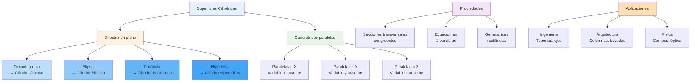

# 🏛️ Superficies Cilíndricas

## 🎯 Fundamentos de las Superficies Cilíndricas

> [!info]- 💡 Introducción a las Superficies Cilíndricas Las **superficies cilíndricas** son superficies generadas por una recta (llamada generatriz) que se mueve paralelamente a sí misma a lo largo de una curva (llamada directriz). Estas superficies tienen la característica especial de que su ecuación en ℝ³ involucra solo dos de las tres coordenadas cartesianas.
> 
> **Analogías útiles:**
> 
> - **Arquitectura:** Columnas y pilares cilíndricos
> - **Ingeniería:** Tuberías y conductos
> - **Naturaleza:** Troncos de árboles, tallos de plantas
> - **Cotidiano:** Latas, tubos, postes
> 
> **Importancia histórica:**
> 
> - **Euclides (300 a.C.):** Estudio de cilindros circulares
> - **Apolonio (200 a.C.):** Secciones cónicas
> - **Descartes (1637):** Ecuaciones algebraicas de superficies
> - **Monge (1795):** Geometría descriptiva y proyecciones

### 📐 Definición Formal

> [!note]- 🌟 Concepto Matemático **Definición:** Una **superficie cilíndrica** es el conjunto de todas las rectas paralelas a una dirección fija que pasan por una curva dada.
> 
> **Componentes:**
> 
> - **Directriz (C):** Curva que determina la forma de la sección transversal
> - **Generatriz (L):** Recta que se mueve paralelamente a una dirección fija
> - **Eje:** Dirección paralela a todas las generatrices
> 
> **Característica algebraica:** Si la directriz está en un plano y las generatrices son paralelas al eje que falta, la ecuación tiene la forma:
> 
> - Eje paralelo a **Z:** f(x, y) = 0
> - Eje paralelo a **Y:** g(x, z) = 0
> - Eje paralelo a **X:** h(y, z) = 0
> 
> **Propiedad fundamental:** La ecuación de una superficie cilíndrica **no contiene** una de las tres variables x, y, o z. Esta variable ausente indica la dirección del eje del cilindro.

### 🔍 Generación de Superficies Cilíndricas

> [!example]- 🎨 Construcción Geométrica **Proceso de generación:**
> 
> 1. **Definir la directriz:** Curva C en un plano (usualmente xy, xz, o yz)
> 2. **Elegir dirección del eje:** Vector director $\vec{v}$ para las generatrices
> 3. **Generar la superficie:** Trasladar la curva C paralelamente a $\vec{v}$
> 
> **Representación paramétrica:** Si C tiene ecuación paramétrica $(x(t), y(t))$ en el plano xy, la superficie cilíndrica con eje paralelo a z es:
> 
> $$\vec{r}(t, s) = (x(t), y(t), s)$$
> 
> donde:
> 
> - $t$ es el parámetro de la curva directriz
> - $s \in \mathbb{R}$ representa el desplazamiento a lo largo del eje
> 
> **Visualización:** Imagina "extruir" o "proyectar" una curva plana infinitamente en una dirección perpendicular al plano que contiene la curva.

## 🔵 Cilindro Circular

### 📏 Definición y Ecuación

> [!success]- 🟢 Cilindro Circular Básico **Definición:** Un **cilindro circular** es una superficie cilíndrica cuya directriz es una circunferencia.
> 
> **Ecuación canónica (eje paralelo a Z):** $$x^2 + y^2 = r^2$$
> 
> donde $r > 0$ es el **radio** del cilindro.
> 
> **Características:**
> 
> - La variable **z no aparece** en la ecuación
> - Todas las secciones perpendiculares al eje z son círculos de radio r
> - Las generatrices son rectas paralelas al eje z
> 
> **Directriz:** Circunferencia $x^2 + y^2 = r^2$ en el plano z = 0
> 
> **Ecuaciones para otros ejes:**
> 
> - **Eje paralelo a Y:** $x^2 + z^2 = r^2$
> - **Eje paralelo a X:** $y^2 + z^2 = r^2$

### 🔄 Cilindros Circulares Trasladados

> [!tip]- 🎯 Cilindros Descentrados **Forma general (eje paralelo a Z):** $$(x - h)^2 + (y - k)^2 = r^2$$
> 
> donde $(h, k)$ es el centro de la circunferencia directriz en el plano xy.
> 
> **Interpretación:**
> 
> - El eje del cilindro pasa por el punto $(h, k, z)$ para cualquier z
> - El eje es la recta: $x = h, y = k$
> 
> **Forma expandida:** $$x^2 + y^2 - 2hx - 2ky + (h^2 + k^2 - r^2) = 0$$
> 
> **Ejemplos:**
> 
> - $(x - 2)^2 + (y + 1)^2 = 9$: Cilindro de radio 3 con eje en x=2, y=-1
> - $x^2 + (y - 3)^2 = 4$: Cilindro de radio 2 con eje en x=0, y=3

### ✅ Ejemplos de Cilindros Circulares

> [!example]- 💪 Casos Prácticos **Ejemplo 1 - Cilindro básico:**
> 
> - Ecuación: $x^2 + y^2 = 16$
> - Radio: $r = 4$
> - Eje: Recta $x = 0, y = 0$ (eje z)
> - Descripción: Cilindro vertical centrado en el origen
> 
> **Ejemplo 2 - Cilindro horizontal:**
> 
> - Ecuación: $y^2 + z^2 = 25$
> - Radio: $r = 5$
> - Eje: Eje x ($y = 0, z = 0$)
> - Descripción: Cilindro horizontal orientado a lo largo del eje x
> 
> **Ejemplo 3 - Cilindro descentrado:**
> 
> - Ecuación: $(x - 3)^2 + z^2 = 1$
> - Radio: $r = 1$
> - Eje: Recta $x = 3, z = 0$ (paralela al eje y)
> - Centro del eje: Punto $(3, y, 0)$ para cualquier y
> 
> **Ejemplo 4 - Identificación:**
> 
> - Ecuación: $x^2 + y^2 - 4x + 6y - 3 = 0$
> - Completar cuadrados:
>     - $(x^2 - 4x + 4) + (y^2 + 6y + 9) = 3 + 4 + 9$
>     - $(x - 2)^2 + (y + 3)^2 = 16$
> - Cilindro de radio 4, eje en $(2, -3, z)$

## 🔶 Cilindro Elíptico

### 📐 Definición y Ecuación

> [!warning]- 🟡 Cilindro con Sección Elíptica **Definición:** Un **cilindro elíptico** es una superficie cilíndrica cuya directriz es una elipse.
> 
> **Ecuación canónica (eje paralelo a Z):** $$\frac{x^2}{a^2} + \frac{y^2}{b^2} = 1$$
> 
> donde $a, b > 0$ son los **semiejes** de la elipse directriz.
> 
> **Características:**
> 
> - Si $a = b$: Se reduce a un cilindro circular de radio $r = a$
> - Si $a > b$: Elipse alargada en dirección x
> - Si $b > a$: Elipse alargada en dirección y
> - La variable z no aparece en la ecuación
> 
> **Directriz:** Elipse $\frac{x^2}{a^2} + \frac{y^2}{b^2} = 1$ en el plano z = 0
> 
> **Ecuaciones para otros ejes:**
> 
> - **Eje paralelo a Y:** $\frac{x^2}{a^2} + \frac{z^2}{c^2} = 1$
> - **Eje paralelo a X:** $\frac{y^2}{b^2} + \frac{z^2}{c^2} = 1$

### 🔄 Propiedades del Cilindro Elíptico

> [!note]- 📋 Características Geométricas **Secciones transversales:**
> 
> - Perpendiculares al eje: Elipses congruentes con semiejes a y b
> - Paralelas al eje: Rectángulos o pares de rectas paralelas
> 
> **Excentricidad:** Para la elipse directriz en el plano xy: $$e = \sqrt{1 - \frac{b^2}{a^2}} \quad \text{(si } a > b\text{)}$$
> 
> **Área de la sección transversal:** $$A = \pi ab$$
> 
> **Relación con el cilindro circular:** El cilindro elíptico es una "deformación" del cilindro circular obtenida al escalar diferentemente en dos direcciones perpendiculares.
> 
> **Simetría:**
> 
> - Simétrico respecto a los planos x=0, y=0
> - Simétrico respecto al eje z

### ✅ Ejemplos de Cilindros Elípticos

> [!example]- 🎨 Aplicaciones **Ejemplo 1 - Cilindro elíptico estándar:**
> 
> - Ecuación: $\frac{x^2}{9} + \frac{y^2}{4} = 1$
> - Semiejes: $a = 3, b = 2$
> - Eje: Paralelo a z
> - Sección en z=5: Elipse con mismos semiejes
> 
> **Ejemplo 2 - Comparación con circular:**
> 
> - Circular: $x^2 + y^2 = 4$
> - Elíptico: $\frac{x^2}{4} + \frac{y^2}{9} = 1$
> - El segundo está "estirado" en dirección y
> 
> **Ejemplo 3 - Eje horizontal:**
> 
> - Ecuación: $\frac{y^2}{16} + \frac{z^2}{1} = 1$
> - Semiejes: $b = 4, c = 1$
> - Eje paralelo a x
> - Elipse muy alargada verticalmente
> 
> **Aplicación arquitectónica:**
> 
> - Bóvedas elípticas en edificios
> - Conductos de ventilación ovalados
> - Columnas decorativas con sección elíptica

## 📊 Cilindro Parabólico

### 📐 Definición y Ecuación

> [!info]- 🔵 Cilindro con Directriz Parabólica **Definición:** Un **cilindro parabólico** es una superficie cilíndrica cuya directriz es una parábola.
> 
> **Ecuación canónica (eje paralelo a Z):** $$y = ax^2$$ o equivalentemente: $$x^2 = \frac{y}{a}$$
> 
> donde $a \neq 0$ es el parámetro que determina la "abertura" de la parábola.
> 
> **Formas alternativas:**
> 
> - **Parábola en dirección y:** $x = ay^2$ o $y^2 = \frac{x}{a}$
> - **Eje paralelo a Y:** $x^2 = az$ o $z = ax^2$
> - **Eje paralelo a X:** $y^2 = az$ o $z = ay^2$
> 
> **Características:**
> 
> - La superficie es **ilimitada** en la dirección de la parábola
> - Todas las secciones perpendiculares al eje son parábolas congruentes
> - No tiene centro de simetría (solo eje y plano de simetría)
> 
> **Directriz:** Parábola $y = ax^2$ en el plano z = 0

### 🔄 Tipos y Orientaciones

> [!tip]- 🎯 Variaciones del Cilindro Parabólico **Según el signo de a:**
> 
> **Caso 1: a > 0**
> 
> - Ecuación: $y = ax^2$
> - Parábola abre hacia y positivo
> - Vértice en el origen del plano xy
> 
> **Caso 2: a < 0**
> 
> - Ecuación: $y = ax^2$ (con a negativo)
> - Parábola abre hacia y negativo
> - Vértice en el origen del plano xy
> 
> **Cilindro parabólico desplazado:**
> 
> - Forma general: $y - k = a(x - h)^2$
> - Vértice de la parábola en $(h, k)$
> - Eje del cilindro pasa por $(h, k, z)$ para todo z
> 
> **Orientaciones principales:**
> 
> |Ecuación|Eje del cilindro|Dirección de apertura|
> |---|---|---|
> |$y = ax^2$|Paralelo a Z|Hacia ±Y|
> |$x = ay^2$|Paralelo a Z|Hacia ±X|
> |$z = ax^2$|Paralelo a Y|Hacia ±Z|
> |$z = ay^2$|Paralelo a X|Hacia ±Z|

### 🔍 Propiedades del Cilindro Parabólico

> [!note]- 📋 Características Especiales **Secciones planas:**
> 
> 1. **Perpendiculares al eje:** Parábolas congruentes
> 2. **Paralelas al eje y perpendiculares al plano de simetría:** Rectas paralelas
> 3. **Paralelas al eje y al plano de simetría:** Parábolas
> 
> **Foco y directriz (en el plano xy para $x^2 = 4py$):**
> 
> - Foco: $(0, p, z)$ para cualquier z
> - Directriz: Plano $y = -p$
> - La definición focal se extiende a todo el cilindro
> 
> **Simetría:**
> 
> - **Plano de simetría:** El plano que contiene el eje y el vértice
> - Para $y = ax^2$: Plano $x = 0$ (plano yz)
> - **No tiene** centro de simetría
> 
> **Curvatura:**
> 
> - La curvatura es constante a lo largo de las generatrices
> - Varía en la dirección perpendicular al eje

### ✅ Ejemplos de Cilindros Parabólicos

> [!example]- 💼 Casos Ilustrativos **Ejemplo 1 - Parábola básica:**
> 
> - Ecuación: $y = x^2$
> - Parámetro: $a = 1$
> - Eje: Paralelo a z
> - Vértice: Línea $x = 0, y = 0$
> - Abre hacia y positivo
> 
> **Ejemplo 2 - Parábola más abierta:**
> 
> - Ecuación: $y = \frac{1}{4}x^2$ o $x^2 = 4y$
> - Parámetro focal: $p = 1$
> - Foco: Línea $(0, 1, z)$
> - Directriz: Plano $y = -1$
> 
> **Ejemplo 3 - Orientación diferente:**
> 
> - Ecuación: $z = 2y^2$
> - Eje: Paralelo a x
> - Sección en x=0: Parábola en plano yz
> - Abre hacia z positivo
> 
> **Ejemplo 4 - Parábola desplazada:**
> 
> - Ecuación: $y - 3 = (x + 1)^2$
> - Vértice de la parábola: $(-1, 3)$
> - Eje del cilindro: Recta $x = -1, y = 3$
> - Expandida: $y = x^2 + 2x + 4$
> 
> **Aplicación en ingeniería:**
> 
> - **Reflectores parabólicos:** Antenas y faros
> - **Canales de flujo:** Diseño hidráulico
> - **Puentes:** Arcos parabólicos extendidos
> - **Arquitectura:** Estructuras de concha parabólica

## 📐 Cilindro Hiperbólico

### 📏 Definición y Ecuación

> [!warning]- 🟠 Cilindro con Directriz Hiperbólica **Definición:** Un **cilindro hiperbólico** es una superficie cilíndrica cuya directriz es una hipérbola.
> 
> **Ecuación canónica (eje paralelo a Z):** $$\frac{x^2}{a^2} - \frac{y^2}{b^2} = 1$$
> 
> donde $a, b > 0$ son constantes que determinan la forma de la hipérbola.
> 
> **Forma alternativa:** $$\frac{y^2}{b^2} - \frac{x^2}{a^2} = 1$$
> 
> (hipérbola con ramas en dirección y)
> 
> **Características:**
> 
> - La superficie consta de **dos ramas** separadas (excepto en el caso degenerado)
> - Tiene **asíntotas cilíndricas:** $\frac{x}{a} \pm \frac{y}{b} = 0$
> - La variable z no aparece en la ecuación
> 
> **Directriz:** Hipérbola $\frac{x^2}{a^2} - \frac{y^2}{b^2} = 1$ en el plano z = 0
> 
> **Ecuaciones para otros ejes:**
> 
> - **Eje paralelo a Y:** $\frac{x^2}{a^2} - \frac{z^2}{c^2} = 1$
> - **Eje paralelo a X:** $\frac{y^2}{b^2} - \frac{z^2}{c^2} = 1$

### 🔄 Estructura del Cilindro Hiperbólico

> [!note]- 📋 Componentes y Propiedades **Ramas:**
> 
> - **Primera rama:** $x \geq a$ (región derecha)
> - **Segunda rama:** $x \leq -a$ (región izquierda)
> - Separadas por la región $-a < x < a$
> 
> **Asíntotas:** Para $\frac{x^2}{a^2} - \frac{y^2}{b^2} = 1$:
> 
> - Planos asintóticos: $\frac{x}{a} + \frac{y}{b} = 0$ y $\frac{x}{a} - \frac{y}{b} = 0$
> - Estos planos contienen las asíntotas de todas las hipérbolas seccionales
> 
> **Excentricidad:** $$e = \sqrt{1 + \frac{b^2}{a^2}}$$
> 
> (Siempre $e > 1$ para una hipérbola)
> 
> **Vértices:**
> 
> - En el plano z=0: $(\pm a, 0, 0)$
> - Esta línea de vértices es paralela al eje z
> 
> **Simetría:**
> 
> - Simétrico respecto a los planos x=0 y y=0
> - Simétrico respecto al eje z

### 🎲 Tipos de Cilindros Hiperbólicos

> [!tip]- 🔀 Variaciones **Cilindro hiperbólico de una hoja:**
> 
> - Ecuación: $\frac{x^2}{a^2} - \frac{y^2}{b^2} = 1$
> - Término positivo en x²
> - Ramas en dirección ±x
> 
> **Cilindro hiperbólico con ramas verticales:**
> 
> - Ecuación: $\frac{y^2}{b^2} - \frac{x^2}{a^2} = 1$
> - Término positivo en y²
> - Ramas en dirección ±y
> 
> **Cilindro hiperbólico equilátero:**
> 
> - Ecuación: $x^2 - y^2 = a^2$
> - Caso especial donde los coeficientes son iguales
> - Asíntotas a 45° respecto a los ejes
> 
> **Pares de planos paralelos (caso degenerado):**
> 
> - Ecuación: $\frac{x^2}{a^2} - \frac{y^2}{b^2} = 0$
> - Se factoriza: $\left(\frac{x}{a} - \frac{y}{b}\right)\left(\frac{x}{a} + \frac{y}{b}\right) = 0$
> - Representa los planos asintóticos

### ✅ Ejemplos de Cilindros Hiperbólicos

> [!example]- 🌉 Aplicaciones y Casos **Ejemplo 1 - Hipérbola estándar:**
> 
> - Ecuación: $\frac{x^2}{9} - \frac{y^2}{4} = 1$
> - Parámetros: $a = 3, b = 2$
> - Vértices: $(\pm 3, 0, z)$
> - Ramas en dirección x
> - Asíntotas: $y = \pm \frac{2}{3}x$
> 
> **Ejemplo 2 - Ramas verticales:**
> 
> - Ecuación: $\frac{y^2}{16} - \frac{x^2}{9} = 1$
> - Parámetros: $b = 4, a = 3$
> - Vértices: $(0, \pm 4, z)$
> - Ramas en dirección y
> - Asíntotas: $y = \pm \frac{4}{3}x$
> 
> **Ejemplo 3 - Hipérbola equilátera:**
> 
> - Ecuación: $x^2 - y^2 = 4$
> - Parámetros: $a = b = 2$
> - Asíntotas: $y = \pm x$
> - Excentricidad: $e = \sqrt{2}$
> 
> **Ejemplo 4 - Identificación:**
> 
> - Ecuación: $4x^2 - 9y^2 = 36$
> - Dividir por 36: $\frac{x^2}{9} - \frac{y^2}{4} = 1$
> - Cilindro hiperbólico con $a = 3, b = 2$
> 
> **Aplicaciones:**
> 
> - **Torres de enfriamiento:** Diseño estructural
> - **Óptica:** Lentes y espejos hiperbólicos
> - **Arquitectura:** Estructuras de doble curvatura
> - **Física:** Trayectorias de partículas bajo ciertas fuerzas

## 🔗 Intersecciones y Secciones Planas

### ✂️ Secciones con Planos Coordenados

> [!info]- 📐 Curvas de Intersección Para determinar la forma de una superficie cilíndrica, es útil analizar sus intersecciones con planos:
> 
> **Intersección con planos perpendiculares al eje:**
> 
> - Si el eje es paralelo a z, intersectar con planos z = k
> - Resultado: Curva directriz trasladada (misma forma)
> 
> **Intersección con planos paralelos al eje:**
> 
> - Pueden ser rectas (generatrices) o curvas
> - Depende de la orientación del plano
> 
> **Tabla de intersecciones típicas:**
> 
> |Cilindro|Plano z=k|Plano x=0|Plano y=0|
> |---|---|---|---|
> |$x^2 + y^2 = r^2$|Círculo|Rectas paralelas|Rectas paralelas|
> |$\frac{x^2}{a^2} + \frac{y^2}{b^2} = 1$|Elipse|Rectas paralelas|Rectas paralelas|
> |$y = ax^2$|Parábola|Rectas paralelas|Parábola|
> |$\frac{x^2}{a^2} - \frac{y^2}{b^2} = 1$|Hipérbola|Rectas paralelas|Hipérbola|

### 🎯 Secciones con Planos Arbitrarios

> [!tip]- 🔪 Curvas de Intersección General **Plano general:** $Ax + By + Cz + D = 0$
> 
> **Casos según orientación:**
> 
> **1. Plano perpendicular al eje:**
> 
> - Ejemplo: Plano $z = k$ con cilindro de eje paralelo a z
> - Intersección: Curva directriz
> 
> **2. Plano paralelo al eje:**
> 
> - Puede contener generatrices
> - Intersección: Pares de rectas o curvas especiales
> 
> **3. Plano oblicuo al eje:**
> 
> - Intersección: Curva de tipo diferente a la directriz
> - Ejemplo: Plano oblicuo cortando cilindro circular → elipse
> 
> **Método de cálculo:**
> 
> 1. Sustituir la ecuación del plano en la ecuación del cilindro
> 2. Resolver para obtener la curva de intersección
> 3. Analizar la forma de la curva resultante

### ✅ Ejemplos de Intersecciones

> [!example]- 🎨 Casos Resueltos **Ejemplo 1 - Cilindro circular con plano vertical:**
> 
> - Cilindro: $x^2 + y^2 = 9$
> - Plano: $x = 2$
> - Sustitución: $4 + y^2 = 9$ → $y^2 = 5$
> - Intersección: Dos rectas paralelas $y = \pm\sqrt{5}$
> 
> **Ejemplo 2 - Cilindro parabólico con plano horizontal:**
> 
> - Cilindro: $y = x^2$
> - Plano: $z = 3$
> - Intersección: Parábola $y = x^2$ en el plano z=3
> 
> **Ejemplo 3 - Cilindro elíptico con plano oblicuo:**
> 
> - Cilindro: $\frac{x^2}{4} + \frac{y^2}{9} = 1$
> - Plano: $z = x + 1$
> - Intersección: Curva espacial (elipse deformada)
> 
> **Ejemplo 4 - Cilindro hiperbólico:**
> 
> - Cilindro: $x^2 - y^2 = 1$
> - Plano: $y = 0$
> - Intersección: Dos rectas $x = \pm 1$ (vértices del cilindro)

## 📊 Tabla Resumen de Cilindros

> [!note]- 📋 Compendio de Superficies Cilíndricas
> 
> |Tipo|Ecuación (eje ∥ Z)|Directriz|Características|
> |---|---|---|---|
> |**Circular**|$x^2 + y^2 = r^2$|Círculo|Radio constante r|
> |**Elíptico**|$\frac{x^2}{a^2} + \frac{y^2}{b^2} = 1$|Elipse|Semiejes a, b|
> |**Parabólico**|$y = ax^2$|Parábola|Abre según signo de a|
> |**Hiperbólico**|$\frac{x^2}{a^2} - \frac{y^2}{b^2} = 1$|Hipérbola|Dos ramas separadas|
> 
> **Leyenda de complejidad:**
> 
> - ⭐ Circular: Forma más simple y simétrica
> - ⭐⭐ Elíptico: Generalización del circular
> - ⭐⭐⭐ Parabólico: Ilimitado en una dirección
> - ⭐⭐⭐⭐ Hiperbólico: Dos componentes conexas

## 🎨 Visualización de Superficies Cilíndricas



## 🔍 Identificación de Superficies Cilíndricas

### 📋 Algoritmo de Identificación

> [!tip]- 🎯 Método Sistemático **Paso 1: Verificar si es cilíndrica**
> 
> - Observar si falta una de las tres variables (x, y, o z)
> - Si falta una variable → es una superficie cilíndrica
> - La variable ausente indica la dirección del eje
> 
> **Paso 2: Identificar el tipo de directriz**
> 
> - Analizar la ecuación en las dos variables presentes
> - Comparar con las formas estándar de cónicas
> 
> **Paso 3: Determinar parámetros**
> 
> - Radio (circular)
> - Semiejes (elíptico)
> - Parámetro de abertura (parabólico)
> - Constantes a, b (hiperbólico)
> 
> **Paso 4: Forma canónica**
> 
> - Completar cuadrados si es necesario
> - Identificar centro o vértice de la directriz
> 
> **Guía rápida de identificación:**
> 
> |Forma en dos variables|Tipo de cilindro|
> |---|---|
> |$x^2 + y^2 = r^2$|Circular|
> |$\frac{x^2}{a^2} + \frac{y^2}{b^2} = 1$|Elíptico|
> |$y = ax^2$ o $x = ay^2$|Parabólico|
> |$\frac{x^2}{a^2} - \frac{y^2}{b^2} = \pm 1$|Hiperbólico|

### 🧩 Ejercicios de Identificación

> [!example]- 💪 Práctica Guiada **Ejercicio 1:**
> 
> - Ecuación: $x^2 + z^2 = 25$
> - Variable ausente: y
> - Tipo: Cilindro circular
> - Eje: Paralelo al eje y
> - Radio: 5
> 
> **Ejercicio 2:**
> 
> - Ecuación: $\frac{x^2}{16} + \frac{z^2}{9} = 1$
> - Variable ausente: y
> - Tipo: Cilindro elíptico
> - Eje: Paralelo al eje y
> - Semiejes: $a = 4, c = 3$
> 
> **Ejercicio 3:**
> 
> - Ecuación: $z = 3x^2$
> - Variable ausente: y
> - Tipo: Cilindro parabólico
> - Eje: Paralelo al eje y
> - Parámetro: $a = 3$
> - Abre hacia z positivo
> 
> **Ejercicio 4:**
> 
> - Ecuación: $9y^2 - 4z^2 = 36$
> - Dividir por 36: $\frac{y^2}{4} - \frac{z^2}{9} = 1$
> - Variable ausente: x
> - Tipo: Cilindro hiperbólico
> - Eje: Paralelo al eje x
> - Parámetros: $b = 2, c = 3$
> 
> **Ejercicio 5:**
> 
> - Ecuación: $x^2 + y^2 - 6x + 8y = 0$
> - Completar cuadrados:
>     - $(x^2 - 6x + 9) + (y^2 + 8y + 16) = 9 + 16$
>     - $(x - 3)^2 + (y + 4)^2 = 25$
> - Tipo: Cilindro circular
> - Centro: $(3, -4)$
> - Radio: 5
> - Eje: Paralelo a z

## 💻 Representación Paramétrica

### 📐 Parametrización General

> [!success]- 🟢 Ecuaciones Paramétricas **Cilindro circular (eje ∥ Z):** $$\vec{r}(u, v) = (r\cos u, r\sin u, v)$$
> 
> donde:
> 
> - $u \in [0, 2\pi]$ (parámetro angular)
> - $v \in \mathbb{R}$ (altura)
> - $r$ es el radio
> 
> **Cilindro elíptico (eje ∥ Z):** $$\vec{r}(u, v) = (a\cos u, b\sin u, v)$$
> 
> donde:
> 
> - $a, b$ son los semiejes
> - $u \in [0, 2\pi]$
> - $v \in \mathbb{R}$
> 
> **Cilindro parabólico (eje ∥ Z):** $$\vec{r}(u, v) = (u, au^2, v)$$
> 
> donde:
> 
> - $u \in \mathbb{R}$ (parámetro de la parábola)
> - $v \in \mathbb{R}$ (altura)
> - $a$ es el parámetro de abertura
> 
> **Cilindro hiperbólico (eje ∥ Z):** Para la rama derecha: $$\vec{r}(u, v) = (a\cosh u, b\sinh u, v)$$
> 
> donde:
> 
> - $u \in \mathbb{R}$
> - $v \in \mathbb{R}$
> - $\cosh, \sinh$ son funciones hiperbólicas

### 🎨 Ventajas de la Parametrización

> [!note]- 📋 Utilidades Computacionales **Ventajas:**
> 
> 1. **Visualización 3D:**
>     - Fácil generación de puntos para graficar
>     - Ideal para software CAD y computación gráfica
> 2. **Cálculo de propiedades:**
>     - Vectores tangentes: $\frac{\partial \vec{r}}{\partial u}, \frac{\partial \vec{r}}{\partial v}$
>     - Vector normal: $\frac{\partial \vec{r}}{\partial u} \times \frac{\partial \vec{r}}{\partial v}$
>     - Área de superficie
> 3. **Integración:**
>     - Integrales de superficie
>     - Flujo de campos vectoriales
> 4. **Animación:**
>     - Interpolación paramétrica
>     - Trayectorias sobre la superficie

### 💻 Implementación en Python

> [!example]- 🐍 Código para Visualización
> 
> ```python
> import numpy as np
> import matplotlib.pyplot as plt
> from mpl_toolkits.mplot3d import Axes3D
> 
> # Cilindro circular
> def cilindro_circular(r, h_min=-5, h_max=5, n=50):
>     """
>     Genera puntos de un cilindro circular
>     r: radio
>     h_min, h_max: rango de altura
>     n: número de puntos
>     """
>     u = np.linspace(0, 2*np.pi, n)
>     v = np.linspace(h_min, h_max, n)
>     U, V = np.meshgrid(u, v)
>     
>     X = r * np.cos(U)
>     Y = r * np.sin(U)
>     Z = V
>     
>     return X, Y, Z
> 
> # Cilindro elíptico
> def cilindro_eliptico(a, b, h_min=-5, h_max=5, n=50):
>     """
>     Genera puntos de un cilindro elíptico
>     a, b: semiejes
>     """
>     u = np.linspace(0, 2*np.pi, n)
>     v = np.linspace(h_min, h_max, n)
>     U, V = np.meshgrid(u, v)
>     
>     X = a * np.cos(U)
>     Y = b * np.sin(U)
>     Z = V
>     
>     return X, Y, Z
> 
> # Cilindro parabólico
> def cilindro_parabolico(a, u_min=-3, u_max=3, v_min=-5, v_max=5, n=50):
>     """
>     Genera puntos de un cilindro parabólico
>     a: parámetro de abertura
>     """
>     u = np.linspace(u_min, u_max, n)
>     v = np.linspace(v_min, v_max, n)
>     U, V = np.meshgrid(u, v)
>     
>     X = U
>     Y = a * U**2
>     Z = V
>     
>     return X, Y, Z
> 
> # Cilindro hiperbólico (rama derecha)
> def cilindro_hiperbolico(a, b, u_min=-2, u_max=2, v_min=-5, v_max=5, n=50):
>     """
>     Genera puntos de un cilindro hiperbólico
>     a, b: parámetros de la hipérbola
>     """
>     u = np.linspace(u_min, u_max, n)
>     v = np.linspace(v_min, v_max, n)
>     U, V = np.meshgrid(u, v)
>     
>     X = a * np.cosh(U)
>     Y = b * np.sinh(U)
>     Z = V
>     
>     return X, Y, Z
> 
> # Visualización
> def visualizar_cilindro(X, Y, Z, titulo):
>     """
>     Visualiza una superficie cilíndrica
>     """
>     fig = plt.figure(figsize=(10, 8))
>     ax = fig.add_subplot(111, projection='3d')
>     
>     ax.plot_surface(X, Y, Z, cmap='viridis', alpha=0.8, 
>                     edgecolor='none')
>     
>     ax.set_xlabel('X')
>     ax.set_ylabel('Y')
>     ax.set_zlabel('Z')
>     ax.set_title(titulo)
>     
>     plt.show()
> 
> # Ejemplo de uso
> if __name__ == "__main__":
>     # Cilindro circular de radio 2
>     X, Y, Z = cilindro_circular(r=2)
>     visualizar_cilindro(X, Y, Z, "Cilindro Circular: x² + y² = 4")
>     
>     # Cilindro elíptico
>     X, Y, Z = cilindro_eliptico(a=3, b=2)
>     visualizar_cilindro(X, Y, Z, "Cilindro Elíptico: x²/9 + y²/4 = 1")
>     
>     # Cilindro parabólico
>     X, Y, Z = cilindro_parabolico(a=0.5)
>     visualizar_cilindro(X, Y, Z, "Cilindro Parabólico: y = 0.5x²")
>     
>     # Cilindro hiperbólico
>     X, Y, Z = cilindro_hiperbolico(a=2, b=1.5)
>     visualizar_cilindro(X, Y, Z, "Cilindro Hiperbólico: x²/4 - y²/2.25 = 1")
> ```

## 🔬 Aplicaciones Avanzadas

### 🏗️ Ingeniería Estructural

> [!warning]- 🏛️ Diseño de Estructuras **Bóvedas cilíndricas:**
> 
> - Estructuras arquitectónicas clásicas
> - Distribución uniforme de cargas
> - Ecuación: Superficie cilíndrica + restricciones de altura
> 
> **Torres de enfriamiento:**
> 
> - Forma hiperbólica de revolución
> - Ventilación natural optimizada
> - Base en cilindros hiperbólicos
> 
> **Tuberías y conductos:**
> 
> - Cilindros circulares y elípticos
> - Cálculo de flujo: Sección transversal constante
> - Diseño de codos y ramificaciones
> 
> **Ejemplo de cálculo:** Para un cilindro circular de radio $r = 0.5$ m:
> 
> - Área de sección: $A = \pi r^2 = 0.785$ m²
> - Perímetro: $P = 2\pi r = 3.14$ m
> - Volumen por metro: $V = \pi r^2 \cdot 1 = 0.785$ m³

### 🌊 Mecánica de Fluidos

> [!info]- 💧 Flujo en Cilindros **Flujo laminar en tuberías:**
> 
> - Perfil de velocidad parabólico
> - Cilindro como superficie de contorno
> - Ecuación de Poiseuille
> 
> **Potencial de flujo:** En coordenadas cilíndricas, el potencial puede expresarse sobre superficies cilíndricas
> 
> **Vórtices:**
> 
> - Líneas de vórtice como ejes de cilindros
> - Superficies cilíndricas como líneas de corriente
> 
> **Aplicación práctica:**
> 
> - Diseño de sistemas de ventilación
> - Aerodinámica de cuerpos cilíndricos
> - Número de Reynolds para flujo alrededor de cilindros

### 🔭 Óptica y Lentes

> [!success]- 🔬 Aplicaciones Ópticas **Lentes cilíndricas:**
> 
> - Corrección de astigmatismo
> - Sección transversal: Curva (circular o no)
> - Enfoque en una dimensión
> 
> **Espejos parabólicos cilíndricos:**
> 
> - Reflectores lineales
> - Concentración de luz en una línea focal
> - Aplicación: Colectores solares
> 
> **Prismas cilíndricos:**
> 
> - Dispersión de luz
> - Espectroscopía
> 
> **Fibras ópticas:**
> 
> - Cilindros circulares de pequeño diámetro
> - Reflexión interna total
> - Transmisión de señales

### 🎮 Computación Gráfica

> [!example]- 💻 Modelado 3D **Modelado de objetos:**
> 
> - Primitivas cilíndricas básicas
> - Extrusión de curvas 2D
> - Operaciones booleanas
> 
> **Detección de colisiones:**
> 
> - Bounding cylinders (cilindros envolventes)
> - Más eficiente que bounding boxes en algunos casos
> - Algoritmos de intersección optimizados
> 
> **Texturizado:**
> 
> - Mapeo UV sobre cilindros
> - Coordenadas cilíndricas naturales
> - Unwrapping de texturas
> 
> **Rendering:**
> 
> - Cálculo de normales: Perpendiculares a generatrices
> - Iluminación: Fórmula de Lambert sobre superficies curvas
> - Sombras proyectadas

## 🧮 Propiedades Geométricas

### 📏 Área de Superficie

> [!note]- 📐 Cálculo de Áreas **Cilindro circular (segmento de altura h):** $$A_{\text{lateral}} = 2\pi rh$$
> 
> **Cilindro elíptico (segmento de altura h):** $$A_{\text{lateral}} = \text{(perímetro de elipse)} \times h$$
> 
> Aproximación de Ramanujan para el perímetro: $$P \approx \pi\left[3(a+b) - \sqrt{(3a+b)(a+3b)}\right]$$
> 
> **Cilindro parabólico (región acotada):** Requiere integral de longitud de arco: $$A = \int_{x_1}^{x_2} \sqrt{1 + (2ax)^2} , dx \cdot h$$
> 
> **Cilindro hiperbólico (una rama, segmento):** También requiere integrales elípticas o aproximaciones numéricas

### 🔄 Vector Normal

> [!tip]- 🎯 Normales a la Superficie Para una superficie cilíndrica parametrizada como $\vec{r}(u, v)$:
> 
> **Vector normal:** $$\vec{n} = \frac{\partial \vec{r}}{\partial u} \times \frac{\partial \vec{r}}{\partial v}$$
> 
> **Cilindro circular $x^2 + y^2 = r^2$:**
> 
> - Vector normal unitario: $\vec{n} = \left(\frac{x}{r}, \frac{y}{r}, 0\right)$
> - Apunta radialmente hacia afuera
> - Independiente de z
> 
> **Propiedad general:** El vector normal a una superficie cilíndrica es **perpendicular** a las generatrices (las rectas paralelas que forman el cilindro)
> 
> **Aplicación:**
> 
> - Cálculo de ángulos de incidencia (óptica)
> - Fuerzas normales (mecánica)
> - Iluminación (computación gráfica)

### 📊 Curvatura

> [!warning]- 🌀 Análisis de Curvatura **Curvatura gaussiana:** Para superficies cilíndricas: $$K = 0$$
> 
> (La curvatura gaussiana es siempre cero porque hay al menos una dirección de curvatura nula: la dirección de las generatrices)
> 
> **Curvatura media:**
> 
> - Cilindro circular: $H = \frac{1}{2r}$
> - Cilindro elíptico: Varía según el punto
> - Cilindro parabólico: Varía según la distancia al vértice
> 
> **Implicación:** Las superficies cilíndricas son **desarrollables**: pueden "desenrollarse" en un plano sin distorsión (como desenrollar un papel enrollado)

## 🎓 Ejercicios Progresivos

> [!example]- 💪 Práctica Graduada **Nivel 1 - Identificación:** 🟢
> 
> 1. **Clasificar superficies:**
>     - a) $x^2 + y^2 = 9$
>     - b) $\frac{x^2}{4} + \frac{z^2}{16} = 1$
>     - c) $z = 2y^2$
>     - d) $y^2 - x^2 = 1$
> 2. **Determinar el eje:**
>     - Para cada ecuación del ejercicio 1, identificar la dirección del eje del cilindro
> 3. **Parámetros básicos:**
>     - Encontrar el radio o semiejes de:
>         - a) $x^2 + z^2 = 49$
>         - b) $\frac{y^2}{25} + \frac{z^2}{9} = 1$
> 4. **Completar cuadrados:**
>     - Llevar a forma canónica: $x^2 + y^2 + 4x - 6y = 12$
> 
> **Nivel 2 - Aplicaciones:** 🟡
> 
> 5. **Intersecciones:**
>     - Cilindro $x^2 + y^2 = 16$ con plano $z = 3$
>     - Cilindro $y = x^2$ con plano $x = 2$
>     - ¿Qué curvas resultan?
> 6. **Secciones:**
>     - Cilindro $\frac{x^2}{9} + \frac{y^2}{4} = 1$ cortado por plano $y = 1$
>     - Describir la curva de intersección
> 7. **Área lateral:**
>     - Calcular el área lateral de un cilindro circular de radio 5 y altura 10
>     - Calcular el área lateral de un segmento del cilindro parabólico $y = x^2$ entre $x = -2$ y $x = 2$, con altura 5
> 8. **Parametrización:**
>     - Escribir ecuaciones paramétricas para:
>         - a) Cilindro circular $x^2 + z^2 = 4$ (eje ∥ Y)
>         - b) Cilindro elíptico $\frac{y^2}{9} + \frac{z^2}{1} = 1$ (eje ∥ X)
> 
> **Nivel 3 - Problemas Complejos:** 🔴
> 
> 9. **Diseño de tubería:**
>     - Una tubería elíptica tiene semiejes 0.4 m y 0.3 m. Si el agua fluye a 2 m/s, calcular el caudal (flujo volumétrico)
>     - Fórmula: $Q = A \cdot v$
> 10. **Intersección de cilindros:**
>     - Encontrar la curva de intersección entre:
>         - $x^2 + y^2 = 4$
>         - $x^2 + z^2 = 4$
>     - ¿Qué forma tiene esta curva?
> 11. **Vector normal:**
>     - Para el cilindro $x^2 + y^2 = 9$, encontrar el vector normal unitario en el punto $(3\cos\theta, 3\sin\theta, z_0)$
>     - Verificar que es perpendicular a las generatrices
> 12. **Problema aplicado:**
>     - Un reflector parabólico cilíndrico tiene ecuación $z = \frac{1}{4}x^2$ (eje ∥ Y). Si la fuente de luz está en la línea focal $(0, y, 1)$, demostrar que los rayos reflejados son paralelos al eje z
>     - Usar la propiedad focal de la parábola

## 🌐 Conexiones Conceptuales

> [!quote]- 🔗 Enlaces con Otros Temas **Prerequisitos:**
> 
> - [[Cónicas en el plano]] - Directrices de los cilindros
> - [[Vectores en ℝ³]] - Generatrices como rectas
> - [[Ecuaciones de rectas]] - Generatrices
> - [[Ecuaciones de planos]] - Intersecciones
> 
> **Relacionado directamente:**
> 
> - [[Superficies cuadráticas]] - Los cilindros son casos especiales
> - [[Superficies de revolución]] - Comparación con superficies rotadas
> - [[Coordenadas cilíndricas]] - Sistema natural para cilindros circulares
> 
> **Aplicaciones avanzadas:**
> 
> - [[Cálculo Vectorial]] - Integrales de superficie
> - [[Ecuaciones Diferenciales]] - Problemas en coordenadas cilíndricas
> - [[Física Matemática]] - Laplaciano en cilindros
> - [[Geometría Diferencial]] - Superficies desarrollables
> 
> **Temas posteriores:**
> 
> - [[Coordenadas cilíndricas y esféricas]] - Sistemas de coordenadas
> - [[Nociones topológicas]] - Conjuntos abiertos y cerrados en cilindros
> - [[Campos Vectoriales]] - Flujo a través de cilindros

## 💡 Consejos de Estudio

> [!tip]- 🧠 Estrategias de Aprendizaje **Para identificar cilindros:**
> 
> 1. **Regla principal:** Buscar la variable ausente
>     - Falta x → eje paralelo a X
>     - Falta y → eje paralelo a Y
>     - Falta z → eje paralelo a Z
> 2. **Identificar la cónica:** Analizar la ecuación en 2D
>     - Suma de cuadrados = constante → Circular o elíptico
>     - Un cuadrado = función lineal → Parabólico
>     - Diferencia de cuadrados = constante → Hiperbólico
> 
> **Nemotecnia CEPI:**
> 
> - **C**ircular: x² + y² = r²
> - **E**líptico: x²/a² + y²/b² = 1
> - **P**arabólico: y = ax²
> - **H**iperbólico: x²/a² - y²/b² = 1
> 
> **Práctica recomendada:**
> 
> - Dibujar las directrices en 2D primero
> - "Extruir" mentalmente en la tercera dirección
> - Usar software 3D (GeoGebra, Desmos 3D, Mathematica)
> - Construir modelos físicos (papel, cartón)
> 
> **Errores comunes a evitar:**
> 
> - ❌ Confundir cilindro con superficie de revolución
> - ❌ Olvidar que los cilindros son ilimitados (no tienen "tapas")
> - ❌ No verificar qué variable falta en la ecuación
> - ❌ Confundir el eje del cilindro con la directriz
> 
> **Verificación de resultados:**
> 
> - Las secciones perpendiculares al eje deben ser congruentes
> - Las generatrices deben ser rectas paralelas
> - La ecuación debe tener solo 2 variables

## 🔬 Propiedades Adicionales

### 🎲 Superficies Regladas

> [!info]- 📐 Cilindros como Superficies Regladas **Definición:** Una superficie **reglada** es aquella que puede generarse por el movimiento de una recta.
> 
> **Los cilindros son superficies regladas especiales:**
> 
> - La recta (generatriz) se mueve manteniéndose paralela a sí misma
> - Todas las generatrices son paralelas entre sí
> 
> **Otras superficies regladas (para comparación):**
> 
> - **Cono:** Generatrices pasan por un punto común (vértice)
> - **Hiperboloide de una hoja:** Generatrices no paralelas
> - **Paraboloide hiperbólico (silla de montar):** Dos familias de generatrices
> 
> **Característica distintiva de cilindros:** Son las únicas superficies regladas donde **todas** las generatrices son paralelas

### 📏 Superficies Desarrollables

> [!success]- 🟢 Propiedad de Desarrollo **Definición:** Una superficie es **desarrollable** si puede "aplanarse" en un plano sin estiramiento ni compresión.
> 
> **Los cilindros son desarrollables:**
> 
> - Pueden "desenrollarse" como una hoja de papel
> - La métrica (distancias) se preserva
> - Los ángulos se preservan
> 
> **Aplicaciones prácticas:**
> 
> - **Fabricación:** Chapa metálica puede doblarse en cilindros
> - **Cartografía:** Proyecciones cilíndricas de la Tierra
> - **Empaque:** Diseño de cajas y contenedores
> - **Arquitectura:** Diseño de bóvedas
> 
> **Propiedad matemática:** La curvatura gaussiana es cero: $K = 0$
> 
> **Desarrollo del cilindro circular:**
> 
> - Un cilindro de radio $r$ y altura $h$
> - Se desarrolla en un rectángulo de dimensiones $2\pi r \times h$

### 🔄 Geodésicas en Cilindros

> [!note]- 🌀 Caminos más Cortos **Geodésica:** Curva de longitud mínima entre dos puntos en una superficie.
> 
> **En cilindros circulares:**
> 
> - Las geodésicas son **hélices** (excepto casos especiales)
> - Ecuación paramétrica de hélice circular: $$\vec{r}(t) = (r\cos t, r\sin t, ct)$$ donde $c$ es una constante (paso de la hélice)
> 
> **Casos especiales:**
> 
> - Si los puntos están en la misma generatriz: geodésica = generatriz (segmento de recta vertical)
> - Si los puntos están en la misma circunferencia horizontal: geodésica = arco de círculo
> 
> **Desarrollo en el plano:** Cuando se "desenrolla" el cilindro, la hélice se convierte en una **línea recta** en el rectángulo desarrollado
> 
> **Aplicación física:**
> 
> - Trayectoria de una partícula sin fricción en un cilindro
> - Cables enrollados en tambores cilíndricos
> - Escaleras de caracol (aproximación)

## 📚 Casos Especiales y Degenerados

### 🔍 Superficies Límite

> [!warning]- ⚠️ Casos Degenerados **1. Pares de planos paralelos:**
> 
> - Ecuación: $x^2 = a^2$ o equivalentemente $(x-a)(x+a) = 0$
> - Representa dos planos: $x = a$ y $x = -a$
> - Se puede ver como "cilindro hiperbólico degenerado"
> 
> **2. Plano doble:**
> 
> - Ecuación: $x^2 = 0$ o $x = 0$
> - Representa un solo plano (con "multiplicidad 2")
> - Límite cuando el radio o parámetro tiende a cero
> 
> **3. Cilindro imaginario:**
> 
> - Ecuación: $x^2 + y^2 = -1$
> - No tiene puntos reales
> - Útil en álgebra abstracta y geometría algebraica
> 
> **4. Recta (cilindro de radio cero):**
> 
> - Límite cuando $r \to 0$ en $x^2 + y^2 = r^2$
> - Representa el eje del cilindro

### 🎯 Cilindros con Secciones Especiales

> [!tip]- 🔧 Variaciones Interesantes **Cilindro con directriz sinusoidal:**
> 
> - Ecuación: $y = A\sin(kx)$ (variable z ausente)
> - No es una cónica, pero sigue siendo cilíndrico
> - Aplicación: Superficies corrugadas
> 
> **Cilindro con directriz exponencial:**
> 
> - Ecuación: $y = e^x$ (variable z ausente)
> - Superficie ilimitada en todas direcciones
> 
> **Cilindro poligonal:**
> 
> - Directriz es un polígono (aproximación discreta)
> - Ejemplo: Prisma regular es un cilindro poligonal
> - Número de caras = número de lados del polígono
> 
> **Cilindro fractal:**
> 
> - Directriz es una curva fractal
> - Dimensión fraccionaria
> - Aplicaciones teóricas en física matemática

## 🔬 Análisis Matemático Avanzado

### 📊 Ecuaciones Diferenciales en Cilindros

> [!info]- 🧮 Problemas de Valor en la Frontera **Ecuación de Laplace en cilindro circular:** En coordenadas cilíndricas $(r, \theta, z)$: $$\nabla^2 u = \frac{1}{r}\frac{\partial}{\partial r}\left(r\frac{\partial u}{\partial r}\right) + \frac{1}{r^2}\frac{\partial^2 u}{\partial \theta^2} + \frac{\partial^2 u}{\partial z^2} = 0$$
> 
> **Condiciones de frontera en cilindro:**
> 
> - En $r = R$ (superficie del cilindro)
> - En $z = 0$ y $z = L$ (extremos del cilindro finito)
> 
> **Solución por separación de variables:** $$u(r, \theta, z) = R(r)\Theta(\theta)Z(z)$$
> 
> **Aplicaciones:**
> 
> - Distribución de temperatura en cilindros
> - Potencial eléctrico
> - Flujo de calor

### 🌊 Campos Vectoriales en Cilindros

> [!success]- 🔄 Análisis Vectorial **Campo vectorial tangente a cilindro circular:** $$\vec{F} = (-y, x, 0)$$
> 
> - Circulación alrededor del eje z
> - Perpendicular al vector normal radial
> 
> **Flujo a través de superficie cilíndrica:** Para un campo $\vec{F}$ y cilindro $x^2 + y^2 = R^2$: $$\Phi = \iint_S \vec{F} \cdot \vec{n} , dS$$
> 
> donde $\vec{n} = \left(\frac{x}{R}, \frac{y}{R}, 0\right)$ es el vector normal unitario
> 
> **Teorema de Stokes en cilindro:** Relaciona la circulación de un campo alrededor del borde con el flujo del rotacional a través de la superficie
> 
> **Ejemplo físico:**
> 
> - Flujo de fluido alrededor de un cilindro
> - Campo magnético generado por corriente en alambre cilíndrico

### 📐 Geometría Diferencial de Cilindros

> [!note]- 📏 Curvaturas y Métricas **Primera forma fundamental:** Para cilindro circular parametrizado: $$ds^2 = R^2 d\theta^2 + dz^2$$
> 
> **Curvaturas principales:**
> 
> - $\kappa_1 = \frac{1}{R}$ (curvatura en dirección circular)
> - $\kappa_2 = 0$ (curvatura en dirección axial)
> 
> **Curvatura gaussiana:** $$K = \kappa_1 \cdot \kappa_2 = 0$$
> 
> **Curvatura media:** $$H = \frac{\kappa_1 + \kappa_2}{2} = \frac{1}{2R}$$
> 
> **Interpretación geométrica:**
> 
> - $K = 0$ implica que la superficie es desarrollable
> - $H \neq 0$ indica que la superficie tiene curvatura extrínseca

## 🎨 Visualización Interactiva

### 💻 Herramientas de Visualización

> [!example]- 🖥️ Software Recomendado **GeoGebra 3D:**
> 
> - Interfaz intuitiva
> - Ecuaciones implícitas y paramétricas
> - Comandos útiles:
>     - `Superficie(x² + y² = 9, z, -5, 5)` para cilindro circular
>     - `Superficie(x/3, y/2, z, 0, 2π, -5, 5)` para cilindro elíptico paramétrico
> 
> **Desmos 3D:**
> 
> - Accesible desde navegador
> - Sintaxis simple
> - Ejemplo: `x^2 + y^2 = 4` automáticamente extiende en z
> 
> **Python (Matplotlib):**
> 
> ```python
> # Ya visto anteriormente en la sección de implementación
> ```
> 
> **Mathematica/Wolfram Alpha:**
> 
> ```mathematica
> Plot3D[{x^2 + y^2 == 9}, {x, -3, 3}, {y, -3, 3}]
> ContourPlot3D[x^2 + y^2 == 9, {x, -3, 3}, {y, -3, 3}, {z, -5, 5}]
> ```
> 
> **Blender (modelado profesional):**
> 
> - Para visualizaciones artísticas
> - Exportación a formatos estándar
> - Renderizado fotorealista

### 🎬 Animaciones Conceptuales

> [!tip]- 🎥 Ideas para Animaciones **Animación 1: Generación del cilindro**
> 
> - Mostrar la directriz en un plano
> - Mover una recta paralela a lo largo de la directriz
> - Trazar la superficie generada
> 
> **Animación 2: Secciones planas**
> 
> - Cilindro fijo
> - Plano que se mueve y rota
> - Resaltar la curva de intersección
> 
> **Animación 3: Transformación entre cilindros**
> 
> - Circular → Elíptico (deformación continua)
> - Elíptico → Parabólico (límite cuando un semieje tiende a infinito)
> 
> **Animación 4: Desarrollo de cilindro**
> 
> - Cilindro que se "desenrolla"
> - Transformación a rectángulo
> - Geodésicas que se convierten en rectas

## 🏆 Problemas Desafiantes

> [!example]- 🎯 Ejercicios Avanzados **Desafío 1 - Optimización:** Un cilindro circular de radio $r$ está inscrito en una esfera de radio $R$. Encontrar el valor de $r$ que maximiza el volumen del cilindro (considerando altura finita).
> 
> **Desafío 2 - Intersección triple:** Encontrar la región del espacio donde se intersectan tres cilindros:
> 
> - $x^2 + y^2 \leq 1$
> - $x^2 + z^2 \leq 1$
> - $y^2 + z^2 \leq 1$
> 
> Calcular el volumen de esta región (conocida como **bicilindro de Steinmetz**).
> 
> **Desafío 3 - Geodésica:** En un cilindro circular de radio $R$, encontrar la ecuación de la geodésica que une los puntos $(R, 0, 0)$ y $(R\cos\alpha, R\sin\alpha, h)$.
> 
> **Desafío 4 - Problema físico:** Un alambre delgado con forma de hélice circular está sobre un cilindro de radio $R$. La hélice tiene ecuación: $$\vec{r}(t) = (R\cos t, R\sin t, ct)$$
> 
> Si una cuenta puede deslizarse sin fricción sobre el alambre bajo la acción de la gravedad, encontrar la trayectoria y el tiempo de descenso entre dos puntos dados.
> 
> **Desafío 5 - Teoría de campos:** Calcular el flujo del campo vectorial $\vec{F} = (x, y, z)$ a través de la superficie del cilindro $x^2 + y^2 = 4$ limitado por $0 \leq z \leq 3$. Verificar el resultado usando el teorema de la divergencia.

## 📖 Resumen Ejecutivo

> [!abstract]- 📝 Síntesis del Capítulo **Conceptos clave:**
> 
> 1. **Definición:** Superficies generadas por rectas paralelas (generatrices) a lo largo de una curva (directriz)
>     
> 2. **Característica algebraica:** Ecuación en solo 2 variables (la tercera está "ausente")
>     
> 3. **Tipos principales:**
>     
>     - Circular: $x^2 + y^2 = r^2$
>     - Elíptico: $\frac{x^2}{a^2} + \frac{y^2}{b^2} = 1$
>     - Parabólico: $y = ax^2$
>     - Hiperbólico: $\frac{x^2}{a^2} - \frac{y^2}{b^2} = 1$
> 4. **Propiedades fundamentales:**
>     
>     - Superficies regladas (generadas por rectas)
>     - Desarrollables (curvatura gaussiana K = 0)
>     - Secciones perpendiculares al eje son congruentes
> 5. **Aplicaciones:**
>     
>     - Ingeniería: Tuberías, estructuras
>     - Óptica: Lentes, espejos
>     - Computación gráfica: Modelado 3D
>     - Física: Coordenadas cilíndricas
> 
> **Fórmulas esenciales:**
> 
> |Concepto|Fórmula|
> |---|---|
> |Identificación|Variable ausente → dirección del eje|
> |Área lateral (circular)|$A = 2\pi rh$|
> |Vector normal (circular)|$\vec{n} = \left(\frac{x}{r}, \frac{y}{r}, 0\right)$|
> |Parametrización (circular)|$\vec{r}(u,v) = (r\cos u, r\sin u, v)$|
> |Curvatura gaussiana|$K = 0$ (todas las superficies cilíndricas)|
> 
> **Método de trabajo:**
> 
> 6. Identificar variable ausente → determinar eje
> 7. Analizar ecuación en 2D → clasificar directriz
> 8. Determinar parámetros (radio, semiejes, etc.)
> 9. Visualizar extrusión en tercera dimensión

## 🔗 Referencias y Lecturas Adicionales

> [!quote]- 📚 Bibliografía Recomendada **Textos fundamentales:**
> 
> - **Thomas, Finney:** "Cálculo: Varias Variables" - Capítulo de superficies
> - **Stewart, James:** "Cálculo de Varias Variables" - Secciones 12.6 y 13.5
> - **Marsden, Tromba:** "Cálculo Vectorial" - Capítulo 7
> 
> **Geometría diferencial:**
> 
> - **Do Carmo, Manfredo:** "Differential Geometry of Curves and Surfaces"
> - **Pressley, Andrew:** "Elementary Differential Geometry"
> 
> **Aplicaciones en ingeniería:**
> 
> - **Beer, Johnston:** "Mecánica Vectorial para Ingenieros" - Análisis estructural
> - **White, Frank:** "Mecánica de Fluidos" - Flujo en tuberías
> 
> **Recursos en línea:**
> 
> - Paul's Online Math Notes (Tutorial de cálculo multivariable)
> - Khan Academy (Superficies en 3D)
> - MIT OpenCourseWare (18.02 Multivariable Calculus)
> - 3Blue1Brown (Visualizaciones conceptuales)
> 
> **Software y herramientas:**
> 
> - GeoGebra 3D: https://www.geogebra.org/3d
> - Desmos 3D Calculator: https://www.desmos.com/3d
> - WolframAlpha: https://www.wolframalpha.com

## 🎯 Autoevaluación

> [!question]- ✅ Preguntas de Verificación **Comprueba tu comprensión:**
> 
> 1. ¿Puedes identificar rápidamente si una ecuación representa un cilindro? ✓
> 2. ¿Entiendes por qué la variable ausente indica el eje del cilindro? ✓
> 3. ¿Puedes diferenciar entre los cuatro tipos principales de cilindros? ✓
> 4. ¿Sabes parametrizar cualquier cilindro dado? ✓
> 5. ¿Comprendes por qué los cilindros tienen curvatura gaussiana cero? ✓
> 
> **Test rápido:**
> 
> - Ecuación $y^2 + z^2 = 16$: ¿Qué tipo? ¿Qué eje?
> - ¿Cuál es el área lateral de un cilindro circular de radio 3 y altura 10?
> - Parametriza el cilindro parabólico $z = x^2$ con eje paralelo a Y
> - ¿Por qué un cilindro puede "desenrollarse" sin distorsión?
> 
> **Proyecto integrador sugerido:** Diseña una estructura arquitectónica que utilice al menos tres tipos diferentes de superficies cilíndricas. Justifica la elección de cada una basándote en propiedades geométricas y estructurales.

---

**Tags:** #geometría-analítica #superficies-cilíndricas #cilindros #cónicas-3d #superficies-regladas #superficies-desarrollables #geometría-3d #cálculo-vectorial #parametrización #coordenadas-cilíndricas #aplicaciones-ingeniería #visualización-3d #university #mathematics #R3
