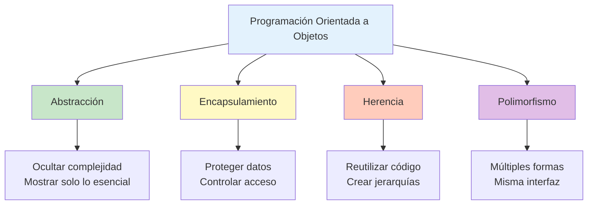

# 🎯 Paradigma Orientado a Objetos

## 🌟 Introducción al Paradigma

> [!info]- 💡 ¿Qué es la Programación Orientada a Objetos? La **Programación Orientada a Objetos (POO)** es un paradigma de programación que organiza el código en torno a "objetos" que representan entidades del mundo real o conceptos abstractos. En lugar de pensar en funciones que operan sobre datos, pensamos en objetos que combinan datos (atributos) y comportamientos (métodos).
> 
> **Analogías útiles:**
> 
> - **Planos y casas:** Una clase es como el plano arquitectónico, los objetos son las casas construidas a partir de ese plano
> - **Molde y galletas:** La clase es el molde, los objetos son las galletas que se producen con ese molde
> - **ADN y organismos:** La clase contiene la "información genética", cada objeto es un organismo único creado a partir de esa información
> 
> **Historia y evolución:**
> 
> - **Simula 67 (1967):** Primer lenguaje con conceptos de POO (clases y objetos)
> - **Smalltalk (1972):** Primer lenguaje completamente orientado a objetos
> - **C++ (1983):** POO en un lenguaje mainstream
> - **Java (1995):** POO pura con gestión automática de memoria
> - **Actualidad:** Python, C#, JavaScript (ES6+), Kotlin, Swift
> 
> **¿Por qué es importante?**
> 
> - Modela mejor el mundo real
> - Código más organizado y mantenible
> - Facilita la reutilización de código
> - Reduce la complejidad en proyectos grandes
> - Base de frameworks modernos (Spring, Android, .NET)

## 🧩 Conceptos Fundamentales

### 🎨 Objeto

> [!success]- 📦 El Concepto Central
> 
> **Definición:** Un **objeto** es una instancia concreta de una clase que tiene:
> 
> - **Estado:** Valores actuales de sus atributos
> - **Identidad:** Referencia única en memoria
> - **Comportamiento:** Acciones que puede realizar (métodos)
> 
> **Características de un objeto:**
> 
> ```
> 1. Identidad única: Cada objeto es distinguible de otros
> 2. Estado interno: Almacena información en atributos
> 3. Comportamiento: Responde a mensajes mediante métodos
> 4. Ciclo de vida: Se crea, existe y se destruye
> ```
> 
> **Ejemplos del mundo real:**
> 
> **Objeto: Mi automóvil**
> 
> ```
> Estado (atributos):
> - Marca: Toyota
> - Modelo: Corolla
> - Color: Rojo
> - Velocidad actual: 0 km/h
> - Encendido: false
> 
> Comportamiento (métodos):
> - encender()
> - acelerar(velocidad)
> - frenar()
> - apagar()
> ```
> 
> **Objeto: Cuenta bancaria**
> 
> ```
> Estado:
> - Número de cuenta: 12345678
> - Titular: "Juan Pérez"
> - Saldo: $1,500.00
> - Tipo: "Ahorros"
> 
> Comportamiento:
> - depositar(monto)
> - retirar(monto)
> - consultarSaldo()
> - transferir(destino, monto)
> ```
> 
> **En Java:**
> 
> ```java
> // Crear objetos
> Automovil miAuto = new Automovil("Toyota", "Corolla", "Rojo");
> CuentaBancaria miCuenta = new CuentaBancaria("Juan Pérez", 1500.0);
> 
> // Usar objetos
> miAuto.encender();
> miAuto.acelerar(60);
> miCuenta.depositar(500.0);
> ```

### 📋 Clase

> [!note]- 🏗️ El Molde de los Objetos
> 
> **Definición:** Una **clase** es una plantilla o molde que define:
> 
> - Qué atributos tendrán los objetos (datos)
> - Qué métodos podrán ejecutar (comportamiento)
> - Cómo se inicializarán (constructores)
> 
> **Anatomía de una clase:**
> 
> ```
> CLASE
> ├── Atributos (variables de instancia)
> ├── Constructores (inicialización)
> ├── Métodos (comportamiento)
> └── Métodos especiales (getters, setters, etc.)
> ```
> 
> **Ejemplo conceptual:**
> 
> ```
> Clase: Estudiante
> ─────────────────
> Atributos:
> - nombre: String
> - edad: int
> - carrera: String
> - promedio: double
> 
> Métodos:
> - inscribirse(curso)
> - tomarExamen(materia)
> - calcularPromedio()
> - graduarse()
> ```
> 
> **En Java:**
> 
> ```java
> public class Estudiante {
>     // Atributos
>     private String nombre;
>     private int edad;
>     private String carrera;
>     private double promedio;
>     
>     // Constructor
>     public Estudiante(String nombre, int edad, String carrera) {
>         this.nombre = nombre;
>         this.edad = edad;
>         this.carrera = carrera;
>         this.promedio = 0.0;
>     }
>     
>     // Métodos
>     public void inscribirse(String curso) {
>         System.out.println(nombre + " se inscribió en " + curso);
>     }
>     
>     public void calcularPromedio(double[] notas) {
>         double suma = 0;
>         for (double nota : notas) {
>             suma += nota;
>         }
>         this.promedio = suma / notas.length;
>     }
> }
> ```
> 
> **Relación clase-objeto:**
> 
> ```
> Clase Estudiante (molde)
>        ↓
> Instanciación (new)
>        ↓
> Objeto estudiante1 → Juan, 20 años, Ingeniería
> Objeto estudiante2 → María, 22 años, Medicina
> Objeto estudiante3 → Carlos, 19 años, Derecho
> ```

### 🔐 Abstracción

> [!tip]- 🎭 Mostrar Solo lo Esencial
> 
> **Definición:** La **abstracción** es el principio de ocultar los detalles complejos de implementación y mostrar solo la funcionalidad esencial al usuario.
> 
> **Concepto clave:** "No necesitas saber cómo funciona un motor para conducir un auto"
> 
> **Niveles de abstracción:**
> 
> ```
> ALTO NIVEL (Usuario)
>    ↓
> carro.encender()  ← Simple para el usuario
>    ↓
> BAJO NIVEL (Implementación)
>    ↓
> - Activar bomba de combustible
> - Iniciar sistema de inyección
> - Generar chispa en bujías
> - Activar motor de arranque
> - Sincronizar pistones
> ... (muchos detalles ocultos)
> ```
> 
> **Ejemplo práctico:**
> 
> ```java
> // ABSTRACCIÓN: Interfaz simple
> public class EmailService {
>     public void enviarEmail(String destinatario, String mensaje) {
>         // El usuario solo llama este método simple
>         conectarServidor();
>         autenticar();
>         formatearMensaje(mensaje);
>         transmitirDatos(destinatario, mensaje);
>         cerrarConexion();
>     }
>     
>     // Detalles de implementación ocultos (privados)
>     private void conectarServidor() { /* ... */ }
>     private void autenticar() { /* ... */ }
>     private void formatearMensaje(String msg) { /* ... */ }
>     private void transmitirDatos(String dest, String msg) { /* ... */ }
>     private void cerrarConexion() { /* ... */ }
> }
> 
> // USO: Simple y abstracto
> EmailService email = new EmailService();
> email.enviarEmail("juan@example.com", "Hola Juan!");
> // El usuario no necesita conocer los 5 pasos internos
> ```
> 
> **Beneficios:**
> 
> - Reduce complejidad
> - Facilita el uso de las clases
> - Permite cambiar implementación sin afectar al usuario
> - Enfoque en QUÉ hace, no en CÓMO lo hace

### 🔒 Encapsulamiento

> [!warning]- 🛡️ Proteger los Datos Internos
> 
> **Definición:** El **encapsulamiento** es el principio de ocultar los datos internos de un objeto y controlar el acceso a ellos mediante métodos públicos.
> 
> **Concepto clave:** "No dejes que modifiquen directamente tus datos, solo a través de métodos controlados"
> 
> **Analogía:**
> 
> ```
> Caja fuerte bancaria:
> - Dinero dentro (atributos privados)
> - Solo se accede con procedimientos específicos (métodos públicos)
> - No puedes meter la mano directamente
> - Hay validaciones y registros
> ```
> 
> **Sin encapsulamiento (❌ MALO):**
> 
> ```java
> public class CuentaBancaria {
>     public double saldo; // ¡Peligro! Acceso directo
> }
> 
> // Cualquiera puede hacer esto:
> CuentaBancaria cuenta = new CuentaBancaria();
> cuenta.saldo = -5000; // ¡Saldo negativo sin control!
> cuenta.saldo = 999999999; // ¡Modificación fraudulenta!
> ```
> 
> **Con encapsulamiento (✅ BUENO):**
> 
> ```java
> public class CuentaBancaria {
>     private double saldo; // Protegido
>     
>     // Método controlado para modificar saldo
>     public void depositar(double monto) {
>         if (monto > 0) {
>             this.saldo += monto;
>             System.out.println("Depósito exitoso: $" + monto);
>         } else {
>             System.out.println("Monto inválido");
>         }
>     }
>     
>     public void retirar(double monto) {
>         if (monto > 0 && monto <= saldo) {
>             this.saldo -= monto;
>             System.out.println("Retiro exitoso: $" + monto);
>         } else {
>             System.out.println("Fondos insuficientes o monto inválido");
>         }
>     }
>     
>     // Solo lectura del saldo
>     public double consultarSaldo() {
>         return this.saldo;
>     }
> }
> 
> // Uso seguro:
> CuentaBancaria cuenta = new CuentaBancaria();
> cuenta.depositar(1000);  // ✓ Controlado
> cuenta.retirar(200);     // ✓ Con validación
> // cuenta.saldo = -5000; // ✗ Error de compilación: saldo es privado
> ```
> 
> **Ventajas:**
> 
> - Protección de datos
> - Validación en cada operación
> - Facilita mantenimiento
> - Control total sobre el estado del objeto

### 🧬 Herencia

> [!success]- 👨‍👩‍👧‍👦 Reutilización y Jerarquía
> 
> **Definición:** La **herencia** permite crear nuevas clases basadas en clases existentes, heredando sus atributos y métodos.
> 
> **Concepto clave:** "Es-un" (is-a relationship)
> 
> ```
> Un Perro ES-UN Animal
> Un Estudiante ES-UNA Persona
> Un Auto ES-UN Vehículo
> ```
> 
> **Jerarquía de clases:**
> 
> ```
>        Animal (Clase padre/superclase)
>        /    \
>       /      \
>    Perro    Gato (Clases hijas/subclases)
>     |         |
>  Labrador  Persa
> ```
> 
> **Ejemplo:**
> 
> ```java
> // Clase padre (superclase)
> public class Animal {
>     protected String nombre;
>     protected int edad;
>     
>     public void comer() {
>         System.out.println(nombre + " está comiendo");
>     }
>     
>     public void dormir() {
>         System.out.println(nombre + " está durmiendo");
>     }
> }
> 
> // Clase hija (subclase) - HEREDA de Animal
> public class Perro extends Animal {
>     private String raza;
>     
>     // Método específico de Perro
>     public void ladrar() {
>         System.out.println(nombre + " dice: ¡Guau guau!");
>     }
>     
>     // Perro hereda: nombre, edad, comer(), dormir()
>     // Y añade: raza, ladrar()
> }
> 
> // Clase hija (subclase) - HEREDA de Animal
> public class Gato extends Animal {
>     private boolean tieneGarras;
>     
>     // Método específico de Gato
>     public void maullar() {
>         System.out.println(nombre + " dice: ¡Miau!");
>     }
> }
> 
> // Uso:
> Perro miPerro = new Perro();
> miPerro.nombre = "Max";
> miPerro.comer();    // ✓ Heredado de Animal
> miPerro.ladrar();   // ✓ Propio de Perro
> 
> Gato miGato = new Gato();
> miGato.nombre = "Luna";
> miGato.dormir();    // ✓ Heredado de Animal
> miGato.maullar();   // ✓ Propio de Gato
> ```
> 
> **Ventajas:**
> 
> - Reutilización de código
> - Organización jerárquica
> - Facilita extensión del sistema
> - Reduce redundancia

### 🎭 Polimorfismo

> [!info]- 🦎 Muchas Formas, Una Interfaz
> 
> **Definición:** El **polimorfismo** permite que objetos de diferentes clases respondan de manera distinta al mismo mensaje/método.
> 
> **Concepto clave:** "Misma interfaz, diferentes implementaciones"
> 
> **Tipos de polimorfismo:**
> 
> **1. Polimorfismo de sobrecarga (Overloading):**
> 
> ```java
> public class Calculadora {
>     // Mismo nombre, diferentes parámetros
>     public int sumar(int a, int b) {
>         return a + b;
>     }
>     
>     public double sumar(double a, double b) {
>         return a + b;
>     }
>     
>     public int sumar(int a, int b, int c) {
>         return a + b + c;
>     }
> }
> ```
> 
> **2. Polimorfismo de sobreescritura (Overriding):**
> 
> ```java
> public class Animal {
>     public void hacerSonido() {
>         System.out.println("El animal hace un sonido");
>     }
> }
> 
> public class Perro extends Animal {
>     @Override
>     public void hacerSonido() {
>         System.out.println("¡Guau guau!");
>     }
> }
> 
> public class Gato extends Animal {
>     @Override
>     public void hacerSonido() {
>         System.out.println("¡Miau!");
>     }
> }
> 
> public class Vaca extends Animal {
>     @Override
>     public void hacerSonido() {
>         System.out.println("¡Muuu!");
>     }
> }
> 
> // USO POLIMÓRFICO:
> Animal[] animales = new Animal[3];
> animales[0] = new Perro();
> animales[1] = new Gato();
> animales[2] = new Vaca();
> 
> for (Animal animal : animales) {
>     animal.hacerSonido(); // ¡Cada uno responde diferente!
> }
> // Salida:
> // ¡Guau guau!
> // ¡Miau!
> // ¡Muuu!
> ```
> 
> **Ventajas:**
> 
> - Flexibilidad en el código
> - Extensibilidad sin modificar código existente
> - Facilita el uso de interfaces y clases abstractas
> - Base de patrones de diseño

## 📊 Los 4 Pilares de la POO



## 🆚 Comparación con Otros Paradigmas

> [!note]- 📋 POO vs Programación Estructurada
> 
> |Aspecto|Programación Estructurada|POO|
> |---|---|---|
> |**Enfoque**|Funciones y procedimientos|Objetos y clases|
> |**Organización**|Por funcionalidad|Por entidades|
> |**Datos**|Separados de funciones|Integrados con métodos|
> |**Reutilización**|Funciones|Clases y herencia|
> |**Modificación**|Puede afectar muchas funciones|Cambios localizados en clases|
> |**Ejemplo**|C, Pascal|Java, C++, Python|
> 
> **Ejemplo comparativo:**
> 
> **Estructurado (C):**
> 
> ```c
> // Datos separados
> struct Rectangulo {
>     float ancho;
>     float alto;
> };
> 
> // Funciones separadas
> float calcularArea(struct Rectangulo r) {
>     return r.ancho * r.alto;
> }
> 
> float calcularPerimetro(struct Rectangulo r) {
>     return 2 * (r.ancho + r.alto);
> }
> ```
> 
> **Orientado a Objetos (Java):**
> 
> ```java
> // Datos y comportamiento juntos
> public class Rectangulo {
>     private float ancho;
>     private float alto;
>     
>     public float calcularArea() {
>         return ancho * alto;
>     }
>     
>     public float calcularPerimetro() {
>         return 2 * (ancho + alto);
>     }
> }
> ```

## ✅ Ventajas de la POO

> [!success]- 🌟 Beneficios del Paradigma
> 
> **1. Modelado natural del mundo real**
> 
> ```
> Problema: Sistema de biblioteca
> POO: Clases Libro, Usuario, Préstamo → Natural e intuitivo
> ```
> 
> **2. Reutilización de código**
> 
> ```
> Creas una clase CuentaBancaria una vez
> → La usas en múltiples proyectos
> → Heredas para crear CuentaAhorros, CuentaCorriente
> ```
> 
> **3. Mantenibilidad**
> 
> ```
> Cambio en clase Empleado → Solo modificas esa clase
> No afecta Cliente, Producto, etc.
> ```
> 
> **4. Escalabilidad**
> 
> ```
> Agregar nueva funcionalidad:
> → Crear nueva clase
> → Heredar de existente
> → No tocar código funcionando
> ```
> 
> **5. Trabajo en equipo**
> 
> ```
> Desarrollador A: Trabaja en clases de Usuario
> Desarrollador B: Trabaja en clases de Producto
> Desarrollador C: Trabaja en clases de Pago
> → Trabajo paralelo sin conflictos
> ```
> 
> **6. Ocultamiento de información**
> 
> ```
> Usuario del código no necesita conocer implementación interna
> Solo usa la interfaz pública
> ```

## ⚠️ Cuándo Usar (y No Usar) POO

> [!warning]- 🎯 Aplicabilidad del Paradigma
> 
> **✅ POO es ideal para:**
> 
> - Sistemas grandes y complejos
> - Aplicaciones con muchas entidades relacionadas
> - Proyectos que evolucionarán con el tiempo
> - Desarrollo en equipo
> - GUIs (interfaces gráficas)
> - Videojuegos
> - Sistemas empresariales
> 
> **❌ POO puede ser excesivo para:**
> 
> - Scripts pequeños y simples
> - Procesamiento de datos matemáticos puros
> - Algoritmos aislados
> - Prototipos rápidos muy simples
> 
> **Ejemplos:**
> 
> ```
> Calculadora científica simple → Funcional/Estructurado
> Sistema de gestión de hospital → POO
> Script de conversión de archivos → Funcional
> Videojuego RPG → POO
> Análisis estadístico básico → Funcional
> Red social → POO
> ```

## 🔗 Conexiones con Otros Temas

> [!quote]- 🌐 Enlaces Conceptuales
> 
> **Siguientes temas en POO:**
> 
> - [[Estructura de Programas Java]] - Sintaxis y elementos básicos
> - [[Definición de Clases]] - Creación práctica de clases
> - [[Encapsulamiento Detallado]] - Modificadores de acceso
> - [[Herencia en Java]] - Implementación práctica
> - [[Polimorfismo en Java]] - Aplicaciones avanzadas
> 
> **Conceptos relacionados:**
> 
> - [[Interfaces]] - Contratos de comportamiento
> - [[Clases Abstractas]] - Plantillas parciales
> - [[Patrones de Diseño]] - Soluciones reutilizables
> - [[SOLID Principles]] - Principios de diseño
> 
> **Aplicaciones prácticas:**
> 
> - [[Desarrollo de APIs]] - Diseño orientado a objetos
> - [[Frameworks]] - Spring, Android, JavaFX
> - [[Arquitectura de Software]] - MVC, MVP, MVVM

---

**Tags:** #poo #programacion-orientada-objetos #paradigmas #java #objetos #clases #abstraccion #encapsulamiento #herencia #polimorfismo #software-engineering #university #computer-science #programming-fundamentals