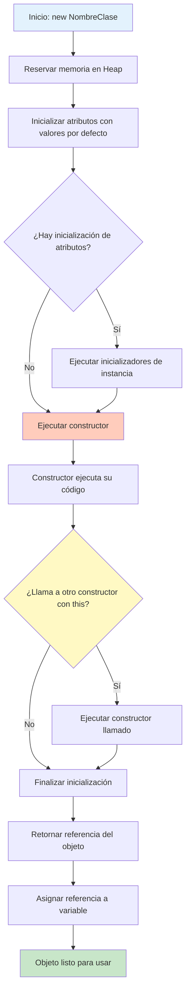
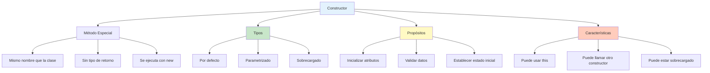

# 📘 Métodos Constructores y Creación de Objetos

## 🎯 Introducción

> [!info]- 💡 ¿Qué es un Constructor? Un **constructor** es un método especial que se ejecuta automáticamente cuando se crea un objeto. Su propósito principal es **inicializar** el estado del objeto, estableciendo valores iniciales para sus atributos.
> 
> **Características fundamentales:**
> 
> - **Nombre idéntico** a la clase
> - **NO tiene tipo de retorno** (ni siquiera void)
> - Se invoca automáticamente con el operador `new`
> - Puede estar sobrecargado (múltiples versiones)
> - Si no se define, Java crea uno por defecto

---

## 🏗️ Sintaxis Básica

### 📋 Estructura de un Constructor

> [!example]- 🔵 Anatomía de un Constructor
> 
> ```java
> public class NombreClase {
>     // Atributos
>     private tipo atributo1;
>     private tipo atributo2;
>     
>     // Constructor
>     public NombreClase(parametros) {
>         // Inicialización de atributos
>         this.atributo1 = valor1;
>         this.atributo2 = valor2;
>     }
> }
> ```
> 
> **Ejemplo concreto:**
> 
> ```java
> public class Estudiante {
>     // Atributos
>     private String nombre;
>     private int edad;
>     private String codigo;
>     
>     // Constructor
>     public Estudiante(String nombre, int edad, String codigo) {
>         //     ↑ Mismo nombre que la clase
>         this.nombre = nombre;
>         this.edad = edad;
>         this.codigo = codigo;
>     }
> }
> ```
> 
> **Diferencias con métodos normales:**
> 
> |Característica|Constructor|Método Normal|
> |---|---|---|
> |Nombre|Igual a la clase|Cualquier nombre válido|
> |Tipo de retorno|NO tiene|Debe especificarse|
> |Cuándo se ejecuta|Al crear objeto (`new`)|Cuando se llama explícitamente|
> |Propósito|Inicializar objeto|Definir comportamiento|

---

## 🎨 Tipos de Constructores

### 1️⃣ Constructor por Defecto

> [!success]- 🟢 Constructor sin Parámetros
> 
> **¿Qué es?**
> 
> - Constructor sin parámetros
> - Si NO defines ningún constructor, Java crea uno automáticamente
> - Inicializa atributos con valores por defecto
> 
> **Valores por defecto automáticos:**
> 
> ```java
> int, short, byte, long → 0
> float, double → 0.0
> boolean → false
> char → '\u0000'
> Referencias (objetos, String) → null
> ```
> 
> **Ejemplo - Java crea constructor implícito:**
> 
> ```java
> public class Persona {
>     private String nombre;
>     private int edad;
>     
>     // Java automáticamente agrega:
>     // public Persona() { }
> }
> 
> // Uso:
> Persona persona = new Persona();  // ✅ Funciona
> System.out.println(persona.nombre);  // null
> System.out.println(persona.edad);    // 0
> ```
> 
> **Ejemplo - Constructor explícito sin parámetros:**
> 
> ```java
> public class Persona {
>     private String nombre;
>     private int edad;
>     
>     // Constructor explícito sin parámetros
>     public Persona() {
>         this.nombre = "Sin nombre";
>         this.edad = 0;
>         System.out.println("Se creó una persona");
>     }
> }
> 
> // Uso:
> Persona persona = new Persona();  // Imprime: "Se creó una persona"
> System.out.println(persona.getNombre());  // "Sin nombre"
> ```
> 
> **⚠️ Importante:**
> 
> ```java
> public class Persona {
>     private String nombre;
>     
>     // Si defines CUALQUIER constructor...
>     public Persona(String nombre) {
>         this.nombre = nombre;
>     }
>     
>     // Java YA NO crea el constructor por defecto
> }
> 
> // ❌ ERROR - No existe constructor sin parámetros
> Persona p = new Persona();  
> 
> // ✅ CORRECTO
> Persona p = new Persona("Ana");
> ```

### 2️⃣ Constructor Parametrizado

> [!info]- 🔵 Constructor con Parámetros
> 
> **Propósito:** Inicializar objetos con valores específicos
> 
> **Ejemplo básico:**
> 
> ```java
> public class Estudiante {
>     private String nombre;
>     private int edad;
>     private double promedio;
>     
>     // Constructor parametrizado
>     public Estudiante(String nombre, int edad, double promedio) {
>         this.nombre = nombre;
>         this.edad = edad;
>         this.promedio = promedio;
>     }
> }
> 
> // Uso:
> Estudiante est1 = new Estudiante("Ana López", 20, 8.5);
> Estudiante est2 = new Estudiante("Juan Pérez", 22, 9.0);
> ```
> 
> **Con validación:**
> 
> ```java
> public class CuentaBancaria {
>     private String titular;
>     private double saldo;
>     private String numeroCuenta;
>     
>     public CuentaBancaria(String titular, String numeroCuenta, double saldoInicial) {
>         this.titular = titular;
>         this.numeroCuenta = numeroCuenta;
>         
>         // Validación
>         if (saldoInicial >= 0) {
>             this.saldo = saldoInicial;
>         } else {
>             this.saldo = 0;
>             System.out.println("Saldo inicial no puede ser negativo. Se establece en 0");
>         }
>     }
> }
> 
> // Uso:
> CuentaBancaria cuenta = new CuentaBancaria("María García", "001-234567", 1000.0);
> ```

### 3️⃣ Sobrecarga de Constructores

> [!note]- 🟡 Múltiples Constructores
> 
> **Definición:** Tener varios constructores con diferentes parámetros
> 
> **Ejemplo completo:**
> 
> ```java
> public class Producto {
>     private String nombre;
>     private double precio;
>     private int stock;
>     private String categoria;
>     
>     // Constructor 1: Sin parámetros
>     public Producto() {
>         this.nombre = "Producto sin nombre";
>         this.precio = 0.0;
>         this.stock = 0;
>         this.categoria = "General";
>     }
>     
>     // Constructor 2: Solo nombre y precio
>     public Producto(String nombre, double precio) {
>         this.nombre = nombre;
>         this.precio = precio;
>         this.stock = 0;
>         this.categoria = "General";
>     }
>     
>     // Constructor 3: Nombre, precio y stock
>     public Producto(String nombre, double precio, int stock) {
>         this.nombre = nombre;
>         this.precio = precio;
>         this.stock = stock;
>         this.categoria = "General";
>     }
>     
>     // Constructor 4: Todos los parámetros
>     public Producto(String nombre, double precio, int stock, String categoria) {
>         this.nombre = nombre;
>         this.precio = precio;
>         this.stock = stock;
>         this.categoria = categoria;
>     }
> }
> 
> // Uso - Java elige el constructor apropiado:
> Producto p1 = new Producto();
> Producto p2 = new Producto("Laptop", 1200.0);
> Producto p3 = new Producto("Mouse", 25.0, 50);
> Producto p4 = new Producto("Teclado", 80.0, 30, "Periféricos");
> ```

---

## 🔗 Constructor Chaining (Encadenamiento)

> [!tip]- 🔄 Llamar a Otro Constructor desde un Constructor
> 
> **Propósito:** Reutilizar código de inicialización usando `this()`
> 
> **Sintaxis:**
> 
> ```java
> public NombreClase(parametros1) {
>     this(parametros2);  // Llama a otro constructor
>     // Código adicional
> }
> ```
> 
> **Ejemplo optimizado:**
> 
> ```java
> public class Producto {
>     private String nombre;
>     private double precio;
>     private int stock;
>     private String categoria;
>     
>     // Constructor completo (el "maestro")
>     public Producto(String nombre, double precio, int stock, String categoria) {
>         this.nombre = nombre;
>         this.precio = precio;
>         this.stock = stock;
>         this.categoria = categoria;
>     }
>     
>     // Constructor que llama al completo con valores por defecto
>     public Producto(String nombre, double precio, int stock) {
>         this(nombre, precio, stock, "General");  // ✅ Reutiliza código
>     }
>     
>     // Constructor que llama al anterior
>     public Producto(String nombre, double precio) {
>         this(nombre, precio, 0);  // ✅ Llama al de 3 parámetros
>     }
>     
>     // Constructor sin parámetros
>     public Producto() {
>         this("Sin nombre", 0.0);  // ✅ Llama al de 2 parámetros
>     }
> }
> ```
> 
> **⚠️ Reglas importantes:**
> 
> ```java
> public Constructor() {
>     this(parametros);  // ✅ DEBE ser la PRIMERA línea
>     // otro código...
> }
> 
> public Constructor() {
>     int x = 5;
>     this(x);  // ❌ ERROR: this() debe ser la primera instrucción
> }
> ```
> 
> **Ventajas del constructor chaining:**
> 
> - ✅ Evita duplicación de código
> - ✅ Facilita mantenimiento
> - ✅ Garantiza inicialización consistente
> - ✅ Hace el código más limpio

---

## 🎭 Creación de Objetos

### 🏭 Proceso de Creación

> [!example]- ⚙️ ¿Qué Sucede al Usar `new`?
> 
> **Sintaxis:**
> 
> ```java
> NombreClase nombreObjeto = new NombreClase(argumentos);
> //     ↑           ↑         ↑         ↑
> //   tipo      variable   operador  constructor
> ```
> 
> **Proceso paso a paso:**
> 
> ```java
> Estudiante estudiante = new Estudiante("Ana", 20);
> ```
> 
> **Lo que hace Java internamente:**
> 
> 1. **Reserva memoria** en el heap para el nuevo objeto
> 2. **Inicializa atributos** con valores por defecto (0, null, false)
> 3. **Ejecuta el constructor** especificado
> 4. **Retorna la referencia** (dirección de memoria) del objeto
> 5. **Asigna la referencia** a la variable
> 
> **Ejemplo detallado:**
> 
> ```java
> public class Coche {
>     private String marca;
>     private String modelo;
>     private int año;
>     
>     public Coche(String marca, String modelo, int año) {
>         System.out.println("1. Constructor iniciando...");
>         this.marca = marca;
>         this.modelo = modelo;
>         this.año = año;
>         System.out.println("2. Objeto inicializado");
>     }
> }
> 
> // Ejecución:
> System.out.println("0. Antes de crear objeto");
> Coche miCoche = new Coche("Toyota", "Corolla", 2023);
> System.out.println("3. Objeto creado y referencia asignada");
> 
> // Salida:
> // 0. Antes de crear objeto
> // 1. Constructor iniciando...
> // 2. Objeto inicializado
> // 3. Objeto creado y referencia asignada
> ```

### 🎯 Formas de Crear Objetos

> [!success]- 📦 Diferentes Maneras
> 
> **1. Forma estándar (más común):**
> 
> ```java
> Estudiante est = new Estudiante("Juan", 22);
> ```
> 
> **2. Declaración e instanciación separadas:**
> 
> ```java
> Estudiante est;           // Solo declaración
> est = new Estudiante("Juan", 22);  // Instanciación después
> ```
> 
> **3. Crear múltiples objetos:**
> 
> ```java
> Estudiante est1 = new Estudiante("Ana", 20);
> Estudiante est2 = new Estudiante("Luis", 21);
> Estudiante est3 = new Estudiante("María", 19);
> ```
> 
> **4. Crear objeto anónimo (sin referencia):**
> 
> ```java
> // Útil para uso inmediato sin guardar referencia
> new Estudiante("Carlos", 23).mostrarInfo();
> 
> // O como argumento de método
> procesarEstudiante(new Estudiante("Ana", 20));
> ```
> 
> **5. Array de objetos:**
> 
> ```java
> // Crear array para 3 estudiantes
> Estudiante[] estudiantes = new Estudiante[3];
> 
> // Instanciar cada objeto
> estudiantes[0] = new Estudiante("Ana", 20);
> estudiantes[1] = new Estudiante("Juan", 22);
> estudiantes[2] = new Estudiante("María", 19);
> ```

---

## 🎯 Ejemplo Completo: Sistema de Biblioteca

> [!example]- 📚 Implementación Práctica
> 
> ```java
> public class Libro {
>     // ATRIBUTOS
>     private String titulo;
>     private String autor;
>     private String isbn;
>     private int añoPublicacion;
>     private boolean disponible;
>     private int numeroPaginas;
>     
>     // CONSTRUCTOR 1: Completo
>     public Libro(String titulo, String autor, String isbn, 
>                  int añoPublicacion, int numeroPaginas) {
>         this.titulo = titulo;
>         this.autor = autor;
>         this.isbn = isbn;
>         this.añoPublicacion = añoPublicacion;
>         this.numeroPaginas = numeroPaginas;
>         this.disponible = true;  // Por defecto disponible
>         System.out.println("✓ Libro registrado: " + titulo);
>     }
>     
>     // CONSTRUCTOR 2: Sin número de páginas
>     public Libro(String titulo, String autor, String isbn, int añoPublicacion) {
>         this(titulo, autor, isbn, añoPublicacion, 0);
>         System.out.println("  (Páginas no especificadas)");
>     }
>     
>     // CONSTRUCTOR 3: Solo información básica
>     public Libro(String titulo, String autor) {
>         this(titulo, autor, "Sin ISBN", 0, 0);
>         System.out.println("  (Información básica)");
>     }
>     
>     // GETTERS
>     public String getTitulo() {
>         return this.titulo;
>     }
>     
>     public String getAutor() {
>         return this.autor;
>     }
>     
>     public boolean isDisponible() {
>         return this.disponible;
>     }
>     
>     // MÉTODOS DE COMPORTAMIENTO
>     public void prestar() {
>         if (this.disponible) {
>             this.disponible = false;
>             System.out.println("✓ Libro prestado: " + this.titulo);
>         } else {
>             System.out.println("✗ Libro no disponible");
>         }
>     }
>     
>     public void devolver() {
>         if (!this.disponible) {
>             this.disponible = true;
>             System.out.println("✓ Libro devuelto: " + this.titulo);
>         } else {
>             System.out.println("✗ El libro ya estaba disponible");
>         }
>     }
>     
>     public void mostrarInfo() {
>         System.out.println("\n=== INFORMACIÓN DEL LIBRO ===");
>         System.out.println("Título: " + this.titulo);
>         System.out.println("Autor: " + this.autor);
>         System.out.println("ISBN: " + this.isbn);
>         System.out.println("Año: " + this.añoPublicacion);
>         System.out.println("Páginas: " + this.numeroPaginas);
>         System.out.println("Estado: " + (this.disponible ? "Disponible" : "Prestado"));
>     }
> }
> 
> // CLASE USUARIO
> public class Usuario {
>     private String nombre;
>     private String id;
>     private int librosPrestados;
>     
>     // Constructor
>     public Usuario(String nombre, String id) {
>         this.nombre = nombre;
>         this.id = id;
>         this.librosPrestados = 0;
>         System.out.println("✓ Usuario registrado: " + nombre);
>     }
>     
>     // Métodos
>     public void tomarPrestado(Libro libro) {
>         if (libro.isDisponible()) {
>             libro.prestar();
>             this.librosPrestados++;
>             System.out.println("  → " + this.nombre + " tomó prestado el libro");
>         } else {
>             System.out.println("  → " + this.nombre + " no pudo tomar el libro");
>         }
>     }
>     
>     public void devolverLibro(Libro libro) {
>         libro.devolver();
>         this.librosPrestados--;
>         System.out.println("  → " + this.nombre + " devolvió el libro");
>     }
>     
>     public void mostrarInfo() {
>         System.out.println("\n=== INFORMACIÓN USUARIO ===");
>         System.out.println("Nombre: " + this.nombre);
>         System.out.println("ID: " + this.id);
>         System.out.println("Libros prestados: " + this.librosPrestados);
>     }
> }
> 
> // PROGRAMA PRINCIPAL
> public class SistemaBiblioteca {
>     public static void main(String[] args) {
>         System.out.println("=== SISTEMA DE BIBLIOTECA ===\n");
>         
>         // Crear libros usando diferentes constructores
>         Libro libro1 = new Libro(
>             "Cien años de soledad",
>             "Gabriel García Márquez",
>             "978-0-06-088328-7",
>             1967,
>             417
>         );
>         
>         Libro libro2 = new Libro(
>             "El principito",
>             "Antoine de Saint-Exupéry",
>             "978-0-15-601219-5",
>             1943
>         );
>         
>         Libro libro3 = new Libro(
>             "Don Quijote",
>             "Miguel de Cervantes"
>         );
>         
>         // Crear usuarios
>         System.out.println();
>         Usuario usuario1 = new Usuario("Ana López", "U001");
>         Usuario usuario2 = new Usuario("Carlos Pérez", "U002");
>         
>         // Realizar operaciones
>         System.out.println("\n--- PRÉSTAMOS ---");
>         usuario1.tomarPrestado(libro1);
>         usuario2.tomarPrestado(libro2);
>         usuario2.tomarPrestado(libro1);  // No disponible
>         
>         System.out.println("\n--- DEVOLUCIONES ---");
>         usuario1.devolverLibro(libro1);
>         usuario2.tomarPrestado(libro1);  // Ahora sí disponible
>         
>         // Mostrar información
>         libro1.mostrarInfo();
>         usuario1.mostrarInfo();
>         usuario2.mostrarInfo();
>     }
> }
> ```

---

## 🔍 Referencias vs Valores Primitivos

> [!warning]- ⚠️ Diferencia Importante
> 
> **Valores primitivos:**
> 
> ```java
> int a = 5;
> int b = a;    // b obtiene una COPIA del valor
> b = 10;
> 
> System.out.println(a);  // 5 (no cambió)
> System.out.println(b);  // 10
> ```
> 
> **Referencias a objetos:**
> 
> ```java
> Estudiante est1 = new Estudiante("Ana", 20);
> Estudiante est2 = est1;  // est2 apunta al MISMO objeto
> 
> est2.setNombre("María");
> 
> System.out.println(est1.getNombre());  // "María" (¡cambió!)
> System.out.println(est2.getNombre());  // "María"
> // est1 y est2 son referencias al mismo objeto en memoria
> ```
> 
> **Visualización:**
> 
> ```
> PRIMITIVOS:
> a [5]    b [10]    ← Valores independientes
> 
> OBJETOS:
> est1 [ref: 0x1A2B] ──┐
>                       ├──→ Objeto Estudiante { nombre: "María", edad: 20 }
> est2 [ref: 0x1A2B] ──┘
> (Ambas referencias apuntan al mismo objeto)
> ```
> 
> **Comparación:**
> 
> ```java
> // Primitivos - compara valores
> int x = 5;
> int y = 5;
> System.out.println(x == y);  // true
> 
> // Objetos - compara referencias
> Estudiante e1 = new Estudiante("Ana", 20);
> Estudiante e2 = new Estudiante("Ana", 20);
> System.out.println(e1 == e2);        // false (diferentes objetos)
> System.out.println(e1.equals(e2));   // Depende de implementación de equals()
> ```

---

## 🎨 Constructor Copy (Constructor Copia)

> [!tip]- 📋 Crear una Copia de un Objeto
> 
> **Propósito:** Crear un nuevo objeto con los mismos valores que otro
> 
> ```java
> public class Estudiante {
>     private String nombre;
>     private int edad;
>     private double promedio;
>     
>     // Constructor normal
>     public Estudiante(String nombre, int edad, double promedio) {
>         this.nombre = nombre;
>         this.edad = edad;
>         this.promedio = promedio;
>     }
>     
>     // Constructor copia
>     public Estudiante(Estudiante otro) {
>         this.nombre = otro.nombre;
>         this.edad = otro.edad;
>         this.promedio = otro.promedio;
>     }
> }
> 
> // Uso:
> Estudiante original = new Estudiante("Ana", 20, 8.5);
> Estudiante copia = new Estudiante(original);  // Nueva instancia
> 
> copia.setNombre("María");
> 
> System.out.println(original.getNombre());  // "Ana" (no cambió)
> System.out.println(copia.getNombre());     // "María"
> ```

---

## 💾 Palabra Clave `null`

> [!info]- ⚪ Referencias Vacías
> 
> **Definición:** `null` indica que una referencia no apunta a ningún objeto
> 
> ```java
> // Declarar sin inicializar
> Estudiante est;  // ⚠️ No inicializada (error si se usa)
> 
> // Inicializar con null
> Estudiante est = null;  // ✅ Referencia vacía válida
> 
> // Intentar usar objeto null
> System.out.println(est.getNombre());  // ❌ NullPointerException
> ```
> 
> **Verificar antes de usar:**
> 
> ```java
> Estudiante est = buscarEstudiante("12345");
> 
> if (est != null) {
>     est.mostrarInfo();  // ✅ Seguro
> } else {
>     System.out.println("Estudiante no encontrado");
> }
> ```
> 
> **Usos comunes de null:**
> 
> ```java
> // Indicar ausencia de valor
> String direccion = null;  // Aún no tiene dirección
> 
> // Liberar referencia
> Estudiante est = new Estudiante("Ana", 20);
> // ... usar est ...
> est = null;  // Permitir que garbage collector libere memoria
> 
> // Valor de retorno cuando no se encuentra algo
> public Estudiante buscarPorCodigo(String codigo) {
>     // buscar...
>     if (!encontrado) {
>         return null;
>     }
>     return estudianteEncontrado;
> }
> ```

---

## ✅ Mejores Prácticas

> [!success]- 🎯 Recomendaciones para Constructores
> 
> **1. Validar parámetros:**
> 
> ```java
> public Estudiante(String nombre, int edad) {
>     if (nombre == null || nombre.trim().isEmpty()) {
>         throw new IllegalArgumentException("Nombre no puede estar vacío");
>     }
>     if (edad < 0 || edad > 120) {
>         throw new IllegalArgumentException("Edad inválida");
>     }
>     this.nombre = nombre;
>     this.edad = edad;
> }
> ```
> 
> **2. Usar constructor chaining:**
> 
> ```java
> // ✅ CORRECTO - Evita duplicación
> public Producto(String nombre, double precio) {
>     this(nombre, precio, 0, "General");
> }
> 
> // ❌ EVITAR - Código duplicado
> public Producto(String nombre, double precio) {
>     this.nombre = nombre;
>     this.precio = precio;
>     this.stock = 0;
>     this.categoria = "General";
> }
> ```
> 
> **3. Inicializar todos los atributos:**
> 
> ```java
> // ✅ CORRECTO
> public Estudiante(String nombre) {
>     this.nombre = nombre;
>     this.edad = 0;              // Valor explícito
>     this.promedio = 0.0;        // Valor explícito
>     this.activo = true;         // Valor explícito
> }
> ```
> 
> **4. Proporcionar constructores adecuados:**
> 
> ```java
> // ✅ Múltiples opciones para crear objetos
> public Estudiante() { }
> public Estudiante(String nombre) { }
> public Estudiante(String nombre, int edad) { }
> ```
> 
> **5. Documentar constructores:**
> 
> ```java
> /**
>  * Crea un nuevo estudiante con información completa
>  * @param nombre Nombre del estudiante (no puede ser null)
>  * @param edad Edad del estudiante (debe ser positiva)
>  * @param promedio Promedio académico (0.0 - 10.0)
>  */
> public Estudiante(String nombre, int edad, double promedio) {
>     // ...
> }
> ```

---

## ⚠️ Errores Comunes

> [!warning]- 🚫 Problemas Frecuentes
> 
> **1. Olvidar que constructor no tiene tipo de retorno:**
> 
> ```java
> // ❌ ERROR - Esto es un método, NO un constructor
> public void Estudiante(String nombre) {
>     this.nombre = nombre;
> }
> 
> // ✅ CORRECTO - Constructor sin tipo de retorno
> public Estudiante(String nombre) {
>     this.nombre = nombre;
> }
> ```
> 
> **2. No usar `this` causa problemas:**
> 
> ```java
> // ❌ PROBLEMA - Variables locales, no asigna a atributos
> public Estudiante(String nombre, int edad) {
>     nombre = nombre;  // Asigna parámetro a sí mismo
>     edad = edad;      // No modifica el atributo
> }
> 
> // ✅ CORRECTO
> public Estudiante(String nombre, int edad) {
>     this.nombre = nombre;
>     this.edad = edad;
> }
> ```
> 
> **3. NullPointerException:**
> 
> ```java
> Estudiante est = null;
> est.mostrarInfo();  // ❌ Crash!
> 
> // ✅ CORRECTO
> if (est != null) {
>     est.mostrarInfo();
> }
> ```
> 
> **4. Confundir declaración con instanciación:**
> 
> ```java
> Estudiante est;  // Solo declaración, no crea objeto
> est.setNombre("Ana");  // ❌ ERROR: est no inicializado
> 
> // ✅ CORRECTO
> Estudiante est = new Estudiante();
> est.setNombre("Ana");
> ```

---

## 🎓 Ejercicios Propuestos

> [!example]- 💪 Práctica
> 
> **Nivel Básico:**
> 
> 1. Crear clase `Rectangulo` con constructores para inicializar base y altura
>     
> 2. Crear clase `Circulo` con constructor que valide radio positivo
>     
> 3. Clase `Persona` con 3 constructores sobrecargados
>
>**Nivel Intermedio:**
>
> 4. Clase `Empleado` con constructor que calcule salario anual automáticamente
> 5. Clase `Fecha` con validación de día, mes y año en el constructor
> 6. Implementar constructor copia para clase `CuentaBancaria`
> 7. Crear clase `Vehiculo` con constructor chaining (3 niveles)
> 
> **Nivel Avanzado:**
> 
> 8. Sistema de `Pedido` y `Producto` con múltiples constructores
> 9. Clase `Matriz` que cree matrices de diferentes tamaños
> 10. Sistema de `Reserva` para hotel con validaciones complejas

---

## 📊 Diagrama de Flujo: Creación de Objetos



---

## 🎯 Ejemplo Avanzado: Sistema de Registro Académico

> [!example]- 🎓 Implementación Completa con Múltiples Clases
> 
> ```java
> // ========================
> // CLASE CURSO
> // ========================
> public class Curso {
>     private String codigo;
>     private String nombre;
>     private int creditos;
>     private String profesor;
>     private int cupoMaximo;
>     private int estudiantesInscritos;
>     
>     // Constructor completo
>     public Curso(String codigo, String nombre, int creditos, 
>                  String profesor, int cupoMaximo) {
>         this.codigo = codigo;
>         this.nombre = nombre;
>         this.creditos = creditos;
>         this.profesor = profesor;
>         this.cupoMaximo = cupoMaximo;
>         this.estudiantesInscritos = 0;
>         System.out.println("✓ Curso creado: " + nombre + " (" + codigo + ")");
>     }
>     
>     // Constructor con cupo por defecto
>     public Curso(String codigo, String nombre, int creditos, String profesor) {
>         this(codigo, nombre, creditos, profesor, 30);
>         System.out.println("  Cupo por defecto: 30 estudiantes");
>     }
>     
>     // Constructor básico
>     public Curso(String codigo, String nombre) {
>         this(codigo, nombre, 3, "Por asignar", 30);
>     }
>     
>     // Getters
>     public String getCodigo() { return this.codigo; }
>     public String getNombre() { return this.nombre; }
>     public int getCreditos() { return this.creditos; }
>     public boolean tieneDisponibilidad() { 
>         return this.estudiantesInscritos < this.cupoMaximo; 
>     }
>     
>     // Métodos
>     public boolean inscribirEstudiante() {
>         if (tieneDisponibilidad()) {
>             this.estudiantesInscritos++;
>             return true;
>         }
>         return false;
>     }
>     
>     public void mostrarInfo() {
>         System.out.println("\n--- CURSO ---");
>         System.out.println("Código: " + this.codigo);
>         System.out.println("Nombre: " + this.nombre);
>         System.out.println("Créditos: " + this.creditos);
>         System.out.println("Profesor: " + this.profesor);
>         System.out.println("Inscritos: " + this.estudiantesInscritos + "/" + this.cupoMaximo);
>     }
> }
> 
> // ========================
> // CLASE CALIFICACION
> // ========================
> public class Calificacion {
>     private Curso curso;
>     private double nota;
>     private String periodo;
>     
>     // Constructor completo
>     public Calificacion(Curso curso, double nota, String periodo) {
>         this.curso = curso;
>         if (nota >= 0 && nota <= 10) {
>             this.nota = nota;
>         } else {
>             this.nota = 0;
>             System.out.println("⚠ Nota inválida, se establece en 0");
>         }
>         this.periodo = periodo;
>     }
>     
>     // Constructor sin periodo
>     public Calificacion(Curso curso, double nota) {
>         this(curso, nota, "Actual");
>     }
>     
>     // Getters
>     public Curso getCurso() { return this.curso; }
>     public double getNota() { return this.nota; }
>     public int getCreditos() { return this.curso.getCreditos(); }
>     
>     // Métodos
>     public boolean aprobo() {
>         return this.nota >= 7.0;
>     }
>     
>     public String obtenerLetra() {
>         if (nota >= 9.0) return "A";
>         if (nota >= 8.0) return "B";
>         if (nota >= 7.0) return "C";
>         if (nota >= 6.0) return "D";
>         return "F";
>     }
>     
>     public void mostrarInfo() {
>         System.out.println("\n  • " + curso.getNombre() + 
>                          " (" + curso.getCodigo() + ")");
>         System.out.printf("    Nota: %.2f [%s] - %s\n", 
>                          nota, obtenerLetra(), 
>                          aprobo() ? "Aprobado" : "Reprobado");
>         System.out.println("    Créditos: " + curso.getCreditos());
>     }
> }
> 
> // ========================
> // CLASE ESTUDIANTE
> // ========================
> public class Estudiante {
>     private String nombre;
>     private String matricula;
>     private String carrera;
>     private Calificacion[] calificaciones;
>     private int numeroCalificaciones;
>     private static final int MAX_CALIFICACIONES = 50;
>     
>     // Constructor completo
>     public Estudiante(String nombre, String matricula, String carrera) {
>         this.nombre = nombre;
>         this.matricula = matricula;
>         this.carrera = carrera;
>         this.calificaciones = new Calificacion[MAX_CALIFICACIONES];
>         this.numeroCalificaciones = 0;
>         System.out.println("✓ Estudiante registrado: " + nombre + 
>                          " [" + matricula + "]");
>     }
>     
>     // Constructor con carrera por defecto
>     public Estudiante(String nombre, String matricula) {
>         this(nombre, matricula, "Ingeniería en Sistemas");
>         System.out.println("  Carrera por defecto asignada");
>     }
>     
>     // Constructor copia
>     public Estudiante(Estudiante otro) {
>         this.nombre = otro.nombre;
>         this.matricula = otro.matricula + "-COPIA";
>         this.carrera = otro.carrera;
>         this.calificaciones = new Calificacion[MAX_CALIFICACIONES];
>         this.numeroCalificaciones = 0;
>         System.out.println("✓ Copia de estudiante creada");
>     }
>     
>     // Getters
>     public String getNombre() { return this.nombre; }
>     public String getMatricula() { return this.matricula; }
>     public String getCarrera() { return this.carrera; }
>     
>     // Métodos
>     public void inscribirCurso(Curso curso, double nota) {
>         if (numeroCalificaciones < MAX_CALIFICACIONES) {
>             if (curso.inscribirEstudiante()) {
>                 Calificacion cal = new Calificacion(curso, nota);
>                 calificaciones[numeroCalificaciones] = cal;
>                 numeroCalificaciones++;
>                 System.out.println("  → " + nombre + " inscrito en " + 
>                                  curso.getNombre());
>             } else {
>                 System.out.println("  ✗ Curso sin cupo disponible");
>             }
>         }
>     }
>     
>     public double calcularPromedio() {
>         if (numeroCalificaciones == 0) return 0.0;
>         
>         double sumaNotas = 0;
>         int totalCreditos = 0;
>         
>         for (int i = 0; i < numeroCalificaciones; i++) {
>             Calificacion cal = calificaciones[i];
>             sumaNotas += cal.getNota() * cal.getCreditos();
>             totalCreditos += cal.getCreditos();
>         }
>         
>         return totalCreditos > 0 ? sumaNotas / totalCreditos : 0.0;
>     }
>     
>     public int calcularCreditosAprobados() {
>         int creditos = 0;
>         for (int i = 0; i < numeroCalificaciones; i++) {
>             if (calificaciones[i].aprobo()) {
>                 creditos += calificaciones[i].getCreditos();
>             }
>         }
>         return creditos;
>     }
>     
>     public void mostrarBoleta() {
>         System.out.println("\n╔══════════════════════════════════════╗");
>         System.out.println("║       BOLETA DE CALIFICACIONES       ║");
>         System.out.println("╚══════════════════════════════════════╝");
>         System.out.println("Estudiante: " + this.nombre);
>         System.out.println("Matrícula: " + this.matricula);
>         System.out.println("Carrera: " + this.carrera);
>         System.out.println("\n--- CALIFICACIONES ---");
>         
>         if (numeroCalificaciones == 0) {
>             System.out.println("  (Sin calificaciones registradas)");
>         } else {
>             for (int i = 0; i < numeroCalificaciones; i++) {
>                 calificaciones[i].mostrarInfo();
>             }
>         }
>         
>         System.out.println("\n--- RESUMEN ---");
>         System.out.printf("Promedio general: %.2f\n", calcularPromedio());
>         System.out.println("Créditos aprobados: " + calcularCreditosAprobados());
>         System.out.println("Total de materias: " + numeroCalificaciones);
>         System.out.println("════════════════════════════════════════\n");
>     }
> }
> 
> // ========================
> // CLASE PRINCIPAL
> // ========================
> public class SistemaAcademico {
>     public static void main(String[] args) {
>         System.out.println("╔════════════════════════════════════════╗");
>         System.out.println("║   SISTEMA DE REGISTRO ACADÉMICO        ║");
>         System.out.println("╚════════════════════════════════════════╝\n");
>         
>         // Crear cursos usando diferentes constructores
>         System.out.println("--- CREANDO CURSOS ---");
>         Curso curso1 = new Curso("MAT101", "Cálculo I", 4, 
>                                  "Dr. García", 25);
>         Curso curso2 = new Curso("FIS101", "Física I", 4, 
>                                  "Dra. Martínez");
>         Curso curso3 = new Curso("PROG101", "Programación I", 5, 
>                                  "Ing. López", 20);
>         Curso curso4 = new Curso("ING101", "Inglés Técnico");
>         
>         // Crear estudiantes
>         System.out.println("\n--- REGISTRANDO ESTUDIANTES ---");
>         Estudiante est1 = new Estudiante("Ana María López", "20230001", 
>                                         "Ingeniería en Sistemas");
>         Estudiante est2 = new Estudiante("Carlos Pérez", "20230002");
>         Estudiante est3 = new Estudiante("María García", "20230003", 
>                                         "Ingeniería Industrial");
>         
>         // Inscribir en cursos
>         System.out.println("\n--- INSCRIPCIONES ---");
>         est1.inscribirCurso(curso1, 8.5);
>         est1.inscribirCurso(curso2, 9.0);
>         est1.inscribirCurso(curso3, 9.5);
>         est1.inscribirCurso(curso4, 8.0);
>         
>         est2.inscribirCurso(curso1, 7.0);
>         est2.inscribirCurso(curso2, 6.5);
>         est2.inscribirCurso(curso3, 8.5);
>         
>         est3.inscribirCurso(curso1, 9.5);
>         est3.inscribirCurso(curso2, 9.0);
>         est3.inscribirCurso(curso4, 10.0);
>         
>         // Mostrar información
>         System.out.println("\n--- INFORMACIÓN DE CURSOS ---");
>         curso1.mostrarInfo();
>         curso3.mostrarInfo();
>         
>         // Mostrar boletas
>         est1.mostrarBoleta();
>         est2.mostrarBoleta();
>         est3.mostrarBoleta();
>         
>         // Crear copia de estudiante
>         System.out.println("\n--- CREANDO COPIA ---");
>         Estudiante estCopia = new Estudiante(est1);
>         System.out.println("Original: " + est1.getMatricula());
>         System.out.println("Copia: " + estCopia.getMatricula());
>         
>         // Comparar promedios
>         System.out.println("\n--- COMPARACIÓN DE PROMEDIOS ---");
>         System.out.printf("%s: %.2f\n", est1.getNombre(), 
>                          est1.calcularPromedio());
>         System.out.printf("%s: %.2f\n", est2.getNombre(), 
>                          est2.calcularPromedio());
>         System.out.printf("%s: %.2f\n", est3.getNombre(), 
>                          est3.calcularPromedio());
>         
>         // Determinar mejor estudiante
>         Estudiante mejor = est1;
>         if (est2.calcularPromedio() > mejor.calcularPromedio()) {
>             mejor = est2;
>         }
>         if (est3.calcularPromedio() > mejor.calcularPromedio()) {
>             mejor = est3;
>         }
>         
>         System.out.println("\n🏆 Mejor promedio: " + mejor.getNombre() + 
>                          " con " + String.format("%.2f", 
>                          mejor.calcularPromedio()));
>     }
> }
> ```

---

## 🎭 Patrones de Diseño con Constructores

> [!tip]- 🏗️ Builder Pattern (Patrón Constructor)
> 
> **Problema:** Muchos parámetros opcionales hacen constructores complejos
> 
> **Solución:** Usar un "builder" para construcción paso a paso
> 
> ```java
> public class Computadora {
>     // Atributos requeridos
>     private String procesador;
>     private int ram;
>     
>     // Atributos opcionales
>     private String tarjetaGrafica;
>     private int almacenamiento;
>     private boolean tieneSSD;
>     private boolean tieneWifi;
>     
>     // Constructor privado (solo Builder puede llamarlo)
>     private Computadora(Builder builder) {
>         this.procesador = builder.procesador;
>         this.ram = builder.ram;
>         this.tarjetaGrafica = builder.tarjetaGrafica;
>         this.almacenamiento = builder.almacenamiento;
>         this.tieneSSD = builder.tieneSSD;
>         this.tieneWifi = builder.tieneWifi;
>     }
>     
>     // Clase Builder interna
>     public static class Builder {
>         // Requeridos
>         private String procesador;
>         private int ram;
>         
>         // Opcionales con valores por defecto
>         private String tarjetaGrafica = "Integrada";
>         private int almacenamiento = 500;
>         private boolean tieneSSD = false;
>         private boolean tieneWifi = true;
>         
>         // Constructor del Builder con parámetros requeridos
>         public Builder(String procesador, int ram) {
>             this.procesador = procesador;
>             this.ram = ram;
>         }
>         
>         // Métodos para configurar opcionales
>         public Builder tarjetaGrafica(String tarjetaGrafica) {
>             this.tarjetaGrafica = tarjetaGrafica;
>             return this;  // Retorna this para encadenar
>         }
>         
>         public Builder almacenamiento(int almacenamiento) {
>             this.almacenamiento = almacenamiento;
>             return this;
>         }
>         
>         public Builder conSSD() {
>             this.tieneSSD = true;
>             return this;
>         }
>         
>         public Builder sinWifi() {
>             this.tieneWifi = false;
>             return this;
>         }
>         
>         // Método build que crea la Computadora
>         public Computadora build() {
>             return new Computadora(this);
>         }
>     }
>     
>     // Método para mostrar información
>     public void mostrarEspecificaciones() {
>         System.out.println("\n=== ESPECIFICACIONES ===");
>         System.out.println("Procesador: " + procesador);
>         System.out.println("RAM: " + ram + "GB");
>         System.out.println("Tarjeta Gráfica: " + tarjetaGrafica);
>         System.out.println("Almacenamiento: " + almacenamiento + "GB");
>         System.out.println("Tipo: " + (tieneSSD ? "SSD" : "HDD"));
>         System.out.println("WiFi: " + (tieneWifi ? "Sí" : "No"));
>     }
> }
> 
> // USO DEL BUILDER:
> public class Main {
>     public static void main(String[] args) {
>         // Computadora básica (solo requeridos)
>         Computadora pc1 = new Computadora.Builder("Intel i5", 8)
>             .build();
>         
>         // Computadora gaming (con opcionales)
>         Computadora pc2 = new Computadora.Builder("Intel i9", 32)
>             .tarjetaGrafica("NVIDIA RTX 4090")
>             .almacenamiento(2000)
>             .conSSD()
>             .build();
>         
>         // Computadora oficina
>         Computadora pc3 = new Computadora.Builder("AMD Ryzen 7", 16)
>             .almacenamiento(1000)
>             .conSSD()
>             .sinWifi()
>             .build();
>         
>         pc1.mostrarEspecificaciones();
>         pc2.mostrarEspecificaciones();
>         pc3.mostrarEspecificaciones();
>     }
> }
> ```

---

## 🔄 Inicialización de Objetos: Orden de Ejecución

> [!info]- 📐 Secuencia de Inicialización
> 
> **Cuando se crea un objeto, Java ejecuta en este orden:**
> 
> ```java
> public class Ejemplo {
>     // 1. Variables de instancia con inicialización
>     private int numero = 10;
>     
>     // 2. Bloques de inicialización de instancia
>     {
>         System.out.println("Bloque de inicialización");
>         numero = 20;
>     }
>     
>     // 3. Constructor
>     public Ejemplo() {
>         System.out.println("Constructor");
>         numero = 30;
>     }
> }
> ```
> 
> **Orden completo:**
> 
> ```java
> public class OrdenInicializacion {
>     // ① Variables static con inicialización
>     private static int estatica = inicializarStatic();
>     
>     // ② Bloque static
>     static {
>         System.out.println("1. Bloque static");
>         estatica = 100;
>     }
>     
>     // ③ Variables de instancia con inicialización
>     private int instancia = inicializarInstancia();
>     
>     // ④ Bloque de inicialización de instancia
>     {
>         System.out.println("3. Bloque de inicialización instancia");
>         instancia = 20;
>     }
>     
>     // ⑤ Constructor
>     public OrdenInicializacion() {
>         System.out.println("4. Constructor");
>         instancia = 30;
>     }
>     
>     private static int inicializarStatic() {
>         System.out.println("0. Inicialización variable static");
>         return 50;
>     }
>     
>     private int inicializarInstancia() {
>         System.out.println("2. Inicialización variable instancia");
>         return 10;
>     }
>     
>     public static void main(String[] args) {
>         System.out.println("--- Creando primer objeto ---");
>         OrdenInicializacion obj1 = new OrdenInicializacion();
>         
>         System.out.println("\n--- Creando segundo objeto ---");
>         OrdenInicializacion obj2 = new OrdenInicializacion();
>     }
> }
> 
> /* SALIDA:
> 0. Inicialización variable static
> 1. Bloque static
> --- Creando primer objeto ---
> 2. Inicialización variable instancia
> 3. Bloque de inicialización instancia
> 4. Constructor
> 
> --- Creando segundo objeto ---
> 5. Inicialización variable instancia
> 6. Bloque de inicialización instancia
> 7. Constructor
> */
> ```

---

## 📚 Resumen Visual



---

## 🔗 Conexión con Próximos Temas

> [!quote]- 🌟 Continuando el Aprendizaje
> 
> **Has aprendido:**
> 
> - ✅ Qué es y para qué sirve un constructor
> - ✅ Tipos de constructores y sobrecarga
> - ✅ Creación de objetos con `new`
> - ✅ Constructor chaining con `this()`
> - ✅ Referencias vs valores primitivos
> 
> **Próximos temas:**
> 
> - **[[Encapsulamiento]]** - Proteger datos con modificadores de acceso
> - **[[Modificador Static]]** - Variables y métodos compartidos
> - **[[Herencia]]** - Constructores en jerarquías de clases
> - **[[Polimorfismo]]** - Creación dinámica de objetos
> - **[[Arrays de Objetos]]** - Colecciones de instancias

---

**Tags:** #java #constructores #objetos #poo #inicializacion #new #this #sobrecarga #builder-pattern #encapsulamiento