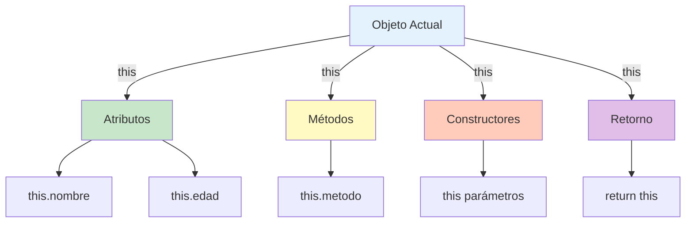

# 🎯 Modificador this en Java

## 🎯 Introducción

> [!info]- 💡 ¿Qué es this? **`this`** es una palabra clave (keyword) que representa una **referencia al objeto actual** sobre el cual se está ejecutando un método. Es como decir "este objeto" o "yo mismo".
> 
> **Características principales:**
> 
> - Es una **referencia implícita** al objeto actual
> - Solo se puede usar en **contexto de instancia** (no en métodos static)
> - Se usa para **diferenciar** atributos de parámetros
> - Permite **llamar constructores** desde otros constructores
> - Facilita **pasar el objeto actual** como parámetro

---

## 📦 Usos Principales de this

### 1️⃣ Diferenciar Atributos de Parámetros

> [!example]- 🟢 Uso Más Común: Resolver Ambigüedad
> 
> **El problema:**
> 
> ```java
> public class Estudiante {
>     private String nombre;
>     private int edad;
>     
>     // ❌ Ambigüedad - ¿cuál es cuál?
>     public void setNombre(String nombre) {
>         nombre = nombre;  // Asigna el parámetro a sí mismo (ERROR)
>     }
> }
> ```
> 
> **La solución con this:**
> 
> ```java
> public class Estudiante {
>     private String nombre;
>     private int edad;
>     
>     // ✅ this.nombre = atributo, nombre = parámetro
>     public void setNombre(String nombre) {
>         this.nombre = nombre;  // Claro y correcto
>     }
>     
>     public void setEdad(int edad) {
>         this.edad = edad;
>     }
> }
> ```
> 
> **Ejemplo completo:**
> 
> ```java
> public class Producto {
>     private String codigo;
>     private String nombre;
>     private double precio;
>     private int stock;
>     
>     // Constructor usando this
>     public Producto(String codigo, String nombre, double precio, int stock) {
>         this.codigo = codigo;
>         this.nombre = nombre;
>         this.precio = precio;
>         this.stock = stock;
>     }
>     
>     // Setters usando this
>     public void setPrecio(double precio) {
>         if (precio >= 0) {
>             this.precio = precio;
>         }
>     }
>     
>     public void setStock(int stock) {
>         if (stock >= 0) {
>             this.stock = stock;
>         }
>     }
> }
> ```
> 
> **Sin this (alternativa poco recomendada):**
> 
> ```java
> public void setNombre(String n) {
>     nombre = n;  // Nombres diferentes, no necesita this
> }
> 
> // ❌ Menos legible y viola convenciones
> ```

### 2️⃣ Llamar a Otro Constructor (Constructor Chaining)

> [!success]- 🔗 this() para Reutilizar Constructores
> 
> **Sintaxis:**
> 
> ```java
> public class NombreClase {
>     public NombreClase() {
>         this(valorPorDefecto);  // Llama a otro constructor
>     }
>     
>     public NombreClase(parametro) {
>         // Código de inicialización
>     }
> }
> ```
> 
> **Ejemplo práctico:**
> 
> ```java
> public class CuentaBancaria {
>     private String titular;
>     private String numeroCuenta;
>     private double saldo;
>     private String tipoCuenta;
>     
>     // Constructor principal (más completo)
>     public CuentaBancaria(String titular, String numeroCuenta, 
>                          double saldo, String tipoCuenta) {
>         this.titular = titular;
>         this.numeroCuenta = numeroCuenta;
>         this.saldo = saldo;
>         this.tipoCuenta = tipoCuenta;
>     }
>     
>     // Constructor con valores por defecto
>     public CuentaBancaria(String titular, String numeroCuenta) {
>         this(titular, numeroCuenta, 0.0, "Ahorros");
>         // Llama al constructor de arriba con valores predeterminados
>     }
>     
>     // Constructor con saldo inicial
>     public CuentaBancaria(String titular, String numeroCuenta, double saldo) {
>         this(titular, numeroCuenta, saldo, "Ahorros");
>     }
>     
>     // Constructor mínimo
>     public CuentaBancaria(String titular) {
>         this(titular, generarNumeroCuenta(), 0.0, "Ahorros");
>     }
>     
>     private static String generarNumeroCuenta() {
>         return "CTA-" + System.currentTimeMillis();
>     }
> }
> ```
> 
> **Uso:**
> 
> ```java
> // Diferentes formas de crear objetos
> CuentaBancaria c1 = new CuentaBancaria("Ana", "001-123", 1000, "Corriente");
> CuentaBancaria c2 = new CuentaBancaria("Luis", "001-124");  // saldo=0, tipo=Ahorros
> CuentaBancaria c3 = new CuentaBancaria("María", "001-125", 500);  // tipo=Ahorros
> CuentaBancaria c4 = new CuentaBancaria("Carlos");  // número auto, saldo=0
> ```
> 
> **⚠️ Reglas importantes:**
> 
> - **`this()`** debe ser la **primera línea** del constructor
> - Solo puedes llamar a **un constructor** (no múltiples)
> - No puedes usar `this()` y `super()` en el mismo constructor
> 
> ```java
> public class Ejemplo {
>     private int x;
>     
>     public Ejemplo() {
>         System.out.println("Iniciando...");  // ❌ ERROR
>         this(10);  // this() debe ser la primera línea
>     }
>     
>     public Ejemplo(int x) {
>         this.x = x;
>     }
> }
> ```

### 3️⃣ Pasar el Objeto Actual como Parámetro

> [!tip]- 🎁 this como Argumento
> 
> **Pasar el objeto actual a otro método:**
> 
> ```java
> public class Estudiante {
>     private String nombre;
>     private double promedio;
>     
>     public Estudiante(String nombre, double promedio) {
>         this.nombre = nombre;
>         this.promedio = promedio;
>     }
>     
>     public void registrarEnSistema() {
>         // Pasar este objeto al sistema
>         SistemaAcademico.registrar(this);
>     }
>     
>     public void mostrarInfo() {
>         System.out.println(nombre + ": " + promedio);
>     }
> }
> 
> class SistemaAcademico {
>     public static void registrar(Estudiante estudiante) {
>         System.out.println("Registrando a: " + estudiante.nombre);
>         // Procesar estudiante...
>     }
> }
> ```
> 
> **Ejemplo con Builder Pattern:**
> 
> ```java
> public class Computadora {
>     private String procesador;
>     private int ram;
>     private int almacenamiento;
>     
>     public Computadora setProcesador(String procesador) {
>         this.procesador = procesador;
>         return this;  // Retorna el objeto actual para encadenar
>     }
>     
>     public Computadora setRam(int ram) {
>         this.ram = ram;
>         return this;
>     }
>     
>     public Computadora setAlmacenamiento(int almacenamiento) {
>         this.almacenamiento = almacenamiento;
>         return this;
>     }
>     
>     public void mostrarEspecificaciones() {
>         System.out.println("Procesador: " + procesador);
>         System.out.println("RAM: " + ram + "GB");
>         System.out.println("Almacenamiento: " + almacenamiento + "GB");
>     }
> }
> 
> // Uso con method chaining
> Computadora pc = new Computadora()
>     .setProcesador("Intel i7")
>     .setRam(16)
>     .setAlmacenamiento(512);
> ```
> 
> **Ejemplo en eventos/listeners:**
> 
> ```java
> public class Boton {
>     private String texto;
>     
>     public Boton(String texto) {
>         this.texto = texto;
>     }
>     
>     public void configurarEvento() {
>         // Pasar este botón como contexto
>         ManejadorEventos.agregar(this);
>     }
> }
> ```

### 4️⃣ Retornar el Objeto Actual

> [!note]- 🔄 return this para Method Chaining
> 
> **Concepto:**
> 
> ```java
> public class Calculadora {
>     private double resultado;
>     
>     public Calculadora sumar(double valor) {
>         this.resultado += valor;
>         return this;  // Retorna el objeto actual
>     }
>     
>     public Calculadora restar(double valor) {
>         this.resultado -= valor;
>         return this;
>     }
>     
>     public Calculadora multiplicar(double valor) {
>         this.resultado *= valor;
>         return this;
>     }
>     
>     public double obtenerResultado() {
>         return resultado;
>     }
> }
> 
> // Uso encadenado
> Calculadora calc = new Calculadora();
> double res = calc.sumar(10).restar(3).multiplicar(2).obtenerResultado();
> // res = 14 (equivalente a: (10 - 3) * 2)
> ```
> 
> **Ejemplo con StringBuilder (API real de Java):**
> 
> ```java
> // Así funciona internamente StringBuilder
> StringBuilder sb = new StringBuilder();
> sb.append("Hola")
>   .append(" ")
>   .append("Mundo")
>   .append("!");
> 
> System.out.println(sb.toString());  // Hola Mundo!
> ```
> 
> **Ejemplo de clase de configuración:**
> 
> ```java
> public class ConfiguracionEmail {
>     private String servidor;
>     private int puerto;
>     private boolean ssl;
>     private String usuario;
>     
>     public ConfiguracionEmail setServidor(String servidor) {
>         this.servidor = servidor;
>         return this;
>     }
>     
>     public ConfiguracionEmail setPuerto(int puerto) {
>         this.puerto = puerto;
>         return this;
>     }
>     
>     public ConfiguracionEmail habilitarSSL(boolean ssl) {
>         this.ssl = ssl;
>         return this;
>     }
>     
>     public ConfiguracionEmail setUsuario(String usuario) {
>         this.usuario = usuario;
>         return this;
>     }
>     
>     public void conectar() {
>         System.out.println("Conectando a " + servidor + ":" + puerto);
>     }
> }
> 
> // Uso fluido
> ConfiguracionEmail config = new ConfiguracionEmail()
>     .setServidor("smtp.gmail.com")
>     .setPuerto(587)
>     .habilitarSSL(true)
>     .setUsuario("usuario@gmail.com");
> 
> config.conectar();
> ```

### 5️⃣ Acceder a Métodos de la Instancia

> [!example]- 🔵 this para Claridad (Opcional)
> 
> **Llamar métodos de la misma clase:**
> 
> ```java
> public class Rectangulo {
>     private double base;
>     private double altura;
>     
>     public Rectangulo(double base, double altura) {
>         this.base = base;
>         this.altura = altura;
>     }
>     
>     public double getArea() {
>         return base * altura;
>     }
>     
>     public double getPerimetro() {
>         return 2 * (base + altura);
>     }
>     
>     public void mostrarDatos() {
>         // Opcional: usar this para claridad
>         System.out.println("Base: " + this.base);
>         System.out.println("Altura: " + this.altura);
>         System.out.println("Área: " + this.getArea());
>         System.out.println("Perímetro: " + this.getPerimetro());
>         
>         // Equivalente sin this (también válido)
>         // System.out.println("Área: " + getArea());
>     }
> }
> ```
> 
> **En métodos que llaman a otros métodos:**
> 
> ```java
> public class Validador {
>     private String valor;
>     
>     public boolean esValido() {
>         return this.noEsNulo() && this.tieneFormatoCorrecto();
>     }
>     
>     private boolean noEsNulo() {
>         return this.valor != null && !this.valor.isEmpty();
>     }
>     
>     private boolean tieneFormatoCorrecto() {
>         return this.valor.matches("[A-Za-z]+");
>     }
> }
> ```

---

## ⚠️ Restricciones de this

> [!warning]- 🚫 Dónde NO se Puede Usar this
> 
> **1. En métodos static:**
> 
> ```java
> public class Ejemplo {
>     private int valor;
>     private static int contador;
>     
>     // ❌ ERROR: No se puede usar this en contexto static
>     public static void metodoEstatico() {
>         this.valor = 10;  // COMPILACIÓN ERROR
>         // No hay "objeto actual" en métodos static
>     }
>     
>     // ✅ CORRECTO: this solo en métodos de instancia
>     public void metodoInstancia() {
>         this.valor = 10;  // OK
>     }
> }
> ```
> 
> **2. En variables static:**
> 
> ```java
> public class Contador {
>     private static int total = this.obtenerValorInicial();  // ❌ ERROR
>     
>     private int obtenerValorInicial() {
>         return 0;
>     }
> }
> ```
> 
> **3. Antes de llamar super() en subclases:**
> 
> ```java
> public class Hijo extends Padre {
>     private int x;
>     
>     public Hijo() {
>         this.x = 10;  // ❌ ERROR: debe llamar super() primero
>         super();
>     }
>     
>     // ✅ CORRECTO
>     public Hijo() {
>         super();      // Primero super()
>         this.x = 10;  // Luego this
>     }
> }
> ```

---

## 🎨 Ejemplos Completos

> [!example]- 📋 Ejemplo 1: Clase con Todos los Usos de this
> 
> ```java
> public class Empleado {
>     // Atributos
>     private String nombre;
>     private String apellido;
>     private double salario;
>     private String departamento;
>     
>     // Constructor 1: Completo
>     public Empleado(String nombre, String apellido, 
>                    double salario, String departamento) {
>         this.nombre = nombre;           // (1) Diferenciar atributo de parámetro
>         this.apellido = apellido;
>         this.salario = salario;
>         this.departamento = departamento;
>     }
>     
>     // Constructor 2: Con valores por defecto
>     public Empleado(String nombre, String apellido) {
>         this(nombre, apellido, 0.0, "Sin asignar");  // (2) Llamar otro constructor
>     }
>     
>     // Constructor 3: Solo nombre
>     public Empleado(String nombre) {
>         this(nombre, "");  // (2) Encadenamiento de constructores
>     }
>     
>     // Getters
>     public String getNombre() {
>         return this.nombre;  // (5) Acceso explícito (opcional)
>     }
>     
>     public String getApellido() {
>         return apellido;  // Sin this también funciona
>     }
>     
>     public String getNombreCompleto() {
>         return this.nombre + " " + this.apellido;  // (5) Claridad
>     }
>     
>     // Setters con validación
>     public void setSalario(double salario) {
>         if (salario >= 0) {
>             this.salario = salario;  // (1) Diferenciar
>         } else {
>             System.out.println("Salario no puede ser negativo");
>         }
>     }
>     
>     // Method chaining
>     public Empleado setDepartamento(String departamento) {
>         this.departamento = departamento;
>         return this;  // (4) Retornar objeto actual
>     }
>     
>     public Empleado setNombre(String nombre) {
>         this.nombre = nombre;
>         return this;  // (4) Para encadenar
>     }
>     
>     // Método que usa this como parámetro
>     public void registrarEnSistema() {
>         SistemaRRHH.agregar(this);  // (3) Pasar objeto actual
>     }
>     
>     // Método que llama a otros métodos
>     public void mostrarInfo() {
>         System.out.println("Nombre: " + this.getNombreCompleto());  // (5)
>         System.out.println("Salario: $" + this.salario);
>         System.out.println("Departamento: " + this.departamento);
>     }
>     
>     // Método de comparación
>     public boolean ganaIgualQue(Empleado otro) {
>         return this.salario == otro.salario;
>     }
>     
>     public boolean ganaMasQue(Empleado otro) {
>         return this.salario > otro.salario;
>     }
> }
> 
> // Clase auxiliar
> class SistemaRRHH {
>     public static void agregar(Empleado emp) {
>         System.out.println("Registrando: " + emp.getNombreCompleto());
>     }
> }
> ```
> 
> **Uso:**
> 
> ```java
> public class Main {
>     public static void main(String[] args) {
>         // Usando diferentes constructores
>         Empleado e1 = new Empleado("Ana", "García", 50000, "IT");
>         Empleado e2 = new Empleado("Luis", "Pérez");
>         Empleado e3 = new Empleado("María");
>         
>         // Method chaining
>         e3.setNombre("María José")
>            .setDepartamento("Ventas");
>         
>         // Registrar en sistema (usa this como parámetro)
>         e1.registrarEnSistema();
>         
>         // Comparaciones
>         if (e1.ganaMasQue(e2)) {
>             System.out.println(e1.getNombreCompleto() + " gana más");
>         }
>         
>         // Mostrar información
>         e1.mostrarInfo();
>     }
> }
> ```

> [!example]- 🟡 Ejemplo 2: Builder Pattern con this
> 
> ```java
> public class Pizza {
>     // Atributos
>     private String tamaño;
>     private boolean queso;
>     private boolean pepperoni;
>     private boolean champiñones;
>     private boolean aceitunas;
>     
>     // Constructor privado
>     private Pizza(Builder builder) {
>         this.tamaño = builder.tamaño;
>         this.queso = builder.queso;
>         this.pepperoni = builder.pepperoni;
>         this.champiñones = builder.champiñones;
>         this.aceitunas = builder.aceitunas;
>     }
>     
>     // Clase Builder interna
>     public static class Builder {
>         private String tamaño;
>         private boolean queso = false;
>         private boolean pepperoni = false;
>         private boolean champiñones = false;
>         private boolean aceitunas = false;
>         
>         public Builder(String tamaño) {
>             this.tamaño = tamaño;
>         }
>         
>         public Builder conQueso() {
>             this.queso = true;
>             return this;  // Retorna Builder para encadenar
>         }
>         
>         public Builder conPepperoni() {
>             this.pepperoni = true;
>             return this;
>         }
>         
>         public Builder conChampiñones() {
>             this.champiñones = true;
>             return this;
>         }
>         
>         public Builder conAceitunas() {
>             this.aceitunas = true;
>             return this;
>         }
>         
>         public Pizza build() {
>             return new Pizza(this);  // Pasar Builder como parámetro
>         }
>     }
>     
>     @Override
>     public String toString() {
>         return "Pizza " + tamaño + 
>                (queso ? " + queso" : "") +
>                (pepperoni ? " + pepperoni" : "") +
>                (champiñones ? " + champiñones" : "") +
>                (aceitunas ? " + aceitunas" : "");
>     }
> }
> 
> // Uso
> Pizza miPizza = new Pizza.Builder("Grande")
>     .conQueso()
>     .conPepperoni()
>     .conChampiñones()
>     .build();
> 
> System.out.println(miPizza);
> // Salida: Pizza Grande + queso + pepperoni + champiñones
> ```

---

## 🔍 this vs super

> [!note]- ⚖️ Comparación
> 
> |Aspecto|**this**|**super**|
> |---|---|---|
> |**Referencia**|Objeto actual|Clase padre|
> |**Atributos**|`this.atributo`|`super.atributo`|
> |**Métodos**|`this.metodo()`|`super.metodo()`|
> |**Constructores**|`this(...)`|`super(...)`|
> |**Contexto**|Misma clase|Herencia|
> 
> **Ejemplo combinado:**
> 
> ```java
> class Animal {
>     protected String nombre;
>     
>     public Animal(String nombre) {
>         this.nombre = nombre;
>     }
>     
>     public void hacerSonido() {
>         System.out.println("Sonido genérico");
>     }
> }
> 
> class Perro extends Animal {
>     private String raza;
>     
>     public Perro(String nombre, String raza) {
>         super(nombre);  // Llama constructor del padre
>         this.raza = raza;  // Atributo de esta clase
>     }
>     
>     @Override
>     public void hacerSonido() {
>         super.hacerSonido();  // Llama método del padre
>         System.out.println("Guau guau");  // Añade comportamiento propio
>     }
>     
>     public void mostrarInfo() {
>         System.out.println("Nombre: " + this.nombre);  // Atributo heredado
>         System.out.println("Raza: " + this.raza);      // Atributo propio
>         this.hacerSonido();  // Método de esta clase
>     }
> }
> ```

---

## ✅ Cuándo Usar this

> [!tip]- 📌 Guía de Decisión
> 
> **✅ SIEMPRE usa this cuando:**
> 
> 1. El parámetro tiene el mismo nombre que el atributo
> 2. Llamas a otro constructor (`this()`)
> 3. Retornas el objeto actual para method chaining
> 4. Pasas el objeto como parámetro a otro método
> 
> **🤔 OPCIONAL (pero recomendado para claridad):** 5. Al acceder a atributos en métodos de instancia 6. Al llamar métodos de la misma clase
> 
> **❌ NUNCA uses this cuando:** 7. Estás en un método o contexto `static` 8. No aporta claridad y el código es obvio
> 
> **Ejemplo de buenas prácticas:**
> 
> ```java
> public class Persona {
>     private String nombre;
>     private int edad;
>     
>     // ✅ this necesario (ambigüedad)
>     public Persona(String nombre, int edad) {
>         this.nombre = nombre;
>         this.edad = edad;
>     }
>     
>     // ✅ this necesario (constructor chaining)
>     public Persona(String nombre) {
>         this(nombre, 0);
>     }
>     
>     // ✅ this recomendado (claridad)
>     public String getNombre() {
>         return this.nombre;
>     }
>     
>     // ✅ this necesario (method chaining)
>     public Persona setNombre(String nombre) {
>         this.nombre = nombre;
>         return this;
>     }
>     
>     // 🤔 this opcional (sin parámetros con mismo nombre)
>     public void mostrarInfo() {
>         System.out.println(nombre);  // OK sin this
>         System.out.println(this.nombre);  // OK con this (más explícito)
>     }
>     
>     // ❌ this no permitido
>     public static void metodoEstatico() {
>         // this.nombre; // ERROR DE COMPILACIÓN
>     }
> }
> ```

---

## 📊 Diagrama Visual



---

## 🎓 Mejores Prácticas

> [!tip]- ⭐ Recomendaciones Profesionales
> 
> **1. Consistencia en el código:**
> 
> ```java
> // ✅ Consistente - siempre usa this en setters
> public void setNombre(String nombre) {
>     this.nombre = nombre;
> }
> 
> public void setEdad(int edad) {
>     this.edad = edad;
> }
> ```
> 
> **2. Evita confusión con nombres:**
> 
> ```java
> // ❌ Confuso
> public void set(String n) {
>     nombre = n;
> }
> 
> // ✅ Claro con this
> public void setNombre(String nombre) {
>     this.nombre = nombre;
> }
> ```
> 
> **3. Constructor chaining ordenado:**
> 
> ```java
> // ✅ Del más específico al más general
> public Empleado(String n, String a, double s, String d) {
>     // Constructor principal
> }
> 
> public Empleado(String n, String a, double s) {
>     this(n, a, s, "General");
> }
> 
> public Empleado(String n, String a) {
>     this(n, a, 0.0);
> }
> ```
> 
> **4. Method chaining significativo:**
> 
> ```java
> // ✅ Métodos que modifican y retornan this
> public Configuracion setHost(String host) {
>     this.host = host;
>     return this;
> }
> 
> // ❌ No tiene sentido en getters
> public String getHost() {
>     return this.host;  // No retornar this aquí
> }
> ```

---

## 🔗 Relación con Otros Conceptos

> [!quote]- 🌐 Conexiones
> 
> **Prerequisitos:**
> 
> - **[[03 - Clases y Objetos]]** - Entender objetos e instancias
> - **[[05 - Constructores]]** - Para usar `this()` correctamente
> 
> **Temas relacionados:**
> 
> - **[[06 - Encapsulamiento]]** - this en getters/setters
> - **[[07 - Getters y Setters]]** - Uso principal de this
> - **[[Herencia]]** - Diferencia entre this y super
> - **[[Modificador static]]** - Por qué this no funciona en static
> - **[[Sobrecarga de Constructores]]** - Constructor chaining
> 
> **Siguiente paso:** **[[09 - Arrays en Java]]**

---

**Tags:** #java #poo #this #referencia #objeto-actual #constructores #method-chaining #encapsulamiento #buenas-practicas