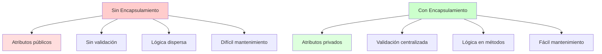

# 📘 Encapsulamiento en Java

## 🎯 Introducción

> [!info]- 💡 ¿Qué es el Encapsulamiento? El **encapsulamiento** es uno de los cuatro pilares fundamentales de la Programación Orientada a Objetos (POO). Consiste en **ocultar** los detalles internos de implementación de una clase y **exponer** solo lo necesario a través de una interfaz pública controlada.
> 
> **Analogía:** Como una cápsula de medicina
> 
> - **Interior (privado):** Ingredientes y composición química - No accesibles directamente
> - **Exterior (público):** Instrucciones de uso, dosis - Interfaz para el usuario
> 
> **Objetivos principales:**
> 
> - **Proteger datos:** Evitar modificaciones no autorizadas o incorrectas
> - **Ocultar complejidad:** El usuario no necesita saber cómo funciona internamente
> - **Controlar acceso:** Validar datos antes de modificarlos
> - **Flexibilidad:** Cambiar implementación sin afectar código externo
> - **Mantenibilidad:** Código más organizado y fácil de mantener

---

## 🔐 Modificadores de Acceso

### 📋 Los Cuatro Niveles de Acceso

> [!example]- 🔵 Tabla Comparativa
> 
> |Modificador|Misma Clase|Mismo Paquete|Subclase (otro paquete)|Cualquier Clase|
> |---|---|---|---|---|
> |**private**|✅|❌|❌|❌|
> |**default** (sin modificador)|✅|✅|❌|❌|
> |**protected**|✅|✅|✅|❌|
> |**public**|✅|✅|✅|✅|
> 
> **Explicación:**
> 
> ```java
> public class Ejemplo {
>     // PRIVATE - Solo accesible dentro de esta clase
>     private String datoPrivado;
>     
>     // DEFAULT (sin modificador) - Accesible en el mismo paquete
>     String datoPaquete;
>     
>     // PROTECTED - Accesible en el mismo paquete y subclases
>     protected String datoProtegido;
>     
>     // PUBLIC - Accesible desde cualquier lugar
>     public String datoPublico;
> }
> ```

### 1️⃣ Private (Privado)

> [!success]- 🔒 El Más Restrictivo
> 
> **Características:**
> 
> - **Más restrictivo** de todos
> - Solo accesible **dentro de la misma clase**
> - **Recomendado** para todos los atributos
> - Fuerza el uso de getters/setters
> 
> **Ejemplo:**
> 
> ````java
> public class CuentaBancaria {
>     // Atributos privados - Nadie puede acceder directamente
>     private String numeroCuenta;
>     private double saldo;
>     private String titular;
>     
>     public CuentaBancaria(String numeroCuenta, String titular) {
>         this.numeroCuenta = numeroCuenta;
>         this.titular = titular;
>         this.saldo = 0.0;
>     }
>     
>     // Métodos privados - Solo para uso interno
>     private boolean validarMonto(double monto) {
>         return monto > 0;
>     }
>     
>     // Métodos públicos - Interfaz controlada
>     public void depositar(double monto) {
>         if (validarMonto(monto)) {  // ✅ Puede llamar método privado
>             this.saldo += monto;
>             System.out.println("Depósito exitoso: $" + monto);
>         } else {
>             System.out.println("Monto inválido");
>         }
>     }
>     
>     public double getSaldo() {
>         return this.saldo;  // ✅ Puede acceder atributo privado
>     }
> }
> 
> // USO:
> public class Main {
>     public static void main(String[] args) {
>         CuentaBancaria cuenta = new CuentaBancaria("001-123", "Ana López");
>         
>         // ❌ ERROR - No se puede acceder directamente
>         // cuenta.saldo = 1000000;  // Compilación falla
>         
>         // ✅ CORRECTO - Usar métodos públicos
>         cuenta.depositar(1000);
>         System.out.println("Saldo: $" + cuenta.getSaldo());
>     }
> }
>     ```
> 
> **¿Por qué usar private?**
> 
> ```java
> // ❌ SIN ENCAPSULAMIENTO
> public class CuentaBancaria {
>     public double saldo;  // Cualquiera puede modificar
> }
> 
> CuentaBancaria cuenta = new CuentaBancaria();
> cuenta.saldo = -5000;  // ❌ Saldo negativo - ¡Error lógico!
> cuenta.saldo = 999999999;  // ❌ Modificación no autorizada
> 
> // ✅ CON ENCAPSULAMIENTO
> public class CuentaBancaria {
>     private double saldo;
>     
>     public void retirar(double monto) {
>         if (monto > 0 && monto <= saldo) {  // ✅ Validación
>             saldo -= monto;
>         } else {
>             System.out.println("Operación inválida");
>         }
>     }
> }
> ````

### 2️⃣ Public (Público)

> [!info]- 🌐 Acceso Universal
> 
> **Características:**
> 
> - **Menos restrictivo** de todos
> - Accesible desde **cualquier lugar**
> - Usado para: clases, constructores, getters/setters, métodos de interfaz
> - **NO recomendado** para atributos (rompe encapsulamiento)
> 
> **Ejemplo:**
> 
> ```java
> public class Calculadora {
>     // ❌ EVITAR - Atributos públicos
>     // public int resultado;
>     
>     // ✅ CORRECTO - Métodos públicos
>     public int sumar(int a, int b) {
>         return a + b;
>     }
>     
>     public int restar(int a, int b) {
>         return a - b;
>     }
>     
>     public double dividir(double a, double b) {
>         if (b != 0) {
>             return a / b;
>         }
>         throw new ArithmeticException("División por cero");
>     }
> }
> 
> // Accesible desde cualquier lugar
> public class Main {
>     public static void main(String[] args) {
>         Calculadora calc = new Calculadora();
>         int suma = calc.sumar(5, 3);  // ✅ Acceso público
>     }
> }
> ```
> 
> **Cuándo usar public:**
> 
> - ✅ Clases que deben ser accesibles desde otros paquetes
> - ✅ Constructores para crear objetos desde fuera
> - ✅ Getters y setters
> - ✅ Métodos que forman la interfaz pública de la clase
> - ❌ Atributos (rompe encapsulamiento)

### 3️⃣ Protected (Protegido)

> [!note]- 🛡️ Para Herencia
> 
> **Características:**
> 
> - Accesible en la **misma clase**
> - Accesible en el **mismo paquete**
> - Accesible en **subclases** (incluso en otros paquetes)
> - Útil para **herencia**
> 
> **Ejemplo:**
> 
> ```java
> // Clase padre
> public class Empleado {
>     private String nombre;          // Solo en esta clase
>     protected double salarioBase;   // Subclases pueden acceder
>     public String puesto;           // Todos pueden acceder
>     
>     public Empleado(String nombre, double salarioBase) {
>         this.nombre = nombre;
>         this.salarioBase = salarioBase;
>     }
>     
>     protected double calcularBonificacion() {
>         return salarioBase * 0.10;  // Método para subclases
>     }
>     
>     public double getSalarioBase() {
>         return salarioBase;
>     }
> }
> 
> // Clase hija (puede estar en otro paquete)
> public class Gerente extends Empleado {
>     private double bonoGerencial;
>     
>     public Gerente(String nombre, double salarioBase) {
>         super(nombre, salarioBase);
>         this.bonoGerencial = 500;
>     }
>     
>     public double calcularSalarioTotal() {
>         // ✅ Puede acceder a salarioBase (protected)
>         // ✅ Puede llamar calcularBonificacion() (protected)
>         return this.salarioBase + calcularBonificacion() + bonoGerencial;
>     }
> }
> ```

### 4️⃣ Default (Sin Modificador)

> [!tip]- 📦 Nivel de Paquete
> 
> **Características:**
> 
> - **Sin palabra clave** (ausencia de modificador)
> - Accesible solo dentro del **mismo paquete**
> - También llamado "package-private"
> - Menos usado que private y public
> 
> **Ejemplo:**
> 
> ```java
> package com.ejemplo.util;
> 
> // Clase con acceso default (solo en el paquete)
> class UtilidadInterna {  // Sin public
>     String dato;  // Sin modificador = default
>     
>     void procesar() {  // Sin modificador = default
>         System.out.println("Procesando...");
>     }
> }
> 
> public class UtilidadPublica {
>     public void usarInterna() {
>         // ✅ Puede usar UtilidadInterna (mismo paquete)
>         UtilidadInterna util = new UtilidadInterna();
>         util.procesar();
>     }
> }
> ```
> 
> ```java
> package com.ejemplo.otro;
> 
> import com.ejemplo.util.UtilidadInterna;  // ❌ No visible
> 
> public class OtraClase {
>     public void metodo() {
>         // ❌ ERROR - UtilidadInterna no es accesible
>         // UtilidadInterna util = new UtilidadInterna();
>     }
> }
> ```

---

## 🎯 Getters y Setters: La Interfaz Pública

### 📖 Métodos Getter (Accesores)

> [!example]- 🔓 Leer Valores de Forma Controlada
> 
> **Propósito:** Proporcionar acceso de **solo lectura** a atributos privados
> 
> **Convenciones:**
> 
> ```java
> // Para tipos no booleanos: getTipoAtributo()
> public TipoRetorno getNombreAtributo() {
>     return this.nombreAtributo;
> }
> 
> // Para booleanos: isNombreAtributo()
> public boolean isNombreAtributo() {
>     return this.nombreAtributo;
> }
> ```
> 
> **Ejemplos básicos:**
> 
> ```java
> public class Estudiante {
>     private String nombre;
>     private int edad;
>     private double promedio;
>     private boolean activo;
>     
>     // Getter simple para String
>     public String getNombre() {
>         return this.nombre;
>     }
>     
>     // Getter simple para int
>     public int getEdad() {
>         return this.edad;
>     }
>     
>     // Getter simple para double
>     public double getPromedio() {
>         return this.promedio;
>     }
>     
>     // Getter para boolean (usar "is" en lugar de "get")
>     public boolean isActivo() {
>         return this.activo;
>     }
> }
> ```
> 
> **Getters con lógica adicional:**
> 
> ```java
> public class Persona {
>     private String nombre;
>     private String apellido;
>     private int añoNacimiento;
>     private double sueldo;
>     
>     // Getter computado - combina datos
>     public String getNombreCompleto() {
>         return this.nombre + " " + this.apellido;
>     }
>     
>     // Getter con cálculo
>     public int getEdad() {
>         int añoActual = java.time.Year.now().getValue();
>         return añoActual - this.añoNacimiento;
>     }
>     
>     // Getter con formato
>     public String getSueldoFormateado() {
>         return String.format("$%.2f", this.sueldo);
>     }
>     
>     // Getter que protege datos sensibles
>     public String getTarjetaCreditoEnmascarada() {
>         // Retorna solo últimos 4 dígitos
>         String tarjeta = "1234567890123456";
>         return "**** **** **** " + tarjeta.substring(12);
>     }
> }
> ```
> 
> **Getters para objetos mutables (defensive copy):**
> 
> ```java
> public class Estudiante {
>     private double[] notas;
>     
>     // ❌ PROBLEMA - Retorna referencia directa
>     public double[] getNotas() {
>         return this.notas;  // ¡Alguien puede modificar el array!
>     }
>     
>     // ✅ MEJOR - Retorna copia
>     public double[] getNotas() {
>         return this.notas.clone();  // Defensive copy
>     }
>     
>     // ✅ ALTERNATIVA - Retornar elemento específico
>     public double getNota(int indice) {
>         if (indice >= 0 && indice < notas.length) {
>             return notas[indice];
>         }
>         throw new IndexOutOfBoundsException("Índice inválido");
>     }
> }
> ```

### ✏️ Métodos Setter (Mutadores)

> [!success]- 🔐 Modificar Valores con Validación
> 
> **Propósito:** Proporcionar acceso de **escritura controlada** a atributos privados
> 
> **Convención:**
> 
> ```java
> public void setNombreAtributo(TipoParametro valor) {
>     // Validación opcional
>     this.nombreAtributo = valor;
> }
> ```
> 
> **Ejemplos básicos:**
> 
> ```java
> public class Estudiante {
>     private String nombre;
>     private int edad;
>     private double promedio;
>     
>     // Setter simple
>     public void setNombre(String nombre) {
>         this.nombre = nombre;
>     }
>     
>     // Setter con validación
>     public void setEdad(int edad) {
>         if (edad >= 0 && edad <= 120) {
>             this.edad = edad;
>         } else {
>             System.out.println("Edad inválida");
>         }
>     }
>     
>     // Setter con validación de rango
>     public void setPromedio(double promedio) {
>         if (promedio >= 0.0 && promedio <= 10.0) {
>             this.promedio = promedio;
>         } else {
>             throw new IllegalArgumentException(
>                 "Promedio debe estar entre 0 y 10"
>             );
>         }
>     }
> }
> ```
> 
> **Setters con validaciones complejas:**
> 
> ```java
> public class Usuario {
>     private String email;
>     private String password;
>     private int edad;
>     
>     // Validación de formato email
>     public void setEmail(String email) {
>         if (email != null && email.contains("@") && email.contains(".")) {
>             this.email = email;
>         } else {
>             throw new IllegalArgumentException("Email inválido");
>         }
>     }
>     
>     // Validación de fortaleza de contraseña
>     public void setPassword(String password) {
>         if (password == null || password.length() < 8) {
>             throw new IllegalArgumentException(
>                 "Contraseña debe tener al menos 8 caracteres"
>             );
>         }
>         
>         boolean tieneMayuscula = !password.equals(password.toLowerCase());
>         boolean tieneMinuscula = !password.equals(password.toUpperCase());
>         boolean tieneNumero = password.matches(".*\\d.*");
>         
>         if (!tieneMayuscula || !tieneMinuscula || !tieneNumero) {
>             throw new IllegalArgumentException(
>                 "Contraseña debe tener mayúsculas, minúsculas y números"
>             );
>         }
>         
>         this.password = password;
>     }
>     
>     // Validación con lógica de negocio
>     public void setEdad(int edad) {
>         if (edad < 18) {
>             throw new IllegalArgumentException("Debe ser mayor de edad");
>         }
>         this.edad = edad;
>     }
> }
> ```
> 
> **Setters que disparan acciones:**
> 
> ```java
> public class CuentaBancaria {
>     private double saldo;
>     private List<String> historial;
>     
>     public void setSaldo(double nuevoSaldo) {
>         double anterior = this.saldo;
>         this.saldo = nuevoSaldo;
>         
>         // Registrar en historial
>         historial.add("Saldo cambiado de $" + anterior + 
>                      " a $" + nuevoSaldo);
>         
>         // Notificar si saldo bajo
>         if (nuevoSaldo < 100) {
>             System.out.println("⚠️ Advertencia: Saldo bajo");
>         }
>     }
> }
> ```

---

## 🎨 Patrones de Encapsulamiento

### 1️⃣ Inmutabilidad (Immutability)

> [!tip]- 🔒 Objetos que No Cambian
> 
> **Concepto:** Objetos cuyo estado **no puede modificarse** después de creados
> 
> **Ventajas:**
> 
> - ✅ Thread-safe (seguros en concurrencia)
> - ✅ Más fáciles de razonar y debuggear
> - ✅ Pueden compartirse sin riesgo
> - ✅ Buenos para usar como llaves en HashMap
> 
> **Implementación:**
> 
> ```java
> public final class Punto {  // ① Clase final (no heredable)
>     private final double x;  // ② Atributos final (no modificables)
>     private final double y;
>     
>     // ③ Constructor inicializa todo
>     public Punto(double x, double y) {
>         this.x = x;
>         this.y = y;
>     }
>     
>     // ④ Solo getters, NO setters
>     public double getX() {
>         return this.x;
>     }
>     
>     public double getY() {
>         return this.y;
>     }
>     
>     // ⑤ Métodos que retornan NUEVOS objetos
>     public Punto mover(double deltaX, double deltaY) {
>         return new Punto(this.x + deltaX, this.y + deltaY);
>     }
>     
>     public double distanciaAlOrigen() {
>         return Math.sqrt(x * x + y * y);
>     }
> }
> 
> // USO:
> Punto p1 = new Punto(3, 4);
> // p1.setX(5);  // ❌ No existe setter
> 
> Punto p2 = p1.mover(2, 1);  // ✅ Crea nuevo objeto
> System.out.println(p1.getX());  // 3 (no cambió)
> System.out.println(p2.getX());  // 5 (nuevo objeto)
> ```
> 
> **Ejemplo: Clase Persona Inmutable**
> 
> ```java
> public final class Persona {
>     private final String nombre;
>     private final String apellido;
>     private final int añoNacimiento;
>     
>     public Persona(String nombre, String apellido, int añoNacimiento) {
>         if (nombre == null || apellido == null) {
>             throw new IllegalArgumentException("Nombre no puede ser null");
>         }
>         this.nombre = nombre;
>         this.apellido = apellido;
>         this.añoNacimiento = añoNacimiento;
>     }
>     
>     public String getNombre() { return nombre; }
>     public String getApellido() { return apellido; }
>     public int getAñoNacimiento() { return añoNacimiento; }
>     
>     // Crear nueva persona con cambio
>     public Persona conNombre(String nuevoNombre) {
>         return new Persona(nuevoNombre, this.apellido, this.añoNacimiento);
>     }
>     
>     @Override
>     public String toString() {
>         return nombre + " " + apellido + " (" + añoNacimiento + ")";
>     }
> }
> ```

### 2️⃣ Atributos de Solo Lectura

> [!info]- 📖 Read-Only Properties
> 
> **Concepto:** Atributos que solo tienen getter, sin setter
> 
> ```java
> public class Factura {
>     private final String numero;           // Inmutable
>     private final Date fechaCreacion;      // Inmutable
>     private double total;                  // Mutable
>     
>     public Factura(String numero) {
>         this.numero = numero;
>         this.fechaCreacion = new Date();   // Se establece al crear
>         this.total = 0.0;
>     }
>     
>     // ✅ Solo lectura
>     public String getNumero() {
>         return this.numero;
>     }
>     
>     public Date getFechaCreacion() {
>         return new Date(fechaCreacion.getTime());  // Defensive copy
>     }
>     
>     // ✅ Lectura y escritura
>     public double getTotal() {
>         return this.total;
>     }
>     
>     public void agregarMonto(double monto) {
>         if (monto > 0) {
>             this.total += monto;
>         }
>     }
> }
> ```

### 3️⃣ Validación en Cascada

> [!note]- ✅ Validaciones Complejas
> 
> **Concepto:** Validar dependencias entre atributos
> 
> ```java
> public class Producto {
>     private String nombre;
>     private double precio;
>     private double descuento;  // Porcentaje
>     private int stock;
>     
>     public void setPrecio(double precio) {
>         if (precio <= 0) {
>             throw new IllegalArgumentException("Precio debe ser positivo");
>         }
>         this.precio = precio;
>         validarDescuento();  // Revalidar descuento
>     }
>     
>     public void setDescuento(double descuento) {
>         if (descuento < 0 || descuento > 100) {
>             throw new IllegalArgumentException(
>                 "Descuento debe estar entre 0 y 100"
>             );
>         }
>         this.descuento = descuento;
>         validarDescuento();  // Validar coherencia
>     }
>     
>     private void validarDescuento() {
>         double precioConDescuento = precio * (1 - descuento / 100);
>         if (precioConDescuento < 1.0) {
>             System.out.println("⚠️ Advertencia: Precio muy bajo");
>         }
>     }
>     
>     public void setStock(int stock) {
>         if (stock < 0) {
>             throw new IllegalArgumentException("Stock no puede ser negativo");
>         }
>         
>         int anterior = this.stock;
>         this.stock = stock;
>         
>         // Notificar cambios importantes
>         if (anterior > 0 && stock == 0) {
>             System.out.println("⚠️ Producto agotado");
>         } else if (anterior == 0 && stock > 0) {
>             System.out.println("✓ Producto disponible nuevamente");
>         }
>     }
> }
> ```

---

## 🎯 Ejemplo Completo: Sistema de Biblioteca Encapsulado

> [!example]- 📚 Implementación con Encapsulamiento Correcto
> 
> ```java
> import java.time.LocalDate;
import java.time.Year;
import java.time.temporal.ChronoUnit;
> 
> 
> // ========================
> // CLASE LIBRO (INMUTABLE)
> // ========================
> public final class Libro {
>     // Atributos privados finales (inmutables)
>     private final String isbn;
>     private final String titulo;
>     private final String autor;
>     private final int añoPublicacion;
> 
>     // Estado mutable (pero encapsulado)
>     private boolean disponible;
>     private int vecesPrestado; // <--- Corregido: antes era 'vecesP restado'
> 
>     // Constructor con validación
>     public Libro(String isbn, String titulo, String autor, int añoPublicacion) {
>         // Validaciones
>         if (isbn == null || isbn.trim().isEmpty()) {
>             throw new IllegalArgumentException("ISBN no puede estar vacío");
>         }
>         if (titulo == null || titulo.trim().isEmpty()) {
>             throw new IllegalArgumentException("Título no puede estar vacío");
>         }
>         if (añoPublicacion < 1000 || añoPublicacion > Year.now().getValue()) {
>             throw new IllegalArgumentException("Año de publicación inválido");
>         }
> 
>         this.isbn = isbn.trim();
>         this.titulo = titulo.trim();
>         this.autor = autor.trim();
>         this.añoPublicacion = añoPublicacion;
>         this.disponible = true;
>         this.vecesPrestado = 0;
>     }
> 
>     // Getters - Solo lectura para datos inmutables
>     public String getIsbn() {
>         return this.isbn;
>     }
> 
>     public String getTitulo() {
>         return this.titulo;
>     }
> 
>     public String getAutor() {
>         return this.autor;
>     }
> 
>     public int getAñoPublicacion() {
>         return this.añoPublicacion;
>     }
> 
>     public boolean isDisponible() {
>         return this.disponible;
>     }
> 
>     public int getVecesPrestado() {
>         return this.vecesPrestado;
>     }
> 
>     // Métodos de comportamiento (encapsulan la lógica)
>     public boolean prestar() {
>         if (!this.disponible) {
>             System.out.println("❌ Libro no disponible: " + this.titulo);
>             return false;
>         }
> 
>         this.disponible = false;
>         this.vecesPrestado++;
>         System.out.println("✓ Libro prestado: " + this.titulo);
>         return true;
>     }
> 
>     public void devolver() {
>         if (this.disponible) {
>             // No es estrictamente necesario, pero evita inconsistencias si se llama dos veces
>             // System.out.println("⚠️ El libro ya estaba disponible"); 
>             return; 
>         }
> 
>         this.disponible = true;
>         System.out.println("✓ Libro devuelto: " + this.titulo);
>     }
> 
>     // Getter computado
>     public String getEstadisticas() {
>         return String.format("Prestado %d veces, Estado: %s",
>             this.vecesPrestado,
>             this.disponible ? "Disponible" : "Prestado"
>         );
>     }
> 
>     @Override
>     public String toString() {
>         return String.format("%s - %s (%d)", titulo, autor, añoPublicacion);
>     }
> }
> 
> // ========================
> // CLASE SOCIO
> // ========================
> class Socio { // Clase no pública, se compila dentro del mismo archivo
>     // Atributos privados
>     private final String numeroSocio;
>     private String nombre;
>     private String email;
>     private String telefono;
>     private int librosPrestados;
>     private final int LIMITE_PRESTAMOS = 3;
> 
>     // Constructor
>     public Socio(String numeroSocio, String nombre, String email) {
>         if (numeroSocio == null || numeroSocio.trim().isEmpty()) {
>             throw new IllegalArgumentException("Número de socio inválido");
>         }
> 
>         this.numeroSocio = numeroSocio.trim();
>         this.librosPrestados = 0;
> 
>         // Usar setters para aprovechar validaciones
>         setNombre(nombre);
>         setEmail(email);
>     }
> 
>     // Getters
>     public String getNumeroSocio() {
>         return this.numeroSocio;
>     }
> 
>     public String getNombre() {
>         return this.nombre;
>     }
> 
>     public String getEmail() {
>         return this.email;
>     }
> 
>     public String getTelefono() {
>         return this.telefono;
>     }
> 
>     public int getLibrosPrestados() {
>         return this.librosPrestados;
>     }
> 
>     // Setters con validación
>     public void setNombre(String nombre) {
>         if (nombre == null || nombre.trim().isEmpty()) {
>             throw new IllegalArgumentException("Nombre no puede estar vacío");
>         }
>         this.nombre = nombre.trim();
>     }
> 
>     public void setEmail(String email) {
>         // Validación básica de email
>         if (email == null || !email.contains("@") || !email.contains(".")) {
>             throw new IllegalArgumentException("Email inválido");
>         }
>         this.email = email.toLowerCase().trim();
>     }
> 
>     public void setTelefono(String telefono) {
>         if (telefono != null && !telefono.isEmpty() && !telefono.matches("\\d{10}")) {
>             System.out.println("⚠️ Formato de teléfono recomendado: 10 dígitos (actual: " + telefono + ")");
>         }
>         this.telefono = (telefono != null && telefono.isEmpty()) ? null : telefono;
>     }
> 
>     // Métodos de comportamiento
>     public boolean puedePrestar() {
>         return this.librosPrestados < LIMITE_PRESTAMOS;
>     }
> 
>     public boolean tomarPrestado(Libro libro) {
>         if (!puedePrestar()) {
>             System.out.println("❌ Límite de préstamos alcanzado (" +
>                                LIMITE_PRESTAMOS + " libros) por " + this.nombre);
>             return false;
>         }
> 
>         // Delega la lógica de 'disponible' al objeto Libro
>         if (libro.prestar()) {
>             this.librosPrestados++;
>             System.out.println("  → " + this.nombre + " tomó el libro");
>             return true;
>         }
> 
>         return false;
>     }
> 
>     public void devolverLibro(Libro libro) {
>         // Delega la lógica de 'devolver' al objeto Libro
>         libro.devolver(); 
>         
>         // Solo disminuye el contador del socio si el libro estaba efectivamente prestado
>         if (this.librosPrestados > 0 && !libro.isDisponible()) {
>              // Nota: Aquí se asume que solo se llama a devolverLibro para libros que realmente tiene. 
>              // Un sistema más avanzado necesitaría una lista de libros prestados al socio.
>             this.librosPrestados--;
>             System.out.println("  → " + this.nombre + " devolvió el libro");
>         } else if (this.librosPrestados > 0) {
>              this.librosPrestados--; // Si es el caso en que el libro ya estaba disponible pero el contador es > 0, lo corrije.
>              System.out.println("  → " + this.nombre + " devolvió el libro (contador ajustado)");
>         }
>     }
> 
>     public void mostrarInfo() {
>         System.out.println("\n=== INFORMACIÓN DEL SOCIO ===");
>         System.out.println("Número: " + this.numeroSocio);
>         System.out.println("Nombre: " + this.nombre);
>         System.out.println("Email: " + this.email);
>         System.out.println("Teléfono: " + (this.telefono != null ? this.telefono : "No registrado"));
>         System.out.println("Libros prestados: " + this.librosPrestados + "/" + LIMITE_PRESTAMOS);
>     }
> }
> 
> // ========================
> // CLASE PRESTAMO
> // ========================
> class Prestamo { // Clase no pública
>     private final Libro libro;
>     private final Socio socio;
>     private final LocalDate fechaPrestamo;
>     private final LocalDate fechaDevolucionEsperada;
>     private LocalDate fechaDevolucionReal;
>     private boolean devuelto;
> 
>     public Prestamo(Libro libro, Socio socio, int diasPrestamo) {
>         if (libro == null || socio == null) {
>             throw new IllegalArgumentException("Libro y socio no pueden ser null");
>         }
>         // Ajuste: si el socio.tomarPrestado() falla, no deberíamos crear el Prestamo, 
>         // pero la clase Biblioteca ya lo maneja. Asumo que Prestamo se crea *después* de la validación.
>         if (diasPrestamo <= 0 || diasPrestamo > 30) {
>             throw new IllegalArgumentException("Días de préstamo: 1-30");
>         }
> 
>         this.libro = libro;
>         this.socio = socio;
>         this.fechaPrestamo = LocalDate.now();
>         this.fechaDevolucionEsperada = fechaPrestamo.plusDays(diasPrestamo);
>         this.fechaDevolucionReal = null;
>         this.devuelto = false;
>     }
> 
>     // Getters
>     public Libro getLibro() {
>         return this.libro;
>     }
> 
>     public Socio getSocio() {
>         return this.socio;
>     }
> 
>     public LocalDate getFechaPrestamo() {
>         return this.fechaPrestamo;
>     }
> 
>     public LocalDate getFechaDevolucionEsperada() {
>         return this.fechaDevolucionEsperada;
>     }
> 
>     public boolean isDevuelto() {
>         return this.devuelto;
>     }
>     
>     // Método para obtener la fecha de devolución real (añadido para completar el encapsulamiento)
>     public LocalDate getFechaDevolucionReal() {
>         return this.fechaDevolucionReal;
>     }
> 
> 
>     // Métodos con lógica de negocio
>     public boolean estaVencido() {
>         if (devuelto) return false;
>         return LocalDate.now().isAfter(fechaDevolucionEsperada);
>     }
> 
>     public long diasRestantes() {
>         if (devuelto) return 0;
>         // La diferencia de días es hoy hasta la fecha esperada. Si es negativo, está vencido.
>         return ChronoUnit.DAYS.between(LocalDate.now(), fechaDevolucionEsperada);
>     }
> 
>     public void registrarDevolucion() {
>         if (devuelto) {
>             System.out.println("⚠️ Ya fue devuelto anteriormente");
>             return;
>         }
> 
>         // Solo se registra la devolución en Prestamo. El Socio y el Libro deben 
>         // ser actualizados por la clase orquestadora (Biblioteca o directamente el Socio).
>         this.fechaDevolucionReal = LocalDate.now();
>         this.devuelto = true;
>         
>         System.out.println("✓ Estado de préstamo actualizado a devuelto.");
> 
>         if (fechaDevolucionReal.isAfter(fechaDevolucionEsperada)) {
>             long diasRetraso = ChronoUnit.DAYS.between(
>                 fechaDevolucionEsperada, fechaDevolucionReal
>             );
>             System.out.println("⚠️ Devolución con " + diasRetraso + " días de retraso");
>         } else {
>             System.out.println("✓ Devolución a tiempo");
>         }
>     }
> 
>     public void mostrarInfo() {
>         System.out.println("\n--- PRÉSTAMO ---");
>         System.out.println("Libro: " + libro.getTitulo());
>         System.out.println("Socio: " + socio.getNombre());
>         System.out.println("Fecha préstamo: " + fechaPrestamo);
>         System.out.println("Fecha devolución esperada: " + fechaDevolucionEsperada);
> 
>         if (devuelto) {
>             System.out.println("Estado: Devuelto (" + fechaDevolucionReal + ")");
>         } else {
>             System.out.println("Estado: Activo");
>             if (estaVencido()) {
>                 System.out.println("⚠️ VENCIDO (Retraso de " + (-diasRestantes()) + " días)");
>             } else {
>                 System.out.println("Días restantes: " + diasRestantes());
>             }
>         }
>     }
> }
> 
> // ========================
> // CLASE BIBLIOTECA
> // ========================
> class Biblioteca { // Clase no pública
>     private final String nombre;
>     private Libro[] catalogo;
>     private Socio[] socios;
>     private Prestamo[] prestamos;
>     private int totalLibros;
>     private int totalSocios;
>     private int totalPrestamos;
>     private static final int CAPACIDAD_INICIAL = 100;
> 
>     public Biblioteca(String nombre) {
>         if (nombre == null || nombre.trim().isEmpty()) {
>             throw new IllegalArgumentException("Nombre de biblioteca inválido");
>         }
> 
>         this.nombre = nombre.trim();
>         this.catalogo = new Libro[CAPACIDAD_INICIAL];
>         this.socios = new Socio[CAPACIDAD_INICIAL];
>         this.prestamos = new Prestamo[CAPACIDAD_INICIAL * 3];
>         this.totalLibros = 0;
>         this.totalSocios = 0;
>         this.totalPrestamos = 0;
> 
>         System.out.println("✓ Biblioteca '" + nombre + "' creada");
>     }
> 
>     // Getter
>     public String getNombre() {
>         return this.nombre;
>     }
> 
>     // Métodos privados (encapsulados)
>     private Libro buscarLibroPorIsbn(String isbn) {
>         for (int i = 0; i < totalLibros; i++) {
>             if (catalogo[i].getIsbn().equals(isbn)) {
>                 return catalogo[i];
>             }
>         }
>         return null;
>     }
> 
>     private Socio buscarSocioPorNumero(String numeroSocio) {
>         for (int i = 0; i < totalSocios; i++) {
>             if (socios[i].getNumeroSocio().equals(numeroSocio)) {
>                 return socios[i];
>             }
>         }
>         return null;
>     }
>     
>     // Nuevo método privado para buscar un préstamo activo
>     private Prestamo buscarPrestamoActivo(Libro libro, Socio socio) {
>         for (int i = 0; i < totalPrestamos; i++) {
>             Prestamo p = prestamos[i];
>             if (!p.isDevuelto() && p.getLibro().equals(libro) && p.getSocio().equals(socio)) {
>                 return p;
>             }
>         }
>         return null;
>     }
> 
>     // Métodos públicos
>     public void agregarLibro(Libro libro) {
>         if (libro == null) {
>             throw new IllegalArgumentException("Libro no puede ser null");
>         }
> 
>         if (buscarLibroPorIsbn(libro.getIsbn()) != null) {
>             System.out.println("⚠️ Libro ya existe en el catálogo: " + libro.getTitulo());
>             return;
>         }
> 
>         if (totalLibros >= catalogo.length) {
>             System.out.println("❌ Catálogo lleno. No se puede agregar: " + libro.getTitulo());
>             return;
>         }
> 
>         catalogo[totalLibros] = libro;
>         totalLibros++;
>         System.out.println("✓ Libro agregado al catálogo: " + libro.getTitulo());
>     }
> 
>     public void registrarSocio(Socio socio) {
>         if (socio == null) {
>             throw new IllegalArgumentException("Socio no puede ser null");
>         }
> 
>         if (buscarSocioPorNumero(socio.getNumeroSocio()) != null) {
>             System.out.println("⚠️ Socio ya está registrado: " + socio.getNombre());
>             return;
>         }
> 
>         if (totalSocios >= socios.length) {
>             System.out.println("❌ Límite de socios alcanzado. No se puede registrar: " + socio.getNombre());
>             return;
>         }
> 
>         socios[totalSocios] = socio;
>         totalSocios++;
>         System.out.println("✓ Socio registrado en la biblioteca: " + socio.getNombre());
>     }
> 
>     public boolean realizarPrestamo(String isbn, String numeroSocio, int dias) {
>         Libro libro = buscarLibroPorIsbn(isbn);
>         Socio socio = buscarSocioPorNumero(numeroSocio);
> 
>         if (libro == null) {
>             System.out.println("❌ Libro no encontrado con ISBN: " + isbn);
>             return false;
>         }
> 
>         if (socio == null) {
>             System.out.println("❌ Socio no encontrado con número: " + numeroSocio);
>             return false;
>         }
> 
>         // Aquí es donde la Biblioteca orquesta la lógica de Prestamo (tomarPrestado en Socio)
>         if (socio.tomarPrestado(libro)) {
>             if (totalPrestamos < prestamos.length) {
>                 try {
>                      prestamos[totalPrestamos] = new Prestamo(libro, socio, dias);
>                      totalPrestamos++;
>                      System.out.println("✓ Préstamo registrado y libro prestado con éxito.");
>                      return true;
>                 } catch (IllegalArgumentException e) {
>                     System.out.println("❌ Error en los días de préstamo: " + e.getMessage());
>                     // Devolvemos el estado al socio/libro para mantener la consistencia
>                     socio.devolverLibro(libro); 
>                     return false;
>                 }
>             } else {
>                 System.out.println("❌ Historial de préstamos lleno. No se puede registrar.");
>                 // Devolvemos el estado al socio/libro para mantener la consistencia
>                 socio.devolverLibro(libro); 
>                 return false;
>             }
>         }
> 
>         return false;
>     }
>     
>     public boolean realizarDevolucion(String isbn, String numeroSocio) {
>          Libro libro = buscarLibroPorIsbn(isbn);
>          Socio socio = buscarSocioPorNumero(numeroSocio);
>          
>          if (libro == null || socio == null) {
>              System.out.println("❌ Libro o Socio no encontrado para la devolución.");
>              return false;
>          }
>          
>          Prestamo prestamo = buscarPrestamoActivo(libro, socio);
>          
>          if (prestamo == null) {
>              System.out.println("⚠️ No se encontró un préstamo activo para ese libro y socio.");
>              // Aún si no se encuentra el Prestamo, forzamos la devolución del Socio y Libro
>              socio.devolverLibro(libro);
>              return false;
>          }
>          
>          // 1. Actualizar el estado del Prestamo
>          prestamo.registrarDevolucion();
>          
>          // 2. Actualizar el estado del Socio y Libro
>          socio.devolverLibro(libro);
>          
>          return true;
>     }
> 
>     public void mostrarEstadisticas() {
>         System.out.println("\n╔══════════════════════════════════════╗");
>         System.out.println("║  ESTADÍSTICAS - " + this.nombre);
>         System.out.println("╚══════════════════════════════════════╝");
>         System.out.println("Total de libros: " + totalLibros);
>         System.out.println("Total de socios: " + totalSocios);
>         System.out.println("Total de préstamos (historial): " + totalPrestamos);
> 
>         int librosDisponibles = 0;
>         int librosPrestados = 0;
> 
>         for (int i = 0; i < totalLibros; i++) {
>             if (catalogo[i].isDisponible()) {
>                 librosDisponibles++;
>             } else {
>                 librosPrestados++;
>             }
>         }
> 
>         System.out.println("Libros disponibles: " + librosDisponibles);
>         System.out.println("Libros prestados: " + librosPrestados);
> 
>         int prestamosActivos = 0;
>         int prestamosVencidos = 0;
> 
>         for (int i = 0; i < totalPrestamos; i++) {
>             if (!prestamos[i].isDevuelto()) {
>                 prestamosActivos++;
>                 if (prestamos[i].estaVencido()) {
>                     prestamosVencidos++;
>                 }
>             }
>         }
> 
>         System.out.println("Préstamos activos: " + prestamosActivos);
>         System.out.println("Préstamos vencidos: " + prestamosVencidos);
>     }
> }
> 
> // ========================
> // PROGRAMA PRINCIPAL
> // ========================
> class SistemaBiblioteca { // Clase no pública (ejemplo, se recomienda nombrarla igual que el archivo)
>     public static void main(String[] args) {
>         System.out.println("╔════════════════════════════════════════╗");
>         System.out.println("║    SISTEMA DE BIBLIOTECA ENCAPSULADO   ║");
>         System.out.println("╚════════════════════════════════════════╝\n");
> 
>         // Crear biblioteca
>         Biblioteca biblioteca = new Biblioteca("Biblioteca Central");
> 
>         // Crear y agregar libros
>         System.out.println("\n--- AGREGANDO LIBROS ---");
>         Libro libro1 = new Libro("978-84-376-0494-7",
>                                  "Cien años de soledad",
>                                  "Gabriel García Márquez",
>                                  1967);
>         Libro libro2 = new Libro("978-84-204-8250-9",
>                                  "Don Quijote de la Mancha",
>                                  "Miguel de Cervantes",
>                                  1605);
>         Libro libro3 = new Libro("978-84-233-5460-5",
>                                  "El principito",
>                                  "Antoine de Saint-Exupéry",
>                                  1943);
> 
>         biblioteca.agregarLibro(libro1);
>         biblioteca.agregarLibro(libro2);
>         biblioteca.agregarLibro(libro3);
> 
>         // Crear y registrar socios
>         System.out.println("\n--- REGISTRANDO SOCIOS ---");
>         Socio socio1 = new Socio("S001", "Ana María López", "ana@email.com");
>         socio1.setTelefono("0987654321");
> 
>         Socio socio2 = new Socio("S002", "Carlos Pérez", "carlos@email.com");
> 
>         biblioteca.registrarSocio(socio1);
>         biblioteca.registrarSocio(socio2);
>         
>         // Intentar registrar un socio con número duplicado
>         Socio socioDuplicado = new Socio("S001", "Otro Nombre", "otro@email.com");
>         biblioteca.registrarSocio(socioDuplicado);
> 
> 
>         // Realizar préstamos
>         System.out.println("\n--- REALIZANDO PRÉSTAMOS ---");
>         // Préstamo 1 a Ana (14 días)
>         biblioteca.realizarPrestamo("978-84-376-0494-7", "S001", 14); 
>         // Préstamo 2 a Carlos (7 días)
>         biblioteca.realizarPrestamo("978-84-204-8250-9", "S002", 7);
>         // Préstamo 3 a Ana (14 días)
>         biblioteca.realizarPrestamo("978-84-233-5460-5", "S001", 14);
> 
>         // Intentar préstamo de libro no disponible
>         System.out.println("\n--- INTENTO DE PRÉSTAMO DUPLICADO ---");
>         biblioteca.realizarPrestamo("978-84-376-0494-7", "S002", 7);
>         
>         // Intentar un tercer préstamo a Ana (supera el límite de 3)
>         System.out.println("\n--- INTENTO DE PRÉSTAMO POR LÍMITE ---");
>         Libro libro4 = new Libro("978-111-2222-333", "Libro de Prueba", "Autor X", 2020);
>         biblioteca.agregarLibro(libro4);
>         biblioteca.realizarPrestamo("978-111-2222-333", "S001", 10);
> 
>         // Mostrar información
>         System.out.println("\n--- INFORMACIÓN DE LIBROS ---");
>         System.out.println("\nLibro 1: " + libro1);
>         System.out.println(libro1.getEstadisticas());
> 
>         System.out.println("\nLibro 2: " + libro2);
>         System.out.println(libro2.getEstadisticas());
> 
>         // Mostrar información de socios
>         socio1.mostrarInfo();
>         socio2.mostrarInfo();
> 
>         // Devolver un libro
>         System.out.println("\n--- DEVOLUCIÓN ---");
>         biblioteca.realizarDevolucion("978-84-376-0494-7", "S001");
>         
>         // Mostrar estado después de la devolución
>         System.out.println("\nLibro 1: " + libro1);
>         System.out.println(libro1.getEstadisticas());
>         socio1.mostrarInfo();
> 
>         // Estadísticas finales
>         biblioteca.mostrarEstadisticas();
> 
>         // Demostrar validaciones
>         System.out.println("\n--- PROBANDO VALIDACIONES ---");
>         try {
>             Libro libroInvalido = new Libro("", "Sin título", "Autor", 2023);
>         } catch (IllegalArgumentException e) {
>             System.out.println("❌ Error capturado (Libro ISBN vacío): " + e.getMessage());
>         }
> 
>         try {
>             socio1.setEmail("email-invalido");
>         } catch (IllegalArgumentException e) {
>             System.out.println("❌ Error capturado (Email inválido): " + e.getMessage());
>         }
> 
>         System.out.println("\n✓ Sistema de Biblioteca ejecutado. ¡Excelente trabajo en la encapsulación! ⭐");
>     }
> }
> ```

---

## ⚠️ Violaciones Comunes del Encapsulamiento

> [!warning]- 🚫 Errores que Rompen el Encapsulamiento
> 
> **1. Atributos públicos:**
> 
> ```java
> // ❌ MAL - Acceso directo sin control
> public class CuentaBancaria {
>     public double saldo;
> }
> 
> CuentaBancaria cuenta = new CuentaBancaria();
> cuenta.saldo = -1000;  // ¡Saldo negativo sin validación!
> 
> // ✅ BIEN - Acceso controlado
> public class CuentaBancaria {
>     private double saldo;
>     
>     public void retirar(double monto) {
>         if (monto > 0 && monto <= saldo) {
>             saldo -= monto;
>         } else {
>             System.out.println("Operación inválida");
>         }
>     }
> }
> ```
> 
> **2. Retornar referencias a objetos mutables:**
> 
> ```java
> // ❌ MAL - Retorna referencia directa
> public class Estudiante {
>     private double[] notas;
>     
>     public double[] getNotas() {
>         return notas;  // ¡Alguien puede modificar el array!
>     }
> }
> 
> Estudiante est = new Estudiante();
> double[] notas = est.getNotas();
> notas[0] = 10.0;  // Modifica directamente el estado interno
> 
> // ✅ BIEN - Retorna copia
> public double[] getNotas() {
>     return notas.clone();
> }
> 
> // ✅ MEJOR - Método específico
> public double getNota(int indice) {
>     if (indice >= 0 && indice < notas.length) {
>         return notas[indice];
>     }
>     throw new IndexOutOfBoundsException();
> }
> ```
> 
> **3. Setters sin validación:**
> 
> ```java
> // ❌ MAL - Sin validación
> public void setEdad(int edad) {
>     this.edad = edad;  // Permite valores negativos
> }
> 
> // ✅ BIEN - Con validación
> public void setEdad(int edad) {
>     if (edad < 0 || edad > 120) {
>         throw new IllegalArgumentException("Edad inválida");
>     }
>     this.edad = edad;
> }
> ```
> 
> **4. Exponer colecciones mutables:**
> 
> ```java
> // ❌ MAL
> public class Curso {
>     private List<Estudiante> estudiantes;
>     
>     public List<Estudiante> getEstudiantes() {
>         return estudiantes;  // Alguien puede modificar la lista
>     }
> }
> 
> // ✅ BIEN - Retornar copia inmutable
> public List<Estudiante> getEstudiantes() {
>     return Collections.unmodifiableList(estudiantes);
> }
> 
> // ✅ MEJOR - Métodos específicos
> public int getCantidadEstudiantes() {
>     return estudiantes.size();
> }
> 
> public Estudiante getEstudiante(int indice) {
>     return estudiantes.get(indice);
> }
> ```

---

## ✅ Beneficios del Encapsulamiento

> [!success]- 🎯 Ventajas en la Práctica
> 
> **1. Protección de datos:**
> 
> ```java
> public class Usuario {
>     private String password;
>     
>     // No hay getter para password (seguridad)
>     
>     public void setPassword(String password) {
>         // Hashear antes de guardar
>         this.password = hashPassword(password);
>     }
>     
>     public boolean verificarPassword(String password) {
>         return this.password.equals(hashPassword(password));
>     }
> }
> ```
> 
> **2. Flexibilidad para cambiar implementación:**
> 
> ```java
> // Versión 1 - Array
> public class ListaEstudiantes {
>     private Estudiante[] estudiantes;
>     
>     public int getCantidad() {
>         return contarNoNulos(estudiantes);
>     }
> }
> 
> // Versión 2 - ArrayList (código externo no cambia)
> public class ListaEstudiantes {
>     private ArrayList<Estudiante> estudiantes;
>     
>     public int getCantidad() {
>         return estudiantes.size();  // Implementación diferente
>     }
> }
> ```
> 
> **3. Validación centralizada:**
> 
> ```java
> public class Producto {
>     private double precio;
>     
>     public void setPrecio(double precio) {
>         // Un solo lugar para validar
>         if (precio < 0) {
>             throw new IllegalArgumentException("Precio no puede ser negativo");
>         }
>         if (precio > 1000000) {
>             System.out.println("⚠️ Precio muy alto, revisar");
>         }
>         this.precio = precio;
>     }
> }
> ```
> 
> **4. Mantenimiento más fácil:**
> 
> ```java
> // Agregar logging sin afectar código externo
> public class CuentaBancaria {
>     private double saldo;
>     private List<String> historial;
>     
>     public void depositar(double monto) {
>         saldo += monto;
>         // Agregar funcionalidad nueva
>         historial.add("Depósito: $" + monto);
>         notificarCambio();
>     }
> }
> ```
> 
> **5. Código más legible:**
> 
> ```java
> // ❌ Sin encapsulamiento
> cuenta.saldo = cuenta.saldo - 100;
> if (cuenta.saldo < 0) {
>     cuenta.saldo = cuenta.saldo + 100;
>     System.out.println("Fondos insuficientes");
> }
> 
> // ✅ Con encapsulamiento
> cuenta.retirar(100);  // Toda la lógica encapsulada
> ```

---

## 🎓 Ejercicios Propuestos

> [!example]- 💪 Práctica de Encapsulamiento
> 
> **Nivel Básico:**
> 
> 1. Crear clase `Rectangulo` con atributos privados y getters/setters con validación
> 2. Implementar clase `Temperatura` que encapsule conversiones Celsius/Fahrenheit
> 3. Clase `Fecha` con validación de día, mes y año
> 
> **Nivel Intermedio:**
> 
> 4. Clase `CuentaBancaria` completa con historial de transacciones encapsulado
> 5. Sistema de `Empleado` con cálculo de salario encapsulado
> 6. Clase `Carrito` de compras con total calculado automáticamente
> 7. Implementar `Email` como clase inmutable con validación
> 
> **Nivel Avanzado:**
> 
> 8. Sistema de `Reservas` para hotel con reglas de negocio complejas
> 9. Clase `Matriz` con operaciones encapsuladas
> 10. Sistema de `Inventario` con notificaciones automáticas

---

## 📊 Diagrama Comparativo



---

## 🔗 Conexión con Próximos Temas

> [!quote]- 🌟 Continuando el Aprendizaje
> 
> **Has aprendido:**
> 
> - ✅ Modificadores de acceso (private, public, protected, default)
> - ✅ Getters y setters con validación
> - ✅ Inmutabilidad y objetos de solo lectura
> - ✅ Protección de datos y validaciones
> - ✅ Beneficios del encapsulamiento
> 
> **Próximos temas relacionados:**
> 
> - **[[Modificador Static]]** - Miembros de clase vs instancia
> - **[[Herencia]]** - Protected y encapsulamiento en jerarquías
> - **[[Polimorfismo]]** - Interfaces públicas polimórficas
> - **[[Clases Abstractas]]** - Encapsulamiento con métodos abstractos
> - **[[Interfaces]]** - Contratos públicos
> - **[[Packages]]** - Encapsulamiento a nivel de paquete

---

**Tags:** #java #encapsulamiento #poo #modificadores-acceso #getters #setters #private #public #protected #inmutabilidad #validacion #seguridad