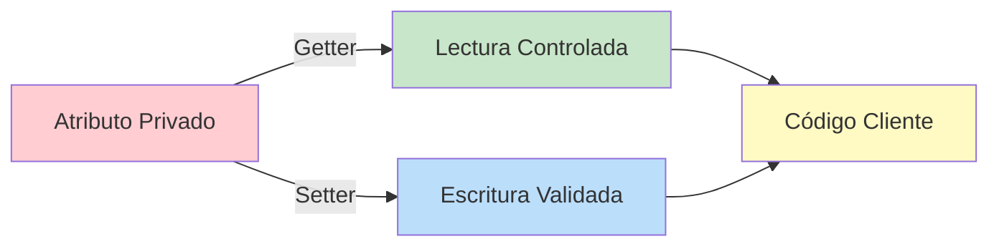

# 🔐 Getters y Setters en Java

## 🎯 Introducción

> [!info]- 💡 ¿Qué son los Getters y Setters? Los **getters** y **setters** son métodos especiales que permiten **acceder** y **modificar** los atributos privados de una clase de manera controlada. Son fundamentales para implementar el principio de **encapsulamiento** en la POO.
> 
> **Características principales:**
> 
> - **Getters (accesores):** Devuelven el valor de un atributo privado
> - **Setters (mutadores):** Modifican el valor de un atributo privado
> - Permiten **validación** antes de asignar valores
> - Protegen la **integridad** de los datos
> - Facilitan el **mantenimiento** del código

---

## 📦 Sintaxis Básica

### 📖 Estructura de un Getter

> [!example]- 🟢 Anatomía de un Getter
> 
> ```java
> public TipoRetorno getNombreAtributo() {
>     return this.nombreAtributo;
> }
> ```
> 
> **Convenciones:**
> 
> - Nombre: `get` + nombre del atributo en PascalCase
> - Modificador: `public` (para que sea accesible)
> - Retorno: el **tipo del atributo**
> - No recibe parámetros
> 
> **Ejemplo:**
> 
> ```java
> public class Estudiante {
>     private String nombre;
>     private int edad;
>     
>     // Getter para nombre
>     public String getNombre() {
>         return nombre;
>     }
>     
>     // Getter para edad
>     public int getEdad() {
>         return edad;
>     }
> }
> ```
> 
> **⚠️ Caso especial para boolean:**
> 
> ```java
> private boolean activo;
> 
> // Se usa 'is' en lugar de 'get'
> public boolean isActivo() {
>     return activo;
> }
> ```

### ✏️ Estructura de un Setter

> [!example]- 🔵 Anatomía de un Setter
> 
> ```java
> public void setNombreAtributo(TipoParametro nuevoValor) {
>     this.nombreAtributo = nuevoValor;
> }
> ```
> 
> **Convenciones:**
> 
> - Nombre: `set` + nombre del atributo en PascalCase
> - Modificador: `public`
> - Retorno: `void` (no devuelve nada)
> - Recibe **un parámetro** del mismo tipo que el atributo
> 
> **Ejemplo:**
> 
> ```java
> public class Estudiante {
>     private String nombre;
>     private int edad;
>     
>     // Setter para nombre
>     public void setNombre(String nombre) {
>         this.nombre = nombre;
>     }
>     
>     // Setter para edad
>     public void setEdad(int edad) {
>         this.edad = edad;
>     }
> }
> ```

---

## 🛡️ Validación en Setters

> [!success]- ✅ Setters con Validación (La Razón Principal de su Existencia)
> 
> **Setter simple vs setter con validación:**
> 
> ```java
> public class Producto {
>     private double precio;
>     private int stock;
>     private String codigo;
>     
>     // ❌ Setter sin validación (permite valores incorrectos)
>     public void setPrecio(double precio) {
>         this.precio = precio;  // ¿Y si es negativo?
>     }
>     
>     // ✅ Setter con validación
>     public void setPrecio(double precio) {
>         if (precio >= 0) {
>             this.precio = precio;
>         } else {
>             System.out.println("Error: El precio no puede ser negativo");
>         }
>     }
>     
>     // ✅ Validación de rango
>     public void setStock(int stock) {
>         if (stock >= 0 && stock <= 10000) {
>             this.stock = stock;
>         } else {
>             System.out.println("Stock fuera de rango válido");
>         }
>     }
>     
>     // ✅ Validación de formato
>     public void setCodigo(String codigo) {
>         if (codigo != null && codigo.length() == 6) {
>             this.codigo = codigo.toUpperCase();
>         } else {
>             System.out.println("Código debe tener 6 caracteres");
>         }
>     }
> }
> ```
> 
> **Ejemplos de validaciones comunes:**
> 
> ```java
> public class Usuario {
>     private String email;
>     private int edad;
>     private String telefono;
>     
>     // Validar formato de email
>     public void setEmail(String email) {
>         if (email != null && email.contains("@")) {
>             this.email = email;
>         } else {
>             System.out.println("Email inválido");
>         }
>     }
>     
>     // Validar rango de edad
>     public void setEdad(int edad) {
>         if (edad >= 18 && edad <= 120) {
>             this.edad = edad;
>         } else {
>             System.out.println("Edad debe estar entre 18 y 120");
>         }
>     }
>     
>     // Validar longitud de teléfono
>     public void setTelefono(String telefono) {
>         if (telefono != null && telefono.length() == 10) {
>             this.telefono = telefono;
>         } else {
>             System.out.println("Teléfono debe tener 10 dígitos");
>         }
>     }
> }
> ```

---

## 🎨 Ejemplo Completo

> [!example]- 📋 Clase Completa con Getters y Setters
> 
> ```java
> public class CuentaBancaria {
>     // Atributos privados
>     private String titular;
>     private String numeroCuenta;
>     private double saldo;
>     private boolean activa;
>     
>     // Constructor
>     public CuentaBancaria(String titular, String numeroCuenta) {
>         this.titular = titular;
>         this.numeroCuenta = numeroCuenta;
>         this.saldo = 0.0;
>         this.activa = true;
>     }
>     
>     // Getters
>     public String getTitular() {
>         return titular;
>     }
>     
>     public String getNumeroCuenta() {
>         return numeroCuenta;
>     }
>     
>     public double getSaldo() {
>         return saldo;
>     }
>     
>     public boolean isActiva() {
>         return activa;
>     }
>     
>     // Setters con validación
>     public void setTitular(String titular) {
>         if (titular != null && !titular.trim().isEmpty()) {
>             this.titular = titular;
>         } else {
>             System.out.println("Nombre de titular inválido");
>         }
>     }
>     
>     // Número de cuenta NO debe tener setter (es inmutable)
>     
>     public void setSaldo(double saldo) {
>         if (saldo >= 0) {
>             this.saldo = saldo;
>         } else {
>             System.out.println("El saldo no puede ser negativo");
>         }
>     }
>     
>     public void setActiva(boolean activa) {
>         this.activa = activa;
>     }
>     
>     // Métodos adicionales que usan los getters/setters
>     public void depositar(double monto) {
>         if (monto > 0 && activa) {
>             setSaldo(getSaldo() + monto);
>             System.out.println("Depósito exitoso: $" + monto);
>         }
>     }
>     
>     public void retirar(double monto) {
>         if (monto > 0 && monto <= saldo && activa) {
>             setSaldo(getSaldo() - monto);
>             System.out.println("Retiro exitoso: $" + monto);
>         } else {
>             System.out.println("Operación no válida");
>         }
>     }
> }
> ```
> 
> **Uso:**
> 
> ```java
> public class Main {
>     public static void main(String[] args) {
>         CuentaBancaria cuenta = new CuentaBancaria("Juan Pérez", "001-234567");
>         
>         // Usar getters
>         System.out.println("Titular: " + cuenta.getTitular());
>         System.out.println("Número: " + cuenta.getNumeroCuenta());
>         System.out.println("Saldo: $" + cuenta.getSaldo());
>         
>         // Usar setters
>         cuenta.depositar(1000);
>         System.out.println("Nuevo saldo: $" + cuenta.getSaldo());
>         
>         cuenta.retirar(300);
>         System.out.println("Saldo final: $" + cuenta.getSaldo());
>     }
> }
> ```

---

## 🔍 Casos Especiales

> [!tip]- 🎯 Cuándo NO Crear Getters o Setters
> 
> **1. Atributos que NO deben tener setter (inmutables):**
> 
> ```java
> public class Persona {
>     private final String dni;  // No puede cambiar
>     private final LocalDate fechaNacimiento;
>     
>     // Solo getters, NO setters
>     public String getDni() {
>         return dni;
>     }
>     
>     public LocalDate getFechaNacimiento() {
>         return fechaNacimiento;
>     }
> }
> ```
> 
> **2. Getters calculados (valores derivados):**
> 
> ```java
> public class Rectangulo {
>     private double base;
>     private double altura;
>     
>     // Getters normales
>     public double getBase() { return base; }
>     public double getAltura() { return altura; }
>     
>     // Getters calculados (NO hay atributo 'area' ni 'perimetro')
>     public double getArea() {
>         return base * altura;
>     }
>     
>     public double getPerimetro() {
>         return 2 * (base + altura);
>     }
> }
> ```
> 
> **3. Setters que modifican múltiples atributos:**
> 
> ```java
> public class Empleado {
>     private double salarioBase;
>     private double bonificacion;
>     private double salarioTotal;
>     
>     public void setSalarioBase(double salario) {
>         this.salarioBase = salario;
>         calcularSalarioTotal();  // Actualiza automáticamente
>     }
>     
>     public void setBonificacion(double bono) {
>         this.bonificacion = bono;
>         calcularSalarioTotal();
>     }
>     
>     private void calcularSalarioTotal() {
>         this.salarioTotal = salarioBase + bonificacion;
>     }
>     
>     public double getSalarioTotal() {
>         return salarioTotal;
>     }
> }
> ```

---

## ⚡ Generación Automática

> [!note]- 🛠️ IDEs Generan Getters/Setters Automáticamente
> 
> **En Eclipse:**
> 
> 1. Clic derecho en la clase → Source → Generate Getters and Setters
> 2. Seleccionar los atributos deseados
> 
> **En IntelliJ IDEA:**
> 
> 1. `Alt + Insert` (Windows/Linux) o `Cmd + N` (Mac)
> 2. Seleccionar "Getter and Setter"
> 
> **En VS Code (con extensiones Java):**
> 
> 1. Clic derecho → "Source Action"
> 2. "Generate Getters and Setters"
> 
> **Ejemplo de código generado:**
> 
> ```java
> public class Producto {
>     private String nombre;
>     private double precio;
>     
>     // Generados automáticamente
>     public String getNombre() {
>         return nombre;
>     }
>     
>     public void setNombre(String nombre) {
>         this.nombre = nombre;
>     }
>     
>     public double getPrecio() {
>         return precio;
>     }
>     
>     public void setPrecio(double precio) {
>         this.precio = precio;
>     }
> }
> ```

---

## ✅ Ventajas vs ❌ Desventajas

> [!success]- 🟢 Ventajas de Usar Getters y Setters
> 
> **1. Encapsulamiento:**
> 
> ```java
> // ❌ Acceso directo (malo)
> persona.edad = -5;  // Permite valores inválidos
> 
> // ✅ Con setter (bueno)
> persona.setEdad(-5);  // El setter puede validar y rechazar
> ```
> 
> **2. Flexibilidad para cambios futuros:**
> 
> ```java
> // Hoy: getter simple
> public String getNombre() {
>     return nombre;
> }
> 
> // Mañana: puedes agregar lógica sin romper código existente
> public String getNombre() {
>     return nombre.toUpperCase();  // Ahora siempre en mayúsculas
> }
> ```
> 
> **3. Control total sobre los datos:**
> 
> - Validación antes de asignar
> - Conversión de formatos
> - Registro de cambios (logging)
> - Notificación de eventos
> 
> **4. Compatibilidad con frameworks:**
> 
> - JavaBeans estándar
> - Frameworks como Spring, Hibernate requieren getters/setters

> [!warning]- 🔴 Desventajas / Consideraciones
> 
> **1. Código más extenso (verboso):**
> 
> ```java
> // 2 líneas se convierten en 8
> private String nombre;
> 
> public String getNombre() {
>     return nombre;
> }
> 
> public void setNombre(String nombre) {
>     this.nombre = nombre;
> }
> ```
> 
> **2. "Getters/Setters tontos" (sin lógica):**
> 
> - Si solo hacen `return/asignar` sin validación, ¿por qué no atributo público?
> - Solución: Siempre agregar alguna validación o mantener flexibilidad futura
> 
> **3. Puede violar encapsulamiento si se abusa:**
> 
> ```java
> // ❌ Exponer demasiado
> persona.getCuenta().setSaldo(0);  // Acceso directo a objetos internos
> 
> // ✅ Mejor encapsular la operación
> persona.vaciarCuenta();
> ```

---

## 🎓 Mejores Prácticas

> [!tip]- ⭐ Recomendaciones Profesionales
> 
> **1. Siempre valida en los setters:**
> 
> ```java
> public void setEdad(int edad) {
>     if (edad < 0 || edad > 150) {
>         throw new IllegalArgumentException("Edad inválida");
>     }
>     this.edad = edad;
> }
> ```
> 
> **2. No expongas colecciones directamente:**
> 
> ```java
> // ❌ MALO - Se puede modificar desde fuera
> public List<String> getTelefonos() {
>     return telefonos;
> }
> 
> // ✅ BUENO - Devolver copia
> public List<String> getTelefonos() {
>     return new ArrayList<>(telefonos);
> }
> ```
> 
> **3. Usa `final` para atributos inmutables:**
> 
> ```java
> public class Estudiante {
>     private final String codigo;  // No necesita setter
>     
>     public String getCodigo() {
>         return codigo;
>     }
> }
> ```
> 
> **4. Considera usar record (Java 14+):**
> 
> ```java
> // Alternativa moderna para clases de datos simples
> public record Persona(String nombre, int edad) {
>     // Getters automáticos: nombre(), edad()
>     // No tiene setters (inmutable)
> }
> ```
> 
> **5. Documenta getters/setters importantes:**
> 
> ```java
> /**
>  * Establece el saldo de la cuenta.
>  * @param saldo el nuevo saldo (debe ser >= 0)
>  * @throws IllegalArgumentException si el saldo es negativo
>  */
> public void setSaldo(double saldo) {
>     if (saldo < 0) {
>         throw new IllegalArgumentException("Saldo negativo");
>     }
>     this.saldo = saldo;
> }
> ```

---

## 📊 Comparación Visual



---

## 🔗 Relación con Otros Conceptos

> [!quote]- 🌐 Conexiones
> 
> **Temas relacionados:**
> 
> - **[[01 - Encapsulamiento]]** - Los getters/setters son la implementación práctica
> - **[[05 - Constructores]]** - Inicialización vs modificación posterior
> - **[[04 - Modificador this]]** - Usado en setters para distinguir parámetros
> - **[[Modificador final]]** - Atributos finales solo tienen getter
> - **Validación y Excepciones** - Lanzar excepciones en setters inválidos

---

**Tags:** #java #poo #getters #setters #encapsulamiento #validacion #accesores #mutadores #buenas-practicas