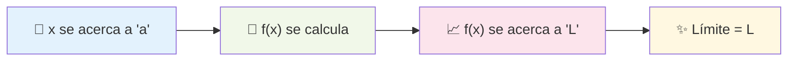
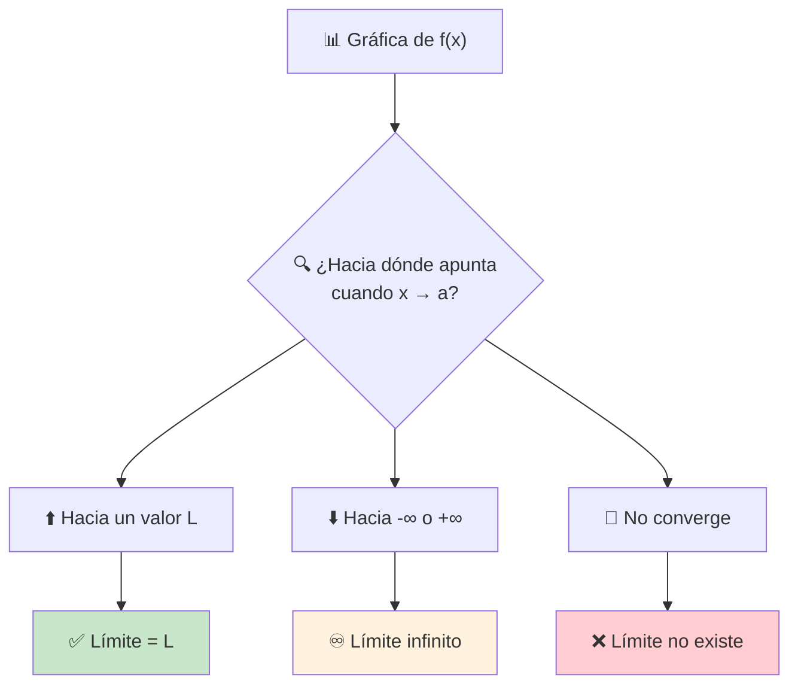

# Concepto Intuitivo de Límite 🤔

> [!tip] 🎯 Idea Central Un **límite** describe hacia dónde se dirige una función cuando la variable independiente se acerca a un valor específico, **sin necesariamente llegar a ese valor**. Es como observar hacia dónde camina una persona, no necesariamente dónde está parada.

## ¿Qué es un Límite? 🔍

> [!info] 🌟 Definición Intuitiva Decimos que el **límite de $f(x)$ cuando $x$ se acerca a $a$ es $L$** si:
> 
> Los valores de $f(x)$ se acercan arbitrariamente a $L$ cuando $x$ toma valores cada vez más cercanos a $a$ (pero diferentes de $a$).
> 
> **Notación:** $$\lim_{x \to a} f(x) = L$$

> [!example] 🌈 Ejemplo Visual Simple Considera $f(x) = 2x + 1$ y queremos $\lim_{x \to 3} f(x)$
> 
> |$x$ acercándose a 3|$f(x) = 2x + 1$|
> |---|---|
> |$x = 2.9$|$f(2.9) = 6.8$|
> |$x = 2.99$|$f(2.99) = 6.98$|
> |$x = 2.999$|$f(2.999) = 6.998$|
> |$x = 3.001$|$f(3.001) = 7.002$|
> |$x = 3.01$|$f(3.01) = 7.02$|
> |$x = 3.1$|$f(3.1) = 7.2$|
> 
> 🎯 **Observación:** Conforme $x$ se acerca a 3, $f(x)$ se acerca a 7
> 
> Por tanto: $\lim_{x \to 3} (2x + 1) = 7$ ✨

## Conceptos Clave para Entender Límites 🗝️

> [!warning] ⚠️ Misconcepciones Importantes
> 
> ### 🚫 Lo que NO es un límite:
> 
> - **NO necesitamos** que $f(a)$ exista
> - **NO importa** el valor de $f(a)$ si existe
> - **NO necesitamos** que $x$ llegue exactamente a $a$
> 
> ### ✅ Lo que SÍ importa:
> 
> - **SÍ importa** hacia dónde tienden los valores de $f(x)$
> - **SÍ necesitamos** que $x$ se acerque a $a$
> - **SÍ debe existir** un valor específico al que se acercan $f(x)$

> [!example] 🎪 Ejemplo con Función Discontinua Sea $g(x) = \begin{cases} x^2 & \text{si } x \neq 2 \ 10 & \text{si } x = 2 \end{cases}$
> 
> Para $\lim_{x \to 2} g(x)$:
> 
> |$x$ cerca de 2|$g(x)$|
> |---|---|
> |$x = 1.9$|$g(1.9) = 3.61$|
> |$x = 1.99$|$g(1.99) = 3.9601$|
> |$x = 2.01$|$g(2.01) = 4.0401$|
> |$x = 2.1$|$g(2.1) = 4.41$|
> 
> 🎯 **Resultado:** $\lim_{x \to 2} g(x) = 4$
> 
> 📝 **Nota:** ¡Aunque $g(2) = 10$, el límite es 4! 🤯

## Interpretación Gráfica 📊

> [!info] 📈 Lectura Visual de Límites En una gráfica, el límite se ve como:
> 
> - 👀 **Observamos** hacia dónde "apunta" la función cuando nos acercamos al punto
> - 🎯 **No importa** si hay un "hueco" o "salto" en ese punto exacto
> - ✨ **Importa** la "tendencia" o "dirección" de la función

## Situaciones Comunes 🎭

> [!note] 📚 Casos Típicos de Límites
> 
> ### 1️⃣ **Función Continua** 🌊
> 
> $\lim_{x \to a} f(x) = f(a)$
> 
> - La función no tiene "interrupciones"
> - El límite coincide con el valor de la función
> 
> ### 2️⃣ **Función con Hueco** 🕳️
> 
> $\lim_{x \to a} f(x) = L$, pero $f(a)$ no existe
> 
> - Hay un "punto faltante" en la gráfica
> - El límite existe pero la función no está definida ahí
> 
> ### 3️⃣ **Función con Salto** 📈📉
> 
> $\lim_{x \to a} f(x)$ no existe
> 
> - La función "salta" de un valor a otro
> - Los límites laterales son diferentes
> 
> ### 4️⃣ **Límite Infinito** ♾️
> 
> $\lim_{x \to a} f(x) = \pm\infty$
> 
> - La función crece sin límite
> - Hay una asíntota vertical

## Aproximación por Valores 🎯

> [!tip] 🔢 Estrategia de Tablas de Valores Para encontrar un límite intuitivamente:
> 
> 1. **📊 Crear tabla:** Valores de $x$ acercándose a $a$ por ambos lados
> 2. **🧮 Calcular:** Los valores correspondientes de $f(x)$
> 3. **👀 Observar:** Hacia qué valor tienden $f(x)$
> 4. **🎯 Concluir:** Ese es el límite (si existe)

> [!example] 🧪 Ejemplo Práctico: $\lim_{x \to 0} \frac{\sin x}{x}$
> 
> |$x$|$\frac{\sin x}{x}$|
> |---|---|
> |$-0.1$|$0.998334...$|
> |$-0.01$|$0.999983...$|
> |$-0.001$|$0.999999...$|
> |$0.001$|$0.999999...$|
> |$0.01$|$0.999983...$|
> |$0.1$|$0.998334...$|
> 
> 🎯 **Conclusión:** $\lim_{x \to 0} \frac{\sin x}{x} = 1$ ✨
> 
> 📝 **Nota:** Este es un límite fundamental muy importante!

## Lenguaje Matemático 🗣️

> [!info] 📝 Frases Equivalentes Todas estas expresiones significan lo mismo:
> 
> - "$\lim_{x \to a} f(x) = L$"
> - "El límite de $f(x)$ cuando $x$ tiende a $a$ es $L$"
> - "Cuando $x$ se acerca a $a$, $f(x)$ se acerca a $L$"
> - "$f(x)$ tiende a $L$ cuando $x$ tiende a $a$"
> - "$f(x) \to L$ cuando $x \to a$"

## Técnica de Estudio: Mnemotecnia "CERCA" 🧠

> [!tip] 🎓 Para Recordar el Concepto de Límite
> 
> **C**ercanos: Los valores de $x$ están cerca de $a$ **E**xacto: No necesita llegar exactamente a $a$  
> **R**esultado: Los $f(x)$ se acercan a un resultado $L$ **C**onvergencia: Los valores deben converger a $L$ **A**proximación: Es sobre aproximarse, no sobre llegar

## Errores Comunes ⚠️

> [!warning] 🚨 Trampas Frecuentes
> 
> ### ❌ Error 1: Confundir límite con valor de función
> 
> **Incorrecto:** "Si $f(2) = 5$, entonces $\lim_{x \to 2} f(x) = 5$" **Correcto:** El límite puede ser diferente al valor de la función
> 
> ### ❌ Error 2: Pensar que el límite requiere que la función esté definida
> 
> **Incorrecto:** "No puedo hallar el límite si la función no existe en ese punto" **Correcto:** El límite puede existir aunque la función no esté definida ahí
> 
> ### ❌ Error 3: Usar solo un lado para aproximarse
> 
> **Incorrecto:** Solo mirar valores desde la derecha o desde la izquierda **Correcto:** Verificar ambos lados para asegurar que convergen al mismo valor

## Referencias 📚

> [!quote] 🔗 Notas Relacionadas
> 
> - [[Límites Laterales]] - Extensión del concepto
> - [[Límites en Gráficas]] - Interpretación visual detallada
> - [[Continuidad y Límites]] - Relación entre límites y continuidad
> - [[Definición Formal del Límite]] - Formalización rigurosa

## Notas Recomendadas 💡

> [!note] 📖 Para Profundizar
> 
> - [[Límites por Sustitución Directa]] - Casos simples
> - [[Teoremas de Límites]] - Propiedades y leyes
> - [[Forma Indeterminadas 0 Sobre 0]] - Casos más complejos
> - Carpeta Aplicaciones de Límites - Usos en ciencias e ingeniería

---

**Tags:** #calculo #limites #concepto-intuitivo #fundamentos #aproximacion #convergencia #matematicas #definicion-basica #interpretacion-grafica #ejemplos