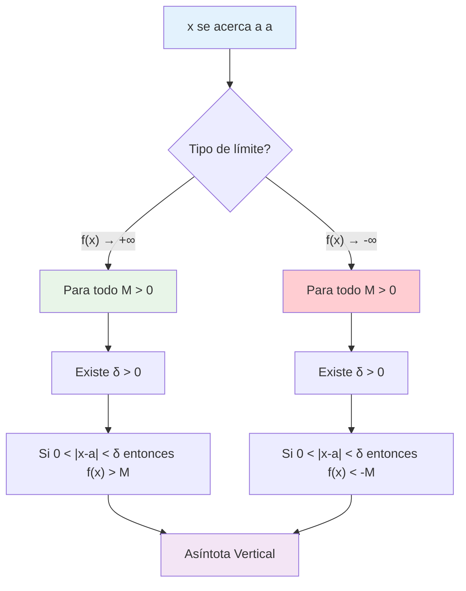
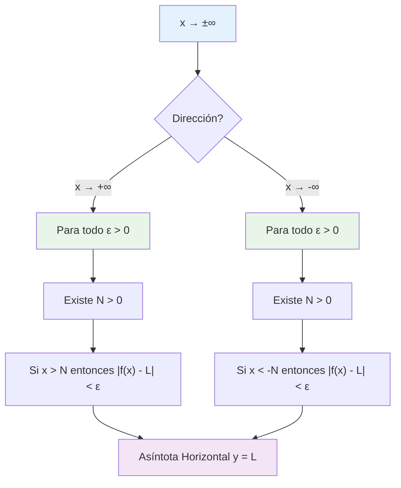

# 📏 Definición Formal del Límite para Asíntotas

## 🎯 Fundamentos de Límites Infinitos

> [!info]- 💡 Introducción a las Definiciones Formales Las **definiciones formales** de límites para asíntotas extienden el concepto clásico de límite (definición épsilon-delta) a casos donde:
> 
> - **Variable tiende al infinito:** $x \to \pm\infty$ (asíntotas horizontales)
> - **Función tiende al infinito:** $f(x) \to \pm\infty$ (asíntotas verticales)
> 
> **Notación clave:**
> 
> - **M:** Número arbitrariamente grande (para límites infinitos)
> - **N:** Número arbitrariamente grande (para límites al infinito)
> - **δ:** Delta, distancia pequeña alrededor de un punto
> - **ε:** Épsilon, tolerancia pequeña para valores finitos

### 🔍 Recordatorio: Definición Épsilon-Delta Clásica

> [!note]- 📚 Definición Base (Límites Finitos)
> 
> **Para límites finitos:** $\lim_{x \to a} f(x) = L$
> 
> **Definición:** Para todo $\varepsilon > 0$, existe $\delta > 0$ tal que:
> 
> $$\text{Si } 0 < |x - a| < \delta \text{ entonces } |f(x) - L| < \varepsilon$$
> 
> **Interpretación:**
> 
> - $\varepsilon$ controla qué tan cerca está $f(x)$ de $L$
> - $\delta$ controla qué tan cerca está $x$ de $a$
> 
> Esta definición es la base para extender a casos infinitos.

## 🔺 Asíntotas Verticales - Definición Formal

### ➕ Límite Infinito Positivo

> [!example]- 📈 Definición: $\lim_{x \to a} f(x) = +\infty$
> 
> **Definición formal:** Para todo $M > 0$, existe $\delta > 0$ tal que:
> 
> $$\text{Si } 0 < |x - a| < \delta \text{ entonces } f(x) > M$$
> 
> **Interpretación geométrica:**
> 
> - No importa qué tan grande sea $M$, podemos hacer que $f(x)$ sea aún más grande
> - Esto ocurre cuando $x$ está suficientemente cerca de $a$
> 
> **Elementos clave:**
> 
> - **M:** Cualquier número positivo grande que elijamos
> - **δ:** Distancia alrededor de $x = a$ que garantiza $f(x) > M$
> - **Condición:** $0 < |x - a| < \delta$ (excluimos $x = a$)
> 
> **Ejemplo típico:** $\lim_{x \to 0} \frac{1}{x^2} = +\infty$

### ➖ Límite Infinito Negativo

> [!example]- 📉 Definición: $\lim_{x \to a} f(x) = -\infty$
> 
> **Definición formal:** Para todo $M > 0$, existe $\delta > 0$ tal que:
> 
> $$\text{Si } 0 < |x - a| < \delta \text{ entonces } f(x) < -M$$
> 
> **Nota importante:** Usamos $-M$ donde $M > 0$, así $f(x)$ es más negativo que $-M$
> 
> **Interpretación:**
> 
> - $f(x)$ se vuelve arbitrariamente negativa (grande en valor absoluto)
> - Cuando $x$ se acerca a $a$
> 
> **Ejemplo típico:** $\lim_{x \to 0^+} \frac{-1}{x} = -\infty$

### 🔄 Límites Laterales Infinitos

> [!tip]- 🎯 Límites Unilaterales Infinitos
> 
> **Por la derecha:** $\lim_{x \to a^+} f(x) = +\infty$
> 
> Para todo $M > 0$, existe $\delta > 0$ tal que: $$\text{Si } a < x < a + \delta \text{ entonces } f(x) > M$$
> 
> **Por la izquierda:** $\lim_{x \to a^-} f(x) = +\infty$
> 
> Para todo $M > 0$, existe $\delta > 0$ tal que: $$\text{Si } a - \delta < x < a \text{ entonces } f(x) > M$$
> 
> **Asíntota vertical:** Existe si al menos uno de los límites laterales es infinito.

## 📐 Asíntotas Horizontales - Definición Formal

### ➡️ Límite al Infinito Positivo

> [!success]- 📊 Definición: $\lim_{x \to +\infty} f(x) = L$
> 
> **Definición formal:** Para todo $\varepsilon > 0$, existe $N > 0$ tal que:
> 
> $$\text{Si } x > N \text{ entonces } |f(x) - L| < \varepsilon$$
> 
> **Interpretación:**
> 
> - Cuando $x$ es suficientemente grande, $f(x)$ está arbitrariamente cerca de $L$
> - $L$ es la **asíntota horizontal** por la derecha
> 
> **Elementos clave:**
> 
> - **N:** Umbral grande; para $x > N$ la función se comporta como queremos
> - **ε:** Tolerancia pequeña para la distancia entre $f(x)$ y $L$
> - **L:** Valor límite (asíntota horizontal)
> 
> **Ejemplo:** $\lim_{x \to +\infty} \frac{1}{x} = 0$

### ⬅️ Límite al Infinito Negativo

> [!success]- 📊 Definición: $\lim_{x \to -\infty} f(x) = L$
> 
> **Definición formal:** Para todo $\varepsilon > 0$, existe $N > 0$ tal que:
> 
> $$\text{Si } x < -N \text{ entonces } |f(x) - L| < \varepsilon$$
> 
> **Nota:** Usamos $-N$ donde $N > 0$, así $x$ es muy negativo
> 
> **Interpretación:**
> 
> - Cuando $x$ es suficientemente negativo, $f(x)$ se acerca a $L$
> - $L$ es la **asíntota horizontal** por la izquierda

### ♾️ Límites Infinitos al Infinito

> [!warning]- ⚡ Definiciones para Casos Infinito-Infinito
> 
> **1. $\lim_{x \to +\infty} f(x) = +\infty$**
> 
> Para todo $M > 0$, existe $N > 0$ tal que: $$\text{Si } x > N \text{ entonces } f(x) > M$$
> 
> **2. $\lim_{x \to +\infty} f(x) = -\infty$**
> 
> Para todo $M > 0$, existe $N > 0$ tal que: $$\text{Si } x > N \text{ entonces } f(x) < -M$$
> 
> **3. $\lim_{x \to -\infty} f(x) = +\infty$**
> 
> Para todo $M > 0$, existe $N > 0$ tal que: $$\text{Si } x < -N \text{ entonces } f(x) > M$$
> 
> **4. $\lim_{x \to -\infty} f(x) = -\infty$**
> 
> Para todo $M > 0$, existe $N > 0$ tal que: $$\text{Si } x < -N \text{ entonces } f(x) < -M$$

## 📊 Tabla Resumen de Definiciones

> [!note]- 📋 Compendio de Definiciones Formales
> 
> |Tipo de Límite|Notación|Definición Formal|Variables|
> |---|---|---|---|
> |**Finito → Finito**|$\lim_{x \to a} f(x) = L$|$\|f(x) - L\| < \varepsilon$ cuando $0 < \|x - a\| < \delta$|$\varepsilon, \delta$|
> |**Finito → +∞**|$\lim_{x \to a} f(x) = +\infty$|$f(x) > M$ cuando $0 < \|x - a\| < \delta$|$M, \delta$|
> |**Finito → -∞**|$\lim_{x \to a} f(x) = -\infty$|$f(x) < -M$ cuando $0 < \|x - a\| < \delta$|$M, \delta$|
> |**+∞ → Finito**|$\lim_{x \to +\infty} f(x) = L$|$\|f(x) - L\| < \varepsilon$ cuando $x > N$|$\varepsilon, N$|
> |**-∞ → Finito**|$\lim_{x \to -\infty} f(x) = L$|$\|f(x) - L\| < \varepsilon$ cuando $x < -N$|$\varepsilon, N$|
> |**+∞ → +∞**|$\lim_{x \to +\infty} f(x) = +\infty$|$f(x) > M$ cuando $x > N$|$M, N$|
> |**+∞ → -∞**|$\lim_{x \to +\infty} f(x) = -\infty$|$f(x) < -M$ cuando $x > N$|$M, N$|

## 🧠 Técnica de Estudio: Método "EMDN"

> [!tip]- 🎓 Mnemotecnia "EMDN"
> 
> **E** - **E**légir la definición correcta **M** - **M** o **N** según el tipo de límite **D** - **D**elta para límites en puntos finitos **N** - **N**úmero grande para límites al infinito
> 
> **Frase nemotécnica:** _"Escojo Métodos Definidos Numéricamente"_
> 
> **Guía de decisión:**
> 
> - Si $x \to a$ (finito) → usar **δ** (delta)
> - Si $x \to \pm\infty$ → usar **N**
> - Si $f(x) \to \pm\infty$ → usar **M**
> - Si $f(x) \to L$ (finito) → usar **ε** (épsilon)

## 🔧 Ejemplos Detallados de Demostración

### 📊 Ejemplo 1: Asíntota Vertical

> [!example]- 📈 Demostrar: $\lim_{x \to 0^+} \frac{1}{x} = +\infty$
> 
> **Problema:** Usar la definición formal para demostrar que $\frac{1}{x}$ tiende a $+\infty$ cuando $x$ se acerca a $0$ por la derecha.
> 
> **Demostración:**
> 
> **Paso 1:** Establecer lo que debemos probar Para todo $M > 0$, debemos encontrar $\delta > 0$ tal que: $$\text{Si } 0 < x < \delta \text{ entonces } \frac{1}{x} > M$$
> 
> **Paso 2:** Trabajo algebraico Queremos $\frac{1}{x} > M$, donde $x > 0$.
> 
> Esto es equivalente a $x < \frac{1}{M}$ (al invertir, se cambia el sentido)
> 
> **Paso 3:** Elegir δ Tomemos $\delta = \frac{1}{M}$
> 
> **Paso 4:** Verificación Si $0 < x < \delta = \frac{1}{M}$, entonces: $$x < \frac{1}{M} \Rightarrow \frac{1}{x} > M$$
> 
> **Conclusión:** Para cualquier $M > 0$, con $\delta = \frac{1}{M}$ se cumple la definición. ∎

### 📊 Ejemplo 2: Asíntota Horizontal

> [!example]- 📉 Demostrar: $\lim_{x \to +\infty} \frac{2x + 1}{x + 3} = 2$
> 
> **Problema:** Demostrar usando la definición formal que la función tiene asíntota horizontal en $y = 2$.
> 
> **Demostración:**
> 
> **Paso 1:** Establecer lo que debemos probar Para todo $\varepsilon > 0$, debemos encontrar $N > 0$ tal que: $$\text{Si } x > N \text{ entonces } \left|\frac{2x + 1}{x + 3} - 2\right| < \varepsilon$$
> 
> **Paso 2:** Simplificar la expresión $$\left|\frac{2x + 1}{x + 3} - 2\right| = \left|\frac{2x + 1 - 2(x + 3)}{x + 3}\right|$$ $$= \left|\frac{2x + 1 - 2x - 6}{x + 3}\right| = \left|\frac{-5}{x + 3}\right| = \frac{5}{x + 3}$$
> 
> (Nota: $x + 3 > 0$ para $x$ suficientemente grande)
> 
> **Paso 3:** Establecer la desigualdad Queremos $\frac{5}{x + 3} < \varepsilon$
> 
> Esto es equivalente a $x + 3 > \frac{5}{\varepsilon}$
> 
> Es decir, $x > \frac{5}{\varepsilon} - 3$
> 
> **Paso 4:** Elegir N Tomemos $N = \max\left{\frac{5}{\varepsilon} - 3, 1\right}$
> 
> (El máximo asegura que $N > 0$ y que $x + 3 > 0$)
> 
> **Paso 5:** Verificación Si $x > N$, entonces $x > \frac{5}{\varepsilon} - 3$, por lo que: $$x + 3 > \frac{5}{\varepsilon} \Rightarrow \frac{5}{x + 3} < \varepsilon$$
> 
> **Conclusión:** Para cualquier $\varepsilon > 0$, con $N = \max\left{\frac{5}{\varepsilon} - 3, 1\right}$ se cumple la definición. ∎

### 📊 Ejemplo 3: Límite Infinito al Infinito

> [!example]- 🚀 Demostrar: $\lim_{x \to +\infty} x^2 = +\infty$
> 
> **Problema:** Demostrar que $x^2$ crece sin límite cuando $x \to +\infty$.
> 
> **Demostración:**
> 
> **Paso 1:** Establecer lo que debemos probar Para todo $M > 0$, debemos encontrar $N > 0$ tal que: $$\text{Si } x > N \text{ entonces } x^2 > M$$
> 
> **Paso 2:** Análisis algebraico Queremos $x^2 > M$
> 
> Como $x > 0$ (para $x$ suficientemente grande), esto es equivalente a: $$x > \sqrt{M}$$
> 
> **Paso 3:** Elegir N Tomemos $N = \sqrt{M}$
> 
> **Paso 4:** Verificación Si $x > N = \sqrt{M}$, entonces: $$x > \sqrt{M} \Rightarrow x^2 > M$$
> 
> **Conclusión:** Para cualquier $M > 0$, con $N = \sqrt{M}$ se cumple la definición. ∎

## 🎨 Visualización de las Definiciones

### 📊 Diagrama para Asíntotas Verticales

### 📊 Diagrama para Asíntotas Horizontales

## ⚠️ Errores Comunes en Demostraciones

> [!warning]- 🚫 Errores Frecuentes
> 
> **Error 1: Confundir M y N**
> 
> - ❌ Usar M para límites al infinito
> - ✅ M para función infinita, N para variable infinita
> 
> **Error 2: Signos en límites negativos**
> 
> - ❌ $f(x) > -M$ para límite $-\infty$
> - ✅ $f(x) < -M$ para límite $-\infty$
> 
> **Error 3: Dominios incorrectos**
> 
> - ❌ No considerar restricciones de dominio
> - ✅ Verificar que las desigualdades sean válidas
> 
> **Error 4: Elección de parámetros**
> 
> - ❌ Elegir δ o N que no funcionan para todos los casos
> - ✅ Verificar que la elección sea general
> 
> **Error 5: Direcciones de desigualdades**
> 
> - ❌ Invertir desigualdades sin cambiar el sentido
> - ✅ Ser cuidadoso al manipular desigualdades

## 🎯 Estrategias de Demostración

### 🔧 Metodología General

> [!tip]- 📋 Proceso Paso a Paso
> 
> **Para Asíntotas Verticales ($x \to a$, $f(x) \to \pm\infty$):**
> 
> 1. **Identificar:** ¿$f(x) \to +\infty$ o $f(x) \to -\infty$?
> 2. **Plantear:** "Para todo $M > 0$, existe $δ > 0$..."
> 3. **Trabajar:** Resolver la desigualdad $f(x) > M$ o $f(x) < -M$
> 4. **Encontrar δ:** Expresar la condición en términos de $|x - a|$
> 5. **Verificar:** Comprobar que la elección funciona
> 
> **Para Asíntotas Horizontales ($x \to \pm\infty$, $f(x) \to L$):**
> 
> 6. **Simplificar:** Calcular $|f(x) - L|$
> 7. **Plantear:** "Para todo $ε > 0$, existe $N > 0$..."
> 8. **Resolver:** La desigualdad $|f(x) - L| < ε$
> 9. **Encontrar N:** Expresar en términos de $x > N$ o $x < -N$
> 10. **Verificar:** Comprobar la validez general

### 🎪 Casos Especiales

> [!note]- 🔄 Situaciones Particulares
> 
> **Límites laterales infinitos:**
> 
> - Modificar la condición: $0 < x - a < δ$ (derecha) o $0 < a - x < δ$ (izquierda)
> 
> **Funciones racionales:**
> 
> - Factorizar numerador y denominador
> - Identificar el comportamiento dominante
> 
> **Funciones con raíces:**
> 
> - Considerar restricciones de dominio
> - Usar propiedades de radicales
> 
> **Composición de funciones:**
> 
> - Aplicar definiciones en cascada
> - Verificar continuidad en puntos intermedios

## 📖 Ejercicios de Práctica Progresiva

> [!example]- 💪 Secuencia de Entrenamiento
> 
> **Nivel 1 - Asíntotas Básicas:** 🟢
> 
> - Demostrar: $\lim_{x \to 0^+} \frac{1}{x^2} = +\infty$
> - Demostrar: $\lim_{x \to +\infty} \frac{1}{x} = 0$
> - Demostrar: $\lim_{x \to 2} \frac{1}{x-2} = $ no existe (límites laterales diferentes)
> 
> **Nivel 2 - Funciones Racionales:** 🟡
> 
> - Demostrar: $\lim_{x \to +\infty} \frac{3x + 1}{x - 2} = 3$
> - Demostrar: $\lim_{x \to 1^-} \frac{x}{x-1} = -\infty$
> - Demostrar: $\lim_{x \to -\infty} \frac{x^2 + 1}{2x^2 - 3} = \frac{1}{2}$
> 
> **Nivel 3 - Casos Complejos:** 🟠
> 
> - Demostrar: $\lim_{x \to +\infty} \frac{2x^3 - x + 1}{x^3 + 5} = 2$
> - Demostrar: $\lim_{x \to 0} \frac{\sin x}{x^2} = $ no existe
> - Demostrar: $\lim_{x \to \pi/2^-} \tan x = +\infty$
> 
> **Nivel 4 - Experto:** 🔴
> 
> - Demostrar: $\lim_{x \to +\infty} x \sin(\frac{1}{x}) = 1$
> - Demostrar: $\lim_{x \to 1} \frac{x^2 - 1}{(x-1)^2} = $ no existe
> - Demostrar: $\lim_{x \to 0^+} x \ln x = 0$

## 🔗 Aplicaciones en Análisis de Funciones

### 📊 Identificación de Asíntotas

> [!success]- 🎯 Metodología Práctica
> 
> **Para encontrar asíntotas usando definiciones formales:**
> 
> **Asíntotas verticales:**
> 
> 1. Buscar puntos donde $f(x)$ no está definida
> 2. Calcular límites laterales usando definiciones formales
> 3. Si algún límite lateral es $\pm\infty$, hay asíntota vertical
> 
> **Asíntotas horizontales:**
> 
> 4. Calcular $\lim_{x \to +\infty} f(x)$ y $\lim_{x \to -\infty} f(x)$
> 5. Si alguno es finito, hay asíntota horizontal
> 6. Usar definiciones formales para demostrarlo
> 
> **Ejemplo completo:** $f(x) = \frac{2x + 3}{x - 1}$
> 
> - **Asíntota vertical:** $x = 1$ (demostrar que $\lim_{x \to 1} f(x) = \pm\infty$)
> - **Asíntota horizontal:** $y = 2$ (demostrar que $\lim_{x \to \pm\infty} f(x) = 2$)

## 📚 Conexiones con Otros Temas

> [!quote]- 🔗 Enlaces a Otras Notas
> 
> **Prerrequisitos:**
> 
> - [[Definición de Límite]] - Base épsilon-delta
> - [[Límites por Sustitución Directa]] - Casos básicos
> - [[Propiedades de los Límites]] - Álgebra de límites
> 
> **Temas relacionados:**
> 
> - [[Continuidad de Funciones]] - Conexión con definiciones formales
> - [[Límites Laterales]] - Extensión unilateral
> - [[Comportamiento Asintótico]] - Análisis de funciones
> 
> **Aplicaciones:**
> 
> - [[Derivadas]] - Límites en la definición
> - [[Integrales Impropias]] - Límites de integración infinitos
> - [[Series Infinitas]] - Criterios de convergencia
> 
> **Análisis avanzado:**
> 
> - [[Topología de la Recta Real]] - Fundamentos teóricos
> - [[Funciones de Variable Real]] - Comportamiento global
> - [[Análisis Asintótico]] - Aplicaciones en ingeniería

## 💡 Notas Históricas y Conceptuales

> [!info]- 🏛️ Contexto Matemático
> 
> **Desarrollo histórico:**
> 
> - **Cauchy (1821):** Primera definición rigurosa de límite
> - **Weierstrass (1860s):** Formalización épsilon-delta
> - **Extensiones modernas:** Límites infinitos y al infinito
> 
> **Importancia conceptual:**
> 
> - Las definiciones formales eliminan la ambigüedad
> - Permiten demostraciones rigurosas
> - Base para todo el análisis matemático moderno
> 
> **Filosofía matemática:**
> 
> - Transforman intuición geométrica en lógica algebraica
> - Proporcionan criterios objetivos de convergencia
> - Fundamento para la construcción de los números reales

---

**Tags:** #matemáticas #cálculo #límites #definición-formal #épsilon-delta #asíntotas #límites-infinitos #límites-al-infinito #análisis-real #demostraciones #university #calculus-advanced #mathematical-rigor #asymptotes